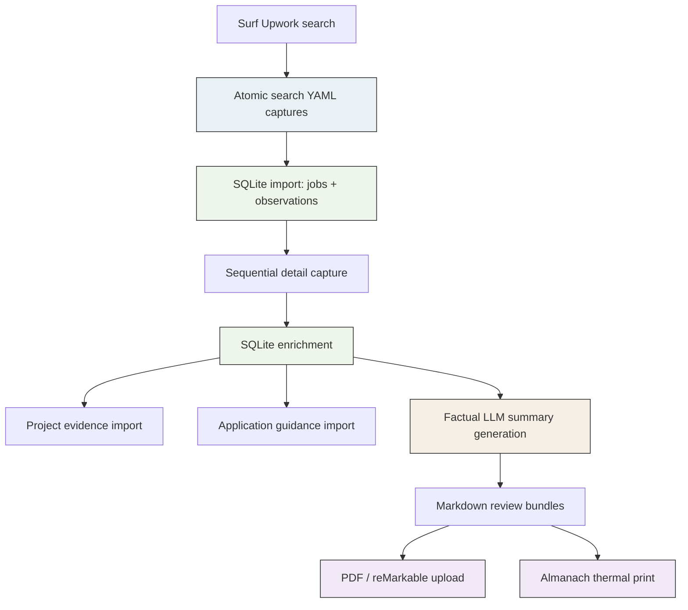

# Upwork Research Workflow: Search, Enrichment, and Deliverable Production

This report documents the Upwork processing workflow built around Surf, a local SQLite tracker, a separate project-evidence catalog, factual LLM summarization, and two delivery channels: reMarkable PDF bundles and Almanach thermal prints. The goal is not merely to store jobs. The goal is to preserve the exact sequence by which jobs are discovered, verified, enriched, summarized, reviewed, and turned into durable artifacts without confusing source evidence with generated interpretation.

The workflow matters because Upwork research contains several boundaries that are easy to blur: a search result is not a detail page, a detail page is not a proposal form, a proposal form is not a submitted proposal, a project tag is not proof of competence, and an LLM summary is not a factual source. The implementation described here keeps those boundaries explicit in code, database structure, and operator-facing playbooks.

> [!summary]
> - Search captures are the primary discovery mechanism. They are authenticated, atomically written, and preserve exact `createdOn`, `publishedOn`, `observedAt`, and raw `posted` labels.
> - Detail captures are a second phase. They enrich descriptions and client data and run sequentially to avoid browser lifecycle races.
> - SQLite is the durable operational source of truth. Markdown reports, PDF bundles, and Almanach printouts are generated views, not the master record.
> - Proposal preparation, project evidence, and application guidance are all stored independently so that later deliverables can be rebuilt from data rather than copied from prose.

## Why this workflow exists

A job-search pipeline that treats every step as “just another scrape” quickly becomes unreliable. It becomes impossible to answer basic questions with confidence:

- When was this listing actually observed?
- Did we see it in one query or several?
- Are we reading the short tile description or the full detail page?
- Which fields came from a proposal form rather than from the listing itself?
- Which portfolio recommendation is direct evidence, which is adjacent evidence, and which is only a future demo plan?
- Was a proposal actually submitted, or only filled as a draft?

A useful system has to preserve the chronology and origin of each fact. Search pages are broad and current, but shallow. Detail pages are richer, but slower and more fragile to automate. Proposal forms reveal Connects, rate defaults, and screening questions, but they are account-mutating surfaces that demand a separate safety boundary. Project evidence is local knowledge, not remote listing data. Generated summaries are a reader aid, not the factual substrate.

The workflow exists to make each of those layers visible and to let an operator or an agent continue work without rediscovering the same boundaries.

## System overview

The workflow has five layers:

1. **Discovery** through current Upwork search pages.
2. **Enrichment** through sequential full-detail job fetches.
3. **Normalization and persistence** into SQLite.
4. **Interpretation** through factual, source-bounded LLM summaries.
5. **Delivery** through Markdown, PDF, and thermal print artifacts.



The repository root is:

```text
/home/manuel/code/wesen/claw-stuff
```

The durable playbook is:

```text
upwork/PLAYBOOK.md
```

The database is:

```text
upwork/upwork.db
```

## Discovery: current searches are atomic source records

The first principle is that search captures are treated as source artifacts. They are not terminal output copied into another file. They are YAML captures written only after the extraction succeeds and an authenticated result set is present.

The wrapper script is:

```text
scripts/capture_upwork_search.sh
```

Its responsibilities are narrowly defined:

- invoke `surf upwork jobs` with machine-readable YAML output,
- write into a temporary file,
- verify that `loggedIn: true` is present,
- verify that at least one `jobId:` row exists,
- move the validated file into place atomically.

This prevents an empty or unauthenticated response from overwriting the last known good capture.

### Search time semantics

The updated `surf upwork jobs` command now emits four time fields with different meanings:

| Field | Source | Meaning |
|---|---|---|
| `createdOn` | hydrated Upwork search data | exact backend creation timestamp |
| `publishedOn` | hydrated Upwork search data | exact backend publication timestamp |
| `observedAt` | Surf | exact UTC extraction time |
| `posted` | visible Upwork tile | relative display label such as `Posted 3 hours ago` |

This separation is essential. `posted` is a UI label and must not be treated as an exact timestamp. `observedAt` is exact, but it is a local observation time, not the job’s publication time. `publishedOn` is currently the best exact publication timestamp exposed in the search-page hydration state.

### Search presets and left-rail filters

The search verb now defaults to **Most Recent** ordering. It also supports named presets and stable left-rail filters whose URL contracts were validated from the live Upwork page.

Common forms are:

```bash
surf upwork jobs --query ESP32
surf upwork jobs --query ESP32 --preset best-matches
surf upwork jobs --query ESP32 --preset us-only
surf upwork jobs --query ESP32 --payment-verified --proposal-count under-5
surf upwork jobs --query ESP32 --client-hires 10-plus --project-length 6-plus-months --hours-per-week 30-plus
```

These filters are not “best effort.” They are only exposed after observing the live checkbox-to-query-parameter mapping. Category, arbitrary client location, and time-zone selectors were intentionally left out because they are lookup-style widgets, not static checkbox contracts.

## Enrichment: detail fetches are a second phase

A search capture is intentionally shallow. It provides current cohort membership, exact backend search timestamps, visible short descriptions, and basic market signals. It is not the right place to get the full client section or the complete description when the tile is truncated.

The detail-capture helper is:

```text
scripts/capture_upwork_job_details.sh
```

It accepts one or more validated search-capture files, extracts unique `(job_id, url)` pairs, and fetches each detail page **sequentially**. A successful result is written as one `<job-id>.yaml` file inside a detail directory. Existing valid files are skipped so a stopped run is resumable.

A typical use is:

```bash
scripts/capture_upwork_job_details.sh \
  --out-dir upwork/live-details-esp32-mcp-ai-2026-07-16 \
  --source upwork/live-search-esp32-2026-07-16.yaml \
  --source upwork/live-search-mcp-2026-07-16.yaml \
  --source upwork/live-search-ai-agent-golang-redis-2026-07-16.yaml \
  --retries 2
```

Thirty unique detail files were produced in that run and then imported. This second phase updated 30 existing jobs in SQLite without disturbing prior workflow state.

### Why detail fetches are sequential

The browser automation boundary is fragile in a specific way: tabs can navigate or close during extraction. This is already manageable for search pages because retries can reopen a fresh search tab. Detail pages are less amenable to unconstrained parallelism because there is no benefit in racing browser lifecycles for a one-row result.

The workflow therefore chooses determinism over speculative concurrency:

```text
for each unique job URL:
    fetch detail page
    validate returned jobId
    write one atomic file
```

This is slower than a best-case parallel scraper, but it is easier to reason about, easier to resume, and easier to hand off to another operator or agent.

## Persistence: SQLite owns the workflow state

The SQLite database is not just a bag of listings. It separates remote observations from local decisions and later enrichments.

The key tables are:

| Table | Role |
|---|---|
| `jobs` | current canonical record per job ID |
| `observations` | search-result observations, one source-path observation per job |
| `job_availability_checks` | later read-only evidence of whether a job still appears live |
| `job_applications` | local application lifecycle state |
| `job_activity` | audit trail of manual or automated local actions |
| `projects` | imported project evidence catalog |
| `job_project_links` | job-to-project recommendation mapping |
| `job_application_guidance` | factual application guidance, drafts, and fresh-demo suggestions |

This model preserves the workflow boundary between “what Upwork showed,” “what we concluded locally,” and “what deliverable we generated later.”

### Upsert rules

Search imports upsert by job ID and append or update `observations`. Detail imports enrich the `jobs` record with richer description and client fields. Proposal-form imports update Connects, application URLs, screening questions, proposal-rate defaults, and template provenance. Availability checks are immutable evidence snapshots, not edits to the job itself.

This means a later search does not create duplicate primary jobs. It creates another observation or updates the latest fact fields while preserving stars, notes, tags, and guidance.

## Project evidence and application guidance

The workflow no longer treats a portfolio recommendation as a free-form paragraph inside a report. Project evidence lives in a separate project index, imported into the tracker. Job-specific guidance then links jobs to evidence rather than copying those decisions into each deliverable by hand.

The project catalog is currently external to the Upwork repository:

```text
/home/manuel/workspaces/2025-12-21/echo-base-documentation/esp32-s3-m5/docs/project-index.yaml
```

Its records include:

- `project_key`
- title and summary
- target/board/tags
- repository evidence
- showcase assessment
- job crosswalk metadata

That index is imported into the Upwork SQLite database, which allows reports and proposal guidance to enumerate direct or adjacent evidence without re-parsing the entire project repository every time.

## Factual LLM summarization

The summarization layer is deliberately constrained. The prompt requires factual extraction only. It explicitly forbids fit scores, portfolio claims, apply/reject recommendations, and invented deliverables. The model produces four sections:

```markdown
## One-line project write-up
## Project points — short original quotes
## Longer project summary
## Stated deliverables and scope language
```

The important operational rule is that the LLM receives only the captured description text for narrative work. The surrounding facts—URL, proposal counts, client statistics, timestamps, availability, and tracker state—come from SQLite and are rendered deterministically.

### Programmatic runner choice

The local Qwen/Ollama path was an experiment. The effective path for this workflow became Pi’s programmatic non-interactive runner with the configured model provider. In practice, each summary generation can be invoked as:

```bash
pi --no-session --no-context-files --no-tools \
  --model umans/umans-glm-5.2 \
  --thinking minimal \
  -p "<one-job factual prompt>"
```

This preserves the factual prompt contract while avoiding local model assumptions. The next optimization step is to use a persistent Pi session with bounded subagent or multi-turn batching rather than one fresh process per job, but the principle remains the same: generated text is a reader aid layered on top of deterministic source facts.

## Deliverables

The system produces three main human-facing deliverables.

### 1. Markdown review bundles

These are source-scoped factual decision sheets. They group jobs captured in one or more search cohorts and render market facts from SQLite next to LLM-generated factual summaries.

Example artifact:

```text
upwork/ESP32-MCP-AI-AGENT-DECISION-SHEETS-2026-07-16.md
```

The generator supports source-path scoping so only jobs from the intended captured cohorts appear in the report. This prevents older unrelated database content from leaking into a current bundle.

### 2. PDF upload bundles for reMarkable

Once a Markdown review bundle exists, it can be sent to the tablet using the existing `remarkable-upload` workflow. The important point is that the PDF is downstream of the Markdown source artifact, which is downstream of the SQLite state, which is downstream of validated captures.

This makes the tablet bundle reproducible rather than hand-assembled.

### 3. Almanach thermal printouts

The Almanach printout is intentionally compact. It does not attempt to print full job descriptions. It prints a ledger: title, relative posting age, engagement terms, live availability, proposal volume, interview count, and last-seen time.

The generator is:

```text
scripts/generate_upwork_almanach_recent_jobs.py
```

It produces a YAML layout that is then sent through the remote Almanach print service. Because the print medium is narrow and the paper is long, the artifact has to be factual and compact. It is a field ledger, not a prose report.

## Third-party agent handoff rules

The system now assumes that another agent or operator may resume the workflow later. The playbook therefore contains explicit entry rules.

A third-party agent must:

1. read `upwork/PLAYBOOK.md` in full;
2. read the active ticket diary;
3. treat SQLite as the durable local state;
4. treat captures as the source artifacts;
5. avoid proposal submission or account mutation unless the exact job and action were explicitly requested.

This matters because handoff failures are often not code failures. They are workflow misunderstandings. A replacement agent that infers too much from filenames or a report header can easily skip the search import, rerun a detail fetch in parallel, or misinterpret a filled draft as a submitted proposal.

### Visible Pi sessions

A reusable tmux runner now starts a visible Pi lead agent with the subagent extension loaded. Its purpose is not novelty. Its purpose is observability and controlled delegation. The operator can attach to the session, inspect subagent progress, and steer it through a file-based message rather than a pasted shell-escaped paragraph.

This is the relevant principle: the parent agent may delegate bounded read-only work, but database writes, commits, uploads, and hardware print actions remain synchronized responsibilities.

## Implementation sequence

A fresh workflow run should follow this sequence:

```text
1. Capture searches atomically.
2. Import search YAML.
3. Triage or at least identify the target cohort.
4. Fetch unique detail pages sequentially.
5. Import detail records.
6. Import project evidence and guidance when needed.
7. Generate factual summaries.
8. Render Markdown review bundle.
9. Produce tablet/PDF and Almanach artifacts.
10. Update the ticket diary and playbook if new constraints were discovered.
```

Pseudocode:

```python
captures = [capture(query) for query in focused_queries]
import_searches(captures)

urls = unique_urls(captures)
details = capture_details_sequentially(urls)
import_details(details)

facts = query_sqlite_for_sources(captures)
summaries = factual_model_extract(facts.descriptions)
markdown = render_markdown(facts, summaries)

upload_pdf(markdown)
print_almanach(facts)
update_ticket_diary()
```

## Failure modes

| Failure mode | Consequence | Mitigation |
|---|---|---|
| unauthenticated search | empty or degraded capture | require `loggedIn: true` before accepting the file |
| search capture failure overwrites a prior good file | loss of source evidence | atomic temp-file write and move only after validation |
| parallel detail navigation | tab lifecycle failures and hard-to-retry mixed results | sequential detail helper with per-job atomic writes |
| mixing source facts with generated facts | inaccurate reports | SQLite facts rendered separately from LLM narrative sections |
| treating `posted` as exact time | false chronology | keep raw `posted`, add `createdOn`, `publishedOn`, and `observedAt` |
| filled proposal treated as submitted | false application state | manual submission policy and separate proposal-form metadata |
| dynamic UI selector guessed as stable API | broken CLI flags | only expose validated parameter contracts |

## Important files

```text
/home/manuel/code/wesen/claw-stuff/upwork/PLAYBOOK.md
/home/manuel/code/wesen/claw-stuff/upwork/upwork.db
/home/manuel/code/wesen/claw-stuff/scripts/capture_upwork_search.sh
/home/manuel/code/wesen/claw-stuff/scripts/capture_upwork_job_details.sh
/home/manuel/code/wesen/claw-stuff/scripts/generate_recent_upwork_decision_sheets.py
/home/manuel/code/wesen/claw-stuff/scripts/generate_upwork_almanach_recent_jobs.py
/home/manuel/code/wesen/claw-stuff/scripts/pi_upwork_tmux_agent.sh
/home/manuel/code/others/llms/pi/nicobailon/surf-cli/go/internal/cli/commands/upwork_jobs.go
/home/manuel/code/others/llms/pi/nicobailon/surf-cli/go/internal/cli/commands/upwork_job.go
```

## Working rules

- Preserve the distinction between discovery, enrichment, guidance, draft filling, and submission.
- Treat `createdOn`, `publishedOn`, `observedAt`, and `posted` as different facts.
- Use search hydration for exact publication chronology and detail pages for richer descriptions and client facts.
- Keep detail enrichment sequential.
- Keep proposal submission manual unless a later workflow explicitly changes that policy.
- Keep reports reproducible from SQLite and source captures.
- Treat dynamic UI selectors as unstable until their URL or API contract is observed and tested.

## Near-term next steps

The strongest next improvement is not another summary template. It is deeper persistence of exact time semantics in the local tracker importer, so `createdOn`, `publishedOn`, and `observedAt` become first-class query fields in SQLite rather than only fields in the search YAML and Surf output. That change would make recent-job queries more precise and would let local reports sort by exact publication time without revisiting the capture file.

A second improvement is to replace one-process-per-job summary generation with a persistent Pi session that accepts bounded batches or supervised subagent work while preserving the same factual output contract. The important constraint is unchanged: the model can summarize, but deterministic code must continue to own selection, validation, rendering, and state transitions.
