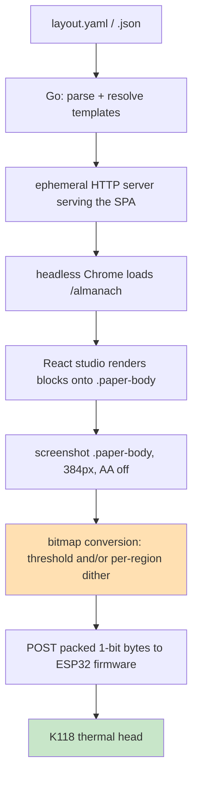
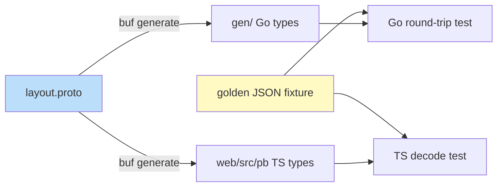
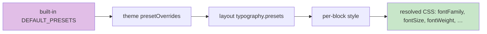
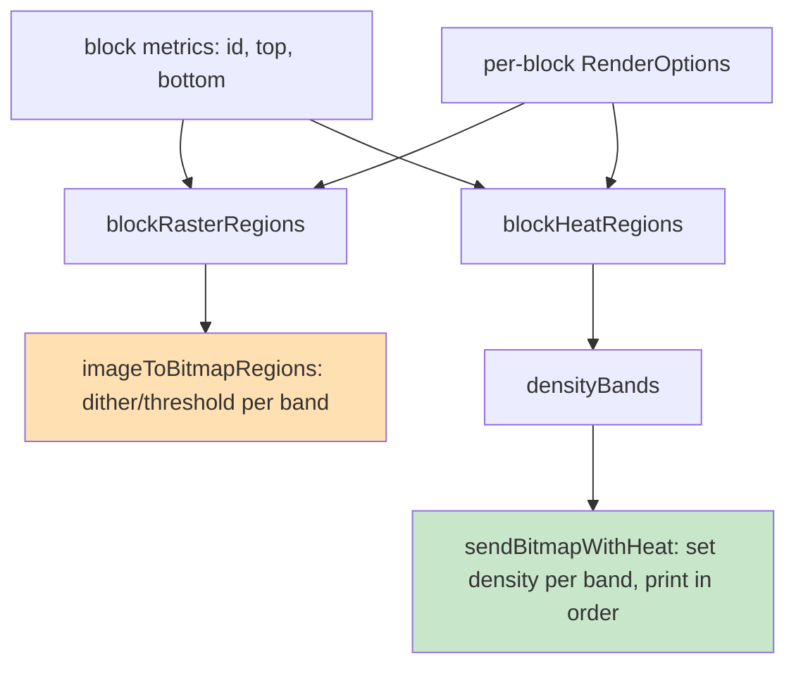

# Almanach Layout DSL v2

Almanach prints small daily "almanach" strips — a title, the date, a word of the day, today-in-history, a quote, a photo — on a 58 mm thermal printer that can only burn a dot or not, 384 dots wide. The layout language that describes those strips was, until this rebuild, an implicit contract living inside one React file: it could say *which* blocks and *which* theme, but almost nothing about typography or rasterization, which are exactly the knobs that decide whether small text survives being reduced to one bit per pixel. DSL v2 rebuilds the language around a protobuf-defined block IR shared by Go and TypeScript, a React renderer registry, typography presets with paper-verified defaults, data-driven themes carrying hinted fonts, typed per-block render options, and block-aware rasterization with per-segment printer heat.

This note explains what was built across the six phases, why each design decision was made, and the non-obvious details that only surfaced while building and printing on real paper. It is written for someone who needs to modify, extend, or reuse the system, not for someone skimming a changelog.

> [!summary]
> - A `.proto` schema is the single source of truth for the layout, code-generated into Go (`gen/`) and TypeScript (`web/src/pb/`); JSON on the wire, camelCase, validated on both sides.
> - Typography is modeled as named presets with a four-layer resolution chain (`default → theme → layout → block`); the built-in defaults bake in the print-legibility recipe so a page prints well with zero configuration.
> - One page can threshold its text (crisp) and Atkinson-dither its photos (tonal), and print each region at its own printer heat, driven entirely by per-block `render` overrides mapped onto per-block bounding boxes.
> - The hard constraints — one bit per dot, a read-only pnpm store, a Buf toolchain without network plugins, an ESP32 that drops connections above ~38 KiB — shaped the implementation as much as the feature list did.

## Why this rebuild exists

The old layout was a YAML/JSON document whose meaning was defined entirely by what `web/src/almanach-studio.jsx` chose to draw. That produced five concrete limitations, and each maps to a phase of the rebuild.

The block vocabulary was a closed set of sixteen bespoke React components dispatched through a bare object map; an unknown `type` either crashed the render or was silently dropped at parse. Typography was baked into the components as literal font sizes (`theme.fs(11)`) with family and weight coming from a hardcoded theme; a layout's only typographic lever was a single global `bodyScale` multiplier. Themes were JavaScript objects compiled into the bundle, so adding or patching one meant editing and redeploying React. Render options were five keys read out of a `map[string]interface{}` by hand-written `intFromRenderOptions`/`stringFromRenderOptions` helpers, with no schema, no validation, and no per-block scope. And the contract itself was implicit: unknown fields vanished without a trace, and Go and the studio shared no types.

Two prior investigations (`ALMANACH-RASTER-LAB` and `ALMANACH-PIXELFONT`) had already established, by printing and reading real paper, exactly which knobs control legibility: bigger sizes, hinted fonts, heavier weight, bold italic for small italic text, Atkinson dithering plus a gamma curve for photographs, and different printer heat for text versus photos. The problem was that none of that recipe could be *written* in a layout. DSL v2 exists to turn that recipe into data.

## The pipeline this plugs into

Nothing about the transport changed; the rebuild changes what the layout can express and how the bitmap is produced. The end-to-end path is:



The React app *is* the renderer; Go hands it a layout and screenshots the result. That is why half of DSL v2 lives in JSX (the registry, presets, themes, block metrics) and half lives in Go (the schema codec, typed render options, the rasterizer, per-segment heat).

## Part 1 — A protobuf block IR shared by Go and TypeScript

The first phase replaces the implicit, React-defined contract with an explicit one both languages import. The schema at `proto/almanach/layout/v1/layout.proto` defines a `Layout` message (paper metadata, a theme reference or inline theme, typography, an ordered list of `Block`, template data, render options, `body_scale`, `margin`), a `Block` (id, dispatch `type`, a `TextStyle` `style`, free-form `google.protobuf.Struct` content, a per-block `RenderOptions`), and the supporting messages `TextStyle`, `Typography`, `Theme`/`ThemeColors`, `RenderOptions`, `EdgeInsets`, plus `TextCase` and `RasterMode` enums. Block content is a `Struct` for now — free-form JSON keyed by the block type's renderer — with the intent to migrate hot block types to typed messages in a `oneof` later.

Two decisions here are worth stating plainly. Block content is deliberately untyped at this stage because the sixteen block payloads are still in flux; forcing them into proto messages now would slow iteration for little gain, and `Struct` round-trips cleanly to a plain JSON object on both sides. And there is a `schema_version` field, normalized to `1` when unset, so a future consumer can gate on it.

### The Buf workspace scoping gotcha

The repository already had a Buf setup under `internal/provisioning/native/proto/` that generates Go only for vendored ESP-IDF protos. A naïve top-level `buf.yaml` would sweep those files into the layout module. The fix is a v2 workspace that scopes itself to `proto/`:

```yaml
version: v2
deps:
  - buf.build/googleapis/googleapis
modules:
  - path: proto
    name: buf.build/local/almanach
```

A consequence of scoping the module to `proto/` is that `paths=source_relative` output has no `proto/` prefix — a file at `proto/almanach/layout/v1/layout.proto` generates to `gen/almanach/layout/v1/`, so `go_package` must be `.../gen/almanach/layout/v1;layoutv1`, not `.../gen/proto/...`. This is easy to get wrong by copying another repo's package line.

### Local plugins, because the network plugins were unavailable

The reference org pattern uses Buf's remote plugins (`buf.build/bufbuild/es`, `buf.build/protocolbuffers/go`). On this machine `buf generate` failed with an invalid API token, so `buf.gen.yaml` uses local plugins instead: `protoc-gen-go` from the Go toolchain and `protoc-gen-es` from `web/node_modules`.

```yaml
version: v2
clean: true
plugins:
  - local: web/node_modules/.bin/protoc-gen-es
    out: web/src/pb
    opt: [target=js+dts, import_extension=none]
  - local: protoc-gen-go
    out: gen
    opt: [paths=source_relative]
```

The `clean: true` line matters later: it wipes the entire output directory on every generate. A hand-written test placed under `web/src/pb/` was silently deleted by the next `make proto`. The rule that came out of that: never put hand-authored files under a Buf `clean:true` output directory. The proto round-trip test now lives at `web/test/`.

### The codec and the wire contract

The Go side wraps the generated types with a small codec (`internal/layoutpb/codec.go`) whose only job is to fix the JSON options so both languages agree on the bytes:

```go
protojson.MarshalOptions{UseProtoNames: false, EmitUnpopulated: false}.Marshal(layout)
// UseProtoNames:false -> camelCase keys, which @bufbuild/protobuf fromJson expects.
```

A single golden fixture (`proto/almanach/layout/v1/testdata/layout_golden.json`) is read by both a Go test (`proto.Equal` round-trip plus field assertions) and a runner-free Node test (`fromJson`/`toJson`). Together they lock the contract: if either side drifts, one of the two tests fails.



One TypeScript detail cost a test failure before it was understood: `@bufbuild/protobuf`'s `tsEnum` strips the common prefix from enum members at runtime, so the value is `RasterMode.THRESHOLD`, not `RasterMode.RASTER_MODE_THRESHOLD`. The JSON wire form keeps the full name (`"RASTER_MODE_THRESHOLD"`), and the generated `.d.ts` shows the full name, but the runtime object uses the short key. There are no `int64` fields in the schema, which avoids the `bigint`/`JSON.stringify` round-trip hazard that the org's transport notes warn about.

## Part 2 — The React renderer registry

With types generated, the second phase replaces the studio's bare `RENDERERS` object with an adapter registry, following the widget-IR pattern from `rag-evaluation-system` but stripped of the interactivity machinery a print DSL does not need. The registry (`web/src/blocks/registry.js`) is deliberately React-free and side-effect-free so it can be unit-tested in plain Node:

```js
export function createBlockRegistry(adapters) {
  const map = new Map();
  for (const adapter of adapters) {
    defineBlock(adapter);                       // validate shape
    if (map.has(adapter.type))
      throw new Error(`duplicate block type "${adapter.type}"`);
    map.set(adapter.type, adapter);
  }
  return map;
}
```

Each of the sixteen existing `*Block` components is wrapped, unchanged, in a `defineBlock({ type, module, render })` adapter, and dispatch goes through a `renderBlock(block, ctx)` helper that looks the type up and falls back to a visible placeholder:

```js
function renderBlock(block, ctx) {
  const adapter = resolveBlockAdapter(ctx.registry, block.type);
  if (!adapter) return <UnknownBlock type={block.type} theme={ctx.theme} />;
  return adapter.render(block.data, { ...ctx, block });
}
```

The behavioral change is small and deliberate: known types render byte-identically to before (verified by rendering the same layout and comparing), while an unknown type now draws a dashed "Unknown block type" box instead of crashing or vanishing. Making the placeholder actually appear required one more change: `parseLayoutJson` previously filtered out any block whose type was not in the known set. That filter was relaxed to keep any block with a string `type`, guarding the `DEFAULTS[type]` lookup for the unknown case. Because both the headless load path (`window.almanachLoadLayout`) and the file-import path funnel through `parseLayoutJson`, the placeholder shows up in the print pipeline too, not only in the editor.

## Part 3 — Typography presets

The third phase is where the print-legibility win lands. Typography is modeled as named presets rather than per-element sizes, resolved through a merge chain. The preset module (`web/src/typography/presets.js`) defines `DEFAULT_PRESETS` — `title`, `sectionLabel`, `overline`, `word`, `metric`, `body`, `bodyStrong`, `emphasis`, `caption`, `small`, `meta` — using the same field names as the proto `TextStyle`, so a decoded layout's presets and per-block styles plug straight in.

The core is `resolveStyle`, which merges layers and produces a concrete CSS object:

```js
export function resolveStyle(name, { presets = {}, theme = {}, bodyScale = 1, overrides = [] } = {}) {
  const layers = [DEFAULT_PRESETS[name] || {}, presets[name] || {}, ...overrides];
  const merged = Object.assign({}, ...layers.filter(Boolean));

  // Only inject a font when the style actually names one — an explicit family
  // or a role. An ad-hoc override with neither must not clobber a font the
  // caller set outside the preset (e.g. the theme-driven <h1> title).
  const font = merged.font || (merged.role ? fontForRole(merged.role, theme) : undefined);

  const css = {};
  if (font) css.fontFamily = font;
  if (typeof merged.size === "number") {
    let size = merged.size * bodyScale;
    if (typeof merged.minSize === "number") size = Math.max(size, merged.minSize);
    css.fontSize = Math.round(size * 10) / 10;
  }
  // weight, lineHeight, letterSpacing(em), textCase→textTransform, italic→fontStyle …
  return css;
}
```

Two details in that function are the result of the design, not incidental. `size` is a *base* value multiplied by `bodyScale`, and `minSize` is an *absolute* floor applied *after* scaling. If the floor were scaled too, it would stop being a legibility guarantee — the whole point is that a preset can never resolve below the size the head can actually render. And the font is injected only when a `role` or explicit `font` is present. An earlier version always derived a font from the role, which meant that spreading an ad-hoc override (with neither role nor font) onto the theme-driven `<h1>` forced the body font and wiped the theme's display font. The title silently changed typeface until that was fixed and a test was added asserting no font is injected without a role or font.

The recipe from `ALMANACH-PIXELFONT` is baked into the defaults: bigger sizes, `minSize` floors, weight 500–700 on body and small text, and — the most important lever — bold italic for the `emphasis` preset used by quotes and notes, because normal italic loses strokes at 1-bit while bold italic survives. Migrating the components meant replacing every inline `theme.fs(n)`/font with a `theme.preset(name, ...overrides)` call; only decorative glyphs (bullets, ornaments) still use `fs()`.

### The resolution chain

By the end of Phase 4 the preset resolution is four layers deep, merged per field so that a theme setting `body.size` and a layout setting `body.weight` both survive:



The per-field merge across the first three layers is done by `mergePresetMaps`, and the per-block layer is applied last inside `resolveStyle`'s `overrides`.

## Part 4 — Data-driven themes and hinted fonts

The fourth phase answers "what does data-driven mean concretely" and closes the font half of the legibility recipe. A theme is now data a layout can carry, not only a compiled JavaScript object. `resolveThemeSpec` accepts either a string (a built-in key) or an inline object that patches a base theme:

```js
function resolveThemeSpec(spec) {
  if (typeof spec === "string")
    return { themeKey: THEMES[spec] ? spec : "classic", patch: null, presetOverrides: {} };
  // object form: base + colors + fontPalette/fontDisplay + presetOverrides,
  // patched over THEMES[base] with no code change
  ...
}
```

The `fontPalette` array maps to `[display, body, mono]` in preference order; explicit `fontDisplay`/`fontBody`/`fontMono` win over the palette; and `presetOverrides` becomes the theme layer of the resolution chain. Two built-in themes, `crisp` (DejaVu Serif) and `crispsans` (DejaVu Sans), use the hinted families that print crisp small.

### Embedding the hinted fonts under a read-only store

The DejaVu families had to be embedded so the studio preview works off the render host. The intended path — subset to WOFF2 with `fonttools` — failed with `ImportError: No module named brotli`, and the machine's pnpm store and `$HOME` are read-only, so `pip install brotli` was not an option. The fallback is WOFF (zlib, no brotli), which after subsetting to the Latin and symbol ranges the almanach uses is roughly four times smaller than the raw TrueType:

```python
subset.main([src, f"--unicodes={LATIN_AND_SYMBOLS}", "--flavor=woff", "--layout-features=*",
             f"--output-file={dst}"])
```

Six faces (DejaVu Serif regular/bold/italic/bold-italic and DejaVu Sans regular/bold) come to about 422 KB of WOFF, ~564 KB base64, appended to `web/src/fonts-embedded.css`. The subset deliberately keeps the punctuation, arrow, math, and dingbat ranges so the decorative glyphs (✦ ❦ ❀ ☾) still render inside DejaVu body text.

The pnpm store itself was a recurring obstacle across the whole project: the global `~/.config/pnpm/rc` points `store-dir` at an archived, read-only workspace, so any install of a *new* package fails with `ERR_PNPM_EROFS`. The workaround is a git-ignored repo-local store, which then makes a plain `pnpm install` error with `UNEXPECTED_STORE` until the same `--store-dir` is passed. This is documented in the repo's memory so future sessions do not rediscover it.

## Part 5 — Typed RenderOptions

The fifth phase replaces the hand-parsed render keys with the typed proto message. `parseRenderOptions` marshals the `render:` map to JSON and decodes it into `layoutv1.RenderOptions` with validation up front, so an out-of-range value is a hard error rather than a silent clamp:

```go
func parseRenderOptions(m map[string]interface{}) (*layoutv1.RenderOptions, error) {
    if len(m) == 0 { return nil, nil }
    raw, _ := json.Marshal(m)
    opts := &layoutv1.RenderOptions{}
    if err := (protojson.UnmarshalOptions{DiscardUnknown: true}).Unmarshal(raw, opts); err != nil {
        return nil, err
    }
    return opts, validateRenderOptions(opts)
}
```

`applyRenderOptions` overlays only the set fields onto the internal `RenderOptions` struct. The presence model is mixed: proto3 `optional` scalars generate pointer fields, so "is it set" is `p.Threshold != nil`, while the `RasterMode` enum is "set" when it is not `UNSPECIFIED`. That mix is the reason the overlay function reads the way it does.

One bug hid behind all of this. The first end-to-end test showed `render.threshold: 90` being ignored and `render.threshold: 300` not erroring. The cause was in `layoutJSONFromObjectOrDefault`: it extracted the `render` block only from the *wrapped* form (`{ layout: {...}, render: {...} }`), so a flat layout's top-level `render:` never reached the parser. The fix adds the flat-form branch and drops the key from the layout sent to the studio:

```go
} else if ro, ok := obj["render"].(map[string]interface{}); ok {
    renderOptions = ro
    delete(obj, "render")   // studio ignores it anyway
}
```

Printer density became a real render option in this phase: `setPrinterDensity` POSTs to the printer's `/api/printer/density` before a print, so "text at density 38" is a layout field rather than a manual `curl`.

## Part 6 — Block-aware rasterization and per-segment heat

The final phase is the one the whole rebuild was building toward: one page can threshold its text and dither its photographs, and print each region at its own heat. This required a real rasterizer, because no dithering code existed in the branch — only a single-threshold `imageToBitmap`.

### The region-aware rasterizer

`imageToBitmapRegions` (`internal/app/rasterize.go`) converts an image to 1-bit, applying each region's technique to its rows and the page default threshold to everything else. The dithering is Atkinson error diffusion, and the single most important implementation detail is that the error is confined to the region's row band. Atkinson diffuses error down and to the right; across a region boundary that would smear a photograph's noise into the text below it. The fix is to dither on a per-band working buffer and clamp diffusion to the band:

```go
func atkinsonBand(img image.Image, black []bool, bounds image.Rectangle, w, ys, ye int, gamma float64) {
    bh := ye - ys
    buf := make([]float64, w*bh)
    for j := 0; j < bh; j++ {
        for x := 0; x < w; x++ {
            buf[j*w+x] = applyGamma(grayAt(img, bounds.Min.X+x, bounds.Min.Y+ys+j), gamma)
        }
    }
    for j := 0; j < bh; j++ {
        for x := 0; x < w; x++ {
            old := buf[j*w+x]
            var newv float64
            if old >= 128 { newv = 255 } else { newv = 0; black[(ys+j)*w+x] = true }
            e := (old - newv) / 8            // Atkinson keeps 6/8 of the error; 2/8 is dropped
            diffuse(j, x+1, e); diffuse(j, x+2, e)
            diffuse(j+1, x-1, e); diffuse(j+1, x, e); diffuse(j+1, x+1, e)
            diffuse(j+2, x, e)               // diffuse() is a no-op outside the band
        }
    }
}
```

Atkinson diffuses only six-eighths of the quantization error and drops the remaining two-eighths, which reads cleaner on a 1-bit head than Floyd–Steinberg's full diffusion. A `gamma` below 1 lifts shadows before dithering so a hot head does not turn a photo into a solid mass.

### Bounding boxes drive the regions

The regions come from per-block bounding boxes. Each block wrapper now carries `data-block-id` and `data-block-type`, and a JS collector measures them relative to the screenshot element:

```js
function collectBlockMetricsJS(selector) {
  return `(() => {
    const root = document.querySelector(${JSON.stringify(selector)});
    if (!root) return [];
    const rootTop = root.getBoundingClientRect().top;
    return Array.from(root.querySelectorAll('.block-wrap[data-block-id]')).map((el) => {
      const r = el.getBoundingClientRect();
      return { id: el.getAttribute('data-block-id'), type: el.getAttribute('data-block-type'),
               top: r.top - rootTop, bottom: r.bottom - rootTop };
    });
  })()`;
}
```

Those measurements are in CSS pixels relative to the screenshot's top, which line up one-to-one with final bitmap rows only because the render runs at device-scale-factor 1 and any supersample downscaling happens *before* the regions are applied — `pngToBitmapSupersampledRegions` downscales first, then rasterizes in final coordinates. `blockRasterRegions` turns a per-block `render` override plus its box into a `rasterRegion` (a block whose override only sets `printerDensity` produces no raster region), and `blockHeatRegions` turns the same into heat bands.



### Per-segment heat

Heat is applied at print time. `densityBands` turns the heat regions into a top-to-bottom cover of every row (regions at their density, gaps at the page default), and `sendBitmapWithHeat` slices the bitmap into those bands, sets the printer density before each, and prints them in order — baking the paper feed into the last band only. The ESP32's firmware sets the head density globally per print command, so the page is genuinely sent as several commands, one per density band, further split to stay under the firmware's ~38 KiB safe receive limit. A mixed test page printed as seven segments: text bands at 38, a photo band at 20, text again at 38.

### The debugging that this phase actually required

Three separate wrong turns are worth recording, because each looked like a bug in the new code and was not.

The first render showed the "dithered" photo as a hard black-and-white split. The cause was a stale SPA bundle: `data-block-id` had been added to the JSX but `web/dist` had not been rebuilt, so `collectBlockMetricsJS` found no blocks, produced no regions, and the code fell back to plain threshold. Any studio JSX change needs `pnpm --dir web build` before a headless render will see it.

After rebuilding, the output still *looked* like a hard split in the image viewer. The resolution was a transitions-per-row count on the raw 1-bit data: 108 black/white transitions per row proved it was dithering; a threshold would have produced a single edge. The image viewer had been down-sampling the fine Atkinson dots into apparent solids. A six-times nearest-neighbor zoom of the mid-tone band showed the halftone clearly.

The third was subtler and is a genuine content interaction: the `image` block's default thermal filter boosts contrast, which pre-binarizes a gradient before the screenshot, leaving the rasterizer nothing to dither. The layout has to set the image's `data.grayscale: false` so its midtones reach the rasterizer.

## Consolidated failure modes

These are the traps that cost time, collected so a future reader can avoid them:

- **Buf `clean:true` deletes hand-written files** under the output directory. Keep tests and fixtures outside `web/src/pb/` and `gen/`.
- **The pnpm store is read-only** in this environment; install into a git-ignored repo-local store with `--store-dir` and `--config.confirmModulesPurge=false`.
- **`tsEnum` strips the enum prefix at runtime** (`RasterMode.THRESHOLD`), even though the JSON and `.d.ts` keep the full name.
- **A flat top-level `render:` was ignored** until `layoutJSONFromObjectOrDefault` learned to extract it, not only the wrapped form.
- **`resolveStyle` must not inject a font** without a role or explicit family, or it clobbers a caller-set typeface.
- **A studio JSX change needs a bundle rebuild** before a headless render observes it.
- **Fine dithering can read as solid** in a down-sampling image viewer; count transitions or zoom with nearest-neighbor to verify.
- **The image thermal filter pre-binarizes gradients**; set `grayscale: false` on an image you want dithered.

## Repository map

| Area | Path | Role |
|---|---|---|
| Schema | `proto/almanach/layout/v1/layout.proto` | Single source of truth |
| Go codec | `internal/layoutpb/codec.go` | protojson camelCase + schema-version normalize |
| Generated Go | `gen/almanach/layout/v1/` | `buf generate` output |
| Generated TS | `web/src/pb/almanach/layout/v1/` | `buf generate` output |
| Registry | `web/src/blocks/registry.js` | type → adapter dispatch |
| Presets | `web/src/typography/presets.js` | preset defaults + resolution |
| Studio | `web/src/almanach-studio.jsx` | renderer, themes, `resolveThemeSpec`, block metrics |
| Fonts | `web/src/fonts-embedded.css` | embedded WOFF incl. DejaVu |
| Render options | `internal/app/renderopts.go` | typed parse/validate/overlay |
| Rasterizer | `internal/app/rasterize.go` | region-aware dither/threshold/gamma |
| Printer | `internal/app/printer.go` | density bands + per-segment send |
| Docs | `internal/app/doc/layout-*.md` | Glazed help entries |

## Testing strategy

The tests are split by where the logic lives and how expensive it is to run. Pure logic is unit-tested with no runner: the block registry, the preset resolver, and the TypeScript decode test all run under plain `node`, and `mergePresetMaps`, `parseRenderOptions`/`applyRenderOptions`, `imageToBitmapRegions`, and `densityBands` are Go table tests. The wire contract is locked by the shared golden fixture read from both languages. Everything that only reveals itself on paper — small-text legibility, the Atkinson halftone, per-segment heat — was verified by rendering through the real headless-Chrome pipeline at 384 px and, for heat and legibility, by printing on the actual K118 head. `make test-web`, `make test-proto`, and `go test ./...` are the entry points.

## Related notes

- [[ARTICLE - Thermal Rasterization - Dithering, Heat, and Bitmap Fonts]] — the paper-evidence investigation whose recipe DSL v2 turns into data.

## Open questions and near-term next steps

- Block content is `google.protobuf.Struct`; migrating hot block types to typed `oneof` messages would make the studio and service agree on payload shapes, not just the envelope.
- Raster regions currently cover the whole block box (label plus content); an image block dithers its label text too. Targeting the `` sub-box would refine this.
- The studio has no typography-editing panel yet; presets are tuned via imported JSON or by editing `presets.js`. A panel would make on-screen iteration faster.
- Inline themes are applied on load but not re-serialized on export; round-tripping them would let the studio round-trip a data-driven theme.

## Project working rule

The studio is the renderer, so any change to how a block looks is a JSX change that must be rebuilt into `web/dist` before the Go pipeline can see it; and any change to the layout's meaning belongs in the proto first, then flows to both languages through `make proto`. Keep the schema authoritative, keep hand-written files out of the Buf output directories, and verify legibility on paper, not only in the screenshot.
