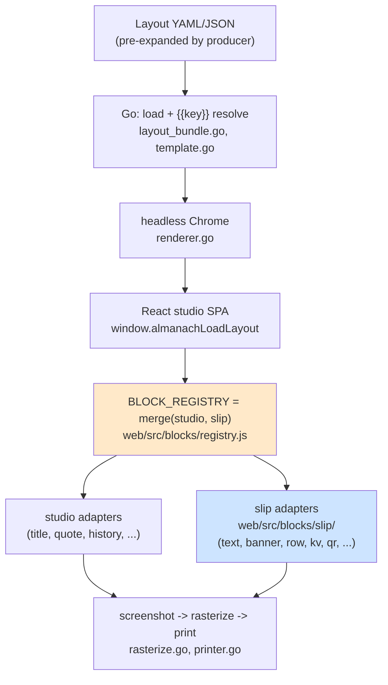
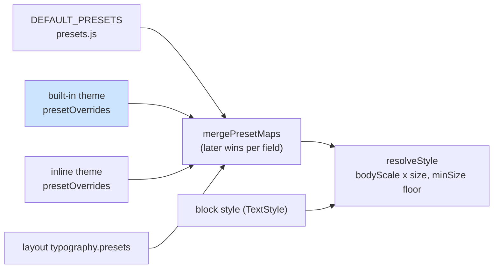

# Almanach Work-Slip Blocks — Brutalist Layout Primitives, Theme Tokens, and Template Hardening

Almanach began as a system for printing small almanac pages — daily plans,
quotes, a word of the day — on a 58 mm thermal receipt printer. This report
documents the ALMANACH-WORKSLIP project, which extended the same pipeline into
a second content domain: work and freelance logistics. The concrete outputs
are twelve generic layout-primitive blocks (rows, key/value tables, checkbox
groups, QR codes, write-in lines), a design-token extension to the theme
model, three bold "work themes" built on an embedded Archivo variable font,
five printable example slips for an Upwork job feed, and the removal of an
environment-variable template feature that turned out to be a genuine
information-disclosure vulnerability. Every piece was verified end to end,
including physical prints on the K118 printer.

The project is a merge in the design sense: a standalone single-file
prototype, `slip-studio.html`, defined the target vocabulary and visual
language, and the work consisted of deciding which of its parts to absorb
into the production pipeline, which to discard, and what the absorption
required of the existing architecture. The report covers those decisions and
their consequences in detail, because most of the engineering interest lies
there rather than in any single block's rendering code.

> [!summary]
> - **Twelve layout primitives** (`text`, `banner`, `rule`, `space`, `row`, `kv`, `list`, `checks`, `writein`, `qr`, `bars`, `table`) join the DSL v2 block registry, styled entirely through typography presets and a new theme design-token layer — no hardcoded look anywhere in the pack.
> - **Two things were deliberately not ported** from the slip-studio prototype: its canvas renderer (the Chrome/CSS pipeline is strictly better) and its template-binding language (`{path|filter}`, `repeat`, `if`) — upstream producers emit pre-expanded JSON instead.
> - **`{{$ENV}}` template resolution was removed** after analysis showed a layout file could self-activate template resolution and exfiltrate arbitrary process environment variables into rendered artifacts — including through the HTTP server.
> - **Look-tuning against physical prints** drove three rounds of default changes (bigger type, zero page padding, a per-theme block gap) and flushed out a silent state-plumbing bug that had been discarding layout margins in every headless render.

## Why this project exists

The Almanach Layout DSL v2 (see [[PROJ - Almanach Layout DSL v2 - Protobuf Block IR, Typography Presets, and Block-Aware Thermal Rasterization]])
produced a protobuf-defined block IR, a React renderer registry, a typography
preset system with paper-verified defaults, data-driven themes, and a
block-aware rasterizer with per-segment print heat. All of its block types,
however, are *content* blocks: a `history` block knows what a year/event pair
is, a `weather` block knows what a sunrise time is. Nothing in the system
could express "two columns, left one bold," "a filled label bar," or "four
checkboxes to tick with a pen."

A separate prototype explored exactly that gap. `slip-studio.html` (a 52 KB
self-contained HTML file) is a receipt-layout IDE aimed at freelance
logistics: job slips for an Upwork feed, triage cards, decision sheets, daily
focus cards, pipeline statistics. Its pages are built from generic
primitives, styled by token-driven themes with a bold Swiss/brutalist visual
language, and populated through a small data-binding language. Its renderer,
by contrast, is a hand-rolled canvas text layout engine with no dithering, no
per-region heat, and CDN-loaded fonts — strictly worse than the production
pipeline on every axis that matters for paper.

The project goal follows directly: keep Almanach's pipeline, absorb
slip-studio's vocabulary and look, and connect the result to the Upwork
research workflow (see [[ARTICLE - Upwork Research Workflow - Search, Enrichment, and Deliverable Production]])
so a scraper or agent can emit a layout and get a physical slip.

## The merge decision

The dissection of the prototype produced a fate table. It is worth recording
because the *discarded* rows carried the important decisions.

| Slip-studio part | What it is | Fate |
|---|---|---|
| Canvas `Renderer` class | Hand-rolled wrapping/measuring on `<canvas>` | **Discarded.** Chrome/CSS is the layout engine; a second text renderer forks behavior. |
| Binding language: `{job.title|upper}`, `repeat`, `if`, `defs/use` | Data-binding mini-language with filters and control flow | **Discarded** by design review. |
| Generic blocks (12 types) | Document layout primitives | **Ported** as React block adapters. |
| Themes (`swiss-black`, `brutalist`, `mono-terminal`) | Token systems: type scale, rule weights, spacing scale, banner style, forced case | **Ported** as built-in themes plus a proto token extension. |
| Example documents (Job Slip, Decision Sheet, Triage Card, Focus Card, Morning Digest) | Work-logistics page designs | **Ported** as pre-expanded example layouts. |
| CDN fonts (Archivo, IBM Plex Mono) and CDN QRious | Runtime network dependencies | **Replaced** with an embedded variable font and a bundled QR module dependency. |
| `dither1bit` | A plain threshold labeled "dither" | **Discarded**; the pipeline has real Atkinson dithering, gamma, and heat bands. |

### Why the binding language was dropped

The initial integration design included a third phase that ported the binding
language: nested path lookup, a filter chain (`|upper`, `|last4`,
`|join(', ')`), and control-flow blocks (`repeat` over arrays, `if/when`,
reusable `defs`). Design review rejected it, for three reasons that
generalize beyond this project.

First, the producers are better at this than the DSL will ever be. The
systems that generate layouts — scrapers, agents, scripts — already have full
programming languages. A filter mini-language is a strictly weaker `jq`, and
`repeat`/`if` are strictly weaker loops. Every capability added to the
binding language duplicates something the producer already has.

Second, Almanach already had a template engine, and two syntaxes in one
document are a hazard. The Go side resolves `{{key}}` / `{{key:fallback}}`
markers from a flat `--data`/`--define` context before the layout reaches
Chrome (`internal/app/template.go`). A second, brace-delimited syntax
resolving *after* it invites double-expansion bugs: a value injected by the
first pass that happens to contain `{...}` would be re-interpreted by the
second.

Third, control flow changes what a layout *is*. Without it, a layout is a
page description — inspectable, diffable, and renderable without evaluating
anything. With it, a layout is a program whose output depends on data, and
every consumer (the studio editor, the metrics collector, the per-block
rasterizer) must either understand evaluation or operate on partially
meaningless input.

The consequence is a producer contract: what slip-studio wrote as

```json
{ "type": "repeat", "bind": "{jobs}", "blocks": [
  { "type": "text", "text": "{index+1}. {item.title}", "style": "h2" } ] }
```

the producer now emits as N concrete blocks. The morning-digest example
(`examples/layouts/14-morning-digest.yaml`) shows the expanded form of
exactly this loop, and serves as the template the Upwork scraper should copy.

### Why the canvas renderer was dropped

The pipeline's defining property is that **the browser is the layout
engine**. Go never measures text; it drives headless Chrome, screenshots a
DOM node, and post-processes pixels (`internal/app/renderer.go`,
`rasterize.go`, `printer.go`). Everything downstream of the screenshot —
supersampling, per-block Atkinson regions, per-segment heat bands, the 38 KiB
firmware chunking — operates on pixels and per-block bounding boxes read from
`data-block-id` attributes. A block implemented as React/CSS therefore
inherits the entire print stack with zero Go changes. A block implemented on
a canvas would re-solve text wrapping (slip-studio's `wrap()` is a greedy
word-breaker with manual ellipsis), disagree with CSS on measurement, and
still need its output composited back into the DOM for capture.

## Phase 1 — removing `{{$ENV}}`: anatomy of a small vulnerability

The template engine supported `{{$NAME}}` and `{{$NAME:fallback}}`, resolved
via `os.LookupEnv`. The removal decision was made on threat-model grounds
before any exploit was demonstrated; writing the regression tests then showed
the exposure was worse than the analysis had assumed.

The analysis: a layout file is passive data. It may arrive from another
person or system — the repo ships a zip-bundle loader
(`internal/app/layout_bundle.go`) precisely so layouts can be passed around.
A layout that names `{{$OPENAI_API_KEY}}` causes the resolved secret to be
baked into every downstream artifact: the rendered PNG, the printed slip, the
`--debug-dir/layout.json` file, and any HTTP response that echoes the layout
JSON. "Render this template someone sent me" becomes "disclose arbitrary
environment variables into shareable artifacts."

The assumed mitigation was that resolution only runs when a CLI data context
is present: `ResolveTemplate` is a no-op for an empty context, and the HTTP
server path passes `nil`. The boundary test disproved the assumption.
`layoutJSONFromObjectOrDefault` (`internal/app/render_oneshot.go`) merges a
layout's **own** top-level `data:` map into the resolution context before
resolving:

```go
// Merge data from wrapped request body into dataCtx.
wrappedDataCtx := dataCtx
if wrappedData, ok := obj["data"]; ok {
    if dm, ok := wrappedData.(map[string]interface{}); ok {
        if wrappedDataCtx == nil {
            wrappedDataCtx = DataContext{}
        }
        ...
```

A layout could therefore *self-activate* template resolution by carrying any
non-empty `data:` map — and this function sits on both the CLI and the HTTP
server code paths. A remote caller who could POST a layout could read the
server process's environment.

The fix is deletion: the `$`-prefix branch in `resolveExpr` is gone, and a
`$`-prefixed expression now behaves like any unknown key (fallback or error).
Two properties are pinned by tests in
`internal/app/template_boundary_test.go`:

- `TestLayoutObject_SelfActivatedDataCannotReadEnv` — a layout carrying its
  own `data:` map and a `{{$SECRET}}` expression errors, and the error string
  must not contain the environment value (an error that echoed the resolved
  value would itself be a disclosure channel).
- `TestLayoutObject_NoContextLeavesMarkersUnresolved` — with no context at
  all, markers pass through verbatim; this is the behavior the server path
  relies on.

The general lesson: "the dangerous feature is gated by a flag" is only a
mitigation if nothing else can set the flag. Here the gate (a non-empty data
context) was writable by the untrusted input itself.

## Phase 2 — the block pack

### Placement in the architecture



The pack lives in `web/src/blocks/slip/` as four modules with a deliberate
purity gradient:

- `tokens.js` — React-free accessors over theme design tokens (spacing, rule
  weights, rule/banner style) plus column-width resolution. Unit-testable in
  plain Node.
- `qr.js` — React-free QR matrix construction over the bundled
  `qrcode-generator` dependency.
- `components.jsx` — the twelve React components. They contain no literal
  sizes or weights for text (everything goes through `theme.preset(...)`) and
  no literal spacing (everything goes through the token accessors).
- `adapters.jsx` — `defineBlock` wrappers, default content per type for the
  editor palette, and palette metadata.

Registration reuses the DSL v2 registry contract unchanged:

```js
const BLOCK_REGISTRY = mergeBlockRegistries(
  createBlockRegistry(BLOCK_ADAPTERS),   // studio content blocks
  createBlockRegistry(SLIP_ADAPTERS),    // work-slip primitives
);
```

`createBlockRegistry` throws on duplicate types, so a collision between the
packs fails at module load rather than by silent shadowing.

### Containment without exposure: the `row` block

`row` is the pack's only container: columns are either a text shorthand or a
nested block list. Nested rendering posed a small architectural question —
the dispatch function `renderBlock` lives in the studio (it needs the
`UnknownBlock` placeholder, a React component), while the registry module is
deliberately React-free. Exposing studio internals to the pack would create a
cycle; duplicating dispatch in the pack would fork the unknown-type behavior.

The resolution is a closure injected into the render context at dispatch
time:

```js
function renderBlock(block, ctx) {
  const adapter = resolveBlockAdapter(ctx.registry, block.type);
  if (!adapter) return <UnknownBlock type={block.type} theme={ctx.theme} />;
  return adapter.render(block.data, {
    ...ctx,
    block,
    renderBlock: (child) => renderBlock(child, ctx),
  });
}
```

A container calls `ctx.renderBlock(child)` and gets full dispatch — including
the placeholder for unknown child types — without importing anything. Note
the recursion passes the *parent* `ctx`, so the child receives its own
`block` reference while sharing theme and registry.

One documented limitation follows from how per-block rasterization works: the
Go side reads bounding boxes from `data-block-id` attributes, and only
`ThermalPaper` stamps those on top-level blocks. Blocks nested inside a `row`
therefore inherit the page's raster/heat treatment. For slips — text and QR
codes, both of which want the plain threshold — this costs nothing.

Column widths mirror CSS Grid's fixed/fractional split without using Grid
(flexbox handles baseline alignment across columns better here):

```js
function colWidthStyle(w) {
  if (typeof w === "number") return { flex: `0 0 ${w}px`, width: w, minWidth: 0 };
  const m = /^([0-9]*\.?[0-9]+)fr$/.exec(w ?? "");
  if (m) return { flex: `${parseFloat(m[1])} 1 0%`, minWidth: 0 };
  return { flex: "1 1 0%", minWidth: 0 };
}
```

`minWidth: 0` appears on every branch because flex items default to
`min-width: auto`, which lets long unbroken content (URLs, job ids) force a
column past its share and push siblings off the paper.

### QR codes on a 1-bit device

The `qr` block replaced slip-studio's CDN dependency with the bundled
`qrcode-generator` package (small, synchronous, returns a module matrix). Two
constraints come from the output device:

1. **Modules must land on integer pixel boundaries.** The rasterizer
   thresholds every pixel to black or white; a module drawn at a fractional
   size produces anti-aliased edge pixels that the threshold resolves
   inconsistently, and a scanner reads the result as damage. The helper
   computes `module = max(2, floor(targetSize / count))` and renders an SVG
   of `count × count` rects with `shape-rendering: crispEdges`, so the final
   size is `count * module` exactly.
2. **Error-corrected payloads shrink modules.** At 384 dots of paper, a
   `size` in the 90–140 px range keeps modules at 3–4 px for a typical URL at
   error-correction level M, which survives both the threshold and the
   printer head. This is stated in the reference documentation rather than
   enforced, since the tradeoff is content-dependent.

The matrix construction is React-free and unit-tested; the test encodes the
QR finder-pattern geometry (dark outer ring at `(0,0)` and `(1,0)`, light
ring at `(1,1)`, dark core at `(2,2)`) — the first draft of the test asserted
`dark(1,1) === true` and failed, which is the correct outcome for a test that
encodes real invariants rather than implementation echoes.

### The editor problem

The studio edits blocks through bespoke form components (`EDITORS[type]`),
roughly 500 lines of hand-built forms for the almanac blocks. Twelve new
forms were out of scope, and for layout primitives a form is arguably the
wrong interface: the JSON *is* the natural representation of a `row`'s
column tree. The pack therefore ships with a generic fallback:

```js
const Editor = selected ? (EDITORS[selected.type] ?? GenericJsonEditor) : null;
```

`GenericJsonEditor` is a textarea bound to `JSON.stringify(data, null, 2)`
with parse-on-keystroke and live apply. The interesting detail is the resync
loop it must break: applying parsed JSON updates the block, which re-renders
the editor with a new `data` prop, which would re-format the textarea under
the user's cursor mid-typing. A `lastEmitted` ref breaks the cycle by
reference identity — if the incoming `data` is the object this editor just
emitted, the resync effect is skipped and the user's formatting survives.

## Phase 3 — theme tokens and the work themes

### Design tokens as schema

Slip-studio's themes are token systems: a type scale, named rule weights
(`hair`/`thick`/`heavy`), a spacing scale (`xs`–`xl`), a banner style, and a
`forceCase` flag. The almanach theme model (colors, font stacks, preset
overrides) had no equivalent, so the proto grew an additive message:

```protobuf
message ThemeTokens {
  map<string, int32> space = 1;   // xs, s, m, l, xl (px)
  map<string, int32> rules = 2;   // hair, thick, heavy (px)
  string rule_style = 3;          // "solid" | "dashed"
  string banner_style = 4;        // "invert" | "outline"
}

message Theme {
  ...
  ThemeTokens tokens = 5;
}
```

Every accessor falls back to pack defaults, so the twelve blocks render
correctly on all pre-existing themes — the token layer is additive in both
the schema sense and the behavioral sense. An inline theme's `tokens` object
replaces the base theme's wholesale (no deep merge); per-name gaps fall back
to the pack defaults, not to the base theme. This is a documented sharp edge
accepted to keep `resolveThemeSpec` simple.

Two sketched token fields were dropped during implementation. `force_case`
turned out to need no mechanism at all: the brutalist theme uppercases
everything by setting `textCase: "upper"` on the affected presets through
`presetOverrides` — same paper output, zero new code paths. This is the
token-system design working as intended: when a "feature" can be expressed as
data in an existing layer, it should be.

### Built-in themes gain preset overrides

The DSL v2 resolution chain was
`defaults ← inline-theme presetOverrides ← layout typography ← block style`,
and *built-in* themes could not participate — only a layout-supplied inline
theme fed the `themePresets` state. The work themes need to restyle shared
presets (brutalist body is uppercase at weight 800; almanac body must remain
untouched), so the built-in entry's `presetOverrides` now merges as the
lowest override layer:



```js
theme.preset = makePresetResolver({
  presets: mergePresetMaps(THEMES[themeKey].presetOverrides, themePresets, typography),
  theme,
  bodyScale,
});
```

The new presets themselves (`display`, `h1`, `h2`, `micro`) carry
**print-ready absolute sizes**, which inverts the almanac convention: almanac
layouts run at `bodyScale` 1.35–1.6 over small base sizes, slip layouts pin
`bodyScale: 1`. Nothing enforces the convention; it is stated in the docs and
followed by every example. The final scale, after two rounds of paper
feedback (below): `display` 50 (brutalist 54), `h1` 33 (brutalist 35,
uppercase), `h2` 24 at weight 800, `micro` 12 tracked uppercase, work-theme
body 15–16.

### The Archivo variable font

Slip-studio loaded Archivo from the Google Fonts CDN — unacceptable for
headless renders, which must be self-contained. The DSL v2 precedent (DejaVu)
required `fonttools` subsetting of system TTFs; Archivo needed none of it,
for a reason worth recording: the Google Fonts css2 API already serves
per-script subset woff2 files, and Chrome loads woff2 natively, so the latin
face can be embedded as a base64 data URI verbatim.

The first download pass fetched weights 400, 700, and 900 and produced three
byte-identical payloads. Archivo is a **variable font**; the API serves the
same file for every requested weight and differentiates only the
`@font-face` declarations. Hashing the payloads (one distinct SHA-256)
confirmed it, and the embedding collapsed to a single face:

```css
@font-face {
  font-family: 'Archivo';
  font-weight: 100 900;   /* variable range — one file serves all weights */
  src: url(data:font/woff2;base64,...) format('woff2');
}
```

This is one third the bytes of the naive embedding, and it is the reason the
brutalist theme can ask for weights 800 *and* 900 without additional cost.
`web/src/fonts-embedded.css` ships verbatim as `web/dist/fonts.css` (103
`@font-face` entries after the addition; the DejaVu faces are split per
unicode-range).

## The look-tuning loop: three feedback rounds and a real bug

The first physical prints prompted iterative feedback: fonts should be
bigger; margins much smaller; "the printout doesn't feel brutalist / bold
enough"; then "0px margin by default, the paper has enough margin already";
then a target mock of the brutalist decision sheet. Each round moved
*defaults*, not example layouts — the point of the preset/token architecture
is that the look lives in theme data.

The final state of the defaults:

- **Page padding.** A new `theme.padding` field resolves as
  `layout margin ?? theme.padding ?? legacy defaults`; the work themes set
  `"0px"`. The physical strip has margin already — the head cannot burn to
  the paper edge — so on-page padding was pure loss.
- **Block gap.** Matching the mock's vertical rhythm exposed that on-paper
  whitespace was the sum of *three* sources: the paper's fixed 14 px flex gap
  between blocks, the capture CSS's `.block-wrap { padding: 4px 0 }`, and the
  layout's explicit `space` blocks. An explicit `space: s` was therefore
  rendering as roughly 38 px. A new `theme.blockGap` token (work themes: 2 px)
  hands the rhythm to the `space` blocks; almanac themes keep the old gap via
  the fallback.
- **Weights and rules.** Brutalist runs nothing under weight 800, uppercases
  the display presets too, and draws its *hairline* at 7 px (heavy: 14 px).
  Banners gained padding and weight 800.

### The `setMargin` bug

The "try one with 0 margins" experiment rendered a page identical to the
default — which is not a styling result, it is a symptom. The headless loader
applies layout state through a ref of setters:

```js
const stateRef = useRef({ blocks, setBlocks, ..., setMargin, flashToast });
stateRef.current = { blocks, setBlocks, ..., setThemePresets, flashToast };  // setMargin missing
```

The `useRef` initializer included `setMargin`; the per-render reassignment —
the one that actually populates `stateRef.current` from the first render
onward — did not. `window.almanachLoadLayout` therefore threw a `TypeError`
at `s.setMargin(...)` on every headless load, inside a `catch` that logged to
a console nobody reads, after most state had already been applied. The
observable behavior: **every headless render silently ignored the layout's
`margin:`** and fell back to theme padding, while browser-side file imports
(a different code path) honored it. The margin feature had been "verified"
through renders that were in fact showing theme defaults that happened to
match.

Beyond the one-line fix, two durable lessons: a duplicated literal object
that must be maintained in two places will eventually diverge (the fix adds a
comment marking the hazard; a follow-up could build the object once); and a
`catch` that only logs, inside a state-application batch, converts hard
failures into plausible-looking output. The diary records this as found by an
unrelated aesthetic experiment — the best argument for actually rendering the
"obvious" cases.

## The example slips and the producer contract

Five layouts under `examples/layouts/` are simultaneously test fixtures,
documentation, and the output templates for the Upwork feed producer:

| File | Theme | Design |
|---|---|---|
| `10-job-slip.yaml` | swiss | Banner header, 3-line h1 title, heavy rule, rate/level row, client caption. |
| `11-decision-sheet.yaml` | brutalist | UPWORK/#3790 header row, h1, uppercase summary, quoted scope points, tag line, kv facts, CONNECTS + star/skip checks. Matches the user's reference mock block for block. |
| `12-triage-card.yaml` | brutalist | Fit rating checks 1–5, action checkboxes, write-in notes, QR to the posting, payment warning banner. |
| `13-focus-card.yaml` | terminal | Weekday h1, "today's one thing," time-slot rows, done-by check. |
| `14-morning-digest.yaml` | swiss | Display weekday, numbered job rows — the pre-expanded form of slip-studio's `repeat`. |

The producer contract, stated once and embodied by the examples:

- Emit final, expanded block lists — the producer performs what the binding
  language would have (`#{job.job_id|last4}` becomes `"#3790"`,
  `{tags|join('  ·  ')}` becomes `"esp32  ·  ble  ·  mqtt"`, conditionals
  become presence or absence of a block).
- Set `bodyScale: 1` and pick a work theme; omit `margin` (edge-to-edge is
  the theme default).
- Budget roughly 2–3 words per h1/h2 line at 384 dots; the `lines:` clamp
  ellipsizes overflow.
- Role selection is `preset: "h1"` in block *data*; the block-level `style`
  remains a TextStyle object (`style: { textCase: upper }`). The two are
  different layers and the string/object distinction is intentional.

All five were verified headless; the job slip, triage card, and decision
sheet were printed on the K118 (density 38; pages taller than the ESP32's
~38 KiB receive limit ship in row segments — the triage card went as two).

## Repository map

| Path | Role |
|---|---|
| `web/src/blocks/slip/{tokens.js,qr.js,components.jsx,adapters.jsx}` | The block pack: token accessors, QR matrix, components, registration. |
| `web/src/blocks/slip/slip.test.mjs` | Runner-free Node tests (tokens, widths, QR geometry). |
| `web/src/blocks/registry.js` | DSL v2 registry (unchanged; `mergeBlockRegistries` was built for this). |
| `web/src/typography/presets.js` | `display`/`h1`/`h2`/`micro` added to `DEFAULT_PRESETS`. |
| `web/src/almanach-studio.jsx` | Registry merge, `ctx.renderBlock`, work themes, `theme.padding`/`blockGap`, `GenericJsonEditor`, the `stateRef` fix. |
| `web/src/fonts-embedded.css` | Archivo variable face appended (data-URI woff2). |
| `proto/almanach/layout/v1/layout.proto` | `ThemeTokens` message; `Theme.tokens = 5`. |
| `internal/app/template.go` | `$ENV` branch removed from `resolveExpr`. |
| `internal/app/template_boundary_test.go` | Env-boundary regression tests. |
| `examples/layouts/10-*.yaml … 14-*.yaml` | The five slips; producer templates. |
| `internal/app/doc/layout-dsl-reference.md` | Work-slip block table, theme tokens, work themes, `$ENV` removal. |
| `internal/app/doc/layout-typography-and-rendering.md` | Work-slip user-guide section. |
| `ttmp/2026/07/16/ALMANACH-WORKSLIP--…/` | Ticket: design guide (also on reMarkable), 8-step diary, changelog, tasks. |

## Consolidated failure modes

1. **Gate writable by the gated input.** Template resolution was "off unless
   a data context exists" — but the layout's own `data:` map created the
   context. The `$ENV` feature was removable; the pattern is worth checking
   anywhere a capability is guarded by state the input can supply.
2. **Duplicated setter lists diverge.** `stateRef.current` reassignment
   dropped `setMargin`; every headless render silently ignored layout
   margins while the browser path worked.
3. **Errors swallowed mid-batch.** The loader's `catch` logged and continued,
   so a thrown setter produced a mostly-correct page instead of a failure.
4. **Variable fonts from Google Fonts.** css2 serves the identical file per
   requested weight; hash before embedding N copies, then declare
   `font-weight: 100 900` once.
5. **Whitespace has multiple owners.** Paper flex gap + capture CSS padding +
   explicit space blocks summed invisibly; tuning any one of them without
   knowing the others is guess-and-check.
6. **Tests must encode invariants, not expectations.** The QR finder-pattern
   assertion that failed (`dark(1,1)`) was wrong about QR geometry, not about
   the code — and the failure improved the test.
7. **Flex `min-width: auto`** lets unbreakable content (URLs, ids) blow out
   fixed column layouts; every generated column style sets `minWidth: 0`.
8. **Stale SPA bundles** remain the classic almanach trap: JSX changes are
   invisible to headless renders until `pnpm --dir web build`.

## Current status and near-term next steps

The ticket is closed: all four phases (hardening, block pack, themes,
examples) are implemented, tested (`go test ./...`, four runner-free Node
suites, lint), documented in the two Glazed help entries, and verified on
paper across three print rounds. Remaining threads, none blocking:

- Point the Upwork scraper at `10-job-slip.yaml`/`11-decision-sheet.yaml` as
  output templates (the `data:` context and `--define` remain available for
  simple value injection).
- Verify on paper that the head reaches the outermost dots of full-bleed
  banners at 0 px padding; if the edge clips, per-theme padding is a one-line
  change.
- Possible `15-pipeline-stats.yaml` exercising `bars` if it proves readable
  at 58 mm.
- Bespoke inspector forms for `kv`/`checks` if JSON editing grates in
  practice; an italic Archivo face if slips ever want italics.

## Related notes

- [[PROJ - Almanach Layout DSL v2 - Protobuf Block IR, Typography Presets, and Block-Aware Thermal Rasterization]] — the architecture this project extends.
- [[ARTICLE - Thermal Rasterization - Dithering, Heat, and Bitmap Fonts]] — why thresholds, dithering, and heat behave the way they do on this printer.
- [[ARTICLE - Upwork Research Workflow - Search, Enrichment, and Deliverable Production]] — the upstream feed these slips exist to print.
