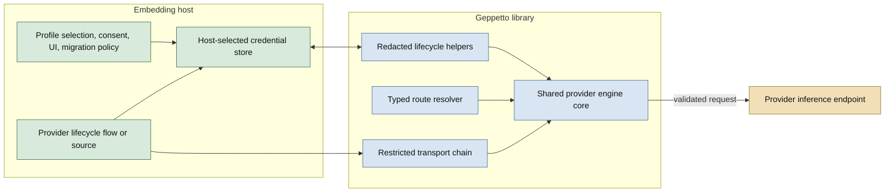
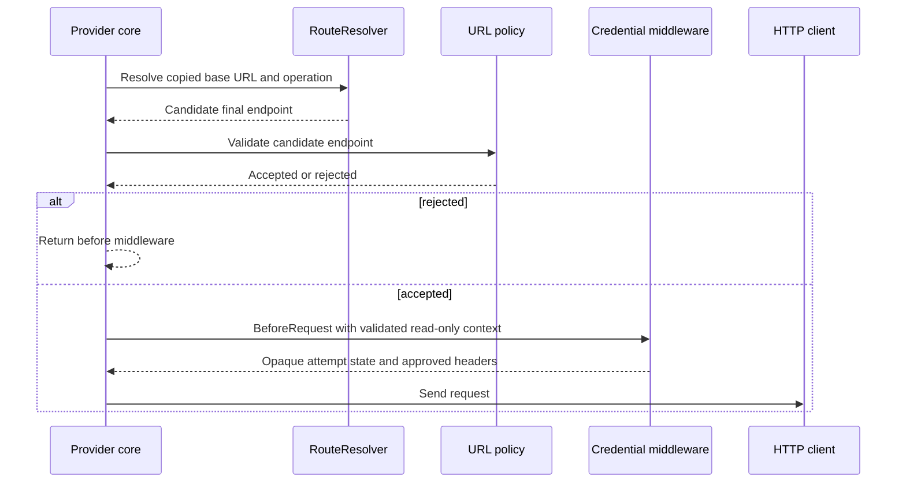

# Geppetto: Provider Credential Lifecycle and Subscription Transport Adapters

Pull request #395 extends Geppetto from a renewable bearer consumer into a provider-aware credential and transport foundation. The work began with a narrow question: can a host reuse credentials already managed by Pi-like clients for subscription providers without putting those credentials into Geppetto profiles, JavaScript, logs, or generic HTTP hooks? The answer required more than adding another token source. It required a strict separation between credential acquisition, endpoint routing, provider-specific headers, lifecycle inspection, and stream/retry ownership.

The PR was merged into `main` as `46fc8d34`, rebased locally on `origin/main`, and released as `v0.13.7`. The implementation was validated with fake transports and local tests. No real provider account was used, and no credential-bearing value was copied into the source tree, ticket documents, tests, logs, or this report.

This report explains the reasoning and implementation in execution order. It is a companion to [[PROJECT REPORT - Geppetto - Renewable Bearer Credentials and Host-Owned OAuth Refresh]], which covers the earlier renewable-bearer and JavaScript host-injection work. PR #395 builds on that boundary rather than replacing it.

> [!summary]
> - Geppetto gained a restricted Go-only transport seam: typed route resolution, final-URL validation before credential acquisition, allowlisted header injection, body-free response classification, and core-owned bounded replay.
> - OpenAI Codex is implemented as a typed adapter over the shared OpenAI Responses core. Its route is now restricted to the canonical ChatGPT Codex base before any credential middleware executes.
> - Claude and Umans are represented as different Anthropic Messages authentication modes. Anthropic subscription OAuth uses bearer plus Claude Code identity headers; Umans uses an API-key-based dual-auth gateway form and is not treated as renewable OAuth.
> - Lifecycle primitives provide redacted status, local logout, static-key adaptation, and constant-time OAuth state validation without making Geppetto discover host storage or provider profiles.
> - The merged release is offline-contract tested. Live provider smoke, automatic Pi migration, and provider revocation remain explicit policy-gated work outside this PR.

## 1. The starting point: a bearer is not a provider transport

The work followed an earlier Geppetto change that introduced host-owned renewable bearer credentials. That earlier design solved a real lifecycle problem: access credentials expire, refresh credentials can rotate, concurrent requests can discover expiry at the same time, and a host needs a request-time source rather than a static string in `InferenceSettings`. The source boundary was intentionally narrow. It returned a bearer for a known provider request and kept persistence and refresh policy in host code.

That boundary is correct for an OpenAI-compatible service whose complete authentication contract is effectively:

```text
validated endpoint + JSON request body + Authorization: Bearer <runtime value>
```

It is not sufficient for all subscription providers. A provider may require a different endpoint path, an account-related header, a provider-specific originator header, an Anthropic Messages request instead of an OpenAI request, or a special authentication mode in which the same runtime value must appear in two different headers. A provider record shaped like an OAuth record does not define any of those transport semantics.

The investigation therefore separated four questions that are often incorrectly collapsed into one:

1. **How is a credential acquired or refreshed?** This is the lifecycle question.
2. **Which endpoint receives the request?** This is the route question.
3. **Which provider headers are required?** This is the authentication and protocol question.
4. **Who owns request bodies, response bodies, streams, retries, and cancellation?** This is the engine-core question.

PR #395 implements the reusable pieces without allowing one layer to take authority from another.

## 2. Evidence and scope

The ticket `GEPPETTO-PI-SUBSCRIPTION-CREDENTIAL-ADAPTERS` began as an investigation of installed Pi provider implementations and Geppetto’s existing inference paths. The ticket’s source map and diary distinguish evidence from assumption. Pi’s installed code was used to establish request shapes and authentication modes, but no local credential store was copied and no real provider request was attempted.

The relevant classifications were:

| Provider path | Credential behavior observed | Inference protocol | Geppetto treatment in PR #395 |
| --- | --- | --- | --- |
| OpenAI Codex | Renewable subscription OAuth with provider-specific metadata | ChatGPT backend Codex Responses path | Typed route and credential middleware over Responses |
| Anthropic subscription | Renewable OAuth | Anthropic Messages | Explicit Claude OAuth bearer mode |
| Umans | API key persisted in OAuth-shaped fields with no-op refresh | Anthropic Messages | Static-key provider adapter with dual authentication |

The distinction between the last two rows is central. An API key stored under fields named `access` and `refresh` is still an API key when the provider implementation returns it unchanged from refresh. Treating it as renewable OAuth would create false lifecycle guarantees and encourage the wrong retry behavior.

The PR’s production scope is Geppetto. Pinocchio storage binding and command-line integration were developed alongside the ticket in the Pinocchio repository, but they are not files in PR #395. The host boundary is discussed here because it explains why the Geppetto APIs are shaped the way they are.

## 3. Ownership boundaries

The architecture assigns authority according to the information each layer must possess.



The host owns the location and policy of persistent credential state. It decides whether the state lives in direct YAML, a keychain, a database, or another store. It chooses the selected provider profile, presents a browser or device code, asks for consent, and decides whether an explicit Pi import is permitted. These decisions cannot be made by a reusable inference library without coupling that library to one application’s file layout and interaction model.

Geppetto owns reusable mechanics. It provides lifecycle inspection, local deletion through a host-provided capability, OAuth state generation and validation, static-key adaptation, route validation, header policy enforcement, request/response middleware ordering, and provider-specific adapters. It does not discover a credential path or silently reuse a Pi login.

The engine core owns HTTP behavior. It constructs request bodies, validates final URLs, creates HTTP requests, closes response bodies, determines whether a stream has started, replays a request at most once when permitted, and decodes the response stream. Middleware can classify a response, but it cannot execute the retry itself.

This partition is a security property. If a provider adapter could choose both the destination and the credential after URL validation, a malformed profile or compromised configuration could redirect a subscription credential to an arbitrary host. If middleware owned stream consumption, it could make retry boundaries dependent on provider code rather than on the shared engine’s well-tested semantics.

## 4. The restricted transport contract

The new package `pkg/steps/ai/transport/transport.go` is the foundational implementation in the PR. It is separate from Geppetto’s inference-turn middleware. Inference middleware transforms turns and events. Provider transport middleware executes inside an already selected provider engine and controls a much smaller surface.

### 4.1 Route resolution happens before credentials

A provider adapter implements `RouteResolver`:

```go
type RouteResolver interface {
    Resolve(RouteRequest) (*url.URL, error)
}
```

`RouteRequest` contains a copied base URL and an operation name. The resolver can construct a provider-specific endpoint, but it cannot mutate the caller’s URL. The core then calls `ResolveAndValidate`:

```go
func ResolveAndValidate(
    provider, operation string,
    baseURL *url.URL,
    resolver RouteResolver,
    validate URLValidator,
) (RequestContext, error)
```

The sequence is fixed:



`RequestContext` stores private provider, operation, and URL fields. Its getters return values or URL copies. Middleware cannot alter the final target through the context it receives.

### 4.2 Header injection is allowlisted

Middleware receives a `HeaderWriter`, not an `*http.Request`:

```go
type HeaderWriter interface {
    Set(name, value string) error
}
```

The engine constructs a `HeaderSet` from declared `HeaderRule` values. The set canonicalizes header names with `http.CanonicalHeaderKey`, rejects duplicate rules, blocks host and framing headers, rejects CR/LF values, and refuses a second middleware from overwriting an existing header with a different value.

The blocked names include `Host`, `Content-Length`, `Connection`, `Transfer-Encoding`, `Trailer`, `Te`, `Upgrade`, and `Proxy-Connection`. This list is not a convenience restriction. These fields affect routing, framing, connection management, or proxy behavior and therefore must remain under core/HTTP-client control.

Sensitive headers are declared as such. `RedactedCopy` returns a diagnostic header map in which sensitive values are replaced with a fixed redaction marker while ordinary provider headers remain visible. The Responses debug tap uses this copy, so request observability does not become a credential output path.

### 4.3 Response middleware classifies; the core retries

The response side receives only bounded, body-free metadata:

```go
type ResponseMetadata struct {
    StatusCode    int
    StreamStarted bool
    RetryEligible bool
}

type ResponseDecision uint8

const (
    Continue ResponseDecision = iota
    Retry
)
```

`Middleware.AfterResponse` can request `Retry`, but it cannot close the body, read the body, replay the request, or decode the stream. The engine makes the retry decision in the context of its own attempt limit and stream state.

The chain executes request hooks in registration order and response hooks in reverse order. This gives the middleware collection nested semantics while preserving one common replay policy. The chain carries an opaque `AttemptState` collection so an individual middleware can retain request-local state across a replay without putting replacement credentials on an engine-global object.

The tests in `pkg/steps/ai/transport/transport_test.go` verify:

- resolver input and request-context URLs are copied rather than shared;
- URL validation occurs before the request context is returned;
- only declared headers can be written;
- host and framing headers are blocked;
- sensitive values are redacted;
- conflicting writes are rejected without putting the conflicting value in an error;
- request and response ordering is stable;
- mismatched attempt state and unknown response decisions fail closed.

An early test exposed a concrete canonicalization defect. `net/http` canonicalizes `TE` as `Te`, while the blocked-header map initially used `TE`. The test accepted a header that the policy intended to prohibit. The map was changed to the canonical spelling, and normal and race tests were rerun. The lesson is direct: security policy must use the same normalization rules as the API it protects.

## 5. Wiring the Responses core

The shared OpenAI Responses engine now accepts a Go-only `RequestTransport` configuration:

```go
type RequestTransport struct {
    Provider             string
    RouteResolver        transport.RouteResolver
    HeaderRules          []transport.HeaderRule
    Middlewares          []transport.Middleware
    DisableDefaultBearer bool
}
```

The engine still has a default route and ordinary bearer middleware. The new configuration replaces or extends those parts only when an explicit typed option is installed. It cannot be represented in `InferenceSettings`, profile YAML, or JavaScript values.

`newRequestTransport` performs the following operations:

1. Parse the configured Responses base URL.
2. Choose the default or typed route resolver.
3. Resolve the final operation-specific route.
4. Validate the final route with the existing outbound URL policy.
5. Copy header rules and middleware configuration.
6. Install ordinary bearer middleware unless the typed adapter explicitly disables it.
7. Build the transport chain.

The default bearer path was moved into transport middleware without changing its contract. It still resolves a request-time bearer, adds `Authorization`, and may request one forced refresh after an eligible pre-stream `401`. The replacement is held in the replay-local `responsesBearerAttempt`, not on the engine or middleware configuration.

### 5.1 Request and replay sequence

The streaming path in `pkg/steps/ai/openai_responses/streaming.go` owns the loop:

```go
func openResponsesStream(
    ctx context.Context,
    httpClient *http.Client,
    requestTransport responsesRequestTransport,
    body []byte,
    tap engine.DebugTap,
) (*http.Response, error) {
    var previousAttempt transport.AttemptState
    for attempt := 0; ; attempt++ {
        resp, attempts, err := openResponsesRequest(
            ctx, httpClient, requestTransport, body, previousAttempt, tap,
        )
        if err != nil {
            return nil, err
        }
        decision, err := requestTransport.chain.AfterResponse(
            ctx,
            requestTransport.request,
            attempts,
            transport.ResponseMetadata{
                StatusCode:    resp.StatusCode,
                RetryEligible: attempt == 0,
            },
        )
        if err != nil {
            _ = resp.Body.Close()
            return nil, err
        }
        if decision == transport.Retry && attempt == 0 {
            _ = resp.Body.Close()
            previousAttempt = attempts
            continue
        }
        if resp.StatusCode >= 200 && resp.StatusCode < 300 {
            return resp, nil
        }
        return nil, responsesHTTPError(resp, tap)
    }
}
```

The exact implementation retains the existing error and stream handling around this loop. The important invariants are visible in the structure:

- the body is prepared once and reused for a permitted replay;
- the first response body is closed before retry;
- only the first attempt is retry-eligible;
- a response must be successful before stream decoding begins;
- once the core returns a successful response, middleware no longer controls the stream.

The debug tap receives `redactedResponsesRequestForDebug`, not the live header map. This prevents a debug observer from seeing the bearer or provider account header even though the actual HTTP request contains them.

## 6. Codex: a typed adapter, not a configurable OpenAI endpoint

The new package `pkg/steps/ai/providers/openaicodex` contains a typed credential and a typed `RequestTransport` constructor. The adapter disables the ordinary bearer middleware and installs its own middleware through trusted Go code.

```go
type Credential struct {
    BearerToken string
    AccountID   string
}

type Source interface {
    Credential(context.Context, credentials.Request) (Credential, error)
}

type UnauthorizedSource interface {
    Source
    CredentialAfterUnauthorized(
        context.Context,
        credentials.Request,
        Credential,
    ) (Credential, error)
}
```

The credential structure is private runtime material. It is not a settings type, a profile type, a JavaScript type, or a logging type. The source returns it only to the adapter after the route has passed validation.

The Codex adapter installs rules for the authorization header, account header, originator, Responses beta header, and optional user agent. The authorization and account headers are marked sensitive. The middleware obtains the current typed credential, writes the provider-approved headers, and returns an opaque attempt containing the credential used for that request.

After a first eligible unauthorized response, the middleware asks an `UnauthorizedSource` for a replacement. It stores that replacement on the attempt associated with this request. The replay gets the replacement; a concurrent request has a different attempt object and cannot observe or mutate it.

### 6.1 The P1 review finding: canonical host restriction

The first PR implementation correctly used the shared URL validation order but still allowed the configured Responses base URL to determine the Codex host. The generic outbound policy permits public HTTPS hosts. That was too broad for a subscription credential adapter: a profile setting such as an arbitrary public collector endpoint could cause the Codex middleware to send its bearer and account header there.

The review finding was addressed in commit `9d4a949c`. `Route.Resolve` now rejects any base URL that is not the canonical Codex target. It requires:

- HTTPS;
- the exact `chatgpt.com` host;
- the `/backend-api` base path, with an optional trailing slash normalized away;
- no explicit port;
- no userinfo, opaque component, raw path, query, fragment, or forced query.

The route then constructs `/backend-api/codex/responses` and clears URL components that could otherwise survive route construction. This is stricter than generic public-HTTPS validation because the adapter has a provider-specific credential destination.

The regression tests cover alternate hosts, plain HTTP, different paths, query strings, and explicit ports. A core-level test configures a non-canonical target and asserts that inference fails before the credential source is called. That last assertion is the important one: rejecting the route is not enough if credential acquisition happens first.

The resulting trust order is:

```text
profile base URL
  -> Codex route canonical-host check
  -> final URL construction
  -> generic outbound URL validation
  -> credential source lookup
  -> allowlisted header injection
  -> HTTP request
```

This finding changed the adapter from “typed headers on a validated public URL” to “typed headers on one provider-approved URL.” The latter is the correct model for a subscription transport.

### 6.2 Why the shared Responses core remains useful

Codex does not receive a dedicated copy of the Responses engine. The shared core continues to own JSON request serialization, HTTP client invocation, context propagation, body closure, pre-stream replay limits, SSE consumption, event processing, and error handling. The Codex package owns only the differences that the provider contract requires: route, credential shape, headers, and forced-refresh classification.

This prevents the security and reliability fixes in the Responses core from diverging between ordinary OpenAI and Codex paths. It also keeps the adapter small enough that a future provider audit can inspect all provider-specific credential behavior in one package.

## 7. Lifecycle primitives

The new `pkg/steps/ai/credentials/lifecycle.go` file adds lifecycle operations that do not require Geppetto to discover storage or provider policy.

### 7.1 Redacted status

`StatusOf` loads a credential through a caller-provided `Store` and returns a state classification without returning token material. The states are `missing`, `ready`, `expiring`, and `expired`. The result also indicates whether the stored tuple has renewable material and may carry an expiry timestamp for host presentation.

The function normalizes store failures to a redacted `ErrUnavailable` operation category. It does not include the original store error, serialized credential, path, or provider response in the returned error. The host can display a useful failure category without turning storage diagnostics into a secret channel.

The state calculation is deterministic relative to an injected `now` and refresh skew:

```text
no access value                  -> missing
no expiry                        -> ready
now >= expiry                    -> expired
now + refresh skew >= expiry    -> expiring
otherwise                       -> ready
```

Injecting `now` makes the state machine testable without relying on wall-clock timing. Injecting the skew keeps presentation policy explicit rather than hiding it in a CLI command.

### 7.2 Local logout is not provider revocation

`Logout` requires the host store to implement the optional `credentials.Deleter` interface. It invokes local deletion and normalizes deletion errors. It does not call a provider endpoint, because revocation semantics vary by provider and may require client authentication, a provider-specific endpoint, or an account-level policy decision.

This distinction prevents a command named “logout” from silently claiming that a remote subscription credential has been revoked when it has only removed the host’s local copy. Provider revocation remains a separate future capability.

### 7.3 Static bearer adaptation

`StaticBearerTokenSource` adapts one explicitly supplied static key to the existing request-time `BearerTokenSource` interface. This is used for static-key gateway modes such as Umans, where the value must remain Go-only but does not need refresh or expiry coordination.

The constructor rejects an empty value. The source retains no provider metadata. The caller remains responsible for not placing the value in settings, logs, or JavaScript. This adapter is intentionally not a credential store and does not imply renewable behavior.

### 7.4 OAuth state

`pkg/steps/ai/credentials/oauth/state.go` adds two small primitives:

```go
func NewState() (string, error)
func ValidateState(expected, received string) error
```

`NewState` generates 32 random bytes and encodes them with unpadded URL-safe base64. `ValidateState` rejects empty values and compares expected and received states with `subtle.ConstantTimeCompare`. Errors do not include either state value.

The host still owns the pending-login record, exact redirect URI, browser/device-code interaction, and callback listener. These functions provide reusable cryptographic mechanics without choosing a storage path or launching a user interface.

## 8. Anthropic Messages: explicit authentication modes

Claude required a different implementation path because Geppetto’s Claude client already speaks an Anthropic-style Messages protocol but previously treated authentication as a static API key. The PR adds runtime credential resolution and two explicit header modes.

### 8.1 Umans dual authentication

The Umans extension evidence established an Anthropic Messages endpoint and an API-key prompt with no-op refresh. The installed client sends the gateway key in both `x-api-key` and `Authorization: Bearer ...`, alongside `anthropic-version`.

`pkg/steps/ai/providers/umans/umans.go` exposes:

```go
func ClaudeOptions(apiKey string) ([]claude.EngineOption, error)
```

The function creates a static bearer source and returns a Go-only Claude option. It does not place the key in `InferenceSettings` or expose it to JavaScript. The Claude client’s ordinary non-OAuth mode sends `x-api-key` and adds `Authorization` only when the explicit bearer authorization option is present.

The fake-server test checks the path, request body shape, API-key header presence, bearer header presence, and Anthropic version header. The body and headers in the test are inspected structurally; no credential value is persisted in the repository.

### 8.2 Anthropic subscription OAuth

The installed Pi Anthropic implementation established a different mode. It uses bearer authorization plus Claude Code beta and identity headers and does not send `x-api-key`. Geppetto therefore adds `SetOAuthBearerAuthorization`, a distinct engine option, and a distinct token-count option.

The OAuth mode sets:

- `Authorization` with the request-time bearer;
- the approved Claude Code beta header value captured from the installed implementation;
- Claude Code user-agent identity;
- `x-app: cli`;
- `anthropic-version` and JSON content type.

The key design rule is that OAuth mode is not inferred from a token string, endpoint, or model name. The mode is selected by a typed Go option. This prevents an Umans API key from silently switching to bearer-only OAuth semantics and prevents a subscription token from being sent as `x-api-key`.

The API client preserves the existing API-key mode separately:

```go
func (c *Client) setHeaders(req *http.Request) {
    if c.oauthMode {
        req.Header.Set("Authorization", "Bearer "+c.bearerAuthorization)
        // Claude Code identity and beta headers are set here.
    } else {
        req.Header.Set("x-api-key", c.apiKey)
        if c.bearerAuthorization != "" {
            req.Header.Set("Authorization", "Bearer "+c.bearerAuthorization)
        }
    }
    req.Header.Set("anthropic-version", c.APIVersion)
    req.Header.Set("Content-Type", "application/json")
}
```

The string values in the source are provider protocol constants. Runtime credential values remain private and are not reproduced here.

### 8.3 Request-time Claude inference

`ClaudeEngine` now holds a Go-only bearer source and an OAuth-mode flag. At inference time it resolves the source after reading the configured base URL and before constructing the client. When a source is present, the source result becomes the runtime credential and an empty result fails the request. The existing static-key path remains available when no source is installed.

The engine always drives the Anthropic Messages streaming path for inference. It forces the request into SSE mode because the stream merger requires the event protocol and a non-streaming response would not produce the expected message-start sequence. Authentication is applied once to the client before `StreamMessage` executes, while the existing stream merger continues to own event reduction, metadata synchronization, tool-call construction, and cancellation behavior.

### 8.4 Request-time token counting

Token counting is a separate outbound path. A credential option added only to streaming inference would leave `/v1/messages/count_tokens` using a stale static key or no credential at all. The PR updates `TokenCounter` and `tokencount/factory` so Claude token counting can resolve a host source and apply the same explicit OAuth header mode.

The token-count path now follows the same conceptual sequence:

```text
build Messages count request
  -> resolve base URL
  -> obtain host-injected source credential when configured
  -> select explicit API-key or OAuth header mode
  -> validate outbound URL
  -> call count-tokens endpoint
```

The factory’s source-aware constructor is `NewFromSettingsWithBearerTokenSource`. For Claude, a configured source selects the OAuth token-count option. Provider-specific static Umans construction remains explicit through `umans.ClaudeOptions` and direct engine options.

The implementation and tests treat inference and token counting as separate paths that must be reviewed together. That is the relevant correctness property: a host should not be told that Claude subscription authentication is supported while one of the provider’s request types still relies on a static profile key.

## 9. Factory propagation and compatibility

`StandardEngineFactory` now stores an optional `BearerTokenSource` and appends provider-specific options during engine construction.

For OpenAI Chat and OpenAI Responses, the source is passed through the existing bearer options. For Claude, the factory uses the OAuth bearer option because a source attached at the generic factory boundary represents subscription-style runtime authentication in that path. Gemini remains unchanged and does not receive the source.

Validation preserves compatibility rules:

- without a source, OpenAI-compatible providers still require the existing static API-key setting;
- with a source, the source is authoritative and the static key may be absent;
- Responses aliases retain their existing fallback key handling when no source exists;
- provider-specific base URL requirements remain in force.

This is a construction-time security rule. A configured source is not a hint to try first; it is the authority for the request. Falling back to a stale static key after a source fails would undermine the host’s decision to use renewable or provider-specific credentials.

The factory’s option propagation also preserves the Go-only boundary. The source is available to trusted engine code after construction, not through profile settings or a JavaScript object. The earlier JavaScript injection implementation remains the host integration path described in the companion report.

## 10. Tests as executable contracts

The PR’s tests are not only unit tests for helper functions. They define the boundary conditions under which provider-specific credential support is allowed to exist.

### 10.1 Transport tests

The transport tests exercise URL-copy behavior, final URL validation, header policy, redaction, write conflicts, reverse response ordering, and invalid middleware state. They use fake route resolvers and middleware functions so no provider call is needed.

The important negative cases are as valuable as the positive cases:

- middleware cannot set undeclared headers;
- middleware cannot set `Host` or framing headers;
- a conflicting header write fails without echoing the attempted value;
- an invalid response decision fails rather than being interpreted as a retry;
- a route rejection prevents a request context from reaching middleware.

### 10.2 Codex fake transport

`codex_test.go` uses a fake HTTP round tripper and a fake typed source. It verifies the Codex endpoint path, required header names, first-attempt versus replay state, one forced refresh, and redacted diagnostic copies.

The review-driven regression test configures a non-canonical public host and counts source invocations. The expected result is an inference error with zero credential lookups. This is the strongest test for the original finding because it proves both destination rejection and credential-release ordering.

### 10.3 Anthropic and Umans contract tests

The Claude API tests use `httptest` for the Anthropic Messages request. They inspect method/path and request-body structure, then verify the two separate header modes:

| Mode | `x-api-key` | `Authorization` | Claude Code headers |
| --- | --- | --- | --- |
| Umans gateway | Present | Present | Not selected as OAuth mode |
| Anthropic subscription OAuth | Absent | Present | Present |

The tests also check the Anthropic version header. This prevents a future refactor from reducing both modes to a single “token” variable whose header placement depends on accidental construction order.

### 10.4 Lifecycle and OAuth state tests

Lifecycle tests cover missing, ready, expiring, and expired classifications, store failure normalization, local deletion capability, and empty static credential rejection. OAuth tests cover generated state shape and acceptance/rejection of matching and mismatching callback values without printing either state.

### 10.5 Validation commands

The final implementation was validated with the following categories:

```bash
GOWORK=off go test ./... -count=1
GOWORK=off go test -race ./pkg/steps/ai/transport \
  ./pkg/steps/ai/openai_responses \
  ./pkg/steps/ai/providers/openaicodex \
  ./pkg/steps/ai/claude \
  -count=1
make lint
GOWORK=off make gosec
GOWORK=off govulncheck ./...
docmgr doctor --ticket GEPPETTO-PI-SUBSCRIPTION-CREDENTIAL-ADAPTERS --stale-after 30
```

The repository pre-commit and pre-push hooks also ran full tests, lint, gosec, and vulnerability checks. The security scan reported zero issues. GitHub checks for the pull request passed after the review fix, and the repository was released as `v0.13.7` with `make tag-patch release`.

A full repository race run previously had an unrelated baseline race in Pinocchio’s JavaScript runtime logging test. Focused race suites for the changed Geppetto packages passed. That distinction remains important: the changed transport and credential code has focused race evidence, while unrelated repository-wide concurrency behavior must be tracked separately.

## 11. Failures and recovery during implementation

The implementation history is useful because each failure exposed a boundary that was then made explicit.

### 11.1 Header canonicalization

The first transport test used `TE` as a prohibited header name. Go canonicalized it to `Te`, so the map lookup did not block it. The test failed, the map key was corrected, and normal and race tests passed. The resulting rule is to normalize both declarations and writes with the same `net/http` function.

### 11.2 Lint after the review fix

The canonical Codex URL error used an uppercase provider name at the beginning of the error string. Staticcheck rejected it under `ST1005`. The error was changed to a lowercase sentence, the complete test/lint hook was rerun, and the commit succeeded. No lint gate was bypassed.

### 11.3 Codex endpoint exfiltration review

The P1 review finding identified a real security gap: generic public-HTTPS validation is not equivalent to provider-specific destination validation when subscription credentials are about to be added. The route now enforces the canonical ChatGPT host and base path before the source is called. The test proves no credential lookup occurs for a rejected target.

### 11.4 Contract uncertainty

The work did not attempt to infer Anthropic subscription headers from the existence of a bearer token. The implementation used captured installed-provider evidence and covered the resulting modes with fake-server tests. Provider endpoint stability and live account policy remain separate review questions.

## 12. What the PR deliberately did not do

The omissions are part of the design, not unfinished generic plumbing:

- It does not parse Pi’s private auth file.
- It does not copy Pi credentials into Geppetto profile YAML.
- It does not expose tokens, account values, header maps, refresh callbacks, or provider selectors to JavaScript.
- It does not add arbitrary mutable request middleware.
- It does not allow a Codex route to target an arbitrary public HTTPS host.
- It does not treat Umans’ no-op API-key refresh as renewable OAuth.
- It does not implement provider revocation behind the local `Logout` operation.
- It does not perform a real provider smoke test.
- It does not claim that every Anthropic-compatible endpoint accepts the same authentication mode.
- It does not make Pinocchio storage changes part of the Geppetto release.

These constraints keep Geppetto reusable. A host can supply a credential source or store without surrendering storage ownership, and a provider adapter can add exact headers without gaining authority over URL, body, or stream behavior.

## 13. Implementation map

The following files are the most useful reading path for the merged PR.

### Transport foundation

- `/home/manuel/workspaces/2026-07-10/refresh-oauth-token-geppetto/geppetto/pkg/steps/ai/transport/transport.go` — route validation, immutable request context, header policy, middleware chain, response decisions.
- `/home/manuel/workspaces/2026-07-10/refresh-oauth-token-geppetto/geppetto/pkg/steps/ai/transport/transport_test.go` — security and ordering contracts.

### Responses integration

- `/home/manuel/workspaces/2026-07-10/refresh-oauth-token-geppetto/geppetto/pkg/steps/ai/openai_responses/request_transport.go` — typed request transport configuration and ordinary bearer middleware.
- `/home/manuel/workspaces/2026-07-10/refresh-oauth-token-geppetto/geppetto/pkg/steps/ai/openai_responses/streaming.go` — core-owned request, response, body-close, replay, and SSE sequence.
- `/home/manuel/workspaces/2026-07-10/refresh-oauth-token-geppetto/geppetto/pkg/steps/ai/openai_responses/provider_settings_test.go` — Responses regression and replay tests.

### Codex adapter

- `/home/manuel/workspaces/2026-07-10/refresh-oauth-token-geppetto/geppetto/pkg/steps/ai/providers/openaicodex/codex.go` — typed source, canonical route, allowlisted headers, one-refresh classification.
- `/home/manuel/workspaces/2026-07-10/refresh-oauth-token-geppetto/geppetto/pkg/steps/ai/providers/openaicodex/codex_test.go` — fake transport and review regression coverage.

### Lifecycle and OAuth primitives

- `/home/manuel/workspaces/2026-07-10/refresh-oauth-token-geppetto/geppetto/pkg/steps/ai/credentials/lifecycle.go` — redacted status and local logout.
- `/home/manuel/workspaces/2026-07-10/refresh-oauth-token-geppetto/geppetto/pkg/steps/ai/credentials/static.go` — explicit static-key source.
- `/home/manuel/workspaces/2026-07-10/refresh-oauth-token-geppetto/geppetto/pkg/steps/ai/credentials/oauth/state.go` — state generation and constant-time validation.

### Anthropic and Umans

- `/home/manuel/workspaces/2026-07-10/refresh-oauth-token-geppetto/geppetto/pkg/steps/ai/claude/api/completion.go` — explicit API-key, dual-auth, and OAuth header modes.
- `/home/manuel/workspaces/2026-07-10/refresh-oauth-token-geppetto/geppetto/pkg/steps/ai/claude/engine_claude.go` — request-time Claude credential resolution.
- `/home/manuel/workspaces/2026-07-10/refresh-oauth-token-geppetto/geppetto/pkg/steps/ai/claude/token_count.go` — dynamic authentication for token counting.
- `/home/manuel/workspaces/2026-07-10/refresh-oauth-token-geppetto/geppetto/pkg/steps/ai/providers/umans/umans.go` — static Umans gateway binding.
- `/home/manuel/workspaces/2026-07-10/refresh-oauth-token-geppetto/geppetto/pkg/steps/ai/claude/api/messages_test.go` and `umans_headers_test.go` — fake-server and header contract tests.

### Construction

- `/home/manuel/workspaces/2026-07-10/refresh-oauth-token-geppetto/geppetto/pkg/inference/engine/factory/factory.go` — source propagation and source-aware validation.
- `/home/manuel/workspaces/2026-07-10/refresh-oauth-token-geppetto/geppetto/pkg/inference/tokencount/factory/factory.go` — source-aware token-counter construction.

### Design record

- `/home/manuel/workspaces/2026-07-10/refresh-oauth-token-geppetto/geppetto/ttmp/2026/07/14/GEPPETTO-PI-SUBSCRIPTION-CREDENTIAL-ADAPTERS--provider-specific-adapters-for-pi-subscription-credentials/design-doc/01-pi-subscription-credentials-in-geppetto-analysis-adapter-design-and-implementation-guide.md` — evidence-backed architecture and implementation plan.
- `/home/manuel/workspaces/2026-07-10/refresh-oauth-token-geppetto/geppetto/ttmp/2026/07/14/GEPPETTO-PI-SUBSCRIPTION-CREDENTIAL-ADAPTERS--provider-specific-adapters-for-pi-subscription-credentials/reference/01-investigation-diary.md` — chronological decisions, failures, and validation evidence.

## 14. Assessment and next steps

PR #395 establishes the correct reusable boundary for provider-specific subscription credentials in Geppetto. The important result is not that three providers now share one token API. They do not. The result is that each provider is represented by an explicit mode whose authority is limited to the part of the request it must change.

The transport package prevents provider middleware from becoming an arbitrary HTTP escape hatch. The Responses core retains URL validation, body ownership, retry bounds, and stream decoding. The Codex package adds the ChatGPT-specific route and headers while enforcing the canonical destination. Claude uses explicit Anthropic authentication modes rather than inferring semantics from a string. Umans is documented and implemented as an API-key gateway mode. Lifecycle helpers support host-owned status and local deletion without claiming remote revocation.

The release boundary is now established at Geppetto `v0.13.7`. Pinocchio must consume the released version rather than relying on a workspace replacement before its host binding can be treated as an independently reproducible integration. That dependency update belongs to Pinocchio’s repository and release process.

The remaining work is policy and contract work, not a reason to weaken the current boundaries:

- Revalidate Anthropic subscription headers against an approved provider contract before relying on them in production.
- Decide whether a provider-specific revocation API is needed; keep local logout separate.
- Design any Pi-to-Pinocchio migration as explicit, user-consented import into host-owned storage.
- Run provider smoke tests only with explicit approval, non-destructive requests, and outcome-level redaction.
- Add additional provider adapters only after the same route, header, stream, retry, and lifecycle evidence exists.

The durable engineering rule is simple:

```text
A credential source may provide private runtime material.
A provider adapter may add only the provider-approved request differences.
The shared engine core retains destination validation, body ownership,
stream ownership, cancellation, and retry bounds.
```

## References

- [Geppetto PR #395](https://github.com/go-go-golems/geppetto/pull/395)
- [Merged PR commit](https://github.com/go-go-golems/geppetto/commit/46fc8d34c19ed67069e919ac32c3ec2ee281c9b3)
- [Geppetto release v0.13.7](https://github.com/go-go-golems/geppetto/releases/tag/v0.13.7)
- [[PROJECT REPORT - Geppetto - Renewable Bearer Credentials and Host-Owned OAuth Refresh]]
- Repository ticket: `GEPPETTO-PI-SUBSCRIPTION-CREDENTIAL-ADAPTERS`
- Repository design document: `ttmp/2026/07/14/GEPPETTO-PI-SUBSCRIPTION-CREDENTIAL-ADAPTERS--provider-specific-adapters-for-pi-subscription-credentials/design-doc/01-pi-subscription-credentials-in-geppetto-analysis-adapter-design-and-implementation-guide.md`
- Repository implementation diary: `ttmp/2026/07/14/GEPPETTO-PI-SUBSCRIPTION-CREDENTIAL-ADAPTERS--provider-specific-adapters-for-pi-subscription-credentials/reference/01-investigation-diary.md`
