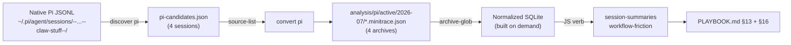

# Mining Agent Sessions with go-minitrace: A Self-Contained Upwork Playbook Analysis

This report documents a transcript-analysis pass over four Pi coding-agent sessions that executed a 2026-07-16 Upwork job-search refresh. The work used `go-minitrace` to discover, convert, and query the sessions, and then folded the findings back into the operational playbook that those sessions were running under. The report covers the pipeline that was built, the evidence it produced, the concrete workflow friction it surfaced, and the improvements to `go-minitrace` and its analysis skill that the effort exposed.

The central result is a methodological one. The first analysis pass relied on ad-hoc Python wrapping raw SQL and JSON output. That Python is fragile and non-reproducible: it lives outside the tool and depends on an interpreter the analysis does not otherwise need. The pass was redone as two self-contained `go-minitrace` JavaScript query commands that run inside the engine, read the normalized SQLite schema directly, and emit structured rows with no external dependency. The JavaScript commands now drive the playbook update, and the playbook records how to run them. This is the shape future transcript analyses in this repository should take.

This report was written from the repository's implementation, the saved query artifacts under `scripts/2026/07/16/upwork-playbook-minitrace/`, the converted minitrace archives, and the Git history of the four commits the work produced (`b236cd4`, `3ff161c`, `4c0bbeb`, `0ccc158`).

> [!summary]
> - Four Pi sessions for the `claw-stuff` repository (2026-07-16, 683 tool calls) were discovered, converted to minitrace archives, and queried with a normalized SQLite engine. The 615-turn delivery session and the 66-turn session carried the signal; two two-turn sessions did not.
> - The analysis was rebuilt as two self-contained `go-minitrace` JS verbs — `session-summaries` and `workflow-friction` — that replace ad-hoc Python and run with no external interpreter. They live under a dated topic folder and register as `go-minitrace query commands`.
> - The workflow-friction verb surfaced seven `surf upwork` failures across three subcommands. Those failures were mapped directly into the playbook's failure-recovery section, turning session telemetry into durable operational guidance.
> - The effort exposed four concrete improvement targets in `go-minitrace` and its skill: a silent flag-registration quirk for root-level JS commands, stale deprecated commands shipped in the repo, array-wrapped verb return values, and skill prose that predates the normalized SQLite API.

## Why this analysis exists

The Upwork refresh produced a set of deliverables: a 30-job decision-sheet bundle, a PDF, a reMarkable upload, and two almanach thermal prints. Those deliverables were generated by agent sessions running against an operational playbook at `upwork/PLAYBOOK.md`. The playbook is the authoritative runbook a fresh agent is told to read before doing anything. The question this analysis answers is narrower and more durable: which parts of that playbook did the agents actually struggle against, and which struggles are worth encoding so the next agent does not rediscover them.

A playbook written from intention and a playbook validated by evidence are different documents. The first describes how the author believes the workflow should go. The second records where it actually broke. Transcript analysis is the bridge between the two. The sessions that executed the refresh are the ground truth for the friction the workflow produces, and `go-minitrace` is the tool that reduces those sessions from verbose JSONL to the specific tool calls and errors that matter.

The analysis was scoped to the refresh window. Sessions were restricted to those started on or after 2026-07-14 whose recorded working directory contained `claw-stuff`. That window captures the capture, import, triage, form-inspection, delivery, and playbook-update phases of the refresh without dragging in unrelated earlier work.

## The analysis pipeline

The pipeline has three stages: discover the native sessions, convert the narrow set to minitrace archives, and query the normalized SQLite engine the archives materialize. Each stage is read-only with respect to the native session store; conversion writes to an investigation-specific output directory, never back to `~/.pi/agent/sessions`.



### Discovery and conversion

Discovery is metadata-driven. `go-minitrace discover pi` walks the Pi sessions directory, filters by start time and a working-directory substring, and emits a JSON list of candidate sessions with their native source paths. The discovery output is preserved as an investigation artifact rather than consumed in a pipe, so the candidate set is reproducible.

```
candidate count: 4
019f6bd3 | 2026-07-16T16:47:25Z | models
019f6be5 | 2026-07-16T17:06:53Z | upwork-refresh-delivery
019f6be7 | 2026-07-16T17:09:16Z | hello
019f6bf7 | 2026-07-16T17:26:39Z | Look at upwork/ and its db and `surf upwork` ...
```

The four sessions are not equally informative. The 615-turn session `019f6bf7` is the long delivery session that did the bulk of the refresh work. The 66-turn session `019f6be5` is the dedicated delivery session that produced the decision-sheet PDF, the reMarkable upload, and the almanach print. The two two-turn sessions (`models`, `hello`) are noise — a clarification request and a greeting. Conversion still includes them because the cost is negligible and excluding them would require a content judgment that does not belong at the discovery stage.

Conversion takes the saved source list and produces one `.minitrace.json` per session under `analysis/pi/active/2026-07/`. The converter upserts by session identity, so rerunning on the same list is safe. The manifest records the count and quality tier of each converted session, which is the first integrity check: four sources in, four archives out, with two quality-A and two quality-B sessions.

### The normalized schema

`go-minitrace query run` builds a normalized SQLite database from the archive glob on demand and caches it by content fingerprint. There is no separate import step. The tables that matter for this analysis are `sessions`, `turns`, and `tool_calls`, each with real typed columns rather than JSON blobs.

| Table | Grain | Key columns used |
|---|---|---|
| `sessions` | one row per session | `session_id`, `title`, `agent_framework`, `turn_count`, `tool_call_count`, `started_at` |
| `turns` | one row per message | `session_id`, `turn_index`, `role`, `content` |
| `tool_calls` | one row per tool invocation | `session_id`, `tool_name`, `operation_type`, `success`, `command`, `arguments_json`, `error` |

The typed columns are the point of the normalized engine. A tool call's `success` flag, `operation_type`, and `tool_name` are real columns, so counting failures and grouping by subcommand is plain relational SQL with no JSON extraction and no casting. The one adapter caveat that mattered here is that the `command` column can be empty for some calls, with the actual command text retained in `arguments_json`; the analysis queries coalesce across both.

## The tool-call population

Across the four sessions the engine materialized 683 tool calls. The distribution by tool and by operation type tells the shape of the work before any failure analysis.

| Tool | Calls | Operation mix |
|---|---|---|
| `bash` | 412 | EXECUTE-heavy |
| `read` | 118 | READ |
| `edit` | 93 | MODIFY |
| `write` | 31 | NEW |
| `subagent` | 3 | OTHER |
| `kagi_web_search` | 19 | OTHER |
| `ask_questions_about_images` | 2 | OTHER |
| `playwright_browser_*` | 5 | OTHER |

| Operation type | Calls |
|---|---|
| EXECUTE | 376 |
| READ | 149 |
| MODIFY | 93 |
| NEW | 36 |
| OTHER | 29 |

The population is dominated by `bash` execution. Of those 412 bash calls, 100 invoked `surf upwork`. That makes the `surf upwork` surface the single largest source of live, failure-prone commands in the refresh, and the natural target for a friction analysis.

## The two JavaScript analysis commands

The first analysis pass extracted summary blocks and tool calls with Python wrapping `go-minitrace query run` SQL output. That Python was the weakest part of the investigation: it duplicated logic that the engine could run directly, it required a Python interpreter the analysis did not otherwise need, and the saved `.json` results were only as reproducible as the Python that produced them. The pass was rebuilt as two `go-minitrace` JS query commands that run inside the engine.

A JS query command is a `.js` file with `__section__` and `__verb__` scanner markers that `go-minitrace` compiles into typed CLI verbs. The handler receives bound filter fields, builds a database handle with `mt.db().RuntimeArchives().QueryCommandDefaults().Build()`, runs SQL through `db.query(...)`, and returns plain JSON-serializable rows. The `--archive-glob` flag is a query-runtime flag registered automatically for these commands.

```javascript
function _db(mt) {
  return mt.db().RuntimeArchives().QueryCommandDefaults().Build();
}

function _withDB(mt, fn) {
  const db = _db(mt);
  try { return fn(db); } finally { db.close(); }
}

function workflowFriction(filters) {
  const mt = require("minitrace");
  return _withDB(mt, (db) => {
    const rows = db.query(`
      SELECT tc.tool_name, tc.success, tc.error,
        coalesce(nullif(tc.command, ''),
                 json_extract(tc.arguments_json, '$.command'),
                 json_extract(tc.arguments_json, '$.input'),
                 tc.arguments_json) AS command_text
      FROM tool_calls tc
      WHERE tc.tool_name = 'bash'
        AND command_text LIKE '%surf upwork%'
      ORDER BY tc.emitting_turn_index
      LIMIT ${filters.limit}
    `);
    // ... JS-side aggregation into counts + failures
  });
}

__verb__("workflowFriction", {
  name: "workflow-friction",
  short: "surf upwork subcommand counts and failures",
  fields: { filters: { bind: "filters" } },
});
```

The `coalesce` chain over `command` and `arguments_json` is the portable command-text pattern the skill documents. It handles the adapter case where the normalized `command` column is empty. The JS-side aggregation then groups by the `surf upwork <sub>` regex and partitions into call counts and failures.

### `session-summaries`

The `session-summaries` verb extracts the `<summary>` block that the Pi harness appends to each assistant turn. The Pi summary contract is a fixed four-field block — `This turn`, `Session so far`, `Issues`, `Next steps` — and it is the densest per-turn replay signal in the transcript. The verb runs one SQL query over `turns` filtered to assistant turns containing the marker, then parses each block in JS.

```javascript
function field(block, name) {
  const re = new RegExp(name + ":\\s*([\\s\\S]*?)" +
    "(?=(This turn:|Session so far:|Issues:|Next steps:|$))");
  const m = block.match(re);
  return m ? m[1].replace(/\s+/g, " ").trim() : "";
}
```

The query returned 43 summary blocks. Reading those blocks in order reconstructs the refresh as a narrative: proposal-metadata schema work, starred-job refresh, live ESP32 search, PCB-dependent rejection, project-index creation, eleven job-to-project links, eleven application forms captured, a technical vault article, portfolio reframing, the playbook itself, hardware research, the Surf CLI rate-increase and timestamp work, and finally the decision-sheet delivery. The summary blocks are candidate evidence, not attribution proof — they describe what an agent claims happened, which must be verified against the repository when the claim matters.

### `workflow-friction`

The `workflow-friction` verb aggregates the 100 `surf upwork` bash calls by subcommand and partitions out the failures. The output is the evidence that drove the playbook update.

| Subcommand | Calls | Failed |
|---|---|---|
| `bid-prepare` | 23 | 0 |
| `job` | 20 | 2 |
| `jobs` | 15 | 3 |
| `bid-apply` | 7 | 2 |
| `--help` | 1 | 0 |
| `proposals` | 1 | 0 |
| `portfolio` | 1 | 0 |
| `mutation` | 1 | 0 |

The seven failures cluster on three subcommands, and each cluster maps to a concrete playbook gap. The `jobs` failures are a "too many arguments" error from passing an unquoted multi-word query and a navigation race where the Upwork tab closed mid-read. The `job` failures include an `unknown flag: --url` error from passing the job URL as a flag rather than a positional argument. The `bid-apply` failures are two "Command aborted" results from live browser actions racing on a missing tab id.

One row in the subcommand table is a parsing artifact: `job","loggedIn":true,...` is a JSON-bleed false positive where the subcommand regex matched across a quoted JSON fragment in the command text. The real `surf upwork job` call count is 20. This is a known weakness of a naive regex over serialized command text, and it is the reason the verb reports the raw counts alongside the failures rather than presenting a cleaned single number.

## From evidence to playbook

The seven failures were encoded as four new entries in the playbook's failure-recovery section (§13). The mapping is direct: each failure cluster became a recovery procedure a future agent can follow without re-reading the transcript.

| Failure (from transcript) | Playbook §13 entry |
|---|---|
| `jobs` "Too many arguments" | Quote the single query string; extra tokens parse as separate arguments |
| `jobs` navigation race (`Inspected target navigated or closed`) | Rerun the command; Surf's fresh-tab retry recovers |
| `job` `unknown flag: --url` | The `job` verb takes the URL as a positional, not `--url` |
| `bid-apply` "Command aborted" | Re-run with the correct `--tab-id`; an abort is not a submission |

The playbook also gained a new section (§16) documenting the session-analysis workflow itself: how to discover and convert sessions, how to run the two JS verbs, and the evidence standard that separates a text match from a verified operation. The section explicitly warns that a `git commit` text match is not a verified commit, and that SQL and summary extraction are candidate-selection tools, not attribution proof.

## Cleanup of deprecated commands

The investigation found four JS query command files under `query-commands/cross-index/` that were committed to the repository but no longer functional. They targeted a cross-index database of commits, tickets, and repositories that does not exist in this repository — they had been copied from a different project — and they used the removed DuckDB query API (`mt.tableName`, `environment->>'cwd'`, `UNNEST(tool_calls)`). Running one against the current engine produced `TypeError: Object has no member 'map'`. The dead `.go-minitrace.yml` that pointed at them was also stale. All five files were removed. The built-in presets (`session-list`, `framework-summary`, `tool-failures`, `tool-operation-breakdown`, `file-operations`) cover the generic functionality those commands attempted, so nothing was lost.

## Improvements to go-minitrace and the skill

The effort exposed four concrete targets for improving the tooling so the next analysis is easier. These are recorded here so they can be passed on.

### 1. The root-level JS command flag-registration quirk

The single most time-consuming failure of the investigation was not in the data. A JS command file placed at the root of a query repository rejected the `--archive-glob` flag with `unknown flag: --archive-glob`, while the same file placed in a subdirectory registered the flag correctly and ran. The cause is that `go-minitrace` exposes repository subdirectories as CLI groups, and the query-runtime flags (`--archive-glob`) are wired through that group structure; a root-level JS file does not receive the group registration that supplies the flag.

This is a sharp edge because the failure mode is silent and the error message points at the flag rather than at the file placement. An analyst following the skill's own minimal example — which shows a single file with a single verb — will place it at the repository root, hit the error, and have no signal that the fix is to move the file into a subdirectory. The skill's `js-query-authoring.md` reference does not state the constraint.

**Recommended fix in `go-minitrace`:** either register query-runtime flags for root-level JS files so they work regardless of placement, or emit a clear error when a JS command file is found at the repository root that names the fix ("place command files in a subdirectory"). **Recommended fix in the skill:** state explicitly in `js-query-authoring.md` that JS command files must live in a subdirectory of the query repository, and that the `js-showcase` test repository is the canonical layout.

### 2. Deprecated commands shipped in the repository

The four broken `cross-index` commands were committed, tracked, and presented as available via `go-minitrace query commands --help`. An analyst discovering them would reasonably believe they work. They do not, because they target a different database and use a removed API. This is the tooling equivalent of the playbook being written from intention rather than evidence.

**Recommended fix:** remove the deprecated `cross-index` commands from the embedded catalog or mark them with a compatibility shim that prints a migration pointer. Ship a `go-minitrace doctor`-style check that flags query-repository commands referencing `mt.tableName` or `UNNEST(...)` as using the removed DuckDB API.

### 3. Array-wrapped verb return values

A JS verb that returns a single object (for example, the `workflow-friction` verb returning `{ surf_subcommands, surf_failures }`) is emitted by the command runner as a single-element array: `[ { surf_subcommands, surf_failures } ]`. This is not documented, and a consumer that indexes the JSON as an object (`d['surf_subcommands']`) fails with `TypeError: list indices must be integers`. The behavior is consistent (always an array of results) but surprising for verbs that return one synthetic object.

**Recommended fix:** document that verb return values are always wrapped in a result array, or detect a single-object return and emit it unwrapped. At minimum, state the contract in `js-query-authoring.md`.

### 4. Skill prose predates the normalized API

The `go-minitrace-transcript-analysis` skill is largely accurate, but several of its examples and the legacy `cross-index` commands it references use the removed DuckDB API. The skill's `queries.md` correctly documents the normalized schema and the migration table, but `js-query-authoring.md` shows only the builder pattern without the placement constraint, and the skill's "Required command preflight" section is correct but the deprecated command files it ships alongside contradict it. An analyst who reads the skill and then runs the shipped commands gets a broken experience.

**Recommended fix:** audit the skill's embedded examples against the installed CLI and remove or rewrite any DuckDB-era snippets. Add a worked example of a multi-verb JS file in a subdirectory that uses `mt.db().RuntimeArchives().QueryCommandDefaults().Build()`, since that is the pattern the skill should be teaching.

## Issues encountered during the analysis

Three issues beyond the improvement targets above affected the work.

The first was a cwd-discovery false sense of completeness. `go-minitrace discover pi --cwd-contains claw-stuff` returned the four sessions that *started* in the repository, but a long-lived session that began in a parent or workspace directory and later `cd`'d into `claw-stuff` would not have been discovered. The skill warns about this, and the mitigation is content-signature fallback (grepping raw JSONL for distinctive paths). This investigation did not need the fallback because all refresh work started in the repository, but the limitation is worth noting for analyses that span workspaces.

The second was the regex false positive in the subcommand extraction. The `surf\s+upwork\s+(\S+)` regex matched a JSON fragment (`job","loggedIn":true,...`) inside a serialized command string, producing a bogus subcommand row. The mitigation in the verb is to report raw counts alongside failures so the artifact is visible, but a more robust extractor would parse the command structure rather than regex the serialized text.

The third was that the built-in `session-list` preset, when emitted as JSON and parsed by a Python one-liner, returned rows with `turn_count` and `tool_call_count` as `None` in some columns because the preset's field names differ from the raw `sessions` columns. The JS verbs avoided this by selecting explicit column aliases. The lesson is that built-in presets are for human-readable output and ad-hoc JSON consumption; structured downstream use should select explicit columns.

## Working rules this analysis produced

- Transcript analysis should be self-contained. A `go-minitrace` investigation that depends on a Python interpreter wrapping SQL output is more fragile than the same analysis written as JS verbs that run inside the engine.
- Investigation scripts belong in a dated topic folder (`scripts/YYYY/MM/DD/$topic/`) with their inputs, converted data, commands, and results together. Scratch directories at the repo root get lost.
- A failure count is not an attribution. The seven `surf upwork` failures were real, but a `git commit` text match in a transcript is not a verified commit. Separate text matches, command attempts, confirmed successes, and repository-verified hashes.
- The richest replay signal in a Pi transcript is the per-turn `<summary>` block, not the raw tool-call count. Extracting summary blocks gives a narrative overview; extracting failures gives the actionable friction.
- A playbook validated by session telemetry is more durable than one written from intention. The §13 entries that came out of this analysis describe real failures that real sessions hit; they will save the next agent the rediscovery cost.

## Related notes

- [[PROJ - go-minitrace - The Normalized SQLite Query Engine]] — the engine architecture this analysis runs on, and the DuckDB-to-SQLite migration it documents.
- `upwork/PLAYBOOK.md` §13 (failure recovery) and §16 (session analysis) — the playbook sections this analysis produced.
- `scripts/2026/07/16/upwork-playbook-minitrace/` — the self-contained investigation: the two JS verbs, the converted archives, and the saved query results.
