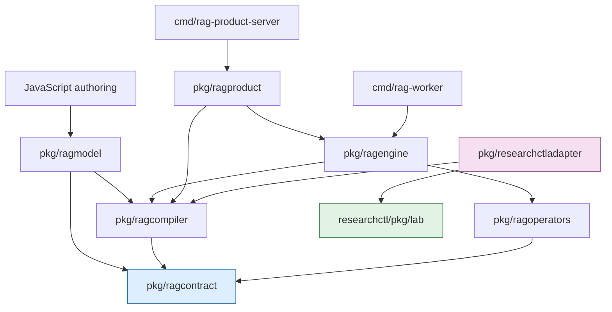
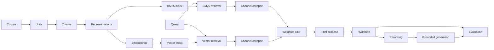
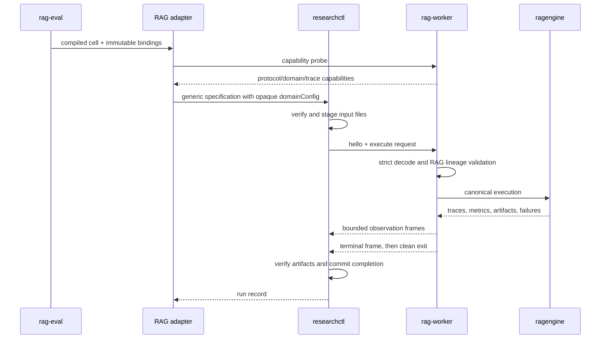

# RAG DSL v2 and Researchctl Laboratory: Architecture, Implementation, and Evidence

RAG DSL v2 defines retrieval-augmented generation as a typed, normalized operator graph rather than as JavaScript control flow or a collection of mutable service settings. JavaScript authors compose intent. Go compiles that intent into canonical contracts, validates graph and lineage semantics, computes stable identities, executes registered native operators, and records structured evidence. Researchctl receives the resulting execution specification as opaque domain configuration and owns only generic experimental lifecycle: specifications, runs, attempts, retries, timestamps, artifact custody, observations, and exports.

This separation is the central result of RESEARCHCTL-014. It replaced several overlapping prototype runtimes with one RAG-owned semantic stack and one domain-neutral laboratory. The implementation includes product and study compilation, immutable manifests, versioned worker integration, static index preparation, query traces, retrieval/evidence separation, candidate parity studies, destructive removal of obsolete paths, and executable tests that prove the old boundaries remain absent.

> [!summary]
> - `require("rag")` is a pure authoring grammar. Configurator functions execute immediately and no JavaScript callback, runtime object, provider, secret, or database handle enters the intermediate representation.
> - `pkg/ragcontract` owns every canonical RAG wire contract. `pkg/ragcompiler` owns defaults, recipe expansion, factor substitution, validation, topological ordering, normalization, and semantic identity.
> - `pkg/ragoperators` and `pkg/ragengine` execute only registered, versioned Go operators. Unsupported behavior fails explicitly; it does not select a fallback algorithm.
> - Researchctl remains domain-neutral. The RAG-owned `pkg/researchctladapter` imports researchctl's public laboratory SDK and submits opaque `rag-pipeline/v2` configuration to a process worker.
> - Product and research execution share normalized pipeline semantics but not lifecycle or policy. Product plans define request, response, failure, trace, concurrency, timeout, corpus, and model bindings; studies define variants, factors, datasets, measures, and replicates.
> - Generated summaries and questions are retrieval representations, not citable evidence. Collapse occurs independently in each retrieval channel before fusion. Hydration recovers exact source chunks for citations and evaluation.
> - The final candidate matrix covered 148 queries across 10 cells and 1,480 query-cell executions. It demonstrated semantic parity under fixture providers but was deliberately not labeled an adjudicated benchmark.

## 1. The design problem

A retrieval experiment combines several kinds of state that change for different reasons. The corpus and evaluation judgments are scientific inputs. Chunking, representations, embeddings, indexes, retrieval, fusion, hydration, reranking, generation, and evaluation are semantic transformations. Provider endpoints and credentials are deployment bindings. Runs, attempts, retries, and persisted observations are experimental lifecycle. A product service adds request validation, concurrency, latency, trace retention, and failure policy.

Putting all of this into one JavaScript runtime creates ambiguous ownership. A callback can retain mutable state. A helper can open a database during compilation. A “preview” function can accidentally bypass the worker path. An experiment identifier can mix semantic intent with run timestamps. A generated summary can be treated as source evidence. A generic laboratory can begin decoding one domain's configuration. Once these behaviors coexist, canonical identity and independent validation become difficult to define.

RAG DSL v2 therefore uses six distinct values:

| Value | Contract | Question answered |
| --- | --- | --- |
| Pipeline | `rag-pipeline-ir/v2` | Which typed operators and edges define retrieval semantics? |
| Product plan | `rag-product-plan/v2` | How is that pipeline bound and governed for online requests? |
| Study | `rag-study/v2` | Which controlled variants, factors, inputs, datasets, measures, and replicates will be compared? |
| Pipeline execution | `rag-pipeline-execution/v2` | What is the exact normalized work for one expanded study cell? |
| Query trace | `rag-query-trace/v2` | What happened for one query, including rankings, lineage, failures, usage, and cost? |
| Qualification | `rag-product-qualification/v1` | Which exact study is byte-equivalent to a frozen product plan and its model/prompt bindings? |

These are not alternative serializations of the same object. Each has a narrower purpose. The pipeline is reusable semantics. The product plan adds online policy. The study adds scientific comparison. The execution is one immutable cell. The trace is an observation. Qualification links a product configuration to a comparable research configuration.

## 2. Responsibility and dependency boundaries

The final package boundary is intentionally asymmetric:



Researchctl does not import `ragcontract`, `ragcompiler`, RAG providers, RAG schemas, or RAG commands. It validates generic laboratory records and treats `domainConfig` as canonical opaque JSON. The adapter lives in the RAG repository because the domain understands both its own contracts and the generic submission API. This yields the dependency direction:

```text
rag-evaluation-system/pkg/researchctladapter
    imports researchctl/pkg/lab

researchctl
    imports no RAG package
```

The distinction prevents generic lifecycle code from becoming a registry of domain-specific cases. A future non-RAG worker can implement the same process protocol and submit a different domain schema without changing researchctl. This was demonstrated by a non-RAG `process-runner-echo` integration and an `echo-trace/v1` test.

### 2.1 What researchctl owns

Researchctl owns facts that are valid across experimental domains:

- canonical execution identity and specification records;
- allocation and identity of runs and attempts;
- retry policy and terminal status;
- generic timestamps and process observations;
- verified input staging and artifact custody;
- generic metrics and versioned trace blobs;
- persistence, import, export, and reconstruction;
- worker protocol framing, cancellation, bounds, and clean-exit completion.

### 2.2 What the RAG system owns

The RAG repository owns semantics that require retrieval knowledge:

- pipeline, product, study, execution, trace, and qualification contracts;
- operator definitions, defaults, port types, and graph rules;
- JavaScript authoring descriptors and generated TypeScript declarations;
- corpus, unit, chunk, representation, embedding, index, and evaluation manifests;
- retrieval, collapse, fusion, hydration, reranking, generation, and evaluation;
- study expansion, product policies, and semantic identity;
- RAG input envelopes, catalog resolution, and lineage validation;
- the RAG worker, product runtime, CLI, and reference HTTP host.

A boundary is useful only if it can reject incorrect placement. The cutover tests scan active commands, packages, examples, documentation, experiments, frontend code, and SQLite metadata for retired RAG lifecycle identifiers. Product packages are also tested to ensure they cannot import researchctl or `pkg/researchctladapter`.

## 3. JavaScript is an authoring grammar

The v2 JavaScript surface is exposed through `require("rag")`. It creates Go-owned typed values through factories such as `pipeline`, `query`, `product`, `study`, operator descriptors, fragments, factors, and measures. A configurator function runs immediately while the value is being built.

```javascript
const rag = require("rag");

const raw = rag.pipeline("raw-hybrid", p => {
  const units = p.units(rag.operators.units.agentsView());
  const chunks = p.chunk(units, rag.operators.chunk.recursive({
    maxRunes: 1200,
    overlapRunes: 120,
  }));

  const lexical = p.retrieveBM25(chunks, { topK: 50 });
  const vectors = p.retrieveVector(chunks, { topK: 50 });
  const fused = p.weightedRRF({ lexical, vectors }, {
    rankConstant: 60,
    weights: { lexical: 1, vectors: 2 },
  });

  p.output("results", p.hydrate(fused));
});
```

The exact helper names depend on the checked-in declarations, but the semantic rule is invariant: the function above finishes before compilation returns. The compiled value contains operators, ports, bindings, canonical configuration, and explicit outputs. It does not contain `goja.Value`, JavaScript source, closures, captured variables, or runtime handles.

This boundary supports ordinary JavaScript composition without making JavaScript the semantic authority:

```javascript
function retrievalFragment(name, weight) {
  return rag.fragment(name, f => {
    // Compose typed descriptors and return typed references.
  });
}

const topK = rag.factor("top-k", [10, 25, 50]);
const study = rag.study("retrieval-comparison", s => {
  s.variant("raw", raw);
  s.factor(topK);
  s.measure(rag.measure("mrr"));
});
```

Factors remain typed references until study expansion. They are substituted recursively into configuration before normalization. Fragments are authoring units, not runtime nodes. Recipes expand to ordinary registered operators. After compilation, the execution graph contains no special JavaScript concept.

### 3.1 Hidden references and capability control

JavaScript objects can be forged or modified. The implementation therefore associates exposed wrappers with Go-owned values through private `goja.Symbol` keys. Public object fields are useful for author ergonomics, but they are not accepted as proof that an object is a valid pipeline, node reference, product, or study. The module unwraps only values created by its own factories.

This is capability control at the authoring boundary. Raw node construction is not exposed. Authors cannot provide an arbitrary executor, SQL handle, provider callback, or worker lifecycle method. New executable behavior enters the system only by adding a versioned Go operator and registering matching compiler and runtime definitions.

### 3.2 Why execution is excluded

Compilation must be deterministic with respect to its explicit inputs. Database access, catalog aliases, provider calls, environment credentials, and process allocation would make compilation depend on mutable host state. They therefore occur after pure authoring:

```text
JavaScript source
  -> typed Go authoring values
  -> normalized canonical RAG value
  -> explicit immutable input resolution
  -> generic specification submission
  -> worker execution
  -> observations and artifacts
```

`preview` follows this same path. It creates a one-query candidate evaluation envelope, compiles the normal study, submits through researchctl, negotiates with `rag-worker`, and executes the canonical engine. There is no JavaScript preview runtime.

## 4. Canonical contracts and normalization

`pkg/ragcontract` is intentionally dependency-light. It defines data transfer objects, schema constants, strict codecs, validation reports, manifests, traces, and canonical hashing. It does not depend on Goja, a database, a provider SDK, or researchctl. This makes it suitable for worker boundaries, artifact validation, tests, and product hosts.

All decoding is strict. Unknown fields and trailing JSON are rejected. This is important for versioned scientific input: silently ignoring a field can turn an intended experiment into a different experiment while preserving a superficially successful run.

The normalization path in `pkg/ragcompiler/normalize.go` performs the following ordered operations:

1. assign the pipeline schema version if omitted;
2. expand registered recipes;
3. structurally validate the expanded pipeline;
4. resolve each operator definition from the compiler registry;
5. apply and canonicalize operator config defaults;
6. validate semantic constraints;
7. detect graph cycles and compute topological order;
8. resolve aliases to canonical upstream node identities;
9. verify input and output port kinds;
10. compute semantic node IDs from operator, inputs, config, and explicit order;
11. topologically order nodes by canonical identity;
12. sort inputs and outputs and validate declared output kinds.

A normalized node identifier is derived from semantic content:

```go
identity := struct {
    Operator ragcontract.OperatorRef
    Inputs   []ragcontract.InputBinding
    Config   any
    Order    int
}{n.Operator, n.Inputs, n.Config, n.Order}

digest, _ := ragcontract.Digest(identity)
n.ID = "n-" + strings.TrimPrefix(digest, "sha256:")[:20]
```

This separates semantic identity from author-local labels. Renaming a JavaScript variable does not change the node. Changing an operator version, normalized config, input edge, or meaningful order does.

### 4.1 Canonical topological order

A graph can have many valid topological orders. If the compiler retained author insertion order, semantically equal pipelines could produce different JSON and digests. The compiler first computes semantic IDs, then performs topological ordering over the normalized graph. Independent ready nodes are ordered deterministically. Inputs and outputs are also sorted where their order is not semantic.

This yields two separate invariants:

- semantic node identity depends on operator behavior and dependencies;
- serialization order depends on normalized graph structure, not incidental authoring order.

The original ten-cell normalization probe was frozen with SHA-256 `67861b0e2aa7d8647c7af7eb71724ed05dc34c1576e2dc25407d6244a8e735fe`. Golden tests compare canonical JSON values rather than whitespace formatting.

### 4.2 Operator and contract versioning

Contract schemas and operator semantics have independent version domains:

```text
rag-pipeline-ir/v2          contract schema
rag-study/v2                contract schema
retrieve.vector/v1          operator semantic version
fusion.weighted-rrf/v1      operator semantic version
```

An operator version changes when observable behavior changes, including defaults, sorting, score calculation, truncation, normalization, lineage, trace shape, or failure behavior. Reusing `/v1` after such a change would make historical identities ambiguous. Contract `/v2` does not imply that every operator is `/v2`.

## 5. The operator graph

A pipeline is a directed acyclic graph with typed ports. Each node names an immutable operator reference and canonical configuration. Each edge binds one output port to one input port. The compiler registry declares the allowed port kinds; the runtime registry provides executable implementations. A parity test requires both registries to agree.

The principal port/value progression is:



Not every pipeline uses every node, but the boundaries are explicit. A representation is not a chunk. A ranked representation is not hydrated evidence. A fused collapse key is not a citation. These distinctions are required to reason about multiplicity, lineage, and evaluation.

### 5.1 Unitization and chunking

Unitization defines the semantic records from which chunks are derived. The agents-view unitizer groups consecutive assistant content correctly while ignoring tool and empty records that should not split an assistant run. Chunking records exact Unicode-safe source ranges, parent unit identity, and production configuration.

Range correctness matters because hydration must recover the exact source text later. Tests verify that chunk boundaries do not split UTF-8 sequences and that reconstructed ranges match their recorded text. A three-second fuzz run executed 35,075 UTF-8 range cases without failure.

### 5.2 Representations and embeddings

A source chunk can produce multiple retrieval representations:

- raw source text;
- a generated summary;
- generated questions;
- other explicitly registered derived forms.

Each representation records its parent chunk and production lineage. Embeddings record the representation identity, model manifest, dimensions, and production configuration. Index artifacts identify the exact representation or embedding set from which they were built.

Generated representations improve retrieval but cannot become source evidence. Their text may omit, combine, or introduce language. Retrieval records therefore retain both the matched representation and the parent identity needed for later hydration.

### 5.3 Retrieval, channel-local collapse, and fusion

Suppose one source unit produces one raw representation, one summary, and four generated questions. If all six appear in a semantic channel, allowing every item to contribute to fusion gives that unit six votes while a unit with only one representation gets one. This is a multiplicity bias caused by representation cardinality rather than independent evidence.

RAG DSL v2 requires collapse within each channel before fusion:

```text
lexical ranked representations
  -> collapse by configured parent within lexical channel

semantic ranked representations
  -> collapse by configured parent within semantic channel

collapsed lexical + collapsed semantic
  -> weighted reciprocal rank fusion
```

For weighted RRF with rank constant `k`, channel weights `w_c`, and one collapsed rank per key per channel, the score is:

$$
\operatorname{RRF}(d) = \sum_{c \in C_d} \frac{w_c}{k + r_c(d)}
$$

where $r_c(d)$ is the rank of collapse key $d$ in channel $c$. One key contributes at most one term per channel. The trace records every contribution, including channel, rank, and weight.

A separate final collapse can apply after fusion. It has a different purpose: channel-local collapse controls representation multiplicity before scoring; final collapse controls diversity of fused output. Combining the two stages would obscure which policy changed the score.

### 5.4 Hydration, reranking, and generation

Hydration maps fused winners back to exact source chunks and ranges. Only hydrated source material can become a citation. A reranker can reorder hydrated candidates but must preserve first-stage scores and identities in the trace. Grounded generation receives explicit evidence records and must return answers and citation identifiers that pass output schema and lineage checks.

The evidence path is therefore:

```text
matched representation
  -> channel collapse identity
  -> fused identity
  -> exact hydrated chunk
  -> citation
```

Each identity remains separately observable. The trace can answer why an item matched, how it contributed to fusion, which source range was selected, and which evidence supported an answer.

### 5.5 Evaluation target mapping

Relevance judgments may target chunks or units. When a query trace contains hydrated chunks but the dataset targets units, evaluation maps each chunk through `ParentUnitID` and deduplicates unit identities. Multiple chunks from one relevant unit count once. This preserves the declared relevance target rather than treating implementation-level chunk multiplicity as multiple correct answers.

## 6. Immutable manifests and lineage

The runtime uses immutable artifacts for corpora, units, chunks, representations, embeddings, indexes, schemas, prompts, models, and evaluation datasets. Each manifest records a schema version, digest, parent relationships, and production metadata appropriate to its type.

There are two digest layers at the researchctl boundary:

| Digest | Owner | Meaning |
| --- | --- | --- |
| Generic artifact file digest | researchctl | Exact staged file bytes under generic custody. |
| RAG manifest digest | RAG contracts | Canonical domain content and lineage identity. |

The two values are not interchangeable. A generic envelope file can contain a manifest and records; its file digest identifies the envelope bytes, while the manifest digest identifies the canonical RAG value. Both are preserved and checked.

RAG-owned input resolution can accept a catalog alias for author convenience, but the adapter resolves it before generic submission. The resulting specification binds immutable files and canonical domain configuration. The worker reopens the files, validates envelopes, checks record digests and parent lineage, and confirms that the execution configuration is canonical. Capability preflight does not replace this worker-side validation.

### 6.1 Read-only catalogs

WAL-backed SQLite catalogs are opened with `mode=ro` and query-only behavior. `immutable=1` is not used because it can bypass WAL visibility assumptions. Input files are staged read-only, and integration tests compare source corpus and evaluation bytes before and after worker execution.

### 6.2 Cache and model identity

Provider-backed operations resolve exact model and prompt manifests before invocation. Cache keys include semantic inputs and manifest/config identity. Tokenization, truncation, dimensions, request parameters, and output schemas are part of observable behavior and must be frozen for production qualification. A zero provider cost in fixture tests is an explicit measured fixture result, not missing telemetry.

## 7. Native execution and prepared state

`pkg/ragengine` executes normalized operator graphs in topological order. It rejects non-canonical input by normalizing a copy and comparing canonical JSON. This prevents callers from bypassing compiler defaults or ordering rules.

The engine distinguishes static nodes from query-dependent nodes. A node is static when it does not transitively depend on the query input. Corpus unitization, chunking, representation generation under deterministic fixture providers, embedding materialization, and index construction can therefore be prepared once and shared across queries.

```go
prepared, err := engine.Prepare(ctx, compiled.Pipeline, corpus, options)
if err != nil {
    return err
}
defer prepared.Close()

options.Prepared = prepared
result, err := engine.Execute(ctx, execution, corpus, dataset, sink, options)
```

`Prepared` owns immutable query-independent values and indexes. Concurrent requests take a snapshot of the retained values. `Close` is idempotent and closes retained indexes exactly once after the last request. Failed preparation closes partially built resources.

The distinction produced a major correctness and performance improvement in the parity matrix. Static preparation runs once per dataset/cell rather than once per query. Product startup similarly prepares exact bindings before serving traffic.

### 7.1 Runtime checks

For each node, the engine:

1. checks context cancellation;
2. resolves the exact runtime operator by immutable reference;
3. gathers values from typed input bindings;
4. executes with explicit environment interfaces;
5. checks output ports against compiler definitions;
6. retains only allowed semantic outputs;
7. records observations, duration, usage, cost, failures, and partial evidence.

Unknown operators, missing inputs, wrong runtime values, dimensions, schema mismatches, provider failures, and budget violations return explicit errors. The engine never substitutes an alternate retriever, generator, or reranker.

## 8. The generic process worker boundary

`cmd/rag-worker` speaks `researchctl-runner-stdio/v1`. It advertises:

```text
runner:   rag-worker/v2
protocol: researchctl-runner-stdio/v1
domain:   rag-pipeline/v2
trace:    rag-query-trace/v2
```

The protocol uses strict NDJSON frames. Negotiation is hello-first. Frame sizes are bounded. Terminal observation order is validated. Cancellation is propagated. Standard error is treated as diagnostic data and redacted before persistence. Completion is committed only after the process exits cleanly; a worker cannot emit an early success frame and then fail without the run reflecting that failure.

The execution sequence is:



Security checks reject path traversal, symlink escape, overwrite attempts, oversized frames, secret canaries, malformed lineage, and unsupported capabilities. The process runner is an observation boundary, not a trust declaration. Untrusted-worker sandboxing remains separate work.

## 9. Study compilation and execution identity

A study defines variants, factors, exact input roles, an evaluation dataset, measures, and replicate policy. Compilation expands the Cartesian product into cells. Each cell includes only artifacts consumed by its selected variant. This avoids making an unused model or index change the identity of a cell that does not use it.

The RAG adapter maps one canonical execution into researchctl's generic identity:

```go
identity := lab.ExecutionIdentity{
    SchemaVersion:       lab.ExecutionSpecSchemaVersion,
    IdentityScheme:      lab.ExecutionIdentityScheme,
    Domain:              "rag-pipeline/v2",
    DomainSchemaVersion: "rag-pipeline-execution/v2",
    Inputs:              immutableInputs,
    DomainConfig:        canonicalExecutionJSON,
    RequestedMeasures:   measures,
    Factors:             canonicalFactorSelections,
}
```

The resulting specification ID describes intended work. It does not include run timestamps or attempt identity. Repeating the same specification creates another run. A run can have multiple attempts. An export has its own file digest. These values must remain distinct:

```text
study identity
  -> expanded cell identity
  -> generic specification identity
  -> run identity
  -> attempt identity
  -> artifact identities
  -> export file digest
```

### 9.1 Scientific labels

Datasets and results carry explicit status and split labels. `candidate`, `smoke`, and `preview` evidence cannot be presented as an adjudicated benchmark. Preview creates a candidate one-query dataset even when the source corpus is frozen.

Before a benchmark claim, a reviewer must verify:

- human adjudication and holdout policy;
- exact relevance target and mapping;
- provider, model, tokenizer, prompt, request, and pricing versions;
- comparable immutable inputs and measurement definitions;
- failures, abstentions, latency, cost, and storage;
- representation/evidence separation and citation correctness.

## 10. Product compilation and online runtime

A product plan uses the same normalized pipeline semantics but adds exact deployment bindings and policy:

- request fields, types, requiredness, and length limits;
- response shape and trace-ID inclusion;
- corpus digest and model/prompt references;
- citation mode;
- maximum concurrency and request timeout;
- failure policy;
- trace policy.

`pkg/ragproduct.New` compiles the plan, computes semantic identity, verifies corpus bytes against the manifest, resolves exact models, decodes strict request/response contracts, and prepares static pipeline state. Startup fails before serving requests if any binding is unresolved or mismatched.

Request execution acquires a bounded concurrency slot, applies the plan timeout, executes against prepared state, builds results and source citations, applies failure policy, and then applies trace policy.

The allowed failure policies are:

| Policy | Behavior |
| --- | --- |
| `fail` | Return an explicit product execution error. |
| `abstain` | Return an abstained response with no answer, results, or citations. |
| `retrieval-only` | Return available retrieval evidence without pretending generation succeeded. |

The allowed trace policies are:

| Policy | Behavior |
| --- | --- |
| `authoritative` | Include the full canonical query trace in the response. |
| `metadata-only` | Include reduced trace metadata. |
| `artifact-backed` | Persist the canonical trace through a required sink and omit it from the response. |
| `none` | Do not expose a trace in the response. |

There is no implicit fallback between policies. Required citation mode rejects a non-abstained response with no source citations. Provider-facing errors are reduced to stable product error codes and redacted messages.

`Runtime.Close` first prevents new requests, fills the semaphore to wait for active requests to release their slots, then closes prepared indexes once. This ordering is tested under concurrency and the race detector.

### 10.1 Product qualification

`rag-product-qualification/v1` freezes the exact product plan, corpus, model, and prompt manifests and derives a byte-equivalent study pipeline. The purpose is not to execute a production HTTP server under researchctl. It is to prove that a research study exercises the same normalized retrieval semantics and exact bindings.

Product and study traces were tested for `ResultTrace` equivalence under the fixture profile. The product binary imports no researchctl package. Online lifecycle and scientific lifecycle remain independent even when semantics are equivalent.

## 11. Trace structure and observability

`rag-query-trace/v2` records the evidence needed to inspect one query:

- query identity and digest;
- operator execution and timing;
- representation matches;
- channel rankings;
- collapse winners and removed multiplicity;
- weighted fusion contributions;
- hydration selections and exact source lineage;
- reranking input and output order;
- generated answer and citations;
- evaluation target mapping and metric values;
- failures, partial evidence, token usage, cost, and resource observations.

A trace is not merely debug logging. It is a versioned observation contract. Researchctl stores it generically by trace kind; the RAG system defines and validates its content. Lexical validation distinguishes generic metric/event names from versioned schema identifiers such as `rag-query-trace/v2`.

The product runtime can reduce or externalize trace content according to policy, but the canonical research path retains enough detail to reconstruct ranking and evidence decisions. Secret canary tests scan frames, artifacts, traces, and errors to ensure credentials and endpoints do not leak.

## 12. The parity study and what it proves

The old `rag-sol2` runtime was used once as an evidence source. Its useful semantics were extracted into the v2 operator system, compared, frozen, and then the competing runtime was deleted. No compatibility layer remains.

The study crossed five representation variants with two collapse scopes:

```text
representations: raw, summary, raw-summary, raw-question, all
collapse:        chunk, unit
cells:           5 × 2 = 10
```

Deterministic fixture providers generated summaries, questions, 32-dimensional hash embeddings, and zero-cost usage under exact manifests. The corrected matrix ran 148 queries through every cell:

```text
148 queries × 10 cells = 1,480 query-cell executions
elapsed: approximately 2m49s
maximum RSS: 1.62 GB
temporary researchctl storage: 869 MB
status: candidate
benchmarkClaim: false
fixtureProviders: true
```

The frozen parity file and candidate result prove that the new implementation preserves the selected representation, collapse, fusion, hydration, evaluation, and cost semantics under deterministic fixtures. They do not prove production model quality. Real reranker and provider parity was deferred because server version, model digest, endpoint behavior, tokenization, truncation, request parameters, and pricing were not frozen.

The distinction between parity and benchmark validity is essential. A deterministic fixture can prove graph behavior, identity, lineage, and trace invariants. It cannot establish whether a production summary model improves retrieval on adjudicated holdouts.

## 13. Destructive cutover

The project did not preserve deprecated prototype APIs. After parity was established, it deleted:

- `pkg/raglab`;
- `cmd/rag-lab-worker`;
- `internal/services/immutableretrieval`;
- the `rag-sol2` playground runtime;
- researchctl RAG packages, commands, schemas, help pages, examples, registrations, and dependencies;
- retired RAG experiment lifecycle tables, views, triggers, indexes, and migrations;
- the `/api/v1/lab/catalog` route;
- stale ignored worker binaries.

The remaining RAG artifact route is lifecycle-neutral:

```http
GET /api/v1/artifacts/rag/catalog
```

Fresh RAG databases contain domain artifact tables only. Scientific experiment lifecycle exists exclusively in researchctl. Disposable prototype databases are recreated; active infrastructure migrations remain explicit.

Destructive removal reduces the number of plausible execution paths. There is one compiler, one RAG worker, one engine, one study adapter, and one product runtime. A retired identifier appearing in an active source tree is treated as a regression rather than a deprecation warning.

## 14. Validation evidence

The final acceptance suite covered:

- full Go tests in the RAG and researchctl repositories;
- full race tests;
- `GOWORK=off` module-independence tests;
- `go vet` and pinned `golangci-lint`;
- JSON Schema validation and strict contract tests;
- generated TypeScript declaration checks;
- frontend typecheck and production build;
- dependency direction and retired-identifier scans;
- SQLite baseline inspection and HTTP route absence;
- canonical execution reconstruction;
- process worker security, cancellation, retry, and partial-artifact tests;
- product/study equivalence and product import absence;
- `govulncheck` with zero called vulnerabilities;
- fuzz tests for decoding, canonicalization, manifests, graph normalization, and UTF-8 ranges.

Three-second fuzz counts were:

| Target | Executions | Failures |
| --- | ---: | ---: |
| Pipeline decoder | 253,473 | 0 |
| Canonicalization | 197,981 | 0 |
| Manifest validation | 71,765 | 0 |
| Graph normalization | 21 | 0 |
| UTF-8 chunk ranges | 35,075 | 0 |

A one-query process fixture produced seven artifacts, 9,594 artifact bytes, 4,592 trace bytes, three metric bytes, and zero fixture-provider cost. Product acceptance measured startup at `4.229276ms`, p50 at `486.412µs`, p95 at `1.006751ms`, p99 at `1.454103ms`, and mean trace size at `3842` bytes. The Go benchmark reported `433694 ns/op`, `184900 B/op`, and `2926 allocs/op`. These are acceptance measurements under the fixture profile, not production service-level objectives.

## 15. How to extend the system correctly

A new semantic behavior enters through a new immutable operator version. The change must include:

1. a compiler definition with phase, typed ports, config schema, defaults, resources, and observations;
2. a native `ragoperators.Operator` implementation;
3. duplicate-safe runtime registration and compiler/runtime parity;
4. a typed `ragmodel` descriptor and, where appropriate, a JavaScript factory plus DTS update;
5. deterministic ordering, cancellation, lineage, traces, usage, cost, and explicit failures;
6. normalization, malformed-input, runtime, lineage, cancellation, secret, race, and parity tests;
7. product/study equivalence tests if both targets can use it;
8. documentation of observable behavior and the reason for the new version.

Do not add a raw JavaScript executor, callback-retaining IR, alias for a retired prototype, researchctl schema case, silent fallback, or generated-text citation path. These would reopen boundaries that the v2 architecture explicitly closed.

## 16. Remaining work

RESEARCHCTL-014 is closed. The remaining work belongs to separate tickets because it changes distribution, production qualification, scientific claims, or infrastructure policy rather than the v2 semantic architecture.

### 16.1 Publish the laboratory SDK

The RAG repository temporarily uses a sibling-checkout replacement:

```go
replace github.com/go-go-golems/researchctl => ../../../2026-06-30/benchmark-cpu-inference/researchctl
```

The public researchctl laboratory SDK revision must be published, adopted by version, and the `replace` removed. This is a distribution task, not an argument for reversing dependency direction.

### 16.2 Qualify production providers

Production generator, embedder, and reranker adapters require:

- audited endpoint allowlists;
- opaque credential references;
- exact server, model, prompt, tokenizer, truncation, and request manifests;
- output schema and cardinality checks;
- measured token and pricing policy;
- retry and timeout semantics;
- provider failure redaction;
- qualification and parity tests.

### 16.3 Freeze a scientific benchmark

The candidate matrix should not be relabeled. A benchmark ticket must establish human adjudication, holdouts, exact providers, comparable baselines, model and prompt freeze, failed-query policy, uncertainty reporting, and publication rules.

### 16.4 Separate infrastructure work

Untrusted-worker sandboxing, durable dependent preparation jobs, and frontend bundle splitting remain independent concerns. They should be designed without adding a second RAG lifecycle or execution path.

## 17. Key invariants

The following invariants summarize the architecture:

- JavaScript constructs typed intent and performs no execution or I/O.
- Canonical Go contracts are the only wire-level RAG authority.
- Every executable semantic is a registered immutable operator version.
- Normalization precedes identity and execution.
- Researchctl sees canonical opaque domain configuration and owns only generic lifecycle.
- The RAG worker validates canonical config and domain lineage after generic custody checks.
- Specifications, runs, attempts, artifacts, traces, and exports have separate identities.
- Generated representations aid retrieval but never become source evidence.
- Collapse is channel-local before fusion, with at most one contribution per key per channel.
- Hydration recovers exact source chunks before citations or source-target evaluation.
- Product and research paths share normalized semantics but have distinct lifecycle and policy.
- Unsupported or unsafe behavior fails explicitly.
- Candidate and fixture evidence remains labeled as such.
- Retired APIs and runtimes stay deleted; evolution occurs through current contracts and operator versions.

## 18. Source map

The implementation is concentrated in these locations:

| Area | Path |
| --- | --- |
| Wire contracts and schemas | `pkg/ragcontract` |
| Compiler, registry, normalization, identities | `pkg/ragcompiler` |
| Pure Go authoring values | `pkg/ragmodel` |
| JavaScript module | `pkg/gojamodules/rag` |
| xgoja provider and DTS | `pkg/xgoja/providers/rag`, `examples/xgoja/rag-v2` |
| Native operators and manifests | `pkg/ragoperators` |
| Graph execution and prepared state | `pkg/ragengine` |
| Researchctl integration | `pkg/researchctladapter` |
| Process worker | `cmd/rag-worker` |
| Product runtime and qualification | `pkg/ragproduct` |
| Reference HTTP host | `cmd/rag-product-server` |
| Study and preview CLI | `cmd/rag-eval` |
| Candidate parity evidence | `experiments/rag-sol2` |
| Final measurements | `experiments/final-measurements-v1.json` |
| Canonical guides | `docs/guides` |
| Ticket design and diary | `researchctl/ttmp/2026/07/17/RESEARCHCTL-014--composable-javascript-rag-dsl-v2-and-researchctl-experimentation-framework` |

## 19. Related vault notes

- [[ARTICLE - RAG DSL v2 - Getting Started Guide]]
- [[ARTICLE - RAG DSL v2 - Developer Guide]]
- [[ARTICLE - RAG DSL v2 - Canonical API Reference]]
- [[ARTICLE - Immutable TTC RAG Laboratory - From Fixed Truth to Executable JavaScript Experiments]]
- [[ARTICLE - Full TTC RAG Laboratory and go-go-parc Corpus Research Report]]
- [[ARTICLE - Researchctl API - Implementation and Usage Deep Dive]]

The earlier TTC laboratory articles document the prototypes and measurements that informed this work. This report documents the final v2 boundary. Historical API names in those articles should not be used as current implementation guidance.
