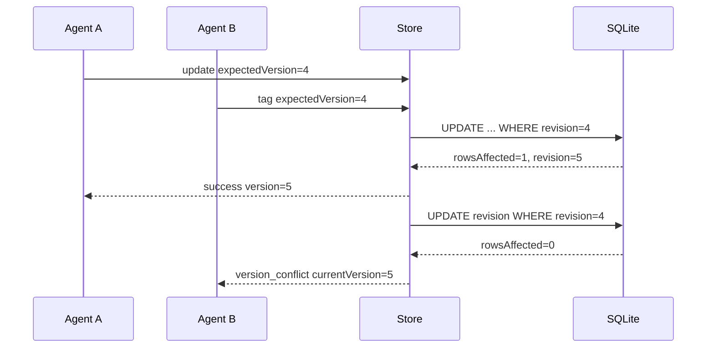
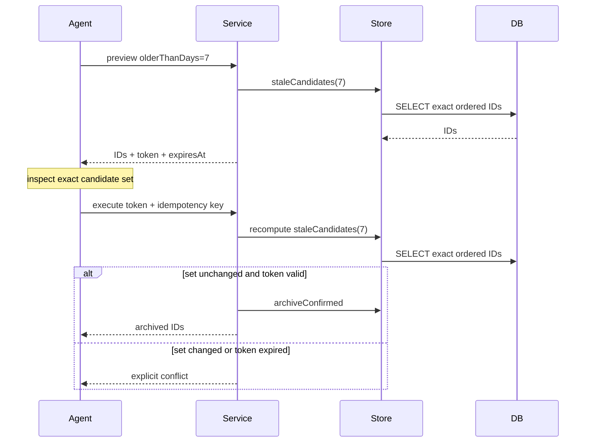

# Upwork Tracker Agent Interfaces: Safe REST and jsverbs Automation

The Upwork Tracker began as a local human-facing application: SQLite stored jobs and workflow state, JavaScript assembled Widget IR pages, and a React application rendered tables, inspectors, dialogs, and keyboard-driven triage. That architecture supported efficient operator work, but it did not give coding agents a stable resource protocol. An agent could technically fetch Widget IR and submit Widget actions, yet doing so would couple automation to presentation structure, overlay identifiers, refresh instructions, and UI-specific payloads.

The work documented here adds two agent interfaces without replacing the human interface. `/api/v1` provides a resource-oriented REST API. A generated jsverbs command suite provides direct local access through Glazed commands. Both transports call the same JavaScript service and the same SQLite-backed domain operations. The design adds bounded keyset pagination, stable resource serialization, structured errors, action affordances, optimistic concurrency, durable idempotency, explicit database selection, two-step destructive confirmation, retention cleanup, copied-database contract tests, and embedded Glazed help.

The implementation lives in:

```text
/home/manuel/code/wesen/claw-stuff/upwork
```

The design and implementation ticket is:

```text
ttmp/2026/07/17/UPWORK-AGENT-REST-API--agent-oriented-rest-api-for-the-upwork-tracker
```

> [!summary]
> - The human Widget API and the agent resource API remain separate because presentation contracts and automation contracts change for different reasons.
> - REST and CLI are adapters over one `agent-service.js`; serializers, validation, pagination, concurrency, idempotency, and destructive-action policy are not duplicated.
> - Agent mutations require an expected job revision and an idempotency key. SQL affected-row compare-and-swap prevents two versioned writers from both succeeding.
> - CLI commands require an explicit database path and tests mutate only a SQLite `.backup`, never the live operator database.
> - The resulting binary is self-documenting through generated command schemas and five embedded application help pages.

## 1. The problem: a rendered page is not a domain resource

The original Tracker already had an HTTP surface. React requested pages from `/api/widget/pages/*`, received serialized Widget IR, and posted commands to `/api/widget/actions/*`. This is an appropriate protocol for a renderer. A page response says which table to display, which inspector sections to render, which overlay to open, and which action should refresh the current view.

An agent requires different guarantees. It needs stable identifiers, explicit resource versions, deterministic pagination, bounded collections, machine-readable errors, supported-action metadata, and retry behavior. It must distinguish a rejected field from an ignored field. It must know whether a timeout occurred before or after a mutation committed. It must not infer domain meaning from button labels or component layout.

The distinction can be stated precisely:

| Interface | Primary consumer | Contract unit | Typical response concern |
|---|---|---|---|
| `/api/widget/*` | React renderer and operator | Page, component, overlay, UI action | rendering, focus, refresh, toast |
| `/api/v1/*` | coding agent or automation | resource, relationship, affordance, error | identity, bounds, version, retry |
| `verbs upwork ...` | local shell agent | command result over the same resources | explicit DB, output format, process status |

Trying to make Widget IR serve both purposes would expose the renderer's evolution as an agent compatibility constraint. Adding or reorganizing a card could appear to change the automation protocol even when no job semantics changed. The implementation therefore introduced a parallel resource API rather than promoting Widget IR into a general backend schema.

This extends the workflow documented in [[ARTICLE - Upwork Research Workflow - Search, Enrichment, and Deliverable Production]]. That earlier workflow established SQLite as the durable operational source of truth and separated captured evidence from generated interpretation. The agent interface work adds a third boundary: stable programmatic control must remain separate from both capture artifacts and UI rendering.

## 2. Architectural result

The final application has five principal concerns:

1. The Go importer owns schema creation and ingestion of remote captures.
2. `store.js` owns SQL queries, workflow transitions, revision enforcement, and activity logging.
3. `agent-service.js` owns stable resources and agent use cases.
4. `agent-api.js` and `agent-cli.js` adapt HTTP and Glazed invocations to the service.
5. `pages.js` continues to assemble human-facing Widget IR.

```mermaid
flowchart TD
    Capture[Surf search, detail, and proposal captures] --> Importer[Go importer]
    Importer --> DB[(SQLite upwork.db)]

    DB --> Store[store.js]
    Store --> PageLayer[pages.js]
    Store --> AgentService[agent-service.js]

    PageLayer --> WidgetRoutes[/api/widget pages and actions]
    WidgetRoutes --> React[React Widget IR renderer]
    React --> Operator[Human operator]

    AgentService --> RestAdapter[agent-api.js]
    AgentService --> CliAdapter[agent-cli.js]
    RestAdapter --> RestRoutes[/api/v1]
    CliAdapter --> Glazed[Generated Glazed commands]
    RestRoutes --> HttpAgent[HTTP agent]
    Glazed --> LocalAgent[Local coding agent]

    style DB fill:#eef5ea,stroke:#2b2b2b
    style AgentService fill:#e9f1f5,stroke:#2b2b2b
    style WidgetRoutes fill:#f6efe6,stroke:#2b2b2b
    style RestRoutes fill:#f1e9f6,stroke:#2b2b2b
    style Glazed fill:#f1e9f6,stroke:#2b2b2b
```

The critical dependency direction is inward. HTTP handlers know about the service. CLI verbs know about the service. The service does not know about Express response objects or Cobra commands. The store does not know whether a mutation originated from a keyboard shortcut, an HTTP request, or a process invocation.

This structure resolves a common source of drift. If REST handlers and CLI verbs each implemented their own status validation, cursor logic, and idempotency policy, the same logical operation could produce different behavior depending on transport. The shared service makes transport parity the default.

### 2.1 File-level responsibilities

The relevant implementation files are:

```text
upwork/verbs/lib/store.js
upwork/verbs/lib/agent-service.js
upwork/verbs/lib/agent-api.js
upwork/verbs/agent-cli.js
upwork/verbs/lib/pages.js
upwork/verbs/upwork.js
upwork/xgoja.yaml
upwork/Makefile
upwork/docs/help/
```

`agent-service.js` is intentionally large because it defines the complete agent contract: resources, capabilities, OpenAPI, query validation, cursor encoding, context rendering, mutation orchestration, and confirmation. `agent-api.js` remains small because it maps route inputs into service calls and sends service results. `agent-cli.js` contains metadata and argument adaptation, not SQL.

The service's public surface captures the design directly:

```javascript
return {
  capabilities: capabilitiesResult,
  openapi: openapiResult,
  listJobs,
  batchGetJobs,
  getJob,
  jobContext,
  jobGuidance,
  listTriage,
  patchJob,
  addTag,
  removeTag,
  decideTriage,
  transitionApplication,
  previewStale,
  executeStale,
};
```

A new transport can call these methods without reproducing domain policy. It must still provide an adapter for its request model, output model, and error propagation.

## 3. Stable job resources

Database rows are internal representations. Their names reflect SQL history, joins, raw capture fields, and implementation-specific aliases. Exposing those rows directly would turn every schema adjustment into an API change. The service instead serializes jobs into a stable resource with four categories:

- `type`, `id`, and `version` establish identity and concurrency state;
- `attributes` hold resource facts and mutable fields;
- `relationships` hold application, guidance, projects, availability, activity, and summary data;
- `links` and `actions` tell a caller what can be read or attempted next.

A compact list resource omits description, notes, and relationships. A detail resource includes them. The distinction controls payload size without creating two incompatible representations.

A representative shape is:

```json
{
  "type": "job",
  "id": "022077519258623270851",
  "version": 4,
  "attributes": {
    "title": "...",
    "status": "new",
    "starred": false,
    "priority": 0,
    "fitScore": 72,
    "posted": "Posted 3 hours ago",
    "tags": ["golang", "embedded"]
  },
  "relationships": {
    "application": { "status": "not_started" },
    "guidance": null,
    "projects": [],
    "activity": []
  },
  "links": {
    "self": "/api/v1/jobs/022077519258623270851",
    "context": "/api/v1/jobs/022077519258623270851/context"
  },
  "actions": []
}
```

The action list is not authorization. It is an affordance derived from current state. For a new job, actions can include shortlist, reject, archive, star, and skip. For a skipped job, restore replaces skip. Inputs include the current `expectedVersion`, which encourages callers to preserve concurrency semantics.

### 3.1 Context is an explicit resource

Agents often need a faithful text block rather than a nested aggregate. The API and CLI therefore expose two text-oriented resources:

- job context contains metadata, captured screening questions, the original description, and a source-bounded instruction;
- application guidance contains lifecycle state, generated guidance, screening questions, and ranked project evidence.

These exports are not assembled by scraping rendered cards. They are deterministic functions over the stored aggregate. This keeps prompt input stable when the human interface changes.

The source-bounded instruction matters. It directs the consuming model to identify fit, risks, clarification questions, and a truthful proposal outline while flagging unsupported claims. The API supplies facts and constraints; it does not assert that generated application text is factual merely because it came from the Tracker.

## 4. Discovery and strict query contracts

An agent should discover capabilities before relying on undocumented behavior. The implementation provides:

```text
GET /api/v1/capabilities
GET /api/v1/openapi.json
```

The CLI provides equivalent commands:

```text
upwork-tracker verbs upwork capabilities
upwork-tracker verbs upwork api-schema
```

Capabilities reports API version, security mode, status enums, application states, triage decisions, filters, sorts, limits, pagination style, concurrency semantics, idempotency semantics, cache expectations, rate-limit expectations, CLI database requirements, JSON output guidance, and retention cleanup.

Strictness is intentional. `/api/v1/jobs?statsu=new` returns `invalid_query` instead of silently ignoring the misspelled field. This prevents an agent from accidentally broadening a filtered operation. The service validates every supported query key, status, sort, boolean, and bound before reaching SQL.

The query contract is deliberately smaller than the human UI's internal query surface. A public programmatic contract should include only semantics that can remain deterministic and documented.

## 5. Keyset pagination

Page-number pagination is simple for a static result set but unstable under concurrent insertion or reprioritization. If a new job appears before page two, offset-based pagination can duplicate or skip records. The agent list API uses opaque keyset cursors instead.

A cursor encodes:

```javascript
{
  v: 1,
  sort: "posted-desc",
  values: [0, 0.05, "022077519258623270851"]
}
```

The payload is base64url-encoded. The client must not construct or modify it. Decoding validates both cursor version and selected sort:

```javascript
function decodeCursor(raw, sort) {
  if (!raw) return null;
  let cursor;
  try {
    cursor = JSON.parse(decodeBase64(raw));
  } catch (_error) {
    throw new Error("The cursor is not valid base64url JSON.");
  }
  if (cursor?.v !== 1 || cursor?.sort !== sort || !Array.isArray(cursor?.values)) {
    throw new Error("The cursor version or sort does not match this request.");
  }
  return cursor;
}
```

Each supported sort ends with a job-ID tie-breaker. This is necessary because sort fields are not unique. A cursor based only on fit score or title cannot identify an exact continuation boundary when several jobs share the same value.

Supported initial sorts are:

| Sort | Primary purpose |
|---|---|
| `posted-desc` | review newest posting-age evidence first |
| `last-seen-desc` | review most recently observed jobs first |
| `fit-desc` | review highest local fit scores first |
| `title-asc` | deterministic lexical inspection |

The cursor is tied to the sort. Callers must preserve filters and sort between pages. The service returns both `meta.nextCursor` and a ready-to-follow `links.next` URL.

## 6. Structured errors and request correlation

Programmatic callers need failure categories that remain stable when message wording improves. The API uses:

```json
{
  "error": {
    "code": "version_conflict",
    "message": "The job changed after the supplied expectedVersion.",
    "retryable": false,
    "details": {
      "expectedVersion": 4,
      "currentVersion": 5
    }
  },
  "meta": {
    "requestId": "req_..."
  }
}
```

Important codes include:

| Code | Meaning | Correct caller response |
|---|---|---|
| `invalid_query` | filter, sort, boolean, or bound is invalid | correct input |
| `invalid_cursor` | cursor encoding, version, or sort does not match | restart from a valid page |
| `job_not_found` | resource identity does not exist | stop or refresh workset |
| `expected_version_required` | mutation omitted concurrency token | read resource, then mutate |
| `version_conflict` | aggregate changed since read | re-read and reassess intent |
| `idempotency_key_required` | mutation omitted retry identity | provide one key per logical operation |
| `idempotency_conflict` | key represents different input | use a new key for new intent |
| `invalid_transition` | application edge is illegal | choose from allowed states |
| `confirmation_stale` | destructive candidate set changed | preview and review again |
| `confirmation_expired` | confirmation is too old | preview and review again |

Request IDs are generated for each service call. A replay receives a fresh request ID while retaining the stored logical result. This separates transport attempts from mutation identity.

CLI failures preserve the same code in the thrown error and process exit status. Successful structured CLI commands can emit JSON, YAML, CSV, tables, templates, or selected fields through Glazed middleware.

## 7. Idempotency as a domain guarantee

An agent can lose the response after the server commits a mutation. Retrying without an idempotency contract risks applying the operation twice. This is not only an HTTP concern; a shell command can also be interrupted after SQLite commits.

The shared service therefore owns idempotency. It receives a key, canonical method, canonical path, and body. It recursively sorts object keys, removes transport-only `idempotencyKey`, and serializes the result into a stable request hash.

```javascript
function stableValue(value) {
  if (Array.isArray(value)) return value.map(stableValue);
  if (value && typeof value === "object") {
    return Object.fromEntries(
      Object.keys(value).sort().map((key) => [key, stableValue(value[key])]),
    );
  }
  return value;
}
```

The mutation wrapper follows this sequence:

```text
validate key
canonicalize body
lookup persisted key
if exact method/path/body match:
    return persisted status and body with replayed=true
if key exists with different input:
    return idempotency_conflict
execute operation
persist status and complete response
return response
```

The implementation persists deterministic error responses as well as successes. This matters because retrying a stored domain conflict after unrelated state changes should not silently convert the same logical request into a success. A logical operation has one recorded result.

The schema is small and explicit:

```sql
CREATE TABLE agent_idempotency (
    key TEXT PRIMARY KEY,
    method TEXT NOT NULL,
    path TEXT NOT NULL,
    request_hash TEXT NOT NULL,
    status_code INTEGER NOT NULL,
    response_json TEXT NOT NULL,
    created_at TEXT NOT NULL
);
```

Keys are retained for 30 days. Store startup prunes older rows:

```sql
DELETE FROM agent_idempotency
WHERE julianday(created_at) < julianday('now', '-30 days');
```

Capabilities reports the retention period and how many rows that store startup removed. The retention window bounds growth and defines how long callers may rely on durable replay.

### 7.1 Cross-transport identity

CLI and REST use canonical REST method/path identities internally. A CLI update and an HTTP update can therefore refer to the same logical operation if they use the same key and canonical body. Transport syntax does not redefine domain identity.

This decision keeps retry semantics transport-neutral. It also means an idempotency key must never be reused casually across commands. Keys should encode one run, one intent, and one resource, for example:

```text
agent-run-42-shortlist-022077519258623270851
```

## 8. Optimistic concurrency with SQL compare-and-swap

Idempotency protects duplicate delivery. It does not protect stale reasoning. An agent can read version 4, another writer can update the job to version 5, and the first agent can then submit a different mutation based on obsolete state.

Every mutable job aggregate has an integer `revision`. Agent mutations require `expectedVersion`. The decisive check and increment occur in one SQL statement:

```sql
UPDATE jobs
SET notes = ?, revision = revision + 1
WHERE job_id = ? AND revision = ?;
```

The xgoja DB module returns `rowsAffected`. Exactly one row means the caller owned the expected revision and committed the update. Zero rows means the job is missing or its revision changed. A diagnostic read distinguishes those cases.

The store implementation makes this explicit:

```javascript
function claimRevision(jobId, expectedRevision) {
  const claimed = db.exec(
    "UPDATE jobs SET revision=revision+1 WHERE job_id=? AND revision=?",
    jobId,
    Number(expectedRevision),
  );
  return Number(claimed?.rowsAffected || 0) === 1
    ? { ok: true }
    : revisionFailure(jobId, expectedRevision);
}
```

Direct patches combine field changes and revision increment in one statement. Tags and application transitions affect related tables, so they first claim the aggregate revision and then perform the secondary write.



The conflict response does not authorize automatic retry with version 5. The caller must re-read and decide whether the original intent remains correct. Concurrency control detects stale state; it cannot decide whether stale intent is still valid.

### 8.1 Current transaction limitation

For related-table mutations, revision claim and secondary write are separate database operations. Competing callers with the same expected version cannot both succeed, but an unexpected secondary-write failure can leave the revision incremented without the intended tag or application update.

A complete solution requires transaction support that binds the revision claim, related-table write, and activity insertion to one database transaction. This remains a documented hardening item. The current local, low-contention operating model makes the affected-row claim a substantial correctness improvement, but it is not equivalent to a multi-statement transaction.

## 9. Workflow state is validated, not patched arbitrarily

The job outcome status and application lifecycle are distinct state machines. A job can be shortlisted while its application is in planning. Submission moves the job to applied unless it is already interviewing or won. Reopening planning for a rejected or archived job moves the job back to shortlisted.

Application transitions are explicit:

```text
not_started → planning → drafting → review → ready → submitted → withdrawn
```

`skipped` and `expired` can reopen into planning. The store rejects an illegal edge and returns current state plus allowed targets. Agents do not gain a general table-update primitive.

Triage also has explicit operations:

```text
shortlist
reject
skip
restore
archive
```

Skip is not a job status. It retains `status='new'` and sets `triaged_at`. Restore clears `triaged_at`. This distinction allows the rapid-triage queue to omit deferred jobs without falsely classifying them as rejected or archived.

Dedicated methods preserve these semantics:

```javascript
function triage(jobId, decision, expectedRevision) {
  const value = String(decision || "");
  if (value === "skip") return skipTriage(jobId, expectedRevision);
  if (value === "restore") return restoreTriage(jobId, expectedRevision);
  const statuses = {
    shortlist: "shortlisted",
    reject: "rejected",
    archive: "archived",
  };
  if (!statuses[value]) {
    return { ok: false, error: `Unknown triage decision: ${value}.` };
  }
  return applyUpdate(jobId, { status: statuses[value] }, expectedRevision);
}
```

This is why a generic `PATCH /jobs/:id` is insufficient as the only mutation API. Some changes are fields; others are commands with preconditions and side effects.

## 10. Destructive actions require preview and confirmation

Stale archival can affect many jobs. A one-call bulk endpoint would allow an agent to execute a broad destructive action without seeing the exact candidate set.

The implementation separates preview from execute:

```text
POST /api/v1/triage/archive-stale/preview
POST /api/v1/triage/archive-stale/execute
```

Preview returns threshold, exact ordered IDs, count, expiration, and a confirmation token. The token contains:

```json
{
  "v": 1,
  "days": 7,
  "ids": ["..."],
  "expiresAt": "..."
}
```

Execution decodes the token, verifies its shape and five-minute expiration, recomputes the current stale set, and compares exact ordered IDs. If the set changed, execution returns `confirmation_stale`. The caller must preview and review again.



The token is not signed. Recalculation protects against stale execution, but HMAC signing remains necessary before an untrusted deployment. Authentication and token signing were intentionally deferred rather than approximated.

## 11. Why jsverbs were chosen for the CLI

The project could have added native Go Glazed commands or shell wrappers around the REST API. JavaScript verbs were selected because the domain and serializer layers already existed in JavaScript, and xgoja already generated Glazed command infrastructure.

The alternatives had concrete costs:

| Option | Consequence |
|---|---|
| Native Go Glazed commands | duplicate JavaScript serializers and workflow policy, or move the entire domain layer |
| HTTP client commands | require a running server and port discovery for local access |
| shell scripts around curl | weak schema discovery, validation, packaging, and error integration |
| jsverbs | direct reuse of store/service plus generated Glazed fields and output middleware |

The command file declares a shared database section, list filters, mutation safety fields, and idempotency fields. JavaScript camelCase names become kebab-case flags.

```javascript
__section__("agentMutation", {
  title: "Mutation safety",
  description: "Optimistic concurrency and durable retry identity",
  fields: {
    expectedVersion: {
      type: "int",
      required: true,
      help: "Current integer job version returned by a read command",
    },
    idempotencyKey: {
      type: "string",
      required: true,
      help: "Unique retry key of at most 200 characters",
    },
  },
});
```

The resulting command uses:

```text
--expected-version
--idempotency-key
```

The suite contains discovery, reads, mutations, workflow commands, and stale confirmation:

```text
capabilities
api-schema
jobs-list
jobs-get
jobs-batch-get
jobs-context
jobs-guidance
triage-list
jobs-update
jobs-tag-add
jobs-tag-remove
triage-decide
application-transition
stale-preview
stale-execute
```

### 11.1 Explicit database selection

A direct database CLI must not silently select state from the working directory. Every agent command requires `--db-path`. The CLI uses a separate configurable xgoja module alias, `db:agent`, while the site retains a fixed preconfigured `db` module.

```javascript
function service(database) {
  const db = require("db:agent");
  const value = String(database?.dbPath || "upwork.db").trim();
  const dataSourceName = value === ":memory:" || value.startsWith("file:")
    ? value
    : `file:${value}?_foreign_keys=on&_busy_timeout=5000`;
  db.configure("sqlite3", dataSourceName);
  return createAgentService(createStore(db));
}
```

The metadata marks `dbPath` as required, so normal command parsing prevents the fallback from becoming an accidental interface. The separate alias also prevents CLI configurability from weakening the site's fixed database configuration.

### 11.2 Structured Glazed output

Structured jsverbs return one Glazed row containing `{data, meta, links}`. Normal JSON output renders Glazed's row collection as a one-element array. Agents use:

```text
--output json --output-as-objects
```

This emits a direct object, so jq paths are `.data` and `.meta`. Context and guidance commands declare text output because Markdown order and headings are part of their contract.

The CLI does not print custom JSON strings. It retains Glazed's table, JSON, YAML, CSV, template, select, jq, field, sort, and pagination middleware while documenting the direct-object mode for machine callers.

## 12. Testing the generated system rather than isolated functions

The test strategy exercises the generated binary because several important behaviors exist only after xgoja scanning and code generation:

- jsverb package grouping and field conversion;
- required section fields;
- native module aliases and configuration;
- Glazed output shape;
- Express route registration;
- embedded help discovery;
- SPA assets and Widget rendering.

`make test` runs Go importer tests, xgoja doctor, module listing, generated build, copied-database CLI tests, HTTP tests, Widget IR checks, a headless browser check, and the Widget DSL migration checker.

### 12.1 The live database is never the mutation test target

The smoke suite creates a temporary directory and performs a SQLite backup:

```bash
work=$(mktemp -d)
sqlite3 "$DB" ".backup '$work/upwork.db'"
```

The move from raw `cp` to SQLite `.backup` was not cosmetic. A running WAL-mode database can contain committed schema or rows in the WAL. Copying only the main file produced this failure:

```text
Error: in prepare, no such table: agent_idempotency
```

The backup command creates a consistent database containing committed WAL state. Every CLI mutation then receives the absolute temporary path explicitly.

### 12.2 What the smoke test proves

The CLI portion verifies:

- missing `--db-path` fails;
- capabilities and OpenAPI parse;
- an expired idempotency fixture is pruned;
- keyset pagination returns a continuation cursor;
- batch-get reports missing IDs;
- context and guidance preserve Markdown content;
- update succeeds and increments version;
- exact replay sets `replayed=true`;
- stale patch and tag writes fail;
- tag normalization and removal work;
- triage and application transitions work;
- illegal application transitions fail;
- stale preview and confirmed execution work.

The HTTP portion then starts the generated site over the same temporary database and verifies discovery, jobs, context, batch-get, update, replay, conflict, tags, triage, stale archival, Widget pages, Widget actions, lifecycle transitions, field errors, and rendered DOM markers.

This sequence validates transport parity and regression safety in one process-level test.

## 13. Implementation failures and what they established

The implementation diary records failures because they revealed system properties that were not obvious from static inspection.

### 13.1 Local Git object corruption

An earlier repository operation failed with:

```text
error: object file .git/objects/e7/f8556d360795996459ff82713a95556a59a707 is empty
fatal: bad object HEAD
```

The branch and index were reconstructed from parent commit `41aaa62`, the baseline commit was recreated, and `git fsck --no-dangling` passed. This incident did not alter the API architecture, but it reinforced focused commits and explicit path staging in a repository with extensive unrelated changes.

### 13.2 Mutation verification was paused and clarified

A mutation probe prompted a user interruption because it appeared to be operating on the Tracker. Work stopped immediately. The probe was then explained: it ran a generated server on port `18807` from `mktemp` with a copied database. No live mutation occurred. Work resumed only after confirmation.

The resulting test contract is explicit: every mutation test uses a temporary SQLite backup. Read-only live probes remain separate from mutation validation.

### 13.3 JavaScript metadata is parsed, not evaluated

The first CLI metadata draft referenced constants from `choices`. The jsverbs scanner reads literal metadata; it does not evaluate JavaScript identifiers while discovering command schemas. Choice arrays had to be literal.

A later edit also omitted a comma after a metadata field and produced:

```text
SyntaxError: Unexpected identifier 'mutation'
```

Node syntax checks now run before xgoja doctor/build. The generated build remains necessary because valid JavaScript can still contain invalid jsverbs metadata.

### 13.4 Required database fields reached text commands too

After `--db-path` became required, the smoke suite supplied it to structured commands but omitted it from `jobs-context` and `jobs-guidance`. The generated parser rejected both:

```text
required field(s) missing: agent-database.db-path
```

This proved that shared required sections apply consistently across Glazed and text output verbs. The test was corrected rather than weakening the requirement.

### 13.5 Glazed's JSON shape was tested, not assumed

Initial structured output used `--output json`, which emitted a one-element row array. A direct experiment with `--output-as-objects` produced the intended direct envelope. Documentation and tests were updated to `.data` and `.meta` paths.

An automated jq-path replacement briefly produced `..data`, which was corrected before validation. This is a small failure with a useful rule: output-contract changes require parsing real output, not mechanical documentation changes alone.

## 14. Embedded documentation as part of the binary

The completed implementation includes three new Glazed help pages and updates two existing pages:

```text
upwork-agent-cli-reference
upwork-agent-rest-api-reference
upwork-agent-safe-workflow
upwork-tracker-developer-guide
upwork-tracker-database-schema
```

The CLI and REST references are `GeneralTopic` entries. The safe workflow is a `Tutorial` that creates a SQLite backup, discovers capabilities, paginates jobs, performs a versioned mutation, proves replay, triggers a conflict, recovers through re-read, applies triage, previews stale archival, executes the reviewed set, and removes the temporary directory.

The pages are embedded through the `app-help` source in `xgoja.yaml`. The generated host loads them into the Glazed help system. A user can run:

```bash
upwork-tracker help --all
upwork-tracker help upwork-agent-cli-reference
upwork-tracker help upwork-agent-rest-api-reference
upwork-tracker help upwork-agent-safe-workflow
```

This documentation is not a copy of generated `--help`. Command help explains fields and choices. The long-form pages explain why contracts exist, how several commands compose, what failure modes mean, and how to test safely.

## 15. Design decisions and rejected alternatives

### 15.1 Keep Widget IR and agent resources parallel

**Decision:** preserve `/api/widget/*` for rendering and create `/api/v1/*` for agents.

**Reason:** page composition and resource semantics evolve independently. A stable agent API should not inherit component hierarchy, overlay state, refresh behavior, or visual labels.

### 15.2 Put policy in a shared JavaScript service

**Decision:** introduce `agent-service.js`; keep REST and CLI adapters thin.

**Reason:** serializers, validation, concurrency, and retry rules must remain identical across transports. The existing domain/store code is JavaScript, so a JavaScript service avoids a parallel Go domain model.

### 15.3 Use jsverbs rather than native Go commands

**Decision:** declare commands in `agent-cli.js` and let xgoja generate Glazed commands.

**Reason:** jsverbs can load the same service and store directly. Native Go commands would duplicate or relocate core policy. HTTP-client commands would require a running server for local use.

### 15.4 Require explicit state identity

**Decision:** require both `--db-path` for direct commands and `expectedVersion` for job mutations.

**Reason:** an agent must identify which database and which observed aggregate state it intends to change. Defaults that infer either identity can produce valid writes against unintended state.

### 15.5 Persist mutation results

**Decision:** store complete deterministic success and domain-error responses for 30 days.

**Reason:** retry semantics must survive process restarts and ambiguous transport failures. Memory-only deduplication would fail when it is most needed.

### 15.6 Defer incomplete features explicitly

The project intentionally defers:

- batch mutation, because partial failure and transaction semantics are unresolved;
- a changes feed, because importer and UI changes do not yet share a complete monotonic log;
- remote authentication and authorization;
- HMAC-signed confirmation tokens;
- complete multi-statement transactions for related-table mutations.

A missing feature is preferable to a contract that implies guarantees the implementation does not provide.

## 16. Current operational workflow

A safe local agent session follows this sequence:

```text
select explicit database
        ↓
discover capabilities
        ↓
list a bounded workset
        ↓
read complete aggregate and version
        ↓
inspect context and available actions
        ↓
choose one logical mutation
        ↓
submit expectedVersion + idempotency key
        ↓
record success, replay, or structured conflict
        ↓
re-read before the next mutation
```

A representative CLI read is:

```bash
BIN=/home/manuel/code/wesen/claw-stuff/upwork/dist/upwork-tracker
DB=/home/manuel/code/wesen/claw-stuff/upwork/upwork.db

result=$($BIN verbs upwork jobs-list \
  --db-path "$DB" \
  --status new \
  --sort posted-desc \
  --limit 20 \
  --output json --output-as-objects)
```

A mutation begins with a fresh detail read:

```bash
job=$($BIN verbs upwork jobs-get JOB_ID \
  --db-path "$DB" \
  --output json --output-as-objects)
version=$(jq -r '.data.version' <<<"$job")

$BIN verbs upwork jobs-update JOB_ID \
  --db-path "$DB" \
  --patch-json '{"starred":true}' \
  --expected-version "$version" \
  --idempotency-key agent-run-42-star-JOB_ID \
  --output json --output-as-objects
```

The equivalent HTTP operation uses the same version and logical key:

```bash
curl -fsS -X PATCH http://127.0.0.1:8787/api/v1/jobs/JOB_ID \
  -H 'Content-Type: application/json' \
  -H 'Idempotency-Key: agent-run-42-star-JOB_ID' \
  -d "{\"starred\":true,\"expectedVersion\":$version}"
```

The transport differs. The domain operation does not.

## 17. General engineering rules established by this project

The implementation supports several rules that apply beyond this Tracker.

### 17.1 Define automation resources independently of UI descriptions

A UI protocol can be serializable and still be unsuitable for agents. Stable automation requires identity, versioning, bounds, explicit errors, and workflow semantics. Those properties should be designed directly.

### 17.2 Share use cases, not transport code

REST and CLI parity should come from one service, not from one adapter calling another adapter. A local CLI should not need to start HTTP merely to reuse policy, and an HTTP route should not invoke a command parser.

### 17.3 Treat retries and concurrency as different problems

Idempotency answers: “Did this logical operation already receive a result?” Optimistic concurrency answers: “Was this operation based on the current aggregate state?” Safe mutations need both.

### 17.4 Make destructive scope observable before execution

Bulk deletion, archival, or status migration should expose the exact candidate set before committing. A count alone is insufficient because two sets can have the same count.

### 17.5 Test the packaged interface

Metadata-driven frameworks can fail after source-level syntax checks pass. Generated command names, required fields, output shape, module configuration, route registration, and embedded help must be tested through the built binary.

### 17.6 Copy SQLite databases through SQLite

A WAL-mode database is not reliably copied by copying only its main file. Use `.backup` for consistent test fixtures.

### 17.7 Make state selection explicit

A command capable of mutation should not silently select a database through current working directory when multiple state files are possible. Explicit selection is part of mutation safety.

## 18. Current limitations and next work

The implementation is complete for trusted local use, but its trust and transaction boundaries remain explicit.

### Authentication

The REST API is `public-local`. It should remain bound to loopback. Authentication and authorization are separate future work, not implied by resource validation or idempotency.

### Signed confirmation

Stale-archive tokens are base64url JSON, not HMAC-signed. Recalculation prevents stale execution, but untrusted deployment requires signature verification.

### Multi-statement transactions

Revision claims for tags and applications are atomic; their secondary related-table writes are separate. Upstream transaction support should group claim, related write, job status adjustment, and activity log.

### Change feed

A reliable change feed requires a monotonic log that covers importer updates, UI writes, REST writes, and CLI writes. `job_activity` does not currently satisfy that complete contract.

### Batch mutation

Batch update remains deferred until the system defines all-or-nothing versus per-item results, idempotency identity, revision handling, ordering, and transaction behavior.

### Remote deployment policy

The service advertises private/no-store expectations and no configured server rate limiter. Remote operation requires explicit auth, request limits, cache policy, and deployment controls.

## 19. Important source and documentation locations

Implementation:

```text
/home/manuel/code/wesen/claw-stuff/upwork/verbs/lib/store.js
/home/manuel/code/wesen/claw-stuff/upwork/verbs/lib/agent-service.js
/home/manuel/code/wesen/claw-stuff/upwork/verbs/lib/agent-api.js
/home/manuel/code/wesen/claw-stuff/upwork/verbs/agent-cli.js
/home/manuel/code/wesen/claw-stuff/upwork/xgoja.yaml
/home/manuel/code/wesen/claw-stuff/upwork/Makefile
```

Embedded help:

```text
/home/manuel/code/wesen/claw-stuff/upwork/docs/help/upwork-agent-cli-reference.md
/home/manuel/code/wesen/claw-stuff/upwork/docs/help/upwork-agent-rest-api-reference.md
/home/manuel/code/wesen/claw-stuff/upwork/docs/help/upwork-agent-safe-workflow.md
/home/manuel/code/wesen/claw-stuff/upwork/docs/help/upwork-tracker-developer-guide.md
/home/manuel/code/wesen/claw-stuff/upwork/docs/help/upwork-tracker-database-schema.md
```

Ticket evidence:

```text
/home/manuel/code/wesen/claw-stuff/ttmp/2026/07/17/
  UPWORK-AGENT-REST-API--agent-oriented-rest-api-for-the-upwork-tracker/
```

The ticket contains the REST design, CLI design, 1,197-line implementation diary, task history, changelog, and related-file evidence.

## 20. Commit sequence

The implementation was kept in focused stages:

| Commit | Purpose |
|---|---|
| `1074d6d` | establish the REST API design ticket |
| `0090fe2` | implement discovery and read resources |
| `6ef6435` | add guarded workflow mutations |
| `ef1bb5b` | document and smoke-test the API |
| `0f3a419` | design the jsverbs CLI |
| `954d76f` | add CLI commands and shared agent service |
| `1fdbc8e` | document command workflows |
| `5bd0a6b` | harden test cleanup |
| `43024d5` | plan concurrency, DB, retention, and output hardening |
| `6e82a71` | implement CAS, explicit DB selection, retention, and direct JSON |
| `bb05260` | add comprehensive embedded Glazed help |

Diary commits follow implementation commits so failures, commands, review guidance, and final delivery remain inspectable without mixing code and ticket bookkeeping.

## Key points

- Widget IR remains a human-rendering protocol; `/api/v1` and jsverbs are stable agent interfaces.
- `agent-service.js` is the transport-neutral contract boundary.
- Keyset cursors preserve deterministic continuation under changing result sets.
- Idempotency and optimistic concurrency solve different failure classes and are both mandatory for mutations.
- SQL affected-row compare-and-swap prevents duplicate expected versions from both committing.
- Destructive bulk operations expose exact candidates before execution and reject changed candidate sets.
- Direct CLI commands require explicit database selection and preserve Glazed's structured output capabilities.
- SQLite mutation tests use `.backup` and temporary databases.
- Generated help and generated-binary tests are part of the implementation, not optional documentation layers.

## Related notes

- [[ARTICLE - Upwork Research Workflow - Search, Enrichment, and Deliverable Production]]
- [[PROJ - surf-go Upwork Verbs - Browser-Side Extraction Behind Cloudflare and Login]]
- [[PROJ - surf-go Upwork Bidding - Two-Phase Proposals, Automation Flakiness, and an Accidental Submit]]
