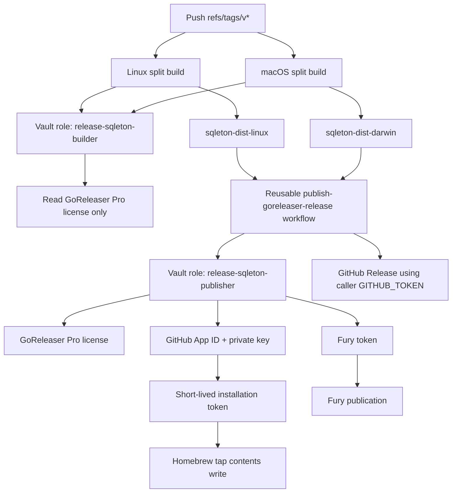
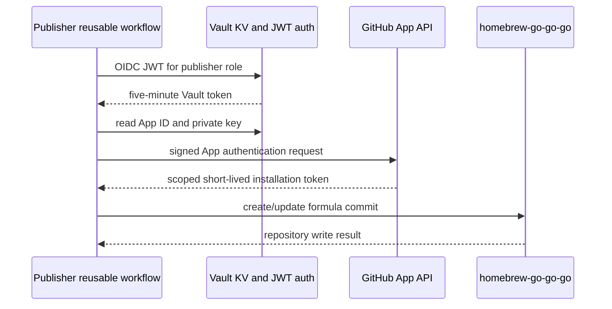
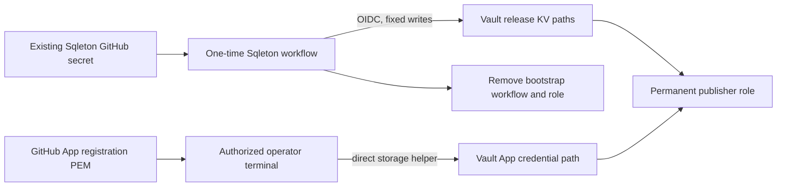
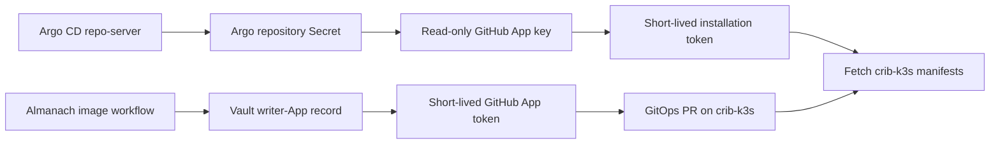

# Vault-Backed Binary Releases: Sqleton Pilot and GitHub App Publishing

This report is indexed in [[Research/KB/Projects/infrastructure-and-release]]. It records the first production-shaped adoption of Vault-backed binary publishing in the Go-Go-Golems repositories: the Sqleton release pipeline. The work moves static release credentials out of ordinary GitHub Actions secret consumption, replaces the Homebrew tap personal token with a narrowly installed GitHub App, and makes the build-versus-publish authorization boundary executable across Terraform, GitHub Actions, and a repository-local release workflow.

The important outcome is not simply that some values now live in Vault. The outcome is a release authorization model whose inputs can be reviewed. A tag build is allowed to read the GoReleaser Pro license needed to construct platform artifacts. It is not allowed to read the credential that writes a Homebrew formula or a vendor-package token. A single merge-and-publish job receives the additional release capabilities only after GitHub Actions presents a repository-, tag-, caller-workflow-, and reusable-workflow-bound OIDC identity to Vault. The Homebrew write token is minted for the release instead of retained as a broad personal access token.

> [!summary] Result at the end of the pilot
>
> - Terraform defines separate Sqleton build and publish roles, each with a five-minute Vault token and exact GitHub OIDC claims.
> - The release workflow uses GoReleaser Pro split builds for Linux and macOS, then invokes an infra-tooling reusable merge/publish workflow once.
> - Static GoReleaser and Fury values were migrated through a one-time, exact-path workflow without printing them; Vault metadata records version `1` for the resulting paths.
> - A private GitHub App, installed only on `go-go-golems/homebrew-go-go-go` with Contents read/write permission, replaced the Homebrew publisher PAT design. Its installation token was proven by creating and removing a temporary branch.
> - The migration run and App proof run completed successfully. Terraform PR #18 and Sqleton PR #274 remove the completed temporary role/workflow configuration; the remaining live temporary-role cleanup must be applied through its own reviewed plan.
> - A real production tag still requires a focused GoReleaser v2 configuration-deprecation decision. `goreleaser check --soft` validated syntax; strict checking reports the existing deprecated configuration fields.
> - The same Vault/App approach now also covers GitOps: Almanach creates a PR through a narrowly installed writer App, while Argo CD clones `wesen/crib-k3s` through a separate read-only App. The live cluster verified all six affected applications as `Synced` and `Healthy`.

## 1. Scope, repository map, and evidence

The implementation was designed and recorded in ticket `INFRA-007`:

```text
/tmp/infra-tooling-release-bootstrap-sqleton/
  ttmp/2026/07/17/
    INFRA-007--migrate-release-credentials-to-vault-and-github-app-publishing/
      design-doc/01-vault-backed-release-credentials-and-github-app-publishing-design.md
      reference/01-investigation-diary.md
      reference/02-release-bootstrap-runbook.md
      scripts/check_sqleton_release_contract.sh
      scripts/03-store-homebrew-publisher-app.sh
      sources/01-goreleaser-split-and-merge.md
      sources/02-goreleaser-v2-deprecations.md
```

The implementation crosses three repositories. This is a meaningful architectural property: neither a CI workflow nor a Vault policy alone can establish the intended release boundary.

| Repository | Relevant implementation surface | Responsibility |
| --- | --- | --- |
| `go-go-golems/infra-tooling` | `.github/workflows/publish-goreleaser-release.yml` | Reusable publisher job: Vault login, App-token minting, artifact merge, and final GoReleaser publication. |
| `wesen/terraform` | `vault/github-actions/envs/k3s/main.tf` | Declarative credential profiles, Vault policies, and GitHub Actions JWT roles. |
| `go-go-golems/sqleton` | `.github/workflows/release.yml`, `.goreleaser.yaml` | Caller workflow: tag trigger, split platform builds, artifacts, and use of the reusable publisher. |

The report uses four evidence classes.

1. **Checked-in contracts.** Terraform policy resources, OIDC claim bindings, workflow permissions, artifact names, and GoReleaser commands define the intended system.
2. **Executable contract checks.** `check_sqleton_release_contract.sh` inspects all three repositories and includes the negative build-role assertion.
3. **Live control-plane evidence.** The successful GitHub Actions migration and App-verifier runs prove a real OIDC login, Vault access, secret write, App-token mint, and scoped repository mutation.
4. **Chronological evidence.** The ticket diary retains failed checks, plan anomalies, remediation, and the cleanup sequence. This preserves the difference between a design claim and an observed result.

The report does not include private key material, Vault secret contents, PATs, vendor tokens, GPG data, or GoReleaser license values. The operational evidence deliberately uses metadata versions, field names, run IDs, policy text, and observable GitHub operations instead.

## 2. The release problem

A binary release has several independent side effects. It creates platform artifacts, can publish a GitHub Release, can upload container images, may write a formula to a separate Homebrew repository, and may submit artifacts to a vendor registry. These effects require different permissions and have different ownership and rotation properties. A single generic “release secret” conceals those distinctions.

Before this work, representative release workflows used GitHub Actions secrets for a GoReleaser license, Homebrew publishing token, Fury token, and in some repositories GPG signing material. That arrangement functions, but it makes the repository secret namespace the primary authorization boundary. It does not express which tag, workflow, or job may use which capability. It also retains a long-lived bearer credential for a different repository: the Homebrew tap.

The target design separates authority by operation.

| Operation | Minimum authority | Credential form | Where it is obtained |
| --- | --- | --- | --- |
| Build Linux/macOS artifacts | Read GoReleaser Pro license | Static vendor value | Vault builder role |
| Push Sqleton GHCR image | Repository package write | Ephemeral `GITHUB_TOKEN` | GitHub Actions runtime |
| Create GitHub Release | Caller repository contents write | Ephemeral `GITHUB_TOKEN` | GitHub Actions runtime |
| Update Homebrew formula | Contents write on only the tap | Short-lived GitHub App installation token | Vault App key + GitHub token exchange |
| Publish Fury package | Vendor package permission | Static vendor value | Vault publisher role |

This table leads to two central invariants.

- A platform build must never obtain Homebrew or Fury publication authority merely because it runs within a release workflow.
- A publisher must not obtain authority for a repository or path selected by an untrusted workflow input.

The architecture implements these invariants through distinct Vault roles, a Terraform-owned credential-profile map, fixed destination names, and a reusable workflow boundary.

## 3. Target architecture

The release begins when a version tag matching `v*` is pushed. Linux and macOS jobs build independent GoReleaser split artifacts. Each uses the low-privilege builder role. The final job receives the artifact pair and calls the reusable workflow. That called job authenticates with the higher-privilege publisher role and performs the one-time publication operations.



The GitHub App key is not a substitute for the token it mints. Vault retains a long-lived App private key because GitHub App authentication needs it. The runtime job uses it to mint a short-lived installation token limited by the App installation and requested repository. The token, not the private key, is passed to the Homebrew publisher action.

The GoReleaser license and Fury value are static vendor credentials: these vendors do not provide an equivalent short-lived exchange in this workflow. Vault therefore becomes their authoritative storage location, and the role claims constrain their exposure.

## 4. Vault policy as a release protocol

`release_credential_profiles` is a Terraform map, not workflow input. A profile names an approved set of secret paths. The caller can select only an approved profile through the reusable workflow contract; it cannot request an arbitrary Vault key. The policy derives allowed paths from that allowlist.

Conceptually, the Terraform data model has this shape:

```hcl
release_credential_profiles = {
  homebrew-fury = {
    secret_paths = [
      "kv/data/ci/release/shared/goreleaser-pro",
      "kv/data/ci/release/shared/fury-go-go-golems",
      "kv/data/ci/github/homebrew-go-go-go/release-publisher-app",
    ]
  }
}

release_publishers = {
  sqleton = {
    repository    = "go-go-golems/sqleton"
    repository_id = "579241534"
    workflow_ref  = "go-go-golems/sqleton/.github/workflows/release.yml@refs/tags/v*"
    profile        = "homebrew-fury"
  }
}
```

The actual configuration contains the exact current resource data; the example shows the design rather than a copy-and-paste declaration. Terraform renders a build policy that can read only the GoReleaser license. It separately renders a publisher policy using the named credential profile. The roles have a five-minute TTL and bind GitHub OIDC claims including:

- the immutable caller repository ID;
- the full repository name;
- `push` as the event name;
- the version-tag ref pattern;
- the exact caller workflow ref; and
- the `job_workflow_ref` of the approved reusable workflow.

`job_workflow_ref` is important because it separates the high-privilege merge job from a broad caller-workflow identity. The caller workflow requests the reusable publisher; Vault verifies that the runtime job was executing the approved reusable workflow reference. The claim is an external input from GitHub’s OIDC assertion, not a user-controlled YAML string.

```text
allow publisher read only if:
  repository_id == Sqleton immutable repository ID
  AND repository == go-go-golems/sqleton
  AND event_name == push
  AND ref matches refs/tags/v*
  AND workflow_ref matches Sqleton release workflow
  AND job_workflow_ref matches infra-tooling publisher workflow
```

The builder role intentionally does not read the Homebrew App key or Fury secret. A static analysis harness checks that negative property in addition to verifying the expected positive paths. This test shape is valuable because a release system usually becomes over-permissioned through additions, not through missing required strings.

## 5. GitHub Actions execution model

Sqleton’s caller workflow follows GoReleaser’s documented split/merge model. Platform jobs produce artifacts independently. The final job consumes their uploaded results and performs publication once. The workflow’s permissions are job-scoped rather than inherited as global `contents: write` authority.

```yaml
# Semantic outline, not a substitute for the checked-in workflow.
release-linux:
  permissions:
    contents: read
    packages: write
    id-token: write
  steps:
    - authenticate to Vault as release-sqleton-builder
    - run goreleaser-pro release --clean --split
    - upload Linux dist artifact

release-darwin:
  permissions:
    contents: read
    id-token: write
  steps:
    - authenticate to Vault as release-sqleton-builder
    - run goreleaser-pro release --clean --split
    - upload Darwin dist artifact

publish:
  needs: [release-linux, release-darwin]
  permissions:
    contents: write
    id-token: write
  uses: go-go-golems/infra-tooling/.github/workflows/publish-goreleaser-release.yml@main
```

The Linux job receives `packages: write` because it performs the GHCR image operation that Sqleton currently assigns to the Linux builder. This permission is still narrower than a release publisher credential for an unrelated Homebrew repository. The macOS job does not receive package write because it has no corresponding operation.

The shared publisher downloads the named artifacts into a normalized merge layout, handles the layout produced by GitHub artifact upload, retrieves the fixed fields from Vault, creates a GitHub App installation token for `homebrew-go-go-go`, and invokes the GoReleaser merge command. Its profile input is checked against its own allowlist. It does not use a caller-provided Vault path, App ID, tap repository, or secret-field name.

The caller’s `GITHUB_TOKEN` continues to create the GitHub Release in the caller repository. No long-lived replacement token is needed for that operation. This reduces credential inventory instead of moving every existing variable into Vault without reconsidering its purpose.

## 6. GitHub App publishing boundary

The Homebrew publisher App is a private/internal GitHub App installed on exactly one repository: `go-go-golems/homebrew-go-go-go`. It has only Contents read/write permission. It has no Actions, checks, issues, pull requests, packages, administration, webhook, or organization permission.



The private key is introduced directly from the GitHub App registration download into Vault by the operator-only helper `03-store-homebrew-publisher-app.sh`. The script validates a numeric App ID and parseable private key, writes the predetermined KV path, and emits metadata only. It is deliberately not a GitHub Actions workflow. GitHub Actions can read existing secrets but cannot recover a prior App private key or safely represent the operator’s App-registration authority.

The live verifier supplied stronger evidence than a configuration review. It authenticated through the verifier’s own temporary Vault role, read the App credential, minted an installation token, created a uniquely named temporary branch in the tap, and removed that branch. The post-run matching-ref query returned zero verifier branches. This proves the installed App’s actual repository scope and permission in the same API class the release needs.

## 7. Migration protocol

Migration was intentionally separate from permanent release operation. Existing GitHub Actions values cannot be printed or retrieved by an operator through ordinary GitHub secret APIs. A temporary exact-path workflow inside the Sqleton repository had access to the already-configured GitHub secrets and could exchange its OIDC identity for a short-lived Vault token.

The one-time workflow required a literal confirmation string, checked the two required legacy values before writing, and could write only these paths:

```text
kv/ci/release/shared/goreleaser-pro       key: license_key
kv/ci/release/shared/fury-go-go-golems    key: token
```

It could not read, list, delete, or write the Homebrew App credential. It created short-lived mode-0600 JSON files and removed them through an exit trap. The policy did not derive from the permanent publisher role; it was a separate Terraform declaration so a future repository cannot silently inherit a generic write capability.

The App key used a separate trust path. An authorized operator registered the App, installed it with selected-repository scope, downloaded a newly generated PEM, and stored it directly through the local helper. The ticket records only the resulting KV metadata version and field names.



This protocol avoids a generic “copy a named secret to an input path” utility. Such a utility would create a reusable secret-exfiltration or arbitrary-write surface. Exact source variables and exact paths are auditably narrower.

## 8. Verification and failures that improved the design

The project did not treat a successful `terraform validate` or YAML parse as sufficient proof. It accumulated distinct checks, each responsible for a class of failure.

| Check | Result | What it proves | What it does not prove |
| --- | --- | --- | --- |
| Terraform `fmt` and backend-free `validate` | Passed | HCL parses and provider schemas accept the declaration. | Dynamic `for_each` attribute names and remote-state effects. |
| GoReleaser strict check | Reports deprecations | Existing config has a production gate. | That artifact publishing succeeds. |
| GoReleaser soft check | Passed | Config syntactically validates. | That deprecated behavior is safe for a production tag. |
| Workflow YAML parse | Passed | YAML is syntactically valid. | GitHub permission and OIDC runtime semantics. |
| `go test ./...` | Passed | Sqleton project code builds and tests. | External release behavior. |
| Cross-repository shell harness | Passed | Names, role separation, fixed profile, and retired-secret absence remain aligned. | Full GitHub/Vault semantic execution. |
| Bootstrap dispatch | Passed | OIDC login and exact secret writes work. | Full multi-platform release publication. |
| App verifier dispatch | Passed | App key can mint a scoped token and write/delete a tap branch. | A full GoReleaser formula update. |

Two failed checks were operationally useful.

First, `terraform validate` accepted the `for_each` object schema even though the later live plan found the incorrect attribute name `bootstrap_policy_name`. The actual map field was `policy_name`. Terraform plan evaluates the dynamic expansion against the selected values and therefore caught the defect before mutation. Terraform PR #17 corrected the field. The lesson is specific: validation is required, but a reviewed plan is the check that evaluates the live resource graph.

Second, the first remote plan showed unrelated planned destruction for three Almanach `docsctl` resources. No apply was run. After the field fix, the release resources were applied through a saved targeted plan containing exactly eight adds, zero changes, and zero destroys. Targeting was a deliberate exception in response to unrelated state drift, not a general operating method. It preserved the unrelated issue for separate reconciliation while allowing the reviewed pilot boundary to proceed.

The evidence command also encountered a zsh-specific defect: a loop variable named `path` overwrote zsh’s special command-search variable. Renaming it to `secret_path` restored normal command resolution. This did not affect Vault state, but the diary preserves it because evidence collection scripts are part of production operations.

## 9. Live execution evidence and review state

The implementation was reviewed and merged in independently scoped changes.

| Pull request | State observed 2026-07-17 | Contribution |
| --- | --- | --- |
| [infra-tooling #23](https://github.com/go-go-golems/infra-tooling/pull/23) | Merged | Shared Vault-backed GoReleaser publisher workflow. |
| [terraform #15](https://github.com/wesen/terraform/pull/15) | Merged | Permanent Sqleton build and publisher roles. |
| [sqleton #273](https://github.com/go-go-golems/sqleton/pull/273) | Merged | Caller split-build and reusable publisher workflow. |
| [infra-tooling #24](https://github.com/go-go-golems/infra-tooling/pull/24) | Merged | Operator bootstrap runbook. |
| [terraform #16](https://github.com/wesen/terraform/pull/16) | Merged | Temporary bootstrap and App-verifier roles. |
| [terraform #17](https://github.com/wesen/terraform/pull/17) | Merged | Corrected bootstrap policy-field reference found by plan. |
| [infra-tooling #25](https://github.com/go-go-golems/infra-tooling/pull/25) | Merged | Recorded live bootstrap and updated the contract harness for permanent state. |
| [terraform #18](https://github.com/wesen/terraform/pull/18) | Merged | Deletes temporary bootstrap and verifier policy/role declarations. |
| [sqleton #274](https://github.com/go-go-golems/sqleton/pull/274) | Merged | Deletes the temporary manual workflows after their successful proof. |

The successful migration run is [Sqleton Actions run 29618538658](https://github.com/go-go-golems/sqleton/actions/runs/29618538658). It completed the confirmation, secret-availability, OIDC, and two fixed Vault-write steps. The successful App proof is [Sqleton Actions run 29618554610](https://github.com/go-go-golems/sqleton/actions/runs/29618554610). It completed Vault read, App-token minting, temporary branch create, and cleanup. The ticket recorded KV metadata version `1` for all three target paths and confirmed no verifier branches remained.

The permanent roles are merged, and Sqleton's temporary workflow deletion is now merged. The temporary-role deletion still must be applied to the live Vault environment after the merged Terraform cleanup configuration is planned and reviewed. That remaining cleanup must not be folded into an unrelated infrastructure mutation.

## 10. GitOps extension: writer and reader Apps have different trust boundaries

The release-publishing work exposed a second GitHub credential problem in the
same infrastructure. `go-go-golems/almanach` publishes a GHCR image and then
opens a GitOps pull request against `wesen/crib-k3s`. Its
`.github/workflows/publish-image.yaml` calls infra-tooling's reusable
`publish-ghcr-image.yml` workflow with `gitops_pr_token_source: github_app`.
The workflow reads an App ID and private key from
`kv/ci/github/almanach-render-service/gitops-pr-app`, then calls
`actions/create-github-app-token@v2` for the fixed `wesen/crib-k3s` target.

The first live run, [Almanach run 29618613972](https://github.com/go-go-golems/almanach/actions/runs/29618613972), successfully built and pushed the image but failed in the `Open GitOps PR` job. The failing step was specifically `Mint GitHub App token for GitOps repository`. GitHub returned `Not Found` from the endpoint that resolves an installation for the authenticated App. Vault read had already succeeded, so the failure was neither an OIDC failure nor a missing Vault policy. It meant that the App authenticated successfully but was not installed on the requested selected repository.

The App installation was updated under the `wesen` account to include
`crib-k3s`. Re-running only the failed job minted the installation token and
created [crib-k3s PR #6](https://github.com/wesen/crib-k3s/pull/6), which
updates the Almanach production image to
`ghcr.io/go-go-golems/almanach:sha-305abd9`. This establishes a useful
operational test: a real, ordinary publisher operation proves the App's
selected-repository scope, token minting, and Contents write capability.

Argo CD requires a different credential. The GitHub Actions publisher needs
write access for short-lived automation. Argo CD's repository server needs to
read the GitOps repository repeatedly and holds its configuration in the
cluster. Reusing a writer App for this reader role would leave a write-capable
private key in the cluster. The durable design therefore uses separate Apps:

| Consumer | App authority | Vault record | Reason |
| --- | --- | --- | --- |
| Almanach GitHub Actions publisher | Contents read/write on `wesen/crib-k3s` | `kv/ci/github/almanach-render-service/gitops-pr-app` | Create a branch and pull request that changes an image reference. |
| Argo CD repository server | Contents read on `wesen/crib-k3s` | `kv/ci/github/crib-k3s/argocd-repository-app` | List refs and clone manifests. It never writes GitOps branches. |



### 10.1 The stale PAT failure

Before the reader-App migration, Terraform created the cluster Secret
`argocd/repo-crib-k3s` from `kv/ci/github/gitops-pr-token`. The Secret used an
HTTPS `username: x-access-token` plus `password` token form. This was a
separate, older credential from the GitHub Actions writer-App record. Its
token had become invalid or revoked.

Argo CD made the operational effect visible: `almanach`, `argocd-crib`,
`grafana-crib`, `jellyfin`, `platform-cert-issuer`, and `poll-modem` were all
`Sync: Unknown` with the same comparison error:

```text
failed to list refs: authentication required: Invalid username or token.
Password authentication is not supported for Git operations.
```

The error was emitted by `argocd-repo-server` while resolving
`https://github.com/wesen/crib-k3s.git`. Local Git remotes and the historical
`/home/manuel/code/wesen/2026-03-27--hetzner-k3s` checkout were not the live
credential source. The current cluster uses the `crib-k3s` repository and its
Kubernetes repository Secret.

### 10.2 Terraform recovery and live proof

An operator generated a dedicated `crib-k3s-argocd-reader` App key, installed
it only on `wesen/crib-k3s`, and granted Contents read permission. The PEM was
restricted to mode `0600`, validated without printing it, and stored directly
in Vault at the reader-specific path. The record contains only `app_id` and
`private_key`; the recorded Vault metadata version is `1`.

[Terraform PR #19](https://github.com/wesen/terraform/pull/19), **use GitHub
App for crib repository**, changed
`vault/github-actions/envs/k3s/main.tf` from the PAT fields to Argo CD's native
GitHub App repository fields:

```hcl
data "vault_kv_secret_v2" "crib_k3s_argocd_repository_app" {
  mount = "kv"
  name  = "ci/github/crib-k3s/argocd-repository-app"
}

data = {
  type                = "git"
  url                 = "https://github.com/wesen/crib-k3s.git"
  githubAppID         = data.vault_kv_secret_v2.crib_k3s_argocd_repository_app.data["app_id"]
  githubAppPrivateKey = data.vault_kv_secret_v2.crib_k3s_argocd_repository_app.data["private_key"]
}
```

Argo CD v3.3.9 supports these fields and can discover the installation ID from
the repository organization. Live logs confirmed that it auto-discovered the
`wesen` installation and generated Almanach manifests successfully. The
reader App's key fingerprint was compared locally and in the Kubernetes Secret
without emitting the key. GitHub's App API also confirmed selected-repository
scope and Contents read permission.

The normal Terraform plan included seven unrelated pending destroys: the
previous Sqleton temporary-role cleanup and an unrelated Almanach docsctl
state discrepancy. No full apply occurred. A fresh saved targeted plan against
the merged Terraform main branch contained exactly one in-place update to
`argocd/repo-crib-k3s` and was applied. This was a documented recovery
exception; the unrelated state must still be reconciled independently.

After the Secret update, a hard refresh of the six affected Applications
forced repository comparison through the new App credentials. All six reached
`Synced`, `Healthy`, and had no `ComparisonError`. Repository-server logs no
longer reported invalid credentials.

### 10.3 The remaining secret-delivery boundary

The App private key is not committed to source, a variable file, plan output,
or documentation. Terraform reads the Vault record to populate the Kubernetes
Secret. This is necessary for the current Terraform/Kubernetes-provider
arrangement, but it means the encrypted remote Terraform state is a sensitive
credential boundary. State access must remain tightly restricted and audited.

An External Secrets or dedicated credential-provider migration would be the
next architectural improvement. It would let the cluster synchronize the
reader key from Vault without Terraform receiving and recording the key value.
That work is outside this recovery; it should be designed and tested as a
separate secret-delivery change.

## 11. Production gate and residual work

The pilot proves the credential and App paths. It does not certify the first production tag. The remaining work is explicit and bounded.

1. **Complete temporary-path removal.** Merge Sqleton PR #274. Run a fresh Terraform plan after the merged cleanup change and require only the four temporary policy/role destructions, with no permanent release role change. Apply the reviewed plan. Confirm the two manual workflows are absent and the permanent contract harness passes.
2. **Resolve the GoReleaser v2 deprecation gate.** Strict `goreleaser check` reports `snapshot.name_template`, archive fields, Docker configuration, and `brews` deprecations. Decide whether to migrate each configuration element in a focused artifact-compatibility change or formally approve a limited temporary exception. Do not redefine a syntax-only soft check as production acceptance.
3. **Perform a controlled version-tag release.** Verify the GitHub Release, checksums/signature behavior if configured, GHCR image, Homebrew formula, Fury package, and release notes. Record URLs and release version, not credentials.
4. **Remove legacy GitHub secrets only after the controlled release.** This removes the second source of authority. It is separate from the Vault migration because rollback is still possible before the first production evidence.
5. **Update third-party actions before broad adoption.** The successful workflows emitted non-failing Node.js 20 deprecation warnings for `hashicorp/vault-action@v3` and `actions/create-github-app-token@v2` under GitHub’s Node 24 transition. Verify supported versions and behavior in an isolated update before copying this pattern to additional repositories.
6. **Reconcile the unrelated Almanach Terraform drift in its own ticket.** The drift was intentionally excluded from the Sqleton plan. It should not be normalized by an unrelated release migration apply.

## 12. Adoption principles for the next repository

The pilot establishes a reusable sequence, not a blind template copy.

1. Inventory every release side effect from the actual GoReleaser file and workflow. Do not infer required secrets from secret names alone.
2. Separate build-time and publication-time capabilities. If platform builds need only a license, create a builder role that reads only that license.
3. Declare a repository credential profile in Terraform. Profiles own secret paths; workflow inputs name profiles rather than paths.
4. Bind roles to immutable repository ID, repository name, tag ref, caller workflow, and reusable workflow reference. Run a diagnostic before applying if a new claim shape is involved.
5. Use `GITHUB_TOKEN` for same-repository GitHub release operations when it is sufficient. Do not replace it with a stored token.
6. For cross-repository GitHub writes, prefer a narrowly installed GitHub App and mint an installation token at runtime.
7. Implement a temporary migration workflow only when existing GitHub secret values must move without disclosure. Give it fixed paths, confirmation, short TTL, and a deletion plan.
8. Add a cross-repository contract check before a live release. Include negative privilege assertions.
9. Verify a real operation with a reversible mutation, then remove temporary roles/workflows. A read-only metadata check cannot establish write scope.
10. Delete legacy secrets only after a controlled release succeeds.

The companion reusable procedure is [[Research/playbooks/infra/PLAYBOOK - Vault Backed Go Binary Releases]]. It is written for a new repository and for an existing repository conversion. It includes inputs, Terraform and workflow contracts, bootstrap rules, test matrix, failure handling, and closure checklist.

## 13. API and file reference

| Concern | File or API | Reader action |
| --- | --- | --- |
| Shared publisher interface | `infra-tooling/.github/workflows/publish-goreleaser-release.yml` | Inspect accepted profile and artifact inputs, Vault reads, App-token creation, and merge invocation. |
| Sqleton caller | `sqleton/.github/workflows/release.yml` | Compare job permissions and each job’s Vault role. |
| Sqleton artifact configuration | `sqleton/.goreleaser.yaml` | Review the exact deprecations before tagging. |
| Authorization source | `terraform/vault/github-actions/envs/k3s/main.tf` | Trace profile paths, policies, roles, and OIDC bound claims together. |
| Contract test | `INFRA-007/scripts/check_sqleton_release_contract.sh` | Run it against explicit clean checkouts before a release change. |
| App storage helper | `INFRA-007/scripts/03-store-homebrew-publisher-app.sh` | Use only from an authorized operator environment; it writes the fixed App path. |
| Bootstrap runbook | `INFRA-007/reference/02-release-bootstrap-runbook.md` | Follow for a new migration; never paste values into tickets or shell history. |
| Argo CD reader migration | `terraform/vault/github-actions/envs/k3s/main.tf` | Trace the reader-App Vault record into the `argocd/repo-crib-k3s` Secret. |
| GitOps writer workflow | `infra-tooling/.github/workflows/publish-ghcr-image.yml` | Inspect App token minting and its fixed target repository input. |

## 14. Final assessment

INFRA-007 produced a materially stronger release architecture for Sqleton. The release workflow is no longer an undifferentiated collection of repository secrets. It now has named policy boundaries, exact identity constraints, short Vault leases, a short-lived cross-repository GitHub token, a deterministic one-time migration path, executable cross-repository checks, and successful live proof of the credential and App write paths.

The project also demonstrates appropriate restraint. A successful bootstrap is not mislabeled as a full release. A syntax-only GoReleaser check is not treated as a strict configuration pass. An unrelated Terraform destroy is not bundled into a convenient apply. Temporary write and verification authority is scheduled for removal instead of becoming permanent operational debris. These distinctions are the practical basis for release systems that remain reviewable after the pilot repository is no longer fresh in memory.

## References

- [[Research/KB/Projects/infrastructure-and-release]]
- `INFRA-007/design-doc/01-vault-backed-release-credentials-and-github-app-publishing-design.md`
- `INFRA-007/reference/01-investigation-diary.md`
- `INFRA-007/reference/02-release-bootstrap-runbook.md`
- [GoReleaser split and merge documentation](https://goreleaser.com/customization/general/partial/)
- [GoReleaser v2 deprecations](https://goreleaser.com/deprecations/)
- [GitHub App installation authentication](https://docs.github.com/en/apps/creating-github-apps/authenticating-with-a-github-app/authenticating-as-a-github-app-installation)
- [GitHub App private-key management](https://docs.github.com/en/apps/creating-github-apps/authenticating-with-a-github-app/managing-private-keys-for-github-apps)
- [Vault policies](https://developer.hashicorp.com/vault/docs/concepts/policies)
- [Argo CD declarative GitHub App repository credentials](https://argo-cd.readthedocs.io/en/stable/operator-manual/declarative-setup/)
