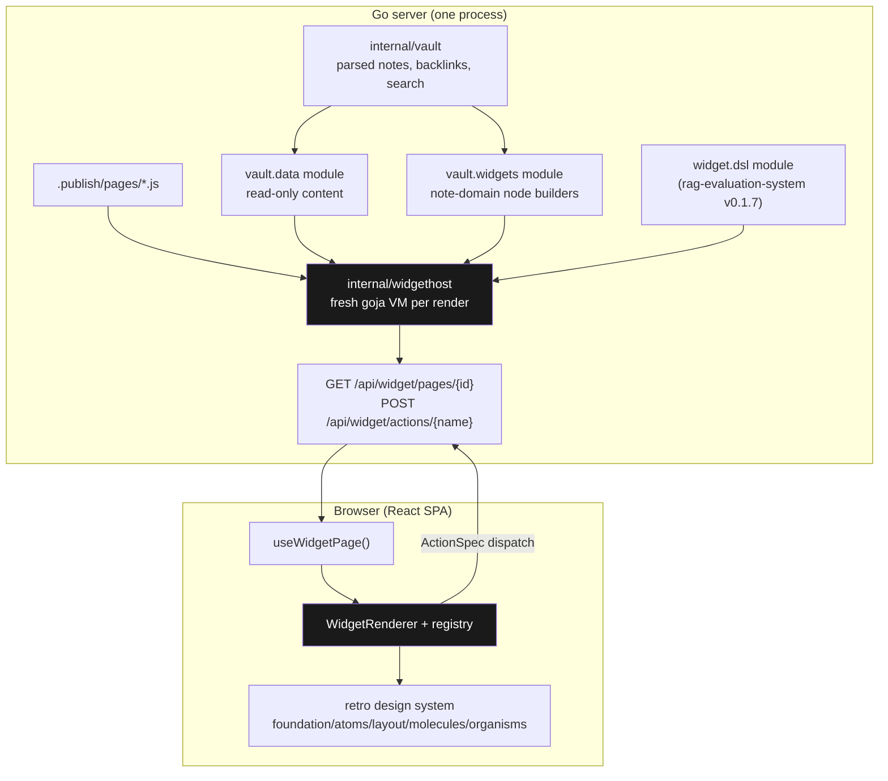

# Publish Vault Widget DSL — Server-Driven Pages from an Embedded JavaScript Runtime

This report is a technical deep dive into two days of work (2026-07-17/18) that turned publish-vault from a static vault renderer into a host for JavaScript-composed pages. It covers the design and its decision records, the frontend reorganization that preceded the runtime work, the embedded goja host and its module architecture, the note-domain widget grammar, a React 19 rendering bug that the work surfaced and fixed, and the library-extraction plan filed against rag-evaluation-system. The goal of this note is that a reader who has never seen either repo can understand what was built, why each boundary sits where it does, and what would break if a boundary were moved.

> [!summary]
> - publish-vault now embeds goja and executes [[widget-dsl]] v3 page scripts server-side: a `.js` file in `<vault>/.publish/pages/` becomes an interactive page at `/w/<id>`, rendered by a registry-driven React IR renderer.
> - Three native modules with distinct ownership: `widget.dsl` (imported from [[rag-evaluation-system]] v0.1.7, unmodified), `vault.data` (read-only vault content), `vault.widgets` (note-domain node builders). The sibling-module split is a deliberate workaround for v3's missing namespace-extension API, tracked in rag-evaluation-system#28.
> - The work surfaced a latent bug class: React 19 re-applies `dangerouslySetInnerHTML` on every re-render, destroying all post-render DOM enhancements. The fix is a `memo()` on the HTML host component, and it is load-bearing, not an optimization.
> - Everything shipped as PR go-go-golems/publish-vault#11 (12 commits, all CI green), documented in tickets PV-WIDGET-DSL-015 and PV-VAULT-WIDGETS-016 under `ttmp/2026/07/17/`.

## Why this project exists

publish-vault (repository name `retro-obsidian-publish`) serves an Obsidian vault as a website: a Go binary parses Markdown with goldmark, resolves `[[wiki links]]` and backlinks, indexes content with Bleve, and serves a JSON API plus an embedded React SPA styled after Macintosh System 1. Every page the site could show was one of three fixed shapes — the home note, a note by slug, or search results. Adding any other kind of page meant writing TypeScript, rebuilding the SPA, and re-embedding it in the Go binary.

Meanwhile, rag-evaluation-system had matured **widget DSL v3**: a goja fluent-builder grammar that lowers to a typed, serializable widget intermediate representation (IR), served as JSON and rendered in the browser by a generic renderer against a registry of component adapters. The pattern's essential property is that page *composition* becomes data. A page script runs on the server, produces a tree of `{kind, type, props, children}` nodes, and the browser renders that tree without knowing anything about the page that produced it.

The project goal was to bring that pattern to publish-vault so that dynamic pages — dashboards, tag overviews, note readers with custom navigation — could be authored as small JavaScript files living next to the vault content, with no frontend build step. A prior design ticket (PV-BACKEND-API-001, 2026-06-22) had already mapped the backend/xgoja side; this work is the UI-authoring layer on top of it.

## Current project status

Complete and shipped as PR go-go-golems/publish-vault#11 (all CI checks green as of 2026-07-18, unmerged at the time of writing). The live dogfood instance serves the go-go-parc vault (~980 notes) with three JS pages in `.publish/pages/`: `reader.js` (a complete note reader with its own sidebar navigation), `recent.js` (recently updated notes), and `tags.js` (tag overview). Both tickets are closable. The remaining decisions are deployment (merge → GitOps → k3s) and whether page scripts get write verbs.

## Architecture

The system is a pipeline with five stages and three ownership domains. JavaScript owns composition, Go owns content and execution, and React owns presentation.



A request to `/api/widget/pages/reader?slug=index` proceeds as follows. The host validates the page id, opens `reader.js` through an `os.Root` confined to the pages directory, and creates a fresh goja VM with the three modules registered. The script runs; it calls `vault.data.note("index")` to fetch content, composes nodes with `widget.dsl` builders and `vault.widgets` helpers, and leaves a `page` binding. The host calls `page.toPage()`, which validates and lowers the builder state into the IR, marshals it to JSON, and returns it. The browser's `WidgetRenderer` walks the tree, looks up each `component` node's `type` in the adapter registry, and renders. User interactions do not call component callbacks; they dispatch serialized `ActionSpec` values — `navigate`, `server`, `copy`, `download` — that either route client-side or POST back to a handler exported by the same script.

The wire format is small enough to state completely. A page is `{schemaVersion, id, title, shell?, root}`; a node is one of three kinds:

```ts
type WidgetNode =
  | { kind: "text";      text: string }
  | { kind: "element";   tag: string; attrs?: object; children?: WidgetNode[] }
  | { kind: "component"; type: string; props?: object; children?: WidgetNode[] }
```

Everything dynamic is defunctionalized into this data. Table cells are `CellSpec` objects (`{kind: "status", field: "status"}`), conditional behavior is an `ActionSpec`, and navigation menus are a `shell` spec. There are no functions on the wire, which is what makes the pages serializable, cacheable, testable against goldens, and renderable by any client that speaks the schema.

## Implementation details

### The frontend had to be reorganized first

The SPA carried substantial debt from its starter template: 51 of 53 generated shadcn `components/ui/*` primitives were unused (verified with an import graph before deletion — shadcn files import each other heavily, so "unused" must be computed on external importers only), roughly 50 npm dependencies existed only for that dead code, and one 988-line `index.css` mixed two token systems with a hundred bespoke classes. `web/src` shrank from ~12,400 to ~7,600 lines with zero visible change, validated by the SSR hydration test suite and a browser smoke harness.

Two structural moves from this phase matter for everything after. First, the stylesheet split into layers — `tokens.css` (a canonical `--pv-*` palette that Tailwind's `@theme` block re-maps onto the existing `--color-*` names, so no component changed), `bridge.css` (mapping the `--rag-*` tokens that ported rag-evaluation components consume onto the retro palette), `base.css`, `chrome.css`, `prose.css`. The bridge file is the entire theming strategy: ported components keep their CSS-module idiom, publish-vault components keep Tailwind, and the token layer is the only contract between them. rag-evaluation-site itself uses this exact pattern for its legacy `--mac-*` tokens, which is what justified it.

Second, the 431-line `NoteRenderer` monolith was decomposed into parts with injectable dependencies: a pure HTML host (`NoteBody`), an enhancement pipeline of standalone functions (`noteEnhancements.ts`: mermaid → syntax highlighting and copy buttons → embed resolution → heading anchors, in that order because mermaid must consume its code blocks before the highlighter walks the remaining `<pre>` elements), and an actions row. Every ad-hoc `fetch()` moved into RTK Query. The decomposition looked like hygiene at the time; it turned out to be the enabling condition for the widget work, because a widget adapter could later compose the same pipeline pieces without inheriting the page around them.

### The dependency decision

The single most consequential choice was how to obtain the DSL. Widget DSL v3 is ~4,300 lines of Go (fluent builders, a typed spec layer with `Validate()` and `ToWidgetPage()` lowering) pinned by 43 example scripts with golden IR JSON — an executable specification of the grammar. Reimplementing it guarantees drift from that specification. Extracting it into a shared library first would have blocked this project on a cross-repo refactor. The decision (recorded as D1 in the ticket) was to depend on `github.com/go-go-golems/rag-evaluation-system` v0.1.7 directly and treat extraction as a follow-up compatibility event.

The risk in that decision is silent grammar drift on upgrade, and the mitigation is a **contract-parity test**: rag-evaluation's `01-simple-table` example and its golden JSON are copied into publish-vault's testdata, and a test renders the example through publish-vault's own host and asserts deep equality with the golden. If a future `go get -u` changes the grammar's output, this test fails instead of production pages changing shape quietly.

The same decision could not be made for the TypeScript half, because there is nothing to depend on — the renderer core (`ir/` types, registry, dispatcher, `WidgetRenderer`) lives inside rag-evaluation-site's application package, unpublished. It was copy-ported with provenance headers, which is acknowledged drift debt. Both halves of this asymmetry are what rag-evaluation-system#28 exists to fix: extract a `widget-dsl` repo with a Go module and a headless npm package, add a `RegisterNamespace` extension API, a host harness, and a conformance kit that runs all 43 goldens against any host.

### The host: fresh VMs and two custom modules

`internal/widgethost` deliberately creates a fresh `goja.Runtime` per render rather than pooling. A pooled VM would carry state between requests — globals set by one page script would leak into the next — and the measured cost of a fresh VM with module registration is milliseconds, acceptable for a personal-site workload. The host wraps each script with the same convention rag-evaluation's preview server established: run the source, then return `page.toPage()` if `page` is a builder, plus any exported `actions` object.

One implementation detail cost a debugging cycle and is worth preserving: the wrapper's result contains both the page (data) and the action handlers (live JavaScript functions). The first implementation marshaled the whole result to JSON and crashed on the functions (`json: unsupported type: func(goja.FunctionCall)`). The fix keeps the wrapper result as a live `*goja.Object`, marshals only the `page` member for rendering, and retains the object-plus-VM pair for action invocation. Render and action paths need different lifetimes from the same evaluation.

The two publish-vault modules follow the same pattern and a strict rule set:

- `vault.data` exposes `config/notes/note/search/tree/tags`. Every return value passes through a JSON round-trip (`json.Marshal` → `json.Unmarshal` → `vm.ToValue`) so scripts receive exactly the shapes the HTTP API serves — never live Go objects, method sets, or pointers. The list-building logic was lifted into exported helpers (`api.NoteList`, `api.TagCounts`) shared by the HTTP handlers, so there is one source of truth for the wire shape.
- `vault.widgets` provides note-domain builders — `noteHtml` (accepts a note object or a slug; unknown slugs throw so authors fail loudly), `frontmatter`, `breadcrumb`, `backlinks`, `tagList`, `noteCard`. Each returns a plain IR component node, which is exactly what `widget.raw.component` would produce; the helpers are sugar that keeps the escape hatch out of user code. `backlinks` resolves slugs to titles and excerpts server-side against the vault snapshot, because forcing every script to loop `vault.note(slug)` per backlink is boilerplate paid in VM-boundary crossings.
- Both modules read one immutable snapshot per call (`RuntimeState` swaps snapshots atomically on reload), so a render never sees a half-reloaded vault. Both are read-only; write verbs are an explicitly parked decision, because the moment scripts can mutate frontmatter or trigger reloads, the trust model of the pages directory needs its own analysis.

A page script that exercises the whole surface:

```js
const widget = require("widget.dsl");     // grammar (rag-evaluation-system, unmodified)
const vault  = require("vault.data");     // content
const vw     = require("vault.widgets");  // note-domain sugar

const note = vault.note(request.query.slug || "index");

const shell = widget.app.shell((s) =>
  s.navigation((nav) =>
    nav.placement("sidebar").active("reader")
       .section("pages", "Pages", (items) =>
         items.item("reader", "Reader", widget.act.navigate("/w/reader"))
              .item("recent", "Recently updated", widget.act.navigate("/w/recent")))));

const page = widget.page(note.title, (p) =>
  p.id("reader").shell(shell)
   .view(vw.breadcrumb(note))
   .view(vw.frontmatter(note))
   .view(vw.noteHtml(note))
   .section("Linked mentions", (s) =>
     s.view(vw.backlinks(note, { onSelect: widget.act.navigate("/note/${slug}") }))));
```

Forty-five lines produce a complete note reader with its own navigation. The `${slug}` in the navigate action is not JavaScript interpolation — it is a template the browser-side dispatcher resolves against the action context at click time.

### The renderer: a registry decouples IR types from any component library

The browser side is a ported `WidgetRenderer` that switches on node kind: text nodes become strings, element nodes become `createElement` calls, and component nodes are looked up in a registry of adapters. An adapter is ten lines — `defineWidget({type, module, render(props, children, ctx)})` — whose only jobs are decoding serialized props and translating callback conventions into dispatched actions with context.

The registry is what lets publish-vault keep its own visual identity while speaking a shared IR. Sixteen adapters exist: generic ones (Stack, Inline, Panel, SectionBlock, DataTable, KeyValueStrip, Text, Caption, Divider, Tag) and note-domain ones (NoteHtml, FrontmatterPanel, BreadcrumbBar, BacklinksPanel, TagCloud, NoteCard). A deliberate finding from the second ticket: **the note-domain adapters introduce almost no new components**. The question "what would a NoteFrontmatter widget add to the existing FrontmatterPanel molecule?" has the answer "nothing" — an adapter adds IR addressability (a type name, serialized props, action wiring), not pixels. So existing molecules were registered under their own names, and the only genuinely new component is `NoteHtml`, the standalone rendered-body widget composed from the phase-2 pipeline pieces with per-flag gating (`{embeds: false}` skips embed resolution) and wiki-link clicks surfaced as dispatched navigate actions rather than a hardcoded router call.

Unknown component types render a visible error callout rather than nothing, and a registry-completeness test walks captured live IR fixtures asserting every type present has an adapter — real pages can never silently hit the fallback.

Two rendering conventions were adjusted during dogfooding, both in the adapter layer rather than the grammar. Top-level sections render article-style — an underlined heading matching the note prose, not boxed window chrome — because widget pages should read like the rest of the site. And v3 wraps page-level `.view()` nodes in auto-generated sections labeled "Content"; the SectionBlock adapter renders that structural filler unlabeled, since three "Content" rules between every view is lowering detail, not authored intent.

### JavaScript-controlled navigation

v3 pages can declare a shell: `widget.app.shell(...)` lowers to `{kind: "app", navigation: {placement, sections: [{id, label, items: [{id, label, action}]}], activeItemId}, content}`. publish-vault previously carried this as opaque data. Now `resolvePageShell` (ported semantics, with a publish-vault-specific default: no shell means vault chrome, not an auto-generated app shell) interprets it, and an app shell with sidebar placement replaces the vault's file tree with a `SidebarNav` rendered from the spec.

The wiring problem is that `VaultLayout` — which owns the sidebar — wraps the router, while the shell arrives with a routed page's data. The solution is a setter context: the routes component owns `useState<ReactNode>` for a sidebar override and provides the setter; the widget page sets its `SidebarNav` element while mounted with a sidebar shell and clears it on unmount. Note and search routes therefore always get the file tree back without knowing the mechanism exists. One verified subtlety from the design phase deserves emphasis: the shell builder grammar sketched in the design doc was wrong, and the phase plan included a step to true it up against `v3.go` before implementing. The verified chain is `s.navigation(nav => nav.placement(...).section(id, label, items => items.item(id, label, action)))` — reading the grammar source before building against a sketch saved an implementation against a fiction.

### The React 19 bug: re-renders destroyed every enhancement

A user report — "when you open a note URL with `#heading`, the anchor links disappear" — led to the most instructive finding of the project. The diagnosis escalated through five instruments, each eliminating a hypothesis class:

1. Timeline sampling showed enhancements present at load and absent after same-document hash navigation, but flakily — some runs lost them at plain load.
2. DOM identity markers showed the container element *survived* with its top-level child count intact while every injected sub-element (anchors, copy buttons) vanished: an `innerHTML` rewrite, not a remount.
3. Intercepting `Element.prototype.innerHTML` with stack capture caught React's `commitUpdate → updateProperties → setProp` writing the body ~60ms after each hash change.
4. Component-level logging on the dev server showed the writes occurred with the component's HTML state **unchanged** and none of the state-keyed enhancement effects re-running.
5. A falsification test removed the hash framing entirely: toggling the right panel — a pure UI state change — destroyed half the anchors.

Two defects compounded. First, the client entry called `hydrateRoot` unconditionally, but the local server runs without the SSR sidecar, so `#root` is empty; React 19 fails hydration (error #418) and performs a recovery render at nondeterministic times — this was the flakiness. Second, and generally: **React 19 re-applies `dangerouslySetInnerHTML` on every re-render**, because the `{__html}` prop object is new each render. The DOM is reset, but the effects that inject enhancements are keyed on the HTML *string*, which did not change, so nothing restores them. Any parent re-render — router context, Redux state, anything — silently destroyed the enhanced DOM.

The fixes are five lines each. The entry hydrates only when `root.hasChildNodes()`, else `createRoot`. And the HTML host is memoized on the html string:

```tsx
// memo() is load-bearing, not an optimization: the DOM may only be
// rewritten when the content changes, because that is exactly when the
// [html]-keyed enhancement effects re-run.
export const NoteBody = memo(forwardRef<HTMLDivElement, {html: string}>(
  ({ html }, ref) => (
    <div ref={ref} className="note-prose" dangerouslySetInnerHTML={{ __html: html }} />
  )));
```

The general rule this preserves: **post-render DOM mutation and re-render-driven DOM replacement must be synchronized through the same key.** If effects enhance what `dangerouslySetInnerHTML` produced, the component must be memoized so React can only rewrite the DOM when the effects will also re-run. Verification was a three-round matrix on the production build (fresh-load-with-hash, no-hash, same-document hash navigation, anchor click — 88 anchors and 116 copy buttons surviving every cell) plus the re-render falsification test.

The bug predated this project — the old monolith had the identical structure — and the fix motivated the closing consolidation: `NoteView` (the classic `/note/*` page) was rewritten to delegate its body to the same `NoteHtml` component the widget registry renders. There is now exactly one note-rendering path for both surfaces, so this bug class has a single owner.

### Testing strategy

The test surface mirrors the ownership domains. Each row exists because the corresponding drift would otherwise be silent.

| Layer | Test | What silent failure it prevents |
|---|---|---|
| Grammar | Contract-parity golden vs rag-evaluation's `01-simple-table` | DSL upgrade changing IR shape unnoticed |
| Host | Deterministic reader-page golden (`UPDATE_GOLDEN=1` regen; volatile `modTime` fields redacted because temp-vault mtimes differ per run) | Module or lowering changes altering real page output |
| Modules | Script-driven tests running JS through a registry-enabled VM | Wire-shape divergence between HTTP API and JS view |
| Registry | Completeness test over captured live IR fixtures | Pages hitting the UnknownWidget fallback |
| Shell | Resolution unit tests incl. the real golden's shell | Navigation spec misinterpretation |
| SSR | 13 hydration tests + a Chromium smoke harness | Hydration mismatch reintroduction |
| E2E | Playwright scripts against the live 980-note vault | Everything the layers above cannot see composed together |

The E2E layer earned its keep twice: it caught that the widget route did not forward the query string to the API (so `?slug=` was silently ignored — page scripts read `request.query`, but the fetch URL dropped it), and it caught the "Content" auto-section rendering issue.

## Project shape

- `internal/widgethost/` — script discovery, fresh-VM execution, HTTP contract, goldens and parity fixtures in `testdata/`.
- `internal/vaultdata/`, `internal/vaultwidgets/` — the two publish-vault native modules with script-driven tests.
- `web/src/widgets/` — IR types, registry, `WidgetRenderer`, action dispatcher, shell resolution, sidebar-slot context, captured fixtures.
- `web/src/components/` — five design-system tiers (`foundation/`, `atoms/`, `layout/`, `molecules/`, `organisms/`); `.widget.tsx` adapters sit next to the components they adapt.
- `web/src/styles/` — the five-layer stylesheet split with the `--rag-*` → `--pv-*` bridge.
- `examples/widget-pages/` — `reader.js`, `recent.js`, `tags.js`, also deployed into this vault's `.publish/pages/`.
- Tickets: `ttmp/2026/07/17/PV-WIDGET-DSL-015--*/` and `ttmp/2026/07/17/PV-VAULT-WIDGETS-016--*/` — design docs with decision records D1–D6 and step-by-step implementation diaries, including the full bug-hunt narrative.

## Open questions

- **Write verbs.** Should page scripts get `vault.setFrontmatter`/`reload`, the go-go-goja `database` module, or stay read-only? This is the gate between "dashboards" and "applications" (publish consoles, RSVP pages), and it changes the trust analysis of the pages directory.
- **SSR and agent mirrors for widget pages.** `/w/*` pages are client-rendered JSON fetches — invisible to crawlers and the markdown mirror system. PV-BACKEND-API-001's render contract is the designed answer; until it lands, the main site deliberately stays on the classic pipeline.
- **Extraction timing.** rag-evaluation-system#28 (shared `widget-dsl` library, `RegisterNamespace`, host harness, headless TS package, conformance kit) removes the copy-ported TypeScript and promotes `vault.widgets` to a first-class `widget.vault.*` namespace. Until then the sibling-module arrangement is stable but second-class in docs and type generation.

## Near-term next steps

- Merge PR #11; the GitOps job opens the deployment PR toward the k3s instance, which currently still serves the pre-fix code (the `dangerouslySetInnerHTML` bug affects production `#anchor` links today).
- Close both docmgr tickets; decide write verbs.
- When #28 lands: flip the Go import, replace `web/src/widgets/` copies with the published package, delete the local parity fixture in favor of the conformance kit.

## Project working rule

Grammar identity is a tested contract, not an intention: any host claiming to speak widget DSL v3 must prove it against the upstream goldens, and any component that mutates DOM after render must be memoized on the same key that re-triggers its effects.

## Related notes

- [[widget-dsl]] — the Widget DSL knowledge-base map this project now feeds back into.
- [[rag-evaluation-system]] — origin of the grammar, renderer pattern, and the v0.1.7 dependency.
- [[go-go-goja]] — the embedded JavaScript runtime and module-registrar conventions (`uidsl` is the element-level precedent; this project is the semantic layer above it).
