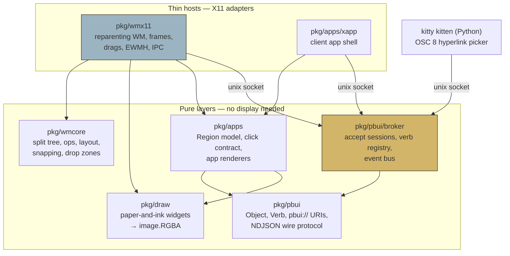

# go-go-wm: Building a Presentation-Based Window Manager in Go

go-go-wm is an X11 tiling window manager written in Go whose defining feature is not the tiling. Every visible object on the screen — a color swatch, a number, a file name, a tile, a workspace — is a *typed, live object* that any program can ask the user to pick with a single click, from anywhere on the desktop. This interaction model comes from the Lisp Machines of the 1980s, where it was called *presentations*. This note is a deep technical analysis of the system: what the model is, why it stops being a UI pattern and becomes an inter-process protocol the moment you leave a single address space, and how each layer of the implementation works. It was designed and built in a single day (2026-07-18), from a React prototype to a verified, running desktop.

> [!summary]
> 1. The project ports the CLIM/Genera "Dynamic Windows" interaction model — typed presentations, the `accept` protocol, type-directed menus — onto real X11, in Go, as one binary (`go-go-wm`).
> 2. The architectural insight: on a real OS the presentation model becomes an IPC protocol. A display-agnostic **broker** on a Unix socket owns accept sessions and a verb registry; the window manager is just its most privileged client.
> 3. Everything with logic is pure and tested without a display: the layout tree property-tested over random operations, the broker race-tested and fuzzed, every widget and app surface golden-PNG tested. X11 is a thin adapter.
> 4. Status: window manager, broker, drawing, embedded apps (trace/listener/inspector), six demo clients, and kitty terminal groundwork are implemented and verified live under Xvfb. Ticket: `GGWM-001-PBUI-WM` in the repo's `ttmp/`.

## Why this project exists

Almost every program you use draws its user interface as pixels and keeps the meaning of those pixels to itself. When a terminal prints a git commit hash, the terminal knows it is displaying characters; only you know it is a commit. If you want to use that commit in another program, you select the characters, copy them, switch windows, and paste — and at every step the *meaning* travels through you, not through the system.

The Lisp Machine environments of the 1980s, and later the Common Lisp Interface Manager (CLIM), solved this differently. When a program displayed an object, it recorded *what the object was* alongside *how it looked*. The displayed text `#b0563f` was not just seven characters; the system knew it was a value of type `color`. This pairing of a value with its visible face is a **presentation**. Because the system retained the type and value behind every piece of output, two operations became possible that have no equivalent in mainstream computing:

1. **Accept.** A command could pause and say "I need a color." At that moment, every color presentation visible anywhere on the screen — in any program's window, produced at any time in the past — became a live answer. The user clicked one; the command received the *value*, not a string.
2. **Type-directed menus.** Right-clicking any presentation offered the operations registered for its type. A color offered "mix", "lighten"; a commit would offer "show", "cherry-pick". Programs contributed operations for types without knowing which other programs would display objects of those types.

The starting point for this project was a working React prototype of exactly this model (`ttmp/.../sources/pbui-shell.jsx` in the repo, 868 lines): a binary-split tiling shell where colors, numbers, notes, log events, tiles, and workspaces are all presentations, commands read objects via `await ui.accept(type, prompt)`, and a central table maps types to verbs. The prototype proves the interaction design. The project exists to answer the harder question: **what does it take to make this real, on a real display server, across real process boundaries?**

## Current project status

As of 2026-07-18, the repository contains a complete, verified implementation of the core system:

- One binary, `go-go-wm`, built on the glazed CLI framework, with subcommands for the window manager, the broker, participation helpers (`accept`, `answer`, `present`, `menu`, `scrape`), demo applications, introspection (`query tree/windows/events/verbs` with structured output), and kitty terminal installation.
- The window manager runs, manages real clients, and was exercised end-to-end under Xvfb with synthetic input: tiling, sticky resizing, drag-to-swap, workspaces, EWMH interoperability (`wmctrl` sees it), the accept banner, and menus all verified with screenshots and IPC assertions.
- The flagship cross-process demonstration works: a markdown viewer *accepts* a `<file>`, answered by clicking a row in a separate file-browser process, brokered by a third process — the CLIM gesture, spanning three address spaces.
- All logic layers are tested without a display; `go vet` and `golangci-lint` are clean.

The design ticket `GGWM-001-PBUI-WM` (under `ttmp/2026/07/18/`) holds the full design docs, an investigation diary with the honest failure log, and twelve verification screenshots.

## Background: what a window manager actually is

To understand the implementation, the reader needs the X11 model, which differs from what most people assume about how desktops work.

X11 is a client–server protocol. The **X server** owns the display hardware and input devices. Every application — a terminal, a browser — is a **client** that connects over a socket and issues requests: create a window, draw into it, tell me when keys are pressed. Windows form a tree rooted at the **root window**, which covers the whole screen.

The X server has no opinion about where windows go. A **window manager** is not a privileged component; it is an ordinary client that claims one special right: by selecting `SubstructureRedirect` on the root window, it asks the server to *redirect* other clients' mapping and configuration requests to it instead of executing them. When a terminal asks to appear on screen, the server does not show it — it sends the window manager a `MapRequest` event, and the window manager decides what actually happens. Only one client may hold this redirect at a time, which is why exactly one window manager runs per display.

go-go-wm is a **reparenting** window manager. On each `MapRequest`, it creates a *frame* window that it owns, re-parents the client's window inside the frame (offset below a title strip), and maps both. The frame is where the entire look lives: the title strip with its color, the drag grip, the split/close buttons, and the 2px border are all drawn by the window manager itself into the frame, using nothing but filled rectangles and text rendering. This matters aesthetically — the project's paper-and-ink look (flat fills, hard 1–2px rules, IBM Plex Mono, no gradients, no transparency) requires no compositor, because it descends from an era before compositors — and it matters architecturally, because the title strip is where tiles themselves become presentations.

Layout is a **binary split tree**, the same data model as the bspwm window manager: every leaf is a tile holding one client (or one built-in app), and every interior node splits its rectangle horizontally or vertically at a ratio. Closing a tile removes its leaf; the sibling absorbs the space. The tree, not the server, is the source of truth for geometry.

## The central problem: presentations do not fit X11

The window-manager half of the prototype ports almost mechanically. The presentation half does not, and understanding why is the intellectual core of the project.

X11's ontology stops at windows. The protocol knows that client A has a window at some position; it has no concept of *objects inside* that window. "Right-click a color swatch inside program A, then accept it into program B" requires knowledge that X11 deliberately does not carry. In the React prototype this was free because every component shared one JavaScript heap — which is precisely why it was free on the Lisp Machine too: one address space, one object graph.

On a modern OS, programs are separate processes. The moment presentations must cross process boundaries, the model stops being a UI pattern and becomes an **inter-process communication protocol**. Something must:

- hold the state "an accept for `<color>` is pending, with this prompt";
- tell every participating program to highlight its matching presentations;
- receive the answer from whichever program the user clicked in;
- deliver the value to the program that asked;
- own the registry of which verbs exist for which types, and route a verb invocation to the program that implements it.

X11 itself contains a precedent: **selections** (the machinery behind copy/paste) are exactly a typed-object-transfer protocol — a requestor asks for a value, negotiates a type from a `TARGETS` list, and the owner converts. go-go-wm follows the spirit of that precedent but implements it as its own small protocol over a Unix domain socket, because it needs richer semantics: broadcast highlighting, sessions, verbs, and an event stream.

The component that owns this protocol is the **broker**, and the single most consequential design decision in the system is this: **the broker never touches X**. It is a display-agnostic daemon speaking newline-delimited JSON on a socket. The window manager connects to it as a client — a privileged one, in that it renders the red ACCEPTING banner and draws menus, but a client nonetheless, with no secret side channel. Even when the broker runs embedded inside the window manager process (the default convenience mode), the WM talks to it through the socket. The consequences:

- A terminal picker, a shell script, and the window manager participate in accept sessions *symmetrically* — they speak the same messages.
- The complete accept/verb/event machinery is testable with no display server at all; the broker's test suite runs the full session matrix (answer, cancel, supersede, type mismatch, requester disconnect) in-process under the race detector.
- The protocol cannot silently rot into "whatever the WM's internals happen to do," because the WM has no internals-level access.

## Architecture

The dependency structure is strict, and the seams chosen for composition are deliberately the same seams needed for testing: everything X-flavored on one side, everything pure on the other, the broker protocol as the load-bearing contract in the middle.



`pkg/wmcore` and `pkg/pbui` import nothing project-internal. Only the two host packages import X libraries. The X stack is `github.com/jezek/xgb` (the X protocol in pure Go — no C dependencies, so the whole system ships as one static binary) plus `github.com/jezek/xgbutil` for the tedious parts: EWMH and ICCCM property helpers, key/mouse binding, and image upload. One hard-won detail: the jezek forks must be used together; the older BurntSushi `xgbutil` imports the BurntSushi `xgb`, and the two lineages' types do not mix.

## Implementation details

### The layout tree: operations as data

`pkg/wmcore` is the layout engine, ported line-for-line in behavior from the prototype. A node is one tagged struct rather than an interface, because a tagged struct serializes trivially and diffs cleanly against the JavaScript reference implementation:

```go
type Node struct {
    ID    NodeID  // "n17" — string ids survive serialization
    Kind  Kind    // Leaf | Split
    App   string  // Leaf: "" (launcher), "win", or "builtin:trace"
    Dir   Dir     // Split: Row | Col
    Ratio float64 // Split: clamped to [0.1, 0.9]
    A, B  *Node
}
```

Every mutation exists in two forms: a pure function (`SplitLeaf`, `CloseLeaf`, `SwapLeaves`, `MoveSplit`, `SetRatio`, …) returning a new tree, and a serializable **Op** — `{"op":"split-leaf","node":"n1","dir":"row"}` — executed by a single entry point, `wmcore.Apply(desktop, op)`. Every consumer of the engine speaks Ops: the window manager's event handlers, the control socket, the tests, and — this is the point — a future JavaScript scripting layer. The decision was made before any scripting exists, because retrofitting "ops as data" onto method calls scattered through an event loop is exactly the surgery this design avoids. When the goja engine is added, it needs three bindings: `apply(op)`, `on(event, fn)`, `registerVerb(desc, fn)`.

Two pieces of geometry logic deserve explanation because the prototype got them for free from the browser:

**Layout.** In React, CSS flexbox converted ratios into pixel rectangles. Here `Layout(root, rect, gap)` does it explicitly: a split divides its rectangle at `Ratio` along its direction, reserving `gap` pixels between the children for the divider, and recurses. The function returns both the leaf rectangles and each split's *divider rectangle* — the grabbable strip — because the divider strips are real windows (see below). The tests assert an exact conservation property: the areas of all leaf rectangles plus all divider rectangles tile the workspace rectangle with no gaps and no overlaps.

**Sticky snapping.** Dragging a divider converts the pointer position into a ratio, then passes it through `Snap`:

```go
var Snaps = []float64{0.25, 1.0/3.0, 0.5, 2.0/3.0, 0.75}
const Stick = 0.022

func Snap(f float64) (float64, bool) {
    for _, s := range Snaps {
        if abs(f-s) < Stick { return s, true }
    }
    return f, false
}
```

Within a band of 2.2% around the fractions ¼ ⅓ ½ ⅔ ¾, the divider locks to the exact fraction. The boolean feeds visual feedback: the divider window recolors to mustard while snapped, sage while dragging free, so the user *feels* the detents. In live testing, releasing the pointer at position 0.336 produced a stored ratio of exactly ⅓.

The engine is verified by a property test that runs 20 seeds × 500 random operations, validating the full desktop after every step: unique node ids, splits always binary with in-range ratios, no dangling leaves, and per-operation-class leaf-count invariants (a split adds exactly one leaf; a move preserves the count; an operation that returns an error must leave the desktop bit-identical).

### The wire protocol and the broker

The protocol is newline-delimited JSON over `$XDG_RUNTIME_DIR/pbui.sock` — one `Msg` struct with a type discriminator, deliberately simple enough to speak with `socat` by hand. The framing sits behind a `Codec` interface so a binary encoding can replace it without touching handlers. The vocabulary:

| direction | message | meaning |
|---|---|---|
| client → broker | `hello` | announce name, roles (`app` / `wm` / `picker`), protocol version |
| client → broker | `register` | contribute verbs to the action table |
| client → broker | `accept.start` | open an accept session for a list of types, with a prompt |
| client → broker | `accept.answer` | resolve the pending session with an object |
| client → broker | `accept.cancel` | abort the pending session (the Escape key, mechanized) |
| client → broker | `verb.invoke` | run a verb on an object |
| client → broker | `menu.request` | ask the WM to pop the type-directed menu for an object |
| client → broker | `doc.hover` | feed the one-line documentation bar at the screen bottom |
| client → broker | `event.emit` / `subscribe` | write to / read from the event bus |
| broker → clients | `accept.mode` / `accept.clear` | broadcast: highlight (or stop highlighting) matching presentations |
| broker → requester | `accept.result` | the accepted object, or null if cancelled |
| broker → verb owner | `verb.run` | execute your verb on this object |
| broker → WM | `menu.show` | render this verb list at these coordinates |

An object on the wire is `{ptype, value, label?, doc?}` where `ptype` is an open string namespace — `"color"`, `"number"`, `"file"`, `"tile"`, anyone may mint `"deploy-target"` tomorrow — and matching is exact-or-`"any"`. The prototype demonstrated the entire interaction model without subtyping, so the CLIM type lattice was deliberately not ported; that decision is recorded in the ticket and revisited only when a real verb needs refinement.

The accept flow, across processes:

```mermaid
sequenceDiagram
    participant MD as markdown viewer
    participant BR as broker
    participant WM as window manager
    participant FB as file browser
    MD->>BR: accept.start {ptypes:[file], prompt:"OPEN — click a <file>"}
    BR->>WM: accept.mode (broadcast)
    BR->>FB: accept.mode (broadcast)
    Note over WM: draws red ACCEPTING banner,<br/>status line → ACCEPT MODE
    Note over FB: repaints file rows highlighted
    FB->>BR: accept.answer {object:{ptype:file, value:"/…/README.md"}}
    BR->>MD: accept.result {object}
    BR->>WM: accept.clear (broadcast)
    BR->>FB: accept.clear (broadcast)
    Note over MD: Accept() returns; README renders
```

The broker's session rules encode decisions that the prototype made implicitly inside one process and that become sharp edges across processes:

- **One session at a time; a new accept supersedes the pending one**, whose requester receives a null result. The prototype simply overwrote its `accepting` variable; the distributed version must actively resolve the loser.
- **Sessions carry ids, and answers name their session**, so an answer that races with a supersede is rejected as stale rather than resolving the wrong command.
- **A requester's disconnect cancels its session** (every participant's highlight must drop); an answerer's disconnect changes nothing.
- **Type-mismatched answers are refused** by the broker, not by convention.

Internally the broker is one goroutine that owns all state; per-connection goroutines only decode frames and post closures to it, and slow clients get messages dropped from their bounded send queues rather than stalling the loop. The frame decoder is fuzzed (it eats untrusted bytes from arbitrary local clients); the session rules above are each pinned by a test that runs in-process fake participants under `-race`.

The broker's second job is the **event bus**: every state change in the system — layout ops, accepts, verb runs, window management, application events — becomes a sequenced event that subscribers receive. This one stream is simultaneously the trace tile's feed on screen, the test harness's assertion channel (`go-go-wm query events --follow` renders it as structured rows), and the intended hook surface for scripting.

### The X11 shell

`pkg/wmx11` is the thin adapter, and it is kept deliberately boring: it translates X events into wmcore Ops and wmcore geometry into `ConfigureWindow` calls. Its one structural subtlety is the event loop. X connections do not tolerate concurrent request interleaving from many goroutines, so all WM state is owned by a single loop that multiplexes three sources — X events, broker callbacks, and posted closures from the control socket:

```go
pingBefore, pingAfter, pingQuit := xevent.MainPing(w.X)
for {
    select {
    case <-pingBefore: <-pingAfter   // one X event processed by handlers
    case fn := <-w.ops: fn()          // broker callbacks, IPC requests
    case <-ctx.Done(): xevent.Quit(w.X); return nil
    case <-pingQuit: return nil
    }
}
```

Anything arriving from another goroutine — a broker `accept.mode`, a query on the control socket — is wrapped in a closure and sent down `w.ops`, executing between X events. This is the same discipline a JavaScript runtime needs (single-threaded access, everything funneled through one loop), which is another reason the pattern was chosen before scripting exists.

Concrete responsibilities, each a file:

- **Managing clients** (`manage.go`): intercept `MapRequest`, create the frame, set the client's border to zero, re-parent at offset `(2, 22)` (border width, title height), add the client to the server's save-set so it survives a WM crash, and honor `WM_DELETE_WINDOW` when closing. New clients land in the first *launcher* leaf (an empty tile) or auto-split the focused tile.
- **Interactive drags** (`input.go`): a press on a divider or a title-strip grip grabs the pointer; motion events run through `Snap` or `ZoneAt`. `ZoneAt` classifies the pointer position inside a target tile as `center` (swap the two tiles' contents) or an edge (detach the dragged tile and re-split the target on that side — a move, not a copy). During an edge hover the WM shows the drop preview: a checkerboard-stippled red overlay with a dashed border, drawn into an override-redirect window. Stippling was chosen over translucency deliberately — real transparency requires a compositor, and the hard-edged stipple suits the aesthetic the project descends from.
- **Divider windows** (`divider.go`): the gaps between tiles are real windows with four visual states (idle with a dotted grip mark, hover, dragging, snapped) and proper resize cursors, reconciled against the layout after every operation.
- **EWMH** (`ewmh.go`): the Extended Window Manager Hints are the freedesktop convention by which pagers, bars, and tools learn about desktops and windows. The WM publishes `_NET_NUMBER_OF_DESKTOPS`, `_NET_CURRENT_DESKTOP`, `_NET_CLIENT_LIST`, per-window desktop assignments, and the supporting-WM-check handshake; `wmctrl -d` against the running WM lists its workspaces.
- **The control socket** (`ipc.go`): a second Unix socket speaking `{"q":"tree"}` / `{"q":"windows"}` / `{"q":"op","op":{…}}`. "Ask the window manager what it believes" is vastly more reliable than screenshot inspection, and it doubles as the scripting surface: every layout mutation can be driven externally today, by hand, with `socat`.

### Drawing without a toolkit

`pkg/draw` renders the entire look into plain Go `image.RGBA` values: title strips, the ACCEPTING banner, the status line, workspace chips, menus with their hard offset shadows, the drop preview. There is no Cairo, no Pango, no font server — two IBM Plex Mono TTF files are embedded in the binary and rendered through `golang.org/x/image/font/opentype` with fixed hinting, which makes output byte-deterministic across machines. That determinism is load-bearing: every widget has a golden PNG test, so the aesthetic is version-controlled and a rendering regression is a failing diff, not a vague impression. Uploading to the server is a single conversion (`xgraphics.NewConvert`) and paint; at human interaction rates this costs nothing measurable.

The menu widget also owns its own hit-testing (`MenuItemAt`), so the pixel geometry that draws a row and the geometry that interprets a click on it cannot drift apart — they are the same function's inverse.

### The application layer: one click contract, two hosts

The prototype's applications were React components sharing a heap. The port splits them into two kinds while keeping one interaction model, and the mechanism that makes this work is the **Region**:

```go
type Region struct {
    Rect   image.Rectangle
    Object *pbui.Object // a presentation: accept/menu contract applies
    Action string       // a primary action: "cmd:sum", "nav:/home", "toggle:3"
    Doc    string       // hover documentation line
}

func Resolve(accepting []string, r *Region, button int) Click
```

An application's renderer is a pure function from state to an image plus a region list. `Resolve` is the entire click semantics of the system, ported from the prototype's `<P>` component:

1. Right click: always the object menu.
2. Left click while an accept is pending and the region's object matches: answer the accept.
3. Otherwise, the region's primary action, if it has one.
4. Otherwise, the object menu.

A region may carry *both* an object and an action — a directory row in the file browser navigates on left click, yet still offers its menu on right click and still answers a pending `<directory>` accept. Because renderers are pure and the contract is one function, all application UI is golden-tested and the contract is unit-tested, with no display and no broker.

The two hosts:

**Embedded applications** live inside the window-manager process: the launcher (shown on empty tiles), a help page, and — matching the Genera shell, where the Listener was part of the environment — the **trace**, **listener**, and **inspector**. These are tiles whose frames have no client window; the WM renders their content itself over a shared `World` state. The trace is nothing but a view of the broker's event bus, which the WM subscribes to like any other client. The listener's commands (`Describe…`, `Sum…`, `Pick color…`) are the accept protocol exercised from inside the shell: `Sum…` runs two sequential accepts for `<number>` and prints the result *as a live number presentation*, which can itself be summed, inspected, or collected.

**Client applications** are separate processes hosted by `pkg/apps/xapp`, a shell that owns an ordinary X window (which the WM frames like any other client), the same ping-multiplexed event loop, and the broker bridge: `accept.mode` triggers a highlighted repaint, `verb.run` dispatches to the app, pointer hovers publish `doc.hover` (which is why hovering a swatch in one process updates the documentation line drawn by another). Six demo applications exist: the color lab, number field, and notes from the prototype, plus a file browser, a todo list (with real keyboard input), and a markdown viewer.

Cross-process printing works through the event bus rather than a dedicated channel: an app publishes a `listener.print` event whose payload is a list of segments, each either text or a `{ptype, value}` pair; the WM re-hydrates the objects and appends them to the listener transcript *live*. A mix result printed by the color-lab process is a clickable, acceptable color chip in the WM-drawn listener.

Verbs complete the picture. Each application registers its verbs on connect (`color.mix`, `number.multiply`, `todo.toggle`, `file.view`, …); the broker routes `verb.invoke` to the owner by name. Two properties are worth stating precisely:

- **Verbs compose with accept.** `color.mix` is a verb that, when run, starts its own accept for a second color. A right-click menu action can therefore put the whole desktop into accept mode — the prototype's signature move, preserved across process boundaries.
- **Verbs are contributed system-wide.** While the markdown viewer runs, *every* `<file>` presentation anywhere — file-browser rows, scraped terminal output — gains "View as markdown" in its menu, because menus are built from the broker's registry, not from the displaying application's knowledge.

### Reading a real trace

The following is the actual event sequence from the live verification session (visible in the trace tile of screenshot `10-markdown-via-accept-color-picked.png` in the ticket), lightly annotated. Three processes are involved: the WM (with embedded broker), the file browser, and the markdown viewer.

```
15 client.connected   name=demo-markdown roles=[app]     ← viewer joins the broker
16 verbs.registered   count=1 owner=demo-markdown        ← contributes file.view
17 window.managed     title=markdown viewer leaf=n10     ← WM frames its X window
18 accept.started     session=s1 ptypes=[file]
                      prompt=OPEN — click a <file>       ← user pressed Open…
19 accept.answered    by=demo-files ptype=file session=s1 ← click on README.md row
20 markdown_opened    path=/home/manuel/workspaces/…     ← viewer's own event
21 accept.started     ptypes=[color] session=s2
                      prompt=PICK — click a COLOR …      ← listener's Pick color…
22 accept.answered    by=demo-colors ptype=color session=s2
```

Lines 18–19 are the system's thesis in two rows: a request for a typed value, answered by a different process, identified by session, delivered by value. Note the session ids incrementing — line 21 opens `s2`, and a stale answer to `s1` at that point would be refused.

## Testing strategy

The layering exists to make testing cheap, and the resulting pyramid is worth recording because it generalizes:

| layer | technique | what it pins |
|---|---|---|
| wmcore | property tests over random op sequences | structural invariants, conservation laws, error-implies-unchanged |
| broker | in-process fake participants, `-race`; fuzzing on the frame decoder | the full accept session matrix; decoder robustness against arbitrary bytes |
| draw, apps | golden PNG files (deterministic fonts) | the aesthetic itself, and every app surface |
| contract | unit tests on `Resolve` | accept > primary action > menu; right-click always menus |
| wmx11 | Xvfb (headless X server) + `xdotool` synthetic input + control-socket assertions | reparenting, layout application, drags, snapping, EWMH, menus, the banner |
| cross-process | live scenario: WM + broker + three demo clients | the accept protocol end to end |

Two operational lessons from the live layer, preserved in the ticket diary because they will bite again: Unix domain socket paths are limited to 107 bytes, so deeply nested scratch directories produce a bewildering `bind: invalid argument`; and `pkill -f` patterns match the invoking shell's own command line unless written with the character-class trick (`pkill -f "[X]vfb"`), which twice terminated the test harness itself.

A final X11 detail uncovered by a user's question — "no mouse cursor?" — is representative of the genre: a bare X server defines no cursor for the root window, and every window manager is expected to set one (the traditional `xsetroot -cursor_name left_ptr`). The fix is three lines (create the `left_ptr` cursor, set it as the root window's cursor attribute; children inherit it), and the verification is pleasingly direct: the XFixes extension's `GetCursorImage` request returns the live cursor bitmap, which changed from the server's default 16×16 "X" glyph to the 10×16 arrow once the WM started.

## Design decisions, compressed

The ticket carries full decision records; the table preserves the essentials:

| decision | choice | the reason that matters |
|---|---|---|
| platform | X11, from scratch, in Go | frames are the aesthetic and tiles must be presentations, so the WM must own the drawing; pure-Go X stack → one static binary |
| broker placement | separate component, socket-only access, even when embedded | symmetry between WM, terminal, and CLI participants; the protocol stays honest and display-free testable |
| packaging | one binary, glazed subcommands | zero version skew between WM, broker, helpers, and the kitty kitten it embeds |
| wire format | NDJSON behind a Codec seam | debuggable with socat; binary encoding can come later without touching handlers |
| mutations | serializable Ops + event bus + verb registry | the future JS layer needs only `apply` / `on` / `registerVerb`; tests and IPC use the same vocabulary today |
| type system | flat string ptypes, exact-or-any matching | the prototype proves the UX without a lattice; an open namespace lets a shell script mint a type |

## What remains

- The listener's textual eval line (typing `3+4` to get a live `<number>`) needs keyboard routing into WM-embedded tiles; client apps already receive keys.
- The kitty terminal integration is grounded but not yet exercised against a live kitty: the accept-picker kitten and `open_actions` routing are installed by `go-go-wm kitty install`, the kitten's screen-scanning core is unit-tested in isolation, and `go-go-wm scrape` already turns `git log` output into OSC 8 hyperlinks carrying `pbui://` URIs. The remaining work is the live loop: broker → kitty remote control → kitten → `go-go-wm answer --uri`.
- ICCCM edge cases (focus protocols, transient windows, the historically awkward clients), multi-monitor via xrandr, and a checked-in end-to-end smoke script.
- The cross-implementation oracle: running identical random op scripts through the JSX prototype's tree functions and wmcore, diffing serialized results — the prototype as its own port's reference implementation.
- Phase 8, in a future ticket: the go-go-goja scripting layer, for which every seam already exists.

## Important project docs

- Repo: `/home/manuel/workspaces/2026-07-18/go-go-wm/go-go-wm` (branch `task/go-go-wm`)
- Ticket workspace: `ttmp/2026/07/18/GGWM-001-PBUI-WM--…/` containing:
  - `design-doc/01-pbui-wm-design-and-implementation-guide.md` — the full architecture, wire protocol, and phased plan
  - `design-doc/02-pbui-application-layer-…​.md` — the Region model, embedded apps, demo clients
  - `reference/01-preliminary-research-…​.md` — the research that chose this design over bspwm-scripting and StumpWM/McCLIM
  - `reference/02-investigation-diary.md` — the chronological build log, including everything that failed
  - `sources/pbui-shell.jsx` — the React prototype, the system's reference semantics
  - `various/build-screenshots/01…12` — the verification screenshot series
- The design bundle is also on reMarkable under `/ai/2026/07/18/GGWM-001-PBUI-WM`.

## Project working rule

The prototype is the specification: any behavioral question about presentations, accept, menus, or the tree is answered by reading `sources/pbui-shell.jsx`, and any port of that behavior cites the line range. All layout mutations go through `wmcore.Apply` — a direct tree edit outside wmcore is a bug by definition. Nothing lands in the X layer that could live in a pure layer instead.
