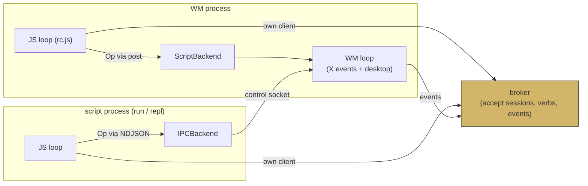

# go-go-wm: Scripting a Window Manager with an Embedded JavaScript Runtime

This report describes the second construction phase of the go-go-wm
project: a JavaScript scripting layer for the presentation-based window
manager whose core is documented in [[PROJ - go-go-wm - Building a Presentation-Based Window Manager in Go]].
The work was carried out under ticket **GGWM-002-GOJA-DSL** (design and
phases P1–P4) and completed by its deferred fifth phase under ticket
**GGWM-003-UI-MODULE**. At the end of this phase, a user can write a
JavaScript file that reshapes the layout tree, registers verbs on every
window of the desktop, awaits a typed object clicked anywhere on screen,
binds keys inside the window manager process, declares placement rules
and layout recipes as data — and defines entire application surfaces
whose buttons and presentation chips are indistinguishable from the
built-in Go applications.

> [!summary]
> - Scripting was **bindings, not surgery**: the window manager was built
>   so that every mutation is a serializable op, every query has a
>   socket, and every presentation interaction goes through one broker.
>   The scripting layer wraps those four seams with two native modules
>   (`wm`, `pbui`) and never adds a second control path.
> - The same modules serve **three attachment points**: standalone
>   script processes (`go-go-wm run`), an interactive REPL
>   (`go-go-wm repl`), and an in-process runtime inside the WM
>   (`go-go-wm wm --rc rc.js`) — the only place real keybindings exist.
>   A `Backend` interface is the entire difference between them.
> - The concurrency design reduces to one sentence: **JavaScript runs on
>   exactly one loop, and every other loop communicates with it by
>   posting closures**. Promises are settled only from posted closures;
>   render paths read immutable snapshots and never call JavaScript.
> - Declarative facilities (placement rules, layout recipes, UI surfaces)
>   all follow one pipeline: **normalize at definition time, compile to
>   ops or regions at execution time**. Errors surface when the user
>   writes the wrong thing, not minutes later when it fires.
> - Every example script doubles as a CI fixture, and a five-minute
>   fuzzer found three latent bugs in the first phase's URI and broker
>   code before any user did.

## Why this phase exists

The window manager built in GGWM-001 is a complete desktop: a binary
split tree of tiles, a presentation broker implementing the CLIM-style
accept protocol, and a set of built-in applications. What it lacked was a
way for a user to extend it without writing Go. Window managers live or
die by their configurability — placement rules, keybindings, startup
layouts, custom commands — and the project's stated goal from the first
day was "a JS grabbag of WM lego blocks."

The first phase prepared for this deliberately. Its design decision D5
required that every layout mutation flow through a single function,
`wmcore.Apply`, taking a serializable `Op` value; that every state change
emit an event on the broker bus; and that verbs be data registered with
the broker rather than function pointers inside the WM. The consequence
of that discipline is the central fact of this report: **the scripting
layer touches no X11 code, no broker internals, and no layout
algorithms.** It is a translation layer between a JavaScript runtime and
four Go surfaces that already existed.

The JavaScript engine is [goja](https://github.com/dop251/goja), wrapped
by the [[go-go-goja]] stack, which supplies the runtime factory, the
owner-thread discipline, the event loop, and the REPL kernel. This
project is therefore also a case study in consuming go-go-goja's
patterns — the promise settlement pattern, the data-only versus
host-access module split, and the normalize-then-compile DSL shape — in
a program whose threading model is hostile by default (an X11 event loop
plus a broker read loop plus a JavaScript VM).

## The four seams

The scripting layer wraps exactly four Go surfaces. Understanding them
is understanding the whole design, because every JavaScript primitive is
a thin, mechanical mapping onto one of them.

**1. Ops and `wmcore.Apply`.** The layout engine (`pkg/wmcore`) defines
a serializable `Op` struct with an op name and a handful of operands:

```go
type Op struct {
    Op        string  // "split-leaf", "close-leaf", "set-ratio", …
    Workspace string
    Node      NodeID
    Target    NodeID
    Dir       Dir
    Zone      Zone
    Ratio     float64
    App       string
    Name      string
}
```

`Apply(desktop, op)` validates and executes; on error the desktop is
unchanged. The keyboard handlers, the mouse handlers, the IPC socket,
and now every JavaScript mutation all produce values of this one type.
There is no privileged path: `wm.split(...)` in a script compiles to the
same `{op: "split-leaf", …}` value that pressing Mod4-d produces.

**2. The control socket.** The WM serves newline-delimited JSON on a
Unix socket: `{"q":"tree"}` returns the full serialized desktop,
`{"q":"windows"}` the managed-window table, `{"q":"op","op":{…}}`
executes one op. Requests are dispatched onto the WM's event loop and
answered synchronously. This is the query-and-mutate surface for
scripts running in other processes.

**3. The broker client.** `pkg/pbui/client` is the complete PBUI
participant API — `Accept` (blocks until an object is clicked or the
session is cancelled), `Answer`, `RegisterVerbs` plus an `OnVerbRun`
callback, `Emit` and an event subscription channel, `RequestMenu`,
`Hover`. Everything presentation-related in JavaScript maps to one of
these methods. A detail that matters later: the client's callbacks fire
on its socket-reading goroutine, which imposes a rule on every consumer.

**4. The object helpers.** `pbui.Object` (a typed value: `ptype` plus
JSON payload), the `pbui://` URI bijection used by terminal hyperlinks,
and the type-matching predicate. These are pure data transformations
with no I/O, which makes them safe to expose in every capability
profile, including runtimes with no broker connection at all.

## The go-go-goja runtime model

A goja VM is single-threaded and has no internal locking; the entire
correctness argument of an embedding rests on who is allowed to touch
it. go-go-goja packages the answer as a runtime factory:

```go
builder := engine.NewRuntimeFactoryBuilder()
builder.WithModules(engine.NativeModuleRegistrar{
    ModuleID: "wm", ModuleName: "wm", Loader: wmLoader,
})
factory, _ := builder.Build()
rt, _ := factory.NewRuntime()
// rt.VM    — the interpreter; touch only on the owner loop
// rt.Loop  — the goroutine that owns the VM (timers, promise jobs, posts)
// rt.Owner — Call(ctx, name, fn) runs fn(ctx, vm) on the loop and waits;
//            Post schedules without waiting
```

Two idioms from this model are used constantly in the scripting layer.

The first is the **promise settlement pattern**, copied from
go-go-goja's asynchronous filesystem module. A native function that must
block (the accept protocol can block for minutes) creates its promise on
the VM thread, does its blocking work on a fresh goroutine, and settles
the promise only by posting a closure back to the owner loop:

```go
promise, resolve, reject := vm.NewPromise()      // on the VM thread
services, _ := runtimebridge.Lookup(vm)          // owner handle the factory stored
go func() {
    obj, err := client.Accept(ctx, ptypes, prompt)   // blocks; broker I/O
    if err != nil {
        _ = services.PostWithCustomContext(ctx, "pbui.accept.reject",
            func(_ context.Context, vm *goja.Runtime) { _ = reject(vm.ToValue(err.Error())) })
        return
    }
    _ = services.PostWithCustomContext(ctx, "pbui.accept.resolve",
        func(_ context.Context, vm *goja.Runtime) {
            if obj == nil { _ = resolve(goja.Null()); return }   // cancelled
            _ = resolve(vm.ToValue(objectToJS(obj)))
        })
}()
return vm.ToValue(promise)
```

Note the cancellation convention: a cancelled accept resolves to `null`
rather than rejecting. Cancellation is a normal outcome in this system —
the user pressed Escape — and modeling it as an exception would force
every script into try/catch for ordinary control flow.

The second idiom is the **callback direction**: when Go decides *when*
and JavaScript supplies *what* (verb handlers, event subscriptions,
keybinding handlers), the module stores the `goja.Callable` and invokes
it only inside a posted closure. A callable belongs to one VM forever;
storing it is safe, calling it from the wrong goroutine is not.

## Design: script kinds and attachment points

The design document enumerated six kinds of scripts the layer should
support, from one-shot macros ("build this layout and exit") through
long-running daemons ("serve these verbs forever") to startup
configuration ("bind these keys"). Working through the six kinds
produced a compact requirement set: two native modules, promise-based
accept, an event subscription facility, and three distinct places a
runtime can live.

The three attachment points are worth stating precisely, because the
architecture exists to make them share code:

- **A1 — in-process.** A runtime inside the WM process, booted from
  `--rc rc.js` after the WM takes the display. Only here can
  `wm.bind(combo, fn)` exist, because only this process owns the X
  connection that grabs keys. Mutations post directly onto the WM's
  event loop.
- **A2 — standalone processes.** `go-go-wm run script.js` builds a
  runtime in a separate process; mutations travel over the control
  socket, presentations over the broker socket. The script's filename
  becomes its broker client name, which is also verb ownership.
- **A3 — the REPL.** `go-go-wm repl` wraps go-go-goja's REPL kernel
  (which rewrites cells into IIFEs so `let` bindings persist across
  lines) around the same factory. The API explored interactively is
  character-for-character the API of scripts and rc.js.

The mechanism that unifies A1 and A2 is a five-method interface:

```go
type Backend interface {
    Tree(ctx context.Context) (*wmcore.Desktop, error)
    Windows(ctx context.Context) ([]wmx11.WindowInfo, error)
    Apply(ctx context.Context, op wmcore.Op) (wmcore.Result, error)
    Bind(combo string, fire func()) error
}
```

`IPCBackend` implements it over the control socket. `ScriptBackend`
implements it by posting closures onto the WM loop and waiting — the
same shape as the socket dispatcher, minus the socket. The module code
above the interface is identical in both worlds, which is what makes
"develop in the REPL, deploy in rc.js" a copy-paste operation rather
than a port. `Bind` on the IPC backend returns an error whose text
tells the user where keybindings do work; a capability difference
between attachment points is expressed as a good error message, not a
silently missing function.



One rule from the first phase survives untouched: the broker never knows
which client is the window manager, and the in-process runtime does not
borrow the WM's broker connection. rc.js opens a second socket
connection under its own name. Scripts go through the front door like
every other client, even when they live in the privileged process.

## The pbui module

`require("pbui")` exposes the participant API. Its surface divides
cleanly along go-go-goja's data-only versus host-access split.

The data-only quarter — `pbui.object(ptype, value)`, `pbui.uri(obj)`,
`pbui.parse(uri)`, `pbui.link(obj, text)` — performs no I/O and is
present in every profile. The rest requires a broker connection:

- `pbui.accept(ptypes, prompt)` returns a promise, settled exactly as
  shown above. The desktop-wide effects (the red ACCEPTING banner, every
  matching presentation highlighting) come for free: the broker
  broadcasts the session, and every application already reacts.
- `pbui.verb({id, label, ptypes, accepts}, handler)` validates the
  descriptor at definition time, registers with the broker, and stores
  the handler. When any client on the desktop invokes the verb, the
  broker routes it to this process, the client's read goroutine fires a
  callback, and the callback's entire body is a single post to the owner
  loop. Re-registering an id replaces the handler; the broker was
  taught to upsert by (owner, id) during this phase precisely so that
  re-registration is idempotent (it previously appended duplicates —
  one of the latent bugs discussed below).
- `pbui.print(...)` emits the `listener.print` event with a segment
  list: string arguments become text segments, object arguments become
  live presentation chips in every listener tile on the desktop. Script
  output enters the same typed-object world as everything else.
- `pbui.on(event, fn)` subscribes to the event bus, with `"*"` as a
  wildcard.

Event delivery deserves its own paragraph, because it is where
backpressure lives. Events arrive on the client's read goroutine, which
must never block (it also carries request replies). Handlers run on the
JS loop, which a slow script can stall. Between them sits a bounded
queue with deliberate semantics:

```
read goroutine ──push──▶ bounded queue (256) ──drain──▶ one posted batch
                          full? drop NEWEST,             per wakeup on
                          count it                       the JS loop
```

The queue keeps the *oldest* undelivered events on overflow, not the
newest: an event consumer reasons about a contiguous prefix of history,
and a gap in the middle is worse than a truncated tail. Drops are
reported as a single `script.error` event carrying the count — visible
in the WM's trace tile like every other failure, because a throwing
handler, an overflowing subscription, and a failing rc.js all funnel
into the same event rather than killing anything. One subscription per
process feeds all consumers: the pump is a shared `EventFan`, because
two modules independently consuming the client's single event channel
would race for messages.

## The wm module

`require("wm")` exposes queries (`tree`, `windows`, `focused`,
`leaves`), mutations, and the declarative layer. Two design choices
shape its feel.

First, queries and mutations are **synchronous with a bounded
deadline** rather than promise-returning. A layout query is a local
socket round trip measured in microseconds; making every line of an
rc.js an `await` would tax the common case to accommodate a failure
case. The failure case is still handled — every backend call carries a
two-second deadline, and a stuck WM produces a thrown exception rather
than a hung script.

Second, sugar functions are **pure translations to ops**, with state
kept out of JavaScript wherever an invariant is involved. The most
instructive example is `wm.split(leaf, dir, {ratio})`. The `split-leaf`
op reports the new *leaf* in its result, but a ratio belongs to the new
*parent split*, whose id the op does not report. The module therefore
fetches the tree, locates the split whose child is the new leaf, and
issues `set-ratio` against it — two ops and a query, hidden behind one
call. The alternative (changing the op vocabulary to return more) was
rejected: the op vocabulary is shared with the keyboard, the tests, and
the replay tooling, and widening it for one convenience function would
ripple everywhere.

The one stateful object is `wm.workspace(name)`, which resolves a
workspace by id or name — creating and naming it on first use — and
returns a handle whose methods (`switch`, `rename`, `clone`, `remove`,
`adopt`, `apply`) each compile to a single op. The resolved id lives in
Go; the JavaScript object is a view.

### The op that was missing: `move-leaf`

One script kind exposed a genuine hole in the first phase's vocabulary.
An event-driven router ("new Zoom windows go to the calls workspace")
needs to move a window between workspaces, and no combination of the
eleven existing ops expresses that. The fix was a twelfth op rather than
a module-level workaround, because anything the module can do, the
keyboard and the tests should be able to do too:

```
move-leaf {node, workspace(dst), target?, dir?}:
    validate the graft point in dst first        # failure must not mutate
    detach node from its source tree
      (if it was the only leaf, leave a fresh launcher leaf behind —
       workspaces are never empty)
    graft it into dst, splitting target (or wrapping the root)
    THE LEAF KEEPS ITS ID
```

The capitalized clause is the entire trick. Window frames in the X
shell are keyed by leaf id. Because the id survives the move, the
reconciliation pass that already existed — hide frames whose leaves are
on background workspaces, show the current workspace's — handles a
cross-workspace move with zero new X11 code. The window does not
flicker, close, or re-map; it is simply elsewhere the next time layout
runs.

![[go-go-wm-scripting-router-adopt.png]]
*The router script in action: an xterm titled "Mozilla Firefox" was
adopted into a freshly created "web" workspace the moment the WM
announced it. The script is fifteen lines.*

## The concurrency contract

Three event loops exist in the fullest configuration: the WM loop
(X events and the desktop), the JS loop (the goja VM), and the broker's
state loop, plus short-lived worker goroutines for blocking calls. The
contract that keeps them from deadlocking is six rules, enforced by
construction rather than convention:

1. Every `goja.*` touch happens on the JS loop — inside a loader-installed
   function, an `Owner.Call`, or a posted closure.
2. The WM loop never executes JavaScript. It executes ops that
   JavaScript posted.
3. No loop blocks on another loop's work. Crossings are posts; the only
   waits are deadline-bounded queries.
4. Workers settle promises only through posted closures.
5. A throwing handler becomes a `script.error` event; it never kills the
   VM or the WM.
6. Broker-client callbacks run on the read goroutine, and their bodies
   are a single post.

The payoff is visible in the longest control path the system has: a
user presses a script-bound key. The X event arrives on the WM loop; the
keybinding's `fire` closure posts to the JS loop; the handler runs and
calls `wm.split`; the backend posts the op to the WM loop and waits on
its bounded deadline; the op applies; layout runs. Two loop crossings,
both posts, no cycle — the deadline on the query leg is what breaks the
one theoretically possible wait cycle (JS waiting on WM while WM waits
on JS), and it can only trigger the error path, never the deadlock.

![[go-go-wm-scripting-rc-repl-splits.png]]
*The desktop after an rc.js keybinding (Mod4-e, split right) and a REPL
session added tiles. The trace tiles record every op the scripts issued,
because ops are events.*

## Rules and layouts: normalize, then compile

Declarative configuration follows the tribal pattern documented in
[[go-go-goja]]'s DSL notes: raw user input is normalized into a
validated, inspectable plan at *definition* time, and the plan compiles
to primitive operations at *execution* time. Two facilities use it.

**Layout recipes.** `wm.layout("dev", spec)` accepts a nested
description — `{split: "row", ratio: 0.62, a: {app: "editor"}, b:
{split: "col", …}}` — and normalizes it immediately: unknown keys,
invalid directions, and out-of-range ratios throw from the `wm.layout`
call itself, with a path to the offending node. The normalized plan is
visible through `wm.layouts()`, which is what the unit tests assert
against; nothing needs to execute to test validation. Execution
(`workspace.apply("dev")`) walks the plan top-down — split while the
target is still a leaf, set the ratio, recurse into both children — and
emits only standard ops. Application is deliberately conditional: a
recipe builds only on a fresh workspace (a single empty leaf), so
running a project-switcher script twice is a no-op rather than a
runaway subdivision. Idempotency is a contract, not an accident.

**Placement rules.** `wm.rule({title: /zoom/, workspace: "calls"})`
compiles the pattern (a string or a JavaScript RegExp; the module reads
the RegExp's `source` property, since goja exports the object opaquely)
and rejects unknown keys at definition time. The interesting property is
what executes the rule: a *Go-side* subscriber on the event fan. When
`window.managed` fires, the matcher runs, the destination workspace is
resolved or created, and a `move-leaf` op is applied — no JavaScript in
the hot path at all. A rule is sugar over an event subscription; the
JavaScript function the user did not have to write is exactly the
fifteen-line router script shown earlier.

![[go-go-wm-scripting-project-switcher.png]]
*`project-switcher.js` after one run: a "go-go-wm" workspace built from
the "dev" recipe — a 0.62 row split with a column split on the right,
three named application slots, three workspace chips in the top bar.*

## Every example is a test

The repository's `examples/scripts/` directory is both the
documentation and the integration test suite. Each script asserts its
own postconditions — `golden.js` rebuilds a layout and walks
`wm.tree()` to verify the ratio landed on the correct split, exiting
non-zero otherwise — and a checked-in harness (`scripts/
examples-smoke.sh`) runs all of them in CI: the broker-only scripts
against a bare broker with no display, the layout scripts against a real
WM inside Xvfb, driven and asserted through the same sockets scripts
use. A second harness (`scripts/rc-smoke.sh`) boots the WM with an rc
file and proves the keybinding chain with synthetic X input.

![[go-go-wm-scripting-golden-layout.png]]
*`golden.js` ran twice against this desktop. The trace tiles show the
script's ops arriving as events — split-leaf, set-ratio, listener.print —
and the listener shows its self-assertion: "layout verified — 5 tiles ✓".*

The pattern generalizes beyond convenience. A script that asserts its
own postconditions through the public query surface is a better
integration test than external orchestration, because it exercises
exactly the path users exercise, and its failure output names the
assertion that failed in the vocabulary of the API.

### What the fuzzer found

Phase 1 added a fuzz target over the bridge functions that convert
hostile JavaScript-shaped data into wire types. Within twenty seconds of
its first run it had found two latent bugs in *first-phase* code that no
unit test had touched, and live testing found a third:

1. **URI ptypes could not round-trip.** `ObjectToURI` placed the ptype
   in the host position of `pbui://` URIs without restricting its
   alphabet; a ptype containing a backslash produced a URI that Go's
   parser rejects. The fix followed the normalize-early rule: ptypes are
   now validated as slugs (`[A-Za-z0-9._-]+`) at both entry points
   (`NewObject`, `ObjectFromURI`), so nothing downstream re-checks.
2. **URI values were decoded twice.** `url.Parse` already decodes the
   path; the code then ran `PathUnescape` on the decoded form, so any
   value containing a percent sign either corrupted silently or errored.
   The fix decodes the raw escaped path exactly once.
3. **Verb registration duplicated.** The broker appended registered
   verbs unconditionally, so any client that re-sent its verb set — as
   the script module does on every `pbui.verb` call — grew duplicate
   menu entries. The broker now upserts by (owner, id).

The general lesson is not new but bears repeating in a report: fuzzing
the *conversion boundary* — the place where external data becomes
internal types — pays for itself immediately, and it finds bugs in code
adjacent to the boundary, not just in the converter.

## Implementation details worth recording

Several goja-specific behaviors cost debugging time and are easy to
carry forward as rules.

**goja exports Go field names, not JSON tags.** Passing a
`*wmcore.Desktop` to `vm.ToValue` gives JavaScript `d.Workspaces`, not
`d.workspaces`. Scripts must see wire shapes — the same names the
control socket and the serialized tree use — so every query result
passes through a JSON round trip (`marshal` → `unmarshal` to
`interface{}` → `ToValue`). The helper is three lines; discovering the
need for it was a live integration failure (`golden.js` crashed on
`d.workspaces.find` while the tree query itself succeeded).

**A JavaScript RegExp exports as an opaque map.** Type-switching on the
exported value classifies `/zoom/` as `map[string]interface{}` and, in
the first implementation, rejected it with the very error message meant
for invalid input. The correct access path is the `*goja.Object`'s
`source` property.

**Top-level `let` is invisible to `GlobalObject().Get`.** Lexical
bindings are not global-object properties. Test probes that read script
state back from Go must use `var` (or write to `globalThis`); the
symptom otherwise is every asynchronous test timing out on a probe that
reads eternal `nil`.

**Workspace creation had a rendering hole.** The `add-workspace` op
defaulted its first leaf's application slot to the literal string
`"launcher"`, but the X shell's builtin-tile predicate recognized only
the empty string and the `builtin:` prefix — every workspace created by
keyboard or script showed one permanently blank tile. Both sides were
fixed (the op now defaults to the empty-string convention; the
predicate also accepts the literal for robustness). The bug had been
present since the first phase; scripting merely made workspace creation
frequent enough to notice.

## Completing the arc: the ui module (GGWM-003)

The ticket's deferred fifth phase — scripts that *are* applications —
was executed immediately afterward as its own ticket, and belongs in
this report as the completion of the design.

The problem it solves: `pbui.print` lets a script emit presentations,
but not own a surface. The solution is a declarative IR in the spirit of
everything above. A script's `render()` returns rows of segments —
text, hint, presentation object, button — which Go normalizes
(definition-time validation with row/segment-addressed errors), lays
out, and draws with the same widget vocabulary as the built-in
applications, emitting the same `Region` list that gives every built-in
its click behavior. From the desktop's perspective a JavaScript
application is indistinguishable from a Go one: its chips highlight
during accepts, answer clicks, and carry verb menus.

The concurrency answer is the **snapshot handoff**. Render paths (an X
window's expose handler, the WM's tile painter) must never call into
the VM, so they never do: they render the last normalized spec, held
under a mutex. Handlers run on the JS loop; after each one the module
re-runs `render()`, normalizes, swaps the snapshot, and posts a repaint.
A throwing `render()` keeps the previous frame on screen and emits
`script.error` — a broken script never blanks a tile.

One definition serves two hosts. `app.show()` adapts the definition to
the existing standalone window shell; `app.tile()` registers it with the
window manager itself under the app name `script:<name>`, which the
builtin-tile pipeline paints through a registry of snapshot-reading
closures — placement is then an ordinary op
(`wm.split(leaf, "row", {app: app.tile()})`).

![[go-go-wm-scripting-js-apps.png]]
*Both hosts at once: `js-colors.js` as a standalone X window (left) and
a counter tile defined in rc.js, painted by the window manager itself
(right, lavender strip). Both are pure JavaScript definitions.*

![[go-go-wm-scripting-js-accept.png]]
*The acceptance proof: a CLI process ran `accept --ptype color`; the
banner switched, the JS app's chips highlighted (verified by pixel
counts — the Sel background and red borders are subtle at this scale),
and clicking the first chip answered the accept with
`{"ptype":"color","value":"#b0563f"}`.*

Finally, the three modules were packaged as an **xgoja provider**
(`pkg/xgojaprovider`, package id `go-go-wm`), so binaries generated by
the xgoja build tool can compile them in. Provider modules connect
lazily — setup performs no I/O, the first broker-touching call dials,
and a missing broker degrades the pbui module to its data-only surface
rather than failing the runtime. A generated binary that merely wants
`pbui.parse` should not require a running desktop.

## Current project status

All phases of both tickets are implemented, tested, and pushed
(`task/go-go-wm`, commits `665ee76` through `2002dd4`):

- `pkg/jsmod/` — bridge, shared event fan, `pbuimod`, `wmmod` (with
  rules and layouts), `uimod`; `pkg/apps/uispec`; `pkg/xgojaprovider`;
  `pkg/wmx11/scripting.go` + `scripttiles.go`.
- Commands: `go-go-wm run [--once]`, `go-go-wm repl`, `go-go-wm wm
  --rc`; help topics `wm-module`, `pbui-module`, `ui-module`.
- Nine example scripts, all CI fixtures (`scripts/examples-smoke.sh`,
  `scripts/rc-smoke.sh`); ~40 Go test functions across the new
  packages; the bridge fuzzer; everything golangci-lint clean.
- Tickets GGWM-002 and GGWM-003 in the repo's `ttmp/` carry the design
  documents (with decision records), implementation diaries, and
  screenshots.

## Open questions

- Accept reentrancy: a verb handler that itself calls `pbui.accept`
  relies on broker session supersession; the REPL user experience of a
  dangling accept deserves an explicit design.
- The event-queue bound is global (256); whether subscriptions need a
  per-call knob is deferred until a real consumer overflows.
- Keybinding conflicts between rc.js and built-in bindings are
  currently last-writer-wins with a warning; a conflict policy is
  undesigned.
- Scripted surfaces lack scrolling and text-input segments; both are
  bounded extensions of the spec IR.

## Near-term next steps

- The GGWM-001 hardening backlog: kitty live end-to-end test, the ICCCM
  awkward-client matrix, the cross-implementation layout oracle against
  the React prototype.
- An `xgoja.yaml` example in the repository demonstrating a generated
  binary with the go-go-wm provider.
- Listener input line (keyboard routing into builtin tiles), which the
  ui module's `onKey` plumbing has now made mostly mechanical.

## Related notes

- [[PROJ - go-go-wm - Building a Presentation-Based Window Manager in Go]] —
  the first phase: the WM, the broker, the protocol, the app layer.
- [[go-go-goja]] — the runtime stack consumed here (factory, owner
  discipline, REPL kernel).
- [[PROJ - Publish Vault Widget DSL - Server-Driven Pages from an Embedded JavaScript Runtime]] —
  the sibling DSL project whose intent→IR→target layering this project's
  spec IR follows.
