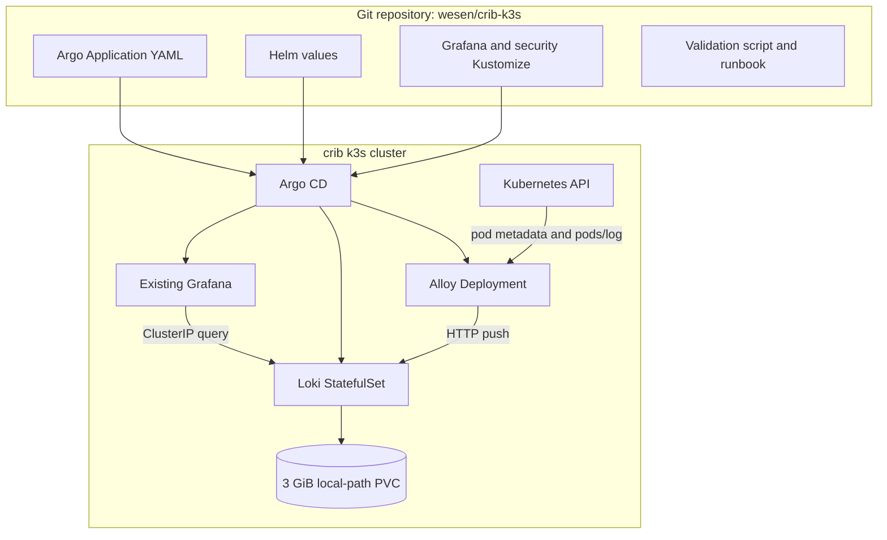

# crib-k3s Loki, Alloy, and Grafana Observability — GitOps Rollout and Live Validation

This report documents the design, implementation, failure analysis, and live
validation of centralized application logging for the single-node `crib-k3s`
cluster. The implementation adds Grafana Loki for retention and querying, Grafana
Alloy for Kubernetes API log collection, and declarative Grafana datasource and
dashboard resources. It is managed by Argo CD and is deliberately constrained to
the cluster's present topology: one k3s node, local-path storage, modest memory,
and an existing authenticated Grafana deployment.

The report is indexed under [[Research/KB/Projects/infrastructure-and-release]].
The implementation ticket is `CRIB-LOKI-001` in
`/home/manuel/code/wesen/crib-k3s/ttmp/2026/07/17/CRIB-LOKI-001--add-loki-log-aggregation-and-grafana-log-exploration-for-crib`.
The ticket design document and diary remain the chronological engineering record;
this report explains the resulting system as a coherent technical artifact for a
new operator or intern.

> [!summary]
> - The cluster now has Argo-managed Loki `7.1.0`/Loki `3.6.8`, Alloy `1.10.1`/Alloy `1.17.1`, and a provisioned Grafana Loki datasource.
> - The live rollout exposed and corrected three integration defects: a Loki schema boundary that rejected replayed timestamps, stale-history batches that obscured current delivery, and invalid `#` comments inside embedded Alloy configuration.
> - Grafana’s logging data path is healthy, but browser access still has a separate TLS-secret distribution defect: the `monitoring` copy is expired while cert-manager’s source secret is current.

## 1. The operational question

The work began with an Almanach rendering incident. A remote render request returned
HTTP 500 with `chrome render: context deadline exceeded`. Direct Kubernetes
inspection showed a healthy pod, no restarts, no OOM kill, no node memory pressure,
and a one-gigabyte memory limit. The service itself creates a thirty-second server
context deadline, so a client-side timeout of 120 seconds cannot extend the server's
deadline. The same inspection found that `/opt/almanach/web/dist` was absent and
the binary had fallen back to embedded assets. These were application defects, but
the investigation also exposed a platform defect: historical logs were available
only through `kubectl logs` and disappeared when pods were replaced.

The required capability was therefore not a one-off command. Operators needed a
searchable, retained event stream that could answer concrete questions after a pod
restart:

- Which Almanach pod and container emitted the Chrome deadline?
- Did the failure coincide with an Argo CD rollout, a resource change, or a node event?
- Can Grafana users correlate application logs with existing Prometheus dashboards?
- Are logs retained without turning the cluster into an unbounded archive?
- Can the collector operate without privileged host mounts or node-level access?

The implementation treats logs as a separate observability data plane. Prometheus
continues to answer aggregate questions. Loki stores event lines and indexes a
small, stable label set. Grafana remains the authenticated user interface. Argo CD
owns the desired state, while a short bootstrap step registers the new Argo
Applications after the GitOps merge.

## 2. Scope and non-goals

The ticket covers centralized Kubernetes container logs and the operational controls
required to use them safely. It does not rewrite every application logger or expose
Loki publicly.

Included work:

- a single-binary Loki deployment with a retained local-path PVC;
- an Alloy Deployment that discovers selected pods through the Kubernetes API;
- explicit Kubernetes RBAC for pod discovery and `pods/log` reads;
- a Loki NetworkPolicy that limits ingestion traffic to the monitoring namespace;
- Grafana datasource and dashboard ConfigMaps using the existing sidecar convention;
- pinned Helm chart versions and a render/server-side-dry-run harness;
- an operator playbook for bootstrap, queries, capacity, recovery, and security;
- live Argo synchronization and failure-oriented validation;
- a documented follow-up for the stale Grafana TLS copy.

Non-goals:

- replacing Prometheus or changing Grafana authentication;
- installing a distributed Loki cluster, object storage, or a public Loki gateway;
- collecting node/control-plane logs before a separate data-safety review;
- logging request bodies, passwords, tokens, OIDC assertions, or user documents;
- making a manual `helm install` part of normal operations;
- treating the seven-day local PVC as backup or high availability.

## 3. Vocabulary and trust boundaries

The system has three distinct control planes. Argo CD controls Kubernetes resources.
Alloy controls collection and transformation. Loki controls ingestion, indexing,
retention, and querying. Grafana controls presentation and user access to queries.
Keeping these responsibilities separate makes failure diagnosis more precise.

| Entity | Responsibility | Location | Trust boundary |
| --- | --- | --- | --- |
| Argo CD `loki` Application | Renders and reconciles the Loki Helm chart | `argocd` namespace | Git repository and Grafana Helm repository become desired state |
| Argo CD `alloy-logs` Application | Renders and reconciles Alloy | `argocd` namespace | Collector configuration is Git-controlled |
| Argo CD `logging-crib` Application | Owns custom RBAC and NetworkPolicy | `argocd` namespace | Security resources remain reviewable Kustomize |
| Alloy | Discovers pods, reads pod logs, applies drop stages, pushes to Loki | `monitoring` namespace | Reads only Kubernetes resources granted by its ClusterRole |
| Loki | Stores and queries log streams | `monitoring` namespace | ClusterIP only; no public ingress |
| Grafana | Authenticated query UI and dashboards | `monitoring` namespace | Existing public route is the only intended operator surface |
| Kubernetes API | Provides pod metadata and log streams | Cluster control plane | Alloy uses API access rather than host filesystem access |

The browser-facing boundary is Grafana. Loki and Alloy use ClusterIP services. A
break-glass operator can port-forward Loki locally, but that is an explicit
diagnostic action, not a production route.



## 4. Baseline cluster facts

The design was sized from live cluster observations rather than from a generic
Kubernetes deployment template.

Observed facts before rollout:

- one node named `k3s-server`;
- Kubernetes `v1.35.4+k3s1`;
- four CPU cores;
- approximately eight GiB allocatable memory;
- `local-path` as the default StorageClass;
- no memory, disk, or PID pressure;
- existing Prometheus persistence and an existing Grafana sidecar deployment;
- no Loki, Alloy, Promtail, Fluent Bit, or Vector workload;
- application logs emitted to container stdout/stderr;
- K3s network policy support available through its embedded controller.

The one-node constraint determines the first topology. A distributed Loki deployment
would require object storage, ring management, multiple replicas, and a migration
plan. None of those solve a present operational problem. A single binary with a
retained PVC provides a bounded, inspectable first deployment. The design records
the migration boundary explicitly: adding nodes or requiring high availability must
trigger an object-storage and topology redesign rather than an ad hoc replica count.

The historical Hetzner k3s repository was reviewed. It uses the legacy `loki-stack`
chart and Promtail with a ten-gigabyte local-path volume and seven-day retention.
That stack validated the storage and retention direction, but it was not copied.
Promtail and the legacy chart have a different lifecycle, and the Hetzner diary
recorded a real dashboard label mismatch. The crib design therefore validates live
labels and maps both modern and legacy workload labels to one canonical `app` label.

## 5. Resource ownership and repository layout

The implementation is intentionally split into three Argo Applications plus the
existing Grafana Application. This makes ownership and deletion behavior visible.

| Application | Source | Release/resources | Namespace |
| --- | --- | --- | --- |
| `loki` | Grafana Helm chart `7.1.0` plus `gitops/helm-values/loki.yaml` | `crib-loki` single-binary StatefulSet, Service, PVC, runtime ConfigMaps | `monitoring` |
| `alloy-logs` | Grafana Helm chart `1.10.1` plus `gitops/helm-values/alloy-logs.yaml` | `crib-alloy-logs` Deployment, Service, ConfigMap, ServiceAccount | `monitoring` |
| `logging-crib` | local Kustomize | Alloy ClusterRole/Binding and Loki NetworkPolicy | `monitoring` |
| `grafana-crib` | local Kustomize | Loki datasource, log dashboard, Grafana IngressRoute | `monitoring` |

Important repository paths:

```text
/home/manuel/code/wesen/crib-k3s/
├── gitops/applications/
│   ├── loki.yaml
│   ├── alloy-logs.yaml
│   ├── logging-crib.yaml
│   └── grafana-crib.yaml
├── gitops/helm-values/
│   ├── loki.yaml
│   └── alloy-logs.yaml
├── gitops/kustomize/logging-crib/
│   ├── alloy-log-reader-rbac.yaml
│   ├── loki-network-policy.yaml
│   └── kustomization.yaml
├── gitops/kustomize/grafana-crib/
│   ├── loki-datasource.yaml
│   ├── logs-dashboard-configmap.yaml
│   └── kustomization.yaml
├── docs/playbooks/
│   └── 11-operate-centralized-logging-with-loki-alloy.md
└── ttmp/2026/07/17/CRIB-LOKI-001--*/
    ├── design/
    ├── reference/
    ├── scripts/
    └── tasks.md
```

The values files are not copied into the Argo Application objects. The Applications
use Argo multi-source references: the chart is fetched from the Grafana Helm
repository, while `$values/gitops/helm-values/...` comes from the Git repository at
`targetRevision: main`. This keeps chart selection, values, and code review in one
GitOps change without embedding a large values document into an Application CR.

## 6. Loki topology and storage

The live Loki values choose `deploymentMode: SingleBinary` with one replica. The
chart's scalable targets are explicitly set to zero:

```yaml
deploymentMode: SingleBinary

singleBinary:
  replicas: 1

read:
  replicas: 0
write:
  replicas: 0
backend:
  replicas: 0
```

The explicit zeros are required because the chart validates the scalable counts
before suppressing those components in single-binary mode. Omitting them produced a
render validation error. The chart also requires test resources to be disabled when
the Loki Canary is disabled; `test.enabled: false` is therefore intentional.

The storage and retention contract is:

| Setting | Value | Reason |
| --- | --- | --- |
| Storage backend | filesystem | Matches single-node local-path environment |
| PVC size | 3 GiB | Bounded initial capacity |
| PVC policy | retain on StatefulSet scale/delete | Avoids accidental evidence deletion |
| Schema | TSDB v13 | Current chart-compatible index format |
| Retention | 168 hours | Seven-day operational window |
| Query lookback | 168 hours | Aligns query range with retention policy |
| Ingestion rate | 2 MiB/s | Protects small node and PVC |
| Burst | 4 MiB | Allows short diagnostic bursts |
| Max query series | 500 | Bounds query fan-out |
| Max entries/query | 5,000 | Limits expensive Explore requests |

The public Loki HTTP service is disabled from an ingress perspective. The chart
creates an internal `ClusterIP` service at:

```text
crib-loki.monitoring.svc.cluster.local:3100
```

Loki's `auth_enabled` is false because the service is deliberately internal and
access is constrained by namespace network policy. This is not equivalent to making
the service public. If a future design introduces cross-namespace clients, tenant
separation, or a public route, authentication and authorization must be redesigned
instead of relying on this assumption.

### 6.1 The schema boundary defect

The initial values set the schema `from` date to `2026-07-17`, the implementation
date. Alloy's Kubernetes source began by replaying existing pod history. Entries from
before that date reached Loki and produced:

```text
failed to create stream: no schema config found for time 1783862712
```

The correct interpretation is not that Loki's current query path is broken. The
schema simply did not define a TSDB store for every timestamp that the collector
could replay. The fix changed the schema start to `2020-01-01`. The retention policy
still rejects samples older than seven days; the earlier schema date only guarantees
that all possible replay timestamps have a valid schema before retention filtering.

This distinction matters:

```text
schema start date       = format/index validity boundary
reject_old_samples      = ingestion age boundary
retention_period        = storage/query lifecycle boundary
```

Confusing these boundaries caused the first live defect. A schema date should
predate the oldest timestamp that may arrive, while retention remains the policy
for whether old data is accepted and kept.

## 7. Alloy collection pipeline

Alloy is deployed as one `Deployment`, not as a privileged DaemonSet. It discovers
pods using `discovery.kubernetes` and reads container logs through
`loki.source.kubernetes`. This avoids a host filesystem mount and avoids granting
the collector node-level permissions. It does increase Kubernetes API and kubelet
traffic, which is acceptable at the current scale and must be measured if the
namespace allowlist expands.

The pipeline is:

```text
discovery.kubernetes(role=pod)
        |
        v
discovery.relabel(namespace allowlist + metadata mapping)
        |
        v
loki.source.kubernetes
        |
        v
loki.process
  - drop older than 168h
  - drop >64 KiB
  - drop obvious inline credentials
  - attach cluster=crib
  - keep bounded labels
        |
        v
loki.write -> http://crib-loki.monitoring.svc.cluster.local:3100/loki/api/v1/push
```

The discovery allowlist currently includes:

```text
almanach
argocd
cert-manager
default
jellyfin
monitoring
poll-modem
```

The allowlist excludes node/control-plane namespaces until their log content and
retention impact are reviewed. This is a data-safety decision, not merely a volume
optimization.

### 7.1 Label mapping

The collector emits only stable workload and container identity labels:

```text
cluster
namespace
pod
container
app
```

The `app` value first uses `app.kubernetes.io/name`, then falls back to the legacy
`app` label used by older crib workloads such as `poll-modem`. This avoids dashboard
queries that silently fail because a deployment uses a different label convention.

The pipeline deliberately does not promote the following values to labels:

- request IDs and trace IDs;
- user IDs, login names, or account identifiers;
- IP addresses;
- URLs with parameters;
- image digests;
- arbitrary error strings;
- timestamps;
- unbounded values extracted from log bodies.

These values remain searchable in the log payload when their retention is justified.
Putting them in Loki labels would create high-cardinality streams and increase index
and memory cost.

### 7.2 Drop and redaction stages

The process pipeline is logically equivalent to this pseudocode:

```text
for entry in discovered_pod_logs:
    if entry.timestamp < now - 168h:
        drop(entry, reason="outside_retention_window")
        continue

    if len(entry.line) > 64 KiB:
        drop(entry, reason="oversized_log_line")
        continue

    if matches_inline_credential_pattern(entry.line):
        drop(entry, reason="possible_inline_credential")
        continue

    entry.labels = {
        "cluster": "crib",
        "namespace": entry.namespace,
        "pod": entry.pod,
        "container": entry.container,
        "app": entry.workload_name,
    }
    push_to_loki(entry)
```

The credential expression catches obvious inline forms such as:

```text
authorization: Bearer ...
authorization=Basic ...
password=...
client_secret=...
refresh_token=...
access_token=...
private_key=...
```

This is a defensive backstop. It does not provide full DLP, cannot identify every
secret encoding, and must not be treated as permission for applications to log
credentials. Application code remains responsible for avoiding secret output.

The `older_than` stage is important because `loki.source.kubernetes` can replay
existing pod history. Loki also rejects samples older than seven days. Filtering at
the collector prevents stale entries from occupying write batches with current
entries and makes the error signal easier to interpret.

## 8. Kubernetes RBAC and network policy

The first chart render exposed permissions that were not obvious from the values
file. Alloy's `rbac.rules` were additive: the chart still rendered permissions for
nodes, node pods, and node metrics. Loki's rule sidecar also generated a cluster-wide
role when the need was only namespace-local ConfigMap/Secret access.

The security correction makes these permissions explicit.

Alloy's custom ClusterRole grants:

```yaml
rules:
  - apiGroups: [""]
    resources: ["pods"]
    verbs: ["get", "list", "watch"]
  - apiGroups: [""]
    resources: ["pods/log"]
    verbs: ["get"]
```

The role is bound only to ServiceAccount `crib-alloy-logs` in namespace `monitoring`.
The chart-created RBAC is disabled so the rendered output cannot silently regain
node permissions.

Loki uses `rbac.namespaced: true`, producing a Role and RoleBinding in `monitoring`
for its sidecar. The rendered security result is:

```text
Loki RBAC kinds: Role RoleBinding
Alloy chart RBAC kinds: none
Custom logging RBAC kinds: ClusterRole ClusterRoleBinding
```

The Loki NetworkPolicy selects the single-binary pod using the rendered labels:

```text
app.kubernetes.io/name=loki
app.kubernetes.io/instance=crib-loki
app.kubernetes.io/component=single-binary
```

It permits TCP/3100 ingress only from pods in the `monitoring` namespace. Grafana
and Alloy are therefore allowed to use Loki, while other namespaces cannot directly
write or query the service through the policy boundary. K3s's embedded network
policy controller is expected to enforce this policy; this assumption should be
rechecked if the cluster networking implementation changes.

## 9. Grafana integration

The existing Grafana chart already runs datasource and dashboard sidecars. The
implementation follows that convention instead of adding a new provisioning
mechanism. `crib-loki-datasource` is labeled `grafana_datasource: "1"` and contains:

```yaml
apiVersion: 1
datasources:
  - name: Loki
    uid: loki
    type: loki
    access: proxy
    url: http://crib-loki.monitoring.svc.cluster.local:3100
    jsonData:
      maxLines: 1000
```

The datasource is provisioned by the existing `grafana-crib` Application. A second
ConfigMap labeled `grafana_dashboard: "1"` contains the Operations / Crib Logs
dashboard with namespace and application selectors. It is intentionally a starter
dashboard: labels are bounded and queries remain explicit so operators can see what
they are asking Loki to scan.

Useful queries include:

```logql
{cluster="crib", namespace="almanach"} |= "Chrome error"
{cluster="crib", namespace="argocd"} | json | level="error"
{cluster="crib", namespace="monitoring", app="grafana"}
{cluster="crib", namespace="poll-modem", app="poll-modem"}
{cluster="crib"} |= "context deadline exceeded"
```

Grafana access is access to retained application logs. The Grafana user and
authentication policy therefore remains part of the logging security review. A
datasource being internal does not make its data non-sensitive.

## 10. Argo CD lifecycle

The normal lifecycle is Git-first and Argo-owned.

After merge, the initial bootstrap registered only the Application CRs:

```bash
export KUBECONFIG=~/code/wesen/crib-k3s/kubeconfig.yaml
cd ~/code/wesen/crib-k3s

kubectl apply -f gitops/applications/loki.yaml
kubectl apply -f gitops/applications/alloy-logs.yaml
kubectl apply -f gitops/applications/logging-crib.yaml
```

Then Argo reconciles chart resources and Kustomize resources. The operator does not
run `helm install` and does not apply rendered StatefulSets manually. Manual chart
application would create a second ownership model, make drift ambiguous, and weaken
the rollback path.

The observed post-bootstrap state was:

```text
loki          Synced   Healthy
alloy-logs    Synced   Healthy
logging-crib  Synced   Healthy
```

The initial Applications did not immediately notice the merged follow-up revision.
A hard refresh annotation forced source re-evaluation:

```bash
kubectl -n argocd annotate application/loki \
  argocd.argoproj.io/refresh=hard --overwrite
kubectl -n argocd annotate application/alloy-logs \
  argocd.argoproj.io/refresh=hard --overwrite
```

Argo then reported source revision `d55a9f5` for both multi-source chart
Applications. Loki restarted with the earlier schema date, and Alloy received the
stale-history stage.

## 11. Validation harness

The ticket script
`ttmp/2026/07/17/CRIB-LOKI-001--add-loki-log-aggregation-and-grafana-log-exploration-for-crib/scripts/01-render-and-validate.sh`
is a small reproducible preflight tool. It:

1. checks for Helm;
2. downloads Helm `v3.17.3` only when absent and verifies its SHA-256;
3. renders Loki chart `7.1.0` with the repository values;
4. renders Alloy chart `1.10.1` with the repository values;
5. renders the Grafana and logging Kustomize overlays;
6. checks the generated service names, labels, RBAC kinds, and security resources;
7. runs Kubernetes server-side dry-run validation;
8. exits successfully when the rendered resources are accepted by the cluster API.

The harness intentionally does not install anything. It uses the Kubernetes API for
schema validation, so the operator should run it with the target kubeconfig before
opening a GitOps pull request.

Known non-fatal warnings come from server-side dry-run against pre-existing
Argo-managed Grafana resources. Kubernetes reports field-manager conflicts for
annotations and StatefulSet fields owned by Argo. Those warnings do not mutate the
cluster and are recorded in the ticket diary. A future improvement could render
existing resources with client-side dry-run and reserve server-side validation for
new ownership boundaries.

## 12. Chronology of implementation

The work was committed in small, reviewable steps.

### 12.1 Initial GitOps implementation — PR #7

The first implementation commit, `3f912bc`, added the Argo Applications, Loki and
Alloy values, Grafana datasource/dashboard, Kustomize security resources, runbook,
and validation script. The chart render caught two configuration mistakes before
live deployment:

- test resources required the disabled canary, so tests were explicitly disabled;
- single-binary mode required scalable component replicas to be explicitly zero.

The design and diary commit `ed5e2af` recorded the architecture and operational
sequence. The security hardening commit `ee0325f` replaced chart-default broad RBAC
with explicit permissions and added the NetworkPolicy. The focused branch was
rebased onto `origin/main` so unrelated local history did not enter the PR. PR #7
was then merged.

### 12.2 Bootstrap and first live observation

The three Applications were registered with `kubectl apply`. Argo created one Loki
StatefulSet pod, one Alloy Deployment pod, and a bound three-gigabyte PVC. Alloy
opened streams for Almanach, Argo CD, Grafana, cert-manager, Jellyfin, poll-modem,
and monitoring workloads. Loki returned `ready`, and a query for
`{namespace="almanach"}` returned current render-service lines.

This proved the core path:

```text
Kubernetes API -> Alloy -> Loki -> Grafana datasource/query endpoint
```

It did not prove that startup replay was safe. The first Loki logs showed schema
errors for pre-start-date samples and old-sample errors for entries from May.

### 12.3 Historical replay correction — PR #9

PR #9 changed the Loki schema start date to `2020-01-01` and added an Alloy
`older_than = "168h"` stage. The schema correction allows every replay timestamp to
map to a valid store. The Alloy stage drops history outside the operational window
before it reaches `loki.write`, so current records are not mixed with rejected
samples in the same write batches.

The live collector reported 13,705 dropped entries before the source-side guard was
active. That number measured stale replay pressure, not current application failure.
The follow-up PR also recorded restart, query, resource, and credential-drop checks.

### 12.4 Alloy syntax correction — PR #11

The source-side stage was first documented with `#` comments because the surrounding
values file is YAML. The comments are inserted into the rendered Alloy program,
where `#` is not a valid comment delimiter. Alloy's reloader reported:

```text
illegal character U+0023 '#'
```

The running process therefore retained its previous configuration. PR #11 changed
those embedded comments to `//`, leaving YAML comments outside the literal unchanged.
After merge, a hard Argo refresh reconciled the corrected ConfigMap and rollout.

## 13. Live validation evidence

The validated sequence is more important than a single green status field.

### 13.1 Readiness and queryability

The Loki readiness endpoint returned:

```text
ready
```

The labels endpoint returned the bounded set:

```json
["app", "cluster", "container", "namespace", "pod", "service_name"]
```

A bounded Almanach query returned current render lines, including the service's
Chrome startup and rendering events. After the schema correction, Loki's `/config`
endpoint showed:

```yaml
schema_config:
  configs:
  - from: "2020-01-01"
    store: tsdb
    object_store: filesystem
    schema: v13
```

### 13.2 Restart behavior

The Alloy Deployment was restarted with:

```bash
kubectl -n monitoring rollout restart deployment/crib-alloy-logs
kubectl -n monitoring rollout status deployment/crib-alloy-logs --timeout=120s
```

The replacement pod reached `2/2 Running`. A subsequent query for Almanach entries
returned current records. This demonstrates collector restart recovery; it does not
demonstrate zero-loss delivery during an arbitrary outage. The latter requires a
separate failure-injection and backlog study.

### 13.3 Credential-drop probe

A temporary BusyBox pod emitted a harmless synthetic marker:

```text
password=super-secret-probe
safe-log-line
```

The pod was deleted after the probe. Alloy's metric showed one dropped line for
`reason="possible_inline_credential"`. This confirms that the credential expression
matched the sensitive-looking line. The first probe ran while stale replay batches
were still being rejected, so the safe line was not visible in Loki. That observation
directly motivated the source-side `older_than` stage.

After PR #11, the live process accepted the corrected Alloy syntax. The final probe
should be repeated after the next maintenance window and must verify both properties:

```text
password=...  -> absent from Loki
safe-log-line -> present in Loki
```

The test uses synthetic content only. No real credential is written to a pod or log.

### 13.4 Resource usage

The observed resource snapshot was:

| Workload | CPU | Memory |
| --- | ---: | ---: |
| Loki container | 4m | 76 MiB |
| Loki rule sidecar | 1m | 71 MiB |
| Alloy container | 5m | 147 MiB |
| Alloy config reloader | 1m | 7 MiB |
| k3s node | 4% | 59% |

These values are below the declared limits and support the single-node topology.
They are a point-in-time observation during low volume, not a capacity guarantee.
PVC growth, write rate, query latency, and collector API traffic must be sampled
after a representative soak period.

## 14. Grafana TLS secret failure

The log stack provisioned the Grafana datasource and dashboard, but browser access
to `https://grafana.crib.scapegoat.dev/` failed normal certificate verification.
The endpoint served a certificate with:

```text
notBefore=Apr 15 21:11:11 2026 GMT
notAfter=Jul 14 21:11:10 2026 GMT
```

The cert-manager source resource was healthy:

```text
Certificate: cert-manager/crib-scapegoat-dev-wildcard
Secret:      cert-manager/crib-scapegoat-dev-tls
notAfter:    2026-09-12T20:13:45Z
```

The Grafana IngressRoute is namespaced to `monitoring` and references
`monitoring/crib-scapegoat-dev-tls`. That Secret is a stale copy. Kubernetes Secret
references do not cross namespaces, and no reflector or external-secret controller
is installed in this cluster. The existing playbook instructs an operator to copy
the source Secret manually, but manual copying is not a reconciliation strategy.

The preferred durable fix is a namespaced cert-manager Certificate:

```yaml
apiVersion: cert-manager.io/v1
kind: Certificate
metadata:
  name: grafana-crib-tls
  namespace: monitoring
spec:
  secretName: grafana-crib-tls
  issuerRef:
    name: letsencrypt-prod
    kind: ClusterIssuer
  dnsNames:
    - grafana.crib.scapegoat.dev
```

The Grafana IngressRoute would reference `grafana-crib-tls`. cert-manager would then
renew the certificate in the same namespace that Traefik reads. This avoids a
manual Secret copy and avoids adding a secret-reflector dependency. It requests a
dedicated certificate for Grafana rather than issuing another wildcard certificate.
The change should be tracked as a separate GitOps ticket because it affects the
platform certificate model and the other applications that currently reference the
wildcard copy.

## 15. Security analysis

The system's most important security properties are explicit.

### 15.1 Collection privilege

Alloy can read pod metadata and pod logs. It cannot read nodes, node metrics, Secrets,
or arbitrary files. The chart's broad default RBAC was disabled. A future addition
of Kubernetes Events or node logs must add a separate reviewed permission set.

### 15.2 Network exposure

Loki has a ClusterIP service and no Traefik route. The NetworkPolicy limits ingress
to the monitoring namespace. Alloy has no public route. Grafana remains the only
browser-facing interface.

### 15.3 Data minimization

The namespace allowlist, bounded labels, seven-day retention, line-size limit, and
credential-pattern drop are independent controls. None is sufficient alone:

```text
allowlist       -> limits which workloads are collected
label policy    -> limits index cardinality
drop stages     -> limits obvious unsafe/expensive lines
retention       -> limits how long accepted lines persist
Grafana access  -> limits who can query retained data
```

Applications must still avoid logging secrets. A password that is split across
multiple lines, encoded as JSON, or embedded in a URL may not match the simple
expression. The collector is not a general-purpose secret scanner.

### 15.4 Storage and recovery

The PVC is retained on StatefulSet scale-down and deletion. This prevents an Argo
resource deletion from silently erasing incident evidence. Local-path storage is
node-local and does not provide backup. A production backup requirement would need
an export or object-storage design before increasing retention.

## 16. Operator procedures

### 16.1 Check Argo and workloads

```bash
export KUBECONFIG=~/code/wesen/crib-k3s/kubeconfig.yaml

kubectl -n argocd get applications loki alloy-logs logging-crib grafana-crib
kubectl -n monitoring get pods,pvc
kubectl -n monitoring get svc crib-loki
```

Expected state:

```text
loki          Synced   Healthy
alloy-logs    Synced   Healthy
logging-crib  Synced   Healthy
grafana-crib  Synced   Healthy
```

### 16.2 Query Loki through a port-forward

Run the port-forward in a dedicated tmux session:

```bash
tmux new-session -d -s crib-loki-portforward \
  'export KUBECONFIG=~/code/wesen/crib-k3s/kubeconfig.yaml; kubectl -n monitoring port-forward svc/crib-loki 3100:3100'

curl -fsS http://127.0.0.1:3100/ready
curl -fsSG http://127.0.0.1:3100/loki/api/v1/query_range \
  --data-urlencode 'query={cluster="crib",namespace="almanach"}' \
  --data-urlencode 'limit=100'
```

Stop the port-forward after use:

```bash
tmux kill-session -t crib-loki-portforward
```

### 16.3 Run a smoke marker

Use a unique harmless marker and remove the pod after the query:

```bash
marker="crib-log-smoke-$(date -u +%Y%m%dT%H%M%SZ)"
kubectl -n default run crib-log-smoke --image=busybox:1.37 \
  --restart=Never --command -- sh -c "echo $marker"
kubectl -n default wait --for=jsonpath='{.status.phase}'=Succeeded \
  pod/crib-log-smoke --timeout=60s

curl -fsSG http://127.0.0.1:3100/loki/api/v1/query_range \
  --data-urlencode 'query={cluster="crib",namespace="default"}' \
  --data-urlencode 'limit=100'

kubectl -n default delete pod crib-log-smoke --ignore-not-found
```

### 16.4 Inspect capacity

```bash
kubectl -n monitoring get pvc
kubectl -n monitoring exec statefulset/crib-loki -- df -h /var/loki
kubectl top pod -n monitoring --containers
kubectl top node
```

Do not increase the PVC, retention, or namespace allowlist without recording the
measured write rate and node disk headroom. Do not scale the filesystem deployment
horizontally; that requires external object storage and a migration design.

## 17. Research and source context

The implementation was informed by the official Grafana Alloy and Loki component
documentation and by the K3s networking model. The durable source links are kept
here so a future intern can reproduce the reasoning.

- [Grafana Alloy `loki.source.kubernetes`](https://grafana.com/docs/alloy/latest/reference/components/loki/loki.source.kubernetes/) — Kubernetes API collection without privileged host mounts.
- [Grafana Alloy `loki.process`](https://grafana.com/docs/alloy/latest/reference/components/loki/loki.process/) — `stage.drop` semantics, including `older_than`, line length, expressions, and timestamps.
- [Grafana guide: collect Kubernetes logs](https://grafana.com/docs/alloy/latest/collect/logs-in-kubernetes/) — pipeline composition and `loki.write` delivery.
- [Grafana Loki Helm reference](https://grafana.com/docs/loki/latest/setup/install/helm/reference/) — chart values and deployment modes.
- [K3s networking services](https://docs.k3s.io/networking/networking-services) — embedded network policy controller behavior.
- [K3s hardening guide](https://docs.k3s.io/security/hardening-guide) — cluster security considerations.

The ticket diary also records the comparison with
`/home/manuel/code/wesen/2026-03-27--hetzner-k3s`, including the legacy Loki/Promtail
deployment and its dashboard-label mismatch. The comparison was used to avoid
copying an older chart and to require live label inspection.

## 18. Intern implementation sequence

An intern continuing this work should proceed in this order.

1. Read the ticket index, design document, tasks, diary, and this report.
2. Inspect the four Argo Applications and identify which one owns each resource.
3. Render the pinned charts with `scripts/01-render-and-validate.sh`.
4. Confirm that Alloy configuration comments are Alloy syntax inside the YAML literal.
5. Check chart-generated RBAC; never infer permissions from values alone.
6. Verify Loki schema start, retention, query lookback, and PVC policy.
7. Apply only Application CRs after a merge; let Argo create chart resources.
8. Watch `Synced` and `Healthy` states and inspect StatefulSet/Deployment readiness.
9. Port-forward Loki and query `/ready`, `/labels`, `/series`, and a bounded workload query.
10. Run a harmless current-log smoke marker and remove the probe pod.
11. Run the synthetic credential test and verify the drop counter and absence from Loki.
12. Restart Alloy and verify that current records continue to arrive.
13. Record resource and PVC usage after a representative soak period.
14. Treat Grafana TLS separately: fix the namespaced certificate reconciliation before declaring browser access complete.

The sequence is deliberately evidence-driven. A green Argo health state proves that
resources are ready according to controller health checks. It does not prove that a
log line is queryable, that a secret is filtered, or that a public certificate is
valid.

## 19. Current status and remaining work

Completed:

- Argo-managed Loki, Alloy, and security Applications are merged and healthy.
- Loki uses a bounded single-binary topology with retained local storage.
- Alloy uses Kubernetes API collection, bounded labels, stale-history filtering,
  line-size filtering, and credential-pattern filtering.
- Grafana datasource and dashboard are provisioned through the existing sidecars.
- Render and server-side-dry-run validation is reproducible.
- Live readiness, queryability, restart, resource, and credential-drop checks were
  exercised.
- The schema boundary and invalid Alloy-comment defects were corrected through
  follow-up pull requests.
- A durable namespaced Grafana Certificate fix is prepared in PR #12.

Remaining:

- merge PR #12 and wait for `Certificate/monitoring/grafana-crib-tls` to become Ready;
- verify Traefik serves the new certificate and that Grafana's `/api/health` passes
  normal TLS verification;
- repeat the final safe-line/credential probe after the corrected Alloy reload and
  retain its exact query output in the ticket diary;
- measure PVC growth, ingest rate, and query latency over a representative soak
  period;
- decide whether other applications should receive dedicated namespaced
  certificates or whether a reviewed secret-reflection mechanism is appropriate;
- define backup/export behavior if seven-day logs become operationally important;
- revisit the namespace allowlist and topology if the cluster gains nodes or workload
  volume.

## 20. Final assessment

The project is usable as an internal, single-node, Argo-managed log exploration
capability. The live path from Kubernetes logs through Alloy and Loki to Grafana is
present, queryable, bounded, and subject to explicit RBAC and network policy. The
implementation is not a high-availability logging platform and should not be
described as one. Its local PVC is node-local, its retention is seven days, its
collector depends on Kubernetes API access, and its Grafana route is awaiting the
namespaced certificate fix in PR #12.

The most important engineering result is not the Helm installation itself. It is
the set of invariants made executable and tested:

- Argo owns the rendered resources.
- Loki storage and retention are explicit.
- Alloy permissions are narrower than chart defaults.
- Labels are bounded and reviewed.
- stale replay is filtered before write delivery.
- obvious inline credentials are dropped and counted.
- the public surface remains Grafana.
- live validation distinguishes controller health from data-path correctness.
- certificate ownership is being moved into the namespace that consumes the Secret.

The ticket and this report preserve the defects found along the way. That evidence
is necessary for the next change: the certificate fix should be implemented as a
namespaced cert-manager resource with the same GitOps ownership and validation
discipline, not as another undocumented manual Secret copy.

## References

- `CRIB-LOKI-001` ticket: `/home/manuel/code/wesen/crib-k3s/ttmp/2026/07/17/CRIB-LOKI-001--add-loki-log-aggregation-and-grafana-log-exploration-for-crib`
- Design: `design/01-design-and-implementation-plan-for-centralized-application-logs.md`
- Diary: `reference/01-diary-loki-and-grafana-log-exploration-rollout.md`
- Tasks: `tasks.md`
- Validation tool: `scripts/01-render-and-validate.sh`
- Operator playbook: `/home/manuel/code/wesen/crib-k3s/docs/playbooks/11-operate-centralized-logging-with-loki-alloy.md`
- Loki Application: `/home/manuel/code/wesen/crib-k3s/gitops/applications/loki.yaml`
- Alloy Application: `/home/manuel/code/wesen/crib-k3s/gitops/applications/alloy-logs.yaml`
- Security Application: `/home/manuel/code/wesen/crib-k3s/gitops/applications/logging-crib.yaml`
- Grafana Application: `/home/manuel/code/wesen/crib-k3s/gitops/applications/grafana-crib.yaml`
- Loki values: `/home/manuel/code/wesen/crib-k3s/gitops/helm-values/loki.yaml`
- Alloy values: `/home/manuel/code/wesen/crib-k3s/gitops/helm-values/alloy-logs.yaml`
- Grafana certificate: `/home/manuel/code/wesen/crib-k3s/gitops/kustomize/grafana-crib/certificate.yaml`
- Grafana datasource: `/home/manuel/code/wesen/crib-k3s/gitops/kustomize/grafana-crib/loki-datasource.yaml`
- Grafana dashboard: `/home/manuel/code/wesen/crib-k3s/gitops/kustomize/grafana-crib/logs-dashboard-configmap.yaml`
- Alloy RBAC: `/home/manuel/code/wesen/crib-k3s/gitops/kustomize/logging-crib/alloy-log-reader-rbac.yaml`
- Loki NetworkPolicy: `/home/manuel/code/wesen/crib-k3s/gitops/kustomize/logging-crib/loki-network-policy.yaml`
- Grafana route: `/home/manuel/code/wesen/crib-k3s/gitops/kustomize/grafana-crib/ingressroute.yaml`
