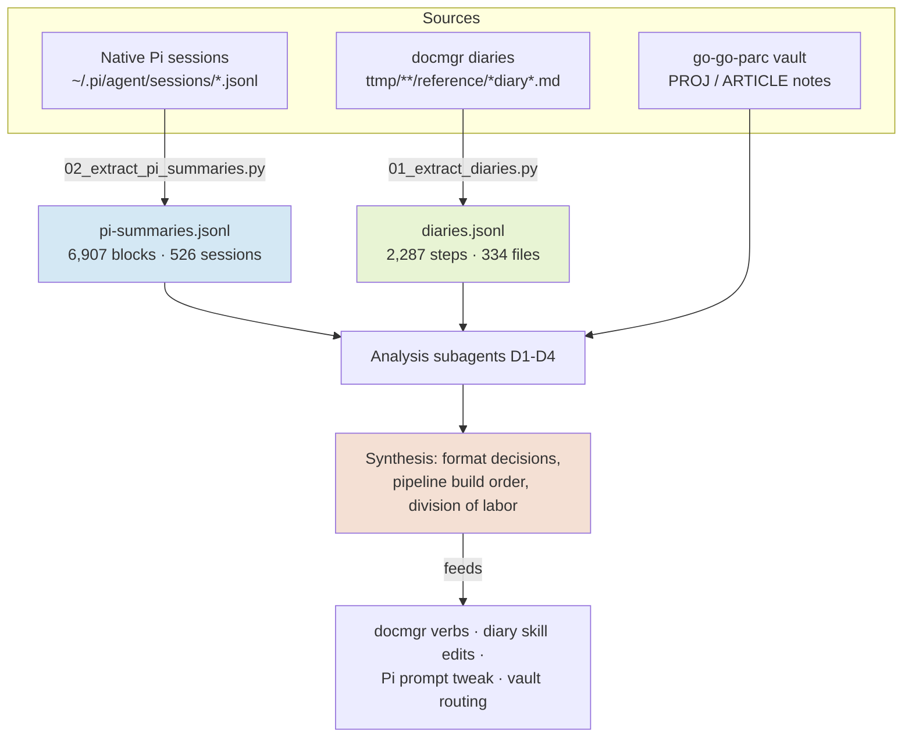

# Diary Mining

This project instruments the three memory layers that agent work produces — docmgr implementation diaries, Pi's per-turn `
` blocks, and the go-go-parc vault reports — measures what each actually contains and who consumes it, and produces a build plan for the postprocessing pipelines that extract compound value from them. The work lives in ticket `DIARY-MINING-2026-07-19` in claw-stuff: two extraction tools, a corpus (2,287 diary steps from 334 files across 7 repos; 6,907 Pi summary blocks from 526 sessions), four subagent analyses with contemporaneous diaries, and a synthesis with an execution checklist. It is a sibling of the transcript doc-friction campaign ([[Transcript Doc-Friction Analysis]]): that project measured how agents consume documentation; this one measures how they *produce* it.

> [!summary]
> - The three layers are complementary, not redundant: Pi summaries are the free, honest, every-turn reliability floor; diaries carry the verbatim evidence and open-decisions ledger; vault reports are genuine 3:1–15:1 synthesis — but consumed almost only when the user routes them by hand.
> - The diary corpus is highly disciplined (84% verbatim prompts, sections missing only 8–17%) — its one real gap is anchoring: 59% of steps carry neither a commit hash nor a timestamp, making them joinable to transcripts and git only by fuzzy text matching.
> - The postprocessing that pays: a compaction crib verb, a lessons-learned miner (proven at ~60% guard yield on a 104-step sample), a ticket-index enrichment, a handoff-doc skill, and a Pi-summary search index plus diary drafter.

## Why this project exists

Diaries proved to be load-bearing in the doc-friction campaign: diary-anchored sessions survived 80 context compactions with zero knowledge re-derivation, and dense handoff docs produced successor sessions with zero source probes. That made them worth treating as infrastructure — instrumented, measured, and improved — rather than as prose that accumulates in ticket directories. The immediate questions: what is missing from the diaries, how should the format change, what postprocessing is worth building, and do the vault reports written from diaries earn their cost?

## Current project status

Analysis complete; build phase not started. Delivered in the ticket: extraction tools (`scripts/01_extract_diaries.py`, `scripts/02_extract_pi_summaries.py`, both read-only), the two corpora (`data/`), four subagent reports (`analysis/01-04`), the reusable implementation guide with the four subagent prompts (`design-doc/01`), and the synthesis with the build plan (`analysis/05`).

## Architecture

The structural insight that shapes every pipeline: extraction and synthesis separate cleanly. Diary headings and summary fields are consistent enough that a ~60-line parser achieved 104/104 extraction in the mining experiment — so scripts and docmgr verbs own extraction, skills own the LLM synthesis on top, and the transcript layer (go-minitrace) supplies deterministically what both text layers lack: file paths, commands, commits, timings.

## Implementation details

### The extractors

`01_extract_diaries.py` walks repo `ttmp/` trees, identifies diaries by filename or frontmatter title, and parses each into step records: section presence against the diary skill's canonical list, per-section character counts, verbatim-prompt capture, commit hashes cited, and git-date provenance for the file. `02_extract_pi_summaries.py` scans native Pi JSONL for `
` blocks — which turn out to be structured four-field rolling summaries (`This turn / Session so far / Issues / Next steps`) mandated by our own extension (`2026-04-21--pi-extensions/extensions/session-summary/prompt.ts`) — and emits per-block records plus per-session rollups. Known fixes queued before the next run: deduplicate repos passed as two checkout roots, segment subagent summaries embedded in parent session files, fix a session-id filename fallback, and capture full prompt blocks rather than quoted fragments.

### What the measurements showed

**Diaries.** Compliance is not the problem — substance distribution is. "What warrants a second pair of eyes" was hypothesized to be ritual and measured to be the opposite: 95% of entries name a specific symbol, file, or open decision, making it the diary's open-decisions ledger. "What didn't work" is bimodal: verbatim fenced errors with cause chains when something failed (the corpus's most valuable content), pure "N/A" ritual on the 29% of entries where nothing did. The systematic absence is anchoring metadata — commits and timestamps — which every downstream consumer needs for joins.

**Pi summaries.** Concrete (79% carry identifiers, counts, or paths), honest by omission (verified against a session with ground-truth failure analysis: all 84 known noise failures correctly absent, all stated end-states confirmed against git), and gracefully compressive over a 129-summary session. They are path-lossy — never a prompt, commit, or error string — which is exactly the material the transcript join supplies. In one measured session the summary stream was the only coherent record: its diary covered 1 of 22 turns.

**Vault reports.** 268 notes in June–July (~1.07M words), 65% citing their source ticket. Pair-diffs show genuine synthesis: the go-go-wm scripting note adds a "four seams" architectural frame that exists nowhere in its 12k words of sources while keeping the best gotchas verbatim. Consumption is real but hand-routed: 1,197 Pi reads across 182 sessions, yet 24 of 25 pure-reader sessions were user-pointed and agent self-discovery during engineering work is zero. The vault is the user's memory, not the agents' — the failure is routing, not quality.

### The decisions

1. **Diary format**: one anchor line per step (`timestamp | commits | status`), template slimmed from ~11 to 7 sections, a two-line short form for bookkeeping steps, verbatim-or-nothing for failures, the checkpoint variant blessed rather than unified, and three `docmgr doctor` lints (step-anchor, verbatim-prompt, ritual-noise).
2. **Pi summaries**: add one optional `Ticket:` line to the prompt; build the FTS search index first (works today); then the diary drafter — This-turn runs cluster nearly 1:1 onto human diary steps, so summaries plus a transcript join produce a draft the agent or human only reviews, converting diaries from "expensive, sometimes skipped" to "review a draft".
3. **Pipelines** (build order, weak candidates killed with data): `docmgr ticket crib` → lessons-miner stage 1 → ticket-index (`docmgr list tickets --outcome --write`) → lessons-miner clustering skill → handoff skill → summary index/drafter. Killed: a standalone blog-drafter (vault notes are authored synthesis, 1.7x their source, not extraction) and the diary→eval corpus (prompt fragments too short until extractor fixes land).
4. **Division of labor**: diary = raw process + verbatim evidence; ticket design doc = durable per-project decisions; vault = cross-project narrative citing sources; embedded help = API reference. Routing rule: knowledge a future session in the same repo needs goes in the repo; knowledge you need across projects goes in the vault; process evidence stays in the ticket.

## Important project docs

- Ticket: `/home/manuel/code/wesen/claw-stuff/ttmp/2026/07/19/DIARY-MINING-2026-07-19--diary-and-pi-summary-mining-extraction-tools-quality-analysis-postprocessing-value/`
- Synthesis and build plan: `analysis/05-synthesis-the-diary-system-findings-and-build-plan.md`
- Reusable guide + subagent prompts: `design-doc/01-implementation-guide-diary-and-pi-summary-mining-with-reusable-subagent-prompts.md`
- Subagent reports: `analysis/01` (diary quality), `02` (Pi summaries), `03` (pipelines), `04` (vault value)
- Extractors and corpora: `scripts/`, `data/`

## Open questions

- Will the anchor-line lint actually move commit coverage from 41% to >90%, or does compliance need the auto-drafting pipeline to carry it?
- Should the Pi diary drafter write into docmgr directly (a draft step appended per cluster) or produce a separate draft file for human merge?
- Where is the ARTICLE production/routing equilibrium — throttle authoring, or invest in MOC/slug-index routing until consumption catches up?

## Near-term next steps

- Apply the extractor fixes and re-extract (regression baseline).
- Land the diary-skill template edits and the three doctor lints; add `Ticket:` to the Pi summary prompt.
- Build `docmgr ticket crib` and lessons-miner stage 1 (both small, both proven).
- Re-run the D1-D4 prompts after the format change and diff the structural stats.

## Project working rule

Every claim about what diaries or summaries contain must cite either a corpus statistic (reproducible from `data/` via the scripts) or a named file read in full; pipeline proposals ship with a measured feasibility experiment or are killed.
