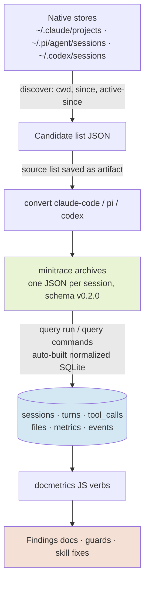

# Transcript Doc-Friction Analysis

This project uses go-minitrace to mine coding-agent session transcripts for evidence about how go-go-golems documentation actually gets consumed — and, more importantly, how it gets bypassed. The work lives in ticket `GOGO-DOCS-OPTIMIZE-2026-07-19` in the claw-stuff repository. In one day it produced a complete measurement pipeline, seven subagent-authored analysis reports on the session that built go-go-wm, a synthesized action plan for the documentation, and a reusable skill (`transcript-doc-friction-analysis`) with five tested go-minitrace JavaScript query commands that make the whole measurement repeatable in a handful of shell invocations.

> [!summary]
> - Across six substantial coding sessions in six repositories, `glaze help` was invoked **zero times**; agents acquire library API knowledge by grepping source checkouts and the Go module cache instead. The documentation content mostly exists — its delivery fails.
> - Knowledge acquisition consumed 20-30% of the measured session's token cost. Two curated API-signature references (~5k tokens each) would recover roughly 15% of total session cost.
> - The analysis method itself is now packaged: a `docmetrics` query-command repository (doc-consumption, source-probes, api-calls, failure-triage, episodes) plus an interpretation playbook, validated against seven archived sessions.

## Why this project exists

The go-go-golems ecosystem carries documentation in three layers: embedded help topics inside the binaries (`glaze help <topic>`, roughly 40 topics in glazed and 45 in go-go-goja), Claude Code skills (`glazed-command-authoring`, `go-go-goja-module-authoring`, `glazed-help-page-authoring`), and tribal knowledge notes in this vault. Whether any of it works can only be judged by observing what an agent does at the moment it needs an API signature. Session transcripts record exactly that moment: every grep, every file read, every skill load, every failed command, with timestamps and token counts.

The triggering question was concrete: analyze the Claude Code session that built go-go-wm (the PBUI window manager, GGWM-001 through GGWM-003, built in roughly four hours on 2026-07-18/19) and determine what documentation would have made that session cheaper. The answer generalized well beyond one session.

## Current project status

Completed in the ticket as of 2026-07-19:

- Attribution and conversion of the go-go-wm build session (claude-code `f26d0273`, 1158 turns, 668 tool calls) plus five comparison sessions across five other repositories.
- Seven parallel subagent analyses (episode deep-read, symbol-demand extraction, skill-trigger audit, doc-duplication mining, adversarial failure verification, cross-session comparison, token hotspot analysis), each a standalone report in the ticket's `analysis/` directory.
- A synthesis document (`analysis/09`) with a P0/P1/P2 action plan and a corrections ledger.
- The `transcript-doc-friction-analysis` skill at `~/.claude/skills/transcript-doc-friction-analysis/` with five tested JS query commands.
- A verified wave-2 candidate list: 133 recent sessions across Claude Code, Pi, and Codex in go-go-golems workspaces, including two workspaces worked by multiple frameworks.

Not yet done: the P0/P1 documentation fixes themselves, and the wave-2 cross-framework measurement.

## Architecture

The measurement pipeline is a four-stage ETL over native agent logs.



Three properties of this pipeline carry the analytical weight. First, native files are never modified; every stage writes derived artifacts into an investigation directory, so any claim can be re-derived. Second, the normalized SQLite schema separates `turns` (conversation, with per-turn token counts) from `tool_calls` (every invocation with command text, arguments, result, exit code), linked by turn index — the doc-friction questions are all joins over these two tables. Third, the query layer accepts JavaScript command files, which matters because the interesting classifications (which Bash command is a documentation read, which failure is a self-inflicted process kill) are string-processing problems that SQL alone expresses poorly.

## Implementation details

### Attribution before analysis

The first analytical rule is that a transcript match is not proof of authorship. The go-go-wm session was attributed by four converging signals: cwd discovery returned exactly one candidate; a content sweep over all native stores found no competing implementer; the converted archive contains 111 Edit and 111 Write calls into `go-go-wm/pkg/...`; and the repository's ten commits (`5518e3f` through `2002dd4`) fall timestamped inside the session's activity window. Weak signals (cwd, filename, keyword counts) shortlist; strong signals (file-writes plus repo-verified commit hashes) attribute.

### The docmetrics query commands

The five verbs live in `~/.claude/skills/transcript-doc-friction-analysis/query-commands/docmetrics/` and run against any set of archives:

```bash
QR=~/.claude/skills/transcript-doc-friction-analysis/query-commands
go-minitrace query commands --query-repository $QR docmetrics doc-consumption \
  --archive-glob './archives/active/*/*.minitrace.json' --output json
```

Each verb is one or two narrow SQL pulls followed by JavaScript classification. The essential logic, compressed:

```text
doc-consumption:
  skill loads        <- tool_calls where tool_name='Skill' (parse skill name from args)
  skill sideloads    <- Bash commands containing '.claude/skills'   # cat/sed reads
  embedded help      <- Bash commands matching command-position "<app> help <topic>"
                        (stoplist + operator-anchored regex kills prose false positives)
  doc reads          <- file_path or command touching pkg/doc/ or doc/topics/

source-probes:
  probe   <- Bash reader command (grep/sed/cat/head/ls) targeting ../<repo> or go/pkg/mod
  symbol  <- quoted grep pattern args, split on alternation; sed line-ranges recorded
  wave    <- consecutive probes within 25 turns
  repeat  <- same symbol in 2+ waves  => re-derivation (usually post-/compact)

api-calls:
  collapse consecutive assistant turn rows with identical
  (output, cache_read, cache_creation) tuples into one logical API call
  -> naive sums are ~2.3x inflated because the adapter stores one row per content block
  compaction event <- cache_read per call drops >80% from a >100k baseline
```

The failure-triage verb encodes a precedence-ordered rule set derived from hand-verifying all 23 failures of the baseline session: self-kill before zsh-expansion before read-before-edit before cwd-drift, with cd-state tracked across the session's Bash history because the harness shell persists its working directory between tool calls.

One authoring rule cost an hour to discover: the go-minitrace query-command scanner registers **every top-level `function` declaration as a CLI verb**. Helper functions must be written as `const name = function(...)` expressions or the file becomes a command group polluted with `open-db` and `parse-skill-name` verbs, and the single-verb path collapse breaks.

### The subagent fan-out

The seven deep-dive analyses ran as parallel background agents, each with a self-contained prompt carrying the archive glob, the known adapter caveats, and a report template with docmgr frontmatter. Each returned only a short summary; the reports landed as files, and the synthesis step read the files. Two design choices proved themselves. Giving every agent the caveat list (NULL `content_type` on user turns, `subagent_count` counting TaskCreate rows, exit-144 patterns) prevented seven independent rediscoveries of the same traps. And prompting the failure-verification agent adversarially — default stance "this is not real friction" — produced the project's most valuable correction.

## Findings

### The central result

Agents building on go-go-golems libraries do not consume the libraries' documentation; they grep the libraries' source. The evidence converges from five directions:

| Evidence line | Measurement |
|---|---|
| Behavior (S1) | ~105 of 668 tool calls (~16%) were knowledge acquisition, concentrated 4:1 on house frameworks (glazed, go-go-goja) over third-party X11 libraries |
| Content diff (S2) | Of ~35 grepped symbols, a majority are documented upstream — in ~80 help topics the session opened zero times |
| Re-writing (S4) | ~12% of the session's ~2450 ticket-doc lines re-explain library mechanics that already have canonical upstream homes |
| Generality (S6) | Across 6 sessions in 6 repos: `glaze help` invoked 0 times, including a session building glazed help-system integration |
| Cost (S7) | Knowledge acquisition cost 20-30% of session spend; ~80% of all cost is cache reads, so resident grep residue (~174k tokens) dominates |

The refinement that shapes the fix: process skills (docmgr, diary, ticket-research) fire consistently; the bypass is specific to library-API skills and embedded help. The one session that used an embedded help system heavily was dogfooding the tools it was building — proof that agents will run `<app> help` when something points them at it. Discoverability, not capability, is the bottleneck.

### Secondary findings

**Skill triggering fails on vocabulary mismatch.** The three skills that loaded all had near-verbatim overlap between prompt and description ("docmgr ticket", "obsidian vault", "textbook"). The five missed triggers were prompts like "build it." and "p5" — task-state pivots carrying zero matching vocabulary. Skill descriptions are written in answer-jargon ("NativeModule adapters, option/result codecs"); users write product language ("a DSL to control the window manager"). The clearest miss scored 3/3 across judge lenses: the diary skill, unloaded even though the user wrote "(see skill)".

**One stale instruction caused the largest grep wave.** The go-go-goja skill still teaches `engine.New()`, a constructor the library's own README documents as removed. A skill teaching a removed API is worse than no skill: it seeds a wrong prior that source-grepping must then correct.

**/compact is a friction multiplier with positive ROI.** The mid-session compaction saved on the order of 70M cache-read tokens by collapsing a 576k-token context to 20k — and silently evicted every loaded skill plus the goja API knowledge grepped twenty minutes earlier, forcing measurable re-derivation and the session's only wrong-path failures. The remedy is procedural: persist freshly grepped API findings into a ticket document before compacting; re-load skills after.

**The 23 failures reduce to 9 preventable clusters.** The largest — eight exit-144 rows — is a single bug: `pkill -f <pattern>` where the pattern also appears literally in the tool call's own command line, so the kill matches the harness shell and terminates the call mid-payload. A pidfile convention or `pkill -x` eliminates it. The remaining clusters (zsh `=word` expansion on `echo ===`, Write-before-Read on scaffolded files, persistent-shell cwd drift, NUL bytes from heredocs, pipeline-status traps) each map to a one-line AGENT.md guard.

### The corrections ledger

Three earlier claims were overturned by the deeper passes, and recording that is part of the method. "pkill failures are noise" inverted into "one real bug hit eight times." The headline token numbers were 2.3x inflated because the adapter stores one row per content block. And five of six machine-classified "go-compile" failures were actually self-kills mislabeled because the compound command contained `go build`. Every number now quoted uses the corrected accounting, and each correction became a feature of the tooling (the `api-calls` dedup verb, the reordered failure classifier).

## The action plan (condensed)

Full detail in the ticket synthesis (`analysis/09`); the plan in one table:

| Tier | Work |
|---|---|
| P0 (hours) | Fix `engine.New()` staleness; add "read these first" help-topic pointers to all three technical skills; apply four skill-description rewrites (product language + file-path triggers like "before writing any file under pkg/cmds/"); land nine AGENT.md/Makefile/lefthook guards; pin goja versions in go-go-goja's AGENT.md |
| P1 (days) | Two ~5k-token signature references: go-go-goja engine/runtimebridge/replapi, and a glazed signatures appendix including a renamed-APIs table (`parameters.*` → `fields.*`, `Decode` → `DecodeSectionInto`) |
| P2 (structural) | Upstream the genuinely new generic content from the GGWM ticket docs (multi-loop embedding contract, normalize→compile doctrine, event-fanout backpressure) into go-go-goja help topics; post-compact re-load protocol; re-measure with `docmetrics doc-consumption` |

## Wave 2: cross-framework measurement

A sweep of all three native stores (since 2026-06-15) yielded 133 candidates in disk-verified go-go-golems workspaces. The most valuable clusters are the ones wave 1 could not have: `prod-tiny-idp` (glazed + go-go-goja) was worked by Codex, Pi, *and* Claude Code in the same workspace, and `improve-rag-evaluation-system` by Pi and Claude on overlapping days. Pi and Codex agents have no Claude skills layer, so their doc-consumption profiles measure the libraries' own documentation surfacing directly. One blocking check precedes the run: the docmetrics verbs assume `tool_name='Bash'` with a populated `command` column, and the Codex adapter is known to bury commands in `arguments_json`.

## Important project docs

- Ticket workspace: `/home/manuel/code/wesen/claw-stuff/ttmp/2026/07/19/GOGO-DOCS-OPTIMIZE-2026-07-19--optimize-go-go-golems-coding-documentation/`
- Synthesis and plan: `analysis/09-synthesis-documentation-optimization-plan-from-the-seven-subagent-analyses.md`
- Subagent reports: `analysis/02` through `analysis/08`
- Intern guide to the whole system (also on reMarkable): `design-doc/01-intern-guide-the-go-minitrace-transcript-analysis-system.md`
- Investigation diary (10 steps, contemporaneous): `reference/01-diary.md`
- Wave-2 candidates: `reference/02-candidate-sessions-for-the-next-docmetrics-analysis-wave.md`
- The reusable skill: `/home/manuel/.claude/skills/transcript-doc-friction-analysis/`

## Open questions

- Do Pi and Codex agents show the same source-over-docs preference when no skills layer exists at all? (Wave 2 answers this.)
- After the P1 signature references land, does the source-probe count actually drop, or do agents grep regardless because source is ground truth? The measured baseline predicts partial adoption: the one skill that was read still got signature-verified against source afterward.
- Should the api-calls deduplication move into the go-minitrace claude-code adapter itself, so every downstream consumer gets correct token numbers?

## Near-term next steps

- Execute P0: the five skill/AGENT.md fixes, starting with the `engine.New()` staleness.
- Run the wave-2 adapter-compatibility check (one small Codex conversion), then the P1 cluster measurements.
- Write the two signature references and re-measure with `docmetrics doc-consumption`.

## Project working rule

Every friction claim must cite turn numbers verifiable by query against a converted archive, and every quantitative claim must state its accounting (deduplicated vs naive, which cost model). Heuristic classifier output is candidate selection; only transcript-verified findings get reported.
