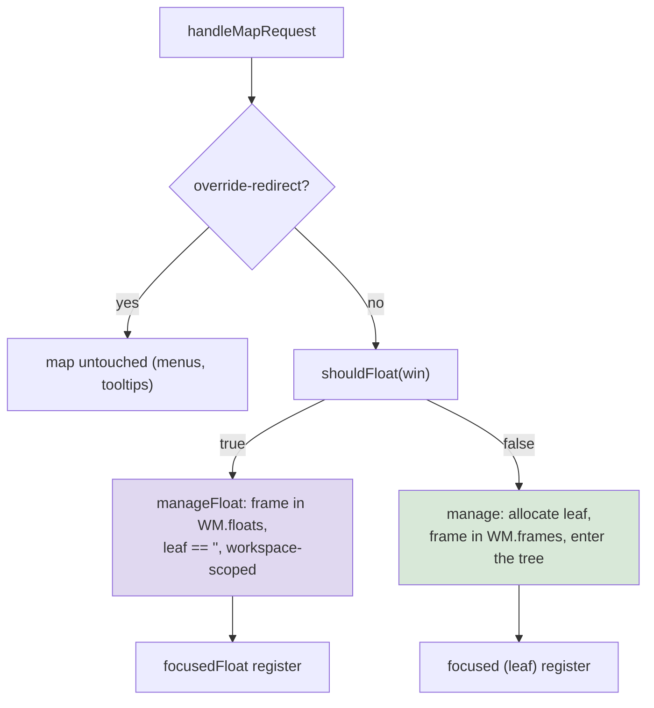

# go-go-wm: Floating Windows, a Command Launcher, and a Rich Presentation REPL

This report covers the fourth phase of the go-go-wm project. The first
three reports describe the presentation-based window manager itself
([[PROJ - go-go-wm - Building a Presentation-Based Window Manager in Go]]),
the JavaScript scripting layer
([[PROJ - go-go-wm - Scripting a Window Manager with an Embedded JavaScript Runtime]]),
and the theming, i3-configuration, and rendering-performance work
([[PROJ - go-go-wm - Themes, an i3 Config, and Profile-Driven Rendering Performance]]).
This phase implements three features that had existed only as design
documents — floating windows (GGWM-007), a command launcher with a
keyboard-input substrate (GGWM-008), and a notebook-style REPL whose
results are live presentations (GGWM-009) — and then a sustained
session of using the result, which produced a set of bugs and design
corrections that no test had been positioned to find.

The through-line of the phase is a single thesis carried from the
original CLIM and Genera lineage the project descends from: every
interesting value on the desktop is a typed object the whole system can
click, accept, and attach actions to. Each of the three features is a
different way of producing or consuming such objects. Floating windows
extend the object model to a class of windows the tiling tree cannot
hold. The launcher makes a launchable command itself a typed object.
The REPL makes every evaluation result a typed object. The dogfooding
fixes, in turn, are almost all about making objects flow correctly
across process boundaries — the point at which a clean in-process model
meets the untidy reality of Unix sockets, environment variables, and a
terminal emulator that did not ask to participate.

> [!summary]
> - **Floating overlay layer (GGWM-007).** Dialogs, utility palettes,
>   and fixed-size windows float above the tiling tree without ever
>   entering it; detection reads three X11 signals plus a scripting
>   override, and the whole layer reuses the tiled frame's machinery.
> - **Launcher and keyboard substrate (GGWM-008).** One command
>   registry (XDG applications, builtins, script commands) behind a
>   popup and a tile, plus the ability — new to the WM — for typed
>   keyboard input to reach a WM-drawn surface. Commands are `command`
>   presentations that answer accepts and carry verbs.
> - **Rich REPL (GGWM-009).** A notebook surface where each result
>   derives into a typed presentation with multiple views (a color is a
>   clickable swatch, a numeric array is a sparkline, an array of
>   records is a table). `Out[n]` is a live object that answers a
>   desktop accept.
> - **Dogfooding.** Theme repaints, socket inheritance, an
>   environment-variable collision, menu placement, and terminal-driven
>   accepts were all found and fixed by a person using the system.

## Why this phase exists

The previous phase ended with the window manager usable enough to run
an i3-derived configuration, but three categories of window and
interaction were still missing. A file dialog tiled into a half-screen
pane is not a layout; it is a defect. Starting a program required either
a keybinding wired in advance or a terminal; there was no fuzzy finder.
And the terminal REPL that shipped with the scripting layer printed a
color as eight characters of hexadecimal — the presentation model
stopped at the edge of the REPL. The three design documents GGWM-007,
GGWM-008, and GGWM-009 had already worked out how each gap should be
filled. This phase is the implementation, followed by the first
sustained use of the assembled result.

## Current project status

All three features are implemented, tested, and in use. Floating
windows and the launcher are complete through every planned phase. The
rich REPL is complete through its standalone-window host and desktop
integration; a second host that would embed a REPL kernel inside the
window-manager process is deliberately deferred, because the standalone
window already behaves as a tile and the launcher opens it in one
keystroke. A fullscreen toggle and broker-routed script commands were
added on top during the dogfooding session. Every feature is exercised
by an end-to-end fixture under `scripts/`, and each ticket carries a
step-formatted implementation diary under `ttmp/`.

## The floating overlay layer

### The design constraint

Since the first ticket, the window manager has maintained one property:
every managed window is a leaf in a binary split tree, every mutation of
that tree is a serializable operation, and a recorded stream of
operations replays to an identical tree. This property is what makes the
layout model testable without an X server, and it is exactly wrong for a
dialog. A dialog's position and size are not layout that anyone wants to
replay. The design question was therefore not "how do we float windows"
but "how do we float windows without weakening the property that makes
the tree valuable." The answer is that floats never enter the tree.
They are shell-side state, in the same category as the window manager's
own menus and bars: windows the layout model does not know exist.

### Detecting a window that should float

X11 has no single "floating" flag. It has three overlapping signals, and
a correct window manager reads all of them. `WM_TRANSIENT_FOR` is an
ICCCM property naming another window that this one is subordinate to;
file dialogs and preference sheets set it. `_NET_WM_WINDOW_TYPE` is an
EWMH list of type atoms, of which `DIALOG`, `UTILITY`, `SPLASH`, and
`TOOLBAR` mean "do not tile me." Size hints (`WM_NORMAL_HINTS`) whose
minimum equals maximum declare a fixed-size window, for which tiling is
meaningless because the client cannot fill the pane. To these three the
project adds a fourth, human signal: a scripting rule, the analogue of
i3's `for_window [class="Galculator"] floating enable`. The decision is
a pure function evaluated once, before leaf allocation:

```
shouldFloat(win):
    if a matching rule sets float     → that value       (human override)
    if WM_TRANSIENT_FOR is set         → true
    if window type ∈ {DIALOG, UTILITY,
                      SPLASH, TOOLBAR} → true
    else if min size == max size       → true
    else                               → false
```

Rules override in both directions, because heuristics are wrong
somewhere and the user is the tiebreaker: `float: false` forces a
dialog-typed window to tile. The rule check runs on the window-manager
side at map time rather than on the scripting side after the fact,
because an event-driven rule would tile the window first and convert it
afterward, visibly. The scripting layer therefore pushes its compiled
float rules down to the window manager whenever they change, using the
same push-down mechanism the keybinding system uses.

### One deliberate deviation from the design

The design document sketched a dedicated `floatWin` record. The
implementation does not use one, and the reasoning is worth preserving
because it is a recurring shape in this codebase. The window manager's
lookup maps, its per-window event dispatch, its exposure fast path, and
its paint-buffer discipline are all typed on the existing `frame`
struct. A second record type would either duplicate all of that
machinery or force an interface through the paint hot path. So a
floating window is a `frame` with `leaf == ""`, tracked in a sibling map
`WM.floats[client]` instead of `WM.frames[leaf]`. The design's actual
constraint — that floats never touch the tree — is untouched; only the
container changed. The payoff was immediate: exposure handling, buffer
caching, the shared-memory upload path from the performance phase, and
the client-window event discipline from the input-bug phase all applied
to floats with no new code.

The one genuinely new concept is a second focus register. The window
manager had tracked focus as a single leaf identifier since the first
ticket. Floats need focus too, without corrupting leaf-based directional
navigation. The implementation adds `focusedFloat` (a client window, or
zero) alongside `focused` (a leaf), with the invariant that exactly one
is "hot." A single predicate, `frameFocused(f)`, is what every paint
path reads to decide whether to draw the focused highlight. Focusing a
float preserves `focused`, so dismissing the float returns the keyboard
to the tile the user was on; pressing a directional-navigation key
clears `focusedFloat` and means "back to the tiled world."



### The test client

The honest test of this layer was blocked by a practical problem: no
standard program can easily be told to set `WM_TRANSIENT_FOR` or
fixed-size hints on demand. The ticket therefore includes a
purpose-built client, `go-go-wm testwin`, roughly sixty lines that maps
a window with exactly the requested float signals and speaks
`WM_DELETE_WINDOW` so the close path is exercised. With it, the
end-to-end fixture `scripts/float-smoke.sh` asserts every design
property against a real X server: a dialog floats and the tree's leaf
count is unchanged, a fixed-size window floats, killing a float leaves
no zombie frame, a `float: false` rule tiles a dialog and a `float:
true` rule floats a plain window, a workspace switch hides and reshows a
float, and the tile-to-float toggle alternates.

## The command launcher and the keyboard substrate

### One registry, many surfaces

The launcher is built around a single pure package, `pkg/launcher`, that
knows what can be launched and nothing about how a human picks from it.
A `Command` is a small record with an identifier, a label, an optional
executable command line, a kind (application, builtin, or script), and
match keywords. The registry aggregates three sources: XDG desktop
entries scanned from the standard application directories, the window
manager's own builtin tiles, and commands registered from JavaScript.
Matching is a pure fuzzy-subsequence scorer with a test table pinning
the orderings that matter — a boundary-start hit beats a mid-word hit, a
consecutive run beats scattered characters, an early match beats a late
one — multiplied by a frecency weight so that heavily used commands
float up without burying a much better textual match. The scorer and the
frecency store are ordinary Go with an injected clock; the whole package
is unit-tested with no X server and no broker.

The desktop-entry parser is deliberately not specification-complete, and
the report records this so nobody mistakes it for compliance: it reads
the main `[Desktop Entry]` group, strips the field codes (`%f`, `%u`,
and the rest) that pass files to an application, honors `NoDisplay` and
`Hidden` and the `Application` type gate, and ignores DBus activation and
desktop-action groups. Icons are not loaded at all. In a text-first
aesthetic, an entry renders as an accent chip (its color derived by
hashing the identifier) plus its name, and icon loading is the single
most expensive feature of launchers like rofi for no benefit here.

Two surfaces read this one registry. The popup, bound to the modifier
plus `d`, is an override-redirect window that takes input focus directly
while open — the easy case, because such a window receives its own key
events. Every empty tile is the second surface: start typing into it and
it filters the same registry, with the selected command launching into
that tile. The launcher's own record of "what is launchable" improves in
both places at once, and the tests target the pure package rather than
either surface.

### The keyboard substrate GGWM-009 depends on

The popup could take focus directly, but the launcher tile could not,
and this exposed a gap the project had carried since its third ticket.
Windows the window manager draws itself — the trace tile, the listener,
the launcher tile, a scripted app's tile — never received keyboard
input. Fixing this is a substrate, not a launcher feature, and the rich
REPL inherits it directly. When the focused leaf is a window-manager-
drawn surface, its frame window already holds input focus (a consequence
of an earlier fix; focusing a client-less tile focuses the frame rather
than passing window zero to `SetInputFocus`, which silently disables all
keyboard processing including root grabs). The frame now also selects
`KeyPress` in its event mask, and a new routing function decodes each
event and hands the resulting string to the focused surface. The design
rule is stated once and enforced in one place: typed input goes to the
focused surface; chords carrying the window-manager modifier never do,
because X grabs fire before focus delivery and the routing function
drops any remaining modified chord.

A satisfying detail: the scripting layer's tile interface had carried a
key-handler slot since the third ticket, and nothing had ever delivered
a key to it. The substrate completed that seam with no change to the
scripting module — evidence that the original layering was right and had
simply been waiting for a producer.

### Commands are presentations

Because a launchable command is a typed object like everything else on
this desktop, launching becomes more than string execution. Every
launcher row is a `command` presentation. Right-clicking one opens its
verb menu, served by the window manager (`command.launch`,
`command.edit` — which opens the source desktop file in an editor). A
script can ask the desktop for a command with the accept protocol, and
every launcher surface becomes the picker: a pending `accept("command")`
turns a click on any row into an answer rather than a launch. This
required no launcher-specific accept code, because a launcher row is an
object segment like any other, and the object click contract already
knew how to answer accepts.

### Script commands, in-process and across the broker

A command registered from the in-process rc.js runtime posts its handler
straight onto the JavaScript loop when launched. A command registered
from a standalone daemon cannot do that — the handler lives in a
different process. The design said such registration "routes over the
broker like verbs do," but the verb mechanism turned out to be a single
per-client handler owned by the presentation module, so a second
registrant would have clobbered it. The correction, found during
implementation, is that daemon commands dispatch over the event bus: the
window manager receives the registry entry over its control socket
(tagged with the owning broker client's name), a launch emits a
`command.invoke` event, and the owning process — subscribed through the
shared event fan — fires its own handler. The entry is pruned when the
broker announces that client's disconnection, exactly as verbs are. The
lesson is a small one worth keeping: a single-handler seam and a
broadcast bus are different tools, and "route like verbs" was the right
intent expressed through the wrong mechanism.

## The rich REPL

### Results as real presentations

The rich REPL is the largest instance to date of a pattern the project
established earlier: a surface described declaratively, validated at
definition time, rendered by a host that never executes JavaScript, and
handed back to the JavaScript loop only through posted snapshots. What is
new is what the surface renders. Each evaluation result derives into a
typed value with a summary, an ordered list of named views, and a
re-evaluable input form. The derivation is a total function over the
closed set of values a goja runtime exports to Go — a string that
matches a six-digit hex color becomes a `color` with a swatch view and a
text view; an array of numbers becomes a `series` with sparkline, bar,
table, and JSON views; an array of records with a common key set becomes
a `dataset` with table and schema views; everything else becomes a
capped, pretty-printed JSON value. Misdetection costs a suboptimal
default view, never an error, and the JSON view is always present as
ground truth.

![[go-go-wm-rich-repl-grid.png]]

The screenshot shows the REPL tile mid-session on the left. `123`
renders as a number; a color literal renders as a clickable swatch with
`swatch` and `text` view buttons; an object renders as pretty JSON with
a fold toggle; and `[123123, 123, 123, 123123]` renders as a `Series (4
points, 123 … 123123)` with `sparkline`, `bars`, `table`, and `json`
views and the sparkline drawn inline. The decision that makes this
matter is that a result carries a real presentation type, not a wrapper.
A color result is type `color`, so it answers any process's
`accept("color")` and inherits whatever verbs a daemon registered for
colors, with no adapter code. The REPL stops being a window you look
into and becomes a producer of first-class desktop objects.

The critical consequence, and the one that could not have existed in the
browser prototype this design descends from, is that a live object
nested inside a rendered view is still a live object. A color swatch
inside a table inside `Out[7]` answers a desktop accept, because it is an
object segment like any other. The report states this as the design's
central claim precisely because it is the part that is easy to lose in
implementation and easy to verify: the end-to-end fixture evaluates a
color in the REPL, locates its swatch on screen by scanning a screenshot
for the exact red-green-blue triple, clicks it, and asserts that a
command-line `accept --ptype color` running in another process received
the answer.

### Keeping the kernel unmodified

The hardest open detail was capturing the raw value of each evaluation
without modifying the REPL kernel that the terminal REPL already used.
That kernel returns results as strings; rich derivation and the
`__pbui__()` opt-in and `Out(n)` history all need the raw JavaScript
value. Reading the kernel's source settled the approach without changing
it. Each input is submitted expression-wrapped, assigning the value into
a history object; if that wrap fails to parse — because the input is a
statement such as a `let` declaration or a loop — the surface falls back
to evaluating the source verbatim with no capture, the standard
wrap-then-fallback idiom. A session prelude installs the `Out(n)` and
`$_` bindings and a console shim, and pre-binds the three modules as
globals so that typing `wm.tree()` works without an explicit `require`.
After a successful capture, a single owner-mediated call into the session
runtime exports the value for derivation and invokes `__pbui__()` if the
value defines it, on the JavaScript loop, never during rendering.

This work also surfaced a fact worth keeping about the kernel's
configuration profiles. Its "raw" profile executes any input but
captures no console output; its "interactive" profile captures console
but rewrites cell source in a way that rejects the multi-line capture
wrap. The resolution is to stay on the raw profile — identical semantics
to the terminal REPL — and capture console in the prelude shim instead,
which decouples the surface from the profile choice entirely.

### Three new segment kinds

The declarative surface IR gained exactly three segment kinds, each with
a definition-time validator and a renderer, and no general widget
system. A `table` segment renders columns with right-aligned numerics, a
row cap with a "… N more" affordance, and — the detail that carries the
whole thesis — cells whose text looks like a hex color render as live
color chips, so the click contract reaches inside a table. An `image`
segment carries a pre-rendered pixel strip; it is Go-side only, and the
validator rejects it from JavaScript, because the render host must stay
free of JavaScript and heavy visuals must arrive as data the Go side
draws. The mini-plotters that produce those strips — a sparkline and a
bar strip, about sixty lines each — are golden-tested; one of them hid a
textbook error, a Bresenham line routine that recomputed its error term
after the branch that had already mutated it, so steep segments
overshot the endpoint and the loop never terminated, which presented as
a golden test that hung rather than failed. A `field` segment is an
editable text row with a cursor, shared in spirit with the launcher's
query line.

## The presentation model, seen whole

The dogfooding session that followed was conducted through the assembled
system, and two screenshots from it show the model working across every
surface at once.

![[go-go-wm-listener-verbs-accepts.png]]

Here a color swatch in the color-lab tile has been right-clicked. Its
menu carries `Inspect` (a window-manager verb), `Mix with…` and
`Lighten` and `Collect into Notes` (verbs served by the demo application
in its own process), because the broker assembles the menu for the
`color` type from every process that registered a verb for it. The
listener tiles on the right show the results of earlier commands: a sum
of two numbers accepted from anywhere, a table of color-mix results,
each cell a live object. Nothing in this picture is a screenshot of a
value; every chip is the value.

![[go-go-wm-scrape-menu-at-cursor.png]]

This is the terminal integration. A git commit hash printed by `git log`
in the kitty tile has been wrapped in a clickable terminal hyperlink by
`go-go-wm scrape`, whose payload is a `pbui://` object URI. Clicking it
runs `go-go-wm menu`, which pops the verb menu — `Inspect`, `Copy short
hash`, `Compare with…` — at the cursor. The `Copy short hash` and
`Compare with…` verbs are served by a script daemon; the trace tile in
the middle records the whole conversation as bus events (`verb.invoked`,
`accept.started`, `accept.cleared`, `listener.print`), and the inspector
on the right shows the commit as a typed object. The source of those
verbs is a fourteen-line daemon:

![[go-go-wm-git-verbs-source.png]]

The second of those verbs, `Compare with…`, declares that it accepts a
`git-commit`. Invoking it opens `pbui.accept("git-commit")`, and the
user then clicks a second commit to complete the comparison — including
a second commit scraped in the terminal. Making that work across the
process boundary required a correction to the broker, described below.

## Dogfooding: bugs the assembly revealed

Sustained use of the assembled system found a series of defects, most of
them at process boundaries, none of them visible to the per-feature
fixtures. They are recorded here because the class of bug is the durable
lesson.

**Theme switching left surfaces stale.** The window manager's own chrome
repainted on a theme change, but standalone windows — the demo apps, the
REPL window — are separate processes with their own copy of the palette
and were never told. The fix gives those hosts an opt-in subscription to
the theme-changed event; it is opt-in because a broker client has a
single event channel, and a process that already runs its own event fan
must not have the window shell consume it.

**Theme switching then left the window manager's own chrome stale, in
light mode.** This was the more instructive bug, and light mode — whose
surfaces are pure white — made a latent defect loud. Setting a window's
background pixel and setting its background pixmap are mutually exclusive
in X11: assigning the pixel detaches the pixmap. The theme swap had been
poking the background pixel of every frame and bar as a flash guard, but
frames carry their painted content in a shared-memory background pixmap
and bars in an X-image pixmap, and the cached repaint paths only cleared
or blitted, which then revealed the solid pixel instead of the repainted
content. The fix rebuilds the buffers on a theme change rather than
poking the pixel, and a fixture now samples the ink-colored status bar
across a light-to-dark switch to catch any regression without a human
eye.

**Children did not inherit the desktop's sockets.** Clicking a scraped
link inside the window manager opened a browser, because the embedded
broker listens on a custom socket but child processes inherited only the
display variable, so a bare `go-go-wm menu` fell back to the default
socket path that the broker was not using. The window manager now
publishes its resolved broker and control sockets into its own process
environment, so everything it spawns inherits them.

**An environment-variable collision, activated by the previous fix.**
Exporting the control-socket variable then broke every broker
command-line tool with a cryptic protocol error. The command-line
framework, configured with an application name, auto-binds each flag to
an environment variable derived from that name; the broker `--socket`
flag was therefore auto-filled from the control-socket variable — the
wrong socket — so a tool connected to the control socket and failed the
broker handshake. Every environment-configurable value in this project
is resolved explicitly in command code, so the auto-binding was pure
liability, and dropping the application name removed the collision. The
broker client now also detects a non-broker handshake and names the
likely cause rather than reporting a missing frame field.

**The menu popped at the corner.** The click handler ran the menu
command with no position, which defaulted to the origin. An unset
position now queries the X pointer, so a clicked link opens the menu
where the cursor is.

**A terminal click could not answer an accept.** When `Compare with…`
opened an accept for a second commit, clicking a scraped commit in the
terminal ran the menu command, which always popped a menu and never
answered. The fix places the presentation click contract in the broker:
when an accept is pending and a clicked object's type matches, a menu
request answers the accept instead of showing a menu, exactly as
clicking a chip in a window-manager tile does. A non-matching click
still opens a menu. This is the correct home for the contract, because
the broker is the one component that knows the accept state and is
shared by every clicking surface.

## Project shape

The phase touched these areas of `/home/manuel/workspaces/2026-07-18/go-go-wm/go-go-wm`:

- `pkg/wmx11/float.go`, `fullscreen.go` — the shell-side overlay layer
  and the fullscreen toggle; both are frame-based state outside the
  tree.
- `pkg/launcher/` — the pure registry: desktop-entry parser, fuzzy
  scorer, frecency store, source aggregation.
- `pkg/wmx11/launcher.go` — the popup, the launcher tile, the frame
  keyboard substrate, launch routing, and script-command dispatch.
- `pkg/repl/` — the rich-value protocol: derivation, `__pbui__`
  normalization, the cell/session model.
- `pkg/cmds/replui.go` — the standalone REPL surface and the kernel
  capture strategy.
- `pkg/apps/uispec/` and `pkg/draw/plot.go` — the three new segment
  kinds and the mini-plotters.
- `pkg/cmds/testwin.go` — the float-signal test client.
- `scripts/float-smoke.sh`, `launcher-smoke.sh`, `replui-smoke.sh`,
  `playground.sh` — the end-to-end fixtures and the demo session.
- `examples/scripts/git-verbs.js`, `net-verbs.js` — cross-process verb
  daemons for `git-commit`, `ip`, and `url`.

## Important project docs

The three governing design documents and their step-formatted
implementation diaries live under `ttmp/2026/07/19/` in the repository,
one directory per ticket: `GGWM-007-TRANSIENTS`, `GGWM-008-LAUNCHER`,
and `GGWM-009-RICH-REPL`. Each design document's intern-grade guide
precedes the implementation, and each diary records the deviations and
the failures — the frame-reuse decision, the kernel-profile constraint,
the broker-versus-events correction, the environment-variable collision
— in the order they were discovered.

## Open questions

- Whether to build the window-manager-embedded REPL tile, which would
  place a second REPL kernel inside the window-manager process. The
  standalone window already behaves as a tile and the launcher opens it
  in one keystroke, so the embedded host buys process-freeness at the
  cost of a full in-process kernel. It is unblocked — the keyboard
  substrate it needs now exists — but not currently justified.
- Client-requested fullscreen. The current toggle is
  window-manager-initiated; honoring a client's `_NET_WM_STATE`
  fullscreen message (what a video player's fullscreen key sends) is the
  obvious next increment.
- Multi-output support remains the largest undesigned area. Three design
  documents defer output-pinning and per-output work areas to a future
  multi-output ticket; float centering and workspace pinning both want
  it.

## Near-term next steps

- Continue the daily-driver experiment with the reshaped `playground.sh`
  and the i3 configuration, and let real use write the next set of
  tickets, as this phase did.
- Consider a permanent install convenience that builds the binary and
  installs the kitty integration together, since that flow is currently
  documented as separate steps and was a source of confusion during
  dogfooding.

## Project working rule

The durable rule from this phase: the clean part of a presentation-based
desktop is the in-process object model, and the bugs live at the process
boundaries — sockets, environment variables, background pixmaps, and a
terminal emulator that has to be taught to route one URI scheme. Build
the object model first and prove it with in-process tests, then treat
every boundary crossing as its own feature with its own end-to-end
fixture, because no per-feature test is positioned to see a boundary
that only exists once the features are assembled and used.

## Related notes

- [[PROJ - go-go-wm - Building a Presentation-Based Window Manager in Go]] —
  the window manager itself (GGWM-001): ops-as-data, the broker, the
  accept protocol.
- [[PROJ - go-go-wm - Scripting a Window Manager with an Embedded JavaScript Runtime]] —
  the scripting layer (GGWM-002/003): runtime model, the Backend seam,
  the three attachment points this phase's features register through.
- [[PROJ - go-go-wm - Themes, an i3 Config, and Profile-Driven Rendering Performance]] —
  the previous phase (GGWM-004/005/006): themes, the i3 configuration,
  and the rendering-performance work whose shared-memory upload path the
  float layer reuses.
