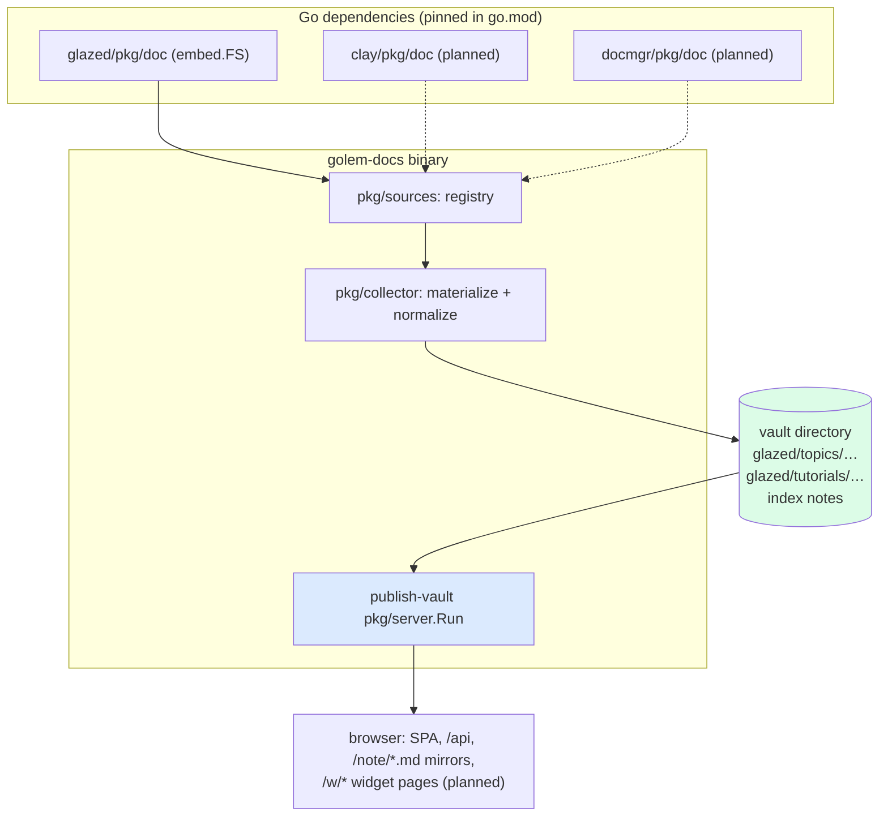

# golem-docs

golem-docs is the documentation server for the go-go-golems ecosystem. It takes the markdown documentation that every go-go-golems CLI already embeds in its binary and serves all of it as one browsable, searchable web site. The repository is deliberately small — a content pipeline, a source registry, and one command — because everything difficult (the server, the search index, the markdown renderer, the reading UI, the server-driven widget pages) comes from the publish-vault framework as an ordinary Go dependency.

> [!summary]
> - Every go-go-golems repo exposes `pkg/doc`: an embedded filesystem of markdown files with help-section frontmatter. golem-docs imports those packages as Go dependencies and materializes their embedded trees into a vault directory at startup.
> - The server, search, rendering, and UI come from `github.com/go-go-golems/publish-vault` v0.0.3 — the first release of publish-vault as an importable framework rather than a standalone binary.
> - Content updates are dependency updates: `make bump-go-go-golems` followed by a redeploy is the entire content pipeline. There are no webhooks, no scraping, and no CMS.

## Why this project exists

Every go-go-golems CLI ships its documentation inside its binary. The glazed help system defines the format: markdown files with YAML frontmatter (`Title`, `Slug`, `Topics`, `Commands`, `Flags`, `SectionType`), embedded with `go:embed`, loaded at startup into a queryable help database, and browsed with `<tool> help <topic>` in a terminal. The format is good and the corpus is substantial — glazed alone embeds 77 documents across topics, tutorials, applications, and examples.

The problem is reach. This documentation is invisible to anyone who has not already installed the tool, and there is no cross-repository view at all: a question like "show me every tutorial about templates, across all the tools" has no answer today because each binary only knows its own docs.

One obvious response would have been to add a web server to glazed itself. That was considered and rejected: glazed is a library, and a web server is an application concern with its own dependency tree, deployment surface, and release cadence. Putting it in glazed would bloat every downstream consumer to serve a feature almost none of them need. Hence a separate repository whose entire job is aggregation and serving — and hence the second design decision, which shapes everything below: golem-docs does not implement serving infrastructure either. It builds on publish-vault.

## Current project status

Phase 1 is complete and verified end to end. The repository exists at `/home/manuel/code/wesen/go-go-golems/golem-docs` (GitHub: go-go-golems/golem-docs, scaffolded from go-template with docmgr initialized), and the `task/phase1-collector` branch serves the full glazed corpus: 77 documents with full-text search, per-note pages, agent-readable markdown mirrors, and the publish-vault SPA embedded in the binary via a plain `go build -tags embed`.

Two items gate the merge. First, glazed's `pkg/doc` currently exports only `AddDocToHelpSystem(hs)`; golem-docs needs the raw filesystem, so a one-line export (`func FS() fs.FS`) sits on glazed branch `task/export-doc-fs`, not yet pushed — glazed's pre-push hook runs a Dagger-based build that does not complete in the sandbox this work was done in. Second, until that lands, golem-docs's `go.mod` carries a temporary `replace` directive pointing at the local glazed checkout, which must be swapped for a real version before CI can build the branch.

The design work lives in the docmgr ticket `GD-DOCS-SERVER-001` inside the repository (design doc plus implementation diary), and the prerequisite framework work is documented in publish-vault's ticket `PV-FRAMEWORK-017`.

## The convention that makes this possible

The entire project rests on one ecosystem convention. Every participating repository contains a package shaped exactly like this — the following is `glazed/pkg/doc/doc.go`, verbatim and complete:

```go
package doc

import (
	"embed"
	"github.com/go-go-golems/glazed/pkg/help"
)

//go:embed *
var docFS embed.FS

func AddDocToHelpSystem(helpSystem *help.HelpSystem) error {
	return helpSystem.LoadSectionsFromFS(docFS, ".")
}
```

The embedded tree holds `topics/`, `tutorials/`, `applications/`, and `examples/` directories of markdown files. Each file's frontmatter follows the glazed help-section schema (`glazed/pkg/help/model/section.go`):

```yaml
---
Title: Help System
Slug: help-system
Short: One-line description shown in listings
Topics: [documentation, help]
Commands: [help]
Flags: [--topic]
IsTopLevel: true
ShowPerDefault: false
SectionType: GeneralTopic   # GeneralTopic | Example | Application | Tutorial
---
```

A grep across the ecosystem confirms the convention is genuinely universal: glazed, clay, docmgr, devctl, escuse-me, go-minitrace, codex-sessions, and discord-bot all expose this exact package shape. This is why golem-docs can treat "add a repository's docs" as "add a Go dependency and one registry entry" — the content contract is already standardized, versioned, and shipped through the module proxy like any other code.

The consequence worth sitting with: **documentation versions are dependency versions.** The docs golem-docs serves for glazed v1.3.6 are exactly the docs embedded in glazed v1.3.6. There is no synchronization problem, no scraper to break, no staleness detector to build. The repository's existing `make bump-go-go-golems` target — which upgrades every go-go-golems dependency in `go.mod` — is literally the "refresh all documentation" verb, and a redeploy publishes the result.

## Architecture

golem-docs adds three components in front of the publish-vault framework. Everything else in the diagram is imported.



The flow at startup is linear. The serve command asks the registry for all sources, hands them to the collector, which wipes and rebuilds the target vault directory; then `server.Run` takes over and the rest is publish-vault's normal operation: load the vault, build the search index, serve the API and the SPA.

The three owned components:

- **`pkg/sources`** — the registry. One entry per repository: name, repo URL, the embedded `fs.FS`, and the pinned module version (recovered at runtime through `debug.ReadBuildInfo`, so the UI can display "glazed v1.3.6" without any configuration).
- **`pkg/collector`** — the content pipeline, described in detail below.
- **`cmd/golem-docs serve`** — a glazed-style command (schema-backed flags, help system) that wires the two together and calls `server.Run`. `--vault-dir` defaults to a temporary directory; the file watcher stays off because the vault is derived content that only changes when the binary changes.

## Implementation details

### The collector

The collector walks each source's embedded filesystem and writes every markdown file into a per-repo subtree of the target directory. The structure of one materialization:

```text
materialize(target, sources):
  wipe target                              # derived content, never edited
  for each source:
    for each *.md in fs.WalkDir(source.Docs):
      front, body = splitFrontmatter(raw)
      norm = normalize(front, source)      # table below
      write target/<source.name>/<dir>/<Slug>.md
    write target/<source.name>/index.md    # sections grouped by SectionType
  write target/index.md                    # landing page listing repositories
```

Two structural choices matter here. Each repository gets its own top-level directory, so slugs are namespaced (`glazed/topics/help-system`) and two repositories can both own a `topics/templates.md` without collision. And the file is renamed to its frontmatter `Slug` during the copy, so vault slugs are the same stable identifiers the help system uses, rather than accidents of file naming like `01-help-system.md`.

### The frontmatter contract

publish-vault's parser reads lowercase Obsidian-style keys; the help schema uses capitalized keys. The collector translates at the boundary rather than teaching the framework a second dialect — the framework stays generic, and the contract lives in exactly one function with a table-driven test suite over `fstest.MapFS` fixtures:

| help-schema key | vault key | transformation |
|---|---|---|
| `Title` | `title` | copied; falls back to the filename when absent |
| `Slug` | — | becomes the output filename, hence the vault slug |
| `Short` | `description` | copied; drives listing excerpts |
| `Topics` | `tags` | appended after two synthetic tags: `repo/<name>` and `type/<sectiontype>` |
| `SectionType` | `sectionType` | preserved verbatim for later filtering |
| `Commands`, `Flags` | `commands`, `flags` | copied; `none` placeholder entries are dropped entirely |
| `IsTopLevel`, `ShowPerDefault`, `Order` | lowercased | ordering hints for index generation |
| anything else | lowercased key | passed through untouched |

The synthetic tags are what make the cross-repository views fall out of existing framework features instead of new code. "Every tutorial" is the tag `type/tutorial`; "everything from glazed" is the tag `repo/glazed`; publish-vault's tag browser and search already know how to intersect them.

The normalizer is deliberately defensive. The corpus is a hundred-plus hand-written files accumulated over years; a file with malformed or missing frontmatter is served as-is with a filename-derived title, never dropped and never fatal. One subtlety recorded in the diary: frontmatter splitting anchors on the leading `---\n` and the *first* `\n---` after it, because a naive split on `---` corrupts every document that contains a markdown horizontal rule in its body.

### Index generation

The collector generates one index note per repository plus a landing page. The repository index groups sections by `SectionType`, ordering each group by `IsTopLevel` first, then `Order`, then title — the same precedence the terminal help system uses. Entries are path-based wiki-links with the section title as display text (`[[glazed/topics/help-system|Help System]]`), so the framework's link resolution, hover previews, and backlinks apply to generated navigation exactly as they do to hand-written notes.

### What the framework provides, and what it took to make it importable

publish-vault began this week as a standalone binary with module name `retro-obsidian-publish` and every package under `internal/` — reusable by nobody. The prerequisite work (ticket `PV-FRAMEWORK-017` in that repository) had three parts:

1. **Module rename** to `github.com/go-go-golems/publish-vault`, so `go get` can resolve it.
2. **Package promotion**: nine packages moved from `internal/` to `pkg/` (`server`, `vault`, `search`, `api`, `watcher`, `web`, `widgethost`, `vaultdata`, `vaultwidgets`); the markdown parser and ignore-rules engine stayed internal, since Go permits a module's own `pkg/` to import its `internal/` while denying that to downstream importers.
3. **Frontend delivery.** This is the interesting constraint. The SPA is embedded via `go:embed`, and a downstream build can only embed files that exist in the published module zip — but built web assets are deliberately not committed to the main branch. The resolution is a dispatch-driven release workflow that builds the SPA, commits it into `pkg/web/embed/public` in a single release commit, and pushes *only the tag* pointing at that commit. The main branch never carries build products, yet every tagged version is self-contained: golem-docs pins v0.0.3 and gets the entire reading UI from a plain `go build -tags embed`, with zero frontend tooling in its own repository. (An `fs.FS` override on the server config exists as the escape hatch for applications that eventually want their own frontend.)

The version audit that established v0.0.3 as the pin is instructive: v0.0.1 and v0.0.2 were minted as plain local tags before the workflow existed, so their module zips contain no assets and fail downstream embed builds with `pattern embed/public: cannot embed directory embed/public: contains no embeddable files`. Tag provenance matters when the artifact is the module zip.

The downstream result, in its entirety — this is the complete server wiring of golem-docs:

```go
srcs := sources.All()
if err := collector.Materialize(vaultDir, srcs); err != nil {
    return fmt.Errorf("materialize docs: %w", err)
}
return appserver.Run(ctx, appserver.Config{
    VaultDir:  vaultDir,
    Port:      settings.Port,
    VaultName: settings.VaultName,
    PageTitle: settings.PageTitle,
    ServeWeb:  settings.ServeWeb,
    PagesDir:  settings.PagesDir,
})
```

### Verified behavior

The Phase-1 smoke matrix, run against the embedded binary serving real glazed content:

| Check | Result |
|---|---|
| `/api/config` | `{"vaultName":"go-go-golems docs", "notes":77}` |
| `/note/glazed/topics/help-system` | 200, rendered with normalized frontmatter |
| `/api/search?q=template` | 21 results |
| `/` (embedded SPA) | 200 |
| `/note/glazed/topics/help-system.md` | markdown mirror with translated frontmatter |
| landing + repo index notes | generated, grouped by SectionType |

Unit coverage: four collector tests over `fstest.MapFS` fixtures (normalization contract, missing-frontmatter tolerance, index content, target wiping) — the fixture approach means the tests need no upstream FS export and no disk layout assumptions.

## Decision records (condensed)

- **D1 — Build on publish-vault as a dependency.** Forking forfeits upstream fixes; embedding a server in glazed was already rejected. Consequence: a hard dependency on the framework-ification, and `replace`-based co-development until tags existed.
- **D2 — Collect at startup, not at build time.** publish-vault loads a 986-note vault in under 40 seconds; this corpus is a tenth of that. One code path for development and production beats a faster boot nobody has asked for.
- **D3 — Repository is the tree; kind and topic are tags.** *Where* a document lives is its repo; *what* it is (`type/tutorial`) and *what it covers* (`Topics`) are tags. Cross-repo filtering then reuses the framework's tag machinery instead of new tree-walking code.
- **D4 — Content versioning via go.mod.** Described above; the trade-off is that docs lag upstream releases until bumped, which is correct behavior for documentation describing released software.
- **D5 — Upstream FS exports are one-line PRs, absorbed per-repo.** A repository that has not merged the export is simply absent from the registry; the design degrades repository-by-repository rather than globally.

## Open questions

- **The docs.data module (Phase 3).** The plan adds a fourth goja module next to `widget.dsl`/`vault.data`/`vault.widgets`, exposing schema-aware queries (`docs.sections({repo, type, topic, command})`) to server-side JavaScript pages, so the docs UI — landing page with repo cards, per-repo section browser, per-command reference — is composed in widget pages rather than new React code. The open design question is where the query index lives; the intended answer is behind the same snapshot-provider seam the framework uses for reloads.
- **Template-bearing sections.** Some help sections are Go templates meant for terminal rendering (`IsTemplate: true`). Serve them raw, or strip the template syntax? Undecided; currently served raw.
- **Hostname and deployment target.** Phase 4 copies publish-vault's Docker/GitOps pattern; the public hostname is not yet chosen.

## Near-term next steps

1. Push glazed's `task/export-doc-fs` branch (blocked on the Dagger-based pre-push hook; needs an environment where that completes) and open the one-line PR.
2. Swap golem-docs's `replace` for a real glazed version; push `task/phase1-collector`; open the PR.
3. Fan out the registry to clay, docmgr, and devctl (Phase 2 — each is a dependency bump and a registry entry once the export pattern merges).
4. `docs.data` module and the widget pages for the docs UI (Phase 3).
5. Dockerfile, publish-image workflow, GitOps manifests (Phase 4).

## Project working rule

golem-docs stays thin. If a feature requires new serving infrastructure, it belongs in publish-vault where every consumer benefits; if it requires knowing what a help section *is*, it belongs here. The test for new code in this repository is whether it touches the help-schema contract — everything else is presumed to be framework work.

## Related notes

- [[PROJ - Publish Vault Widget DSL - Server-Driven Pages from an Embedded JavaScript Runtime]] — the framework's widget-page system this project will drive its UI through
- [[widget-dsl]] — the widget IR / server-driven UI design that publish-vault adopted
- [[go-go-goja]] — the embedded JavaScript runtime underneath the widget pages
