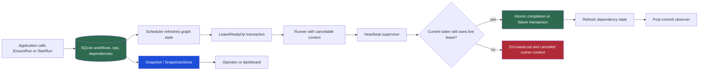
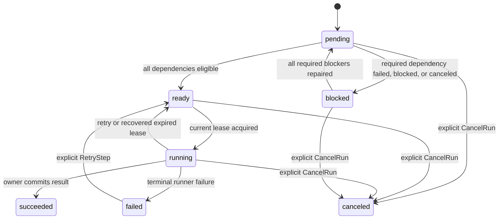
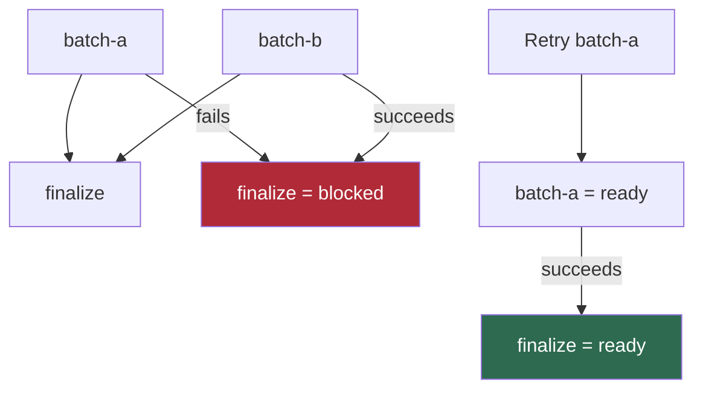

# Hardening Scraper for Long-Running Resumable Workflows

Scraper already had the shape of a durable workflow engine: SQLite stores workflows, operations, dependencies, leases, results, artifacts, retry state, and queue limiter state; workers lease ready operations; runners execute them; operator APIs inspect and mutate them. That foundation is useful for web scraping, but it is also useful for expensive batch preparation, OCR, provider-backed enrichment, and other work where restarting from zero is unacceptable.

This report explains the hardening completed in July 2026 under `SCRAPER-RESUMABLE-WORKFLOW-HARDENING`. The work did not add a second workflow system for a consumer. It made the existing scraper engine safe to own long-running resumable work. The central changes are sortable persisted time, lease ownership enforcement, scheduler heartbeats, recoverable dependency blocking, actual bounded concurrency, canonical create-or-attach workflow identity, safe observers, and restart-safe inspection.

> [!summary]
> - A lease is now a durable ownership proof, not a best-effort record. A worker that no longer owns a live lease cannot write a completion, failure, artifact, or emitted operation.
> - `blocked` separates dependency-derived inability to run from explicit `canceled` intent. Repairing a required dependency reopens descendants without recreating independent successful work.
> - `MaxWorkers` now permits real concurrent runner execution while SQLite serializes short write transactions and continues to enforce durable queue limits.
> - Process-local observer events are useful for delivery, but the store-derived `Snapshot` and `SnapshotsSince` APIs remain the restart-safe source of current workflow truth.

## Why this report exists

The earlier [[ARTICLE - Building Book OCR on Scraper Job System - Workflow Runtime Deep Dive]] established a valuable direction: a workflow can represent a book, a page, or a final assembly step rather than a single anonymous job. That direction creates stronger requirements for the engine beneath it. A provider call can take longer than a default lease. A single failed page should not discard successful pages. An operator should be able to repair a failed branch and continue the finalizer. A dashboard must reconstruct progress after its process restarts. These are execution correctness requirements, not UI details.

The initial implementation investigation found that scraper version `v0.0.4` did not satisfy several of those requirements. The gaps were concrete and reproducible. `MaxWorkers=3` did not execute three operations concurrently. A failed required dependency caused its finalizer to become `canceled`, and retrying the dependency did not reopen that finalizer. Lease heartbeats existed in the store but were not scheduler-managed, and repeated heartbeats extended from an old copied expiry rather than the current time. Most seriously, a worker whose lease had expired and been replaced could still commit its old result.

The project therefore treated the durable engine as the layer to repair. Provider-specific recovery policy, application schemas, JavaScript helpers, dashboard rendering, and downstream evidence ledgers remain outside scraper. Scraper now provides generic scheduling and state-machine guarantees that all consumers can use.

The concrete implementation is in:

```text
/home/manuel/workspaces/2026-06-30/benchmark-cpu-inference/scraper
```

The ticket source material is:

```text
/home/manuel/workspaces/2026-06-30/benchmark-cpu-inference/scraper/ttmp/2026/07/20/SCRAPER-RESUMABLE-WORKFLOW-HARDENING--harden-scraper-for-long-running-resumable-batch-workflows
```

The key implementation commits are:

```text
b80babf fix: harden workflow leases and timestamps
3126c7c feat: recover blocked workflows and run batches concurrently
9d35921 feat: add safe observers and idempotent workflow runs
cdb6fe7 feat: expose durable workflow snapshots
8afb94d test: cover workflow restart recovery and rollout
032f19b docs: close workflow hardening ticket
```

## The execution model before and after hardening

A workflow is a persisted graph. Each operation has an ID, workflow ID, runner kind, queue key, input, dependency list, retry state, metadata, status, and timestamps. A scheduler refreshes dependency state, leases ready operations, invokes registered runners, then records a result or failure. The runner is application code; the store and scheduler are generic infrastructure.

The following diagram shows the hardened control path. The important point is the ordering of durable facts. The store commits the state transition before an observer learns about it. A runner may do external work before attempting its transition, so application runners still need stable idempotency identities. The engine prevents stale durable commits; it cannot make an arbitrary remote provider exactly-once.



This design has three kinds of durable truth:

| Concern | Durable representation | Why it matters |
| --- | --- | --- |
| Workflow graph | `workflows`, `ops`, and `op_dependencies` | Defines what work exists and which operations must precede another operation. |
| Ownership and execution result | `leases`, `results`, and `artifacts` | Decides which worker may transition an operation and preserves its output. |
| Scheduling eligibility | operation status, retry state, queue policy, and timestamp columns | Determines whether an operation can be leased now without violating dependencies or capacity. |

An event observer is deliberately absent from this table. Observers notify process-local or transport-specific consumers after a durable transition. They do not replace the database as the record used to recover after a crash. This is consistent with the event-distribution boundary described in [[ARTICLE - Sessionstream Runtime Events in Scraper]]. Scraper owns the meaning of its scheduler events; a transport layer owns delivery and browser hydration.

## 1. Time must be sortable in the representation SQLite compares

The first defect is easy to underestimate. Go’s `time.RFC3339Nano` representation is an excellent boundary format for logs and JSON, but it is not a fixed-width sortable value. Go suppresses unnecessary fractional trailing zeros. Therefore these two strings have chronological order opposite to their lexical order:

```text
2026-07-20T18:00:01Z
2026-07-20T18:00:01.5Z
```

Chronologically, the first instant is earlier. Lexically, the character `Z` sorts after `.`, so a SQLite predicate using `expires_at <= ?` on TEXT can report that the first value is not yet expired at the second value. That is enough to leave a lost lease in `running` state and prevent recovery.

The fix is not “format the strings more carefully in one query.” Scheduling touches lease expiry, retry eligibility, queue limiter refill state, creation order, workflow update cursors, result completion, and artifact creation. The durable rule must be uniform: **every timestamp compared or ordered by SQLite is stored in a sortable numeric representation.**

Migration `003_sortable_timestamp_columns.sql` adds epoch-microsecond columns, including:

```text
workflows.created_at_us, workflows.updated_at_us
ops.next_attempt_at_us, ops.created_at_us, ops.updated_at_us
leases.acquired_at_us, leases.expires_at_us
queue_limit_state.last_refill_at_us
results.completed_at_us
artifacts.created_at_us
```

The legacy text columns remain. That makes the migration additive and preserves compatibility for readers that still render timestamps as text. The scheduler and store now use the integer columns for comparison and ordering.

The data migration could not rely on SQLite converting all legacy strings itself. `pkg/engine/store/sqlite/timestamps.go` runs a versioned Go backfill. It reads each known legacy column, parses it using `time.RFC3339Nano`, computes `UnixMicro`, and writes a fixed SQL update selected from a closed list of statements. The closed list is intentional: it avoids treating table or column names as dynamic SQL input while retaining one reviewable place to enumerate migration coverage.

```go
func epochMicros(t time.Time) int64 {
    return t.UTC().UnixMicro()
}

// Scheduler-facing predicate shape:
SELECT id FROM ops
WHERE status = 'ready'
  AND (next_attempt_at_us IS NULL OR next_attempt_at_us <= ?)
ORDER BY created_at_us ASC
```

The regression test seeds a version-two database with mixed-precision values, applies migration 003, and verifies that lease refresh uses chronological integer comparison. The standalone probe still prints the misleading lexical relation for teaching purposes, then demonstrates the correct store outcome:

```text
expires=2026-07-20T18:00:01Z refresh_at=2026-07-20T18:00:01.5Z
chronological_expired=true lexical_expired=false
integer-time refresh_changed=1 status=ready lease_present=false
```

The key point is not that RFC3339Nano is wrong. It is that a wire/log representation and a database ordering representation have different requirements. Use the form appropriate to the operation.

## 2. A lease is an ownership proof

Before the hardening work, a scheduler could insert a lease token, execute a runner, then call `CompleteOp`. `CompleteOp` wrote result rows and changed operation status before proving that deleting the lease by token had affected a row. If another worker had recovered and re-leased the operation, the stale worker could still write a result. The result could coexist with the new worker’s active lease. That violates the engine’s central ownership invariant.

The corrected invariant is precise:

> A completion or failure transition may mutate durable operation state only when its lease token still exists, its operation is `running`, and its lease expiry is later than the transition’s wall-clock time.

`pkg/engine/store/sqlite/lease_store.go` contains `requireCurrentLease`, used inside the same transaction as completion or failure persistence. It joins `leases` and `ops`, verifies the token and `running` state, and compares `expires_at_us` against the requested transition time. Absence, expiration, or a different status returns `store.ErrLeaseLost`.

```go
func requireCurrentLease(ctx context.Context, tx *sql.Tx,
    opID model.OpID, token string, now time.Time) error {
    row := tx.QueryRowContext(ctx, `
        SELECT l.expires_at_us, o.status
        FROM leases l JOIN ops o ON o.id = l.op_id
        WHERE l.op_id = ? AND l.token = ?`, opID, token)

    // Missing token, non-running state, or expiry <= now => ErrLeaseLost.
}
```

The ordering inside `CompleteOp` is consequential. It is now:

```text
BEGIN
  prove current token owns a live running operation
  look up workflow/site context
  write result and artifacts
  insert emitted operations
  delete that exact lease
  mark operation succeeded
COMMIT
```

Failure uses the same ownership proof before it writes error/result and retry state. No stale caller can overwrite a current owner’s durable status by reporting an old failure either.

The `Completion` and `Failure` contracts now carry `Now` separately from the runner-supplied `CompletedAt` or error occurrence time. This distinction closes a subtle gap. A runner can report a result timestamp from before expiry after taking much longer in wall-clock time. Ownership must be evaluated at the time it tries to commit, not at an arbitrary timestamp stored in its output. Scheduler calls pass `s.now()` for this field.

### Heartbeats extend from the current time

A long-running operation needs its worker to retain ownership. The old `HeartbeatLease` derived its new expiry from an in-memory `Lease.ExpiresAt` value held by the caller. Calling it twice with the same copied lease did not make the second extension cumulative.

The revised API makes the current time and lease duration explicit:

```go
HeartbeatLease(ctx, opID, lease, now, leaseDuration) (*model.Lease, error)
```

Its SQL update verifies the current token, a nonexpired numeric expiry, and the running operation state. It sets expiry to `now + leaseDuration`, checks that exactly one row changed, and returns `ErrLeaseLost` otherwise. The returned lease carries the refreshed expiry for diagnostics; correctness does not depend on callers preserving it because each heartbeat computes from current time.

The scheduler owns heartbeats rather than leaving them to arbitrary runners. `executeLeasedOp` derives a cancelable runner context and starts `heartbeatLease` alongside the runner. The supervisor ticks at either the configured interval or one third of the lease duration. It stops and joins before completion/failure is committed. If it loses ownership, it cancels the runner context, emits an `op_lease_lost` scheduler event, and prevents the stale transition.

```go
runCtx, cancelRun := context.WithCancel(parent)
heartbeatCtx, cancelHeartbeat := context.WithCancel(parent)
go heartbeatLease(heartbeatCtx, done, cancelRun, op.ID, lease)

result, runErr := runner.Run(runCtx, runContext)
cancelHeartbeat()
heartbeatErr := <-done

if heartbeatErr != nil {
    return heartbeatErr // do not commit a result
}
return CompleteOp(...)
```

This is cooperative cancellation. A runner must observe its context to stop promptly. The scheduler cannot retract an external provider request that has already been sent. It can stop accepting the stale worker’s authoritative durable transition, which is the boundary the engine can enforce.

## 3. `blocked` is not `canceled`

A dependency graph needs to distinguish two reasons why an operation is not runnable.

- `canceled` represents explicit operator or workflow intent. It is terminal unless a separate business action creates new work.
- `blocked` represents a required dependency whose state currently prevents progress. It is a derived, recoverable condition.

This distinction matters for a finalizer. Suppose batch A and batch B are prerequisites for `finalize`. Batch B succeeds. Batch A fails. The finalizer has not run and no operator asked to cancel it; it is blocked by A’s failure. If A is repaired and retried successfully, finalization should become possible without recreating B or the whole workflow.

The hardened state model is:



`RefreshRunnableOps` performs the dependency-derived work. It first recovers expired leases, then repeatedly changes pending descendants to `blocked` while required dependencies are `failed`, `blocked`, or `canceled`. Repetition matters: a direct child that becomes blocked may itself be a dependency of a deeper pending descendant. The loop reaches the transitive fixed point within the workflow graph.

Next, the refresh moves blocked operations back to pending when no required dependency remains in one of those terminal-blocking states. It does not make them ready merely because the original failure was retried. The usual readiness predicate still requires every required dependency to succeed. This preserves graph semantics.

The operator path in `pkg/services/engineview/workflow_mutation_service.go` complements refresh. `RetryOp` performs its mutation in one SQLite transaction: it changes only a `failed` target to `ready`, clears its scheduled retry time, then repeatedly reopens qualifying blocked descendants to `pending`. It never resets an explicitly canceled operation. `CancelWorkflow` explicitly includes blocked operations in the set it cancels, so cancellation remains a stronger, terminal instruction.

The regression test uses the graph below:



It proves four properties in sequence: a finalizer becomes blocked after a required failure; an independent sibling can still succeed; retrying the failed operation reopens the finalizer only to pending; and the finalizer becomes ready after the repaired prerequisite succeeds.

## 4. Concurrency means concurrent runner execution

The earlier scheduler named a field `MaxWorkers`, but `RunOnce` leased an operation and synchronously executed it before considering the next one. The field limited how many operations a cycle could process; it did not create parallel runner activity. The baseline probe ran three 100 ms operations with `MaxWorkers=3` and observed `max_active=1` with roughly 317 ms elapsed time.

The corrected scheduler has two phases.

1. It leases a bounded set of jobs through round-robin passes over sorted queue candidates.
2. It starts one goroutine per leased job, waits for all runner executions, then aggregates their outcomes and refreshes workflow status.

The queue/store boundary remains responsible for durable admission. `LeaseReadyOp` transactionally checks active leases for the site and queue, applies queue `MaxInFlight`, and applies token-bucket state. The scheduler provides per-process capacity. This division is important: multiple scheduler processes may share a database, but each must still respect the same durable queue cap.

```go
for len(jobs) < config.MaxWorkers {
    leasedThisPass := false
    for _, candidate := range candidates {
        op, lease := store.LeaseReadyOp(candidate, policy)
        if op == nil { continue }
        jobs = append(jobs, leasedJob{*op, *lease})
        leasedThisPass = true
    }
    if !leasedThisPass { break }
}

for _, job := range jobs {
    go executeLeasedOp(job)
}
waitForAllJobs()
```

Round-robin leasing prevents the first queue in candidate order from consuming all local capacity while another queue is ready. It is not a global fairness theorem across arbitrary worker processes, but it is an explicit fair local policy layered over durable queue admission.

SQLite permits one writer at a time. Running provider calls concurrently does not require result transactions to run concurrently. `sqlite.Open` enables WAL mode, configures a busy timeout for other processes, and sets the local database handle to one connection. This serializes short lease/result writes inside one scheduler process while preserving concurrent runner execution. It avoids treating `database is locked` as a normal completion outcome.

The concurrency regression test registers three independent runners that increment an atomic active counter, waits 50 ms, then decrements it. With `MaxWorkers=3` and queue `MaxInFlight=3`, the test asserts:

```text
processed = 3
succeeded = 3
max_active = 3
```

Cycle accounting now reflects real execution results. `Processed` counts admitted leases; `Succeeded`, `Retried`, and `Failed` are updated from worker outcomes. Lease-loss and infrastructure errors remain errors rather than being represented as successful retries.

One deliberate behavioral detail is worth learning. The scheduler leases a bounded snapshot of work for a cycle. An operation emitted by a parent during execution is persisted and becomes eligible after refresh, but it is admitted in the following cycle rather than being recursively scheduled into the current snapshot. This keeps each cycle’s capacity and execution set explicit. The workflow runtime regression test documents this behavior for an emitted child operation.

## 5. `EnsureRun` makes restart attachment explicit

A long-lived application needs two different workflow creation operations.

`StartRun` means “create a new workflow now.” It uses a UUID when no ID is supplied. This is correct for intentionally distinct runs.

`EnsureRun` means “create this immutable workflow once, or attach to its existing durable run.” It requires a caller-provided identity through `WithRunIdentity`. Scraper serializes the identity to JSON, computes a SHA-256 digest, derives a default deterministic workflow ID from package name plus digest, and stores the digest in workflow metadata.

```go
handle, err := rt.EnsureRun(ctx, "rag-preparation", input,
    workflow.WithRunIdentity(map[string]string{
        "inputDigest": inputDigest,
        "pipeline": "representation-v2",
        "model": "provider-model-2026-07",
    }),
)
```

The identity should contain stable facts that define what the run means: input digest, schema version, pipeline version, provider/model configuration digest, and recovery-policy version. It should not contain secrets or large raw input. A new semantic input requires a new identity; attachment to an old run would be incorrect.

The algorithm is intentionally conservative:

```text
canonical identity JSON -> SHA-256 digest -> deterministic run ID

if workflow ID exists:
    require same package/site and stored identity digest
    return Created=false

attempt StartRun with the deterministic ID and persisted digest
if creation succeeds:
    return Created=true
if creation races with another creator:
    read existing workflow
    attach only when its package and digest match
otherwise:
    return the creation error
```

A same-ID, different-digest request is an identity conflict. Scraper does not silently choose a name-based match, merge metadata, or create a random replacement. That failure is useful: it tells the caller that its recovery assumptions are inconsistent.

## 6. Observers, runtime events, and snapshots have different jobs

A scheduler event is valuable immediately after a committed transition. The runtime-event integration can map it into `RuntimeEventV1`, sessionstream can distribute it, and an operator UI can display it. But a listener is not durable state. It may be disconnected, restarted, slow, or faulty.

The scheduler therefore treats observer delivery as a post-commit notification. It serializes calls with `observerMu` because operations now complete concurrently. It recovers observer panics and logs them instead of letting an observer crash the scheduler after the durable transition has succeeded. The public `workflow.Config` exposes `scheduler.Observer`, allowing an embedding application to attach the existing runtime-event adapter without reaching into scheduler internals.

The current generic lease-loss event is mapped as a failed runtime event with error code `lease_lost`; the protobuf schema did not need a consumer-specific workflow payload to express the fact. This preserves the boundary discussed in the earlier sessionstream report: scheduler facts remain generic, and delivery layers can project them for their audience.

For restart-safe inspection, scraper exposes two store-backed API shapes:

```go
Snapshot(ctx, runID) (*store.WorkflowSnapshot, error)
SnapshotsSince(ctx, updatedAfter, limit) ([]store.WorkflowSnapshot, error)
```

A snapshot contains the workflow plus derived counts: total, pending, ready, running, succeeded, failed, blocked, and canceled. `SnapshotsSince` queries numeric `updated_at_us` in stable `(updated_at_us, id)` order. Its public cursor is currently a timestamp rather than a `(timestamp, id)` pair, so callers should use a limit large enough for their active workflow population and may deliberately overlap boundary reads when several workflows share one microsecond. This is a current-state inspection API, not an append-only event replay protocol. It is appropriate for dashboards that need to restore a useful view after a restart; a strictly gap-free paginated history API remains a separate design concern.

## Validation: prove the invariants rather than trusting the architecture

This ticket treated tests and probes as part of the feature. The decisive cases are not only happy-path completion.

| Invariant | Evidence |
| --- | --- |
| Mixed RFC3339Nano precision does not stall expiry recovery | Version-two migration fixture plus `04-probe-rfc3339nano-text-ordering.go`. |
| Repeated heartbeat extends cumulatively | Store regression test calls heartbeat twice at later wall-clock times. |
| An expired or replaced lease cannot commit stale output | Store tests cover stale completion, stale failure, and old result timestamps. |
| Lease recovery survives restart | Test closes and reopens the SQLite store, expires a lease, re-leases, and completes successfully. |
| Dependency failure is recoverable without recreating siblings | Blocked/finalizer graph regression test. |
| `MaxWorkers` produces actual overlap | Atomic maximum-active concurrency regression test. |
| Observer failures do not abort committed workflow state | Panic observer regression test. |
| `EnsureRun` attaches only to an exact identity | Runtime test covers create, attach, and same-ID/different-identity conflict. |
| Store snapshots are restart-safe current state | Snapshot and incremental cursor test. |

The final validation commands were:

```bash
cd /home/manuel/workspaces/2026-06-30/benchmark-cpu-inference/scraper
GOWORK=off go test ./... -count=1
GOWORK=off go test -race \
  ./pkg/engine/scheduler \
  ./pkg/engine/store/sqlite \
  ./pkg/workflow \
  ./pkg/services/engineview -count=1
GOWORK=off go vet ./...
GOWORK=off gosec ./pkg/engine/store/sqlite
docmgr doctor --ticket SCRAPER-RESUMABLE-WORKFLOW-HARDENING --stale-after 30
```

All passed. `GOWORK=off` is intentional for this repository at the time of validation: the workspace’s local Goja checkout does not match scraper’s pinned `goja_nodejs` API. That is a workspace dependency alignment issue, not a workflow-engine failure.

## Operating the hardened system

The ticket includes a dedicated rollout runbook at:

```text
.../SCRAPER-RESUMABLE-WORKFLOW-HARDENING--harden-scraper-for-long-running-resumable-batch-workflows/playbooks/01-rollout-and-operator-runbook.md
```

The concise operating sequence is:

1. Stop or drain workers before upgrading a durable engine database.
2. Back up the SQLite database and associated `-wal` and `-shm` files.
3. Let a single new binary apply migration 003; do not manually mark it applied.
4. Confirm engine status and a known workflow snapshot.
5. Begin with low worker and queue capacity, then increase only after observing stable leases and results.
6. Use `EnsureRun` for work that must attach across restarts.
7. Retry failed operations only after understanding the domain cause. Verify blocked descendants reopen through the state sequence rather than forcing their status manually.
8. Treat `lease_lost` as a signal to inspect worker/database availability and external idempotency behavior, not as permission for the stale worker to write output.

## What this enables next

The completed work is a generic engine hardening, not a claim that every downstream provider workflow is ready for unrestricted production volume. It makes the appropriate next work possible.

A RAG preparation workflow can model deterministic provider batches as operations, use `EnsureRun` over an immutable prepared-corpus identity, retain exact successful batch outputs, repair only failed batches, and let a finalizer wait on durable dependency state. An OCR workflow can lease page-level operations safely while preserving successful page artifacts. A dashboard can combine runtime-event delivery for liveness with `SnapshotsSince` for restart-safe reconstruction.

The working rules to preserve are:

- Lease ownership is checked at durable transition time, not assumed from an old in-memory object.
- Application executors must still make external effects idempotent because an engine cannot make a remote request exactly-once.
- `blocked` is recoverable dependency state; `canceled` is explicit terminal intent.
- The store defines execution truth. Observers and transport systems announce it after commit.
- Numeric time columns are for SQLite scheduling and ordering; RFC3339Nano remains appropriate at human and API boundaries.
- Queue admission is durable and cross-process; scheduler concurrency is local and bounded.

The report should now make the engine understandable as a coherent system rather than a collection of scheduler helpers. A reader can trace a unit of work from workflow identity, through graph persistence and lease ownership, into concurrent execution, through a result transition, and finally into operator-visible state. That is the foundation required before expensive, long-running workflows can be trusted to resume.

## Related notes and source material

- [[ARTICLE - Building Book OCR on Scraper Job System - Workflow Runtime Deep Dive]]
- [[ARTICLE - Sessionstream Runtime Events in Scraper]]
- `/home/manuel/workspaces/2026-06-30/benchmark-cpu-inference/scraper/pkg/engine/scheduler/scheduler.go`
- `/home/manuel/workspaces/2026-06-30/benchmark-cpu-inference/scraper/pkg/engine/store/sqlite/lease_store.go`
- `/home/manuel/workspaces/2026-06-30/benchmark-cpu-inference/scraper/pkg/engine/store/sqlite/op_store.go`
- `/home/manuel/workspaces/2026-06-30/benchmark-cpu-inference/scraper/pkg/engine/store/sqlite/timestamps.go`
- `/home/manuel/workspaces/2026-06-30/benchmark-cpu-inference/scraper/pkg/workflow/runtime.go`
- `/home/manuel/workspaces/2026-06-30/benchmark-cpu-inference/scraper/ttmp/2026/07/20/SCRAPER-RESUMABLE-WORKFLOW-HARDENING--harden-scraper-for-long-running-resumable-batch-workflows/`
- reMarkable: `/ai/2026/07/20/SCRAPER-RESUMABLE-WORKFLOW-HARDENING/SCRAPER Resumable Workflow Hardening Implementation.pdf`
