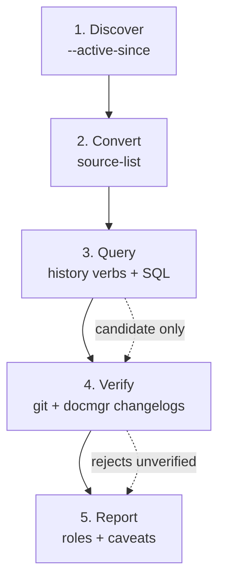

# Reconstructing a Day of Coding-Agent Work from Session Transcripts

This article documents the method used to produce a daily work report for 2026-07-19 from raw coding-agent session logs. The report had to answer one question: what work happened yesterday, across every repository, driven by every agent session that was active that day. The answer had to be grounded in evidence that a reader could verify, not assembled from memory or from a single transcript.

The toolchain is `go-minitrace`, a CLI that converts native session logs from Pi, Codex, and Claude Code into a normalized SQLite database and then queries that database with saved SQL and structured commands. The method has five stages: discover the candidate sessions, convert them into archives, query the normalized tables, verify the claims against external state, and report with explicit roles and caveats. Each stage has a specific failure mode, and the value of the method comes from treating each stage's output as a hypothesis that the next stage must confirm.

The reference investigation lives at `/home/manuel/code/wesen/claw-stuff/scripts/2026/07/20/daily-report-yesterday/`. The resulting daily report lives at `Logs/2026/07/20/Daily Report - 2026-07-19.md` in this vault.

> [!summary]
> - A daily report built only from transcript text is weak evidence. A daily report built from converted archives, cross-checked against git history and docmgr changelogs, is strong evidence.
> - `--active-since` finds sessions that recorded activity in a window, including sessions that started earlier. `--since` only finds sessions that started in the window and misses long-running ones.
> - The `history file-history` and `history ticket-timeline` verbs answer the two questions a daily report needs: which files changed, and which tickets moved.
> - Every transcript-derived claim about a commit must be verified against the repository. A command mention in a transcript is not a successful commit.

## Why this method exists

A coding-agent session transcript is a chronological record of turns and tool calls. On a busy day, five sessions across three repositories produce thousands of turns and tool calls. Reading those transcripts by hand to summarize the day is not tractable, and it produces a summary whose provenance is invisible: the reader cannot tell which claims came from a tool result and which came from the summarizer's inference.

The problem is worse than volume. A transcript contains text that *describes* work without *performing* it. An agent may run `git commit -m "..."` and fail. An agent may read a file that another session created. An agent may quote a commit hash from a previous turn. None of these constitute evidence that the work landed in the repository. A daily report that counts command mentions as completed work is wrong in a way that is hard to detect after the fact.

The method below separates candidate selection from proof. The transcript engine finds candidates. The repository and the ticket workspace prove what actually happened.

## The five-stage pipeline



Each stage produces a hypothesis. The next stage either confirms or rejects it. The arrows from stage 3 to 4 are dashed because query output is candidate evidence, not proof.

### Stage 1: Discovery

The first stage answers: which sessions were active during the target day? The target day is 2026-07-19. The discovery command scans native session stores and emits a JSON list of candidates. There are three stores to scan: Pi, Codex, and Claude Code. Missing any one of them produces an incomplete report.

```bash
go-minitrace discover pi \
  --source-dir ~/.pi/agent/sessions \
  --active-since 2026-07-19 \
  --output json > pi-discovery.json

go-minitrace discover codex \
  --source-dir ~/.codex \
  --active-since 2026-07-19 \
  --output json > codex-discovery.json

go-minitrace discover claude-code \
  --source-dir ~/.claude/projects \
  --active-since 2026-07-19 \
  --output json > claude-code-discovery.json
```

Each candidate record has this shape:

```json
{
  "cwd": "/home/manuel/code/wesen/claw-stuff",
  "format_hint": "jsonl-v3",
  "id": "019f7666-f46a-730b-b756-f52939577305",
  "last_activity_at": "2026-07-20T19:36:16.516Z",
  "source_path": "/home/manuel/.pi/agent/sessions/--home-manuel-code-wesen-claw-stuff--/2026-07-18T18-04-46-570Z_019f7666-f46a-730b-b756-f52939577305.jsonl",
  "started_at": "2026-07-18T18:04:46.570Z"
}
```

The critical field is `last_activity_at`. A session that started on 2026-07-18 and continued working through 2026-07-19 has a `started_at` outside the target window but a `last_activity_at` inside it. This is the difference between `--active-since` and `--since`.

`--since` is a start-time filter. It selects sessions whose `started_at` falls in the window. A long-running session that began on 2026-07-18 and did its most important work on 2026-07-19 would be invisible to `--since`. `--active-since` scans the candidate transcripts and emits `last_activity_at`, which recovers those spanning sessions. The cost is higher because the command streams native JSONL to find the last event timestamp. For a daily report, that cost is justified: spanning sessions are common, and missing them produces an incomplete report.

The discovery output for 2026-07-19 returned eight Pi candidates, two Codex candidates, and four Claude Code candidates. Two of the Pi candidates and one Claude Code candidate had `started_at` on 2026-07-20, which means they began today and were not part of yesterday's work. They were filtered out before conversion. The remaining candidates are the sessions whose activity overlapped the target day.

Claude Code sessions live under `~/.claude/projects`. The adapter prefers JSONL v2 transcripts and ignores subagent transcripts at the discovery layer. The candidate record shape is the same across all three frameworks, so the same filtering logic applies.

### Stage 2: Conversion

Discovery does not modify native files. It only reads them. Conversion copies the normalized representation into an investigation-specific output directory. The native stores are never touched.

```bash
mkdir -p scripts/2026/07/20/daily-report-yesterday/{archives,queries,results}

go-minitrace convert pi \
  --source-list ./pi-sessions.txt \
  --output-dir ./scripts/2026/07/20/daily-report-yesterday/archives/pi

go-minitrace convert codex \
  --source-session /path/to/session-a.jsonl \
  --source-session /path/to/session-b.jsonl \
  --output-dir ./scripts/2026/07/20/daily-report-yesterday/archives/codex

go-minitrace convert claude-code \
  --source-session /path/to/session-c.jsonl \
  --output-dir ./scripts/2026/07/20/daily-report-yesterday/archives/claude-code
```

The source list is a plain text file with one native path per line. Saving it as an artifact matters: the conversion is reproducible only if the input set is recorded. The investigation directory keeps the source list, the converted archives, the saved SQL, and the result JSON together so that a reader can rerun any step.

Conversion produces one `.minitrace.json` file per session. Each file conforms to the `minitrace-v0.2.0` schema. The top-level object is a session with `turns`, `tool_calls`, `annotations`, `metrics`, and an `operational_context` that records the working directory and git state. The conversion also assigns a quality tier: A for rich conversations with tool I/O, B for conversations without tool I/O, C for sessions with no conversation.

One failure mode appeared during this investigation. The first Codex conversion attempt passed a source list that, through a shell expansion mistake, included files from 2025. The conversion preflight rejected them with `missing native session ID` and exited with a non-zero status. The fix was to pass the two relevant sessions explicitly with repeatable `--source-session` flags. The lesson: construct the source list deliberately, and let preflight failures surface bad inputs rather than suppressing them.

A second failure mode is forgetting a framework entirely. The first version of this report discovered only Pi and Codex sessions, missing three Claude Code sessions that produced 60 commits in the go-go-wm repository. The report undercounted the day's work by roughly 25 percent. The fix is to always run discovery against all three stores: Pi, Codex, and Claude Code.

### Stage 3: Querying the normalized tables

The query engine builds a normalized SQLite database from the archive globs automatically. There is no separate import step. The main tables are `sessions`, `turns`, `tool_calls`, `files`, `annotations`, `metrics`, `events`, `attachments`, and `handovers`. A compatibility view called `sessions_base` exposes a flattened session summary.

Two query surfaces are relevant to a daily report: the built-in presets and the `history` command group.

#### The session-list preset

The `session-list` preset gives the first overview. It joins session metadata with computed turn and tool-call counts.

```bash
go-minitrace query run \
  --archive-glob './archives/*/active/*/*.minitrace.json' \
  --preset session-list
```

The output for 2026-07-19:

| id | framework | model | title | turns | tools |
|---|---|---|---|---|---|
| `019f7666` | pi | gpt-5.6-sol | Marketplace Tracker Unified CLI Refactor | 1,608 | 1,554 |
| `019f765e` | codex | gpt-5.6-terra | tiny-idp review / Goja identity microkernel | 799 | 2,892 |
| `019f77c2-c157` | pi | gpt-5.6-terra | Scraper Resumable Workflow Hardening | 2,101 | 2,147 |
| `019f7b67` | pi | umans-glm-5.2 | Fix code review issues & failing GitHub Actions | 422 | 443 |
| `f26d0273` | claude-code | claude-opus-4-8 | Implement PBUI window manager in Go with broker protocol | 2,939 | 1,649 |
| `3daab4ef` | claude-code | claude-opus-4-8 | Optimize go-go-golems documentation with minitrace analysis | 1,235 | 588 |
| `49ff363e` | claude-code | claude-fable-5 | Analyze publish-vault and create widget.dsl API design | 1,641 | 765 |
| `019f77c2-61ab` | pi | gpt-5.6-terra | Read RESEARCHCTL-015 ticket | 3 | 1 |

This table is the skeleton of the report. It tells the reader how many sessions were active, which frameworks and models drove them, and how large each was. It does not tell the reader what the sessions accomplished. That requires the history verbs.

#### The history verbs

The `history` command group contains three verbs. Two of them answer the questions a daily report needs.

`history file-history --path <fragment>` returns a per-file summary and a full timeline. For each file that matches the path fragment, it reports the first operation, the first and last seen timestamps, and counts of creates, modifies, reads, and other operations. The `sessions` array lists every session that touched the file.

```bash
go-minitrace query commands history file-history \
  --archive-glob './archives/*/active/*/*.minitrace.json' \
  --path 'go-go-golems/upwork' \
  --output json
```

A single record from that output:

```json
{
  "file_path": "code/wesen/go-go-golems/upwork/cmd/import-upwork/main.go",
  "first_op": "READ",
  "first_seen": "2026-07-18T19:21:33.296Z",
  "last_seen": "2026-07-18T23:35:44.938Z",
  "creates": 1,
  "modifies": 24,
  "reads": 4,
  "sessions": ["019f7666-f46a-730b-b756-f52939577305"]
}
```

This record says that `main.go` was modified 24 times in one session. It does not say what those modifications were, and it does not say whether they survived to a commit. It is candidate evidence that the file was the focus of implementation work.

`history ticket-timeline --ticket <fragment>` returns the creation events and the changelog, task, and diary touches for a docmgr ticket. This is the verb that connects transcript activity to the ticket workspace.

```bash
go-minitrace query commands history ticket-timeline \
  --archive-glob './archives/*/active/*/*.minitrace.json' \
  --ticket TINYIDP \
  --output json
```

The output groups events by category. The `changelog_edits` array is the most useful for a daily report because each entry carries a timestamp, a session ID, a turn index, and the command detail. Filtering those entries to the target day produces a chronological list of what the agent recorded as completed work.

#### The time-window limitation

The `file-history` verb does not accept `--since` or `--until` flags. It returns the full history of every matching file across the converted archives. This matters for spanning sessions. A session that started on 2026-07-19 and continued into 2026-07-20 produces file records whose `first_seen` and `last_seen` timestamps may fall on either day.

The daily report handles this by treating the file-history output as candidate evidence and then verifying against git. A file whose `first_seen` is 2026-07-20 may still have been modified on 2026-07-19; the git log is the arbiter. The report's caveats section records this limitation explicitly so that a reader does not mistake a 2026-07-20 timestamp for proof that no work happened on 2026-07-19.

### Stage 4: External verification

Query output identifies candidate turns and tool calls. It does not prove authorship. The fourth stage verifies the candidates against two external sources: repository git history and docmgr changelog files on disk.

#### Git verification

For each repository that a session touched, the git log is queried for commits in the target window.

```bash
git -C /home/manuel/code/wesen/go-go-golems/upwork log \
  --since="2026-07-19 00:00:00" \
  --until="2026-07-19 23:59:59" \
  --date=short --pretty='%h %ad %s'
```

The commit count is the strongest single number in the report. For 2026-07-19, the verified counts were:

| Repository | Commits on 2026-07-19 |
|---|---|
| `go-go-golems/upwork` | 43 |
| `prod-tiny-idp/tiny-idp` | 167 |
| `benchmark-cpu-inference/researchctl` | 47 |
| `go-go-wm` | 59 |
| `claw-stuff` | 43 |
| `publish-vault` | 1 |
| **Total** | **360** |

These numbers come from the repositories, not from the transcripts. An agent may have attempted a commit that failed, or may have described a commit it never made. The git log is immune to those failures. The report uses commit counts as the primary measure of work volume and uses the transcript-derived file and ticket timelines to explain what those commits accomplished.

#### Docmgr changelog verification

The `ticket-timeline` verb returns the command detail for each changelog edit, but the detail field is truncated by the cell character limit. The history verbs do not accept `--max-cell-chars`. To read the full changelog entry, the report reads the changelog file directly from the ticket workspace on disk.

```bash
grep -A 3 "^## 2026-07-19" \
  /home/manuel/workspaces/2026-07-07/prod-tiny-idp/tiny-idp/ttmp/2026/07/10/TINYIDP-GOJA-001--go-go-goja-identity-microkernel-scripting-layer/changelog.md
```

The changelog file is the agent's own record of completed steps, written contemporaneously. For the TINYIDP-GOJA-001 ticket, the changelog showed Steps 7 through 75 completed on 2026-07-19, each with a commit hash in the entry text. The commit hashes in the changelog were corroborated by the commit subjects in the git log. This cross-check is what elevates a step number from a claim to verified evidence.

### Stage 5: Reporting with roles and caveats

The final stage assembles the verified evidence into a report. The report structure follows the evidence hierarchy: strong evidence first, supporting evidence next, weak evidence excluded.

The report classifies each session by role where possible. A session that produced commits against the repository is an implementer. A session that read files and ran queries without writing is an investigator. A session that only read a single ticket is reference-only. For 2026-07-19, four of the five sessions were implementers and one was reference-only.

The caveats section is not optional. It records the limitations of the method so that a reader can calibrate their confidence. The caveats for this report included:

- Three sessions spanned the target day, so some file-history timestamps fall on 2026-07-20.
- The Codex adapter records `operation_type` as `OTHER` for exec and patch operations, and file paths often remain in `arguments_json` rather than the `file_path` column. The 167 tiny-idp commits were verified via git, not inferred from tool-call text.
- All commit counts are git-verified against the live repositories, not transcript text matches.

## The evidence hierarchy

The method rests on a distinction between strong and weak evidence. The report uses this hierarchy to decide what to claim and what to hedge.

**Strong evidence** proves that work landed in the repository. A commit hash verified by `git log` is strong evidence. A docmgr changelog entry with a commit hash that matches the git log is strong evidence. A test command that exited zero, recorded in the transcript and corroborated by a passing CI run, is strong evidence.

**Supporting evidence** shows that the agent was working on the task but does not by itself prove completion. A tool call that modified a file is supporting evidence. A user instruction requesting the implementation is supporting evidence. File reads and git status checks around the relevant operation are supporting evidence.

**Weak evidence** should never be used alone to attribute work. A cwd match is weak evidence because a session may work in a repository without changing it. A filename or title match is weak evidence because it may be quoted from another session. Keyword frequency is weak evidence. Quoted transcript content is weak evidence because it may describe another session's work.

The daily report's commit counts are strong evidence. Its file and ticket timelines are supporting evidence that explains the commits. No claim in the report rests on weak evidence alone.

## Common failure modes

### Counting command mentions as commits

The most common failure mode is treating a `git commit` command in the transcript as a successful commit. The transcript records the command and its exit code, but the exit code may reflect a pre-commit hook failure, a merge conflict, or a staged-but-not-committed state. The only reliable proof is the commit object in the repository. The report verifies every commit count against `git log` and never reports a command mention as a completed commit.

### Trusting the cwd as a content index

Discovery returns the cwd of each session. The cwd is a shortlist signal, not a content index. A session that starts from a workspace directory may later work in a subdirectory. A long-lived session may work in multiple repositories. A review session may use the target cwd without implementing anything. The report uses cwd to group sessions but does not infer implementation from cwd alone.

### Misreading spanning-session timestamps

A session that started on 2026-07-18 and ended on 2026-07-20 has file-history records on both days. A reader who filters by `first_seen` on 2026-07-19 may conclude that no work happened, when in fact the session was active all day. The report handles this by using `--active-since` for discovery and by verifying against git, which records the commit timestamp rather than the session start.

### Ignoring adapter limitations

The Codex adapter normalizes exec and patch operations into `operation_type = OTHER`. The `file_path` column may be empty, and the actual target may live in `arguments_json`. Claude Code subagent transcripts are ignored at the discovery layer, so work done in subagents is not visible unless the primary transcript records it. A query that filters on `operation_type IN ('MODIFY', 'NEW')` will miss Codex file operations. The report works around this by using the `files` table, which the adapter populates from `arguments_json`, and by verifying against git.

### Forgetting a framework

The most consequential failure mode in this investigation was discovering only Pi and Codex sessions, missing Claude Code entirely. Three Claude Code sessions were active on 2026-07-19, producing 60 commits in the go-go-wm repository and additional work in claw-stuff and publish-vault. The first version of the report undercounted the day's work by roughly 25 percent. The fix is to always run discovery against all three stores. A daily report that scans only one or two frameworks is incomplete by construction.

## Working rules

- Use `--active-since`, not `--since`, when the question is about recorded activity in a window. Spanning sessions are common, and `--since` misses them.
- Save the source list as an artifact. The conversion is reproducible only if the input set is recorded.
- Treat query output as candidate evidence. Verify every claim against git or the ticket workspace before reporting it.
- Never report a command mention as a successful commit. Verify the commit object in the repository.
- Record the caveats. A report without caveats invites a reader to over-trust transcript-derived claims.
- Keep the investigation self-contained. The source list, archives, SQL, and results belong in one dated directory so that a reader can rerun any step.

## Recommended implementation sequence

1. Establish the target day and the current wall-clock time. Convert the day to UTC if the sessions span timezones.
2. Run discovery with `--active-since` for Pi, Codex, and Claude Code stores. Save the JSON output for all three.
3. Filter the candidates to sessions whose activity overlaps the target day. Construct a source list.
4. Convert the source list into an investigation-specific archive directory. Save the conversion manifest.
5. Run the `session-list` preset to get the overview. Identify the repositories and tickets involved.
6. Run `history file-history` for each repository path fragment. Save the JSON output.
7. Run `history ticket-timeline` for each ticket fragment. Filter the changelog edits to the target day.
8. Verify commit counts against `git log` for each repository. Read the full changelog entries from disk where the verb truncated them.
9. Assemble the report. Lead with verified commit counts. Use file and ticket timelines as supporting evidence. Classify sessions by role.
10. Write the caveats section. Record every limitation that affected the investigation.

## Related notes

- The daily report produced by this method: `Logs/2026/07/20/Daily Report - 2026-07-19.md`
- The go-minitrace skill: `~/.pi/agent/skills/go-minitrace-transcript-analysis/SKILL.md`
- The investigation artifacts: `/home/manuel/code/wesen/claw-stuff/scripts/2026/07/20/daily-report-yesterday/`
