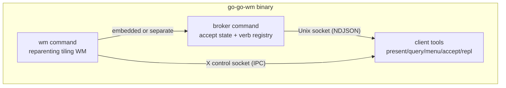
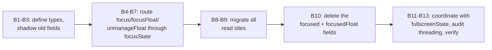

# go-go-wm: A PBUI Window Manager in Go

`go-go-wm` is a reparenting tiling window manager for X11, written in Go, that ports the CLIM / Genera "Dynamic Windows" interaction model onto a real display server. Every visible object in the desktop is a typed presentation, commands read values through an accept protocol, and right-clicking any object pops a type-directed action menu. The window manager itself — tiles, workspaces, frames — is made of the same presentation primitives as the applications running inside it. A Goja-based JavaScript runtime drives the whole system, so an `rc.js` file can own the keyboard, define layouts, and register commands.

This report is a technical deep dive into the architecture and into a specific body of refactoring work: the encapsulation of focus and fullscreen state. That work is interesting because it shows how a class of bugs that recurred across four automated review batches was not a list of independent nits but a single missing abstraction, and how fixing it structurally changed the data model rather than patching call sites.

> [!summary]
> The project has three identities worth keeping separate:
> 1. a real X11 tiling WM with a binary split tree, floating/fullscreen layers, and a paper-and-ink software renderer
> 2. a CLIM-style presentation/accept layer (PBUI) running over a Unix-socket broker, with a Goja JS runtime on top
> 3. a case study in encapsulating scattered state — the focus and fullscreen invariants were promoted from conventions re-derived at every call site into two owning types

## Why this project exists

The starting point was a React prototype (`pbui-shell.jsx`, ~868 lines) that demonstrated the full interaction model in a browser, where it is easy because every app shares one address space. The task was to make it real on X11, where the window manager half maps onto a reparenting WM but the presentation half becomes an IPC protocol design problem: X11 deliberately knows nothing about the objects inside client windows.

The architecture is layered so that the two most-iterated subsystems — the layout tree and the accept protocol — are pure Go with zero X11 dependency and test with no display. A JS engine (Goja, wrapped by `go-go-goja`) can later drive every part of it because all mutations flow through a serializable operations/event bus, and all verbs live in a data-driven registry rather than in switch statements.

## Project shape

The repository is a single Go module (`github.com/go-go-golems/go-go-wm`) that builds one binary, `go-go-wm`, which can act as three different processes: the window manager (`go-go-wm wm`), the PBUI broker (`go-go-wm broker`, also embeddable in the WM process), and client tooling (`present`, `query`, `menu`, `accept`, `repl`, `run`, `scrape`, plus a kitty integration kitten).

```
pkg/
├── wmcore/      pure layout engine: binary split tree, no X11
├── wmx11/       X11 binding: reparenting, frames, focus, fullscreen, launcher
├── pbui/        NDJSON wire protocol + Object/Verb types
│   ├── broker/  the daemon: accept state machine, verb registry, event bus
│   ├── client/  Go client library
│   └── scrape/  parse OSC 8 presentation links out of terminal output
├── apps/        the presentation-surface abstraction (Region, Spec, builtin tiles)
│   ├── xapp/    client-side shell for standalone PBUI apps
│   ├── uispec/  declarative UI IR (rows/segments) rendered to image.RGBA
│   └── demoapps/ built-in demo apps (colors, files, notes, todo, markdown)
├── jsmod/       the Goja JS runtime bridge: event fan, modules (wm/ui/pbui)
├── repl/        rich-value core of the notebook REPL
├── launcher/    app launcher: .desktop parsing, frecency, match, registry
├── draw/        software renderer: theme, widgets, plots, X image blit
├── xshm/        MIT-SHM shared-pixmap fast frame upload
├── xgojaprovider/  packages the wm/ui/pbui modules for xgoja-generated binaries
└── cmds/        the glazed command implementations
```

Two design invariants run through this layout. First, the layout tree is pure: `pkg/wmcore` imports nothing X-flavored — leaf IDs and rectangles in, rectangles out. Second, all mutations flow through a serializable operations bus, which is what lets the JS runtime drive the WM from any process.

## Architecture

### One binary, three roles

`go-go-wm` is a single Cobra/glazed CLI that can act as the WM, the broker, or a client tool. The broker can run embedded inside the WM process (`--embedded-broker`), but it is still spoken to over its Unix socket — the WM is just its most privileged client. This is design decision D2 from the original ticket: the broker never links X11, so it is display-server-agnostic.



### The PBUI wire protocol

The broker speaks NDJSON (one JSON object per line, max 1 MiB per frame) over a Unix socket. The frame type is discriminated by the `T` field.

```go
// pkg/pbui/wire.go
type Msg struct {
    T   string `json:"t"`           // hello, register, accept.*, verb.*, menu.*, event, ...
    Seq uint64 `json:"seq,omitempty"` // client request id, echoed in replies
    Verbs []Verb `json:"verbs,omitempty"`
    Object *Object `json:"object,omitempty"`
    Event  string `json:"event,omitempty"`
    Data   json.RawMessage `json:"data,omitempty"`
    // ... more optional fields
}
```

A presentation is a typed object: a pair `(ptype, value)`. A verb is a type-directed action: `{ID, Label, Ptypes}`. The broker owns the accept state machine (one pending accept at a time) and the verb registry; clients register verbs and answer accepts. The lifecycle of a connection is hello → register verbs → accept.begin/answer/result cycles → event broadcasts.

### The layout tree

The WM tiles windows using a binary split tree. Each node is either a leaf (one application slot) or a split (a direction, a ratio, two children). Layout is a pure function: given a root rectangle and a tree, produce a list of `(leafID, rect)` pairs. Sticky divider zones (¼ ⅓ ½ ⅔ ¾) snap the ratio. Workspaces are multiple roots.

```go
// pkg/wmcore/tree.go
type Node struct {
    ID   NodeID `json:"id"`
    Kind Kind   `json:"kind"`     // Leaf | Split
    App  string `json:"app,omitempty"`     // leaf application slot
    Dir  Dir    `json:"dir,omitempty"`     // Row | Col (split only)
    Ratio float64 `json:"ratio,omitempty"` // 0.1..0.9 (split only)
    A, B *Node  `json:"a,omitempty,omitempty"`
}
```

### The Goja JS runtime

The JS engine is Goja, wrapped by `go-go-goja`, which provides a runtime factory, an owner-loop execution model, and a module system. `pkg/jsmod` bridges three native modules into JS: `wm` (tree/focus/theme/rules/exec over IPC), `ui` (JS-defined presentation surfaces), and `pbui` (on/emit/accept/verbs). The EventFan is the single broker subscription of a script process: one read goroutine feeds a bounded queue, which one drainer goroutine fans out to Go handlers (inline) and JS handlers (posted to the owner loop).

## Implementation details: the focus and fullscreen refactor

The rest of this report focuses on one subsystem: the focus and fullscreen state in `pkg/wmx11`. This is where four batches of automated review comments concentrated, and where the structural fix is most instructive.

### The problem: a coupled state trio with no owner

The WM tracks "what has keyboard focus" across three independent struct fields, mutated by seven files, with no single owner for the invariant:

```go
// pkg/wmx11/wm.go (before the refactor)
type WM struct {
    focused      wmcore.NodeID            // the tiled leaf with focus
    focusedFloat  xproto.Window            // 0 = tiled world holds focus
    fullscreen    *frame                   // the one fullscreen window, nil = none
    // ...
}
```

The intended invariant is that exactly one of three things holds the keyboard: a tiled leaf, a floating frame, or a fullscreen frame. But nothing enforces this. Each field is mutated independently, and the "exactly one" rule is re-derived at every read site. The only place that stated the rule correctly was a predicate called `frameFocused`:

```go
// pkg/wmx11/float.go (before)
func (w *WM) frameFocused(f *frame) bool {
    if f.floating {
        return w.focusedFloat == f.client
    }
    return w.focused == f.leaf && w.focusedFloat == 0
}
```

This predicate was the seed of the correct design. The refactor promoted it from a read-only check into the data model itself.

### The five bugs, mapped to one root cause

Five of the sixteen review comments across the first three batches were all symptoms of the same missing abstraction. Each was a code path that re-derived what "fullscreen owns" means and got one branch wrong.

| Comment | File | Invariant violated | What happened |
|---|---|---|---|
| RC-5 | `manage.go` | Fullscreen owns focus | `focus()` moved X input to a hidden tiled client under the fullscreen frame |
| RC-6 | `wm.go` | Switch exits fullscreen | `ApplyBatch` didn't call `exitFullscreen` (only `afterOp` did) |
| RC-7 | `manage.go` | Float fullscreen has empty leaf | Pinning `leaf = w.fullscreen.leaf` set it to `""`, then cleared `focusedFloat` |
| RC-12 | `manage.go` | Fullscreen owns geometry | `handleConfigureRequest` honored a float's resize while fullscreen |
| RC-13 | `manage.go` | Preserve tiled leaf under float | `focus()` cleared `w.focused` when pinning a fullscreen float |

RC-7 and RC-13 were even on the same function (`focus`), fixed in two separate batches, because the function kept growing special cases. The pattern is clear: each bug is a new code path re-deriving the fullscreen invariant and getting one branch wrong.

### The design: two owning types

The fix introduced two types that own the invariants. The first, `fullscreenState`, owns the "one window covers the screen" invariant — both its reads and its writes. The second, `focusState`, owns the "exactly one of {tile, float, fullscreen} holds keyboard focus" invariant as a single enum value.

```go
// pkg/wmx11/focus_state.go
type fullscreenState struct {
    wm *WM
}

// reads
func (fs fullscreenState) Active() *frame
func (fs fullscreenState) Owns(f *frame) bool
func (fs fullscreenState) OwnsGeometry() bool
func (fs fullscreenState) FocusTarget() *frame

// writes
func (fs *fullscreenState) Toggle() (bool, error)
func (fs *fullscreenState) Enter(f *frame)
func (fs *fullscreenState) Exit()
func (fs *fullscreenState) Clear(f *frame)
```

The `fullscreenState` type is the single place that reads and writes `w.fullscreen`. Call sites stop poking the field directly, so they cannot re-derive the fullscreen-owns-geometry/focus invariant wrong. The WM methods (`toggleFullscreen`, `exitFullscreen`, `clearFullscreenFor`) become thin one-line delegates that preserve the idiomatic `w.toggleFullscreen()` spelling.

The `focusState` type replaces the coupled trio with a single value:

```go
// pkg/wmx11/focus_state.go
type focusState struct {
    wm            *WM
    target        focusTarget
    preservedTile wmcore.NodeID  // restored when a float/fullscreen closes
}

type focusTarget struct {
    kind   focusKind        // None | Tile | Float | Fullscreen
    leaf   wmcore.NodeID    // set for Tile, or the tile under a float
    client xproto.Window    // set for Float / Fullscreen-float
}
```

The key win is that the "exactly one" invariant becomes a single enum value, not three coordinated fields. A new call site cannot accidentally clear the wrong field — there is only one field. The `preservedTile` field makes the focus-restoration contract explicit. RC-13's bug was that this contract was implicit (the convention that `w.focused` stays set when a float takes focus) and `focus()` violated it; making it a named field means the mutator is responsible for maintaining it.

### The migration: shadow, migrate, delete

The refactor was done in a behavior-preserving sequence so the WM stayed green at every commit. The ordering matters: shadow the old fields first, migrate all read sites, then delete the old fields last.



During the shadow phase, every mutator updated both the new `target` and the old `focused`/`focusedFloat` so the two never disagreed, and `Current()` read from the old fields (the source of truth). After all read sites were migrated to `FocusedLeaf()`/`FocusedFloat()`, the old fields were deleted and `Current()` switched to reading from `target` directly.

### The threading model: why no mutex

A natural question is whether `focusState` needs a mutex. It does not. The WM is single-threaded for focus mutations. The `Run()` method is the single WM loop; it selects between X-event handlers (delivered via `xevent.MainPing`, which run inline on the loop goroutine) and posted functions (drained from the `w.ops` channel, also inline on the loop goroutine). Broker and IPC paths that spawn goroutines post back to the loop via `w.Post` rather than touching `focusState` directly.

```go
// pkg/wmx11/wm.go
func (w *WM) Run(ctx context.Context) error {
    // ... setup ...
    pingBefore, pingAfter, pingQuit := xevent.MainPing(w.X)
    for {
        select {
        case <-pingBefore:
            <-pingAfter
        case fn := <-w.ops:
            fn()
        case <-ctx.Done():
            xevent.Quit(w.X)
            return nil
        }
    }
}
```

Because all focus mutations happen on this one goroutine, `focusState` is lock-free. Adding a mutex would be dead weight.

## Implementation details: the immutable palette

A second structural fix addressed a data race in the theming system. The `draw` package exposed the live palette as fourteen package-level mutable variables, read lock-free by eighteen files. `SetTheme` rewrote all of them. The race was concrete: in `run`/`repl --ui` scripts, a `theme.changed` event on the event-fan drainer goroutine called `SetTheme` while `uispec.Render` on a separate X app loop read the same variables — assembling a frame from mixed old and new colors.

The fix made the palette immutable. A `Palette` struct holds the complete color set, stored behind an `atomic.Pointer[Palette]`. `SetTheme` publishes a whole `Palette` atomically; renderers call `draw.Current()` once per paint pass and read colors off the returned struct.

```go
// pkg/draw/theme.go
type Palette struct {
    Theme
    AppColors []color.RGBA
}

var livePalette atomic.Pointer[Palette]

func Current() Palette { return *livePalette.Load() }

func SetTheme(name string) error {
    // ...
    livePalette.Store(initialPalette(name))
    return nil
}
```

A paint pass that captured `Current()` at its start never sees a half-applied theme. This is the only fix that scales to 136 read sites across eighteen files: per-variable locking would have required changing every reader, while an atomic whole-palette swap required only changing the writer and adding one `Current()` call per render function.

## Current project status

The repository is in an active prototyping phase. PR #1 ("Feat: Introduce JavaScript scripting, application launcher, and REPL") is the major feature release: 216 changed files, +28,591 lines, adding the Goja runtime, the launcher, the REPL, floating/fullscreen support, theming, and MIT-SHM rendering. All CI checks pass (lint, govulncheck, gosec, dependency review, tests, CodeQL, secret scanning). The PR is mergeable.

Four batches of automated Codex review produced 21 inline comments. Twenty were addressed; one regression from the refactor was fixed with a test; four remaining items are accepted as documented prototype limitations and tracked in GitHub issue #2.

## Important project docs

The detailed analysis and design work lives in two docmgr tickets in the repository:

- `ttmp/2026/07/19/GGWM-010-PR1-REVIEW/` — the PR review analysis: a system primer, topic-separated analysis of every failing CI check and review comment, and a phased implementation plan
- `ttmp/2026/07/20/GGWM-011-FOCUS-FS/` — the focus/fullscreen encapsulation design: the pattern diagnosis, two design options with pseudocode, and the phased migration

The GGWM-011 design doc is the source for the refactor described in this report.

## Open questions

- Should the WM test harness move beyond pure-logic decision tests to Xvfb-based smoke tests for the full keypress path? The current tests cover the decision logic but not the X wiring.
- The `xgojaprovider` shares one `runtimeState` per provider registration, not per runtime. A host building multiple runtimes from one registry would cross-dispatch on the wrong Goja loop. Not exercised by the prototype; tracked in issue #2.
- A timed-out `wm.apply()` leaves the closure in `w.ops` and runs it later, potentially duplicating layout. Edge case; tracked in issue #2.

## Near-term next steps

- Merge PR #1 once the review is settled.
- Add Xvfb-based smoke tests for the focus/fullscreen keypress paths.
- Pick up the four deferred items in GitHub issue #2 if the prototype moves toward production.

## Project working rule

> [!important]
> The layout tree is pure Go with no X11 dependency. Any new WM state that touches focus, fullscreen, or geometry should be owned by a single type with intent-revealing methods, not poked as raw fields from multiple call sites. The recurring review bugs were all symptoms of one missing abstraction.
