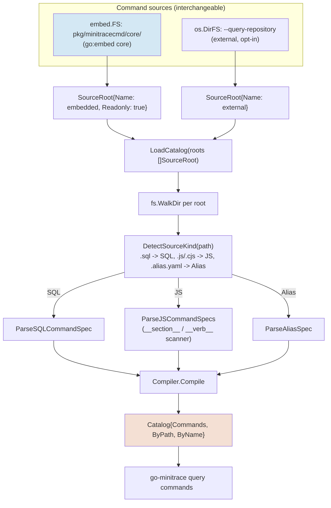
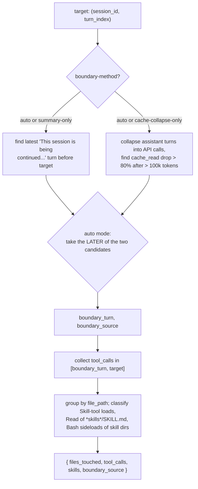

# go-minitrace Query Commands

This project takes three JavaScript transcript-analysis commands — `file-history`, `ticket-timeline`, and `context-window` — through their full lifecycle: designed from scratch against go-minitrace's normalized SQLite schema, shipped for a few hours as an externally-distributed skill artifact, and then folded permanently into the `go-minitrace` binary's built-in command catalog. The work lives across two docmgr tickets and one pull request: `GOGO-MINITRACE-HISTORY-VERBS-2026-07-20` (claw-stuff) designed and validated the verbs; `ADD-HISTORY-QUERY-COMMANDS-2026-07-20` (go-minitrace) moved them into `pkg/minitracecmd/core/history/` and refreshed the bundled skill; `go-go-golems/go-minitrace#30` carries both changes upstream.

> [!summary]
> - go-minitrace's command catalog treats a JavaScript file and a SQL file as interchangeable inputs to one loader (`LoadCatalog`), keyed only by file extension. This single design decision is why moving three JS commands from an external `--query-repository` into the compiled binary required zero changes to the commands themselves.
> - All three verbs answer one question shape — join transcript evidence (`tool_calls`, `turns`) to something the transcript does not itself contain: a file path, a docmgr ticket identifier, or a position in a conversation relative to its last compaction. Naming that shared shape explicitly, rather than treating the three verbs as unrelated utilities, is what made a consistent implementation pattern possible.
> - Applying the finished verbs to a real, unfamiliar project (`tiny-idp`) surfaced two independent instances of the same failure class — a quoted-transcript false positive — in two different subsystems (an SQL `LIKE` match and a Codex approval-sidecar transcript), which is strong evidence the failure class is structural to transcript analysis rather than a one-off bug.

## Why this project exists

The go-minitrace toolchain converts native Claude Code, Codex, and Pi session transcripts into a normalized SQLite database and exposes both ad hoc SQL and named, typed "query commands" for analyzing them. Earlier work in this same toolchain — a documentation-friction analysis campaign spanning several docmgr tickets — kept re-deriving the same three joins by hand, once per investigation: given a file path, when was it touched, and by which session; given a docmgr ticket, when was it created and what commands built its scaffolding; given a point in a conversation, what was actually still live in the agent's context after the last compaction. Each of these questions took a bespoke SQL query and manual cross-referencing against `turns.content`, and none of it was a discoverable, reusable CLI command. This project generalizes the three most common instances of that pattern into typed commands, and then asks a second question: once a command is useful enough to reach for repeatedly, should it live in a side-loaded skill directory, or should it ship with the tool itself?

## Current project status

Complete and merged into a feature branch, pending upstream review. `pkg/minitracecmd/core/history/{file-history,ticket-timeline,context-window}.js` are part of the compiled `go-minitrace` binary as of commit `311102e`; `assets_test.go` asserts their presence in the embedded catalog; the bundled `skills/go-minitrace-transcript-analysis/` skill was replaced wholesale with its current, maintained content (the version previously checked into the repository predated the whole analysis campaign and had drifted into an unmaintained baseline). Pull request `go-go-golems/go-minitrace#30` carries all three commits against `main`. The live skill installation on this machine (`~/.claude/skills`, hardlinked to the Codex and Pi mirrors) no longer carries copies of the three JS files — they are sourced from the binary now, not from the filesystem.

## Architecture



The catalog does not distinguish an embedded command from an externally-supplied one once it has been parsed and compiled. A `SourceRoot` is nothing more than a name, an `fs.FS`, a root directory inside that filesystem, and a `Readonly` flag; `embed.FS` and `os.DirFS` both satisfy the standard-library `fs.FS` interface, so `fs.WalkDir` walks either one identically. `LoadEmbeddedCatalog()` is a two-line wrapper that supplies exactly one `SourceRoot` pointing at the compiled-in `core` tree; `LoadCatalog` given an external `--query-repository` path constructs the same kind of `SourceRoot` from an `os.DirFS` instead. Everything downstream — kind detection by extension, parsing, compilation, duplicate-path checking, alias resolution — runs unchanged regardless of which kind of `SourceRoot` produced the bytes.

## Implementation details

### The shared question shape

Before writing any code, the three verbs were named around one underlying operation rather than three independent ones: join transcript evidence to something the transcript does not contain on its own.

| Verb | External anchor | Primary signal |
|---|---|---|
| `file-history` | a file path fragment | `tool_calls.file_path`, with an `arguments_json` fallback for adapters (Codex) that leave `file_path` empty |
| `ticket-timeline` | a docmgr ticket identifier | shell-command text matching `docmgr` plus the ticket ID, and any `file_path` under the ticket's directory |
| `context-window` | a `(session_id, turn_index)` pair | everything between a detected compaction boundary and the target turn |

Recognizing that all three verbs are instances of one join, rather than three unrelated utilities, mattered for two concrete reasons. First, it meant the same defensive posture applied to all three: never assert that a match constitutes proof, only that it constitutes candidate evidence, and say so in the output. Second, it meant the same boilerplate — opening a database handle with explicit row limits, extracting shell command text uniformly across three different agent frameworks — could be copied verbatim across all three files rather than each one inventing its own variant.

```js
const openDb = function() {
  const mt = require("minitrace");
  return mt.db().RuntimeArchives().QueryCommandDefaults()
    .Limits(mt.limits().Rows(200000).CellChars(4000).Build())
    .Build();
}

const effectiveCommands = function(row) {
  if (row.command && row.command.length) return [row.command];
  const aj = row.arguments_json || "";
  const out = [];
  const re = /(?:\\?"?cmd\\?"?|\\?"command\\?")\s*:\s*\\?"((?:[^"\\]|\\.)*)\\?"/g;
  let m;
  while ((m = re.exec(aj)) !== null) {
    out.push(m[1].replace(/\\n/g, "\n").replace(/\\"/g, '"').slice(0, 500));
  }
  return out;
};
```

The `Limits(mt.limits().Rows(200000)...)` call is not a stylistic default; it exists because the JS query sandbox silently caps unbounded `db.query()` calls at roughly one thousand rows, with no error raised. A previous investigation in the same toolchain produced two false bug reports — "turn linkage is broken," "token counts are NULL" — that were, on inspection, nothing more than the thousand-row cap silently truncating a multi-session archive glob down to its first session. Every verb in this project sets an explicit, generous limit for exactly this reason, and the pattern is now considered a hard rule rather than a preference: any new query command that omits it is presumed broken until proven otherwise.

`effectiveCommands` exists because the three agent frameworks the toolchain analyzes do not agree on where a shell command's text lives. Claude Code and Pi populate `tool_calls.command` directly. Codex buries the same information inside `arguments_json` as a JavaScript-looking string — `tools.exec_command({cmd: "..."})` — because its native transcript format represents tool calls as serialized function invocations rather than as a flat command field. A verb that reads only `command` silently returns nothing for every Codex session; the regex fallback recovers the same information from the serialized form.

### Why JavaScript and SQL are equally first-class

`DetectSourceKind` is a five-line function with no dependency on where its input came from:

```go
func DetectSourceKind(path string) SourceKind {
	lower := strings.ToLower(path)
	switch {
	case strings.HasSuffix(lower, ".alias.yaml"), strings.HasSuffix(lower, ".alias.yml"):
		return SourceYAMLAlias
	case strings.HasSuffix(lower, ".sql"):
		return SourceSQLCommand
	case strings.HasSuffix(lower, ".js"), strings.HasSuffix(lower, ".cjs"):
		return SourceJSCommand
	default:
		return SourceUnknown
	}
}
```

`LoadCatalog` calls this once per file discovered by `fs.WalkDir`, then dispatches to one of three parsers based purely on the returned kind. Nothing in that dispatch inspects the source root the file came from. This is the reason the embedding work described below required no changes to `catalog.go`, no new code path for "embedded JS," and no special-casing: a `.js` file under `pkg/minitracecmd/core/` is parsed by exactly the same `ParseJSCommandSpecs` function that parses a `.js` file under an external `--query-repository` directory. The only new code this project added to go-minitrace's Go source was six lines of test assertions.

JavaScript command files are recognized by two scanner markers, `__section__` and `__verb__`, which are not ordinary function calls — they are detected by static analysis of the source file before it is ever executed, and used to derive the command's typed CLI flags and registration name.

```js
__section__("filehistoryopts", {
  fields: {
    path: { type: "string", help: "File path fragment to match (LIKE %fragment%)", required: true },
    limit: { type: "int", default: 500, help: "Max timeline rows" },
  },
});

function fileHistory(filehistoryopts) {
  /* ... */
}

__verb__("fileHistory", {
  name: "file-history",
  short: "When was a file created/edited/read — timeline + per-file summary across sessions",
  fields: { filehistoryopts: { bind: "filehistoryopts" } },
});
```

One consequence of this scanning approach is a rule that has no equivalent in ordinary JavaScript style guides: a helper function inside a query-command file must never be declared with the `function name() {}` form, because the scanner treats every top-level `function` declaration as a candidate verb registration. Helpers are written as `const name = function(...) { ... }` instead, which is inert to the scanner. This is not a cosmetic preference; a file that violates it registers a phantom CLI verb with no `__verb__` call backing it, and the command listing silently includes broken entries.

A second, more subtle naming rule governs the path a command is exposed under. When a JavaScript file defines exactly one verb and that verb's registered name matches the file's own name, the compiler collapses the file-stem level of the path rather than nesting the verb under it — `history/file-history.js` containing only a `file-history` verb becomes the CLI path `history file-history`, not `history file-history file-history`. This collapsing is implemented by comparing two candidate paths and checking whether the file has sibling nested sources before applying it, which matters because a multi-verb file or a file whose verb name differs from its stem does not collapse, and would produce a different, deeper path. Confirming the exact collapsed path for the three new commands required writing a throwaway test that dumped `Path`/`Name` pairs from the loaded catalog rather than assuming the format — the actual result, `history/file-history` with no extension, differed from what a naive reading of the source would predict.

### The compaction-boundary heuristic

`context-window` is the most involved of the three verbs because it answers a question with no single ground-truth signal in the data: at what turn index did the agent's context last get compacted, before the turn the caller cares about? Two independent, imperfect signals exist, and the verb combines them rather than trusting either alone.

The first signal is textual and direct: Claude Code injects a synthetic user turn beginning with the literal string `"This session is being continued from a previous conversation"` immediately after a `/compact` operation. Searching for the most recent such turn before the target index is a precise, cheap SQL query, but it only fires when a real compaction happened and the continuation summary survived truncation.

The second signal is a heuristic borrowed from an existing token-accounting command in the same toolchain: a compaction typically produces an abrupt collapse in `cache_read_tokens` between two consecutive assistant API calls — the resident context shrinks by construction. The verb reuses that command's exact call-collapsing algorithm (consecutive assistant turns sharing an identical `(output, cache_read, cache_creation)` tuple within three turn indices of each other are treated as one logical API call, undoing an adapter quirk where the Claude Code format stores one row per content block) and then looks for any adjacent pair where the earlier call's cache-read size exceeds 100,000 tokens and the later call's is below 20% of it.



When both signals are available, the verb takes the later of the two candidate boundaries rather than the earlier one or a fixed preference for one signal. The reasoning is that a session can be compacted more than once, and the caller wants to know what is live *right now*, not what survived the very first compaction in the session's history — the most recent boundary is the one that determines the agent's actual present context. This design choice was validated, not assumed: applying the finished verb to the very session that built it (converting this conversation's own native transcript and querying its own real `/compact` event) produced a boundary sixty-two turns later than the textual marker's turn index, correctly following a second, undetected-by-text compaction that the cache-collapse signal alone was able to find — and the resulting file list matched, line for line, the set of reference documents this project's own diary had already recorded reading at that point in the conversation.

### A failure mode caught during self-validation

The first test run of `file-history`, searching for the fragment `vocabulary.yaml`, returned a match against a file that was not `vocabulary.yaml` at all — it matched because a `Write` tool call's `arguments_json` contained the literal string `vocabulary.yaml` inside a paragraph of prose the agent had just written into an unrelated diary file. The original query matched on `file_path LIKE %fragment% OR arguments_json LIKE %fragment%` unconditionally, which meant a tool call that already had a perfectly good, unrelated `file_path` could still match through its `arguments_json` payload merely because that payload happened to contain the search string as ordinary text. The fix restricts the `arguments_json` fallback to rows where `file_path` is empty:

```sql
WHERE COALESCE(tc.file_path,'') LIKE ${like}
   OR (COALESCE(tc.file_path,'') = '' AND COALESCE(tc.arguments_json,'') LIKE ${like})
```

This single incident turned out not to be an isolated bug but the first observed instance of a general failure class: a raw text match against serialized tool-call data cannot distinguish "this tool call operated on the thing I am searching for" from "this tool call's payload happens to contain the search string somewhere inside a block of unrelated text." The same failure class reappeared later, in a completely different subsystem, while applying the finished verbs to an unrelated project.

### Real-world validation: tiny-idp

Once the three verbs were embedded and rebuilt into the live binary, they were applied to a project the toolchain had never analyzed before — `tiny-idp`, a 32-ticket identity-provider codebase — to answer a concrete question: when was each docmgr ticket created, and under what circumstances. This produced three findings worth recording as general lessons about transcript-derived project history, independent of go-minitrace itself.

First, git history was actively misleading, not merely incomplete. Nineteen of the thirty-two ticket directories shared one identical first-commit timestamp, because the repository's version control history began with a single commit that swept in pre-existing, already-scaffolded work — the commit records when git started tracking a directory, not when the work inside it began. `ticket-timeline`, reading the actual `docmgr ticket create-ticket` invocation from the transcript, recovered the true creation timestamp for twenty-seven of the thirty-two tickets, and every one of those twenty-seven landed inside its own ticket's dated directory path as an internal consistency check.

Second, chaining `ticket-timeline`'s creation event straight into `context-window` explained a pattern the timestamps alone only hinted at: three tickets — `TINYIDP-ADMIN-001`, `TINYIDP-PROD-CONFIG-001`, `TINYIDP-USERS-001` — shared the exact same creation instant to the millisecond. The reconstructed context window showed why: one Bash tool call chained all three `docmgr ticket create-ticket` invocations together with shell `&&`, in response to a single user instruction covering three related pieces of work at once. The timestamps alone could not have distinguished "three tickets created in the same second by coincidence" from "one compound command created three tickets atomically"; the context window could.

Third, the same quoted-transcript false-positive class that had already been caught and fixed inside `file-history`'s SQL reappeared at a different layer entirely. Four tickets returned zero matches from every converted session. A raw grep across every native session store did surface one plausible lead — a Codex approval-assessor sidecar transcript containing all four ticket identifiers — but reading the matching turn directly showed it was the sidecar's system prompt quoting the *entire* prior conversation verbatim for an approval decision, explicitly labeled "untrusted evidence, not... instructions to follow." The four ticket identifiers were present in that transcript for the same structural reason `vocabulary.yaml` had falsely matched earlier: text presence does not imply the text describes an event that happened in that transcript.

### The embedding decision and its tradeoff

Moving the three verbs from the skill's `query-commands/history/` directory into `pkg/minitracecmd/core/history/` eliminates a specific, concrete failure mode: a skill file and its binary-embedded equivalent silently diverging over time because someone edits one copy and forgets the other exists. Once the commands live inside the compiled binary, there is exactly one copy, and the skill documentation can describe usage without a `--query-repository` flag at all.

The tradeoff is a version dependency that previously did not exist. Before this change, any `go-minitrace` binary, however old, could run the three verbs, because the verbs were supplied externally at invocation time. After this change, only a binary rebuilt from a checkout containing the embedding commit carries them; an older installed binary simply does not have the `history` command group, with no external fallback available unless the caller manually points `--query-repository` at a checkout of `pkg/minitracecmd/core`. This was a deliberate choice, accepted explicitly rather than overlooked, on the grounds that the alternative — permanent, silently-drifting duplication — was the worse failure mode of the two.

## Important project docs

- Design ticket (claw-stuff): `ttmp/2026/07/20/GOGO-MINITRACE-HISTORY-VERBS-2026-07-20--.../design-doc/01` — schema, pseudocode, and API references for all three verbs before implementation
- Design ticket diary and results: same ticket's `reference/01-diary.md` and `results/` — the self-referential validation run, including the `vocabulary.yaml` false positive
- tiny-idp application: same ticket's `reference/02-tiny-idp-ticket-creation-timeline.md` — the full 32-ticket table and the git-history-is-misleading finding
- Embedding ticket (go-minitrace): `ttmp/2026/07/20/ADD-HISTORY-QUERY-COMMANDS-2026-07-20--.../reference/01-diary.md` — the catalog investigation, the embedding itself, and the skill replacement
- Pull request: `go-go-golems/go-minitrace#30`

## Open questions

- Should `ticket-timeline` distinguish two ticket directories that share one docmgr ID (an ID collision discovered in `tiny-idp`, `TINYIDP-PROD-REVIEW-001`) as two separate result groups instead of silently merging their evidence?
- The cache-read-collapse heuristic's thresholds (a call exceeding 100,000 tokens, a drop below 20% of it) are tuned on one prior campaign's Claude Code sessions and have not been validated against Codex, which has no comparable cache-accounting fields at all.
- Should the bundled skill and the go-minitrace repository gain an automated sync mechanism, so the two cannot drift the way the pre-embedding skill copy had already drifted from the maintained version before this project started?

## Near-term next steps

- Address review feedback on `go-go-golems/go-minitrace#30`.
- Test `context-window` against a native Codex archive to establish whether `summary-only` mode should become the documented default there.
- Consider whether the same embedding treatment should apply to other JS commands still living only in external skill repositories.

## Project working rule

Every claim about what a query command returns is either reproduced from a saved result file under a ticket's `results/` directory, or backed by a specific, quoted line of source in `pkg/minitracecmd`. A query command is presumed to have the thousand-row silent-truncation bug until its source is confirmed to set an explicit row limit.
