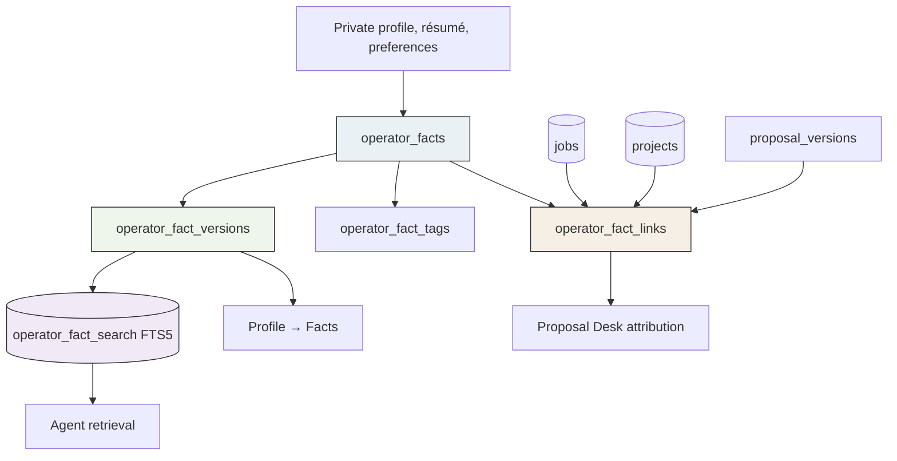
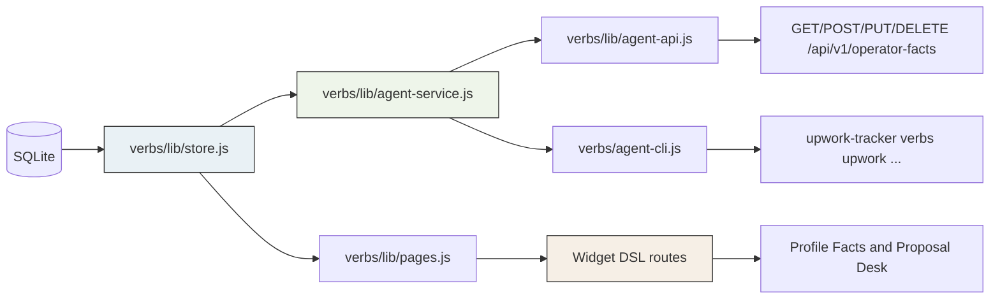
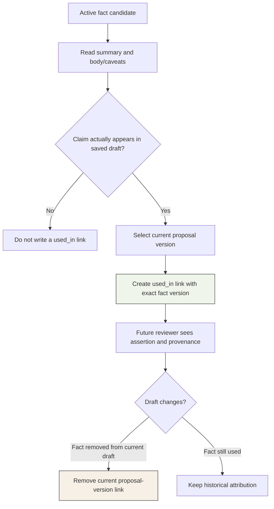

# Private Operator Facts: Provenance-Aware Memory for Proposal Work

Proposal work needs more than a job description and a résumé. A good proposal often depends on a small, specific claim: a capability, a prior delivery result, a constraint, a credential, a preference, or a project detail. Those claims need to be reusable, but reuse is unsafe if the system cannot answer four questions: what exactly was asserted, when was it current, what supports it, and where was it used.

The Upwork Tracker now has a private operator-facts subsystem that answers those questions in SQLite. It is intentionally not a generic vector-memory feature and not a mechanism for autonomous bidding. It stores operator-approved claims, their immutable revisions, lifecycle state, tags, dates, and provenance/use links. Agents can retrieve active facts and prepare local drafts; they cannot infer a fact into existence, submit a proposal, or spend Connects.

> [!summary]
> - A fact has a stable identity; its title, summary, body, applicability, and dates are immutable version records.
> - A typed link can connect a fact or exact fact version to one job, one indexed project, or one proposal version, with both event time and audit time.
> - Active facts are searchable through SQLite FTS5 and normalized tags; deprecated facts remain auditable but are excluded from default retrieval.
> - The same local store serves the Profile → Facts workspace, Proposal Desk attribution controls, the agent REST API, and direct Glazed/jsverbs commands.
> - Mutation safety combines expected fact revisions with durable idempotency keys. These solve stale intent and retry ambiguity separately.

## Why a profile document is not enough

The tracker already stores a private `operator_context` singleton containing the Freelancer profile, résumé, and response preferences. Those documents are useful broad context. They are not an adequate model for a claim that must be retrieved, evaluated, changed, and later attributed to a specific proposal revision.

A long-form résumé has no natural answer to “which exact version of this statement appeared in the proposal drafted last Tuesday?” Editing a Markdown profile also overwrites the current presentation without preserving a structured relation to a job or project. The missing information is not merely prose. It is identity, lifecycle, temporal scope, and provenance.

A fact model provides those missing dimensions. The system treats a fact as an operator-approved assertion rather than as an LLM conclusion. This distinction determines the write policy. An agent may retrieve a fact, flag a possible missing fact for human review, or revise a fact only when explicitly authorized. It may not convert similarity, tag overlap, or a plausible narrative into a stored credential or delivery claim.

The system also separates **active** from **deprecated**. Active means eligible for ordinary retrieval when preparing a new proposal. Deprecated means the historical assertion remains present but should not be selected by default. Deprecation does not mean that a prior proposal became false; it means the assertion is no longer appropriate as current reusable context.

## The data model: identity, versions, tags, and links

The implementation lives primarily in:

```text
/home/manuel/code/wesen/go-go-golems/upwork/internal/importer/schema.go
/home/manuel/code/wesen/go-go-golems/upwork/verbs/lib/store.js
```

The central design rule is simple: the stable fact identity is not the mutable assertion. `operator_facts` holds identity and current lookup fields. `operator_fact_versions` holds the human-readable assertion that was current at a particular revision.

```sql
CREATE TABLE operator_facts (
  fact_id TEXT PRIMARY KEY,
  canonical_key TEXT NOT NULL UNIQUE,
  category TEXT NOT NULL CHECK(category IN (
    'experience','capability','project_outcome','credential',
    'preference','constraint','availability','rate','other'
  )),
  current_version INTEGER NOT NULL DEFAULT 1,
  current_status TEXT NOT NULL CHECK(current_status IN ('active','deprecated')),
  created_at TEXT NOT NULL,
  updated_at TEXT NOT NULL,
  revision INTEGER NOT NULL DEFAULT 1
);

CREATE TABLE operator_fact_versions (
  id INTEGER PRIMARY KEY AUTOINCREMENT,
  fact_id TEXT NOT NULL REFERENCES operator_facts(fact_id) ON DELETE CASCADE,
  version INTEGER NOT NULL,
  title TEXT NOT NULL,
  summary TEXT NOT NULL,
  body TEXT NOT NULL,
  applicability_status TEXT NOT NULL CHECK(applicability_status IN ('active','deprecated')),
  valid_from TEXT,
  valid_until TEXT,
  deprecated_at TEXT,
  change_comment TEXT NOT NULL,
  created_by TEXT NOT NULL CHECK(created_by IN ('operator','agent')),
  created_at TEXT NOT NULL,
  UNIQUE(fact_id, version),
  CHECK(valid_from IS NULL OR valid_until IS NULL OR valid_from <= valid_until),
  CHECK(applicability_status != 'deprecated' OR deprecated_at IS NOT NULL)
);
```

The three content fields have deliberately different jobs.

| Field | Role in the system | Typical size and use |
|---|---|---|
| `title` | A concise, identifiable claim. | Used in cards, candidate lists, and compact proposal context. |
| `summary` | A self-contained one-to-three-sentence retrieval record. | Lets an operator or agent decide whether to open the detailed assertion. |
| `body` | Markdown detail, evidence interpretation, conditions, and caveats. | Read before the fact becomes a proposal claim. |

This split prevents two opposing failure modes. A system that stores only titles requires users to reconstruct caveats from memory. A system that stores only long bodies makes retrieval too expensive and causes agents to select material without first understanding its scope. The summary is not generated on demand by a model; it is part of the approved fact version.

Tags are a separate normalized relation:

```sql
CREATE TABLE operator_fact_tags (
  fact_id TEXT NOT NULL REFERENCES operator_facts(fact_id) ON DELETE CASCADE,
  tag TEXT NOT NULL,
  PRIMARY KEY(fact_id, tag)
);
```

Tags are stable fact-level retrieval labels in the first implementation. They support deterministic filters such as `go`, `llm`, `mento`, `observability`, or `embedded`. They do not certify a claim. A tag establishes relevance for retrieval; the title, summary, body, and provenance determine whether the claim can be used.

## Provenance is a relational object

The most consequential table is `operator_fact_links`. It represents a dated relationship between a fact and exactly one target.

```sql
CREATE TABLE operator_fact_links (
  id INTEGER PRIMARY KEY AUTOINCREMENT,
  fact_id TEXT NOT NULL REFERENCES operator_facts(fact_id) ON DELETE CASCADE,
  fact_version_id INTEGER REFERENCES operator_fact_versions(id) ON DELETE CASCADE,
  relation_kind TEXT NOT NULL CHECK(relation_kind IN (
    'created_from','extracted_from','supported_by','used_in','relevant_to'
  )),
  job_id TEXT REFERENCES jobs(job_id) ON DELETE CASCADE,
  project_key TEXT REFERENCES projects(project_key) ON DELETE CASCADE,
  proposal_version_id INTEGER REFERENCES proposal_versions(id) ON DELETE CASCADE,
  occurred_at TEXT NOT NULL,
  recorded_at TEXT NOT NULL,
  note TEXT NOT NULL DEFAULT '',
  created_by TEXT NOT NULL CHECK(created_by IN ('operator','agent')),
  CHECK(
    (CASE WHEN job_id IS NOT NULL THEN 1 ELSE 0 END) +
    (CASE WHEN project_key IS NOT NULL THEN 1 ELSE 0 END) +
    (CASE WHEN proposal_version_id IS NOT NULL THEN 1 ELSE 0 END) = 1
  )
);
```

The target columns are explicit rather than a generic `entity_type/entity_id` pair. SQLite cannot enforce a foreign key that dynamically points at one of several tables based on a string discriminator. Three nullable foreign keys plus an exactly-one `CHECK` make target integrity visible in the schema.

The link carries two dates because a workflow has two relevant times:

- `occurred_at` records when the business event happened. A fact may have been extracted from a project review last month or used in a particular proposal version at a known time.
- `recorded_at` records when the local tracker wrote the link. These dates are often equal, but conflating them removes useful audit information when a historical relationship is entered later.

A second cross-table invariant cannot be expressed by a table-local `CHECK`: when `fact_version_id` is present, it must belong to the `fact_id` on the same link. The migration installs a trigger for that condition, and another trigger requires a `used_in` link to point to a proposal version.

```sql
CREATE TRIGGER operator_fact_links_version_matches_fact
BEFORE INSERT ON operator_fact_links
WHEN NEW.fact_version_id IS NOT NULL
 AND NOT EXISTS (
   SELECT 1 FROM operator_fact_versions v
   WHERE v.id = NEW.fact_version_id AND v.fact_id = NEW.fact_id
 )
BEGIN
  SELECT RAISE(ABORT, 'fact version does not belong to fact');
END;
```

The result is a traceable sequence. A fact can be created after reviewing a job, supported by a repository project, then used by an exact proposal revision. If it later changes or becomes deprecated, the older proposal remains linked to the older fact version.



## The write path: immutable assertions and current projections

The JavaScript store implements the operational behavior. `createFact` validates category, canonical key, content sizes, lifecycle, validity dates, mandatory change comment, and normalized tags. It inserts the fact identity, creates version 1, replaces its tags, and refreshes the FTS projection.

The current implementation uses a locally generated `fact_<timestamp>_<random>` identifier. It is suitable for a single-operator SQLite installation. If the system gains multi-process writes or synchronization, this should be replaced with a shared ULID/UUID generator rather than relying on timestamp/random composition.

`updateFact` never overwrites the latest assertion row. It reads the current fact and current version, checks the supplied expected revision, composes the next assertion, inserts version N+1, advances `current_version`, updates `current_status`, increments the fact revision, replaces tags, and refreshes search.

```javascript
function updateFact(factId, input, expectedRevision) {
  const current = one(
    "SELECT current_version AS currentVersion, revision FROM operator_facts WHERE fact_id=?",
    factId,
  );
  if (Number(current.revision) !== Number(expectedRevision)) {
    return { ok: false, code: "version_conflict" };
  }

  const nextVersion = Number(current.currentVersion) + 1;
  db.exec("INSERT INTO operator_fact_versions(...) VALUES(...)", /* next assertion */);
  db.exec(
    "UPDATE operator_facts SET current_version=?, current_status=?, revision=revision+1 WHERE fact_id=?",
    nextVersion, status, factId,
  );
  replaceFactTags(factId, tags);
  refreshFactSearch(factId);
}
```

Deprecation uses this same path. `operator-fact-deprecate` does not introduce a separate mutable state transition. It creates a version with `applicabilityStatus: "deprecated"`, records the mandatory change comment, sets `deprecated_at`, and causes the active FTS projection to be removed. Reactivation is an ordinary revision back to `active` when the operator has a reason to make the claim reusable again.

This model keeps lifecycle changes reviewable. It also keeps the implementation smaller: there is one assertion-update path rather than distinct, partially overlapping edit, deprecate, reactivate, and restore implementations.

### Search is a derived projection, not an authority

The search table contains only the current active version and its tag text:

```sql
CREATE VIRTUAL TABLE operator_fact_search USING fts5(
  fact_id UNINDEXED, title, summary, body, tags,
  tokenize='unicode61 remove_diacritics 2'
);
```

A write refreshes the row by deleting the previous projection and inserting the current active assertion. Deprecated facts are not added. The fact and version tables remain authoritative; FTS exists only to accelerate candidate selection.

This ordering is important for any later semantic retrieval work. An embedding index may be useful when the collection grows and lexical FTS cannot recover related terminology. It must be a rebuildable cache keyed to a fact version and content hash. It must not replace the structured version, lifecycle, or provenance records that determine whether a statement is usable.

## Transport architecture: one store, three consumers

The facts subsystem follows the existing Tracker division between store, agent service, API adapter, CLI adapter, and Widget pages.



The store owns database behavior. `agent-service.js` serializes facts into stable resource shapes and applies idempotency. `agent-api.js` maps HTTP routes to the service. `agent-cli.js` declares Glazed/jsverbs fields and delegates to the same service. `pages.js` remains the human-facing Widget IR layer.

This avoids a common drift problem. If the REST route, CLI command, and Widget action each wrote their own SQL, they could disagree about tag normalization, change comments, optimistic concurrency, or link target validation. The facts implementation keeps those rules at the store/service boundary.

### Agent commands and HTTP resources

Direct CLI commands require an explicit database path:

```text
operator-facts-list
operator-facts-get FACT_ID
operator-fact-create
operator-fact-edit FACT_ID
operator-fact-deprecate FACT_ID
operator-fact-link FACT_ID
operator-fact-unlink FACT_ID
```

The matching private local REST resources are:

```text
GET    /api/v1/operator-facts
POST   /api/v1/operator-facts
GET    /api/v1/operator-facts/{factId}
PUT    /api/v1/operator-facts/{factId}
POST   /api/v1/operator-facts/{factId}/links
DELETE /api/v1/operator-facts/{factId}/links/{linkId}
```

The compact list resource returns title, summary, category, tags, lifecycle, dates, and revision. The detail resource additionally returns body, immutable versions, and links. This prevents routine retrieval from loading every Markdown body while preserving a direct path to qualifications and caveats.

A safe agent flow is therefore explicit:

```bash
BIN=upwork-tracker
DB="$HOME/.local/share/upwork-tracker/upwork.db"

$BIN verbs upwork operator-facts-list \
  --db-path "$DB" \
  --query 'Go LLM observability' \
  --status active \
  --output json --output-as-objects

$BIN verbs upwork operator-facts-get fact_example \
  --db-path "$DB" \
  --output json --output-as-objects
```

The list selects candidates. The detail resource establishes whether a candidate supports the intended claim. Neither command authorizes a marketplace action.

## Expected versions and idempotency solve different failures

Facts use two complementary mutation controls.

An `expectedVersion` protects against stale reasoning. An agent reads a fact at revision 4. Another local writer revises it to revision 5. The first agent must not apply a version-4 edit without re-reading the current assertion and reconsidering its intent.

An idempotency key protects against ambiguous delivery. A command may commit locally but lose its process response. Retrying the same logical operation with the same key returns the recorded result rather than creating another revision or duplicate link.

```mermaid
sequenceDiagram
    participant Agent
    participant Service
    participant Store
    participant DB

    Agent->>Service: edit fact, expectedVersion=4, key=K
    Service->>DB: find idempotency key K
    DB-->>Service: absent
    Service->>Store: updateFact(expectedVersion=4)
    Store->>DB: insert version 5; advance fact revision
    DB-->>Store: committed
    Service->>DB: persist response for K
    Service-->>Agent: fact revision 5

    Agent->>Service: retry same request, key=K
    Service->>DB: find idempotency key K
    DB-->>Service: stored response
    Service-->>Agent: stored result, replayed=true
```

The implementation diary exposed an important naming failure in this boundary. The service contract uses `expectedVersion`, but an early `linkFact` store helper read only `expectedRevision`. The command supplied the correct public field and the helper interpreted it as missing, producing a conflict. The repair accepts `input.expectedVersion ?? input.expectedRevision`, preserving the public contract while supporting the existing Widget caller shape.

The first smoke retry after that repair reused the same idempotency key as the failed request and correctly replayed the original error. The test had to use a fresh key after the implementation changed. This is not an inconvenience; it is the intended idempotency rule. A key identifies one logical request and one stored result, including a deterministic domain error.

## Human workflow: Facts and Proposal Desk

The human interface has two entry points.

**Profile → Facts** provides creation and lifecycle management. The page displays active, deprecated, and all selectors; cards show title, summary, body, tags, lifecycle, current revision, compact version-comment history, and provenance/use links. The create and edit forms require title, summary, body, tags, status, and a change comment. There is deliberately no ordinary delete control.

**Proposal Desk** presents a fact-attribution panel beside the selected proposal workflow. The panel has two states:

1. If there is no saved proposal version, it explains that a draft must be saved first. Attribution belongs to a concrete immutable proposal revision, not to an editor buffer.
2. If a saved version exists, it shows facts already used by that version and active candidates that may be marked used.

“Mark used” creates a `used_in` link to the exact proposal version and selected fact version. “Remove use” deletes only that link. It does not delete the fact, does not delete any fact version, and does not rewrite the links belonging to older proposal drafts.



This choice makes proposal attribution honest. A candidate selected during exploration is not automatically “used.” A fact becomes used only when the operator confirms it appears in a saved local proposal version. The tracker remains a local preparation workspace: it never submits a proposal or spends Connects.

The Proposal Desk also now includes a **Submitted** selector beside Drafting, Review, and Ready to submit. It exposes locally recorded submitted applications without changing the submission boundary. The selector is a workflow view, not evidence that an agent submitted anything remotely.

## Failure modes that shaped the implementation

The implementation was not a linear translation of the initial schema. Several failures clarified the actual contracts.

### FTS aliases are not accepted by SQLite `MATCH`

The first facts-list query used an alias in a correlated FTS predicate:

```sql
... EXISTS (SELECT 1 FROM operator_fact_search s
            WHERE s.fact_id=f.fact_id AND s MATCH ?)
```

SQLite returned:

```text
SQL logic error: no such column: s (1)
```

The correction names the virtual table directly:

```sql
... EXISTS (SELECT 1 FROM operator_fact_search
            WHERE operator_fact_search.fact_id=f.fact_id
              AND operator_fact_search MATCH ?)
```

This matters because ordinary SQL alias habits do not necessarily apply to FTS virtual-table operators. A disposable database create → list test found the defect before the feature was used against the installed database.

### UI generation needs both syntax checks and rendered inspection

The initial Facts page had a missing parenthesis in a nested Widget DSL expression:

```text
SyntaxError: missing ) after argument list
```

`node --check verbs/lib/pages.js` isolated the problem before a generated build. The repaired page then passed `make build` and was served from a copied database. Browser inspection verified Account navigation, Add fact, Active/Deprecated/All selectors, a fact card, and the Edit / deprecate action.

This is a useful validation sequence for Widget DSL code. JavaScript syntax validation catches parser errors. The generated build checks xgoja packaging and Widget compatibility. A rendered page checks that the component tree is useful to an operator.

### A copied SQLite database is the mutation test boundary

All fact mutation smoke tests used a copied database rather than the installed account database. The tests covered:

```text
create → FTS list → immutable edit → deprecate → active-list exclusion
create/link exact proposal version → unlink
GET list/detail through the agent API
render Facts and Proposal Desk in a disposable local server
```

The distinction is operational, not ceremonial. Private facts, proposal bodies, comments, and profile context are operator data. The tests must prove mutations without adding a test fact or link to the working account database.

## Validation evidence

The completed implementation passed the Tracker's required local validation commands:

```bash
make test
make lint
make build-web
make doctor
make list-modules
make build
make serve-smoke
git diff --check
```

Additional disposable-database validation exercised the direct CLI and local API:

- create a tagged active fact;
- retrieve it through FTS;
- create an immutable revision;
- deprecate it and prove it disappears from the default active list;
- create and remove a `used_in` link to a real copied proposal version;
- retrieve list and detail resources through `/api/v1/operator-facts`;
- render Facts and Proposal Desk in a local disposable server.

The implementation record and source-level guide are retained in the completed ticket:

```text
/home/manuel/code/wesen/go-go-golems/upwork/
ttmp/2026/07/21/UPWORK-FACT-MEMORY-2026-07-21--add-provenance-linked-operator-facts-memory/
```

The ticket includes schema design, task-by-task implementation guide, detailed diary, changelog, task completion, and links to the source files.

## Engineering rules established by this work

- Store a reusable operator claim as a versioned assertion, not as an unstructured paragraph appended to a profile document.
- Treat title, summary, and body as different retrieval layers. A tag or summary identifies a candidate; the detailed body and provenance determine whether it supports a claim.
- Keep active/deprecated applicability separate from historical truth. Deprecation changes default retrieval, not the record of prior use.
- Record fact use only after the exact claim appears in a saved proposal version. Candidate selection is not attribution.
- Preserve source/use relationships as typed database links with foreign keys and dates rather than free-form backlinks.
- Use FTS or embeddings only as derived retrieval indexes. The versioned relational record remains authoritative.
- Require both expected revisions and idempotency keys for agent mutations. One protects against stale state; the other protects against duplicate delivery.
- Keep private operator facts outside capture evidence, marketplace reports, and public output.
- Test private state mutations on a copied database and verify generated UI in a browser.

## Current limitations and next questions

The subsystem is complete for the current local workflow, but several future questions should remain explicit.

First, fact creation, version insertion, tag replacement, and FTS refresh are currently sequential store operations. The validation and preconditions make ordinary failures unlikely, but a future store transaction API should group each multi-statement fact mutation atomically. The same applies to the link insertion and fact revision increment.

Second, tags are fact-level in the first implementation. This is appropriate for stable retrieval categories, but it does not preserve a historical tag set per assertion version. If tag semantics become material to proposal audit, introduce versioned tag associations before adding synchronization or more complex retrieval.

Third, the current Facts UI uses compact inline history and provenance text. That is appropriate for the observed fact volume. If a fact accumulates many revisions or links, replace the compact rendering with a structured, collapsible timeline rather than truncating audit information.

Finally, semantic retrieval remains deliberately deferred. It should be added only when measured search failures justify it and only as a rebuildable index over immutable fact versions. A semantic ranking system must not be allowed to change factual status, provenance, or proposal attribution.

## Related notes

- [[ARTICLE - Upwork Tracker Agent Interfaces - Safe REST and jsverbs Automation]]
- [[ARTICLE - SQLite-Backed Opportunity Research - Project Evidence and Proposal Metadata]]
- [[ARTICLE - Upwork Research Workflow - Search, Enrichment, and Deliverable Production]]
- [[PROJ - surf-go Upwork Bidding - Two-Phase Proposals, Automation Flakiness, and an Accidental Submit]]
