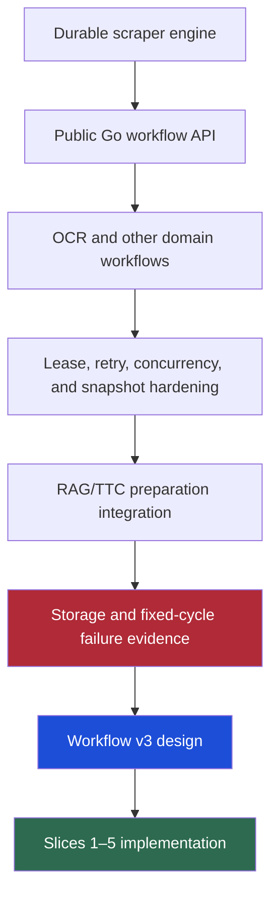
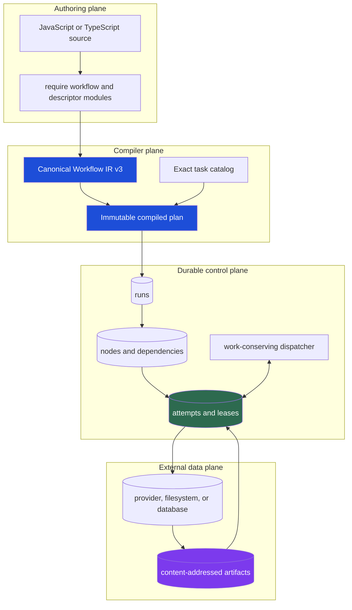
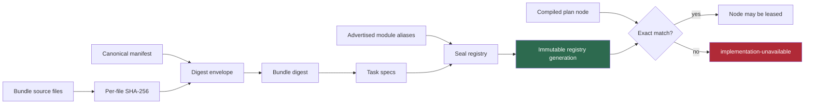
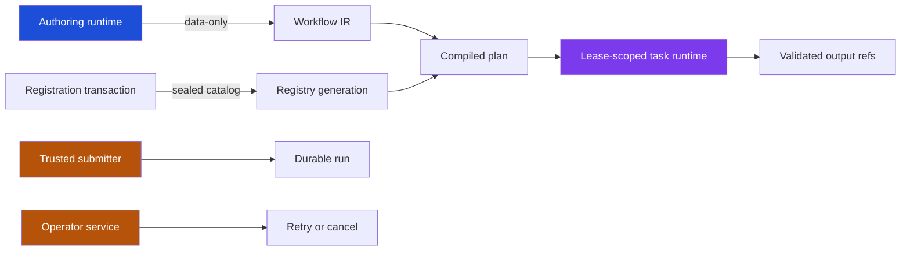

# Scraper Workflow V3: Compact Durable Dataflow and Typed JavaScript

Scraper workflow v3 is a new durable execution path inside the existing `scraper` repository. It keeps the transactional properties that were already proven in the v2 engine, but replaces three unsafe or limiting boundaries: arbitrary source-bearing JSON in workflow rows, fixed-cycle worker scheduling, and mutable JavaScript execution surfaces without exact implementation identity.

The result, as of 2026-07-21, is an executable five-slice system. JavaScript authors a typed workflow through `require("workflow")`. Go normalizes that workflow into canonical IR, compiles it against an exact task catalog, and persists a compact plan. Workers advertise immutable JavaScript bundles and exact module aliases. Every attempt runs in a fresh lease-scoped Goja runtime. SQLite stores references, identities, attempts, leases, and redacted outcomes. A completion-driven dispatcher fills independent resource classes without waiting for unrelated work. Real file, HTTP, and database workflows prove the design under restart, cancellation, retry, policy denial, stale completion, and crash-after-side-effect conditions.

> [!summary]
> - Workflow v3 separates JavaScript authoring intent from Go-owned canonical IR, compilation, policy, durability, and execution.
> - Durable rows carry compact references and exact identities rather than source text, prompts, provider bodies, credentials, or duplicated plans.
> - Task implementations are immutable bundles pinned by kind, version, bundle digest, entrypoint, ABI, module aliases, resource class, and retry policy.
> - Slices 1–5 are implemented and validated: linear file transformation, the minimal DSL, allowlisted HTTP, work-conserving dispatch, and idempotent database synchronization.

## 1. Why workflow v3 exists

The design came from a production-shaped failure during a real-provider RAG preparation study. The experiment needed durable generation and embedding work, restart attachment, failure isolation, publication, and evidence capture. Scraper already offered workflows, dependencies, leases, retries, results, artifacts, events, and SQLite persistence. That made it the correct execution substrate. The failure was not that scraper lacked durable primitives. The failure was that its v2 representation and scheduling contracts allowed a caller to use those primitives in a way that was both inefficient and unsafe.

Two measurements defined the v3 problem.

First, the v2 data plane accepted arbitrary JSON for workflow and operation inputs. The RAG adapter accidentally placed a complete source-bearing preparation plan into each operation. Approximately 1,807 batch descriptions were duplicated across operation rows. The operation-input JSON alone reached roughly 14.67 GB. The SQLite main file reached about 20.8 GB, the WAL reached about 20.7 GB, and the filesystem reached 94% usage. Source text had crossed into the workflow database, so this was a privacy-boundary failure as well as storage amplification.

Second, the scheduler used fixed execution cycles. `RunOnce` leased up to `MaxWorkers`, launched that group, and waited for every member before leasing again. In the diagnostic run, 843 scheduler cycles completed exactly three operations, and 865 cycles mixed generation and embedding. Median progress gaps were approximately 33.69 seconds. A local six-item embedding probe completed in 1.637 seconds, showing that local embedding was often idle while a remote generation request kept the current cycle open.

The diagnostic run was deliberately stopped and declared non-publishable. It still provided useful evidence:

| Observation | Value |
| --- | ---: |
| Combined-generation successes | 1,710 |
| Embedding successes | 865 |
| Terminal malformed-JSON failures | 12 |
| Elapsed time | 8.69 hours |
| Complete three-operation cycles | 843 of 866 |
| Median cycle/progress gap | 33.69 seconds |
| Operation input JSON | approximately 14.67 GB |
| SQLite main file | approximately 20.8 GB |
| SQLite WAL | approximately 20.7 GB |

These numbers established a precise requirement: workflow rows must not be a general payload store, and scheduler capacity must be replenished on completion rather than at batch boundaries.

## 2. The work before v3

Workflow v3 is not the first workflow work in scraper. It follows several earlier stages that remain relevant.

The public `pkg/workflow` API made the engine embeddable from Go. It introduced `Runtime`, `Package`, `Entrypoint`, `Executor`, `RunBuilder`, `StepContext`, artifact stores, projection stores, retry, and cancellation. That work is documented in [[ARTICLE - Scraper Workflow API - Building a Public Reusable Durable Workflow Runtime]]. It established an important package boundary: application code should describe and execute domain steps without writing scheduler SQL directly.

Book OCR then exercised that API with a real dynamic workflow. Page discovery emitted page-level OCR work, artifacts stored generated text, and a finalizer assembled output. That project is documented in [[ARTICLE - Building Book OCR on Scraper Job System - Workflow Runtime Deep Dive]]. It showed that scraper could represent workflows outside traditional site scraping.

The July 2026 resumability work then corrected lease ownership, sortable database time, blocked dependency recovery, true concurrent runner execution, immutable run attachment, safe observers, and restart-safe snapshots. Those changes are documented in [[ARTICLE - Hardening Scraper for Long-Running Resumable Workflows]]. Workflow v3 depends on the principles established there:

- a lease token is a durable ownership proof;
- stale workers cannot commit;
- dependency-derived blocking differs from explicit cancellation;
- external side effects still require domain idempotency;
- the store is authoritative, while observers and events are projections of committed state.

Workflow v3 does not discard these systems. It introduces distinct v3 packages and tables so the new representation can be proved without silently decoding historical v2 operations. Existing v2 runs remain inspectable and executable through existing code.



## 3. The central ownership model

The architecture is defined by responsibility boundaries rather than implementation language.

Scraper owns generic durable execution. It owns runs, nodes, dependencies, leases, attempts, resource admission, retries, cancellation, output references, events, and projections. It does not own RAG generation semantics, OCR transcription policy, customer normalization rules, or research ledger behavior.

Domain packages own task semantics. They define schemas, task kinds, validation, provider translation, and idempotency strategy. A RAG package owns generation and embedding behavior. A site package owns fetch and extraction behavior. A database synchronization bundle owns its target transaction and operation key.

Researchctl owns immutable experiment evidence. It records run identities, plan references, metrics, costs, and reports. It must not become a second scheduler or a second payload database.

JavaScript owns authoring ergonomics and trusted first-party task behavior. Go owns canonical representation, digesting, validation, compilation, host policy, worker admission, leases, resource limits, persistence, and output validation.

This produces four distinct planes:



The separation matters during failure recovery. A compiled plan remains immutable while attempts change. An artifact remains immutable while a node is retried. JavaScript source remains outside run rows while a worker restarts. Host credentials remain in Go services while a task runtime is created and destroyed.

## 4. The canonical representation pipeline

Workflow v3 distinguishes builder state, workflow IR, compiled plans, and run state.

Builder state is mutable and process-local. It exists only while the authoring script executes. JavaScript callbacks execute immediately against Go-backed builders and are never serialized.

Workflow IR is normalized, data-only intent. It contains named inputs, symbolic task keys, bindings, dependencies, and named outputs. It does not contain executable callbacks, Goja values, credentials, database handles, or filesystem objects.

The compiled plan binds symbolic tasks to exact implementations and policy. It records implementation identity, input and output schemas, module aliases, resource class, and retry policy. It also records the IR digest, catalog digest, and final plan digest.

Run state contains mutable execution facts: node status, attempt number, lease token, cancellation epoch, retry deadline, output references, and terminal failure.

The implemented core types are in `pkg/workflowv3/types.go`:

```go
type ImplementationIdentity struct {
    TaskKey
    BundleDigest string `json:"bundleDigest"`
    Entrypoint   string `json:"entrypoint"`
    ABI          string `json:"abi"`
}

type RetryPolicy struct {
    MaxAttempts   int   `json:"maxAttempts"`
    BackoffMillis int64 `json:"backoffMillis"`
}

type PlanNode struct {
    Key            NodeKey
    Implementation ImplementationIdentity
    Bindings       map[string]ValueRef
    DependsOn      []NodeKey
    InputSchemas   map[string]string
    OutputSchemas  map[string]string
    Modules        []string
    ResourceClass  string
    Retry          RetryPolicy
}
```

The implementation currently uses canonical `encoding/json` over normalized Go values. Deterministic maps, sorted module lists, normalized defaults, strict decoding, and golden fixtures make the current contract testable. The representation intentionally has separate digests for IR, catalog, bundle, registry generation, and final plan. A single digest would be unable to explain which layer changed.

```text
JavaScript source
    -> Go-backed builder handles
    -> WorkflowIR
    -> IR digest
    -> Compile(IR, Catalog)
    -> exact PlanNode identities and policies
    -> plan digest
    -> durable run
```

The important invariant is that JavaScript is not replayed to recover a run. Recovery reads the persisted canonical plan and current run state.

## 5. The minimal `require("workflow")` DSL

The authoring module lives in `pkg/gojamodules/workflow`. It deliberately exposes a small surface:

```javascript
const workflow = require("workflow");
const tasks = require("cookbook-linear-transform-tasks");

const definition = workflow.define("linear-transform", (plan) => {
  const source = plan.input("source", {
    schema: "customer-jsonl-ref/v1",
  });

  const normalized = plan.task(
    "normalize",
    tasks.normalizeCustomers({source}),
  );

  const validated = plan.task(
    "validate",
    tasks.validateDataset({
      dataset: normalized.output("dataset"),
    }),
    (job) => job.after(normalized),
  );

  plan.output(
    "dataset",
    validated.output("validatedDataset"),
  );
});

module.exports = workflow.compile(definition);
```

`workflow.define` creates one Go-owned builder. The callback runs immediately. `plan.input` creates a hidden value handle associated with an input schema. Descriptor factories accept only handles created by the same runtime. `plan.task` creates an IR node and returns a hidden job handle. `job.after` adds dependency edges. `job.output` creates an output handle with the schema from the catalog. `plan.output` publishes one named workflow output.

The terminal functions have distinct roles:

| Function | Result |
| --- | --- |
| `toIR(definition)` | A plain JSON-compatible representation of normalized intent. |
| `validate(definition)` | Structured validation status and diagnostics. |
| `digest(definition)` | The canonical IR digest. |
| `compile(definition)` | The exact executable workflow plan. |

The authoring runtime contains no network, database, filesystem, process, store, submission, or operator authority. Descriptor modules are also data-only. Requiring a task descriptor module does not load its execution code and does not mutate a process-global registry.

TypeScript declarations are exact golden artifacts. The authoring declaration preserves input types with `input<T = unknown>(...) -> ValueRef<T>`. A separate `workflow/task` declaration describes lease-scoped task execution, including input artifact metadata, attempt identity, stable operation key, cancellation checkpoints, and validating output writers.

## 6. Task bundles and exact implementation identity

A symbolic task key such as `cookbook.http.snapshot-articles@v1` is not enough to resume durable work. Two workers may expose the same kind and version while running different JavaScript bytes. A plan must therefore pin implementation identity.

A bundle manifest contains one or more task descriptions:

```go
type BundleTask struct {
    TaskKey
    Entrypoint    string
    Inputs        map[string]string
    Outputs       map[string]string
    Modules       []string
    ResourceClass string
    Retry         RetryPolicy
}
```

`NewBundle` validates canonical file paths, entrypoints, schemas, module aliases, resource class, retry policy, and ABI. It hashes every file and computes a digest over the canonical manifest plus sorted file digest records. A one-byte source change produces a different bundle digest.

A registry is built explicitly:

```go
builder := workflowv3.NewRegistryBuilder()
builder.AdvertiseModules("fs:input", "fetch:public")
builder.AddBundle(bundle)
registry, err := builder.Seal()
```

Sealing performs a fail-closed transaction in memory. Every task's requested module alias must be explicitly advertised. The generation digest covers sorted implementation identities and sorted aliases. Once sealed, the registry is immutable.

At lease time, `ResolveNode` checks:

1. task kind and version;
2. exact bundle digest;
3. exact entrypoint;
4. exact task ABI;
5. exact module list;
6. exact resource class;
7. exact retry policy.

A wrong digest, entrypoint, ABI, module profile, resource class, or retry policy is an admission failure. The worker does not substitute a newer bundle and does not wait until task execution to discover that a module is missing.



The complete bundle build, signature, provenance, hot reload, coexistence, and quarantine design is documented in the ticket but not yet fully implemented. The current slices implement in-memory immutable bundles, exact catalogs, sealed generations, defensive accessors, and admission tests.

### 6.1 The cookbook as an executable design instrument

The architecture work included a 3,500-line JavaScript cookbook rather than relying only on type sketches. The cookbook explores fifteen workflow classes, and every workflow has one companion task bundle with a catalog, visible execution source, descriptor-only authoring module, module list, and worker binding story.

The fifteen bundles cover:

1. linear file transformation;
2. bounded news snapshotting;
3. partner database synchronization;
4. ETL quality checks;
5. media packaging;
6. word-count map/reduce;
7. security approval gates;
8. resource-bound image classification;
9. notification delivery;
10. database backup;
11. inventory reconciliation;
12. release builds;
13. approved deployment;
14. service-level probes;
15. document conversion.

These examples force the design to answer questions that a single file transform would not expose: dynamic expansion, bounded reduction, delivery semantics, side-effect idempotency, database handles, network policy, gates, process execution, media resources, retries, routing, and operator approval.

The cookbook is explicitly a target API atlas. It is not evidence that all fifteen workflows execute in the current runtime. Slices 1–5 selected three representative classes—file, HTTP, and database—and implemented them against the durable path. Later slices will close the map/reduce, gate, budget, and isolation gaps.

The cookbook itself is reproducible evidence:

- 52 JavaScript blocks parse successfully;
- formatting is normalized to an 80-column policy;
- every workflow names exactly one companion bundle;
- catalog tasks match execution exports;
- declared module aliases match `require()` imports;
- scripts regenerate deterministic syntax and consistency artifacts.

The key scripts are:

```text
ttmp/.../scripts/03-workflow-dsl-grammar-probe.mjs
ttmp/.../scripts/04-check-cookbook-js.py
ttmp/.../scripts/05-js-task-bundle-registration-probe.mjs
ttmp/.../scripts/06-format-cookbook-js.py
ttmp/.../scripts/07-check-cookbook-bundles.py
```

The cookbook prevented a specific architecture error: treating task descriptors as sufficient without showing the privileged execution implementation. The revised version includes guarded HTTP, database, filesystem, process, crypto, YAML, path, and time calls in visible `execution/tasks.cjs` sources. This makes authority review possible at the bundle boundary.

## 7. Capability phases and trusted execution

Workflow v3 separates capabilities by phase.

The authoring phase receives `workflow` and descriptor-only modules. It can build and compile intent, but it cannot execute tasks or access host resources.

The registration phase constructs a candidate task registry from explicit bundles. It is distinct from ordinary `require()` and from task execution. The current implementation builds bundles through Go APIs; the larger design includes a dedicated registration-only runtime and bundle artifact pipeline.

The task execution phase receives `workflow/task` and only the module aliases declared by the pinned task and configured by the worker. It does not receive the engine store, lease token, worker registry, ambient environment, arbitrary filesystem, or operator APIs.

The submission and operator phases remain separate privileged surfaces. Importing the authoring DSL does not grant run creation, retry, cancellation, or direct store mutation.



Goja is not treated as a hostile-code sandbox. Fresh runtimes isolate mutable JavaScript globals and module caches between attempts. Module allowlists limit host authority. Context cancellation interrupts cooperative operations. These mechanisms do not provide OS-level isolation against malicious CPU use, memory use, native-module bugs, or process compromise. Untrusted bundles remain a later process/container isolation slice.

## 8. Compact artifacts and the persistence boundary

The v3 data plane uses `ArtifactRef`:

```go
type ArtifactRef struct {
    Schema    string `json:"schema"`
    Digest    string `json:"digest"`
    MediaType string `json:"mediaType"`
    Size      int64  `json:"size"`
    Locator   string `json:"locator"`
}
```

The reference is small, schema-bearing, content-verifiable, and bounded. Artifact bytes live in an external content-addressed store. The current file store hashes content, writes through a temporary file, synchronizes it, and publishes by rename. The workflow database stores only the reference.

Immediately before task execution, the runtime resolves each bound artifact, verifies its digest and size, and writes it into a temporary attempt workspace. `fs:input` exposes only that workspace through a read-only backend. The task sees paths such as `/source.artifact`; it cannot choose host paths.

Outputs use validating writers. `ctx.outputs.putJSON(port, {schema, value})` checks that the port was declared, the schema matches the task catalog, JSON encoding succeeds, and the artifact store accepts the body. The fenced completion transaction receives only output references.

This arrangement has one deliberate crash behavior. A process can write an immutable artifact and crash before committing its reference. That may leave an unreferenced content-addressed object. It cannot publish a partial or schema-invalid output as authoritative workflow state. Garbage collection can remove unreferenced objects separately.

The privacy boundary was tested at realistic volume. The linear workflow processed 12,000 source rows. The database synchronization test used 499,554 bytes of source data and persisted 90,112 bytes across workflow SQLite main/WAL/SHM, a ratio of 18.04%. Source and secret canaries were absent from the workflow database.

## 9. The v3 SQLite execution model

The implementation uses distinct tables under `pkg/workflowv3sqlite/schema.sql`:

- `v3_runs` stores run identity, compact plan JSON, plan digest, status, cancellation epoch, and timestamps;
- `v3_run_inputs` stores named artifact references;
- `v3_nodes` stores exact task identity, bindings, schemas, aliases, resource class, retry policy, readiness, and lease state;
- `v3_dependencies` stores run-scoped edges;
- `v3_attempts` stores append-only attempt outcomes;
- `v3_node_outputs` stores output references;
- `v3_events` stores compact redacted facts;
- `v3_run_resource_dispatch` stores per-run, per-resource fairness counters.

Node identity is `(run_id, node_key)`. This removes the v2 global operation-ID collision. Attempt identity is `(run_id, node_key, attempt_no)`.

### 9.1 Submission

`CreateRun` validates the plan digest and every input reference before beginning the transaction. It inserts the run, input references, static nodes, dependency edges, and one compact `run.created` event. It never inserts artifact bytes.

### 9.2 Leasing

`LeaseNextWithResources` begins an immediate SQLite transaction. It reclaims expired leases, derives active counts by resource class, scans ready nodes in fair order, requires exact registry admission, and skips classes without capacity. Selecting a node increments its attempt number, writes a random lease token and cancellation epoch, inserts a running attempt with the registry generation and resource class, updates per-resource fairness, appends `attempt.started`, and commits.

The fair ordering is based on the dispatch count for `(run_id, resource_class)`, followed by run creation time, node ordinal, and run ID. This prevents one run from consuming every slot in a shared class while preserving deterministic tie-breaking.

### 9.3 Completion

`Complete` validates every output reference against the compiled node before opening the transaction. Inside the transaction it checks the run status, current lease token, lease cancellation epoch, and run cancellation epoch. Only then does it insert output references, mark the attempt succeeded, mark the node succeeded, clear lease fields, and possibly mark the entire run succeeded.

A late worker with an old token receives `ErrStaleCompletion`. It cannot overwrite cancellation or a newer attempt.

### 9.4 Failure and retry

A task failure has a stable class, code, retryable flag, and bounded safe message. The store finishes the current attempt as failed. If the failure is retryable and `attempt < maxAttempts`, the node returns to pending with a durable `ready_at` deadline. Otherwise the node and run become terminally failed.

Retry state does not overwrite attempt history. A three-attempt 429 sequence produces three append-only failed attempts. A later successful retry keeps the earlier failure facts.

### 9.5 Cancellation and lease loss

Cancellation increments `cancel_epoch`, marks active attempts canceled, and marks pending or running nodes canceled. The task engine polls lease validity and cancels the Goja/HTTP context when the durable lease becomes invalid.

Lease expiry marks the old attempt `lease_lost`, returns the node to pending, and permits a new attempt. An old completion remains fenced by token and cancellation epoch.

### 9.6 Time comparison

Timestamp text uses RFC3339Nano for storage and inspection, but SQLite comparisons use `julianday(...)`, and Go projections parse timestamps before comparing. This is required because RFC3339Nano omits unnecessary fractional digits and is not always lexicographically ordered within the same second. The previous resumability project solved the same class of problem in v2 with integer microsecond columns. V3 currently keeps its separate schema additive while avoiding raw text comparison.

## 10. Work-conserving dispatch

The v3 dispatcher is in `pkg/workflowv3runtime/dispatcher.go`. It retains `DispatchOnce` as a deterministic test and maintenance hook, but production-style execution uses `Run`.

The dispatcher computes a completion channel capacity equal to the sum of configured resource capacities. It repeatedly calls `DispatchOnce` until no compatible node can be leased. Every lease starts one goroutine. The loop then waits for a completion, context cancellation, or maintenance poll. A completion immediately returns control to the fill loop.

```go
for {
    started := false
    for {
        lease, err := d.DispatchOnce(ctx)
        if err != nil { return err }
        if lease == nil { break }

        started = true
        go func(lease workflowv3.Lease) {
            err := d.Engine.ExecuteLease(ctx, lease)
            completions <- dispatchCompletion{lease: lease, err: err}
        }(*lease)
    }

    if started { continue }

    select {
    case <-ctx.Done():
        return ctx.Err()
    case completion := <-completions:
        // recorded task failures do not stop unrelated runs
    case <-poll.C:
        // retry deadlines, expiry, and cross-process changes
    }
}
```

The store, not a local semaphore, is the final admission authority. A test opens two independent SQLite connections, submits two ready runs, and races both for one resource slot. Exactly one lease wins. This proves database-scoped capacity.

The work-conserving timeline test uses two classes. One HTTP task and one unrelated slow task remain active. A second HTTP task is blocked by HTTP capacity. When only the first HTTP task finishes, the dispatcher starts the second HTTP task before the unrelated slow task completes. Peak HTTP concurrency remains one.

```mermaid
sequenceDiagram
    participant D as Dispatcher
    participant H1 as HTTP-1
    participant H2 as HTTP-2
    participant S as Slow task

    D->>H1: lease network.http.test
    D->>S: lease network.slow.test
    Note over D,H2: HTTP capacity full; H2 remains ready
    H1-->>D: completion
    D->>H2: lease immediately
    Note over S: Slow task is still active
    H2-->>D: completion
    S-->>D: later completion
```

`QueueSnapshot` derives operational state from authoritative rows. It reports:

- ready node count;
- active count by resource class;
- blocked counts for dependency, retry backoff, resource capacity, and unavailable implementation.

It does not maintain a second mutable queue status table.

## 11. Fresh lease-scoped Goja runtimes

Every attempt calls `RunTask` with the exact registered task, resolved input references, artifact store, and immutable task-module registry.

The runtime performs these steps:

1. validate input reference count and schemas;
2. read and verify each artifact;
3. materialize a private temporary workspace;
4. construct `workflow/task` and exactly declared host modules;
5. create a fresh Goja runtime and CommonJS module cache;
6. resolve the bundle-local `path#export` entrypoint;
7. call the task with a lease-scoped context;
8. await any returned Promise;
9. validate written and returned output ports;
10. close the runtime and remove the workspace.

The task identity surface contains `runId`, `nodeKey`, `attempt`, and `operationKey`. The operation key is the canonical SHA-256 digest of `{runId,nodeKey}`. It intentionally excludes the attempt number so external side effects can be idempotent across retries and lease loss.

The runtime converts uncategorized JavaScript exceptions into an `internal` failure with a generic durable message. Typed `task.failure(...)` values preserve stable class and code, but the engine replaces the user message with `task reported <CODE>` before persistence. Raw stack traces, URLs, provider bodies, SQL values, and headers do not enter attempt or event rows.

A fixture increments a JavaScript global when the bundle loads and asserts that the value is exactly one in every attempt. This proves that mutable globals and module caches are not shared across attempts.

## 12. Slice 1: real linear file transformation

The first vertical slice proved the durable path without network or database side effects.

The workflow accepts one JSONL customer artifact. `normalizeCustomers` reads through `fs:input`, trims IDs, lowercases email addresses, and writes a normalized JSON artifact. `validateDataset` reads that artifact, rejects duplicate IDs with typed code `CUSTOMER_DUPLICATE_ID`, and writes a validated dataset receipt.

The integration test uses 12,000 rows and two distinct attempts. It executes the first task, closes the workflow store, reopens it, completes the second task, closes again, and reopens the final snapshot. It verifies:

- two attempts exist;
- the registry generation is recorded;
- output schema and digest survive reopen;
- private source and secret token canaries are absent from output;
- source and secret canaries are absent from SQLite main/WAL/SHM;
- persisted workflow bytes remain below half of source size;
- source bytes remain present only in the external source artifact.

This slice also established exact bundle, entrypoint, ABI, input schema, output schema, stale completion, lease reclamation, and concurrent lease-race tests.

## 13. Slice 2: JavaScript authoring equals direct Go construction

The second slice authored the same workflow through `require("workflow")`. The test compares the JavaScript-produced `WorkflowIR` with a direct Go value and compares canonical IR and compiled plan against exact golden files.

This is stronger than checking that compilation succeeds. It proves that JavaScript is an ergonomic front end to the same Go model rather than a second interpretation path.

The DSL checks include:

- duplicate input, node, and output rejection;
- unknown task rejection;
- exact binding count;
- schema compatibility;
- dependency existence and cycle detection;
- descriptor-only task creation inside an active `define` callback;
- hidden-handle provenance;
- deterministic IR, catalog, and plan digests;
- exact TypeScript declaration parity.

## 14. Slice 3: allowlisted HTTP snapshot

The HTTP slice introduces `fetch:public` as an exact task capability. Host configuration supplies allowed origins, timeout, maximum response bytes, disabled credential sources, redirect policy, and `http.Client`. None of those policy values appear in the workflow plan.

The public profile is fail-closed:

- an empty origin list is rejected at worker setup;
- `*` is rejected;
- nonpositive timeout or response limit is rejected;
- environment and file credential sources are rejected;
- URL userinfo is rejected before transport;
- `Authorization`, `Cookie`, and `Proxy-Authorization` headers are rejected;
- every redirect is checked against the same origin policy.

The task accepts a bounded list of at most eight article URLs. It fetches them sequentially inside one bounded task, classifies status, reads bounded text, and writes one snapshot artifact. The output uses stable list indexes rather than echoing request URLs, so query credentials cannot be copied into the result artifact.

The typed failure mapping is explicit:

| Condition | Class | Code | Retryable |
| --- | --- | --- | --- |
| Transport, policy, or response-limit error | `transport` | `HTTP_FETCH_TRANSPORT` | yes |
| HTTP 429 | `rate-limit` | `HTTP_FETCH_RATE_LIMIT` | yes |
| HTTP 5xx | `provider-5xx` | `HTTP_FETCH_SERVER` | yes |
| Other non-2xx status | `validation` | `HTTP_FETCH_STATUS` | no |
| Invalid URL-list cardinality | `validation` | `HTTP_SNAPSHOT_CARDINALITY` | no |

Tests prove one 503 followed by success, three bounded 429 attempts, one terminal 404 attempt, denied-origin non-contact, cross-origin redirect non-contact, URL-password non-contact, response-size enforcement, in-flight cancellation, exact resource recording, reopen, and canary privacy.

## 15. Slice 4: independent resources and fairness

The dispatcher uses symbolic resource classes pinned in the compiled plan. Implemented fixtures include:

- `cpu.default`;
- `network.http.public`;
- `database.sync.primary`;
- test-only independent network classes for timeline proof.

Resource capacity is checked in the lease transaction by counting currently running v3 nodes per class. Because the count and node transition occur under SQLite's immediate transaction, independent worker connections cannot both consume the last slot.

Fairness is tracked by `(run_id, resource_class)`. After run A receives one lease in a class, run B with zero dispatches is ordered first for the next compatible lease. Fairness in one class does not consume a run's position in another class.

The dispatcher distinguishes handled attempt failures from infrastructure failures. A terminal domain failure marks its run failed but does not stop unrelated runs. A retryable domain failure schedules a later attempt. A database or completion error that was not durably recorded remains fatal to the dispatcher.

One subtle implementation correction came from candidate scanning. An initial `LIMIT 100` could hide an admissible node behind one hundred capacity-blocked or implementation-blocked rows. The limit was removed rather than accepting starvation. A future optimization may paginate with continuation state, but correctness cannot depend on a fixed prefix.

## 16. Slice 5: idempotent database synchronization

The database slice introduces `db:sync`. Go injects a preconfigured `QueryExecer`; JavaScript cannot select a driver or data source. The underlying go-go-goja database module rejects `configure()` when created with `WithPreconfiguredDB`.

The customer synchronization task validates input cardinality and unique IDs, obtains the stable operation key, checks whether the operation was already applied, and otherwise opens a target transaction. The transaction writes customer rows, an operation marker, and one audit row. The operation marker and side effects commit together.

```javascript
const identity = ctx.identity();
const existing = database.query(
  "SELECT operation_key FROM workflow_sync_operations " +
    "WHERE operation_key = ?",
  identity.operationKey,
);

if (existing.length === 0) {
  const tx = database.begin();
  // upsert customer rows
  // insert operation marker
  // insert one audit row
  tx.commit();
}
```

The crash test uses the strongest implemented failure path. Attempt one runs the task and commits 500 target rows. The harness discards the returned typed post-commit failure without calling workflow `Complete` or `Fail`. It closes the workflow store while the attempt remains running. After lease expiry, the store reopens and reclaims attempt one as `lease_lost`. Attempt two receives the same operation key, sees the target marker, skips all writes, and publishes the receipt.

The final assertions are:

- exactly one target operation row;
- exactly one target audit row;
- exactly 500 customer rows;
- attempt one is `lease_lost`;
- attempt two is `succeeded`;
- the operation key equals SHA-256 of exact run/node identity;
- the receipt states `configureDenied=true` and `applied=false`;
- source records and SQL text are absent from workflow SQLite;
- final output references survive reopen.

A second test submits one invalid-cardinality run and one valid run under database capacity one. The invalid run fails with `DB_SYNC_CARDINALITY`; the valid run still succeeds. This proves failure isolation across runs.

```mermaid
sequenceDiagram
    participant W1 as Attempt 1
    participant T as Target database
    participant S as Workflow SQLite
    participant W2 as Attempt 2

    W1->>T: begin target transaction
    W1->>T: upsert 500 rows
    W1->>T: insert operation and audit marker
    W1->>T: commit
    Note over W1,S: worker result is discarded; no Complete or Fail
    W1--xS: process/store closes with running lease
    S->>S: lease expires; attempt 1 becomes lease_lost
    W2->>T: query same operationKey
    T-->>W2: existing marker
    W2->>S: commit receipt reference
    Note over T: row and audit counts remain unchanged
```

## 17. Validation as part of the architecture

The project treats executable evidence as part of the design. The important tests are not limited to successful completion.

| Invariant | Evidence |
| --- | --- |
| JavaScript and direct Go produce the same IR | Exact linear IR equality and golden files. |
| Plans pin implementation and policy | HTTP, database, and linear plan goldens. |
| Bundle source changes identity | Bundle digest source-change test. |
| Wrong bundle, entrypoint, or ABI cannot run | Registry and lease rejection tests. |
| Missing or unsafe module profiles fail closed | Registry alias tests and public-fetch profile tests. |
| Mutable Goja state is attempt-local | Fresh-runtime bundle global assertion. |
| Inputs and outputs require exact schemas | Wrong-input and wrong-output schema tests. |
| Attempt history is append-only | Retry, lease-loss, failure, and reopen snapshots. |
| Cancellation fences active work | Store stale-completion and in-flight HTTP cancellation tests. |
| Resource capacity is database-scoped | Two-connection SQLite lease race. |
| Resource classes refill independently | Mixed HTTP/slow timeline test. |
| Fairness is per run and resource class | Ordered lease selection test. |
| Retry deadlines survive restart | Backoff close/reopen test. |
| External side effects are idempotent | Database crash-after-commit lease-loss test. |
| Source and secret data stay outside workflow DB | Linear, HTTP, and database canary scans. |
| Existing minimal-v3 DBs remain readable | Additive migration test. |
| Existing v2 application behavior remains intact | Full repository test/build validation. |

The final validation commands included:

```bash
cd /home/manuel/workspaces/2026-06-30/benchmark-cpu-inference/scraper

make validate

GOWORK=off .bin/golangci-lint run ./cmd/... ./pkg/...

GOWORK=off go test -race \
  ./pkg/workflowv3runtime \
  ./pkg/workflowv3sqlite -count=1

node --check pkg/testfixtures/workflowv3http/tasks.cjs
node --check pkg/testfixtures/workflowv3http/workflow.js
node --check pkg/testfixtures/workflowv3database/tasks.cjs
node --check pkg/testfixtures/workflowv3database/workflow.js

cd web
pnpm exec tsc --noEmit --skipLibCheck \
  ../pkg/gojamodules/workflow/testdata/workflow.d.ts \
  ../pkg/workflowv3runtime/testdata/workflow-task.d.ts
```

`make validate` runs repository-wide Go tests, web unit tests, code generation, the Go binary build, TypeScript application build, and Vite production build. The only advisory was the existing large Vite chunk warning.

## 18. Failures found while implementing the slices

Several implementation failures improved the final design.

The pinned go-go-goja v0.8.3 did not contain the reviewed `modules/fetch` package. The dependency was upgraded to v0.10.6. That upgrade removed `ScanOptions.IncludePublicFunctions`; existing submit-verb code had set the old field to `false`. Removing the obsolete field preserved behavior because v0.10.6 removed implicit public-function discovery entirely. Full repository tests confirmed the adaptation.

A race-suite cancellation test initially returned `sql: transaction has already been committed or rolled back` instead of `context canceled`. The dispatcher could enter a lease transaction concurrently with cancellation. It now checks `ctx.Err()` when dispatch fails and returns the context error.

A fairness projection initially appeared to overcount dependency blocks. The test expectation was wrong: validation nodes in both runs were dependency-blocked. The projection was correct.

RFC3339Nano text comparison was found during manual invariant review. It was corrected before becoming a flaky scheduler failure.

The first database crash test persisted the task's retryable failure before restart. That did not prove the exact crash window between an external commit and workflow completion. The test was rewritten to abandon the running lease without recording the task outcome.

The first HTTP snapshot copied `response.url` into its output artifact. That could copy a query credential even though workflow SQLite remained clean. The output now records stable list indexes instead.

These corrections share one rule: a green happy-path test is not sufficient evidence for durable execution. The implementation must test the state transition immediately before and after every authority boundary.

## 19. What is implemented and what remains

The project uses twelve vertical slices. The first five are complete.

| Slice | Status | Main result |
| --- | --- | --- |
| 1. Linear file transform | complete | Compact refs, exact identity, fresh runtime, append-only attempts, fencing, restart, privacy. |
| 2. Minimal authoring DSL | complete | `define`, typed input, task, dependency, output, validation, digest, compile, IR/plan parity. |
| 3. HTTP snapshot | complete | Exact allowlisted fetch, typed failures, limits, cancellation, redaction, retry. |
| 4. Work-conserving dispatch | complete | Immediate refill, independent capacities, fairness, blocked projections. |
| 5. Database synchronization | complete | Preconfigured handle, denied configure, transactions, stable idempotency, crash recovery. |
| 6. Lazy map expansion | planned | Deterministic item keys, paged expansion, restart-safe cardinality. |
| 7. Bounded reduction | planned | Bounded fan-in, canonical order, intermediate manifests. |
| 8. Rolling registry generations | planned | Atomic reload, coexistence, draining, quarantine. |
| 9. Budgets and projections | planned | Transactional reservation/settlement and richer authoritative progress. |
| 10. Lease-free gates | planned | Durable waiting for operator or external events without holding capacity. |
| 11. Stronger process isolation | planned | Subprocess/container workers for untrusted or broadly privileged tasks. |
| 12. RAG preflight and TTC | planned | Compact real-provider preparation, publication, reopen, and full evaluation. |

Several target-architecture capabilities are therefore intentionally absent today: lazy maps, reducers, budget accounting, signed bundle artifacts, rolling generations, process isolation, and the full RAG/TTC adapter. The first five slices establish the representation and execution contracts those features must use.

## 20. How to read the code

A productive review order follows one complete execution path.

Start with the fixtures:

```text
pkg/testfixtures/workflowv3linear/
pkg/testfixtures/workflowv3http/
pkg/testfixtures/workflowv3database/
```

Each fixture contains a real `workflow.js`, a real trusted task bundle, task manifest construction, descriptor module, and registry construction.

Then read canonical representation and compilation:

```text
pkg/workflowv3/types.go
pkg/workflowv3/canonical.go
pkg/workflowv3/catalog.go
pkg/workflowv3/compiler.go
pkg/workflowv3/bundle.go
pkg/workflowv3/registry.go
pkg/workflowv3/failure.go
pkg/workflowv3/artifacts.go
```

Next read authoring:

```text
pkg/gojamodules/workflow/authoring.go
pkg/gojamodules/workflow/testdata/*.json
pkg/gojamodules/workflow/testdata/workflow.d.ts
```

Then read one attempt:

```text
pkg/workflowv3runtime/task_runner.go
pkg/workflowv3runtime/modules.go
pkg/workflowv3runtime/engine.go
pkg/workflowv3runtime/testdata/workflow-task.d.ts
```

Finally read durable scheduling:

```text
pkg/workflowv3sqlite/schema.sql
pkg/workflowv3sqlite/store.go
pkg/workflowv3sqlite/projection.go
pkg/workflowv3runtime/dispatcher.go
```

The integration tests are executable design documents:

```text
pkg/workflowv3runtime/engine_integration_test.go
pkg/workflowv3runtime/http_integration_test.go
pkg/workflowv3runtime/dispatcher_test.go
pkg/workflowv3runtime/database_integration_test.go
pkg/workflowv3sqlite/store_test.go
```

## 21. Implementation history

The design and implementation were committed in focused stages:

```text
8f0db74  docs: design durable workflow v3 architecture
0e2e1d7  docs: design reproducible JavaScript task bundles
89d38be  docs: show guarded JavaScript task implementations
ff286a1  workflowv3: freeze core IR and vertical slices
b4d54ba  workflowv3: add minimal Goja authoring DSL
756dbf5  workflowv3: execute durable JavaScript file workflow
f25f558  workflowv3: harden failure and lease boundaries
67d4776  workflowv3: validate and document minimal runtime
3136cd6  workflowv3: type minimal DSL inputs
b05e5a0  workflowv3: implement HTTP dispatch and database slices
7df9f59  workflowv3: validate dependency upgrade and migration
c1e0023  workflowv3: harden resource and capability boundaries
c4c670b  workflowv3: finalize typed privacy contracts
6038e49  docs: complete slices three through five audit
```

The ticket contains a detailed append-only diary with exact commands, failures, fixes, review risks, and validation evidence:

```text
/home/manuel/workspaces/2026-06-30/benchmark-cpu-inference/scraper/
  ttmp/2026/07/21/
  SCRAPER-WORKFLOW-V3--durable-dataflow-workflow-engine-and-modern-goja-dsl/
```

The same ticket contains the architecture design, bundle/registry design, evidence catalogue, and a broad JavaScript cookbook with fifteen self-contained workflows and companion task bundles. Review copies were also published to reMarkable:

```text
/ai/2026/07/21/SCRAPER-WORKFLOW-V3/SCRAPER WORKFLOW V3 Architecture.pdf
/ai/2026/07/21/SCRAPER-WORKFLOW-V3/SCRAPER WORKFLOW V3 JavaScript Cookbook V3.pdf
```

## 22. Engineering rules established by this work

The project now has a set of rules that should remain stable as later slices are implemented.

- JavaScript callbacks execute during authoring and never enter IR or durable state.
- Go owns canonical representations, schemas, digests, compilation, permissions, leases, resources, attempts, and persistence.
- A task kind and version never identify executable code by themselves; plans pin the exact bundle digest, entrypoint, and ABI.
- Module aliases carry authority. They must be declared by the task, advertised by the worker, configured by the host, and matched exactly.
- Ordinary `require()` cannot mutate the process-wide worker registry.
- Every attempt receives a fresh Goja runtime and module cache.
- Goja is suitable for trusted in-process task code, not hostile-code isolation.
- Workflow rows contain compact references and redacted facts, not source records, credentials, headers, prompts, provider bodies, vectors, or target database contents.
- Provider or database calls never occur inside workflow SQLite transactions.
- External side effects use stable logical idempotency keys independent of attempt number.
- Completion requires the current lease token and cancellation epoch.
- Retry creates a new immutable attempt; it never overwrites failure history.
- Resource admission is database-scoped. Local goroutine counts are not sufficient.
- Completion-driven refill replaces fixed worker groups in the v3 path.
- Progress and blocked reasons are derived projections over authoritative rows.
- No v3 raw-operation compatibility shim is permitted.

## 23. Relation to the broader RAG and research system

The workflow-v3 work is generic, but the RAG/TTC study remains its most demanding consumer.

The RAG DSL already follows the same authoring pattern: JavaScript uses typed Go-backed builders, while Go owns normalized configuration, validation, and compilation. That work is documented in [[ARTICLE - RAG DSL v2 and Researchctl Laboratory - Architecture Implementation and Evidence]]. Researchctl already provides the immutable evidence-ledger role. Workflow v3 supplies the missing compact, heterogeneous, restart-safe execution layer.

The intended final boundary is:

```text
RAG package
  owns provider tasks, schemas, validation, and publication

Scraper workflow v3
  owns durable scheduling, resources, attempts, refs, cancellation, and retries

Researchctl
  owns immutable experiment identity, attachments, metrics, costs, and reports
```

A future TTC run should not begin until Slice 12 preflight proves:

- compact source-free workflow persistence;
- exact corpus, model, provider, bundle, and plan identity;
- typed malformed-output retry;
- independent generation and embedding occupancy;
- restart during both provider classes;
- cardinality and output ordering;
- atomic publication and successful reopen;
- redacted researchctl evidence;
- bounded SQLite main/WAL growth.

The diagnostic v9 database must never be resumed or published because it contains duplicated source-bearing inputs. Its value is the evidence that produced the new architecture.

## 24. Closing assessment

Workflow v3 has moved from architecture to a running durable execution path. The most important result is not the JavaScript syntax or the number of completed slices. It is the set of enforced boundaries.

A workflow definition is data, not executable runtime state. A task implementation is immutable content, not a mutable kind lookup. A module alias is authority, not a convenience import. A lease is current ownership, not historical evidence that a worker once started. An attempt is append-only. An artifact reference is durable metadata, while bytes remain outside the control database. A resource class is a database-scoped admission domain. An external side effect is recoverable only when the domain supplies a stable idempotency key.

Those boundaries directly answer the TTC failure. Source text can no longer be duplicated through the implemented v3 input path without bypassing typed references. Local embedding capacity can be refilled while remote generation remains active. A worker cannot silently execute different JavaScript after restart. HTTP and database authority are selected by the host and denied by default. Crash recovery has evidence at the attempt, lease, output, and target-operation levels.

Slices 6–12 will expand graph scale, reduction, registry operations, budgets, gates, isolation, and RAG integration. They should extend the current contracts rather than reopen them.

## Related notes

- [[ARTICLE - Hardening Scraper for Long-Running Resumable Workflows]]
- [[ARTICLE - Scraper Workflow API - Building a Public Reusable Durable Workflow Runtime]]
- [[ARTICLE - Building Book OCR on Scraper Job System - Workflow Runtime Deep Dive]]
- [[ARTICLE - Sessionstream Runtime Events in Scraper]]
- [[ARTICLE - RAG DSL v2 and Researchctl Laboratory - Architecture Implementation and Evidence]]
- [[ARTICLE - Goja Fluent-Builder DSLs - Designing Typed Composable Grammars in Go for JavaScript]]

## Primary source material

- `/home/manuel/workspaces/2026-06-30/benchmark-cpu-inference/scraper/pkg/workflowv3/`
- `/home/manuel/workspaces/2026-06-30/benchmark-cpu-inference/scraper/pkg/gojamodules/workflow/`
- `/home/manuel/workspaces/2026-06-30/benchmark-cpu-inference/scraper/pkg/workflowv3runtime/`
- `/home/manuel/workspaces/2026-06-30/benchmark-cpu-inference/scraper/pkg/workflowv3sqlite/`
- `/home/manuel/workspaces/2026-06-30/benchmark-cpu-inference/scraper/pkg/testfixtures/workflowv3linear/`
- `/home/manuel/workspaces/2026-06-30/benchmark-cpu-inference/scraper/pkg/testfixtures/workflowv3http/`
- `/home/manuel/workspaces/2026-06-30/benchmark-cpu-inference/scraper/pkg/testfixtures/workflowv3database/`
- `/home/manuel/workspaces/2026-06-30/benchmark-cpu-inference/scraper/ttmp/2026/07/21/SCRAPER-WORKFLOW-V3--durable-dataflow-workflow-engine-and-modern-goja-dsl/`
