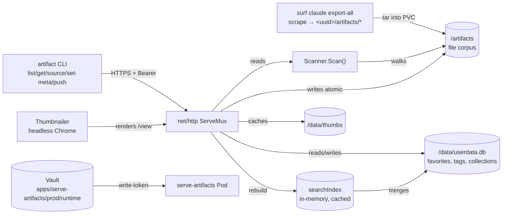

# serve-artifacts — Write API, Production Deployment, and the JSON Contract

`serve-artifacts` is a standalone Go server that serves Claude.ai artifacts (HTML and JSX) from a directory on disk. The earlier project note, [[PROJ - serve-artifacts - From Static Viewer to Searchable, Visual Gallery]], documented the system as a read-only gallery with a search index, a thumbnail subsystem, and a multi-user schema. Since then the project gained a mutating HTTP API, a CLI that speaks it, a production deployment on a k3s cluster with persistent volumes and Vault-backed auth, and — most recently — a fix to the error-response contract that makes the API usable by machine clients. This note is a deep-dive into those four additions: what they are, why they are shaped the way they are, and the failure modes they introduce or resolve.

The reference repository is `/home/manuel/code/wesen/2026-03-29--serve-claude-experiments`. The production deployment is `https://artifacts.yolo.scapegoat.dev`.

> [!summary]
> The project now has four load-bearing subsystems beyond the read gallery:
> 1. a **write API** (`POST /api/artifacts`, `PUT/PATCH /api/manifest/{name...}`) guarded by a shared bearer token, with collision-safe, transactional, path-traversal-proof writes;
> 2. an **`artifact` CLI** (`list`, `get`, `source`, `set-meta`, `push`) that speaks that API over a reusable connection section;
> 3. a **production topology** on Hetzner k3s — two PVCs, a Vault-injected write token, and an image → GHCR → GitOps-PR → ArgoCD delivery pipeline; and
> 4. a **JSON error contract** that the API now honors on every path, including 404s.

## Why this project exists

The corpus grows by accretion. Conversations in claude.ai produce deliverable artifacts (HTML and JSX files), and a bulk exporter (`surf claude export-all`) reconstructs them into a directory layout of `<uuid>/{conversation.md, conversation.json, meta.json, artifacts/*}`. The server's job is to make that corpus browsable, searchable, and — now — mutable from outside the filesystem, while keeping the single-binary, file-derived ethos that made it cheap to run locally.

A read-only gallery is sufficient while the corpus is small and curated by hand. It stops being sufficient when the corpus reaches hundreds of artifacts and is refreshed by an external scraper. The write API exists so that new artifacts can be pushed without shell access to the host; the CLI exists so that a human or a script can do the pushing without speaking raw HTTP; the production deployment exists so that the corpus persists across pod restarts and is recoverable if a node dies. The JSON error contract exists because a machine client cannot interpret Go's default `404 page not found` plaintext, and a confusing error response is, in practice, an outage.

## Architecture

The server is a single `net/http` process. Go 1.22's pattern-matching `ServeMux` routes requests to handlers. Two data stores back it: the file corpus at `/artifacts` (the source of truth for *what exists*) and a SQLite database at `/data/userdata.db` (the store for per-user mutations — favorites, tags, collections — that must not be served as artifacts). Thumbnails are rendered by a long-lived headless Chrome instance and cached on disk under `/data/thumbs`.



The diagram shows the two write paths into the corpus: the API (which validates, writes atomically, and rebuilds the index) and a direct filesystem write (the scraper streaming a tar into the PVC, which the index does not observe). The asymmetry between those two paths is the source of the most operationally important failure mode, documented below.

## The write API

The write API is a small surface: one endpoint to create or replace an artifact, and two to modify its manifest. The design decisions are in the validation, the locking, and the atomicity, not in the breadth of endpoints.

### Endpoints and the auth seam

The routes are registered in `pkg/server/server.go`:

```go
mux.HandleFunc("POST /api/artifacts", s.requireWrite(s.handleArtifactPush))
mux.HandleFunc("PUT /api/manifest/{name...}", s.requireWrite(s.handleManifestPut))
mux.HandleFunc("PATCH /api/manifest/{name...}", s.requireWrite(s.handleManifestPatch))
mux.HandleFunc("GET /api/source/{name...}", s.handleArtifactSource)
mux.HandleFunc("GET /api/artifact/{name...}", s.handleArtifactJSON)
mux.HandleFunc("GET /api/artifacts", s.handleSearch) // list == search
```

Reads are open. Every mutating endpoint is wrapped in `requireWrite`, which delegates to a single function, `authorize`:

```go
func (s *Server) authorize(r *http.Request, act action) error {
    if act != actionWrite {
        return nil
    }
    if s.writeToken == "" {
        return nil // unauthenticated writes (dev/local); startup logged a warning
    }
    presented := bearerToken(r)
    if presented == "" {
        return errors.New("missing write token (Authorization: Bearer <token>)")
    }
    if subtle.ConstantTimeCompare([]byte(presented), []byte(s.writeToken)) != 1 {
        return errors.New("invalid write token")
    }
    return nil
}
```

Three properties matter here. First, the token check is the *only* function a real identity provider would replace; routing and handlers do not change. Second, the comparison is constant-time, so a wrong token cannot be recovered by timing the response. Third, the behavior is conditional on whether a token is configured: when `SERVE_ARTIFACTS_WRITE_TOKEN` is unset, writes are open and a warning is logged at startup. This makes local development frictionless and production safe, but it means the deployment *must* set the token — an unauthenticated write API behind a public ingress is an outage waiting to happen.

The token is a shared secret, not per-user identity. It distinguishes "may write" from "may read," nothing finer. This is a deliberate stopping point: the multi-user schema already keys favorites and tags by a `user_id` column with a single hardcoded "default" user, so adding a real identity provider later is a localized change to `currentUser()` and `authorize`, not a schema migration.

### Path safety and the logical name

An artifact's stable identity is its `Name`: a slash path relative to the serve root, without extension (for example `46e60e1b-.../artifacts/CatgramIDE`). The push handler receives a name, a type, and source text, and must resolve that to a safe filesystem path. The single guard is `SafeArtifactPath` in `pkg/artifacts/writer.go`:

```go
func SafeArtifactPath(root, name, ext string) (string, error) {
    name = strings.TrimSpace(name)
    if name == "" || strings.HasPrefix(name, "/") {
        return "", ErrBadArtifactName
    }
    clean := path.Clean(name)
    if clean == "." || clean == ".." || strings.HasPrefix(clean, "../") {
        return "", ErrBadArtifactName
    }
    abs := filepath.Join(root, filepath.FromSlash(clean)+ext)
    rp, err := filepath.Rel(root, abs)
    if err != nil || rp == ".." || strings.HasPrefix(rp, ".."+string(filepath.Separator)) {
        return "", ErrBadArtifactName
    }
    return abs, nil
}
```

The function refuses empty and absolute names, cleans the relative name, and rejects any name whose cleaned form climbs above root. The final `filepath.Rel` check is defense in depth: even if the cleaning logic were bypassed, a resolved path that escapes root is rejected. The comment captures the non-obvious trap: prefixing the name with `/` before cleaning would *clamp* a traversal to root and hide it, which is why the cleaning happens on the relative form.

Names are extensionless logical keys throughout the server. A consequence, enforced in the push handler, is that `demo.html` and `demo.jsx` cannot coexist: the handler scans before writing and refuses a second type under the same key. This keeps the `Name` a true identity rather than a `(name, type)` pair.

### Collision safety and the transactional write

The push handler in `pkg/server/artifactapi.go` holds a process-wide write lock for the validate → write → rebuild sequence. The sequence, simplified:

```go
s.writeMu.Lock()
defer s.writeMu.Unlock()

abs, err := artifacts.SafeArtifactPath(s.dir, req.Name, ext) // 1. validate path
if err != nil { writeError(w, corpusStatus(err), err); return }

scanned, _ := s.scanner.Scan()                               // 2. detect collision
existing := findByName(scanned, req.Name)
if existing != nil && !req.Overwrite {
    writeError(w, http.StatusConflict, artifacts.ErrArtifactExists); return
}

artifacts.WriteFileAtomic(abs, []byte(req.Source))           // 3. write source
if req.Manifest != nil {
    artifacts.WriteManifest(manifestPath, req.Manifest)       // 4. write manifest
} else if oldManifestPath != "" && oldManifestPath != manifestPath {
    os.Rename(oldManifestPath, manifestPath)                  //    or move it along
}
if oldPath != "" { os.Remove(oldPath) }                       // 5. remove old source

s.index.rebuild()                                             // 6. rebuild index
w.WriteHeader(http.StatusCreated)
s.writeArtifactView(w, r, req.Name)                           // 7. respond
```

Two details earn their complexity. The first is `WriteFileAtomic`: it writes to `path.tmp`, then `os.Rename`s into place. A concurrent scan can never read a half-written file, because the rename is atomic on the filesystem. The second is the handling of an overwrite that *changes the artifact's extension* (replacing `widget.jsx` with `widget.html`). The old source and its manifest sidecar live at different paths than the new ones, so the handler writes the new files first, then removes the old source only after the replacement is safely on disk. If cleanup fails, the new files are rolled back so two artifacts can never share a logical key. The manifest, when the overwrite does not supply a new one, is renamed along with the source rather than left orphaned at the old path.

The lock is coarse — one mutex for the whole server — which is acceptable because writes are rare and the corpus is small. A finer-grained lock per logical name would allow concurrent pushes to different artifacts, but would also require the scanner and index rebuild to coordinate, and the throughput gain does not justify the complexity at this scale.

## The `artifact` CLI

The CLI lives in `cmd/serve-artifacts/cmds/`. It speaks the API over a thin client (`apiclient.go`) that centralizes the base URL and the bearer token. Each verb is a Glazed command composed from a shared `connection` section, so `--api` and `--token` are declared once:

```go
func newConnectionSection() (schema.Section, error) {
    return schema.NewSection(connectionSlug, "Server connection",
        schema.WithFields(
            fields.New("api", fields.TypeString, fields.WithDefault(""),
                fields.WithHelp("Server base URL (default $SERVE_ARTIFACTS_API or http://localhost:8080)")),
            fields.New("token", fields.TypeString, fields.WithDefault(""),
                fields.WithHelp("Bearer token for write access (default $SERVE_ARTIFACTS_TOKEN)")),
        ),
    )
}
```

The verbs map to endpoints: `list` to `GET /api/artifacts`, `get` to `GET /api/artifact/{name}`, `source` to `GET /api/source/{name}`, `set-meta` to `PUT`/`PATCH /api/manifest/{name}`, and `push` to `POST /api/artifacts`. The token falls back to the `SERVE_ARTIFACTS_TOKEN` environment variable, so a CI job or a script can export it once rather than pass it on every command.

The CLI's path construction for slash-bearing names is correct and worth noting because it is easy to get wrong. The helper splits the name on `/`, URL-escapes each segment, and rejoins with `/`:

```go
func artifactPath(prefix, name string) string {
    segs := strings.Split(name, "/")
    for i, s := range segs {
        segs[i] = url.PathEscape(s)
    }
    return prefix + strings.Join(segs, "/")
}
```

Go 1.22's `{name...}` wildcard matches the resulting path, and `r.PathValue("name")` returns the original name with slashes intact. The escaping is per-segment, so a `/` separator is never itself escaped, which is what allows the wildcard to match.

## Production deployment

The deployment moves the binary from a laptop to a stateful pod on a Hetzner k3s cluster. Three concerns dominate: persistence (the corpus and the user database must survive pod restarts), auth (the write token must not live in git), and delivery (code must become a running pod without manual kubectl).

### Topology

The Deployment runs one replica with two `local-path` RWO PVCs:

| PVC | Mount | Contents | Backed up |
|-----|-------|----------|-----------|
| `serve-artifacts-corpus` | `/artifacts` | the file corpus (source of truth) | yes, CronJob → object storage |
| `serve-artifacts-data` | `/data` | `userdata.db`, rendered thumbnails | yes, CronJob → object storage |

The strategy is `Recreate`, not `RollingUpdate`, because `local-path` volumes are node-local and RWO; a rolling update would try to mount the second PVC on a different node and fail. Recreating ensures the new pod lands where the data is. Headless Chrome gets a `/dev/shm` mount and elevated memory (~1 Gi) so thumbnail rendering does not OOM, and runs with `--no-sandbox` because it executes as root inside the container.

### The write token from Vault

The token that `authorize()` compares against is injected from Vault, not baked into the image. A `VaultStaticSecret` reads `write-token` from `kv/apps/serve-artifacts/prod/runtime` and renders it into a Kubernetes Secret named `serve-artifacts-runtime`, which the Deployment mounts as the environment variable `SERVE_ARTIFACTS_WRITE_TOKEN`. The bootstrap script `ttmp/2026/07/14/SERVE-20260714-DEPLOY--*/scripts/00-bootstrap-vault.sh` writes the token once:

```bash
vault kv patch "${KV_MOUNT}/${RUNTIME_PATH}" write-token="${TOKEN}" \
  || vault kv put "${KV_MOUNT}/${RUNTIME_PATH}" write-token="${TOKEN}"
```

Rotating the token is a Vault write plus a pod restart. No manifest changes, no image rebuild. Clients retrieve it the same way: `vault kv get -field=write-token kv/apps/serve-artifacts/prod/runtime`.

### The delivery pipeline

The pipeline is pre-existing and reused, not built for this project. A push to `main` triggers `.github/workflows/publish-image.yaml`, which builds the image, pushes it to `ghcr.io/wesen/2026-03-29--serve-claude-experiments:sha-<short>`, and opens a GitOps PR. The PR target is configured by `deploy/gitops-targets.json`:

```json
{
  "targets": [{
    "name": "artifacts-prod",
    "gitops_repo": "wesen/2026-03-27--hetzner-k3s",
    "manifest_path": "gitops/kustomize/artifacts/deployment.yaml",
    "container_name": "serve-artifacts"
  }]
}
```

Cross-repo write permission to the GitOps repo is a short-lived GitHub App installation token minted at run time: GitHub Actions authenticates to Vault via OIDC (`id-token: write`), reads the App's `app_id`/`private_key` from Vault, and `actions/create-github-app-token` mints an installation token scoped to the target repo. There is no long-lived PAT to rotate. ArgoCD auto-syncs the merged PR, which rewrites the `image:` field and recreates the pod.

## Provenance: the export `meta.json` ingest

An artifact on disk at `<uuid>/artifacts/<file>` is described by the `meta.json` two directories up. The scanner (`pkg/artifacts/scanner.go`) exploits that layout: when it finds a sibling `meta.json`, it enriches the artifact with the conversation's identity before applying any manifest overlay. The enriched fields are the conversation UUID and title, the project, the model, the creation and update timestamps, a transcript path, a `https://claude.ai/chat/<uuid>` link, and any reconstruction warnings.

The precedence is explicit and load-bearing: **manifest wins, then conversation `meta.json`, then values derived from the file itself**. This keeps existing manifest-annotated demos working unchanged while exported artifacts gain real titles. A push that writes a manifest with only `tags` set leaves the title to fall through to the conversation name — which is exactly why a tagging operation can add tags without clobbering a conversation-derived title.

One subtlety is the model field. An older export can carry a model identifier whose embedded release date is *after* the conversation's `updated_at`, which is implausible. The `plausibleModel` function suppresses such models:

```go
func plausibleModel(model, updatedAt string) string {
    m := modelDateSuffixRe.FindStringSubmatch(model)
    if m == nil || len(updatedAt) < 10 {
        return model
    }
    conv := strings.ReplaceAll(updatedAt[:10], "-", "") // YYYYMMDD
    if m[1] > conv {
        return ""
    }
    return model
}
```

A model dated after the conversation that supposedly used it cannot be the model that produced the artifact, so the field is cleared rather than shown. This is a data-quality guard, not a feature.

## The search index and the rebuild contract

The in-memory search index is the part of the system that most often surprises operators. It is a cache. It is rebuilt on startup, on watcher fsnotify events (only when `--watch` is enabled), and after every successful API write. It is *not* rebuilt on a plain filesystem write.

The rebuild function in `pkg/server/index.go` re-scans the directory, reads each artifact's source and transcript, and swaps the entry slice under a mutex:

```go
func (ix *searchIndex) rebuild() error {
    arts, err := ix.scanner.Scan()
    // ... build entries with haystack + hash + sortTime ...
    ix.mu.Lock()
    ix.entries = entries
    ix.mu.Unlock()
    return nil
}
```

Reads take an `RLock`; a rebuild swaps the slice under a `Lock`. The index is user-agnostic: per-user state (favorites, tags) is merged at read time via a `userView` carried per request, so the shared index never stores user data.

The footgun is the gap between the two write paths. Production runs `serve-artifacts serve --dir /artifacts --port 8080 --thumbs /data/thumbs --db /data/userdata.db` with no `--watch`. A file placed directly on the PVC by a sidecar or a scraper tar-stream is therefore invisible to the index until something triggers a rebuild. The blessed seed script (`scripts/01-seed-pvcs.sh`) avoids this by scaling the Deployment to zero and back up, so the new pod scans on startup. An incremental sidecar ingest that writes to the PVC without a restart leaves the new artifacts unlisted until an authenticated `POST /api/artifacts` happens to fire a rebuild.

This is not a bug in the index; it is a consequence of caching without a filesystem watcher in production. The correct fix is either to run production with `--watch` (fsnotify observes the PVC writes and rebuilds on change) or to expose a dedicated `POST /api/index/rebuild` endpoint so an ingest script can refresh the cache without pushing an artifact. Neither is implemented yet.

## The JSON error contract

The most recent change fixes a defect in the API's error contract. Every other API error is a JSON body `{"error": "..."}` with `Content-Type: application/json`, written by `writeError`. The 404 paths did not follow this contract. They called `http.NotFound(w, r)`, which is Go's default `ServeMux` handler and emits plaintext `404 page not found` with `Content-Type: text/plain`.

The defect had two consequences. First, a machine client decoding the response could not distinguish a normal "artifact not found" from a routing miss — both were the same opaque text. Second, and worse, the push and manifest handlers call `writeArtifactView` *after* a successful write and index rebuild; if that view lookup failed (because the just-written artifact was not found on a re-scan, a race with an external writer), the response was a plaintext 404 that *looked* like the write had failed, even though it had succeeded and the index had been rebuilt.

The fix introduces a single helper and replaces every `http.NotFound` call in the API handlers:

```go
func writeNotFoundJSON(w http.ResponseWriter, name string) {
    writeError(w, http.StatusNotFound, fmt.Errorf("artifact not found: %s", name))
}
```

After the fix, a missing-artifact response is:

```
HTTP/1.1 404 Not Found
Content-Type: application/json; charset=utf-8

{"error":"artifact not found: ghost"}
```

The CLI now surfaces `Error: 404 Not Found: artifact not found: ghost` instead of `Error: 404 Not Found: 404 page not found`. The name of the missing artifact is in the body, so the operator knows what was not found.

The regression test in `pkg/server/artifactapi_test.go` asserts the contract across the endpoints that can 404 — `GET /api/artifact/{name}`, `GET /api/source/{name}`, and `PATCH /api/manifest/{name}` — checking both the status code and the content type, and explicitly failing if the body contains the default-mux plaintext:

```go
if ct := resp.Header.Get("Content-Type"); !strings.HasPrefix(ct, "application/json") {
    t.Fatalf("%s: Content-Type = %q, want application/json (body=%q)", c.name, ct, body)
}
if strings.Contains(string(body), "404 page not found") {
    t.Fatalf("%s: got default-mux plaintext 404 (body=%q)", c.name, body)
}
```

The existing test had asserted only the status code, which is why the plaintext form slipped through for as long as it did. A status code is a necessary but not sufficient contract; the content type and body shape are the rest of it.

## Failure modes and the decisions that avoid them

| Failure mode | Cause | Mitigation in place |
|---|---|---|
| Path traversal via push | a crafted `name` escaping root | `SafeArtifactPath` cleans and re-checks the relative path |
| Half-written file served to a reader | a write interrupted mid-flush | `WriteFileAtomic` writes to a temp file and renames |
| Two artifacts sharing one logical key | an overwrite changes the extension | old source removed only after the new one is on disk; rollback on cleanup failure |
| Unauthenticated writes in production | `SERVE_ARTIFACTS_WRITE_TOKEN` unset behind a public ingress | the token is injected from Vault; startup logs a warning when unset |
| Long-lived GitOps PAT to rotate | a stored personal access token | GitHub App token minted per-run via Vault OIDC |
| Corpus lost on node death | `local-path` is node-local and unrecoverable | a CronJob backs both PVCs up to object storage off-node |
| Inconsistent SQLite backup | a live DB has `-wal`/`-shm` sidecars | backups use `sqlite3 ".backup"`, not a raw copy |
| Stale search index after a sidecar write | files placed on the PVC without an API write | *(not yet mitigated — see Open questions)* |
| Plaintext 404 confusing clients | `http.NotFound` in API handlers | `writeNotFoundJSON` returns the JSON error shape |

## Current project status

The write API, the CLI, and the production deployment are shipped and in use. The corpus at `https://artifacts.yolo.scapegoat.dev` holds 517 artifacts as of this writing, refreshed from a `surf claude export-all` scrape and tagged through the `set-meta` endpoint. The JSON-404 fix is committed (`bbf34d8`) and will deploy on the next push to `main` through the existing pipeline.

## Important project docs

- `/home/manuel/code/wesen/2026-03-29--serve-claude-experiments/README.md` — commands, routes, project structure.
- `ttmp/2026/07/13/SERVE-20260713-METASEARCH--ingest-export-metadata-and-search-discovery/design/01-export-metadata-ingest-and-search-analysis-design-and-implementation-guide.md` — the `meta.json` ingest and search design.
- `ttmp/2026/07/14/SERVE-20260714-DEPLOY--deploy-serve-artifacts-to-k3s-stateful-pvcs-seeding-write-token-secret-and-off-node-backups/design/01-deploying-serve-artifacts-to-k3s-analysis-design-and-implementation-guide.md` — the k3s deployment design, including the seed/restore runbook.
- `ttmp/2026/07/14/SERVE-20260714-DEPLOY--*/scripts/01-seed-pvcs.sh` — the one-time PVC seed script.
- Earlier vault note: [[PROJ - serve-artifacts - From Static Viewer to Searchable, Visual Gallery]].

## Open questions

- Should production run with `--watch`, or should a dedicated `POST /api/index/rebuild` endpoint exist, so that incremental sidecar ingests refresh the cache without pushing an artifact? Both close the stale-index gap; the watcher is simpler but adds fsnotify-on-PVC load, the endpoint is explicit but requires the ingest script to know about it.
- The write token is a shared secret, not per-user identity. When does that stop being enough — i.e., when do distinct writers need distinct credentials and audit trails?
- The CLI's `set-meta` writes a manifest sidecar; tags added this way are file-backed and travel with the corpus backup. Is that the right home for user-authored metadata, or should it migrate to the SQLite store alongside favorites and collections?

## Near-term next steps

- Push the JSON-404 fix to `main` so it deploys via the GitOps pipeline.
- Add a `POST /api/index/rebuild` endpoint (or enable `--watch` in production) and document the sidecar-ingest → rebuild sequence.
- Write an `ingest-export.sh` that wraps the scrape → push → rebuild flow end to end, so the operator sequence documented in this note is a single command.

## Project working rule

The corpus is the source of truth; the index is a cache; the API is the only write path that keeps them consistent. Any tool that writes to the corpus without going through the API (or without a follow-up rebuild) breaks that invariant, and the breakage is silent.
