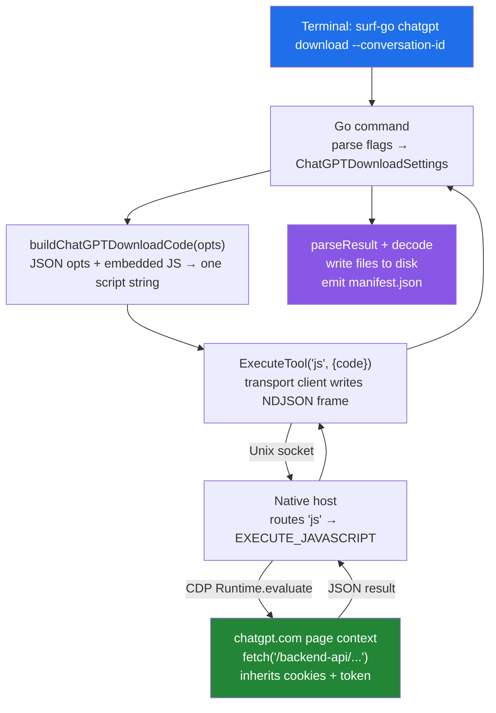

# surf-go ChatGPT File Downloader — Driving the Backend API Through the Page Context

This note documents the design and implementation of `surf-go chatgpt download`, a command that downloads every file linked in a ChatGPT conversation — user-uploaded inputs and code-interpreter output artifacts — by executing `fetch()` calls inside the logged-in chatgpt.com page. The command also produces transcripts via the same backend API path. The goal of this report is to make the architecture legible: to show why the work runs inside the page context rather than from Go, how the conversation tree is walked to find files, how a hard output-size cap forces chunked byte-range downloads, and how retry logic handles token expiry and rate limiting without a live network to test against.

The note is written for an engineer who already understands the surf execution path (terminal → Go → socket → host → extension → Chrome tab) and wants to understand how that path is reused to make authenticated backend API calls that ChatGPT's web UI never exposes as a button.

> [!summary]
> The project delivers one command (`surf-go chatgpt download`) with five operating modes, all backed by a single embedded JavaScript module:
> 1. **Two file categories are extracted from the conversation tree**: input attachments (`metadata.attachments`, `file-service://` pointers) and code-interpreter output artifacts (`sandbox:/mnt/data/` links in assistant text).
> 2. **The page context is the execution site**, not Go. The embedded JS runs inside chatgpt.com via the `js` tool, inheriting session cookies, the `Authorization` header, and Cloudflare clearance.
> 3. **A 900,000-character output cap forces chunked downloads**. Files larger than ~675 KB are fetched in HTTP byte ranges; the signed download URL is resolved once and cached across chunks.
> 4. **Retry logic handles 401/403/429** with token refresh and `Retry-After` honoring, verified by 18 unit tests (11 Go + 7 JS) because a live 429 could not be triggered.

## Why this project exists

ChatGPT conversations accumulate files. Users upload PDFs, images, and spreadsheets as input. The code interpreter generates CSVs, plots, and PDFs as output. DALL-E produces images. Custom GPTs attach documents. ChatGPT provides no "download all my files" control. The official data export is a single archive delivered by email after a delay, and it does not separate files by conversation.

A user with hundreds of conversations needs a deterministic, resumable way to pull every linked file into a local directory structure, organized by conversation, with a manifest recording what was retrieved. The command must also handle large files (multi-megabyte PDFs), token expiry mid-run, and rate limiting, because a bulk export of hundreds of conversations will issue thousands of requests over minutes or hours.

The constraint that shapes the entire design is authentication. ChatGPT's backend API at `/backend-api/...` is not a public API with a key. It authorizes requests using session cookies and an `accessToken` obtained from `/api/auth/session`. Both are present only inside a logged-in chatgpt.com browser tab. A Go process making direct HTTP requests would need to extract and replay those cookies, fight Cloudflare's bot detection, and replicate the browser's TLS fingerprint. Running JavaScript inside the page context sidesteps all of that: the page already has the cookies, the token, and the Cloudflare clearance. The `fetch()` calls made from page JS are indistinguishable from the calls ChatGPT's own frontend makes.

## The execution site decision

The central design decision is where the `fetch()` calls run. Three sites were considered: a Go HTTP client with exported cookies, a Node native-messaging host module, and the page context via the existing `js` tool.

A Go HTTP client was rejected. ChatGPT's backend sits behind Cloudflare, which fingerprints TLS connections and challenges non-browser clients. Extracting cookies from the browser and replaying them from Go would require constant maintenance of the TLS fingerprint and challenge-solving, and would break on any Cloudflare policy change.

A Node native-messaging host module was the original plan. A prototype (`native/chatgpt-files-client.cjs`) was written with 23 unit tests. This approach adds a new host message type, a new service-worker handler, and a new client module — three surfaces to maintain. It also duplicates the page-context advantage by proxying fetches through the extension's background script, which still needs the tab to be open and logged in.

The chosen approach reuses the existing `js` tool. The Go command embeds a JavaScript file with `//go:embed`, prepends a JSON options literal, and sends it to the host as an `EXECUTE_JAVASCRIPT` tool call. The host forwards it to the extension service worker, which evaluates it in the target tab via CDP `Runtime.evaluate`. The script runs inside chatgpt.com, calls `fetch()` directly, and returns a JSON result. No new host message type, no new service-worker handler, no new native module. The entire feature is Go code plus one embedded JS file.



The tradeoff is the output cap. CDP `Runtime.evaluate` returns the script's return value as a JSON string, and the surf socket protocol caps a single response at 900,000 characters. A file returned as base64 inflates by 4/3, so the practical limit is ~675 KB of raw bytes per call. This cap is the reason chunked download exists.

## The five operating modes

The embedded JavaScript module operates in five modes, selected by the `mode` field in the injected `SURF_OPTIONS` object. Each mode is a self-contained async function that returns a plain JSON-serializable object. The Go orchestrator calls these modes in sequence: list conversations (optional), extract file refs per conversation, then download each file.

| Mode | Purpose | Input options | Output |
|------|---------|---------------|--------|
| `list-conversations` | Paginate `/backend-api/conversations` | `limit`, `includeArchived`, `maxConversations`, `since` | `{conversations: [{id, title, update}], total}` |
| `extract` | Fetch one conversation, walk the tree, return all file refs | `conversationId` | `{title, conversationId, inputs: [...], outputs: [...]}` |
| `download` | Resolve one file's signed URL, fetch full bytes, return base64 | `fileType`, `fileId` or `conversationId`+`messageId`+`sandboxPath` | `{b64, size, fileId}` |
| `download-chunk` | Resolve URL (or reuse cached), fetch one byte range | same as download + `offset`, `chunkSize`, optional `downloadUrl` | `{b64, offset, length, total, done, downloadUrl}` |
| `transcript` | Fetch conversation, linearize tree, render Markdown | `conversationId` | `{transcript, turnCount, title}` |

The mode dispatch is a flat `if/else if` chain at the bottom of the script. Every mode except `list-conversations` requires a valid access token, so the script checks for one before dispatching and returns `{error: 'ChatGPT login required'}` if the token fetch fails.

## Token management and authenticated fetch

ChatGPT's backend API requires a bearer token. The token is not a static API key. It is an `accessToken` issued by `/api/auth/session` and embedded in the page's session. The embedded JS obtains it on demand and refreshes it when it expires.

```js
let _token = null;

async function getAccessToken() {
  const r = await fetch('/api/auth/session', { credentials: 'include' });
  if (!r.ok) return null;
  const j = await r.json();
  return j.accessToken || null;
}
```

The token is stored in a module-level mutable variable (`_token`) so that `authedFetch` can refresh it in place when a 401 or 403 is received. This is deliberate: the token has a finite lifetime, and a bulk download run that takes minutes will outlive a single token. Rather than pre-fetch and risk expiry, the code fetches lazily and refreshes reactively.

The `authedFetch` function wraps every backend API call with retry logic. It accepts the URL, ensures a token exists, then enters a retry loop bounded by `maxRetries` (default 4, configurable via `--max-retries`).

```js
async function authedFetch(url) {
  await ensureToken();
  let lastErr = null;
  for (let attempt = 0; attempt <= maxRetries; attempt++) {
    const r = await fetch(url, {
      credentials: 'include',
      headers: { Authorization: 'Bearer ' + _token },
    });
    if (r.status !== 401 && r.status !== 403 && r.status !== 429) {
      return r;
    }
    if (r.status === 401 || r.status === 403) {
      const fresh = await refreshToken();
      if (!fresh) {
        lastErr = { error: 'auth ' + r.status + ' (token refresh failed)' };
        continue;
      }
      lastErr = { error: 'auth ' + r.status + ' (will retry with fresh token)' };
      continue;
    }
    if (r.status === 429) {
      const retryAfter = r.headers.get('retry-after');
      let waitMs = retryAfter ? (parseInt(retryAfter, 10) || 0) * 1000 : 0;
      if (!waitMs) waitMs = Math.min(30000, 1000 * Math.pow(2, attempt));
      lastErr = { error: 'rate limited (429), waiting ' + waitMs + 'ms' };
      await new Promise(resolve => setTimeout(resolve, waitMs));
      continue;
    }
  }
  return {
    ok: false,
    status: 0,
    _surfError: lastErr ? lastErr.error : 'max retries exceeded',
    json: async () => ({ error: lastErr ? lastErr.error : 'max retries exceeded' }),
    arrayBuffer: async () => { throw new Error(lastErr ? lastErr.error : 'max retries exceeded'); },
  };
}
```

The retry loop handles three HTTP status codes. A 401 or 403 triggers a token refresh: the code calls `refreshToken()`, which re-fetches from `/api/auth/session`. If the refresh succeeds, the next loop iteration retries with the fresh token. If the refresh fails (the session itself is dead), the error is recorded and the loop continues to exhaust its attempts. A 429 triggers a wait: the code reads the `Retry-After` header and sleeps for that many seconds; if the header is absent, it falls back to exponential backoff (1s, 2s, 4s, 8s, capped at 30s). After exhausting retries, the function returns a synthetic response object with `ok: false` and `status: 0`, which the calling mode function interprets as an error.

A subtle correctness point concerns the `maxRetries` default. The Go side injects `maxRetries` as an integer into `SURF_OPTIONS`. The JS reads it with `Number.isFinite(options.maxRetries) ? Number(options.maxRetries) : 4`. This check is deliberate: `Number.isFinite(0)` returns `true`, so a user who passes `--max-retries 0` gets zero retries (one attempt only). The naive alternative — `options.maxRetries || 4` — would treat `0` as falsy and silently substitute `4`, defeating the purpose of the flag.

## Extracting file references from the conversation tree

The `extract` mode fetches one conversation's full JSON from `/backend-api/conversation/{id}` and walks its `mapping` tree to find every file reference. The conversation JSON has a `mapping` object keyed by node id, where each node has a `message` with `author.role`, `content.parts`, and `metadata.attachments`. The tree is not a linear list; it branches when the user edits and regenerates a message.

Two file categories are extracted, and they live in different parts of the message structure.

### Input files

Input files are attachments the user uploaded. They appear in two locations within a message node.

The first location is `metadata.attachments`, an array of objects with `file_id`, `name`, `mime_type`, and `size`. The extractor iterates this array and collects each `file_id`:

```js
const atts = meta.attachments || [];
for (const a of atts) {
  const fid = a.file_id || a.id;
  if (fid && !seenInput.has(fid)) {
    seenInput.add(fid);
    inputs.push({
      type: 'input', fileId: fid, name: a.name || null,
      mime: a.mime_type || null, size: a.size || null,
      messageId: mid, role: role,
    });
  }
}
```

The second location is inside `content.parts`, where image uploads appear as objects with an `asset_pointer` or `image_asset_pointer` property. The pointer is a string prefixed with `file-service://`, and the file id is the remainder:

```js
const FILE_PREFIX = 'file-service://';
for (const p of parts) {
  if (!p || typeof p !== 'object') continue;
  const ptr = p.asset_pointer || p.image_asset_pointer || (p.image_asset && p.image_asset.asset_pointer);
  if (typeof ptr === 'string' && ptr.startsWith(FILE_PREFIX)) {
    const fid = ptr.slice(FILE_PREFIX.length);
    if (!seenInput.has(fid)) { /* ... add to inputs ... */ }
  }
}
```

Both paths feed into a single `inputs` array. A `seenInput` set deduplicates by file id, because the same attachment can appear in both `metadata.attachments` and `content.parts` for the same message.

### Output files

Output files are artifacts produced by the code interpreter. They do not appear in `metadata`. They appear as `sandbox:/mnt/data/<filename>` links embedded in the assistant's text content. The extractor scans every string part in every assistant node with a regular expression:

```js
for (const p of parts) {
  if (typeof p !== 'string') continue;
  const matches = p.match(/sandbox:\/mnt\/data\/([A-Za-z0-9_.\-]+)/g) || [];
  for (const m of matches) {
    const fname = m.replace('sandbox:/mnt/data/', '');
    if (!seenOutput.has(fname)) {
      seenOutput.add(fname);
      outputs.push({
        type: 'output', name: fname,
        messageId: mid, sandboxPath: '/mnt/data/' + fname,
      });
    }
  }
}
```

The prefix `sandbox:` uses a single slash, not `sandbox://`. This was established by inspecting live conversation JSON. The regex captures only the filename characters (`[A-Za-z0-9_.\-]+`), excluding any path traversal or query string. A `seenOutput` set deduplicates by filename, because the same sandbox file can be referenced in multiple assistant turns.

### Why system nodes are skipped

The loop iterates every node in `mapping`, but nodes with `author.role === 'system'` are skipped. System nodes contain tool-call metadata and internal instructions; they do not contain user-visible file references, and including them would add noise. Only `user` and `assistant` nodes are processed for file extraction.

## The two-step download flow

ChatGPT's file download is a two-step process. The first call resolves a file reference into a short-lived signed URL. The second call fetches the actual bytes from that signed URL. The signed URL is same-origin (`chatgpt.com`), and the signature is in the query string, so the byte fetch requires no `Authorization` header.

### Input file download

Input files are resolved via `/backend-api/files/{file_id}/download`. This endpoint returns a JSON object with a `download_url` field:

```js
async function downloadInputFile(fileId) {
  const r = await authedFetch('/backend-api/files/' + fileId + '/download');
  if (r.status === 404) return { error: 'missing' };
  if (!r.ok) return { error: 'resolve ' + r.status };
  const j = await r.json();
  const dlUrl = j.download_url;
  if (!dlUrl) return { error: 'no download_url' };
  const br = await fetch(dlUrl);  // no auth header — signature in query string
  if (!br.ok) return { error: 'byte fetch ' + br.status };
  const buf = await br.arrayBuffer();
  return { b64: arrayBufferToBase64(buf), size: buf.byteLength };
}
```

A 404 on the resolve call means the file has been deleted from ChatGPT's storage. This is reported as `{error: 'missing'}` rather than thrown, so the Go orchestrator can record it in the manifest and continue with the next file.

### Output file download

Output files are resolved via a different endpoint: `/backend-api/conversation/{cid}/interpreter/download?message_id={mid}&sandbox_path={path}`. This endpoint also returns a JSON object with `download_url`, plus a `metadata.file_id` that the extractor records:

```js
async function downloadOutputFile(conversationId, messageId, sandboxPath) {
  const url = '/backend-api/conversation/' + conversationId +
    '/interpreter/download?message_id=' + messageId +
    '&sandbox_path=' + encodeURIComponent(sandboxPath);
  const r = await authedFetch(url);
  if (!r.ok) return { error: 'resolve ' + r.status };
  const j = await r.json();
  const dlUrl = j.download_url;
  if (!dlUrl) return { error: 'no download_url' };
  const br = await fetch(dlUrl);
  if (!br.ok) return { error: 'byte fetch ' + br.status };
  const buf = await br.arrayBuffer();
  return { b64: arrayBufferToBase64(buf), size: buf.byteLength, fileId: j.metadata && j.metadata.file_id };
}
```

The `sandbox_path` parameter is URL-encoded because it contains a leading slash (`/mnt/data/...`). Without encoding, the slash would be interpreted as a path separator in the query string.

## The chunked download path

The 900,000-character output cap is the hard constraint that forces chunked downloads. A file that fits under the cap is downloaded in a single `download` mode call. A file that exceeds it triggers a fallback to `download-chunk` mode, which fetches the file in HTTP byte ranges.

The Go orchestrator attempts the simple download first. If parsing the result fails — which happens when the base64 string is truncated by the cap — it falls back to chunked download:

```go
dlRes, err := parseChatGPTDownloadResult(resp)
if err != nil {
    // Fallback to chunked download for large files that exceed the output cap
    chunkOpts := map[string]any{
        "fileType": "input",
        "fileId":   ref.FileID,
    }
    written, chunkErr := downloadFileChunked(ctx, client, tabID, windowID, chunkOpts, dest, chunkSize, maxRetries)
```

The chunk size defaults to 500,000 bytes. Base64 inflates this to ~666,666 characters, which is safely under the 900,000-character cap. The `--chunk-size` flag lets the user tune this.

### The chunk loop

The `downloadFileChunked` function opens a file, then loops: build chunk options with the current offset, call the JS, decode the base64, write the bytes, advance the offset, repeat until `done`.

```go
var totalWritten int
var offset int64
var cachedDownloadURL string
for {
    chunkOpts := make(map[string]any, len(opts)+4)
    for k, v := range opts {
        chunkOpts[k] = v
    }
    chunkOpts["mode"] = "download-chunk"
    chunkOpts["offset"] = offset
    chunkOpts["chunkSize"] = chunkSize
    if cachedDownloadURL != "" {
        chunkOpts["downloadUrl"] = cachedDownloadURL
    }

    code, err := buildChatGPTDownloadCode(chunkOpts, maxRetries)
    resp, err := ExecuteTool(ctx, client, "js", map[string]any{"code": code}, tabID, windowID)
    chunk, err := parseChatGPTChunkResult(resp)

    if cachedDownloadURL == "" && chunk.DownloadURL != "" {
        cachedDownloadURL = chunk.DownloadURL
    }
    data, err := base64.StdEncoding.DecodeString(chunk.B64)
    f.Write(data)
    totalWritten += len(data)
    offset += chunk.Length
    if chunk.Done || chunk.Length == 0 {
        break
    }
}
```

### URL caching across chunks

The signed download URL is resolved once on the first chunk and reused for all subsequent chunks. This is the `cachedDownloadURL` variable. On the first iteration, `cachedDownloadURL` is empty, so the JS calls `resolveDownloadUrl` and returns the URL in its response. The Go side captures it:

```go
if cachedDownloadURL == "" && chunk.DownloadURL != "" {
    cachedDownloadURL = chunk.DownloadURL
}
```

On subsequent iterations, `cachedDownloadURL` is non-empty, so the Go side injects it into `chunkOpts["downloadUrl"]`. The JS `downloadChunk` function checks for this and skips resolution:

```js
let downloadUrl = opts.downloadUrl;
if (!downloadUrl) {
  const resolved = await resolveDownloadUrl(opts);
  if (resolved.error) return resolved;
  downloadUrl = resolved.downloadUrl;
}
```

This caching matters for two reasons. First, it avoids redundant API calls: a 5 MB file downloaded in 10 chunks would otherwise resolve the URL 10 times. Second, it reduces the risk of the signed URL expiring mid-download. Signed URLs have a finite lifetime (typically minutes); resolving once and reusing immediately means the URL is fresh for the duration of the chunk sequence.

### HTTP Range headers

Each chunk fetch uses the HTTP `Range` header to request a byte slice:

```js
const rangeEnd = offset + chunkSize - 1;
const br = await fetch(downloadUrl, {
  headers: { Range: 'bytes=' + offset + '-' + rangeEnd },
});
if (!br.ok && br.status !== 206) return { error: 'byte fetch ' + br.status };
```

A successful range request returns `206 Partial Content`. The total file size is parsed from the `Content-Range` response header (`bytes 0-499999/573006`), which tells the Go side when to stop:

```js
const contentRange = br.headers.get('content-range') || '';
let total = 0;
const m = contentRange.match(/\/(\d+)/);
if (m) total = parseInt(m[1], 10);
```

If `Content-Range` is absent (some CDN configurations omit it), the code falls back to `offset + bytes.length`, which is correct for all chunks except the last. This fallback is safe because the `done` flag is also set when `offset + bytes.length >= total`, and a missing `Content-Range` on the last chunk means `total` equals `offset + bytes.length`, making the condition true.

## Conversation listing and bulk export

The `--all-conversations` flag paginates through `/backend-api/conversations` and downloads files from every conversation. The listing is server-side paginated with `offset` and `limit` parameters:

```js
let url = '/backend-api/conversations?offset=' + offset + '&limit=' + limit + '&order=updated';
if (includeArchived) url += '&is_archived=true';
```

The loop fetches pages until `offset >= total` or an empty page is returned. Each conversation item has `id`, `title`, and `update_time`. Three filters narrow the list:

- `--max-conversations N` stops after N conversations (useful for testing).
- `--include-archived` adds `is_archived=true` to the query (the default excludes archived conversations).
- `--since YYYY-MM-DD` filters client-side by checking if `update_time` starts with the date string. This is a prefix match, not a full timestamp comparison, because ChatGPT's `update_time` is a Unix timestamp and the filter is applied to the ISO date prefix.

Between conversations, `--rate-limit-ms` inserts a delay. This is a courtesy to the backend during bulk exports that issue thousands of requests. The delay is applied only between conversations, not between files within a conversation.

```go
for ci, conv := range conversations {
    convResult := runChatGPTDownloadOneConversation(...)
    result.Conversations = append(result.Conversations, convResult)
    if s.RateLimitMs > 0 && ci < len(conversations)-1 {
        time.Sleep(time.Duration(s.RateLimitMs) * time.Millisecond)
    }
}
```

## Resumability and the manifest

A bulk export of hundreds of conversations can be interrupted. The `--skip-existing` flag makes the download resumable: before downloading a file, the Go side checks if the destination path already exists and has non-zero size. If so, the file is marked `skipped` and the download is skipped entirely.

```go
if skipExisting {
    if info, err := os.Stat(dest); err == nil && info.Size() > 0 {
        dl.Status = "skipped"
        dl.Size = int(info.Size())
        return dl
    }
}
```

The check is `os.Stat`, not a database lookup. This means resumability works even if the manifest is lost or corrupt — the filesystem is the source of truth. The tradeoff is that a partially-written file (interrupted mid-download) would be falsely detected as complete. The chunked download path mitigates this: if the simple download fails and the chunked download is interrupted, the partial file is overwritten on the next run because `downloadFileChunked` opens the file with `os.Create` (truncating).

After all conversations are processed, a `manifest.json` is written to the output directory. The manifest records the start time, output directory, per-conversation results (with input/output counts and any errors), the full file list, and the total file count. The manifest is the durable record of what was downloaded, what was skipped, and what failed.

## File naming and path safety

Downloaded files are organized into per-conversation subdirectories. The conversation id (a UUID) is sanitized to a directory name: path separators and control characters are replaced with underscores, and the name is clamped to 64 characters.

Input files use a collision-free naming scheme that combines the sanitized filename with a short file-id suffix:

```go
func safeDestPath(outputDir, name, fileID string) string {
    shortID := fileID
    if len(shortID) > 8 {
        shortID = shortID[len(shortID)-8:]
    }
    safe := sanitizeFileName(name)
    if safe == "" {
        safe = "file-" + shortID
    }
    return filepath.Join(outputDir, safe+"-"+shortID)
}
```

The short id is the last 8 characters of the file id. This suffix prevents collisions when two conversations reference files with the same name, and it preserves enough of the file id to trace a downloaded file back to its ChatGPT origin. Output files use their sandbox filename directly, because sandbox filenames are already unique within a conversation.

The `sanitizeFileName` function replaces `/` and `\` with `_`, strips control characters, and clamps long names to 80 characters while preserving the extension:

```go
func sanitizeFileName(name string) string {
    safe := strings.Map(func(r rune) rune {
        if r == '/' || r == '\\' { return '_' }
        if r < 0x20 { return -1 }
        return r
    }, name)
    if len(safe) > 80 {
        dot := strings.LastIndex(safe, ".")
        if dot > 60 {
            ext := safe[dot:]
            safe = safe[:80-len(ext)] + ext
        } else {
            safe = safe[:80]
        }
    }
    return strings.TrimSpace(safe)
}
```

The extension preservation check (`dot > 60`) ensures that the extension is only preserved if it starts after position 60. If the extension would be in the first 60 characters (a pathologically long extension), the name is simply truncated.

## The transcript mode

The `transcript` mode was added to the download script and is invoked by the `chatgpt transcript` command with `--from-api`. It fetches the same conversation JSON as `extract` mode, but instead of walking the tree for file references, it linearizes the tree into chronological message order and renders Markdown.

The linearization walks from `current_node` back to the root, building an ordered array:

```js
const mapping = j.mapping || {};
const currentNode = j.current_node;
const ordered = [];
const visited = new Set();

function walkBack(nodeId) {
    if (!nodeId || visited.has(nodeId)) return;
    visited.add(nodeId);
    const node = mapping[nodeId];
    if (!node) return;
    if (node.parent) walkBack(node.parent);
    ordered.push(node);
}
walkBack(currentNode);
```

This recursive walk follows `parent` pointers from the current node to the root, pushing each node onto the array after visiting its parent. The result is a chronologically ordered list of message nodes. An additional pass catches any nodes not reachable from `current_node` (an edge case where the tree has disconnected branches).

Each message is rendered with a turn number, role, message id, model slug, and content. Text parts are rendered as-is. Image uploads render as `[image: <pointer>]`. Code interpreter execution outputs render as fenced code blocks. The `is_visually_hidden_from_conversation` flag is checked to skip deleted messages.

This API-based transcript mode is more reliable than DOM scraping. The DOM-based transcript (the default for `chatgpt transcript`) depends on the rendered page structure, which changes with ChatGPT's UI updates. The API-based mode reads the canonical conversation JSON, which is stable.

## Testing at two layers

The retry logic and parsing functions are tested at two layers: Go unit tests for the parsing and orchestration logic, and a standalone JavaScript test for the `authedFetch` retry loop.

### Go unit tests

Eleven Go tests in `chatgpt_download_test.go` exercise the pure functions with no browser and no socket. They cover:

- **Parsing**: `parseChatGPTChunkResult` (with downloadUrl for URL caching, done flag, error), `parseChatGPTDownloadResult` (success + error), `parseChatGPTExtractResult` (inputs + outputs), `parseChatGPTListConversationsResult` (with update field).
- **Code generation**: `buildChatGPTDownloadCode` (maxRetries injection + default behavior when `maxRetries` is 0).
- **Path helpers**: `safeDestPath` (name + no-name + path separators), `sanitizeFileName` (empty, separators, control chars, length clamping with extension preservation), `sanitizeDirName`.
- **Serialization**: `chatGPTDownloadedFile` JSON marshaling, `chatGPTConversationResult` Files field always serializing as `[]` not `null`.

The serialization test for the Files field is a defensive guard. A nil slice marshals to `null` in Go's `encoding/json`, while an empty slice marshals to `[]`. The `chatGPTConversationResult` struct initializes `Files: []chatGPTDownloadedFile{}`, so a conversation with no downloaded files produces `"files": []` in the manifest, not `"files": null`. This matters for downstream consumers that parse the manifest and expect an array.

### JavaScript retry tests

Seven JavaScript tests in `test-429-retry.cjs` mock `fetch` to return controlled responses and verify the `authedFetch` retry loop without a real ChatGPT session:

| Test | Mock sequence | Verifies |
|------|---------------|----------|
| 429 then success | 429, 200 | Retries once and succeeds |
| 429 with Retry-After | 429 (5s), 429 (3s), 200 | Honors Retry-After, retries twice |
| 429 max retries | 429 × 5 | Fails gracefully after 4 retries |
| 401 then refresh | 401, 200 | Refreshes token and succeeds |
| No retry on success | 200 | Makes exactly 1 call |
| No retry on 404 | 404 | Returns 404 without retrying |
| maxRetries=0 | 429 | Makes exactly 1 call (no retries) |

A live 429 could not be triggered during development. Three methods were attempted: 30 sequential requests, 50 parallel requests, and 100 parallel requests. None produced a 429. ChatGPT does not rate-limit authenticated browser sessions at the volumes tested. The mock-based test is the verification path: it exercises every branch of the retry loop with deterministic inputs.

The JavaScript test duplicates the `authedFetch` logic rather than importing it from the embedded script. This is because the embedded script uses top-level `await` and `return` statements, which are valid in the page-context evaluation but prevent the file from being `require()`d as a CommonJS module. The test's copy of `authedFetch` must be kept in sync with the production code manually. Extracting `authedFetch` into a separate importable module would eliminate this duplication.

## The Go orchestration layer

The Go side is responsible for everything except the page-context fetch calls: flag parsing, option marshaling, socket transport, response parsing, file I/O, manifest generation, and output formatting. The orchestration follows a consistent pattern across all five modes.

### Option injection

The `buildChatGPTDownloadCode` function marshals a Go map to JSON, prepends it as a `SURF_OPTIONS` constant, and concatenates the embedded script:

```go
func buildChatGPTDownloadCode(opts map[string]any, maxRetries int) (string, error) {
    if opts == nil {
        opts = map[string]any{}
    }
    if maxRetries <= 0 {
        maxRetries = 4
    }
    opts["maxRetries"] = maxRetries
    b, err := json.Marshal(opts)
    if err != nil {
        return "", fmt.Errorf("marshal download options: %w", err)
    }
    return fmt.Sprintf("const SURF_OPTIONS = %s;\n%s", string(b), chatGPTDownloadScript), nil
}
```

The `maxRetries` value is injected into every opts map, not just download modes, because the `list-conversations` and `extract` modes also call `authedFetch` and need the retry bound. The default of 4 applies when `maxRetries` is 0 or negative, matching the JS-side `Number.isFinite` check.

### Response parsing

Every mode's response is parsed by a dedicated function (`parseChatGPTExtractResult`, `parseChatGPTDownloadResult`, etc.) that follows the same shape: check for an error with `extractErrorText`, extract the text from `result.content[].text` with `parseResult`, then JSON-decode into a typed struct. The parsing functions handle both the case where the host returns structured data (a map) and where it returns a text string, because the host's response shape varies depending on whether the script returned an object or a string.

### Dual output mode

The command implements both `cmds.GlazeCommand` (structured rows) and `cmds.WriterCommand` (Markdown), the same dual-mode pattern used by other surf-go verbs. Without `--with-glaze-output`, the writer path runs and prints a human-readable summary. With it, the glaze path runs and the standard Glazed flags (`--output json`, `--fields`) apply. The `chatGPTDownloadResultToRows` function adapts the result to rows, with three cases: conversation list (when `--list` + `--all-conversations`), file inventory (when `--list` on a single conversation), and downloaded files (the default).

## Repository paths

The implementation lives under `go/` in the surf-cli repository at `/home/manuel/code/others/llms/pi/nicobailon/surf-cli`.

- `go/internal/cli/commands/chatgpt_download.go` — the Go command, orchestration, parsing, and file I/O
- `go/internal/cli/commands/chatgpt_download_test.go` — 11 Go unit tests
- `go/internal/cli/commands/scripts/chatgpt_download.js` — the embedded JavaScript module (all five modes)
- `go/internal/cli/commands/chatgpt_transcript.go` — the transcript command, which reuses `buildChatGPTDownloadCode` for `--from-api` mode
- `go/cmd/surf-go/main.go` — command registration
- `go/internal/cli/commands/base.go` — `BuildToolRequest`, `ExecuteTool` (shared transport helpers)
- `go/internal/cli/commands/format.go` — `parseResult`, `extractErrorText` (shared response helpers)

The investigation diary, design document, and test scripts are in the ticket directory `ttmp/2026/07/21/SURF-CHATGPT-FILE-DOWNLOAD-2026-07-21--download-all-files-linked-in-chatgpt-discussions/`.

## Key points

- The page context is the execution site because ChatGPT's backend API authorizes with session cookies and a short-lived `accessToken` that exist only inside a logged-in chatgpt.com tab. Reusing the `js` tool avoids Cloudflare fingerprinting, cookie extraction, and a new host message type.
- Two file categories are extracted from the conversation tree: input attachments (`metadata.attachments` and `file-service://` pointers in `content.parts`) and output artifacts (`sandbox:/mnt/data/` links in assistant text). They use different download endpoints.
- The 900,000-character output cap forces chunked downloads for files larger than ~675 KB. The signed download URL is resolved once on the first chunk and cached in Go, then injected into subsequent chunk calls to skip re-resolution.
- Retry logic handles 401/403 (token refresh) and 429 (`Retry-After` or exponential backoff). The `maxRetries` default uses `Number.isFinite` on the JS side to correctly handle `--max-retries 0`, avoiding the `0 || 4` truthiness trap.
- Resumability is filesystem-based: `--skip-existing` checks `os.Stat` for a non-zero file at the destination path. The filesystem is the source of truth, not the manifest, so resumability works even if the manifest is lost.
- The `transcript` mode linearizes the conversation tree by walking from `current_node` to the root via `parent` pointers, producing a chronologically ordered message list. This API-based transcript is more stable than DOM scraping.

## Open questions

- Does ChatGPT issue 429 responses at higher request volumes than tested (30, 50, 100 parallel requests)? The retry logic is verified by mock tests but has not been exercised against a real rate limit. A bulk export of 500+ conversations might reveal the actual threshold.
- How should `image_asset_pointer` entries be handled for DALL-E images? The extractor records them as input files, but DALL-E images may use a different download path than user-uploaded images. This has not been tested against a conversation containing DALL-E outputs.
- Should the API-based transcript mode become the default for `chatgpt transcript`, replacing DOM scraping? The DOM-based mode depends on rendered page structure, which changes with UI updates. The API mode reads stable JSON. The migration would remove a maintenance burden but would lose the `--with-activity` thought-trace expansion, which depends on DOM interaction.
- Should `downloadFileChunked` verify the total bytes written against the `total` field from the chunk response? Currently it trusts the `done` flag, which is set when `offset + bytes.length >= total`. A checksum or size verification would detect silent truncation.

## Near-term next steps

- Extract `authedFetch` into a separate importable JS module to eliminate the duplication between the production script and the test copy.
- Add `--conversation <id>` to the transcript command for consistency with the download command (currently transcript uses `--conversation-id` only).
- Test against conversations containing DALL-E images and code-interpreter plots to validate `image_asset_pointer` handling end-to-end.
- Add size verification to `downloadFileChunked`: compare `totalWritten` against the `total` from the final chunk response and report a mismatch as an error.

## Related notes

- [[PROJ - Surf CLI - ChatGPT Transcript Extraction]] — the earlier DOM-based transcript extraction work; this project's `--from-api` mode is the API-based successor
- [[PROJ - surf-go Freelancer Verbs - Browser-Side Command Deep Dive]] — the browser-side verb pattern that this command follows: Go orchestration + embedded JS + dual output mode
- [[Tribal/goja-embedding-in-go]] — the Go+JavaScript embedding pattern, relevant to understanding why the JS is embedded rather than shipped as a separate file

## Project working rule

> [!important]
> Run every `fetch()` inside the page context. The page holds the session cookies, the access token, and the Cloudflare clearance; replicating these from Go is not worth the maintenance cost.
> When a response cap forces chunking, resolve the signed URL once and cache it across chunks rather than re-resolving per chunk.
