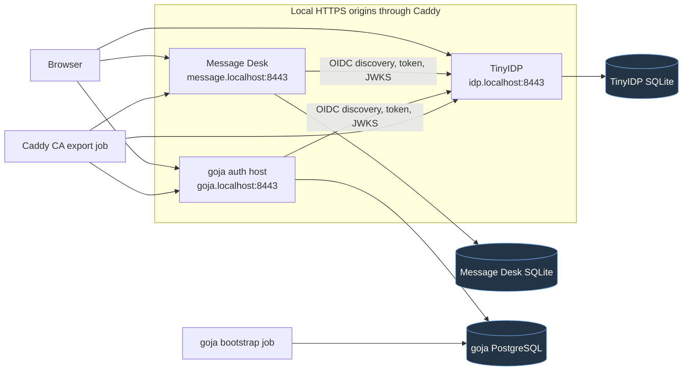

# tiny-idp: Professional Signup and Application Membership Invitations

This report explains the invitation system developed across `tiny-idp` and `go-go-goja` to support real multi-user applications without turning the identity provider into an application authorization database. The implementation has two invitation types, two durable stores, two transaction boundaries, and one browser journey. JavaScript defines application policy and presentation. Native Go owns bearer secrets, identity binding, persistence, concurrency, and atomic state transitions.

The work is tracked by `TINYIDP-INVITES-001` in:

```text
/home/manuel/workspaces/2026-07-07/prod-tiny-idp/tiny-idp/
  ttmp/2026/07/21/
    TINYIDP-INVITES-001--professional-signup-invitations-and-application-membership-invitations/
```

The ticket design, task list, changelog, and implementation diary are the detailed source record. This note presents the same work as a coherent technical chapter: what the system is, why its boundaries exist, how the implementation works, what local execution proved, and what remains before production deployment.

> [!summary]
> - TinyIDP signup invitations authorize identity creation for one OIDC client. Application membership invitations authorize one application user to join one organization with a stored role. They are intentionally separate.
> - TinyIDP consumes its invitation in the same SQLite transaction that creates the identity, password credential, browser session, workflow terminal state, and authorization result. go-go-goja consumes its capability in the same application transaction that inserts membership.
> - A raw application invite is exchanged for a short-lived opaque pending handle before OIDC navigation. The handle survives registration and callback; the raw bearer token does not.
> - Local Phase 5 testing has proven open Message Desk signup, invite-gated goja signup, OIDC continuation, verified-email denial without consumption, verified-user membership creation, replay rejection, and durable bootstrap. The final audit-query correction and identity-binding hardening are being completed locally. No k3s deployment is part of this phase.

## 1. The product requirement

One TinyIDP instance serves two applications with different admission rules.

Message Desk permits open account creation. A visitor can start registration from Message Desk, create a TinyIDP identity, return through the OIDC authorization callback, and obtain a Message Desk application session. Message Desk does not require an invitation to create the identity.

The go-go-goja example has two independent restrictions:

1. Creating a new TinyIDP identity through the goja OIDC client requires a TinyIDP signup invitation scoped to that client.
2. Joining the application's organization requires a separate application membership invitation issued by an authorized organization administrator.

The distinction is not a UI preference. It follows from authority and data ownership.

| Decision | Authority | Durable state | Atomic result |
| --- | --- | --- | --- |
| May this browser create a TinyIDP identity for this client? | TinyIDP | durable signup invitation, identity, credential, provider session | identity created and signup invite consumed |
| May this authenticated application user join organization `o1` as `viewer`? | goja application | application capability, app user, tenant, membership, pending handle | membership created and app invite consumed |

An OIDC identity is not an application membership. OIDC establishes who authenticated. The relying party still decides what that authenticated user may access.

This invariant is enforced in the go-go-goja host: OIDC normalization may create or update an application user mapping, but it does not grant tenant membership. Membership is created only by the explicit invitation acceptance transaction.

## 2. System components and ownership

The local system contains four long-running services and two one-shot initialization services.



### 2.1 TinyIDP

TinyIDP is an OpenID Connect provider. It owns:

- local identity records and stable OIDC subjects;
- password credentials;
- provider browser sessions;
- authorization interactions and consent;
- authorization codes, grants, signing keys, and OIDC token issuance;
- scripted signup workflow continuations;
- TinyIDP account-creation invitations; and
- TinyIDP security and audit events.

TinyIDP does not own organization IDs, application roles, application resources, or application memberships.

### 2.2 Message Desk

Message Desk is an OIDC relying party and application. It owns its own application session and messages. It starts provider registration with:

```text
GET /auth/register?return_to=/
  -> /authorize?...&tinyidp_signup=1
```

The shared TinyIDP signup program sees client ID `tinyidp-message-app` and presents an open signup form without `invite_code`.

### 2.3 The go-go-goja auth host

The generated goja host is another relying party. It owns:

- normalized application users linked to OIDC issuer and subject;
- tenants, resources, and memberships;
- application capabilities;
- short-lived pending membership-invite handles;
- application sessions and CSRF tokens; and
- tenant-queryable application audit records.

Its HTTP route policy is authored in JavaScript, but native host services implement authentication, authorization, capability storage, membership transactions, OIDC verification, and audit persistence.

### 2.4 Caddy and trusted-proxy listener mode

Caddy terminates local TLS. Each Go service listens for HTTP only on its private network and accepts forwarded public-origin metadata solely from the configured Caddy subnet. This preserves one canonical HTTPS origin per service while keeping certificate handling at the proxy.

The applications do not pretend their public issuer or callback is plain local HTTP. Public OIDC URLs remain:

```text
https://idp.localhost:8443
https://message.localhost:8443/auth/callback
https://goja.localhost:8443/auth/callback
```

Caddy's local public root is exported into a separate read-only volume. Its CA private key remains in the Caddy data volume. Message Desk and goja use the exported root for verified backchannel OIDC requests.

## 3. Why two invitation systems are required

A TinyIDP signup invitation and an application organization invitation have different subjects, audiences, payloads, and completion conditions.

```text
TinyIDP signup invitation
  audience: OIDC client ID
  effect: create identity and credential
  role data: none
  store: TinyIDP SQLite
  consumed by: TinyIDP signup transaction

Application membership invitation
  audience: application organization/resource
  effect: create application membership
  role data: application-owned closed role
  store: application PostgreSQL or SQLite
  consumed by: application membership transaction
```

Combining the two records would produce several invalid dependencies:

- TinyIDP would need to understand application tenant and role semantics.
- An application would need authority to mutate identity-provider signup state directly.
- Revocation ownership would be ambiguous.
- A single record would imply atomicity across two independently operated databases.
- A shared TinyIDP could no longer serve applications with distinct membership models cleanly.

The browser may experience the two operations as one sequence, but the system keeps two commits. The result is a retryable saga, not a distributed transaction.

## 4. The TinyIDP durable signup invitation

### 4.1 Stored record and secret boundary

The durable record is defined under `tiny-idp/pkg/idpstore`. It contains an invitation ID, audience, policy version, expiry, revocation/redemption timestamps, and a keyed lookup hash. It does not contain the raw code.

The raw code is generated by the operator command and returned once. `pkg/idpinvite/durable.go` derives the stored lookup value with HMAC-SHA-256 and a dedicated domain separator. A leaked database is therefore insufficient to test guessed codes without the operator-managed lookup key.

The production server receives that lookup key through:

```text
--invitation-lookup-key-file=/state/.secrets/invitation_lookup_key
```

Startup requires the key only when the compiled signup program declares a durable invitation provider. A program that uses open signup does not acquire an irrelevant secret dependency. A program that declares durable lookup cannot start with the service missing.

### 4.2 Operator issuance and revocation

The implementation adds narrow Glazed-backed administrative commands:

```bash
tinyidp admin --db=/state/tinyidp.sqlite invitation issue \
  --audience=goja-auth-host-demo \
  --policy-version=signup-invite-v1 \
  --ttl=1h \
  --lookup-key-file=/state/.secrets/invitation_lookup_key \
  --output=json
```

The issue command returns the raw code once together with non-secret metadata. Revocation requires an owner-only file containing the raw code. There is no list endpoint that can recover active bearer tokens.

The administrative boundary is intentionally small. The first delivery does not add an invitation campaign system, email delivery pipeline, or administrator web UI.

### 4.3 JavaScript policy and native capability binding

The shared program is in:

```text
tiny-idp/pkg/idpsignup/invite_required_signup.js
tiny-idp/examples/tinyidp-shared-two-apps/open-signup.js
```

The program declares one capability and one durable provider:

```javascript
program.capabilities({
  "invitation.lookup": { version: 1 }
});

program.provider("invitation", "signup", {
  version: 1,
  state: "durable",
  replayProtection: "one_time",
  revocation: "durable",
  handlers: { validate: validateInvitation }
});
```

The provider lambda receives an invocation-scoped input and calls a narrow native capability:

```javascript
const decision = await ctx.cap.invitation.lookup({
  code: ctx.input.inviteCode || ""
});

return decision.valid
  ? A.result.complete()
  : A.result.deny("invitation.rejected");
```

JavaScript cannot select an arbitrary invitation audience. Native Go binds lookup to the OIDC client that owns the current authorization interaction. JavaScript receives a safe decision, not the database record, code hash, transaction, or lookup key.

### 4.4 Per-client signup presentation

One program serves both applications:

```javascript
const fields = [
  A.field.displayName(),
  A.field.email(),
  A.field.password(),
  A.field.passwordConfirmation()
];

if (ctx.input.clientId === "goja-auth-host-demo") {
  fields.push(A.field.inviteCode());
}

return ctx.present.form({
  title: "Create an account",
  resume: "submitted",
  fields,
  actions: [A.action.submit(), A.action.deny()],
  carry: {},
  expiresInSeconds: 300
});
```

This is policy execution, not richer configuration syntax. The lambda selects fields and later chooses an outcome. Native workflow code renders the page, validates bounded descriptors, stores an explicit continuation, receives the browser POST, and invokes the named resume handler in a fresh runtime turn.

No Goja VM, goroutine, or Promise remains suspended while the browser is idle. The durable continuation identifies the workflow, resume handler, bindings, expiry, and program generation. Browser time and process lifetime are therefore independent of JavaScript runtime lifetime.

### 4.5 Inspect before commit

Invitation validation is non-consuming. A user can submit an invalid password, encounter a duplicate login, or lose the browser continuation without spending a valid invitation.

The submission sequence is:

```text
parse public fields and opaque secret handles
validate required fields
invoke declared invitation provider without consuming
attach trusted invitation evidence to this invocation
invoke signup.submitted
validate returned closed effect plan
commit all native effects in one TinyIDP transaction
```

The JavaScript commit request is data only:

```javascript
return ctx.commit.signup({
  login: ctx.input.email,
  displayName: ctx.input.displayName,
  password: ctx.secret.password,
  passwordConfirmation: ctx.secret.passwordConfirmation,
  inviteCode
});
```

Password values are invocation-scoped secret handles. JavaScript does not receive plaintext password strings that it can retain or serialize.

### 4.6 Atomic signup commit

`tiny-idp/internal/fositeadapter/scripted_signup.go` is the sole native commit boundary. Its transaction is conceptually:

```text
BEGIN TinyIDP transaction
  consume loaded workflow continuation conditionally
  write prepared identity
  write password credential
  redeem signup invitation conditionally, when requested
  create provider browser session
  approve and consume authorization interaction
COMMIT
```

The invitation redemption predicate requires the expected audience and rejects expired, revoked, or already redeemed records. Concurrent submissions can inspect the same invitation, but only one conditional redemption can commit. If any later write fails, the transaction rolls back the identity, credential, session, interaction state, continuation state, and invitation redemption together.

This prevents both prohibited partial results:

- an invitation is not spent without an account;
- an invite-gated account is not created while the invitation remains reusable.

## 5. Application membership invitations

### 5.1 Capability record

go-go-goja already had a durable capability service. A capability contains:

- a random raw token returned once;
- a stored SHA-256 token hash;
- a purpose such as `org.invite.accept`;
- optional subject binding;
- resource type and resource ID;
- bounded string claims, including invited email and role;
- expiry, single-use, used, and revoked state; and
- creator and creation time.

The generated route issues a capability only after native session authentication, organization resource resolution, CSRF verification, and `org.member.invite` authorization:

```javascript
app.post("/orgs/:orgId/invites")
  .auth(express.user().required())
  .resource(express.resource("org").idFromParam("orgId").mustExist())
  .csrf()
  .allow("org.member.invite")
  .audit("org.invite.issued")
  .handle((ctx, res) => {
    const org = ctx.resource("org");
    const email = String((ctx.body || {}).email || "").trim();

    const issued = auth.capabilities.issue("org.invite.accept")
      .resource("org", org.id)
      .tenantId(org.id)
      .claimString("email", email)
      .claimString("role", "viewer")
      .ttlSeconds(900)
      .singleUse(true)
      .createdBy(ctx.actor.id)
      .run();

    res.json({
      token: issued.token,
      capabilityId: issued.capability.id,
      expiresAt: issued.capability.expiresAt
    });
  });
```

The application role comes from the stored capability. Acceptance does not accept a role, tenant, email, or user ID from request data.

### 5.2 Why the old acceptance path was incomplete

The earlier example consumed an application capability and returned its claims. It did not require an authenticated user and did not create membership. That sequence could spend the invite without granting the authorization the invite promised.

The new `membershipinvite.Service` gives JavaScript one narrow operation while native SQL owns the transaction.

```javascript
const accepted = auth.membershipInvites
  .acceptPending(ctx.body.pending || "")
  .actor(ctx.actor.id)
  .run();
```

The actor ID is injected from the authenticated route context. Native SQL reloads the application user before making any decision.

### 5.3 Verified-email and subject binding

An invitation must bind to an identity. The native acceptance path supports two bindings:

- An email-bound invitation requires `email_verified=true` on the normalized OIDC identity and a case-insensitive match against the stored invited email.
- A subject-bound invitation requires the stored application subject/user identifier to match the authenticated application actor.

If both bindings are present, both must match. If neither binding is present, acceptance fails. This prevents a malformed or legacy capability from becoming an unrestricted bearer-only organization grant.

The closed error set includes:

```text
ErrUnauthenticated
ErrIdentityBinding
ErrEmailUnverified
ErrEmailMismatch
ErrSubjectMismatch
ErrRoleNotAllowed
```

Email and subject binding address different operator situations. Email binding can identify an intended person before they have an application user ID, but it requires a trusted email verification source. Subject binding is suitable when the application already knows the exact principal.

### 5.4 Atomic membership acceptance

The application transaction uses the same SQL connection and database as users, tenants, memberships, capabilities, and pending handles.

```text
BEGIN application transaction
  SELECT pending handle FOR UPDATE
  reject used or expired pending record
  SELECT capability FOR UPDATE
  reject wrong purpose, resource, expiry, revocation, or prior use
  SELECT authenticated application user
  reject disabled user
  validate every declared identity binding
  validate stored role against {viewer, member, admin}
  SELECT tenant and reject missing/disabled tenant
  INSERT or restore membership
  UPDATE capability SET used_at = now WHERE used_at IS NULL
  UPDATE pending SET used_at = now WHERE used_at IS NULL
COMMIT
```

The SQL implementations support SQLite and PostgreSQL. Tests cover:

- verified matching email;
- unverified and mismatched email;
- subject match and mismatch;
- missing identity binding;
- invalid stored role;
- membership-write rollback when capability consumption fails;
- one winner under concurrent acceptance;
- pending-handle replay; and
- retry after correcting a denied identity condition.

No sequence of independently committing `AddMembership` and `ConsumeCapability` calls can provide these guarantees. The operation must own one transaction over both records.

## 6. Pending handles and OIDC continuation

### 6.1 Removing the raw token from navigation

The application accepts the raw organization token at a public landing operation:

```text
POST /org-invites/begin
```

`Begin` validates the capability, generates a fresh random handle, stores only `Hash(handle)`, and limits its expiry to the earlier of fifteen minutes or the underlying capability expiry.

The response contains local navigation targets:

```json
{
  "orgId": "o1",
  "role": "viewer",
  "registrationUrl": "/auth/register?return_to=%2F%3Fpending%3D...",
  "loginUrl": "/auth/login?return_to=%2F%3Fpending%3D..."
}
```

After this exchange, the raw capability does not need to appear in browser history, OIDC state, application session claims, analytics, or logs.

### 6.2 Login and registration are separate intentions

The goja host exposes both:

```text
GET /auth/login
GET /auth/register
```

Both use the same native OIDC implementation:

- random state;
- random nonce;
- PKCE verifier and S256 challenge;
- server-side transaction storage;
- exact callback validation;
- code exchange;
- discovery and JWKS verification;
- issuer, audience, nonce, and subject validation; and
- application session creation.

Registration adds only `tinyidp_signup=1` to the authorization request. It does not duplicate callback or token validation logic.

`return_to` is accepted only as a local absolute path. Empty, absolute external, and scheme-relative targets fall back to the configured post-login path. The pending handle travels inside this safe local return target while the OIDC `state` remains an independent unpredictable correlation token.

### 6.3 Complete sequence

```mermaid
sequenceDiagram
    participant U as Browser
    participant A as goja application
    participant P as Application PostgreSQL
    participant I as TinyIDP
    participant D as TinyIDP SQLite

    U->>A: POST /org-invites/begin {raw app token}
    A->>P: validate app capability; store Hash(pending)
    A-->>U: registrationUrl/loginUrl with opaque pending handle

    U->>A: GET /auth/register?return_to=/?pending=...
    A->>P: store OIDC state, nonce, verifier, local return_to
    A-->>U: 302 TinyIDP /authorize + tinyidp_signup=1

    U->>I: GET /authorize
    I->>D: create authorization interaction + signup continuation
    I-->>U: render client-specific signup form
    U->>I: POST identity, password, TinyIDP invite code
    I->>D: atomic identity + credential + invitation + session commit
    I-->>U: consent when required, then authorization code

    U->>A: GET /auth/callback?code=...&state=...
    A->>P: atomically consume OIDC transaction
    A->>I: token exchange + ID token verification data
    A->>P: normalize app user; create app session
    A-->>U: 302 /?pending=...

    U->>A: POST /org-invites/accept + session CSRF
    A->>P: atomic binding check + membership + capability/pending use
    A-->>U: organization and role result
```

### 6.4 Cross-database failure semantics

TinyIDP and the application cannot share one ACID transaction. If TinyIDP successfully creates the identity but application acceptance fails, the identity remains valid and the application invitation remains unused.

This is an intentional recovery state:

```text
TinyIDP transaction committed
application transaction denied or failed
  => identity exists
  => app capability unused
  => pending handle unused until expiry
  => user can correct identity state or sign in again and retry
```

Consuming the application invitation before authentication would create the opposite partial state: access spent without a principal that can receive it. The implemented order avoids that result.

## 7. Email verification is a real boundary

The current password-only TinyIDP signup program records the submitted address as the user's login and email, but it does not claim ownership verification. Its OIDC token therefore contains `email_verified=false`.

An email-bound application invite must reject that identity. Accepting it would treat possession of an invitation code and the ability to type an address as proof of control over that address.

The local acceptance suite proves the boundary in two separate cases:

1. A newly registered goja user completes invite-gated TinyIDP signup and returns with the pending application invite, but application acceptance returns `403` because the email is unverified. Retrying returns the same denial and the app capability remains unused.
2. A deterministic local fixture `invitee@example.test` has `email_verified=true` and no initial organization membership. The same application flow logs that user in, creates exactly one `viewer` membership, consumes the application capability and pending handle, and rejects replay.

This is not a substitute for production email confirmation. A production path for pre-identity email invitations needs one of the following:

- TinyIDP's existing email-code challenge workflow bound to a real mail-delivery service; or
- a separately trusted upstream identity source that truthfully supplies a verified email claim.

Subject-bound invitations avoid email verification only when the application already knows the exact principal. They do not solve pre-account email ownership.

## 8. Local Compose implementation

The Phase 5 environment lives at:

```text
tiny-idp/examples/tinyidp-shared-two-apps/
```

Its important files are:

| File | Responsibility |
| --- | --- |
| `compose.yaml` | Caddy, TinyIDP, Message Desk, PostgreSQL, goja host, CA export, and bootstrap topology |
| `open-signup.js` | shared open/invite-gated signup policy |
| `clients.json` | exact redirect and logout registrations for both relying parties |
| `themes.json` | per-client TinyIDP presentation catalog |
| `message-desk.css` | Message Desk identity-page theme |
| `goja-auth.css` | goja identity-page theme |
| `bootstrap.sql` | deterministic tenant, resource, admin app user, and admin membership |
| `scripts/00-init-secrets.sh` | local-only owner-readable secret initialization |
| `scripts/01-export-browser-ca.sh` | export only Caddy's public local root |
| `scripts/02-smoke.sh` | readiness and OIDC redirect smoke checks |
| `scripts/03-browser-acceptance.py` | full browser-protocol Phase 5 acceptance |

### 8.1 Local secret handling

The initialization script creates three gitignored files with mode `0600`:

```text
runtime/secrets/local-admin-password.txt
runtime/secrets/local-invitee-password.txt
runtime/secrets/invitation-lookup.key
```

Docker Compose bind-mounted secrets retain host ownership that the unprivileged TinyIDP process cannot necessarily read. The image entrypoint therefore starts as root, copies only `/run/secrets/*` into `/state/.secrets`, applies directory mode `0700`, file mode `0400`, changes state ownership to the dedicated `tinyidp` identity, and then drops privileges with `setpriv` before executing TinyIDP.

This keeps runtime files readable only by the service identity while avoiding a permanently root-running provider.

### 8.2 Deterministic application bootstrap

The goja database must contain an administrator before anyone can issue the first organization invite. `bootstrap.sql` creates:

- application user corresponding to TinyIDP issuer `https://idp.localhost:8443` and subject `local-admin`;
- external identity mapping;
- tenant `o1`;
- organization resource `o1`;
- project resource `p1`; and
- active `admin` membership for the deterministic application user ID.

The ID is derived by the same OIDC user-ID algorithm used by the host:

```text
user:oidc:BxKqq4eDe_cf6-nOKK9OhbnF55jWpLExKN-4vSqptXU
```

The one-shot bootstrap container waits until the generated host has applied its schemas, then runs the idempotent PostgreSQL transaction. Bootstrap is an explicit deployment operation; ordinary OIDC login does not grant the first administrator role.

### 8.3 Local fixtures

Two email-verified TinyIDP accounts are created idempotently at service startup:

```text
admin@example.test   / local-admin-password-2026!
invitee@example.test / local-invitee-password-2026!
```

The administrator has the bootstrapped goja membership. The invitee has no initial application membership. Both credentials are local-only fixtures generated into gitignored runtime files and are not production defaults.

## 9. Browser-level acceptance

The acceptance script uses Python's standard library, separate cookie jars, the exported Caddy CA, and normal HTTPS requests. It follows redirects across all three origins, parses the first rendered HTML form, preserves hidden interaction/continuation/CSRF values, submits browser forms with the correct origin, and reproduces the same JSON/CSRF calls made by the checked-in frontend.

The seven acceptance stages are:

1. Create a random Message Desk identity through open signup and verify an authenticated Message Desk session.
2. Log the administrator into goja and issue an email-bound application invitation.
3. Issue a one-time TinyIDP signup invitation, create a new goja identity, complete consent and callback, and verify that the opaque pending handle returns to the application.
4. Attempt application acceptance twice as the unverified new identity and verify both denials leave the capability unused.
5. Attempt a second TinyIDP signup with the already consumed signup code and verify a stable field-level rejection.
6. Issue a new app invitation for the verified invitee, log in, accept it, verify exactly one active viewer membership, and reject both pending-handle and raw-token replay.
7. Query tenant-scoped application audit and TinyIDP audit for the exact capability and invitation IDs created in the current run.

The script does not write bearer codes to disk. It invokes Docker Compose for operator issuance and read-only database/audit assertions.

## 10. Defects found by local execution

The local stack exposed integration defects that package tests did not reveal. Each failure clarified a system contract.

### 10.1 Docker secret permissions

The first TinyIDP container failed with:

```text
cannot open /run/secrets/local_admin_password: Permission denied
```

Host mode `0600` is correct for the local secret file, but the bind-mounted owner did not match the container's unprivileged UID. The entrypoint copy-and-drop sequence described above fixed the runtime ownership boundary without broadening host permissions.

### 10.2 Staged JavaScript route builders

The generated goja host initially exited with:

```text
TypeError: Object has no member 'handle' at demo (/sites.js:115:12(202))
```

The Goja-facing Express builder has explicit stages:

```text
RouteNeedsSecurity
  .auth(...) -> RouteNeedsPolicy

RouteNeedsPolicy
  .resource(...)
  .csrf(...)
  .audit(...)
  .rateLimit(...)
  .allow(action) -> RouteNeedsHandler

RouteNeedsHandler
  .csrf(...)
  .audit(...)
  .rateLimit(...)
  .handle(fn)
```

Two new authenticated routes had omitted `.allow(...)`, so `.audit(...)` returned a policy-stage object that intentionally had no `handle`. Both routes now use `allow("user.self.read")` to establish that any authenticated application user may resume or submit their own pending invitation. The native membership service still performs the decisive identity and invitation checks.

### 10.3 Consent is a separate post-signup form

The first browser driver assumed a successful signup POST would immediately return to the application. TinyIDP correctly committed the identity and then rendered a separate consent form. The audit already contained:

```text
script.signup.invocation outcome_commit
account.self_registration accepted
```

The driver now advances bounded post-authentication IDP prompts only when the form contains no credential or signup fields. Redisplayed login/signup forms remain failures rather than being masked as consent.

### 10.4 Replay denial uses HTTP 400 with a rendered form

Reusing a consumed TinyIDP signup code renders the themed signup form with a field-level message and HTTP `400`, not `200`. The test now asserts both the status and the generic text:

```text
This value could not be accepted.
```

The response does not distinguish missing, expired, revoked, wrong-audience, or already-used bearer codes to an unauthenticated browser.

### 10.5 Successful app acceptance was not tenant-queryable

The native membership service recorded a successful `org.invite.accepted` event with resource type and ID, but it omitted `ResourceRef.TenantID`. The SQL row existed, yet `/orgs/o1/audit` correctly filtered it out because `tenant_id` was empty.

The correction sets both resource ID and tenant ID to the accepted organization. A focused test records a successful acceptance into an audit memory sink and asserts that the resulting record is queryable as tenant `o1`.

This defect demonstrates why an audit test must query through the operator-facing filter. Verifying only that some row exists is weaker evidence than verifying that the intended administrator can retrieve it through the supported API.

## 11. Security invariants

The implementation is organized around invariants rather than nominal endpoint success.

### 11.1 Secret invariants

- Raw TinyIDP and application invitation tokens are returned once and stored only as hashes.
- The TinyIDP lookup hash is keyed with a dedicated operator-managed key.
- Passwords do not enter JavaScript as strings.
- OIDC codes, tokens, session cookies, CSRF values, and invitation tokens are excluded from audit attributes.
- The raw application invite leaves navigation after the `Begin` exchange.

### 11.2 Authority invariants

- TinyIDP client audience comes from the validated authorization interaction, not JavaScript input.
- Application actor identity comes from the authenticated session, not request JSON.
- Organization and role come from the stored capability, not acceptance JSON.
- OIDC user normalization never grants membership.
- The first organization administrator is created by explicit deployment bootstrap.

### 11.3 Transaction invariants

- TinyIDP identity creation and signup-invite redemption commit together.
- Application membership, app-capability consumption, and pending-handle consumption commit together.
- Inspecting an invitation never reserves or consumes it.
- Denied identity binding leaves the application invitation retryable.
- Concurrent single-use attempts have one winner.

### 11.4 Browser invariants

- Login and registration are distinct entry routes.
- OIDC state, nonce, and PKCE verifier are generated independently.
- `return_to` is local-only.
- Unsafe session-authenticated application POSTs require the host session's CSRF token.
- No Goja runtime remains alive across a browser wait.

## 12. What JavaScript controls, and what it cannot control

The project deliberately uses JavaScript as an executable policy layer rather than a configuration-file replacement.

TinyIDP JavaScript can:

- branch on the validated OIDC client ID;
- choose form fields and actions;
- invoke declared provider capabilities;
- evaluate returned safe evidence;
- choose present, deny, challenge, or commit outcomes allowed by its declaration; and
- request a closed sequence of native effects.

go-go-goja route JavaScript can:

- declare route security, resources, CSRF, action, and audit intent;
- choose application response presentation;
- call narrow native capability and membership operations; and
- sequence login/registration navigation.

JavaScript cannot:

- receive a SQL connection or transaction;
- choose an invitation audience from browser input;
- mark email as verified;
- create a membership by passing arbitrary user, organization, or role fields;
- commit only half of a multi-record operation;
- access lookup keys or stored token hashes; or
- preserve a live VM as durable workflow state.

The resulting seam keeps workflows composable while preserving reviewable native primitives.

## 13. Implementation phases and commit map

The implementation proceeded in five local phases after the initial design inventory.

| Phase | Result | Primary commit/evidence |
| --- | --- | --- |
| 0 | Trust boundaries and existing primitive inventory | ticket design and diary |
| 1 | Production durable invitation lookup, key binding, issue/revoke commands | tiny-idp `c984bfd` |
| 2 | Shared open/invite-required signup program, denial rendering, lifecycle/concurrency/rollback tests | tiny-idp `c984bfd` |
| 3 | Native atomic membership acceptance, verified identity binding, PostgreSQL bootstrap | go-go-goja `7761bdd`; local `bootstrap.sql` |
| 4 | Hashed pending handles, `/auth/register`, OIDC `return_to`, retryable saga | go-go-goja `41cc3f6` |
| 5 | Local TLS Compose stack and browser acceptance | current local working tree and `03-browser-acceptance.py` |

The Phase 5 source changes are intentionally local at this report snapshot. k3s and GitOps are deferred until the local definition of done passes completely.

## 14. How to run and inspect the local system

From the TinyIDP repository:

```bash
cd /home/manuel/workspaces/2026-07-07/prod-tiny-idp/tiny-idp

./examples/tinyidp-shared-two-apps/scripts/00-init-secrets.sh
docker compose -f examples/tinyidp-shared-two-apps/compose.yaml up --build -d
./examples/tinyidp-shared-two-apps/scripts/01-export-browser-ca.sh
./examples/tinyidp-shared-two-apps/scripts/02-smoke.sh
./examples/tinyidp-shared-two-apps/scripts/03-browser-acceptance.py
docker compose -f examples/tinyidp-shared-two-apps/compose.yaml ps -a
```

Useful logs:

```bash
docker compose -f examples/tinyidp-shared-two-apps/compose.yaml \
  logs -f proxy idp message-desk goja-auth postgres goja-bootstrap
```

Public local URLs:

```text
https://message.localhost:8443
https://goja.localhost:8443
https://idp.localhost:8443
```

Open `idp.localhost/authorize` only through a relying-party login or registration action. A direct request without client ID, redirect URI, state, nonce, response type, scope, and PKCE parameters is expected to return an OAuth protocol error.

## 15. Current limits and production implications

### 15.1 Email delivery and confirmation

TinyIDP already contains email challenge and explicit continuation primitives, but the production command does not yet bind a real mailer. Password-only signup therefore cannot support successful pre-identity email-bound membership acceptance without another trusted verification source.

This limit is enforced, not hidden. The local new-account path demonstrates the correct denial and retry state.

### 15.2 Invitation delivery

The operator currently receives raw codes through CLI output and can deliver them out of band. There is no SMTP invitation delivery, templating system, campaign quota, or admin dashboard in the initial scope.

### 15.3 Rate limiting

General registration and host rate limiting exist, but invitation-specific budgets should be reviewed before public deployment. Lookup and `Begin` endpoints can otherwise become online guessing surfaces even when their browser errors are coarse.

### 15.4 Audit vocabulary

Both route-level and service-level audit can produce `org.invite.accepted` events representing authorization, handler completion, native denial, or native completion. The records are useful today, but a production dashboard should distinguish route enforcement from domain transition without relying only on outcome strings.

### 15.5 Deployment is intentionally deferred

No k3s change should precede a fully passing local browser acceptance run. The later deployment phase must supply:

- Vault-backed lookup keys and fixture replacement;
- PostgreSQL migration/bootstrap ordering;
- ConfigMap-mounted reviewed signup program;
- exact HTTPS issuer, callback, and logout registrations;
- Traefik trusted-proxy CIDRs;
- health/readiness probes;
- persistent volumes and backup policy; and
- GitOps manifests/PRs.

None of those deployment bindings should alter the invitation core's semantics.

## 16. Review guide

A reviewer should read the implementation in this order.

### TinyIDP

1. `pkg/idpinvite/durable.go` for code hashing, inspection, and caller-owned transaction redemption.
2. `pkg/idpsignup/invite_required_signup.js` for per-client policy.
3. `internal/cmds/serve_production.go` for capability/effect allowlisting and lookup-key construction.
4. `internal/fositeadapter/scripted_signup.go` for the atomic signup commit.
5. `internal/cmds/admin_invitation.go` for operator issuance and revocation.

### go-go-goja

1. `pkg/gojahttp/auth/membershipinvite/membershipinvite.go` for service contract and domain audit.
2. `pkg/gojahttp/auth/membershipinvite/sqlstore/sqlstore.go` for locking, identity binding, membership write, and conditional consumption.
3. `pkg/xgoja/providers/hostauth/hostauth.go` for the JavaScript module boundary.
4. `pkg/gojahttp/auth/oidcauth/oidcauth.go` for login/registration and local return targets.
5. `examples/xgoja/21-generated-host-auth/verbs/sites.js` for application route policy.

### Local deployment

1. `examples/tinyidp-shared-two-apps/compose.yaml` for process/network/secret ownership.
2. `bootstrap.sql` for initial authority.
3. `scripts/03-browser-acceptance.py` for the executable product contract.
4. Ticket `tasks.md` and `reference/01-investigation-diary.md` for completion state and chronological failures.

The most important review questions are:

- Can any request field select actor, tenant, role, verification state, or invitation audience after native validation?
- Can either invitation be consumed without its promised durable result?
- Can either promised durable result commit without consuming its required invitation?
- Does every failed binding or database operation leave a documented retry or terminal state?
- Can raw bearer material enter logs, URLs after landing, audit attributes, or recoverable storage?
- Does the operator-facing tenant audit retrieve the domain completion record, not merely route-level events?

## 17. Validation commands

Focused TinyIDP tests:

```bash
go test ./pkg/idpinvite ./pkg/idpsignup ./internal/fositeadapter ./internal/cmds -count=1
```

Focused go-go-goja tests:

```bash
go test ./pkg/gojahttp/auth/membershipinvite/... \
  ./pkg/gojahttp/auth/oidcauth \
  ./pkg/xgoja/hostauth -count=1
```

Repository phase-boundary tests:

```bash
go test ./...
golangci-lint run -v
```

Local product verification:

```bash
./examples/tinyidp-shared-two-apps/scripts/02-smoke.sh
./examples/tinyidp-shared-two-apps/scripts/03-browser-acceptance.py
```

The browser acceptance result is the decisive Phase 5 gate because it spans public TLS origins, cookies, form continuations, consent, OIDC callback validation, both databases, CSRF, membership authorization, replay handling, and audit retrieval.

## 18. Project status at this report snapshot

Phases 0 through 4 are implemented. The local stack starts successfully, its bootstrap job commits, and its public readiness/login smoke checks pass. The browser acceptance script has demonstrated the first six functional stages end to end.

The last Phase 5 failure identified a missing tenant association on the native successful membership audit event. The working-tree correction and focused regression test are in place. Identity binding is also being tightened so a capability with neither verified email nor subject binding fails natively. The next action is to rebuild the local goja image, rerun all seven acceptance stages, commit the go-go-goja hardening, then commit the Compose/test/ticket batch and run the final task-by-task completion audit.

No k3s or GitOps deployment is included in the current goal.

## Related notes

- [[PROJECT REPORT - tiny-idp - Standalone Docker OIDC Message Desk|tiny-idp: From an Embedded Provider to a Standalone Docker OIDC Service]]
- [[PROJECT REPORT - tiny-idp - Stylable Login and Consent UI|tiny-idp: Stylable Login and Consent UI]]
- [[PROJECT REPORT - tiny-idp - Multi-Account Browser Sessions and Logout Scopes|tiny-idp: Multi-Account Browser Sessions and Logout Scopes]]
- [[PROJECT REPORT - tiny-idp - Production Embedding API and Release Hardening|tiny-idp: Production Embedding API and Release Hardening]]
- [[PROJECT REPORT - tiny-idp - Model Checking and Executable State Assurance|tiny-idp: Model Checking and Executable State Assurance]]
- [[PROJECT REPORT - go-go-goja - Personal Inbox Auth, Programmatic Access, and Device Login|go-go-goja: Personal Inbox Auth, Programmatic Access, and Device Login]]
- [[ARTICLE - tinyidp - From Mock OIDC Provider to Reusable Auth Test Fixture|tinyidp: From Mock OIDC Provider to Reusable Auth Test Fixture]]

## Project working rule

> [!important]
> Keep identity creation and application authorization in separate authority domains. Let JavaScript compose declared policy and workflow decisions. Keep bearer-secret handling, identity binding, concurrency control, and durable multi-record commits inside narrow native operations. Prove the complete behavior locally before adding deployment infrastructure.
