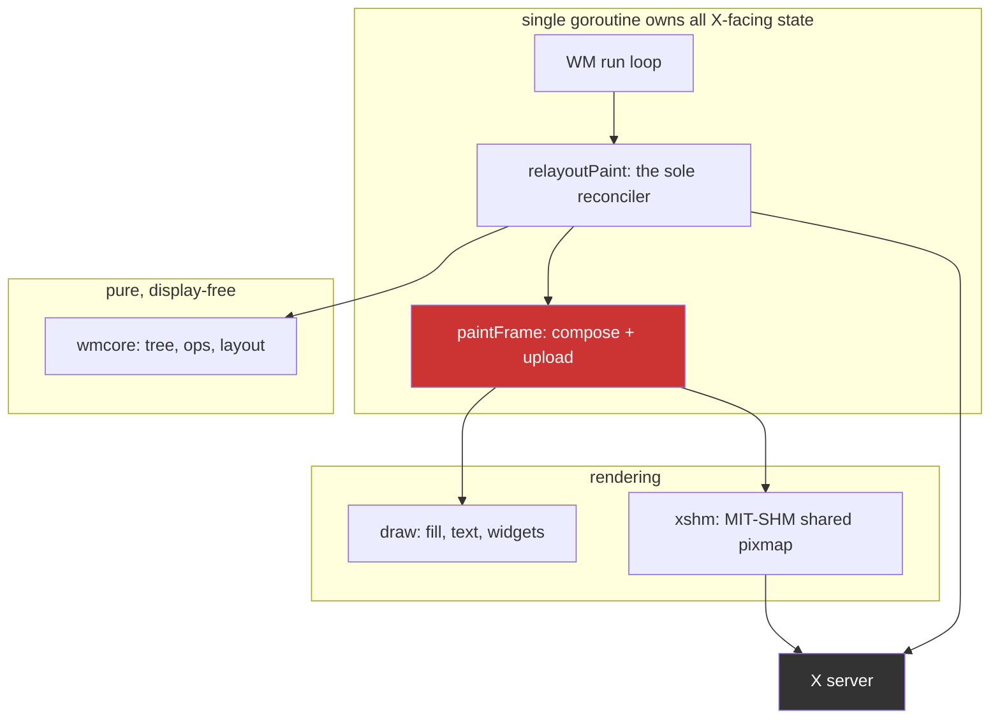
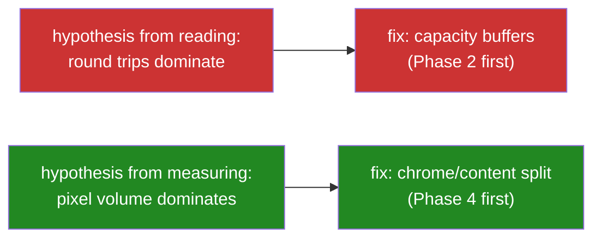

# Measuring Before Optimizing: An X11 Window Manager Resize Path

This note records what happened when a carefully reasoned performance analysis met a measurement. Three external review documents, roughly 8,700 lines between them, agreed on why dragging a divider in the `go-go-wm` window manager felt slow. A verification pass against the live code produced a fourth diagnosis that contradicted all three and looked better than any of them. Ninety seconds of running the actual system refuted the fourth diagnosis as well.

The engineering content is specific to X11 and to one Go window manager. The transferable content is a failure mode: reading code produces hypotheses that are mechanically correct and causally wrong, and no amount of additional reading distinguishes the two.

> [!summary]
> - Three successive diagnoses each refuted the one before it. Only direct decomposition of the cost terminated the regress.
> - An A/B between two implementations does not isolate a component — it swaps a bundle. That inference error cost one full round of wrong conclusions.
> - Final result: **4.8× faster per paint** on MIT-SHM, **3.5×** on the PutImage fallback, with the largest single win coming from an observation none of three review documents contained.
> - A nested `Xephyr` server turns "needs a spare console and a human" into a tool call that runs in ninety seconds.

## Why this note exists

The `go-go-wm` project had accumulated three long-form architecture reviews recommending substantial work: a preview/commit split for interactive resize, a latest-wins pointer mailbox, separation of window chrome from window content, capacity-based buffer allocation, and a retained widget tree. Each recommendation was argued from the source code. None of them had a benchmark behind it, because the repository contained no benchmarks at all and exactly two debug-level timing probes.

That is a common state for a project that has already done one round of successful optimization. Earlier work had produced measurable CPU reductions through row-major pixel fills, cached image objects, and MIT-SHM shared pixmaps. Those wins were real. What they left behind was a system where everyone's remaining model of the cost structure came from reading the code, and where the reading was plausible enough that nobody questioned it.

## The system under analysis

`go-go-wm` is a reparenting X11 window manager written in Go, about 21,600 lines. The relevant structure:



Two structural properties matter for everything that follows.

The window manager is **single-threaded by construction**. X event callbacks and posted closures are mutually exclusive, because `xgbutil`'s event loop sends on an unbuffered channel before dequeuing each event. There is not one mutex in the entire X11 package. Any work on this loop is work the user feels as input latency, and there is no render thread to hide it in.

The **paint path is immediate-mode**. Every repaint rebuilds a full pane-sized `image.RGBA` from the model, converts it from RGBA to the server's BGRA byte order, and uploads it. There is no retained surface and no damage tracking. A window's title strip is drawn *into* that full-pane buffer rather than into its own child window, so changing which window has focus repaints two entire panes to update a 22-pixel-high strip.

## The hypothesis that reading produced

Tracing one accepted pointer sample during a divider drag through the source gives this chain:

```
MotionNotify
  ├─ 16 ms time gate                                 admission control
  ├─ wmcore.Layout(...)          full tree + fresh map     ← layout #1
  ├─ wmcore.Apply(OpSetRatio)    durable tree mutation
  └─ relayoutResized()
       ├─ wmcore.Layout(...)     full tree + fresh map     ← layout #2
       ├─ syncDividers()         repaints EVERY divider, uncached blit path
       ├─ per item: Root.Find()  O(n) DFS inside an O(n) loop
       ├─ per changed frame: MoveResize + client ConfigureWindow
       ├─ per changed frame: paintFrame()
       │    ├─ full-pane Fill
       │    ├─ TitleStrip.Render()
       │    └─ if size changed:  surf.Destroy(); xshm.New(...)
       └─ Map()/Unmap() for EVERY frame in the process
```

The item that stands out is `xshm.New`. It issues `shm.AttachChecked(...).Check()` and `shm.CreatePixmapChecked(...).Check()`. In XCB, a *checked* request is one whose errors are collected synchronously — which means it is a round trip, a serial dependency on the server that drains request pipelining.

`paintFrame` destroys and recreates the shared pixmap whenever the pane's dimensions change, and a divider drag changes dimensions on every tick. Two panes change per tick. That is four round trips per tick, and over a full drag it multiplies out to over a thousand.

This explains something the earlier optimization work had left unexplained. Prior tickets had made the pixel work measurably faster and the drag still felt slow. Latency that comes from serial round trips does not improve when you make CPU work faster. The hypothesis accounted for the symptom, identified a real mechanism in the source, and explained why the previous fix had underdelivered.

All three review documents had missed it, and the reason they missed it is instructive: the natural audit is `grep '\.Reply()'`, which finds reply-waiting requests. `.Check()` does not match that pattern.

The hypothesis was wrong.

## The measurement

The obstacle was that a window manager cannot be benchmarked in a unit test. It needs an X server, real client windows, and pointer input. The first two attempts used a spare virtual console — which required a human at a physical console, failed twice for reasons unrelated to the experiment, and on one occasion tore down the display server because the harness script was `xinit`'s client and its death ended the session.

The approach that worked is a **nested server**:

```bash
DISPLAY=:0 Xephyr :7 -screen 1280x800 -ac -noreset &
go-go-wm wm --display :7 --log-level debug --log-format json --log-file run.jsonl &
# create two panes over the IPC socket, then drive the drag
DISPLAY=:7 xdotool mousedown 1
for x in $(seq 320 6 960); do DISPLAY=:7 xdotool mousemove $x 400; sleep 0.004; done
DISPLAY=:7 xdotool mouseup 1
echo '{"q":"perf"}' | socat - UNIX-CONNECT:$SOCK
```

`Xephyr` runs a real X server as a window on an existing display. It has real X semantics, it is disposable, it cannot take down a live session, and it needs no console access. The entire three-condition experiment runs in about ninety seconds and is driven from a script. Three failed attempts at console-based testing were solving a problem that did not need solving.

Instrumentation was added first: counters for reconciliation work, upload-path resource churn, motion admission, and wall clock, exposed as bounded aggregates over the existing IPC socket. Plus one deliberate measurement affordance — an environment variable that suppresses decoration paint during a drag while still committing geometry, which isolates paint cost from everything else without restructuring any code.

## What the numbers said

Three conditions, one scripted drag each, 644 motion events per run.

**The mechanism was confirmed exactly.** `shm_creates = shm_destroys = frames_resized = 512`. One shared-pixmap teardown and rebuild per resized pane per tick, 1,024 checked round trips for a single drag. The source reading was correct in every particular.

**The conclusion drawn from it was not:**

| Condition | shm creates | ximg creates | ms/paint | p50 | p95 |
|---|---:|---:|---:|---:|---:|
| default (MIT-SHM) | 512 | 0 | **4.98** | 4.82 | 8.29 |
| `GO_GO_WM_NO_SHM=1` | 0 | 510 | **5.85** | 5.47 | 9.44 |

Disabling MIT-SHM removes every one of the 1,024 round trips and makes each paint **15% slower**. If the round trips dominated, the opposite would happen. Shared memory earns its cost several times over even while paying two synchronous round trips per frame.

The second measurement is more decisive. Suppressing decoration paint during the drag, while still committing all geometry:

```
relayout_ms_total    2595 ms  ->  13.8 ms       188x
ms per relayout      7.416    ->  0.040
```

Everything that is not painting — computing the layout, building the node index, diffing applied geometry, constructing and batching X requests, synchronizing dividers — is **0.13 ms of a 7.4 ms relayout**. Under two percent.

Combining that with the microbenchmarks gives a complete accounting of one paint:

| Component | Time | Share |
|---|---:|---:|
| `draw.Fill` (full pane) | ~0.06 ms | ~1% |
| `TitleStrip.Render` | ~0.04 ms | ~1% |
| RGBA→BGRA conversion + upload + X | **~4.9 ms** | **~98%** |
| **Total `paintFrame`** | **4.98 ms** | |

`draw.Fill` runs at 32 GB/s. It is memory-bandwidth bound and there is nothing left to win there. The 98% is pixel volume moving through conversion and into the server.

## The consequence for the plan

The plan had ordered capacity-based buffer allocation (which eliminates per-tick surface recreation, and therefore the round trips) ahead of separating window chrome from window content. The measurement inverts that.

If the cost is pixel volume rather than round trips, then the change that matters is the one that reduces pixels. Separating chrome from content means a window's decoration lives in a title child window sized 1272×22 instead of being composited into a 1272×664 pane buffer. For the decoration repaints that dominate focus changes and drags, that is roughly a 30× reduction in pixels touched. Capacity buffers remain worth doing for allocation pressure, but they are no longer the headline.



## The win that was not on any plan

The repository's first benchmarks were written as instrumentation groundwork, with no expectation that they would change direction. They immediately showed that `draw.Text` was **72%** of a title-strip render — 52.8 µs of 73.7 µs.

A window's title does not change while its pane is being resized. Only the width does. The glyph rasterization was being repeated on every repaint for a string that was identical every time.

The fix caches each rendered run as an **alpha mask** rather than as coloured pixels:

```go
type textKey struct { s string; bold bool; size float64 }

type textMask struct {
    mask    *image.Alpha // coverage only; colour applied at blit time
    originY int          // baseline offset within the mask
    advance int          // pen advance, must equal TextWidth
}
```

Storing coverage rather than colour is the load-bearing decision. Caching rendered RGBA would key on colour, so a focus change or theme swap would miss and re-rasterize — and focus changes recolour the same title constantly. With a mask, the expensive geometry work happens once per `(string, bold, size)` and colour is applied at composite time.

| Benchmark | Before | After | Change |
|---|---:|---:|---|
| `draw.Text` (24-char title) | 53.9 µs | 7.46 µs | **7.2×** |
| `TitleStrip.Render` w=1272 | 73.7 µs | 38.8 µs | 1.9× |

This is the largest single improvement produced by the entire effort, and it appeared within an hour of the project having any benchmark at all. It was not in any of the three review documents, and it was not in the plan derived from them.

### The cost, and how it was bounded

The cache is not bit-exact. `font.Drawer` blends each glyph onto the destination in turn; the cache blends glyphs into one mask and applies it once:

```
direct:  dst = over(over(dst, g₁), g₂)
cached:  dst = over(dst, over(g₁, g₂))
```

These are identical for non-overlapping glyphs and differ by one least-significant bit where antialiased glyphs overlap, because the alpha arithmetic rounds at a different point. Measured across the golden-image corpus: **14 differing pixels out of 179,200 (0.0078%), maximum channel delta 1/255**, on two of nine images.

A first check against five hand-picked strings had reported zero difference. That check was worthless — it simply had not hit a kerned pair that overlaps. When a change *can* alter output, measure the corpus, not a sample.

Two golden images were regenerated. What made that acceptable rather than corrosive was making the tolerance explicit and enforced: a test retains the original implementation as a reference and fails if any channel drifts by more than 1. The trade is no longer "a rendering change was accepted once" but "a bounded rendering change was accepted, and the bound is a test."

## Common failure modes

**Reasoning from mechanism to magnitude.** The round-trip hypothesis identified a real mechanism, quantified it correctly, and explained the observed symptom. Every step was sound except the unstated one: that a real cost is a dominant cost. Code reading can establish that something happens. It cannot establish how much it matters relative to everything else that also happens.

**Optimizing what is legible.** Layout algorithms, tree traversals, and redundant requests are visible in source and satisfying to fix. Pixel volume moving through a colour-conversion loop is not visible in the same way. The work that got done first was the work that was easiest to *see*, not the work that was largest — and it addressed 1.8% of the cost.

**The plausible algorithmic win that is a regression.** Reconciliation performed an O(n) tree search inside an O(n) loop. Replacing it with a node index is textbook. Benchmarked:

| leaves | `Find` (O(n²)) | index (allocating) | index (scratch-reused) |
|---:|---:|---:|---:|
| 2 | 92 ns | 531 ns | 179 ns |
| 8 | 710 ns | 1179 ns | 800 ns |
| 32 | 11213 ns | 8014 ns | **3309 ns** |

Allocating a fresh map costs more than the depth-first scans it replaces until roughly 24 leaves. A real workspace holds two to eight tiles. The obvious improvement was a **regression across the entire realistic input range**. Reusing one scratch map moves the crossover to about 10 leaves and reduces the small-tree penalty to ~70 ns — noise against a 5 ms paint. It was kept as protection against pathological trees, not as a speedup, and it is documented that way so nobody cites it as one.

**Measurement tools that look like design directions.** The paint-suppression flag produced the decisive 188× number. It is also not implementable as a feature: with paint suppressed, `frames_painted` stayed at 506 and total paint time did not move, because skipping the paint leaves the window's background pixmap stale at the new size, the server generates an `Expose`, and the frame repaints anyway. "Do not paint during the drag" requires retained content or a preview representation that stays valid while geometry changes. A flag that isolates a cost is not a proposal for removing it.

## Anti-patterns

- **Auditing for one spelling of a concept.** Three independent reviews concluded the drag loop was free of synchronous round trips because they searched for `.Reply()`. The round trips were spelled `.Check()`. Audit for the property, not for the token.
- **Trusting a spot check over a corpus.** Five strings showed zero pixel difference while the real corpus showed 18 differing pixels. Sampling proves nothing about a change that alters output.
- **Assuming the optimized path is the executing path.** On the development machine's Xorg with the `modesetting` driver, `shared_pixmaps` is reported as **false**, so the MIT-SHM path never runs and an entire prior optimization ticket is inert in that configuration. Nothing logged this above `Info` level and nobody had looked. Verify that the fast path is the one being taken before analysing it.
- **Deferring measurement until after the plan is written.** The plan was written from source and was wrong about ordering. Measurement was scheduled as its first phase, which was correct — but the plan's later phases were already committed to a priority derived from unmeasured reasoning.

## Working rules

1. **A mechanism is not a magnitude.** Reading source establishes that something happens, never how much it costs relative to everything else.
2. **The first benchmark is worth more than the tenth optimization.** The largest win here appeared within an hour of the repository having any benchmark, and it was on nobody's list.
3. **Prefer subtraction experiments.** Disabling a code path (`NO_SHM`, `NO_RESIZE_PAINT`) isolates its cost with far less effort than instrumenting it, and the result is unambiguous.
4. **Confirm the fast path is the live path.** Log capability decisions at a level someone will actually see.
5. **Use a nested server for anything needing a real display.** `Xephyr` on an existing display is disposable, scriptable, needs no console, and turns a human-in-the-loop experiment into a ninety-second command.
6. **Bound accepted regressions with a test.** If a change trades exactness for speed, encode the tolerance so the drift cannot grow later without failing.
7. **Record refuted hypotheses next to the code they explain.** The refutation is more valuable than the conclusion, because the next reader will otherwise re-derive the same plausible wrong answer from the same source.

## The regress of diagnoses

Four diagnoses were produced, in order, each refuting its predecessor.

**First: reading the code.** Three review documents concluded the drag loop performed no synchronous round trips, because the natural audit is `grep '\.Reply()'` and the round trips were spelled `.Check()`. Wrong by omission.

**Second: reading the code more carefully.** `xshm.New` issues two checked requests, and `paintFrame` recreates the surface whenever dimensions change, which during a drag is every tick. 1,024 round trips per drag. Mechanically correct, and it explained why prior CPU optimization had underdelivered.

**Third: an A/B.** Disabling MIT-SHM removes every round trip and made each paint 15% *slower*. Conclusion drawn: round trips are not the bottleneck. **This inference was wrong.** Swapping MIT-SHM for the PutImage fallback does not remove a component from a fixed system; it exchanges one bundle of components for another. The measurement was sound; the reasoning from it was not.

**Fourth: decomposition.** Timing the phases of a paint separately — composition, surface management, conversion, transfer — gave the answer none of the previous three could:

| Component | MIT-SHM | share | PutImage fallback | share |
|---|---:|---:|---:|---:|
| compose | 0.85 ms | 16% | 0.74 ms | 11% |
| **surface management** | **2.99 ms** | **56%** | 1.75 ms | 26% |
| convert | 1.44 ms | 27% | 0.93 ms | 14% |
| **transfer** | 0.03 ms | 1% | **3.22 ms** | **49%** |

Surface management *was* dominant on the shm path all along — the second diagnosis was right about it. Disabling shm did not make that cost disappear; it replaced it with a larger one. And the two paths have entirely different bottlenecks, which is why any single A/B was going to mislead.

## The fix, and the observation that produced most of it

Three changes, in the order the decomposition justified.

**Capacity-sized backing stores.** The dimension change on every tick was invalidating the RGBA scratch, the shared pixmap and the fallback XImage. Rounding the backing store up to a bucket makes them survive until the drag crosses a boundary. Surface creations per drag fell from 528 to 64.

The window is then smaller than its backing store. X tiles a background pixmap from the window origin, so an oversized pixmap displays its top-left region and the surplus is clipped. That was an assumption, and it was verified by screenshot rather than argument.

**Chrome-only upload.** This is the observation that mattered most, and it appears in none of the three review documents:

```
+-- frame 636x664 -----------------------+
| title strip  636 x 22      <- visible  |
+----------------------------------------+
|B|                                    |B|   B = 2px border, visible
|o|   client window covers this        |o|
|r|   ~416,000 px, NEVER visible       |r|
+----------------------------------------+
| bottom border 636 x 2      <- visible  |
+----------------------------------------+
```

A frame holding a reparented client shows window-manager pixels only in its title strip and border. Roughly 20,000 visible pixels out of 422,000 — and every paint was composing, converting and uploading all of them. Restricting all three to the visible rectangles dropped the fallback's transfer from 3.22 ms to 0.38 ms per paint.

**This is what the planned "chrome/content split" was for.** That change — giving every frame a title child window — was the highest-risk item in the plan, because it rewrites frame lifecycle. Its purpose was to stop touching pixels the client covers. Those pixels were *already* covered; only the upload had to stop pretending they were visible. The saving was available without creating a single X window.

**Granularity, swept rather than argued.** With composition, conversion and upload all restricted to the chrome, none of them scales with the backing store any more, so a larger bucket costs only memory:

| bucket | surface creations | ms/paint | resident buffers |
|---:|---:|---:|---:|
| 16 | 375 | 4.38 | — |
| 64 | 124 | 1.85 | 7.86 MB |
| **128** | **64** | **1.08** | **7.86 MB** |
| 256 | 28 | 0.74 | 9.44 MB |

128 costs exactly the same memory as 64 at this geometry while being 1.5× faster: a 636×664 pane rounds to the same width bucket either way. The conservative default was buying nothing — which was only visible because the memory side was measured instead of estimated.

## Result

| | before | after | |
|---|---:|---:|---:|
| MIT-SHM, per paint | 5.31 ms | **1.11 ms** | **4.8×** |
| MIT-SHM, WM-loop work per drag | 2852 ms | **595 ms** | **4.8×** |
| PutImage fallback, per paint | 6.63 ms | **1.89 ms** | **3.5×** |
| PutImage fallback, WM-loop work per drag | 3518 ms | **963 ms** | **3.7×** |
| Surface creations per drag | 528 | **64** | 8.3× |
| `draw.Text`, 24-char title | 53.9 µs | **7.46 µs** | 7.2× |

## Verification that a test cannot provide

Every failure mode of the chrome-only upload is visual and silent. Uploading too little leaves stale pixels; excluding the wrong frames renders a title strip over garbage. No unit test fails, and all 15 packages passed throughout.

So the harness screenshots each stage and the images are committed alongside the code. A second harness drives the paths the drag test never touches — fullscreen, floats, workspace switches, focus changes, theme swaps — and screenshots each. That sweep is what confirmed builtin tiles still render their full surface, that floats keep their chrome, and that frames unmap and remap correctly across a workspace switch.

One bug was caught by neither tests nor screenshots, but by a counter that disagreed with its sibling: after capacity sizing, `frames_painted` was 1340 against 496 resizes. The Expose fast path compared buffer dimensions against the viewport, so capacity-sized buffers always looked stale and every Expose triggered a full repaint. The screen looked perfect. Only the ratio between two counters revealed it.

## Common failure modes

**Reasoning from mechanism to magnitude.** Code reading can establish that something happens. It cannot establish how much it matters relative to everything else that also happens.

**Treating an A/B as a decomposition.** Toggling between two implementations tells you which is faster. It tells you nothing about which component inside either one is expensive, because both arms differ in several components at once.

**Optimizing what is legible.** Layout algorithms and redundant requests are visible in source and satisfying to fix. Reconciliation minus paint turned out to be 0.13 ms of a 7.4 ms relayout — under 2%. The work that got done first was the work that was easiest to see.

**The plausible algorithmic win that is a regression.** Replacing an O(n) tree search inside an O(n) loop with a node index is textbook. Benchmarked, the allocating version was **6.2× slower at 2 leaves and 1.6× at 8** — a fresh map costs more than the scans it replaces until roughly 24 leaves, and a real workspace holds two to eight tiles. Reusing one scratch map moved the crossover to about 10. Kept as protection against pathological trees, documented as *not* a speedup.

**A mechanism that loses at one scale winning at another.** Transferring a sub-image rather than the whole buffer was measured at 5.79 ms/paint against 4.09 — worse, because the library allocates a contiguous copy per call. Applied to the chrome instead of the viewport, the same mechanism was decisive: the copy is 22 rows instead of 660. General opinions about mechanisms are not portable across scales.

**Estimating what you could measure.** The 128-versus-256 bucket choice initially rested on an estimated memory cost. Measured, 128 was free relative to 64 — the estimate was directionally reasonable and quantitatively wrong.

## Working rules

1. **A mechanism is not a magnitude.** Reading source establishes that something happens, never how much it costs.
2. **Decompose; do not A/B.** To attribute cost to a component, measure the component. Swapping strategies exchanges bundles.
3. **The first benchmark is worth more than the tenth optimization.** The 7.2× glyph cache appeared within an hour of the repository having any benchmark, and was on nobody's list.
4. **Confirm the fast path is the live path.** This machine's Xorg reports no shared-pixmap support, so an entire prior optimization ticket is inert on it. Nothing logged that above `Info`.
5. **Use a nested server.** `Xephyr` on an existing display is disposable, scriptable, needs no console, and turns a human-in-the-loop experiment into a ninety-second command.
6. **Screenshot what tests cannot see.** Where every failure mode is visual and silent, images are evidence and assertions are not.
7. **Watch counters against each other.** The Expose regression was invisible in isolation and obvious as a ratio.
8. **Keep tuning constants sweepable.** An environment variable and eight lines turn a debate into a table.
9. **Re-decide a tuned constant when its cost structure changes.** Bucketing was tuned when its downside was transfer volume; once that downside was removed the old default was leaving 1.5× on the table without anything in the code having changed.
10. **Record refuted hypotheses next to the code they explain.** The next reader will otherwise re-derive the same plausible wrong answer from the same source.

## Where this leaves the project

Instrumentation is permanent: reconciliation counters, upload-path churn, motion admission, a four-way paint breakdown, and resident buffer bytes, all readable over IPC. Two harnesses run in ninety seconds each and produce directly comparable numbers across changes.

The remaining costs on a now ~1–2 ms paint are within a small factor of each other, with no dominant component. Further gains need fewer paints — preview/commit separation, so one drag emits one durable operation instead of one per tick — rather than another constant-factor fix to this path.

The chrome/content window split, previously the plan's centrepiece, should be re-costed before it is scheduled. Its principal saving has already been taken.

Full analysis, a fourteen-step investigation diary, both harnesses and the screenshot set live in the repository under `ttmp/2026/07/21/GGWM-012-GUIDES--import-go-go-wm-engineering-guides-and-handbook/`.

## Related notes

- Source repository: `/home/manuel/workspaces/2026-07-21/go-go-wm-goja/go-go-wm`
- Design document: `ttmp/2026/07/21/GGWM-012-GUIDES--.../design-doc/01-go-go-wm-performance-engineering-an-intern-s-guide-to-the-resize-and-render-path.md`
- Measurement harnesses: `ttmp/2026/07/21/GGWM-012-GUIDES--.../scripts/ggwm-xephyr-{validate,scenarios}.sh`
