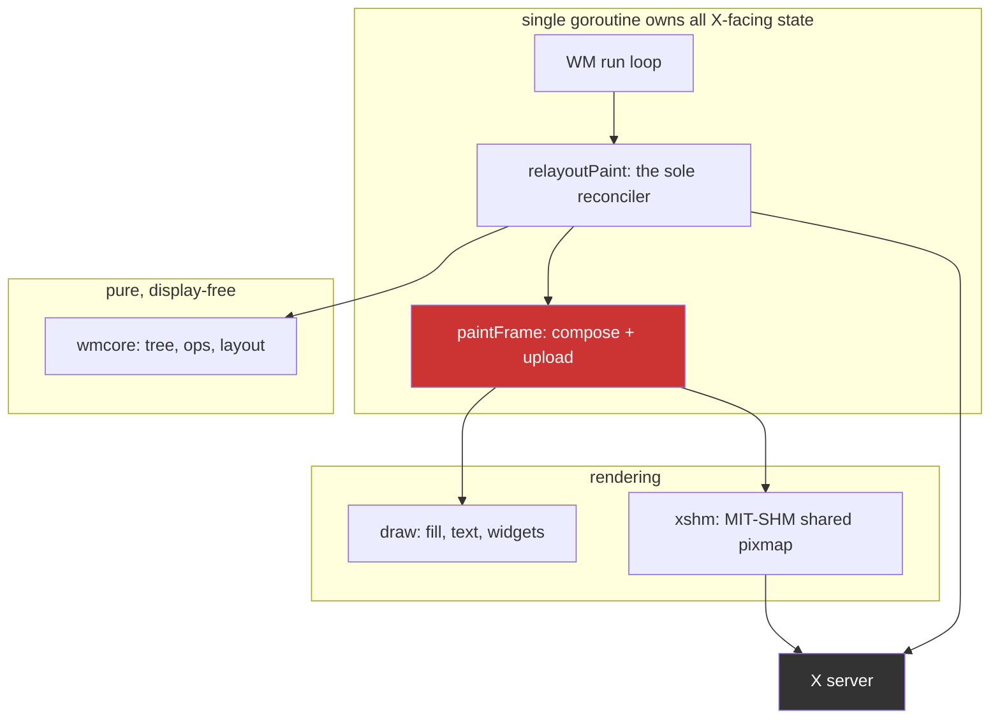

# Measuring Before Optimizing: An X11 Window Manager Resize Path

This note records what happened when a carefully reasoned performance analysis met a measurement. Three external review documents, roughly 8,700 lines between them, agreed on why dragging a divider in the `go-go-wm` window manager felt slow. A verification pass against the live code produced a fourth diagnosis that contradicted all three and looked better than any of them. Ninety seconds of running the actual system refuted the fourth diagnosis as well.

The engineering content is specific to X11 and to one Go window manager. The transferable content is a failure mode, and then a worse one: reading code produces hypotheses that are mechanically correct and causally wrong, and no amount of additional reading distinguishes the two — but measurement only helps if the instrument is right, and the instrument was wrong for six steps without anyone noticing.

> [!summary]
> - Five successive diagnoses, each refuting the one before it. The last refuted a *measurement*, not an inference: the harness had a bug that produced a plausible finding.
> - An A/B between two implementations does not isolate a component; it swaps a bundle. Only direct decomposition of the cost terminated the regress.
> - Final result: **4.8× faster per paint**, with the largest single win coming from an observation none of three review documents contained.
> - A nested `Xephyr` server turns "needs a spare console and a human" into a tool call that runs in ninety seconds.

## Why this note exists

The `go-go-wm` project had accumulated three long-form architecture reviews recommending substantial work: a preview/commit split for interactive resize, a latest-wins pointer mailbox, separation of window chrome from window content, capacity-based buffer allocation, and a retained widget tree. Each recommendation was argued from the source code. None of them had a benchmark behind it, because the repository contained no benchmarks at all and exactly two debug-level timing probes.

That is a common state for a project that has already done one round of successful optimization. Earlier work had produced measurable CPU reductions through row-major pixel fills, cached image objects, and MIT-SHM shared pixmaps. Those wins were real. What they left behind was a system where everyone's remaining model of the cost structure came from reading the code, and where the reading was plausible enough that nobody questioned it.

## The system under analysis

`go-go-wm` is a reparenting X11 window manager written in Go, about 21,600 lines. The relevant structure:



Two structural properties matter for everything that follows.

The window manager is **single-threaded by construction**. X event callbacks and posted closures are mutually exclusive, because `xgbutil`'s event loop sends on an unbuffered channel before dequeuing each event. There is not one mutex in the entire X11 package. Any work on this loop is work the user feels as input latency, and there is no render thread to hide it in.

The **paint path is immediate-mode**. Every repaint rebuilds a full pane-sized `image.RGBA` from the model, converts it from RGBA to the server's BGRA byte order, and uploads it. There is no retained surface and no damage tracking. A window's title strip is drawn *into* that full-pane buffer rather than into its own child window, so changing which window has focus repaints two entire panes to update a 22-pixel-high strip.


## Five diagnoses, in order

Each of these refuted its predecessor. The sequence is the point of the note.

### 1. Reading the code

Three review documents concluded the drag loop performed no synchronous round trips. The natural audit is `grep '\.Reply()'`, which finds reply-waiting requests. The round trips were spelled `.Check()`. Wrong by omission.

### 2. Reading the code more carefully

`xshm.New` issues two *checked* requests, and `paintFrame` recreates the shared pixmap whenever the pane's dimensions change — which, during a divider drag, is every tick. Two panes change per tick, so roughly 1,024 round trips per drag.

Mechanically correct. It also explained something otherwise puzzling: prior work had made the pixel path measurably faster and the drag still felt slow. Latency from serial round trips does not improve when CPU work gets cheaper.

### 3. An A/B

Disabling MIT-SHM removes every round trip. Measured: each paint became 15% *slower*. Conclusion drawn — round trips are not the bottleneck.

**The measurement was sound and the inference was wrong.** Swapping MIT-SHM for the PutImage fallback does not remove one component from a fixed system; it exchanges one bundle of components for another. The comparison established which of two implementations is faster. It established nothing about which component inside either one is expensive.

### 4. Decomposition

Timing the phases of a single paint separately:

| Component | MIT-SHM | share | PutImage fallback | share |
|---|---:|---:|---:|---:|
| compose | 0.85 ms | 16% | 0.74 ms | 11% |
| **surface management** | **2.99 ms** | **56%** | 1.75 ms | 26% |
| convert | 1.44 ms | 27% | 0.93 ms | 14% |
| **transfer** | 0.03 ms | 1% | **3.22 ms** | **49%** |

Surface management *was* dominant on the shm path — diagnosis 2 was right about it. Disabling shm had not made that cost disappear; it had replaced it with a larger one. And the two paths have entirely different bottlenecks, which is why any single A/B was going to mislead.

A separate decomposition settled a second question. With decoration paint suppressed but geometry still committed, `relayout_ms_total` fell from 2595 ms to 13.8 ms. Everything that is not painting — layout, tree indexing, geometry diffing, request construction, divider synchronisation — is **1.8% of a relayout**.

### 5. The harness was lying

Six steps of work recorded that this machine reports `shared_pixmaps: false`, therefore runs the fallback, therefore an entire prior optimization ticket is inert on it. It appeared in the diary, the design document, the published note, and three summaries.

It was false. `xshm.Available` gated on the environment first:

```go
if os.Getenv("GO_GO_WM_NO_SHM") != "" {   // bare non-empty test
    return false
}
```

And the harness expressed its two conditions as:

```bash
run_condition shm-on   0      # GO_GO_WM_NO_SHM=0 — not empty
run_condition shm-off  1
```

**The "shared memory enabled" arm ran with shared memory disabled.** A probe against the live session reports `SharedPixmaps true`, with GPU acceleration enabled. The machine had the fast path throughout.

This is the most instructive failure in the sequence. Every earlier correction came from a measurement overturning an inference. Here a *measurement* was wrong, produced a result plausible enough to explain other observations, and survived because it was the instrument rather than the object.

The contradiction had been visible for six steps: the nested-server runs reported `true` from diagnosis 4 onward. The same binary disagreed with itself across two harnesses, and I attributed it to one server being software-rendered instead of investigating.

## The measurement apparatus

A window manager cannot be benchmarked in a unit test. It needs an X server, real client windows, and pointer input.

The first attempts used a spare virtual console. They required a human at a physical console, failed twice for reasons unrelated to the experiment, and once tore down the display server because the harness script was `xinit`'s client and its death ended the session.

A **nested server** removes all of that:

```bash
DISPLAY=:0 Xephyr :7 -screen 1280x800 -ac -noreset &
go-go-wm wm --display :7 --log-level debug --log-format json --log-file run.jsonl &
DISPLAY=:7 xdotool mousedown 1
for x in $(seq 320 6 960); do DISPLAY=:7 xdotool mousemove $x 400; sleep 0.004; done
DISPLAY=:7 xdotool mouseup 1
echo '{"q":"perf"}' | socat - UNIX-CONNECT:$SOCK
```

`Xephyr` runs a real X server as a window on an existing display: real X semantics, disposable, incapable of taking down a live session, and needing no console. Three failed console-based attempts were solving a problem that did not need solving.

## The fix, and the observation that produced most of it

**Capacity-sized backing stores.** The dimension change on every tick invalidated the RGBA scratch, the shared pixmap, and the fallback XImage. Rounding the backing store up to a bucket makes them survive until the drag crosses a boundary. Surface creations per drag fell from 528 to 64.

The window is then smaller than its backing store. X tiles a background pixmap from the window origin, so an oversized pixmap displays its top-left region and the surplus is clipped. That was an assumption, and it was checked by screenshot rather than argument.

**Chrome-only upload.** This is the observation that mattered most, and it appears in none of the three review documents:

```
+-- frame 636x664 -----------------------+
| title strip  636 x 22      <- visible  |
+----------------------------------------+
|B|                                    |B|   B = 2px border, visible
|o|   client window covers this        |o|
|r|   ~416,000 px, NEVER visible       |r|
+----------------------------------------+
| bottom border 636 x 2      <- visible  |
+----------------------------------------+
```

A frame holding a reparented client shows window-manager pixels only in its title strip and border — roughly 20,000 of 422,000. Every paint was composing, converting and uploading all of them. Restricting all three to the visible rectangles dropped the fallback's transfer from 3.22 ms to 0.38 ms per paint.

**This is what the planned "chrome/content split" was for.** Giving every frame a title child window was the highest-risk item in the plan, because it rewrites frame lifecycle. Its purpose was to stop touching pixels the client covers. Those pixels were *already* covered; only the upload had to stop pretending they were visible. The saving was available without creating a single X window.

**Granularity, swept rather than argued.** With composition, conversion and upload all restricted to the chrome, none of them scales with the backing store, so a larger bucket costs only memory:

| bucket | surface creations | ms/paint | resident buffers |
|---:|---:|---:|---:|
| 16 | 375 | 4.38 | — |
| 64 | 124 | 1.85 | 7.86 MB |
| **128** | **64** | **1.08** | **7.86 MB** |
| 256 | 28 | 0.74 | 9.44 MB |

128 costs exactly the same memory as 64 at this geometry while being 1.5× faster — a 636×664 pane rounds to the same width bucket either way. The conservative default was buying nothing, which was visible only because the memory side was measured rather than estimated.

**A glyph cache, found by accident.** The repository's first benchmarks showed `draw.Text` was 72% of a title-strip render. A window's title does not change while its pane is resized; only the width does. Caching each rendered run as an *alpha mask* rather than as coloured pixels — so a focus change or theme swap reuses the entry and only recolours it — took it from 53.9 µs to 7.46 µs.

That cache is not bit-exact. `font.Drawer` blends each glyph onto the destination in turn; the cache blends glyphs into one mask and applies it once. These differ by one least-significant bit where antialiased glyphs overlap: measured at 14 pixels out of 179,200, maximum channel delta 1/255. Two golden images were regenerated, and a test now retains the original implementation as a reference and fails if any channel drifts by more than 1. The trade is no longer "a rendering change was accepted once" but "a bounded rendering change was accepted, and the bound is a test."

## Result

| | before | after | |
|---|---:|---:|---:|
| Per paint | 5.31 ms | **1.11 ms** | **4.8×** |
| WM-loop work per drag | 2852 ms | **595 ms** | **4.8×** |
| Surface creations per drag | 528 | **64** | 8.3× |
| `draw.Text`, 24-char title | 53.9 µs | **7.46 µs** | 7.2× |

The drag ran about six seconds; WM-loop duty cycle fell from roughly 48% of that interval to roughly 10%.

## Verification that a test cannot provide

Every failure mode of the chrome-only upload is visual and silent. Uploading too little leaves stale pixels; excluding the wrong frames renders a title strip over garbage. No unit test fails, and all 15 packages passed throughout.

So the harness screenshots each stage, and the images are committed alongside the code. A second harness drives the paths the drag test never touches — fullscreen, floats, workspace switches, focus changes, theme swaps — and screenshots each. That sweep confirmed builtin tiles still render their full surface, floats keep their chrome, and frames unmap and remap correctly across a workspace switch.

One bug was caught by neither tests nor screenshots, but by two counters disagreeing. After capacity sizing, `frames_painted` was 1340 against 496 resizes. The Expose fast path compared buffer dimensions against the viewport, so capacity-sized buffers always looked stale and every Expose triggered a full repaint. The screen looked perfect. Only the ratio between two counters revealed it.

## Common failure modes

**Reasoning from mechanism to magnitude.** Code reading establishes that something happens. It cannot establish how much it matters relative to everything else that also happens.

**Treating an A/B as a decomposition.** Toggling between two implementations tells you which is faster, not which component inside either is expensive. Both arms differ in several components at once.

**Trusting the instrument.** A measurement harness is instrumentation, and its bugs are indistinguishable from findings. A boolean-style environment switch tested for non-emptiness makes `VAR=0` mean *on*, and the harness author will eventually write exactly that.

**Explaining away a contradiction between instruments.** Two harnesses reported opposite values for six steps. The disagreement was the most interesting datum available and it was rationalized instead of investigated.

**Optimizing what is legible.** Layout algorithms and redundant requests are visible in source and satisfying to fix. Reconciliation minus paint was 1.8% of a relayout.

**The plausible algorithmic win that is a regression.** Replacing an O(n) tree search inside an O(n) loop with a node index is textbook. Benchmarked, the allocating version was **6.2× slower at 2 leaves and 1.6× at 8** — a fresh map costs more than the scans it replaces until roughly 24 leaves, and a real workspace holds two to eight tiles. Reusing one scratch map moved the crossover to about 10. Kept as protection against pathological trees, documented as *not* a speedup.

**A mechanism that loses at one scale winning at another.** Transferring a sub-image rather than a whole buffer measured 5.79 ms/paint against 4.09 — worse, because the library allocates a contiguous copy per call. Applied to the chrome instead of the viewport, the same mechanism was decisive: the copy is 22 rows instead of 660.

**Estimating what you could measure.** The 128-versus-256 bucket choice initially rested on an estimated memory cost. Measured, 128 was free relative to 64.

## Working rules

1. **A mechanism is not a magnitude.** Reading source establishes that something happens, never how much it costs.
2. **Decompose; do not A/B.** To attribute cost to a component, measure the component. Swapping strategies exchanges bundles.
3. **Distrust the harness as readily as the code.** Harness bugs produce findings, not failures.
4. **When two instruments disagree, investigate the disagreement first.** It is more informative than either reading.
5. **Never write a boolean environment switch as a non-empty test.** `VAR=0` will be written, and it will mean the opposite of what it says.
6. **The first benchmark is worth more than the tenth optimization.** The 7.2× glyph cache appeared within an hour of the repository having any benchmark, and was on nobody's list.
7. **Use a nested server.** Disposable, scriptable, no console required.
8. **Screenshot what tests cannot see.** Where failure modes are visual and silent, images are evidence and assertions are not.
9. **Watch counters against each other.** The Expose regression was invisible in isolation and obvious as a ratio.
10. **Keep tuning constants sweepable, and re-decide them when their cost structure changes.** Bucketing was tuned when its downside was transfer volume; once that downside was removed the old default was leaving 1.5× on the table without anything in the code having changed.
11. **Record refuted hypotheses next to the code they explain.** The next reader will otherwise re-derive the same plausible wrong answer from the same source.

## Where this leaves the project

Instrumentation is permanent: reconciliation counters, upload-path churn, motion admission, a four-way paint breakdown, and resident buffer bytes, all readable over IPC. Two harnesses run in ninety seconds each and produce directly comparable numbers across changes.

The remaining costs on a now ~1 ms paint are within a small factor of each other, with no dominant component. Further gains need fewer paints — preview/commit separation, so one drag emits one durable operation instead of one per tick — rather than another constant-factor fix.

The chrome/content window split, previously the plan's centrepiece, should be re-costed before scheduling. Its principal saving has already been taken.

Full analysis, a sixteen-step investigation diary, both harnesses and the screenshot set live in the repository under `ttmp/2026/07/21/GGWM-012-GUIDES--import-go-go-wm-engineering-guides-and-handbook/`.

## Related notes

- Source repository: `/home/manuel/workspaces/2026-07-21/go-go-wm-goja/go-go-wm`
- Design document: `ttmp/2026/07/21/GGWM-012-GUIDES--.../design-doc/01-go-go-wm-performance-engineering-an-intern-s-guide-to-the-resize-and-render-path.md`
- Measurement harnesses: `ttmp/2026/07/21/GGWM-012-GUIDES--.../scripts/ggwm-xephyr-{validate,scenarios}.sh`
- SharedPixmaps probe: `ttmp/2026/07/21/GGWM-012-GUIDES--.../scripts/shmprobe`
