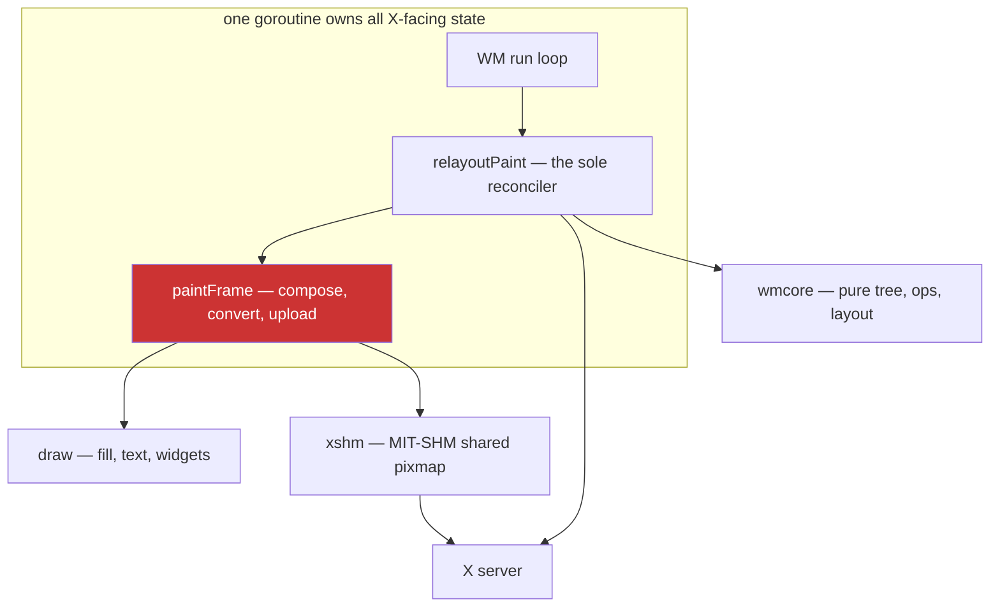

# Optimizing an X11 Window Manager Paint Path

This note is the engineering record of making divider-resize fast in `go-go-wm`, a reparenting X11 window manager written in Go. It covers fourteen changes that landed, seven that were built and rejected, and the measurements that decided between them. A companion note, [[ARTICLE - Measuring Before Optimizing - An X11 Window Manager Resize Path]], covers how the diagnoses were arrived at and how several of them were wrong; this one covers what the code now does and why.

The headline: a paint went from 5.31 ms to 0.32 ms in the measurement harness, and the window manager's loop occupancy during a drag fell from roughly 48% to under 5%.

> [!summary]
> - Almost every gain came from **not doing work**, not from doing work faster. `draw.Fill` was already at 32 GB/s and memory-bandwidth bound.
> - The largest single change exploits a structural fact: **a reparented client covers the frame interior**, so ~20,000 of ~422,000 pixels per pane are ever visible.
> - Rejected changes are documented with their numbers, because each is a plausible idea a future reader would otherwise re-derive.
> - A shared-pixmap creation costs **2.6 ms on Xephyr and 15.4 ms against glamor** — a 6× difference between harness and target that inverted one conclusion.

## The system

`go-go-wm` reparents each managed client into a frame window that the window manager owns and draws. The frame carries a title strip and a border; the client occupies the interior.



Two properties govern everything below.

**The window manager is single-threaded by construction.** X event callbacks and posted closures are mutually exclusive, because `xgbutil`'s event loop sends on an unbuffered channel before dequeuing each event. There is not one mutex in the X11 package. Any work on this loop is latency the user feels, and there is no render thread to hide it in.

**The upload uses a background pixmap, not a blit.** `xshm` allocates a shared-memory pixmap and installs it as the window's background. The server composites the window from it. This makes Expose repair free — the server repaints exposed regions itself, with no client involvement — and that property constrains several decisions later in this note.

## Where the time went

Timing the phases of a single paint separately, before any of this work:

| Component | MIT-SHM | share | PutImage fallback | share |
|---|---:|---:|---:|---:|
| compose (fill + title + border) | 0.85 ms | 16% | 0.74 ms | 11% |
| surface management | 2.99 ms | 56% | 1.75 ms | 26% |
| convert (RGBA → BGRA) | 1.44 ms | 27% | 0.93 ms | 14% |
| transfer | 0.03 ms | 1% | 3.22 ms | 49% |
| **total** | **5.31 ms** | | **6.63 ms** | |

Two facts follow immediately. The two upload paths have entirely different bottlenecks, so any change must be measured on both. And **surface management dominates the shm path** — work that exists only because the pane's dimensions changed on this tick, which during a divider drag is every tick.

A second decomposition bounded the rest. With decoration paint suppressed but geometry still committed, `relayout_ms_total` fell from 2595 ms to 13.8 ms. Layout, tree indexing, geometry diffing, request construction and divider synchronisation together are **1.8% of a relayout**. Painting is the other 98.2%.

## The changes that landed

### 1. Cache glyph runs as alpha masks

Benchmarking found `draw.Text` was **72%** of a title-strip render — 52.8 µs of 73.7 µs. A window's title does not change while its pane is being resized; only the width does. The rasterization was being repeated for an identical string on every repaint.

The cache stores each rendered run as coverage, not colour:

```go
type textKey struct { s string; bold bool; size float64 }

type textMask struct {
    mask    *image.Alpha // coverage only; colour applied at blit time
    originY int          // baseline offset within the mask
    advance int          // pen advance, must equal TextWidth
}
```

Storing an alpha mask rather than coloured pixels is the load-bearing decision. Caching rendered RGBA would key on colour, so a focus change or theme swap would miss and re-rasterize — and focus changes recolour the same title constantly. With a mask, the expensive geometry work happens once per `(string, bold, size)` and colour is applied at composite time.

**53.9 µs → 7.46 µs, 7.2×.** `TitleStrip.Render` fell 73.7 µs → 38.8 µs.

The cache is not bit-exact. `font.Drawer` blends each glyph onto the destination in turn; the cache blends glyphs into one mask and applies it once:

```
direct:  dst = over(over(dst, g₁), g₂)
cached:  dst = over(dst, over(g₁, g₂))
```

Identical for non-overlapping glyphs, differing by one least-significant bit where antialiased glyphs overlap. Measured across the golden corpus: 14 pixels of 179,200, maximum channel delta 1/255. Two golden images were regenerated, and a test retains the original implementation as a reference and fails if any channel drifts by more than 1. The trade is bounded and the bound is enforced.

### 2. Upload only what is visible

This is the largest change and it follows from a structural fact rather than a profile.

```
+-- frame 636x664 -----------------------+
| title strip  636 x 22      <- visible  |
+----------------------------------------+
|B|                                    |B|   B = 2px border, visible
|o|   client window covers this        |o|
|r|   ~416,000 px, NEVER visible       |r|
+----------------------------------------+
| bottom border 636 x 2      <- visible  |
+----------------------------------------+
```

A frame holding a reparented client shows window-manager pixels only in its title strip and border — roughly 20,000 of 422,000. Every paint was composing, converting and uploading all of them.

```go
func (w *WM) chromeRects(f *frame) []image.Rectangle {
    if f.client == 0 || f.rect.W < 4 || f.rect.H < 4 {
        return nil // builtin or script tile: all of it is visible
    }
    pw, ph, b, t := f.rect.W, f.rect.H, draw.BorderW, draw.TitleH
    return []image.Rectangle{
        image.Rect(0, 0, pw, t),       // title strip
        image.Rect(0, ph-b, pw, ph),   // bottom border
        image.Rect(0, t, b, ph-b),     // left border
        image.Rect(pw-b, t, pw, ph-b), // right border
    }
}
```

Returning `nil` for builtin and script tiles is essential: they have no client covering them, so their whole surface is visible. Getting that wrong would render a title strip over garbage.

All three stages consult it. Composition fills only those rectangles; `Surface.WriteRGBARect` converts only those rows; the fallback `XDraw`s those sub-images and repairs with `XPaintRects`. The fallback's transfer fell **3.22 ms → 0.38 ms, 8.5×**.

**This is what the planned "chrome/content window split" was for.** That change — giving every frame a title child window — was the highest-risk item in the roadmap because it rewrites frame lifecycle. Its purpose was to stop touching pixels the client covers. Those pixels were already covered; only the upload had to stop treating them as visible. No new X windows were created.

### 3. Capacity-sized, grow-only backing stores

A divider drag changes a pane's dimensions on every tick, and the RGBA scratch, the shared pixmap and the fallback XImage were all keyed on exact size. Every tick invalidated all three.

Rounding the backing store up to a bucket makes them survive until the drag crosses a boundary:

```go
const sizeBucket = 128 // swept; see below

func bucketSize(w, h int) (int, int) {
    return roundUpTo(w, sizeBucket), roundUpTo(h, sizeBucket)
}
```

The window is then smaller than its backing store. X tiles a background pixmap from the window origin, so an oversized pixmap displays its top-left region and the surplus is clipped. That was an assumption and it was verified by screenshot, not argument.

Bucketing alone was not enough: a drag sweeping left then right rebuilt the store at every crossing **in both directions**. Making the stores grow-only — keep one that is already large enough — took shm creations from **528 to 1** per drag.

Granularity was swept rather than argued. Because composition, conversion and upload are all restricted to the chrome, none of them scales with the backing store, so a larger bucket costs only memory:

| bucket | surface creations | ms/paint | resident buffers |
|---:|---:|---:|---:|
| 16 | 375 | 4.38 | — |
| 64 | 124 | 1.85 | 7.86 MB |
| **128** | **64** | **1.08** | **7.86 MB** |
| 256 | 28 | 0.74 | 9.44 MB |

128 costs *exactly the same memory* as 64 at this geometry while being 1.5× faster — a 636×664 pane rounds to the same width bucket either way. The conservative default was buying nothing, which was visible only because the memory side was measured rather than estimated.

### 4. Double buffer the shared pixmap

The shared pixmap **is** the window's background, and nothing synchronises writes into it against the server compositing from it. That is a tear, and it is inherent to the design that makes Expose repair free.

Each frame now carries a second surface. Rendering goes into whichever buffer is not installed; then `ChangeWindowAttributes` swaps the background pixmap and the repair follows. The server never composites from memory being written.

Two correctness details. A back buffer holds the *previous* frame: its interior is still valid because the client covers it, and its chrome is rewritten every paint, so partial updates remain safe — except after a size change, where the geometry no longer matches. A `dirtyAll` flag marks that case and forces a full rewrite. New surfaces start dirty.

**Cost: none measurable.** 207.6 ms against 215.6 ms single-buffered over one drag, the double-buffered run marginally faster, within run-to-run noise. The only real cost is one extra shared pixmap per frame.

### 5. Reconciliation work

These target the 1.8%. They remove real waste and cannot be felt, which is worth stating plainly.

- **Divider paint guard.** `syncDividers` called `paintDivider` unconditionally on every relayout, and `paintDivider` allocates an image *and* creates and frees a server pixmap. A divider's appearance depends on `(mode, dir, size)` and not on its position, so a drag needs no raster work at all. 66% of divider paints skipped.
- **Map-state mirrors.** `Map`/`Unmap` were issued for every frame in the process, across all workspaces, on every relayout. A tri-state mirror (`unknown`/`mapped`/`unmapped` — the zero value must mean "we have told the server nothing") issues them only on a transition. 700 requests suppressed per drag.
- **Split-rect caching.** `dividerMotion` computed a full layout to find the split's rectangle, then `relayoutResized` computed another. A split's own rectangle does not move when its ratio changes, so capturing it once at gesture start halves the layouts per tick.
- **Synthetic `ConfigureNotify`.** A denied tiled `ConfigureRequest` called `relayout()` — a whole-workspace layout and repaint, on a path a client can drive at its own rate. ICCCM requires only that the client be told its actual geometry. The existing comment already said "send a synthetic ConfigureNotify"; the code did something a thousand times more expensive.
- **`gripMotion` throttling**, with a release replay so the drop target stays exact.

### 6. Interaction fixes

Not performance, but they surfaced during it and mattered more to the user than throughput.

**Snap dead zone.** Dividers snap at ¼, ⅓, ½, ⅔, ¾ while `|ratio − snapPoint| < Stick`. The band is symmetric, so a pointer crossing it enters at one edge and must reach the other to escape. A one-pixel sweep across the ½ point on a 1272 px split:

```
pointer x=614  raw=0.4796  ratio=0.5000  divider x=640 SNAP
      ...                                                    52 px, divider frozen
pointer x=666  raw=0.5204  ratio=0.5000  divider x=640 SNAP
pointer x=668  raw=0.5220  ratio=0.5220  divider x=668
```

The divider holds still for 52 px and then jumps 28 px. Users read that as the drag having stopped working. Shrinking `Stick` was not available — a test deliberately requires `0.32` to snap to ⅓ — and hysteresis makes it worse, because capture and release radii that differ either release instantly or widen the dead zone. The fix is snap-on-release: the divider tracks the pointer continuously and the snap is applied once, at commit, with the divider's colour still signalling the band.

**Black blocks.** Chrome-only composition left the interior of every backing store unwritten — uninitialised memory, which is black. Normally hidden by the client, but a frame is resized before its client is reconfigured, and a pane growing into its capacity exposes the gap. Newly allocated buffers are now filled and uploaded in full **once**; only subsequent paints are chrome-only.

**Repair coalescing.** Chrome-only upload had replaced one `ClearAll` with four `ClearArea` calls, so a repaint could arrive in four visible pieces. Now one call over their bounding box.

## What was built and rejected

Each of these is a plausible idea. Recording the numbers is what stops them being re-derived.

| Idea | Rationale | Measured | Verdict |
|---|---|---|---|
| Sub-image transfer of the viewport | Send fewer pixels | 5.79 vs 4.09 ms/paint | `xdraw` allocates a contiguous copy per call; the copy costs more than the ~7% surplus avoided. Wins for chrome (22 rows), loses for a viewport (660). |
| Barrier for shm synchronisation | Close the residual tear | 1.24 ms per round trip; paint 207 → 1042 ms | 5× cost to close a case double buffering already makes rare. Off by default. |
| Allocating node index | Remove an O(n²) loop | 6.2× slower at 2 leaves, 1.6× at 8 | A fresh map costs more than the depth-first scans until ~24 leaves; a workspace holds 2–8 tiles. Scratch-reuse moved the crossover to ~10. Kept as scaling insurance, **not** a speedup. |
| Bucket 64 rather than 128 | Less surplus memory | Identical resident bytes; 1.5× slower | The estimate said 128 costs ~10% more. Measured, it costs nothing. |
| Shrinking `Stick` | Narrower snap bands | Broke a specification test | `0.32` snapping to ⅓ is intended behaviour. |
| Hysteresis on snapping | The instinctive fix | Reasoned through | Differing capture and release radii either release instantly or widen the dead zone. |
| MIT-SHM completion events | Correct in general | Not applicable | The server emits them for `ShmPutImage`; this design installs a background pixmap, which is what makes Expose repair free. Adopting `ShmPutImage` to gain them would give that up. |
| Suppressing paint during a drag | Remove paint from the hot path | `relayout_ms` 2595 → 13.8 ms | **Valid as measurement, invalid as design.** The paints relocate to Expose, because the background pixmap is stale at the new size. |

## The harness is not the target

Two findings deserve separate emphasis, because both inverted a conclusion.

**Shared-pixmap creation costs 2.6 ms on Xephyr and 15.4 ms against glamor.** Against an accelerated driver the server must produce CPU-mappable memory for an object it would rather keep in GPU memory. On real hardware that single line was 45% of a paint. It is also why grow-only mattered far more on the target than in the harness, and why a harness comparison showing MIT-SHM 15% faster than PutImage does not transfer.

**A boolean environment switch tested for non-emptiness inverted six steps of conclusions.** `xshm.Available` gated on `os.Getenv("GO_GO_WM_NO_SHM") != ""`, and a harness expressed its *enabled* condition as `GO_GO_WM_NO_SHM=0` — which is not empty. The "shared memory on" arm ran with shared memory off, and the resulting capability reading was recorded as a property of the hardware. Never write a boolean switch as a non-empty test; `VAR=0` will be written and it will mean the opposite of what it says.

## Result

| | baseline | shipped | |
|---|---:|---:|---:|
| ms per paint (harness) | 5.31 | **0.32** | **16.6×** |
| WM-loop work per drag | 2852 ms | **~250 ms** | ~11× |
| Shared-pixmap creations per drag | 528 | **1** | 528× |
| `draw.Text`, 24-char title | 53.9 µs | **7.46 µs** | 7.2× |
| Divider repaints | every relayout | on appearance change only | |
| Map/Unmap requests per drag | ~700 redundant | 0 | |

## What remains open

**Real hardware is at 9.16 ms/paint** against 0.32 in the harness. The leading suspect is visible in the live session's own state: `{"q":"windows"}` shows one leaf with `client: 0` — it is the builtin launcher tile, not a terminal. `chromeRects` returns `nil` for it, so it takes the full-surface path, and its renderer re-runs a command-registry match on every paint. `compose_ms` was 3.94 ms/paint against 0.39 in the harness, where both panes were terminals. Unconfirmed; the experiment is to drag with two terminals and compare.

**The covering invariant is unenforced.** `chromeRects` assumes the client covers exactly the frame interior. It is established at reparent time and maintained by reconciliation, and nothing would fail if a future change broke it except the pixels.

**A residual tearing window exists.** With two buffers the server must fall more than a frame behind to be reading the buffer being written. A third buffer would widen the margin; nobody has measured whether it is ever hit.

## Working rules

1. **Prefer not doing the work to doing it faster.** `draw.Fill` was already memory-bandwidth bound. Every real gain here came from eliminating work: pixels nobody sees, resources recreated needlessly, requests for state that had not changed.
2. **Decompose the cost before optimizing it.** Toggling between two implementations tells you which is faster, not which component inside either is expensive.
3. **Measure on the target, not only the harness.** A 6× difference in shared-pixmap creation cost inverted a conclusion.
4. **Record rejected ideas with their numbers.** Seven plausible changes were built and rejected here; without the numbers each would be re-proposed.
5. **A mechanism that loses at one scale can win at another.** Sub-image transfer was 40% worse for a viewport and decisive for a title strip.
6. **Re-decide tuned constants when their cost structure changes.** Bucketing was tuned conservatively when its downside was transfer volume; once chrome-only upload removed that downside, the old default was leaving 1.5× on the table with no code change.
7. **Screenshot what tests cannot see.** Every failure mode of chrome-only upload is visual and silent; all 15 packages passed throughout.
8. **Watch counters against each other.** A regression that made every Expose trigger a full repaint was invisible in isolation and obvious as a ratio: `frames_painted` 1340 against 496 resizes.
9. **Performance instrumentation does not measure feel.** A 52 px dead zone at every snap point was invisible to every counter and immediately obvious to someone using the window manager.

## Related notes

- Companion: [[ARTICLE - Measuring Before Optimizing - An X11 Window Manager Resize Path]] — how the diagnoses were reached, and how several were wrong
- Source repository: `/home/manuel/workspaces/2026-07-21/go-go-wm-goja/go-go-wm`
- Ticket, with a 21-step investigation diary, both harnesses and the screenshot set: `ttmp/2026/07/21/GGWM-012-GUIDES--import-go-go-wm-engineering-guides-and-handbook/`
- Measurement harnesses: `scripts/ggwm-xephyr-validate.sh`, `scripts/ggwm-xephyr-scenarios.sh`, `scripts/shmprobe`
