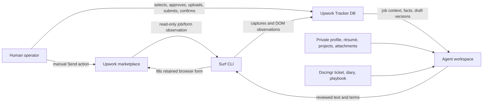

# Upwork Freelance Bid Operations — Tracker, Surf, Facts, and Human Submission

A freelance proposal is not one text field. It is a controlled sequence that starts with a marketplace observation, continues through evidence review and commercial decisions, and ends only when the human operator confirms what happened on Upwork. The local tracker stores the work required to make that sequence inspectable. Surf reads and fills the remote form. The operator decides whether the opportunity is worth pursuing, approves claims and terms, and performs the final marketplace action.

This article documents that operating system. It explains the data boundaries, the command paths, the versioned draft workflow, the private fact library, fixed-price milestone handling, browser verification, feedback, and the failure modes that repeatedly matter in real proposal sessions. The goal is not to produce generic cover letters. The goal is to produce proposals that are accurate, reviewable, reproducible, and safe to submit manually.

> [!summary]
> - Marketplace evidence, private profile evidence, reusable operator facts, proposal drafts, and live-form state are different data classes. Mixing them produces unsupported claims or false submission state.
> - The reliable workflow is `shortlist → refresh evidence → inspect → draft → save locally → review → fill → read back → human submit → confirm → record submitted`.
> - Every mutation needs an explicit boundary. Surf does not submit, fact memory does not authorize claims or Connects spending, and tracker state does not prove that Upwork accepted a proposal.
> - Fixed-price proposals require convergent field updates and a full DOM read-back. Upwork milestone inputs are individual amounts, not cumulative targets.

## Why this note exists

The proposal workflow accumulated several tools and several kinds of evidence before it had a single durable explanation. Upwork Tracker provides the local job database, application lifecycle, proposal versions, operator facts, and review UI. Surf provides browser inspection and form filling against an authenticated Upwork session. Private files preserve profile snapshots, job captures, proposal bodies, and sanitized attachments. Docmgr tickets preserve the investigation diary and the reasons behind the workflow.

The operational difficulty is not the number of commands. It is the number of independent states that must remain consistent. A job can be shortlisted while its detail fields are stale. A proposal can be saved locally while the browser form is empty. A form can contain a cover letter while its fixed-price total remains zero. A Send button can be enabled while no submission has occurred. The workflow must expose these distinctions rather than compress them into a single boolean such as `applied`.

## The system boundary

The system has three active components and one human authority:



The arrows have different meanings. A read-only capture records what the marketplace showed at a point in time. A proposal draft import writes a local artifact and advances the local application lifecycle. `bid-apply` changes fields in a browser tab. The human Send action changes the marketplace. The confirmation that follows changes the tracker’s interpretation of the application. These are not interchangeable operations.

### Source-of-truth hierarchy

A proposal claim needs a source strong enough to support its wording. The working hierarchy is:

| Data class | Examples | What it can support | What it cannot support |
|---|---|---|---|
| Marketplace job evidence | Title, description, budget, client history, requested skills | What the client wants and how the proposal should be tailored | The operator’s past experience |
| Profile and résumé snapshots | Upwork overview, LinkedIn experience, portfolio list | Profile claims, rate, availability, public identity | Details absent from the snapshots |
| Public project evidence | GitHub repositories, PARC reports, public MOCs | Links and project-specific examples | A claim about an unrelated technology |
| Private operator facts | Approved, versioned claims with provenance | Reusable wording during proposal preparation | Marketplace proof, submission authorization, Connects authorization |
| Proposal draft | The exact locally reviewed body and terms | What was prepared for a job | Proof that Upwork accepted it |
| Live form read-back | Actual textarea, inputs, selected highlights, attachments, totals | What the current browser form contains | Proof of final submission until the operator confirms it |
| Operator confirmation | Direct statement that the human clicked Send and Upwork accepted it | Submission record and lifecycle transition | Retrospective proof for unsupported claims |

A job description can require ESP32-S3 work. It cannot make an ESP32-S3 claim true. A fact can state that the operator has public ESP32 work. It cannot authorize sending a proposal or spending 15 Connects. A live tab can show `Send for 15 Connects`; it still does not show that the click happened.

## Phase 1: Maintain a bounded, fresh shortlist

The first query should be bounded by the operator’s policy. In this workflow, the freshness policy is at most two days old. The tracker query identifies candidates; it does not replace live detail review.

```bash
DB="${UPWORK_TRACKER_DB:-$HOME/.local/share/upwork-tracker/upwork.db}"

upwork-tracker verbs upwork jobs-list \
  --db-path "$DB" \
  --status shortlisted \
  --sort posted-desc \
  --limit 100 \
  --output json --output-as-objects
```

The shortlist contains workflow status, not necessarily complete evidence. A newly shortlisted job can have a title and a posting timestamp while compensation, client statistics, and the full description remain absent from the projection. This is why the next step is a live detail refresh.

A practical selection record should preserve:

- the canonical `upwork:<remote-id>` identifier;
- the current tracker revision;
- the original URL;
- the posting timestamp and freshness decision;
- the reason the job was selected;
- the evidence gaps that must be refreshed before drafting.

The selection reason is important. A useful first tranche usually combines fit and commercial signal. For example, the first three jobs chosen from a new shortlist were a Go chromedp/CDP automation role, a BU97550KV-M device-driver role, and an ESP32-S3 display-validation role. They represented different evidence-backed strengths: Go systems and reliable automation, kernel/device-driver and hardware-validation work, and public ESP32/display work.

## Phase 2: Refresh live detail evidence with bounded retries

Surf’s browser target can navigate while an inspection is in progress. The observed error is:

```text
Inspected target navigated or closed
```

This is retryable for read-only capture. It is not a reason to retry a submission or an uncertain marketplace mutation. The refresh script therefore retries only the capture, requires a non-empty output file, imports only successful captures, and rebuilds the projection after the batch.

```bash
surf upwork job "$JOB_URL" --capture-envelope > "$OUT"
upwork-tracker import details \
  --db "$DB" \
  --marketplace upwork \
  --source "$OUT"
upwork-tracker projection rebuild --db "$DB"
```

The reusable implementation is in:

```text
/home/manuel/code/wesen/claw-stuff/ttmp/2026/07/21/UPWORK-PROPOSAL-WORKFLOW-2026-07-21--evidence-grounded-upwork-proposal-preparation-and-surf-form-reliability/scripts/06-new-shortlist-proposals/01-refresh-selected-jobs.sh
```

The tracker may continue to show a compact projection with fields that are null even when a detail capture contains the information. The correct response is to preserve the capture and use the context envelope as evidence. It is incorrect to fill missing fields from the job description or from inference.

## Phase 3: Retrieve facts without turning memory into evidence

The fact library is private, versioned operator memory. It is useful because proposal preparation repeatedly needs the same claims: embedded firmware, Formlabs, device drivers, ESP32 projects, Go systems, or a debugging method. Facts are not public marketplace captures.

Start with a bounded active query, then retrieve each candidate’s body and provenance:

```bash
facts=$(upwork-tracker verbs upwork operator-facts-list \
  --db-path "$DB" \
  --query 'ESP32 display electronics' \
  --status active \
  --limit 20 \
  --output json --output-as-objects)

FACT_ID=$(jq -r '.data[0].id // empty' <<<"$facts")
test -n "$FACT_ID"

upwork-tracker verbs upwork operator-facts-get "$FACT_ID" \
  --db-path "$DB" \
  --output json --output-as-objects | jq '.data'
```

The current hardware-relevant facts include:

- Formlabs firmware and release work across many 3D-printer lines, from Form 1 through Fuse 1;
- public ESP32 work covering ESP-IDF bring-up, displays, connectivity, serial/device pipelines, and staged hardware debugging;
- kernel drivers, device drivers, and hardware validation;
- a debugging method based on instrumentation, logging, hook points, and runtime traces.

The exact wording matters. The ESP32 fact supports public ESP32/display evidence. It does not support a claim that a particular seven-inch RGB panel or BQ2407x-class charger has already been used. The Formlabs fact supports embedded product work across multiple printer lines. It does not support a claim about a specific ESP32 peripheral.

### Fact lifecycle

A reusable fact is created only after explicit operator approval. A revision is immutable. Deprecation creates a historical version; it does not delete the claim or rewrite prior proposal attribution.

```text
operator statement or reviewed source
        |
        v
atomic candidate with provenance and caveats
        |
        v
operator approval
        |
        v
fact version 1
        |
        +--> immutable edit -> version 2 -> version 3 ...
        |
        +--> used_in link to exact proposal version
        |
        +--> deprecation version when no longer current
```

The debugging technique is a good example of an approved capability fact. It is not a claim about one chip. It is a method that can be used in electronics, embedded, and ESP32 proposals:

> Add instrumentation and logging, expose useful hook points, correlate runtime traces with code behavior, and use the resulting feedback loop to solve bugs from observed evidence rather than guesses.

When the exact wording appears in a saved proposal, link the exact fact version to the exact proposal version. A candidate that was considered but omitted must not receive a `used_in` link.

## Phase 4: Draft a proposal as a versioned local artifact

The private draft is the review object. It should contain the job identifier, evidence-backed cover letter, questions, public links, commercial terms, attachment notes, and fact IDs used during preparation. It should not contain unsupported claims or hidden decisions.

A useful draft separates the marketplace text from internal review metadata:

```markdown
## Draft cover letter

Hi,

[Concise evidence-backed proposal text.]

[Plan stated as a plan, not as an unsupported past result.]

[Relevant public links and one useful clarification question.]

## Approved facts used

- fact_<id> v<version> — Why this claim is allowed

## Attachment prepared

- private filename and sanitized hash

## Commercial terms

- fixed price or hourly rate
- milestone amounts as individual values
- Connects and boost state
```

Save the reviewed draft into the tracker before using the live form as the review surface:

```bash
upwork-tracker verbs upwork proposal-draft-import "$JOB_ID" \
  --db-path "$DB" \
  --proposal-file "$PRIVATE/proposals/$REMOTE_ID-draft.md" \
  --change-comment 'Store reviewed local proposal draft' \
  --expected-version "$JOB_VERSION" \
  --idempotency-key "proposal-draft-$REMOTE_ID-v$JOB_VERSION-<unique-intent>"
```

The command creates an immutable proposal version and moves the local application to `drafting`. It does not open Upwork, spend Connects, or submit anything. The tracker UI then becomes a practical feedback surface: comments can be added, an edit can be saved as another proposal version, and the lifecycle can advance only after the content and terms are approved.

A saved version is also the anchor for fact attribution. If the proposal body changes materially, create a new proposal version and link facts used by that new version. Do not change the text of an old proposal version in place.

## Phase 5: Inspect the remote proposal form

`bid-prepare` reads the live form and writes an editable template. It also reports the Connects cost, pre-filled rate, screening questions, and retained tab ID.

```bash
surf upwork bid-prepare "$JOB_URL" \
  --out "$PRIVATE/proposals/$REMOTE_ID-form-template.txt" \
  --keep-tab-open
```

The retained tab is part of the form contract. Record its ID. A later command should reuse that ID rather than navigating to the apply URL again. Navigation can bounce a signed-in Upwork session to login or produce a different form instance.

Inspect the generated template against the live page before applying it:

- cover-letter field count and labels;
- screening question count and exact text;
- hourly or fixed-price mode;
- rate or project total;
- milestone row count;
- Connects required and boost state;
- attachment input and profile-highlight controls.

The generated screening-question label bug was fixed by using direct-child labels rather than collecting every descendant label. Long question text must be preserved because the answer must be attached to the correct field.

## Phase 6: Fill only after content and terms are approved

`bid-apply` fills the retained tab and stops before the marketplace action:

```bash
surf-go upwork bid-apply \
  --file "$PRIVATE/proposals/$REMOTE_ID-bid.txt" \
  --tab-id "$TAB_ID" \
  --keep-tab-open
```

Never pass `--submit`. The command output explicitly describes the result as a draft. A successful fill is not a successful application.

The private bid template should contain only the fields Surf can safely fill through the current contract:

```text
url: https://www.upwork.com/nx/proposals/job/~<id>/apply/
connects_cost: <observed>

[rate]
<approved hourly rate or fixed-form default>

[rate_increase]
none

[profile_highlights]

[cover_letter]
<marketplace cover letter only>
```

The Markdown tracker draft can contain more internal metadata. Do not paste its headings, fact IDs, or internal review notes into the marketplace cover letter.

## Fixed-price milestones require convergence

Upwork’s milestone amount fields are individual amounts. If the approved project total is `$1,000` with three stages, the form values might be `$400`, `$300`, and `$300`. They are not cumulative targets.

For the ESP32-S3 validation proposal, the approved structure is:

| Milestone | Individual amount | Scope |
|---|---:|---|
| Display chain validation | `$400` | Panel timing, framebuffer behavior, JPEG/SD display path, and evidence |
| Connectivity and content flow | `$300` | BLE provisioning, Wi-Fi, local HTTP, upload, and slideshow flow |
| Sensors, power, and handover | `$300` | Sensors, touch, ambient light, power behavior, integration, and report |

React-controlled inputs require paced updates. A robust sequence is:

```text
add required milestone rows
        |
        v
set one description and wait for rerender
        |
        v
set its amount and wait for total recalculation
        |
        v
repeat for each row
        |
        v
read every description, amount, date, total, fee, payout
```

The form must be verified through actual DOM values, not only command output. For the current `$1,000` plan, the expected read-back is:

```text
milestones: 3
amounts: $400.00, $300.00, $300.00
total price: $1,000.00
estimated payout: $900.00
required Connects: 15
```

A fixed-price budget displayed in the job details is not an approved bid amount. The operator must approve the total and the individual milestone schedule.

## Attachments and media evidence

Attachments are private source artifacts until the operator approves their use. Before upload:

1. identify the exact file;
2. inspect duration, dimensions, codec, and size;
3. remove unnecessary metadata where practical;
4. keep a private hash and provenance note;
5. verify the file is within Upwork’s per-file limit;
6. attach it in the live form;
7. read the file input back before submission.

The current Surf `bid-apply` contract fills cover letters, questions, rates, and highlights. It does not make media attachment state part of the normal text template. The operator may therefore need to upload a file through the browser UI after the form is filled. Do not claim an attachment is present because the cover letter says “attached.” Verify the file input or visible attachment tile.

The e-ink experiment used for the ESP32-S3 proposal was prepared as:

```text
private/upwork-proposals/attachments/022079271086430468859/
  eink-display-experiment-2026-07-17.mp4
```

The sanitized copy is 576×1024, 128 seconds, and approximately 22 MB. At the time of this report the file was prepared locally but had not been confirmed in the live file input; the operator will upload it manually.

## Phase 7: Read back the form before approval

A minimal read-back checks the actual DOM, not the command’s intended values:

```javascript
return JSON.stringify({
  url: location.href,
  coverLength: [...document.querySelectorAll('textarea')]
    .map((x) => x.value.length),
  milestones: [...document.querySelectorAll(
    'input[data-test="milestone-description"]'
  )].map((description, i) => ({
    description: description.value,
    amount: document.querySelectorAll(
      'input[data-test="currency-input"]'
    )[i]?.value || '',
    date: document.querySelectorAll(
      'input[data-test="input"]'
    )[i]?.value || ''
  })),
  attachments: [...(document.querySelector('input[type="file"]')?.files || [])]
    .map((file) => ({name: file.name, size: file.size}))
});
```

The read-back must answer all of these questions:

- Is the current URL the intended apply page?
- Does the cover letter contain the reviewed body?
- Are screening answers attached to the correct questions?
- Is the hourly rate or fixed total correct?
- Are rate-increase settings correct?
- Are individual milestone descriptions and amounts correct?
- Are dates valid if they were approved?
- Is the total, fee, and payout consistent?
- Are Connects and boost values correct?
- Are profile highlights and attachments present only if approved?
- Is the Send button still untouched?

## Phase 8: Human submission and tracker synchronization

The only valid evidence of marketplace submission is the operator’s confirmation after the marketplace action. The local workflow is intentionally staged:

```text
not_started
    |
    v
planning -> drafting -> review -> ready
                                  |
                                  v
                 human clicks Send on Upwork
                                  |
                                  v
                         operator confirms
                                  |
                                  v
                              submitted
```

The observed tracker error demonstrates why direct transitions are unsafe:

```text
invalid_transition: Application cannot move from drafting to submitted.
details={"currentStatus":"drafting","allowed":["planning","review","skipped","expired"]}
```

After confirmation, use a fresh job revision and a unique idempotency key for each legal transition. Never mark `submitted` because a form was filled, the Send button was enabled, or a browser tab navigated.

## Feedback is a versioning input

The tracker UI’s proposal conversation is a local review channel. A comment does not itself create a proposal version. The operator or agent must incorporate accepted feedback into the private draft and import a new version with a new change comment.

A useful feedback loop is:

```text
proposal version N
        |
        v
operator comment in Proposal Desk
        |
        v
edit private draft and preserve accepted/rejected decisions
        |
        v
proposal-draft-import with expected job revision
        |
        v
proposal version N+1
        |
        v
optional form refill and DOM verification
```

The current BU97550KV-M revision illustrates the distinction. The tracker conversation initially contained no saved inline comment, so the direct operator instruction about instrumentation and runtime traces became the revision input. The resulting proposal version used exact fact versions and was linked with `used_in` relationships. A future UI comment should create another immutable revision rather than being folded into version 2 silently.

## Common failure modes

| Failure | Meaning | Correct response |
|---|---|---|
| `Inspected target navigated or closed` | Read-only browser target changed during inspection | Retry the read-only capture in a bounded loop |
| Old tab ID is invalid | The retained browser tab was closed or replaced | Run `surf tab list`, prepare a fresh tab, and record its new ID |
| `document_format` column missing | Installed tracker expects a newer local schema than the DB has | Back up the DB and run the repository schema-aware importer to apply migrations |
| Form text is not visible in `page text` | Textareas expose values through DOM properties rather than body text | Inspect `textarea.value` directly |
| Fixed-price total remains `$0.00` | Amount state was not accepted or the amount is still unapproved | Set controlled inputs with native setters, wait, and read back total/fee/payout |
| Milestone descriptions disappear | React rerender replaced controlled rows during rapid mutation | Pace each row and verify after every recalculation |
| Date looks right but is invalid | Upwork expects an exact date value format | Inspect the input value and validation state; do not trust visual formatting |
| Attachment is mentioned but absent | Cover text and file-input state are independent | Upload through the browser and verify `input[type=file].files` |
| Tracker says `drafting` after form fill | The local draft exists; no submission occurred | Continue review; do not transition to submitted |
| Direct `drafting → submitted` is rejected | The lifecycle requires review and ready plus human confirmation | Follow the legal transition path |

When the schema mismatch appeared during a proposal update, the DB backup was created before migration. The source migration added the missing proposal lifecycle columns and recorded migration versions 2 and 3. The exact error was:

```text
SQL logic error: no such column: document_format
```

This is a local tracker deployment issue. It is not evidence that Upwork changed the marketplace form.

## A complete operator runbook

The following sequence is the shortest reliable version of the entire process:

```bash
# 1. Read the tutorials and inspect the bounded shortlist.
upwork-tracker help upwork-shortlist-proposal-preparation
upwork-tracker help upwork-tracker-user-agent-guide
upwork-tracker verbs upwork jobs-list --db-path "$DB" \
  --status shortlisted --sort posted-desc --limit 100 \
  --output json --output-as-objects

# 2. Refresh selected live details with bounded read-only retries.
./scripts/06-new-shortlist-proposals/01-refresh-selected-jobs.sh

# 3. Retrieve facts and inspect each candidate body.
upwork-tracker verbs upwork operator-facts-list \
  --db-path "$DB" --status active --query 'ESP32 display' \
  --limit 20 --output json --output-as-objects

# 4. Save the reviewed Markdown proposal into the DB.
upwork-tracker verbs upwork proposal-draft-import "$JOB_ID" \
  --db-path "$DB" --proposal-file "$DRAFT" \
  --change-comment 'Store reviewed proposal draft' \
  --expected-version "$JOB_VERSION" \
  --idempotency-key "proposal-$REMOTE_ID-$INTENT"

# 5. Inspect the remote form and retain its tab.
surf upwork bid-prepare "$JOB_URL" --out "$FORM_TEMPLATE" --keep-tab-open

# 6. Fill only after content and commercial terms are approved.
surf-go upwork bid-apply --file "$BID_TEMPLATE" \
  --tab-id "$TAB_ID" --keep-tab-open

# 7. Read back every live field and attachment.
surf js --file verify-form.js --tab-id "$TAB_ID"

# 8. Human clicks Send. Agent does not.
# 9. Human confirms outcome; then transition tracker state legally.
```

## Working rules

- Read before writing. Retrieve the job, the relevant facts, the profile evidence, and the current proposal version before drafting.
- Keep claims proportional to evidence. A plan is not a past result, and a related technology is not an exact technology.
- Store private material outside git. The repository may contain scripts and documentation, but not raw profile captures, authenticated page dumps, or private attachments.
- Use immutable versions. Draft changes, fact changes, and submission records should be attributable to a specific version and comment.
- Treat commercial terms as independent decisions. A rate or total from one job is not a default for another.
- Treat attachments as state. The words “I am attaching” do not replace file-input verification.
- Retry reads, not uncertain mutations. Use idempotency keys for tracker writes and stop when a marketplace mutation’s outcome is unclear.
- Do not submit automatically. The final Upwork action belongs to the human operator.
- Do not mark a job submitted without explicit confirmation.

## Related notes and artifacts

- Upwork workflow diary: `/home/manuel/code/wesen/claw-stuff/ttmp/2026/07/21/UPWORK-PROPOSAL-WORKFLOW-2026-07-21--evidence-grounded-upwork-proposal-preparation-and-surf-form-reliability/reference/01-diary.md`
- Surf operations playbook: `/home/manuel/code/others/llms/pi/nicobailon/surf-cli/ttmp/2026/07/21/SURF-UPWORK-BID-RELIABILITY-2026-07-21--reliable-upwork-proposal-form-automation/playbook/01-upwork-bid-and-portfolio-operations-playbook.md`
- Operator-facts guide: `/home/manuel/code/wesen/go-go-golems/upwork/ttmp/2026/07/21/UPWORK-FACT-MEMORY-2026-07-21--add-provenance-linked-operator-facts-memory/guide/01-operator-facts-implementation-guide.md`
- ESP32 Projects MOC: https://parc.yolo.scapegoat.dev/note/research/kb/projects/esp32
- Surf source repository: `/home/manuel/code/others/llms/pi/nicobailon/surf-cli`
- Tracker source repository: `/home/manuel/code/wesen/go-go-golems/upwork`
