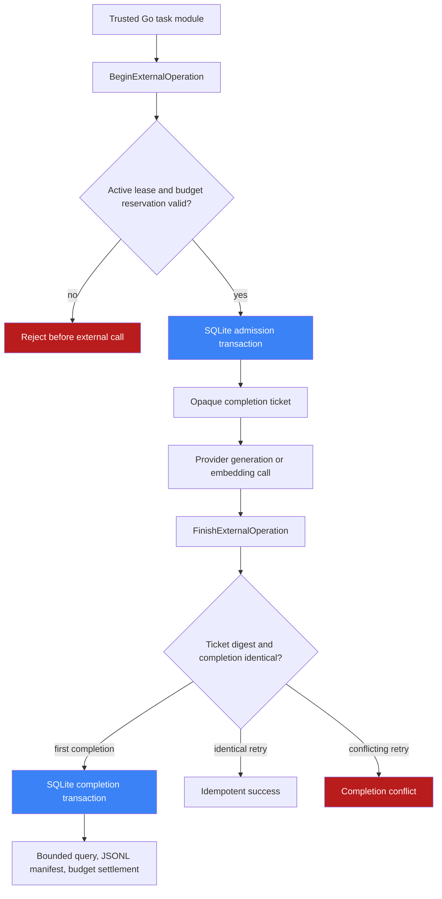
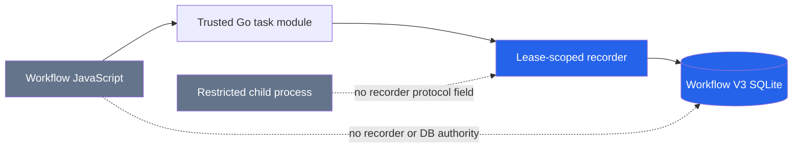
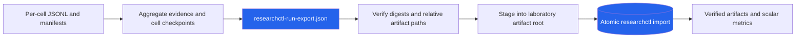

# Workflow V3 Durable External Operation Evidence Instrumentation

External calls are where workflow evidence is most likely to become ambiguous. A workflow task can know that it intends to call a provider, and it can know that it later produced an output, but those facts alone do not prove when the provider call was admitted, whether it actually began, whether cancellation raced with completion, or how a retry affected budget. This project added a durable, privacy-bounded operation ledger to Workflow V3 and then used it to instrument RAG TTC generation and embedding calls.

The implementation is not a logging layer. It is a persistent protocol with two distinct moments: admission before an effect may begin, and completion after an observation is available. The protocol is tied to Workflow leases and attempt budgets, but an already issued operation ticket can persist a late completion after cancellation or lease loss. This distinction is the basis for reliable call-time evidence without giving JavaScript or isolated workers authority over the recorder or SQLite database.

> [!summary]
> - Workflow V3 now persists closed-schema external-operation admissions and completions in SQLite with lease fencing, opaque tickets, idempotency, export, and budget reconciliation.
> - RAG TTC generation and embedding providers record one durable operation per actual provider request, then publish per-cell JSONL/manifest custody before source-bearing runtimes are deleted.
> - Fixture qualification produced 282 operation rows across 12 cells, passed privacy scans and researchctl import of 37 verified artifacts plus four scalar metrics.
> - The real qualification remains intentionally incomplete: current host manifests were repaired through ticket-local scripts, but provider construction now stops at `RAG_PROVIDER_ENV_MISSING` before any paid call.

## Why ordinary task evidence is insufficient

A task-level record answers a coarse question: did a Workflow node attempt run, succeed, fail, or lose its lease? A provider interaction needs finer evidence. One task can make more than one provider request; a response can arrive after the task context is cancelled; an output-validation failure can occur after a transport success; and a retry may consume a request budget even if the whole task never produces a final artifact.

The first design constraint was therefore to make a provider call a first-class durable entity. It had to be admitted before the call starts, linked to the current task attempt, and completed through a capability that cannot be reconstructed from ordinary task state. The second constraint was privacy: provider bodies, prompts, source text, URLs, headers, vectors, credentials, host paths, arbitrary metadata, and raw error messages must not enter the ledger.

The resulting model retains only bounded identities, integer counters, timestamps, closed outcome classes, and closed failure codes. That is enough to derive utilization, latency, concurrency, overlap, throughput, retry consumption, and incomplete-call counts without persisting provider payloads.

## The core model: admission is not completion

The ledger records an immutable admission row before an external effect is allowed to start. Admission contains an immutable descriptor digest, a bounded reservation, optional bounded measures, an ordinal within the Workflow attempt, and a durable operation ID. Completion is a separate immutable record containing a provider start time, elapsed microseconds, a closed outcome, accounting mode, and bounded counters.

The separation matters during failures. If the process dies after admission, the durable record proves that the system authorized a call to begin; it does not falsely claim a successful completion. If cancellation occurs after the call has crossed the network boundary, a later completion can still be recorded through the ticket. The completion does not revive the cancelled task, restore its output authority, or change the Workflow run's terminal state.



The two fences have deliberately different responsibilities:

| Fence | Applied when | What it prevents | What it does not prevent |
| --- | --- | --- | --- |
| Workflow lease and cancellation epoch | Admission | A stale or cancelled attempt from starting a new provider call | A completion for a call that was already admitted |
| Opaque ticket plus persisted completion-key digest | Completion | A fabricated, cross-operation, or conflicting completion | A legitimate late observation after lease loss |

The ticket's secret completion key is generated with 256 bits of entropy and only its SHA-256 digest is persisted. `ExternalOperationTicket.String()` and JSON deliberately omit the key. This avoids a common observability failure: turning a continuation capability into a loggable identifier.

## Closed descriptors define the privacy boundary

The generic contract lives in `/home/manuel/workspaces/2026-06-30/benchmark-cpu-inference/scraper/pkg/workflowv3/external_operation.go`. An `ExternalOperationDescriptor` fixes the operation kind, version, authority digest, sorted counter descriptors, and `MaxPerAttempt`. Its digest binds all of that content.

A descriptor can authorize only explicit counter names and roles:

```go
type ExternalOperationCounterDescriptor struct {
    Name  string
    Unit  string
    Roles []ExternalOperationCounterRole
}
```

The roles are `reservation`, `usage`, and `measure`. There is no map for labels, tags, request metadata, free-form provider data, or arbitrary error text. The RAG generation descriptor, for example, reserves cost microunits, input tokens, output tokens, and a request; it measures chunk count; and it later records actual bounded usage. The embedding descriptor reserves a request and measures representation count.

This schema is intentionally restrictive. A generic operation ledger becomes unsafe if callers can attach an arbitrary `map[string]any` because that map will eventually receive a prompt, a response body, an endpoint, a secret-bearing configuration fragment, or a host path. The closed schema makes the allowed evidence reviewable from type definitions and validation tests.

## Durable storage and reconciliation

The SQLite implementation adds five tables:

- `v3_external_operations` for admission identity and attempt linkage;
- `v3_external_operation_allocations` for reserved counters;
- `v3_external_operation_measures` for non-budget measurements;
- `v3_external_operation_completions` for immutable terminal observations; and
- `v3_external_operation_counters` for actual or conservative completion counters.

Workflow V3 opens its SQLite database with WAL, foreign keys, and `FULL` synchronous durability, then verifies those settings. This is an explicit durability policy rather than a performance hint. The ledger needs the admission commit to survive the interval before an external call begins.

Budget reconciliation is the important connection between evidence and policy. Operation reservations must fit the task's durable attempt reservation. On completion, actual counters are accepted only when the descriptor permits them and they fit the original reservation; conservative completion preserves the reserved charge when exact usage is unavailable. The existing Workflow budget settlement then consumes operation-derived usage instead of treating a provider span as an unaccounted side effect.

```text
attempt budget reservation
        │
        ├── Begin operation: reserve bounded subset
        │
        ├── provider call
        │
        └── Finish operation:
              actual counters    -> settle actual usage
              conservative state -> settle reserved maximum
```

The design avoids two incorrect accounting strategies. Charging only on a successful task undercounts a call that started but lost its result. Charging an entire attempt reservation for every provider request overcounts batched or multi-operation tasks. The operation allocation table makes the relationship explicit.

## Trusted module injection, not a JavaScript API

The recorder is created by `workflowv3runtime.Engine.ExecuteLease` and injected into `TaskModuleContext.ExternalOperations` for trusted Go module factories. The task module registry clones and validates declared operation descriptors by exact trusted module alias. JavaScript's `workflow/task` module and the isolated worker protocol remain unchanged.

This boundary is subtle but essential. JavaScript remains able to express task intent and call a trusted module. It does not receive a recorder, database handle, operation ticket, completion key, or descriptor registry. A later static authority-surface audit searched JavaScript, TypeScript, and isolated protocol sources for `ExternalOperations`, `externalOperations`, `BeginExternalOperation`, and `FinishExternalOperation`. There were no public or isolated references; the only wiring is Go-only task request and module context code.



The practical rule is simple: JavaScript describes work; trusted Go owns effects, durable admission, completion, validation, and accounting.

## Query and export: evidence must survive runtime cleanup

The generic store exposes joined public operation records and a bounded progress projection. `ExternalOperations` returns admissions with optional completions; `ExternalOperationProgress` returns admitted, completed, incomplete, active-by-kind, and outcome counts. It is useful for status without becoming a second source of truth.

`ExportExternalOperations` writes canonical JSONL plus a canonical manifest. The manifest contains the run ID, plan digest, event sequence, record counts, descriptor digests, JSONL digest, JSONL size, and privacy class. Publication is atomic and deterministic. The export does not include completion capabilities or source-bearing artifacts.

This generic export became critical in the TTC sweep because successful cells delete their source-bearing runtime directory after extracting durable evidence. The RAG sweep now exports its operation JSONL and manifest before closing the store and deleting the runtime. Each cell checkpoint contains relative paths and the manifest; failed or timed-out cells receive the same artifacts plus a closed reduction derived from operation rows.

The failed-cell reduction contains only values that can be recomputed from the compact rows:

- admitted, completed, and incomplete operation counts;
- outcome counts;
- total provider elapsed microseconds;
- peak provider concurrency;
- generation/embedding overlap microseconds; and
- generation and embedding operation counts.

This permits a failed cell to remain analytically useful without pretending that it produced a normal batch result.

## RAG TTC instrumentation

The RAG integration is in `/home/manuel/workspaces/2026-07-13/rag-eval-ttc/rag-evaluation-system/internal/workflowv3ttc/provider.go` and `module.go`. `OperatorProvider` declares generation and embedding operation descriptors. The module receives the lease-scoped recorder through the trusted module path and calls operation-aware provider methods only when that authority is present.

Generation instrumentation follows this ordering:

```go
if cumulativeAuthority.AdmitGeneration() fails:
    return RAG_TTC_GENERATION_REQUEST_CEILING

ticket = recorder.BeginExternalOperation(
    descriptor = provider.generate/v1,
    reservation = cost + input tokens + output tokens + request,
    measures = chunk count,
)

result = ExecuteCombinedPreparationBatch(...)

if transport/provider error:
    recorder.Finish(ticket, failed + conservative accounting)
    return classified failure

validate generated representations
if malformed:
    recorder.Finish(ticket, failed + conservative accounting)
    return RAG_TTC_GENERATED_INVALID

recorder.Finish(ticket, succeeded + actual counters)
return generated batch
```

The cumulative sweep authority is checked immediately before generic operation admission. That ordering keeps the older cross-invocation generation ceiling authoritative while the generic ledger supplies the durable per-call evidence and task-budget reconciliation. A crash can conservatively charge an admitted request; it cannot silently make a submitted generation request free.

Embedding instrumentation is per underlying embedding request, not per aggregate `EmbedBatch`. A batch abstraction can contain multiple provider requests; recording one aggregate span would hide actual concurrency and request count. The provider begins and finishes an operation around each `embed` invocation, then the enclosing batch produces its existing aggregate usage and timing measurement.

## Fixture qualification and custody results

The fixture control executed 12 cells across batch sizes 1, 2, 4, and 8 and concurrency levels 1, 2, and 4. It produced 282 durable operation records. Every cell had operation JSONL and manifest files before runtime cleanup.

The fixture path exercised both normal and intentionally bounded failure custody. A forced one-nanosecond cell deadline produced a failed checkpoint with a JSONL, manifest, and zero-operation reduction. This verifies that the failure path publishes compact evidence rather than silently losing it.

The rendered fixture figures were visually inspected:

- makespan by batch size/concurrency;
- generation/embedding overlap;
- median provider latency; and
- request/concurrency timeline.

Axes, legends, markers, and reference lines were legible. No clipping, blank render areas, source text, provider bodies, credentials, URLs, or host paths were visible. The renderer source confirmed the overlap label spelling after a tentative visual-model concern.

A byte-level privacy canary scanned the fixture custody bundle for fixture source text, a sensitive provider-body sentinel, authorization/bearer text, HTTP URLs, `content_text`, and provider configuration names. It found none.

## Researchctl custody is downstream, not call-time authority

Researchctl is deliberately not part of the provider-call path. RAG's `researchctladapter.BuildOperationCustodyRunExport` turns compact JSONL/manifests and scalar reductions into the generic `lab.RunExport` contract. It calculates artifact digests and sizes locally but persists only relative URIs and verified identities.

The sweep can emit `researchctl-run-export.json` only when the operator supplies a canonical specification plus explicit run ID, attempt ID, external run ID, and RFC3339 recorded time. It refuses partial identity inputs rather than inventing an import identity or timestamp.

A fresh fixture validation created a researchctl laboratory and imported the sweep custody bundle. The import staged 37 verified artifacts and four scalar metrics. The metrics are deliberately scalar and bounded: cell count, generation requests, embedding requests, and makespan microseconds.



This division keeps researchctl as durable downstream custody. It does not need provider credentials, Workflow leases, or live recorder authority.

## Failure modes that shaped the implementation

Several failures materially changed the design.

### Aggregate-only evidence loses completed cells

An earlier authorized real attempt completed seven cells, but its aggregate lived only in memory until the final run completed. A later request ceiling failure prevented final aggregate publication. The correction was not to reconstruct results from memory. The sweep now writes each successful cell checkpoint atomically before deleting its runtime.

### Retrying requires explicit cumulative authority

The first real attempt consumed one admitted generation request before its timeout. A later attempt consumed the remaining authority, including a retry, and the next request was denied with `RAG_TTC_GENERATION_REQUEST_CEILING` before submission. The authority model is therefore cumulative across invocations. A retry is not implicit spare capacity.

### Full SQLite durability changes fixed storage overhead

The operation ledger added a fixed SQLite schema footprint. A pre-existing privacy integration test expected the database to remain below half the source artifact size using a 500-row fixture. The invariant was correct, but the fixture was too small to distinguish fixed schema overhead from source persistence. The fixture increased to 750 rows while retaining the same `< input.Size/2` assertion. Full normal and race suites then passed for both `workflowv3sqlite` and `workflowv3runtime`.

### Host identity validation must be repaired before paid qualification

The later non-submitting real preflight found stale host model manifest digests, then stale prompt template/manifest digests. Ticket-local preview/write tools repaired only derived digest fields. Provider construction now stops at `RAG_PROVIDER_ENV_MISSING`, before real sweep admission. This is the desired failure order: no credentials or environment means no provider instance and no paid call.

## Validation matrix

| Concern | Evidence |
| --- | --- |
| Contract validation and closed counters | `pkg/workflowv3/external_operation_test.go` and commit `b637095` |
| SQLite schema/durability | commits `1542075`, `e061769`; WAL/FULL/foreign-key validation |
| Lease loss | `TestExternalOperationTicketCompletesAfterLeaseLoss`, commit `1d31270` |
| Reopen/idempotency | `TestExternalOperationCompletionSurvivesStoreReopen`, commit `c9e69c4` |
| Concurrent Begin/Finish | `TestExternalOperationConcurrentAdmissionAndCompletion`, commit `5336677` |
| Budget reconciliation | commit `b8857b1` |
| Canonical export | commit `27efa9e` |
| Generation/embedding spans | RAG commits `b728e0a`, `3bde483`, `0147ea2` |
| Per-cell custody/reduction | RAG commits `9603d6f`, `4b0f2bf` |
| Researchctl import | RAG commits `88d846d`, `4ac4ca4`; 37 artifacts, 4 metrics |
| Full scraper validation | `GOWORK=off go test ./... -count=1`, `GOWORK=off golangci-lint run ./...` |
| Privacy | fixture byte canary, source-bearing SQLite integration canaries, static JS/isolated-authority audit |

## Working rules

- Admit durably before an external call begins.
- Treat completion as a separate observation and authorize it only with a prior opaque ticket.
- Do not let completion restore task, output, or run authority after cancellation or lease loss.
- Keep operation schemas closed. If a proposed field can contain provider text, an endpoint, a credential, a vector, or arbitrary metadata, it does not belong in the ledger.
- Record one operation per real provider request. Do not let batch abstractions hide request count or concurrency.
- Publish compact per-cell evidence before deleting source-bearing runtime state.
- Keep researchctl downstream of call-time authority.
- Treat real-provider retries as explicit cumulative authority.
- Do not interpret a generic continuation message as spending approval.

## Current status and next steps

The reusable instrumentation, fixture qualification, researchctl custody path, privacy checks, graph inspection, full/race validation, and reMarkable audit bundle are complete. The ticket-local scripts now preserve the experiments and redacted configuration interfaces needed to repeat those checks.

The real run is still not a result. The host profile now passes model and prompt identity repair but cannot be constructed because its required environment is unavailable in the current process. The next sequence is precise:

1. Supply the host environment through the approved secret-management path.
2. Run `rag-eval providers validate` without printing configuration or credentials.
3. Compile a current canonical TTC specification against the validated profile and frozen artifact root.
4. Run the non-submitting 60-request preflight with 61 prior admissions and eight retry admissions.
5. Confirm the cumulative paid envelope before one bounded real run.
6. Repeat operation export, privacy scans, researchctl import, graph rendering/inspection, and completion audit against the real evidence.

## Source material

- Scraper implementation: `/home/manuel/workspaces/2026-06-30/benchmark-cpu-inference/scraper/pkg/workflowv3/external_operation.go`
- SQLite ledger: `/home/manuel/workspaces/2026-06-30/benchmark-cpu-inference/scraper/pkg/workflowv3sqlite/external_operation.go`
- Runtime injection: `/home/manuel/workspaces/2026-06-30/benchmark-cpu-inference/scraper/pkg/workflowv3runtime/engine.go`
- Ledger ticket design: `/home/manuel/workspaces/2026-06-30/benchmark-cpu-inference/scraper/ttmp/2026/07/22/SCRAPER-WORKFLOW-V3-EXTERNAL-OPERATIONS--durable-external-operation-evidence-ledger/design-doc/01-durable-external-operation-evidence-ledger-design-and-implementation-guide.md`
- RAG provider adapter: `/home/manuel/workspaces/2026-07-13/rag-eval-ttc/rag-evaluation-system/internal/workflowv3ttc/provider.go`
- RAG sweep: `/home/manuel/workspaces/2026-07-13/rag-eval-ttc/rag-evaluation-system/cmd/rag-ttc-v3-sweep/main.go`
- RAG ticket diary/design/scripts: `/home/manuel/workspaces/2026-07-13/rag-eval-ttc/rag-evaluation-system/ttmp/2026/07/22/RAG-TTC-V3-SWEEP--workflow-v3-umans-batching-and-concurrency-study/`
- Scraper completion audit: `/home/manuel/workspaces/2026-06-30/benchmark-cpu-inference/scraper/ttmp/2026/07/22/SCRAPER-WORKFLOW-V3-EXTERNAL-OPERATIONS--durable-external-operation-evidence-ledger/analysis/01-workflow-v3-external-operation-ledger-completion-audit.md`
