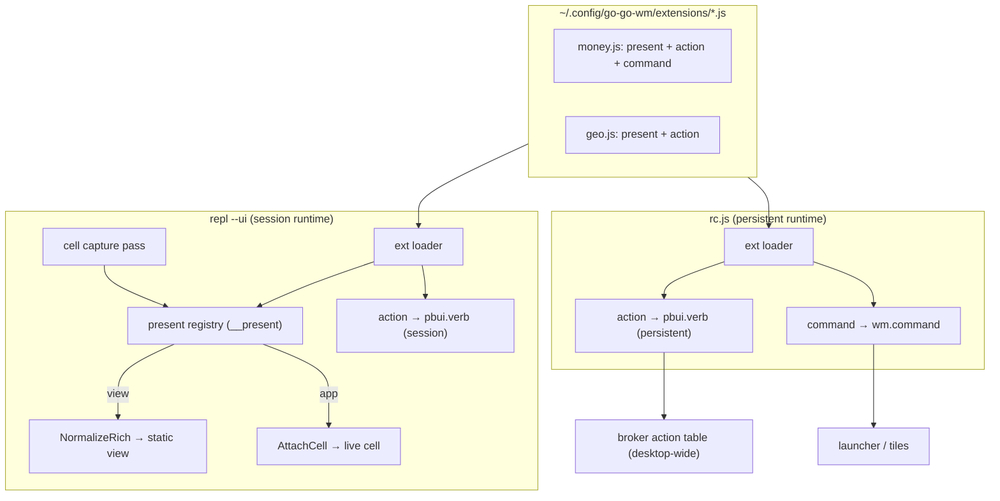
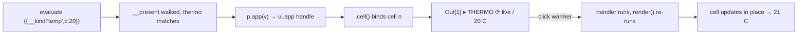

# go-go-wm: User Extensions — Presenters, Actions, and Apps Loaded from Config

This report covers a phase whose result is small in code and large in
consequence: a user can now drop a JavaScript file into a configuration
directory and add three kinds of capability to a running go-go-wm — a new
way to display a value, a new action offered on a type, and a new app or
launcher entry. It builds directly on two earlier pieces of work, the live
interactive REPL cells ([[PROJ - go-go-wm - Floating Windows, a Command Launcher, and a Rich Presentation REPL]]
introduced the REPL; a later phase made its cells host running apps) and the
presentation-and-verb model that runs through the whole system
([[PROJ - go-go-wm - PBUI Window Manager in Go]]).

The purpose of this report is not to catalogue the diff. It is to explain a
claim that shaped the entire design and that a reader can carry to other
systems: an extension mechanism does not require an extension framework. If
a system already turns values into typed presentations, already lets clients
register verbs on types, and already has a persistent scripting host, then
"user extensions" is the act of exposing those three facilities through a
small, uniform surface and loading files that call it. The work is wiring,
not invention. The phase is worth studying precisely because it resisted the
temptation to build the framework the feature seemed to demand, and instead
found the framework already present under three different names.

> [!summary]
> - **One file, three registrations.** `present({match, view|app})` adds a
>   display type; `action({ptypes, id, run})` adds a verb; `command({id, run})`
>   adds a launcher entry. A single extension file can call all three.
> - **Registrations split by lifetime, not by syntax.** A presenter matters
>   only where cells render, so the REPL owns it and it dies with the session.
>   A verb must outlive any one session and appear desktop-wide, so it lives
>   in the persistent `rc.js` runtime. The same file is loaded by both hosts;
>   each runs what it supports and no-ops the rest.
> - **Almost no new Go.** Display types reuse the existing `NormalizeRich`
>   validator and the live-cell host. Actions and commands turned out to be
>   thin shims over `pbui.verb` and `wm.command`, which already existed. The
>   only genuinely new code is a presenter registry, a capture-pass branch, a
>   file loader mirroring the capsule loader, and a JavaScript shim file.
> - **Proven end to end.** Nineteen Go tests cover the capture-pass
>   precedence, the loader, and the action round-trip through a real broker; a
>   Xephyr end-to-end test shows a config-loaded presenter rendering a live
>   app in the notebook and updating on a click.

## Why this phase exists

The REPL could already display a value in more than one way, but only through
two mechanisms, and both were closed to the user in the ways that matter.
The first is Go-side derivation: a large `switch` in `repl.Derive` that turns
a color into a swatch, a numeric array into a sparkline, an array of records
into a table. It is total and it is good, and it is completely fixed — you
cannot add a case from JavaScript. The second is the `__pbui__` method: an
object can carry a method that returns its own display descriptor. This is
open to JavaScript, but it is per-object and static. The value must *be* the
thing that knows how to present itself, so you cannot give a display to a
plain number or to a record that came back from an API you do not control;
and the descriptor is rows only, so a `__pbui__` view is a picture, never a
program with a working button.

What a user actually wants sits in the gap between these two. They want to
say "any value shaped like this should render like that" — a matcher, which
neither mechanism provides — and they want the result to be able to do
something when clicked. They also want two things derivation and `__pbui__`
never addressed at all: to add an *action* to a type, so that right-clicking
a value of that type offers a verb the user wrote; and to add an *app* or
launcher entry to the desktop. And they want all of this to load
automatically from a configuration directory, the way capsules already do,
so that customizing the system is a matter of editing files rather than
recompiling. This phase fills that gap.

## The substrate this builds on

Understanding the design requires holding four existing facilities in view,
because the extension system is defined almost entirely in terms of them.

**Derivation.** `repl.Derive(value)` (`pkg/repl/derive.go`) is a pure
function from an exported JavaScript value to a `repl.Value` — a typed object
with a one-line summary and an ordered list of named views. A view is a
`uispec.Spec`, which is rows of segments (`text`, `hint`, `button`, `object`,
and a few more). This intermediate representation contains no goja and no X,
which is what makes the REPL core testable and what an extension's presenter
will ultimately produce.

**The `__pbui__` descriptor and its validator.** When a value carries a
`__pbui__()` method, the REPL calls it and passes the result to
`repl.NormalizeRich` (`pkg/repl/value.go`). `NormalizeRich` is the gate that
matters here: it accepts only the keys `ptype|summary|doc|input|views`,
requires a non-empty summary and a non-empty views array, normalizes each
view's rows through `uispec.Normalize`, and — importantly — stores the
*evaluated value*, not the descriptor, as the object's payload, so that
downstream accepts and verbs see the real data. A presenter that produces a
static display will hand its descriptor to exactly this function.

**Live app cells.** A prior phase added `ui.app(def).cell()`: a notebook cell
can host a running `ui.app` surface whose buttons work and whose `render()`
re-runs on each handler, updating in place. Mechanically, `.cell()` calls the
REPL host's `AttachCell`, which binds the app to the cell currently being
evaluated and wires a redraw hook; the session grows a live-app cell kind and
namespaces the app's action ids so clicks route back to it. A presenter that
produces an *interactive* display will call exactly this path.

**Verbs.** An action on a type is a verb: a `pbui.Verb{ID, Label, Ptypes,
Accepts}` registered on the broker. A client contributes verbs with
`RegisterVerbs` and serves their invocations with `OnVerbRun`; the broker
assembles a right-click menu for an object by matching every registered verb
whose `Ptypes` cover the object's ptype. Two facts about verbs determine the
whole shape of the extension design. First, a verb lives only as long as the
client connection that registered it; when the connection closes, the broker
revokes the verb. Second, a verb is desktop-wide — it appears on any object
of a matching type in any application's menu. Together these mean that a user
*action* needs a persistent host: a verb registered by a process that exits
immediately is useless.

## What a user extension is

An extension is a JavaScript file in `~/.config/go-go-wm/extensions/` that,
when evaluated in a host runtime, calls one or more registration functions.
There are three, one for each thing a user wants to customize.

| Function | What it adds | Scope and lifetime | Host |
|---|---|---|---|
| `present({name, match, view\|app})` | a display type | the REPL session | `repl --ui` |
| `action({ptypes, id, label, run})` | a verb in right-click menus | desktop-wide, persistent | `rc.js` |
| `command({id, label, run})` | a launcher entry / app | desktop-wide, persistent | `rc.js` |

The fact an implementer must internalize is stated in the middle column:
these three land in *different runtimes because they have different
lifetimes*. A presenter is only meaningful where cells render, so the REPL
owns it, and it disappears when the REPL session ends — which is correct,
because a display type for a notebook has no meaning once the notebook is
gone. A verb, by contrast, must survive any single REPL session and appear
across the entire desktop, so it needs a runtime that stays up. The system
already has exactly one such runtime: `rc.js`, the in-process configuration
script, which is persistent, trusted, and connected to the broker. It is the
natural host for actions and commands, and no new daemon is required.

One extension file can contain all three kinds of registration. Each is
picked up by whichever host is loading the file and ignored — as a harmless
no-op — by hosts where it does not apply. This is what makes "customize your
setup by editing files" a single coherent activity rather than three parallel
systems, and, as the implementation section shows, making that no-op behavior
correct is the one genuinely subtle part of the work.

## Architecture

The same files on disk feed two loaders. The REPL loader activates `present`
(and, session-scoped, `action`). The `rc.js` loader activates `action` and
`command` with persistent, desktop-wide lifetime. Nothing new is invented on
the render side or the action side; the arrows lead back into machinery that
already existed and was already tested.



## Implementation details

### The presenter registry and the capture pass

The heart of the display-type feature is a registry so small it is almost not
there: a global array `__present`, installed by the REPL prelude alongside
`Out` and `$_`, and a `present(spec)` function that validates its argument and
pushes it. Validation requires a `match` function and exactly one of `view` or
`app`; the constraint is worth enforcing because a presenter with both, or
neither, has no well-defined behavior.

The interesting code is where the registry is consulted. When the REPL
evaluates a cell, it runs a capture pass on the JavaScript loop with the cell
number in scope. That pass already handled the `__pbui__` case. The extension
work adds one branch after it, expressed here as pseudocode that mirrors
`resolvePresenter` in `pkg/cmds/replui.go`:

```
resolve(value, n):
    if value has a __pbui__ method:
        return NormalizeRich(export(value), value.__pbui__())   # existing; wins
    for p in reverse(__present):                                # newest first
        if not truthy(p.match(value)): continue
        if p.app:
            handle = p.app(value)
            handle.cell()        # binds to cell n via AttachCell
            return LIVE          # session now holds the live app; no derived value
        if p.view:
            return NormalizeRich(export(value), p.view(value))  # same path as __pbui__
    return Derive(export(value))                                # built-in fallback
```

Two details in this branch are easy to get wrong and worth stating plainly.

The first is precedence, encoded by the order of the three returns. A value's
own `__pbui__` always wins, because an object that knows how to present itself
is authoritative and a user's registry should not override it. Then registered
presenters are tried newest-first, so that a later file can shadow an earlier
one's match. Then, and only then, built-in derivation runs. This ordering
makes the extension mechanism strictly additive: installing a presenter can
change how an unclaimed value renders, but it can never break a value that
already presents itself, and it can never remove a built-in.

The second detail is how the app path binds to the right cell. When a
presenter returns a `ui.app`, the code calls `.cell()` on it *during the
capture pass*. That works with no additional plumbing because the evaluation
worker sets the in-flight cell number around the entire evaluate-and-capture
call and clears it afterward; the `AttachCell` path keys on that number. The
presenter's `.cell()` therefore resolves "the current cell" correctly for
free. The app path returns a sentinel meaning "a live surface is already
attached; produce no derived value," and the session renders the attached app
rather than a static presentation.

A consequence worth noting is that the failure modes are gentle. A presenter
whose `match` or `view` throws, or whose descriptor fails `NormalizeRich`,
does not abort the cell; the error is written to the cell's console and
derivation runs instead. The tests pin this: an invalid presenter descriptor
produces a `presenter invalid` console note and a normally-derived value, not
a crash.

### The loader

Making presenters user-installable is a second, independent piece:
`pkg/extension`, a package deliberately free of goja and X so that any host
can import it. It mirrors the existing capsule loader (`pkg/capsule`) but over
bare single files rather than directories with manifests, because an extension
has no manifest — it is trusted, host-endowed code, and the file itself is the
unit. `SearchPath()` honors `GO_GO_WM_EXTENSION_PATH` and otherwise resolves to
`$XDG_CONFIG_HOME/go-go-wm/extensions`. `Discover(dirs)` reads `*.js` files in
lexical order, treats a missing directory as the normal fresh-install state
rather than an error, shadows by base name across directories the way a search
path does, and returns read errors without hiding the files that loaded
cleanly.

The REPL wires this in after the prelude: it discovers extensions and
evaluates each source in the REPL runtime, so that a file's `present` and
`action` calls take effect. Loading is tolerant. A file that fails to read or
throws during evaluation is logged and skipped; one broken extension must not
break the notebook. An integration test writes an extension to a temporary
directory, points the search path at it, loads it, and then confirms that
evaluating a matching value takes the presenter path — the loader and the
capture pass proven together, headless.

### Actions and commands: the framework was already there

The design's original assumption was that adding an action from JavaScript
would require new Go: a top-level verb-registration API, an accumulation of
the verb set, an `OnVerbRun` dispatcher that posts handlers onto the
JavaScript loop. Reading the source before writing it revealed that this API
already exists. `pbui.verb({id, label, ptypes, accepts}, handler)`
(`pkg/jsmod/pbuimod/verbs.go`) does precisely those things — it accumulates the
client's verb set, installs the `OnVerbRun` bridge once, and posts each
handler onto the loop. The launcher side is the same story: `wm.command({id,
label, doc, run})` already registers a command, in-process or over IPC.

So `action` and `command` are not Go at all. They are a few lines of
JavaScript in a shared file, `ext_api.js`:

```
action(spec):
    require id and a run function
    pbui.verb({ id, label|id, ptypes|["any"], accepts }, spec.run)

command(spec):
    require id and a run function
    wm.command({ id, label|id, doc, run: spec.run })
```

This is the concrete form of the report's thesis. The extension system adds no
new verb machinery, no new command machinery, no new dispatch. It adds a
matcher-based display registry (which is new, because nothing matched values
before) and a JavaScript surface over facilities that were already built and
tested. The amount of Go the feature required is a registry array, a
capture-pass branch, a file loader, and the wiring to evaluate a shim; the
rest is JavaScript delegating to primitives that predate it.

### One file, many hosts: the no-op that makes it safe

The single subtle problem in the phase is host portability. The three
registration kinds live in different runtimes, but the *file* is shared, so
every symbol a file might call must be defined in every host — as either the
real facility or a safe no-op — before the file runs. If `rc.js` loaded a file
that called `present(...)` and `present` were undefined, the resulting
`ReferenceError` would abort the file and lose its `action` and `command`
registrations along with it. The failure would be silent and confusing: a
file that works in the REPL would half-fail on the desktop.

The fix is one embedded file, `ext_api.js`, evaluated by both hosts. It binds
the `wm`, `pbui`, and `ui` module globals if a host has not already; it defines
`action` and `command`; and it defines `present` only as a no-op *if a real one
is not already installed*. In the REPL, the prelude installs the real
`present` first, so the fallback is skipped and the real registry is used. In
`rc.js`, there is no real `present`, so the no-op is installed and a shared
file's `present(...)` call becomes a harmless skip that does not disturb the
file's `action` and `command` calls. The load order per host is the whole
mechanism:

| Host | Load order |
|---|---|
| `repl --ui` | `repl_prelude.js` (real `present`) → `ext_api.js` (`action`/`command`) → extension files |
| `rc.js` | rc file, optional → `ext_api.js` (`present` no-op + `action`/`command`) → extension files |

A dedicated test asserts the guarantee directly: in a non-REPL runtime, a file
that calls `present(...)` and then `action(...)` runs to completion, with the
action registered and no error raised.

### Generalizing the persistent host

One supporting change was needed on the `rc.js` side. Historically the
in-process script host only ran when an rc file was configured. Extensions
should not require an rc file, so `startRC` was generalized: it now reads the
rc file if one is named, discovers extensions regardless, and returns without
building a runtime only when there is neither an rc file nor any extension. A
failing rc file no longer stops extensions from loading, and the window
manager's startup calls the host unconditionally so that a user with
extensions but no rc file still gets them. Actions and commands registered
here are desktop-wide and live for the whole window-manager session, because
they ride `rc.js`'s persistent broker connection.

## The load-bearing insight

The reason to write this report is the insight the phase produced, which is
more general than go-go-wm. When a system is asked to become extensible, the
instinct is to build an extension framework: a plugin API, a registration
lifecycle, a dispatch layer, a loader. The better first move is to ask which
of those already exist under other names. A system with a rich value model
usually already has the display half of the answer. A system with any notion
of registered handlers usually already has the action half. A system with a
configuration script usually already has the persistent host. Extensibility,
in such a system, is the work of exposing those three through one small
surface and loading files that call it — and of getting the boring parts right:
precedence so extensions are additive, tolerance so one bad file is contained,
and portability so one file is safe in every host. None of those three is a
framework. All three are wiring, and wiring is where the correctness lives.

## Trust posture

An extension runs with the loading host's full endowment. Loaded by `rc.js`,
it has `wm`, `pbui`, `ui`, and `exec` — it is as trusted as the configuration
file itself, which is to say it can do anything the configuration can. Loaded
by the REPL, it has the REPL's endowment. Extensions are therefore *not*
capsules. A capsule is capability-scoped, launched behind a powerbox, granted
only the specific reads it requested; it is the mechanism for running code you
do not fully trust. An extension is the opposite by design: it exists to
deeply customize your own setup, which requires broad access, so it is trusted
user code like a shell startup file. This is a deliberate decision, and the
correct message to a user is direct: an extension can do whatever your rc file
can, so install only extensions you trust; untrusted third-party code belongs
in a capsule, not an extension.

## Testing and validation

The feature is covered at two levels. The headless Go tests exercise the logic
without a display: the capture-pass precedence (a value's `__pbui__` beats a
presenter, a presenter beats derivation, newest presenter wins, an invalid
descriptor falls back to derivation); the loader (a missing directory is not an
error, lexical order, base-name shadowing across directories, a throwing file
skipped while a good sibling still registers); and the action shim driven
through a real in-process broker — a verb registered via `action` fires its
`run` when a second client invokes it, with the object passed through. The
host-portability guarantee has its own test: `present` as a no-op outside the
REPL does not abort a mixed file's `action`.

The end-to-end test proves the same paths in a real X session. It writes an
extension containing a live-app presenter for a value shaped like
`{__kind:"temp"}`, points the search path at it, boots the window manager in a
nested X server, opens the REPL, and evaluates a matching value. The
assertions are that the loader logged the extension, that the presenter's live
app rendered — the captured screenshot shows the cell as `Out[1] ▸ THERMO ⟳
live` with `20 C` and a `warmer` button, which is the presenter's surface and
not the generic JSON view derivation would have produced — and that clicking
the button re-ran the app and updated the cell in place to `21 C`. That single
transition demonstrates the full chain: discovery from the configuration
directory, the presenter matching the value, the app path calling `.cell()`,
the cell binding to the live surface, and the surface responding to input.



## Current project status

The extension system is implemented across three slices, all with passing
tests, and validated in Xephyr. Display types (`present`) work in the REPL and
load from the configuration directory. Actions and commands (`action`,
`command`) work as JavaScript shims over the existing verb and command
primitives, and load into the persistent `rc.js` host, with or without an rc
file. A set of demo extensions — a live counter, a geographic-point card with a
copy action, and a money type showing all three registration kinds — is
installed for dogfooding. The full repository test suite is green.

## Open questions

A few questions are deliberately left open. Whether presenters should receive
the live goja object in addition to the exported value — enabling a presenter
to read methods and prototypes — is unresolved; the exported form is simpler
and matches what derivation sees, and a second argument can be added if a real
presenter needs it. Whether duplicate verb ids registered under the same host
should warn rather than silently last-writer-win is a small ergonomic gap worth
closing. And hot reload — re-evaluating an extension file when it changes on
disk — is a development convenience that has not been built.

## Near-term next steps

The most valuable next step is a second end-to-end test on the desktop path: a
`rc.js` action appearing in a right-click menu on a color object, closing the
loop on the `action` UI the way the existing test closes it on the presenter
UI. After that, a user-facing "writing extensions" document, and the small
correctness follow-ups above.

## Important project docs

The design and implementation are recorded in ticket **GGWM-018-EXTENSIONS**
under the repository's `ttmp/2026/07/23/` tree: an intern-oriented
analysis/design/implementation guide, a chronological investigation diary with
four steps, and the Xephyr end-to-end harness with its golden screenshots. The
demo extensions and their README live under `examples/extensions/` in the
repository.

## Project working rule

When a feature asks for a framework, first find the framework already present
under other names. Build the small surface that exposes it, and spend the
implementation effort on the three properties that make a surface trustworthy
rather than merely functional: additive precedence, tolerant loading, and
host portability.
