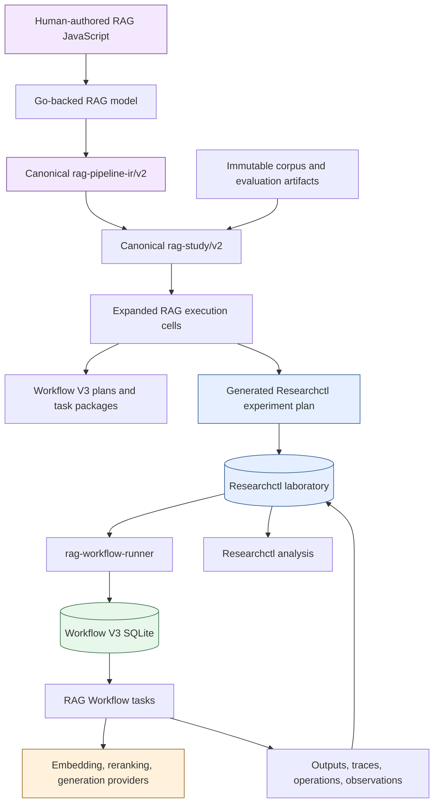
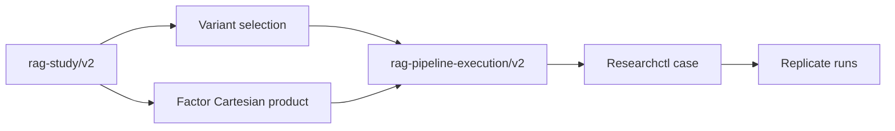
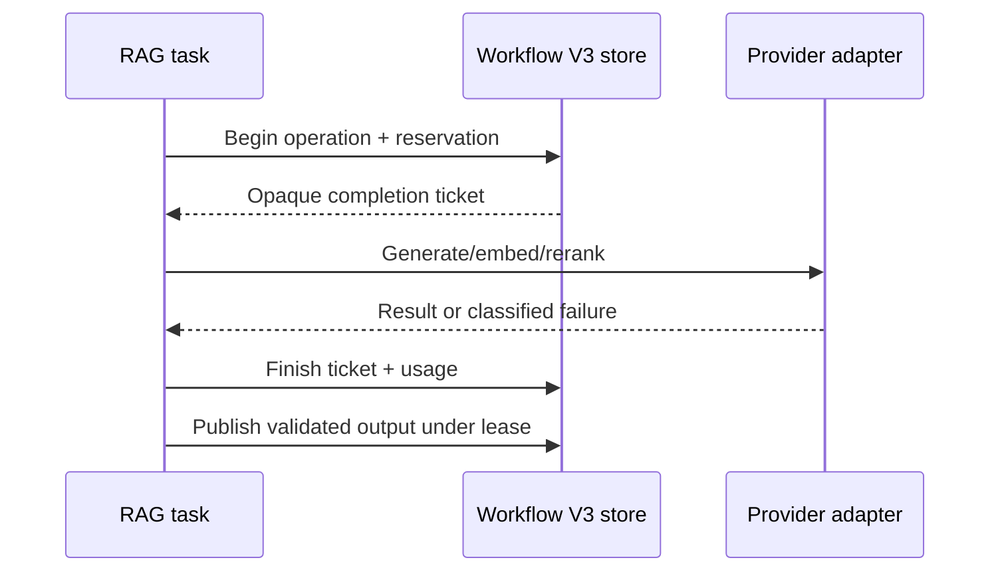

# RAG Experiment JavaScript: Language, API, and End-to-End Execution

The RAG experiment JavaScript API is a typed authoring language for retrieval systems. A scientist uses it to define corpus preparation, chunking, generated representations, embeddings, indexes, retrieval channels, collapse, fusion, hydration, reranking, answer generation, experimental variants, factors, metrics, invariants, and replicate counts. The JavaScript program does not execute those operations. It builds a canonical RAG specification that is validated and lowered into durable Workflow V3 executions, scheduled as immutable Researchctl runs, and analyzed from verified evidence.

This article explains the language from first principles and follows a complete experiment from readable JavaScript to provider operations, index construction, query evaluation, Researchctl custody, and deterministic reports. It uses the real provider candidate and the fully scripted TTC acceptance study as concrete sources. It also explains how to use immutable corpus and evaluation data, how to add a new operator, why generated `researchctl-plan.js` files are difficult to read, and which parts of the architecture generalize to scientific domains outside RAG.

> [!summary]
> - `require("rag")` is a pure authoring module backed by Go. Its callbacks execute immediately and leave a closed, data-only RAG specification; they are not runtime hooks.
> - A pipeline describes reusable preparation and indexing. A query plan describes retrieval. A study crosses variants and factors over immutable data. A product binds the same semantics to an online request lifecycle.
> - `rag-eval study compile` expands the human-authored study, lowers every cell into an exact Workflow V3 plan, stages immutable inputs, and generates a machine-facing Researchctl plan.
> - Researchctl owns cases, replicates, ordering, resume, runs, attempts, and cross-run analysis. Workflow V3 owns nodes, leases, task retries, provider operations, budgets, cancellation, and artifacts. RAG owns semantic correctness throughout.
> - Generated representations improve retrieval but are never source evidence. Collapse controls voting identity; hydration recovers citable source chunks before reranking and answer generation.

## 1. Who should read this

This guide serves three related audiences.

A RAG scientist needs to know how to express a controlled experiment without implementing scheduling, retries, or report generation. The important questions are which semantic variables change, what constitutes an independent replicate, which metrics are requested, and which immutable corpus and evaluation artifacts are bound.

A RAG engineer needs to know how JavaScript descriptors become normalized operator graphs, how compiler and runtime registries agree, how provider identity enters execution, and how evidence remains deterministic and private under failure.

A platform engineer needs to know which responsibilities are generic. Researchctl and Workflow V3 are not RAG-specific. Another domain can use the same plan, laboratory, runner, artifact, observation, and analysis architecture while supplying a different closed domain configuration and task package.

By the end, a reader should be able to:

- read the existing RAG JavaScript examples without treating them as executable scripts;
- author a new pipeline, study, or product plan;
- bind real immutable inputs safely;
- compile and execute a study through Researchctl and Workflow V3;
- inspect failures at the correct lifecycle layer;
- add a new semantic operator without introducing an alternate runtime;
- distinguish a smoke, candidate study, qualification, and benchmark claim.

## 2. The complete path

The system has three languages and three execution boundaries.

1. **RAG JavaScript** expresses domain semantics.
2. **Researchctl experiment plans** express scientific cases and replicates.
3. **Workflow V3 plans** express durable tasks and dependencies for one case.

Only the first is intended for routine human editing in RAG work. The latter two are canonical machine artifacts or framework-level authoring surfaces.



The ownership rule is exact:

| Layer | Owns | Does not own |
| --- | --- | --- |
| RAG-eval | operators, RAG schemas, lowering, providers, measurements, preparation/query boundaries | scientific run allocation, Workflow leases |
| Researchctl | cases, factors, replicates, ordering, runs, attempts, resume, verified evidence, cross-run analysis | RAG semantics, Workflow task scheduling |
| Workflow V3 | nodes, leases, task attempts, retries, budgets, gates, effects, cancellation, artifacts, observations | experiment matrices, RAG meaning |
| Geppetto-backed adapters | bounded provider execution | plans, run identity, retry authority, evidence custody |

This division prevents one JavaScript file from becoming an experiment scheduler, provider client, retry loop, mutable checkpoint, and analysis program at the same time.

## 3. What `require("rag")` actually is

`require("rag")` is a native Goja module implemented in:

`/home/manuel/workspaces/2026-07-13/rag-eval-ttc/rag-evaluation-system/pkg/gojamodules/rag/module.go`

The module registers factories and namespaces:

```javascript
const rag = require("rag");

rag.pipeline(...)
rag.queryPlan(...)
rag.study(...)
rag.product(...)
rag.fragment(...)

rag.inputs
rag.units
rag.chunks
rag.representations
rag.embeddings
rag.indexes
rag.retrieve
rag.collapse
rag.fusion
rag.hydration
rag.rerank
rag.generation
rag.datasets
```

These values are not ordinary JavaScript implementation objects. Each exposed descriptor is a wrapper around a Go-owned `ragmodel.Descriptor`. The wrapper carries a private `goja.Symbol`. The public object shape is insufficient to forge a valid descriptor.

Conceptually, a factory does this:

```text
JavaScript call
  -> strict decode into a Go config type
  -> construct a Go ragmodel descriptor
  -> wrap the descriptor in a JavaScript object
  -> attach it through a private Goja symbol
  -> return the wrapper
```

When a builder receives a descriptor, the module retrieves the hidden Go value. A plain object with similar properties is rejected.

This is a capability boundary. JavaScript cannot construct arbitrary RAG nodes, insert a provider callback, attach a SQL handle, or supply an executable function as a runtime operator.

### 3.1 Callbacks execute immediately

The callback passed to `rag.pipeline`, `rag.study`, or `rag.product` runs during authoring:

```javascript
const pipeline = rag.pipeline("my-pipeline", (p) =>
  p
    .corpus(rag.inputs.corpus("corpus"))
    .units(rag.units.identity())
    .chunks(rag.chunks.recursive({ maxRunes: 1200 })),
);
```

The sequence is:

```text
rag.pipeline(name, callback)
  -> Go creates PipelineBuilder
  -> Go exposes a temporary JS builder wrapper
  -> callback(builder) executes now
  -> Go freezes builder state into Pipeline
  -> temporary callback and builder wrapper are discarded
  -> JavaScript receives a pipeline descriptor
```

No callback is serialized. No closure runs in a worker. Captured variables do not become hidden execution inputs. This is why ordinary JavaScript composition remains convenient without weakening deterministic execution.

### 3.2 Chain methods return the same builder

The builder API is fluent because every mutator returns the same builder wrapper:

```javascript
p
  .corpus(...)
  .units(...)
  .chunks(...)
  .representations(...)
  .embedding(...)
  .index(...);
```

The chain expresses ordered authoring intent. The compiler later derives semantic node identities and canonical topological order. Formatting, temporary variable names, and callback structure do not determine durable identity.

### 3.3 TypeScript declarations describe the language

The native module publishes TypeScript declarations from:

`pkg/gojamodules/rag/typescript.go`

Core descriptor types encode expected dataflow:

```typescript
type UnitOperator = Descriptor<"corpus", "units">;
type ChunkOperator = Descriptor<"units", "chunks">;
type RepresentationOperator = Descriptor<"chunks", "representations">;
type EmbeddingOperator = Descriptor<"representations", "embeddings">;
type IndexOperator = Descriptor<"representations", "index">;
type RetrieverOperator = Descriptor<"index", "ranked-records">;
type CollapseOperator = Descriptor<"ranked-records", "ranked-parents">;
type HydrationOperator = Descriptor<"ranked-parents", "evidence">;
type RerankerOperator = Descriptor<"evidence", "evidence">;
type GenerationOperator = Descriptor<"evidence", "answer">;
```

These declarations improve editor feedback, but Go validation remains authoritative. The current real-provider example uses `representations.combinedSummaryQuestions`, which is implemented in the native module but is not yet represented in the shown declaration surface. That is a documentation/declaration parity gap worth correcting before presenting the real-provider directory as the definitive editor experience.

## 4. The four main authoring values

The language has four primary composition values: pipeline, query plan, study, and product.

### 4.1 Pipeline

A pipeline describes query-independent corpus preparation and indexing:

```text
corpus
  -> units
  -> chunks
  -> representations
  -> embeddings
  -> indexes
```

It does not describe experiment replicates or online request policy.

### 4.2 Query plan

A query plan describes retrieval and evidence construction:

```text
query
  -> retrieval channels
  -> per-channel collapse
  -> fusion
  -> final collapse
  -> source hydration
  -> result limit
```

Reranking and answer generation are attached by a study variant or product, after hydrated evidence exists.

### 4.3 Study

A study binds:

- one pipeline;
- one immutable evaluation dataset role;
- one or more variants;
- zero or more factors;
- a replicate count;
- requested metrics;
- required invariants.

A study is still domain intent. Researchctl later owns case scheduling and replicate execution.

### 4.4 Product

A product binds the same normalized pipeline and query semantics to:

- request fields;
- response format;
- citation policy;
- timeout and concurrency;
- provider failure behavior;
- trace policy.

Product execution never creates a Researchctl study or scientific run. Qualification can freeze a product configuration into comparable study input without mixing online and scientific lifecycle.

## 5. A complete real-provider pipeline

The most direct human-authored TTC pipeline is:

`experiments/real-provider-v2/base.js`

Its structure is:

```javascript
const rag = require("rag");

function buildPipeline(name, maxRunes) {
  return rag.pipeline(name, (p) =>
    p
      .corpus(rag.inputs.corpus("corpus"))
      .units(rag.units.identity())
      .chunks(rag.chunks.recursive({
        maxRunes,
        overlapSpans: 0,
        levels: ["runes"],
      }))
      .representations(
        rag.representations.compose(
          rag.representations.raw("raw"),
          rag.representations.combinedSummaryQuestions({
            model: "generator-umans-flash",
            prompt: "ttc-combined-preparation-v2",
            outputSchema: "rag-combined-preparation/v2",
            batchSize: 1,
            questionsPerChunk: 4,
            maxBatchRunes: 1200,
          }),
        ),
      )
      .embedding(
        rag.embeddings.model("embedding-primary", {
          dimensions: 768,
          distance: "cosine",
          normalize: "l2",
          batchSize: 16,
        }),
      )
      .index("representations", rag.indexes.bleveMulti({
        lexical: true,
        vector: { distance: "cosine", optimizeFor: "recall" },
      })),
  );
}
```

Each stage establishes a different identity and artifact boundary.

## 6. Corpus and unit extraction

The pipeline begins with:

```javascript
.corpus(rag.inputs.corpus("corpus"))
.units(rag.units.identity())
```

`rag.inputs.corpus("corpus")` declares a symbolic input role. It does not open a file. The role is bound later to an immutable corpus artifact.

A corpus artifact contains source records and a validated manifest. Its manifest has an identity independent from the generic file digest used by Researchctl custody. This distinction permits a JSON envelope to be copied into laboratory storage while preserving the domain manifest identity that describes corpus semantics.

`units.identity()` uses existing corpus units as the preparation units. Transcript-oriented examples instead use:

```javascript
.units(rag.transcript.units.agentsViewRuns())
```

That operator extracts semantic units from AgentsView transcript structure. Another available operator, `individualTurns()`, produces turn-level units.

The choice of unit affects relevance identity and collapse. A chunk can be the retrievable record while evaluation remains targeted at its parent unit. This is why chunk, unit, and document identity are not interchangeable.

### 6.1 Source extraction is upstream

The RAG pipeline accepts a corpus artifact; it does not define WordPress export, transcript archive import, HTML extraction, or arbitrary source crawling. Those processes create an immutable corpus snapshot first.

For a real study, the complete data path is:

```text
source system
  -> source-specific extraction/import
  -> normalized source records
  -> immutable corpus artifact + manifest
  -> catalog registration or file binding
  -> RAG pipeline corpus role
```

Keeping source extraction upstream has two benefits. Extraction can have its own authorization, restart, and provenance policy. The RAG study remains reproducible against an exact corpus digest rather than depending on mutable source-system state at execution time.

## 7. Recursive chunking

The real provider pipeline uses:

```javascript
.chunks(rag.chunks.recursive({
  maxRunes: 1200,
  overlapSpans: 0,
  levels: ["runes"],
}))
```

The scripted acceptance pipeline uses:

```javascript
.chunks(rag.chunks.recursive({
  maxRunes: 800,
  overlapSpans: 120,
}))
```

The parameters are part of semantic identity:

- `maxRunes` bounds chunk size;
- `overlapSpans` carries bounded context across neighboring chunks;
- `levels` declares allowed recursive splitting levels;
- optional atomic rules prevent unsafe splits where supported.

Changing chunking changes downstream representation inputs, embeddings, index records, retrieval candidates, and storage measurements. It therefore creates a different pipeline and a different scientific case.

A chunk record retains parent unit and source-range lineage. That lineage later permits collapse to parent identities and hydration back to exact source text.

## 8. Representations

Representations are retrieval material derived from chunks. The real provider pipeline composes three representation kinds:

- `raw`: the original chunk text as a retrieval representation;
- `summary`: generated structured summary text;
- `question`: generated synthetic questions likely to match user queries.

### 8.1 Separate summary and question construction

The reusable example in `examples/rag-v2/common.js` expresses these stages separately:

```javascript
const representations = rag.representations.compose(
  rag.representations.raw("raw"),
  rag.representations.structuredSummary("summary", {
    generator: rag.generation.structured("summary-qwen-v1", {
      prompt: "transcript-summary-v1",
      outputSchema: "transcript-rag-summary/v1",
    }),
  }),
  rag.representations.syntheticQuestions("question", {
    from: "summary",
    count: 4,
  }),
);
```

The `question` representation explicitly depends on `summary`. During recipe expansion, the compiler resolves this named dependency and creates ordinary versioned representation nodes followed by a merge node.

### 8.2 Combined generation

The real-provider candidate uses `combinedSummaryQuestions` so one bounded provider response contains both structured summary and question outputs:

```javascript
rag.representations.combinedSummaryQuestions({
  model: "generator-umans-flash",
  prompt: "ttc-combined-preparation-v2",
  outputSchema: "rag-combined-preparation/v2",
  questionsPerChunk: 4,
})
```

The combined operator can reduce provider request overhead, but it remains a distinct semantic version with an explicit output schema and validation behavior. Malformed generated JSON is a typed failure, not a signal to silently produce raw-only output.

### 8.3 Generated text is not evidence

A summary or synthetic question can improve recall. It cannot be cited as source evidence. Every generated representation keeps lineage to its source chunk, but its text is retrieval material only.

This invariant is stated explicitly in studies:

```javascript
.invariants((invariants) =>
  invariants
    .require("derived-is-not-source-evidence/v1")
    .require("source-hydrated-final-hit/v1"),
)
```

The retrieval system may rank a generated question highly. Before returning evidence or generating an answer, it must hydrate the winning parent back to source chunks and ranges.

## 9. Embeddings

The embedding stage in the real candidate is:

```javascript
.embedding(rag.embeddings.model("embedding-primary", {
  dimensions: 768,
  distance: "cosine",
  normalize: "l2",
  batchSize: 16,
}))
```

`embedding-primary` is a logical model reference. The plan does not contain a credential or secret endpoint. Compilation binds the reference to a reviewed model/provider authority digest. The host supplies actual endpoint credentials.

The embedding contract includes:

- model identity;
- expected dimensions;
- distance function;
- normalization policy;
- batch size;
- provider authority;
- usage and cost accounting behavior.

A dimension mismatch fails. An unavailable model binding fails. The runtime does not substitute another embedding model.

Each actual provider request is recorded as a Workflow V3 external operation when a real provider authority is present. Fixture or fake embeddings reserve no provider request and create no provider operation.

## 10. Index construction

The pipeline builds one named multi-representation index:

```javascript
.index("representations", rag.indexes.bleveMulti({
  lexical: true,
  vector: {
    distance: "cosine",
    optimizeFor: "recall",
  },
}))
```

The index consumes the prepared representation records. Each representation kind can participate in lexical and vector channels. The index is query-independent and may be prepared once for product execution or rebuilt as part of an immutable study execution.

The index manifest binds:

- parent representation manifest;
- operator version and canonical configuration;
- production identity;
- index record identity;
- vector distance behavior;
- deterministic ordering rules.

“Extracting index data” occurs through explicit immutable records and manifests, not by giving JavaScript access to an internal Bleve handle. JavaScript selects index semantics; the native operator owns construction and querying.

## 11. Query plans

The real candidate defines six first-stage channels: BM25 and vector search for raw, summary, and question representations.

```javascript
function retrieval() {
  return rag.queryPlan("ttc-real-retrieval", (q) =>
    q
      .channels(
        ["raw", "summary", "question"].flatMap((kind) => [
          rag.retrieve.bm25(`${kind}.lexical`, {
            index: "representations",
            representation: kind,
            topK: 20,
          }),
          rag.retrieve.vector(`${kind}.vector`, {
            index: "representations",
            representation: kind,
            topK: 20,
          }),
        ]),
      )
      .collapseChannels(...)
      .fuse(...)
      .collapseFinal(...)
      .hydrate(...)
      .results(5),
  );
}
```

Channel names become stable trace identities and fusion-weight keys. They are not display-only labels.

### 11.1 BM25

A BM25 channel searches indexed representation text:

```javascript
rag.retrieve.bm25("raw.lexical", {
  index: "representations",
  representation: "raw",
  topK: 20,
})
```

### 11.2 Vector retrieval

A vector channel embeds the query through the bound query embedding capability and searches vectors for one representation kind:

```javascript
rag.retrieve.vector("summary.vector", {
  index: "representations",
  representation: "summary",
  topK: 20,
})
```

Both retrievers return ranked representation identities. Neither hydrates source text.

## 12. Collapse controls voting

Generated representations can produce several records for one chunk or unit. If every record votes independently during fusion, a parent with more representations receives more influence even when all records express the same source content.

The query plan therefore collapses each channel before fusion:

```javascript
.collapseChannels(
  rag.collapse.parent({
    scope: "unit",
    representative: "scoreThenRepresentationId",
  }),
)
```

The collapse key can be a chunk or unit. The representative rule is deterministic. In the scripted TTC study, collapse scope is a factor:

```javascript
.factors((factors) =>
  factors.enum("collapse", ["chunk", "unit"]),
)
```

The query builder receives a factor reference rather than an immediate string:

```javascript
.query((ctx) => query(ctx.factor("collapse")))
```

Factor substitution occurs during study expansion before canonical normalization. Each factor cell receives a concrete collapse scope and therefore a distinct semantic execution identity.

The invariant:

```javascript
.require("one-vote-per-collapse-key-per-channel/v1")
```

states the scientific intent directly.

## 13. Fusion

The real query uses weighted reciprocal rank fusion:

```javascript
.fuse(rag.fusion.weightedRRF({
  rankConstant: 60,
  weights: { "raw.vector": 2 },
}))
```

For a document appearing at rank $r_c$ in channel $c$ with channel weight $w_c$, weighted RRF contributes:

$$
\operatorname{score}(d) = \sum_c \frac{w_c}{k + r_c(d)}
$$

where $k$ is `rankConstant`.

The trace records each contribution by channel, rank, and weight. Stable tie-breaking prevents map iteration or concurrency timing from changing final rank order.

After fusion, the plan collapses again:

```javascript
.collapseFinal(
  rag.collapse.parent({
    scope: "unit",
    representative: "bestFusionContributionThenId",
  }),
)
```

Per-channel collapse controls voting before fusion. Final collapse controls the identity of returned candidates after contributions have been combined. They solve different problems and should not be merged into one undocumented deduplication step.

## 14. Hydration

Hydration recovers source evidence:

```javascript
.hydrate(rag.hydration.sourceEvidence({
  selection: "bestContributionThenId",
}))
```

The input is a ranked parent identity with contribution lineage. The output contains exact source chunk identities and ranges. Generated summary or question text may remain in the trace as retrieval context, but citations point to hydrated source evidence.

This stage is the boundary between retrieval ranking and evidence-bearing output.

```text
ranked representation
  -> collapsed parent identity
  -> fusion contribution lineage
  -> source chunk/range lookup
  -> hydrated evidence
```

A result cannot satisfy `source-hydrated-final-hit/v1` without this transition.

## 15. Reranking and answering

The full real-provider study is in:

`experiments/real-provider-v2/study-full.js`

Its variant adds cross-encoder reranking and answer generation:

```javascript
entry
  .selectRepresentations(["raw", "summary", "question"])
  .query(() => retrieval())
  .rerank(rag.rerank.crossEncoder({
    model: "reranker-primary",
    candidates: 20,
    results: 5,
  }))
  .generate(rag.generation.answer({
    model: "generator-primary",
    prompt: "ttc-grounded-answer-v1",
    citations: "required",
    citationFailurePolicy: "abstain",
    contextBudgetTokens: 6000,
  }));
```

The reranker receives hydrated evidence and preserves first-stage identity and scores in the trace. It cannot replace a candidate with an unrelated source record.

Answer generation receives bounded hydrated context. Required citations mean generated citation identifiers must resolve to supplied source evidence. Under `citationFailurePolicy: "abstain"`, invalid citation behavior yields an explicit abstention rather than an uncited answer.

Provider model and prompt references are exact reviewed identities. The generated answer is output, not a new source artifact.

## 16. Studies

A study declares what will be compared. The fully scripted TTC study is concise:

```javascript
const study = rag.study("ttc-scripted-acceptance", (s) =>
  s
    .pipeline(pipeline)
    .dataset(
      rag.datasets.artifact("evaluation-dataset", {
        split: "acceptance",
        status: "candidate",
        relevanceTarget: "unit",
      }),
    )
    .variants((variants) =>
      variants.add("raw", (variant) =>
        variant
          .selectRepresentations(["raw"])
          .query((ctx) => query(ctx.factor("collapse"))),
      ),
    )
    .factors((factors) =>
      factors.enum("collapse", ["chunk", "unit"]),
    )
    .replicates(3)
    .metrics((metrics) =>
      metrics
        .precisionAt([5])
        .recallAt([5, 10])
        .hitRateAt([5])
        .mrr()
        .ndcgAt([10])
        .latency(["query"])
        .storageBytes()
        .failureRates(),
    )
    .invariants((invariants) =>
      invariants.require("source-hydrated-final-hit/v1"),
    ),
);
```

### 16.1 Variants

A variant selects representations and query behavior. Variant identity is part of each expanded cell.

The five-variant example compares:

```javascript
const variants = {
  raw: ["raw"],
  summary: ["summary"],
  rawSummary: ["raw", "summary"],
  rawQuestion: ["raw", "question"],
  all: ["raw", "summary", "question"],
};
```

Crossed with two collapse values and three replicates, this yields:

$$
5 \text{ variants} \times 2 \text{ factor values} \times 3 \text{ replicates}
= 30 \text{ Researchctl runs}
$$

### 16.2 Factors

Factors are controlled semantic substitutions. They belong in the RAG study when they change RAG behavior. Researchctl receives the resulting concrete factor assignment but does not understand its RAG meaning.

Researchctl-level ordering and concurrency are not RAG factors. They belong to the generated experiment plan or operator invocation policy.

### 16.3 Replicates

`.replicates(3)` requests three independent scientific executions for each expanded cell. It does not mean three retries.

- A **replicate** creates a distinct Researchctl run.
- A **Researchctl attempt retry** repeats operational execution under the same scientific run.
- A **Workflow task retry** repeats one node inside one Researchctl attempt.
- A **provider request retry**, when allowed, remains within the Workflow node policy and operation custody.

Conflating these levels produces invalid sample counts and ambiguous cost accounting.

### 16.4 Metrics

The study requests domain measurements. RAG projects query metrics with scopes such as:

```text
rag.query.<bounded-query-id>
```

Researchctl stores the metric generically. Analysis later selects a metric name and scope pattern.

### 16.5 Invariants

Metrics answer quantitative questions. Invariants reject executions that violate evidence semantics even if a metric could still be computed.

Examples include:

- generated text is not source evidence;
- one vote per collapse key per channel;
- final hits are hydrated from source.

## 17. Products

The real product plan is:

`experiments/real-provider-v2/product.js`

```javascript
const product = rag.product("ttc-real-provider-assistant", (p) =>
  p
    .pipeline(pipeline)
    .query(retrieval())
    .rerank(rag.rerank.crossEncoder({
      model: "reranker-primary",
      candidates: 20,
      results: 5,
    }))
    .generate(rag.generation.answer({
      model: "generator-primary",
      prompt: "ttc-grounded-answer-v1",
      citations: "required",
      contextBudgetTokens: 6000,
    }))
    .request((r) =>
      r.field("query", "string", {
        required: true,
        maxLength: 4096,
      }),
    )
    .response((r) =>
      r.answer("markdown")
        .citations("source")
        .includeTraceId(true),
    )
    .runtime((r) =>
      r.timeoutMs(60000)
        .maxConcurrent(1)
        .onProviderFailure("fail"),
    ),
);
```

The product and study share normalized retrieval semantics. They do not share lifecycle.

| Concern | Study | Product |
| --- | --- | --- |
| Input | corpus + evaluation dataset | corpus + request |
| Identity | cases, factors, replicates | product semantic ID + request ID |
| Execution | Researchctl + Workflow V3 | prepared online runtime |
| Failure policy | scientific run/attempt/task evidence | fail, abstain, or retrieval-only |
| Output | metrics, traces, artifacts | answer, citations, trace policy |
| Cross-run analysis | yes | no |

Product qualification freezes exact product semantics into a study-compatible contract; it does not execute a study from inside the product server.

## 18. Fragments and reusable functions

JavaScript provides two useful forms of reuse.

A normal function can parameterize a complete pipeline:

```javascript
function buildPipeline(name, maxRunes) {
  return rag.pipeline(name, (p) =>
    p
      .corpus(rag.inputs.corpus("corpus"))
      .units(rag.units.identity())
      .chunks(rag.chunks.recursive({ maxRunes })),
  );
}
```

A fragment applies a reusable subsection to a pipeline builder:

```javascript
const preparation = rag.fragment("transcript-preparation", (p) =>
  p
    .units(rag.transcript.units.agentsViewRuns())
    .chunks(rag.chunks.recursive({
      maxRunes: 1200,
      overlapSpans: 0,
    })),
);

const pipeline = rag.pipeline("transcript-rag", (p) =>
  p
    .corpus(rag.inputs.corpus("corpus"))
    .use(preparation)
    .representations(representations),
);
```

Fragments are authoring constructs. The canonical pipeline contains ordinary operators, not a runtime fragment call.

## 19. Validation, explanation, and pure compilation

The authoring values support validation and explanation:

```javascript
pipeline.validate();
pipeline.explain();
study.validate();
study.explain();
```

The CLI exposes the corresponding workflow:

```bash
rag-eval study validate study.js --inputs inputs.json
rag-eval study explain study.js --inputs inputs.json
```

Validation should happen before provider authorization or laboratory creation. It checks schema, operator registration, port compatibility, graph structure, factors, bindings, dataset configuration, measures, and invariants.

Explanation returns a bounded DTO containing kind, name, node count, variant count, cell count, operators, factors, and warnings. It is intended for humans and tools; it is not execution evidence.

Pure JavaScript compilation can produce `rag-study/v2` or `rag-product-plan/v2`:

```javascript
module.exports = study.compileStudy({ inputs });
module.exports = product.compileProduct({ inputs });
```

The pure compiler does not open files, call providers, build an index, or create a laboratory run.

## 20. Canonical normalization

The compiler transforms builder output into canonical `rag-pipeline-ir/v2`.

The normalization sequence is:

1. assign the schema version if omitted;
2. expand registered recipes and composed representation groups;
3. validate the structural pipeline;
4. resolve every operator in the compiler registry;
5. strictly decode and normalize configuration defaults;
6. validate semantic constraints;
7. detect graph cycles;
8. resolve references and verify port kinds;
9. compute semantic node IDs from operator, inputs, canonical config, and explicit order;
10. topologically order nodes by canonical identity;
11. sort inputs and outputs;
12. validate declared output kinds.

A semantic node ID is derived from canonical content:

```text
sha256({
  operator,
  resolved inputs,
  normalized config,
  explicit semantic order
})
```

It is not derived from the temporary JavaScript variable name. Renaming `pipeline` to `p1` does not change identity. Changing chunk size, model reference, channel weight, or collapse scope does.

Strict config decoding rejects unknown fields. This prevents a misspelled option from being silently ignored while the experiment appears successful.

## 21. Compiler and runtime registries

Every native RAG operator has two matching definitions.

The compiler registry declares:

- immutable operator kind and version;
- input and output ports;
- canonical config schema and defaults;
- semantic validation;
- capabilities and expected observations.

The runtime registry supplies the Go implementation.

Parity tests reject a compiler-only or runtime-only operator. A new observable behavior requires a new operator version when defaults, ordering, scoring, truncation, lineage, failure behavior, or trace shape change.

JavaScript has no raw-node API. Adding a new semantic requires implementing the versioned operator in Go and exposing a typed descriptor factory.

## 22. Binding real data

The real provider experiment uses an input document:

```json
{
  "inputs": {
    "corpus": {
      "role": "corpus",
      "kind": "manifest-envelope",
      "catalog": {
        "namespace": "rag-eval-ttc",
        "id": "sha256:be434a1422487d33e324b5f3833067dcc530efab2df0fea2f7e7bfa9ca86f409"
      }
    },
    "evaluation-dataset": {
      "role": "evaluation-dataset",
      "kind": "manifest-envelope",
      "catalog": {
        "namespace": "rag-eval-ttc",
        "id": "candidate:ttc-expansion-v1"
      }
    }
  }
}
```

The corpus is selected by immutable digest. The evaluation dataset uses a reviewed candidate catalog name. During compilation, catalog resolution produces exact artifact identity. The compiled study is bound to the resolved digest, not to a mutable alias lookup at execution time.

A direct file binding can also specify:

```json
{
  "role": "corpus",
  "kind": "manifest-envelope",
  "uri": "artifacts/corpus.json",
  "digest": "sha256:...",
  "schemaVersion": "rag-corpus-snapshot-manifest/v2"
}
```

The resolver:

1. confines the path;
2. reads the bytes;
3. verifies the generic file digest if supplied;
4. strictly decodes the domain envelope;
5. validates the domain manifest and lineage;
6. stages the bytes into Researchctl artifact custody;
7. returns both generic file identity and domain manifest identity.

Real data should be frozen before provider execution. A source database path is not a scientific input identity.

## 23. Provider configuration

Provider-backed compilation requires reviewed host authority:

```bash
rag-eval study compile study.js \
  --inputs inputs.json \
  --artifact-root "$artifact_root" \
  --output-dir "$artifact_root/inputs/my-study" \
  --experiment-id EXP-RAG \
  --provider-config /secure/path/provider-config.yaml
```

The provider configuration binds logical model and prompt references to exact manifests and authority digests. Credentials remain in environment-backed host configuration. They do not appear in:

- RAG JavaScript;
- canonical RAG contracts;
- Workflow plans;
- Researchctl plans;
- task inputs;
- operation JSONL;
- traces or errors.

The real-provider examples contain placeholder digests in direct `compileStudy` calls. Those placeholders are structural examples, not runnable evidence. Use `rag-eval study compile` with custody-verified artifacts for a real execution.

## 24. Study expansion

A normalized study is expanded into concrete cells.

Given:

```text
variants = 5
collapse values = 2
replicates = 3
```

RAG expansion creates 10 semantic cells. Each cell contains one concrete `rag-pipeline-execution/v2` with factor references substituted and one desired replicate count of 3. Researchctl later creates 30 runs.

RAG expansion owns semantic combinations. Researchctl owns run allocation.



This separation matters because Workflow retries do not create additional scientific cells, and Researchctl ordering does not change RAG semantics.

## 25. Lowering each cell into Workflow V3

`pkg/ragworkflow` translates one canonical RAG execution into an exact Workflow V3 plan.

A typical lowered graph contains:

```text
load corpus
  -> create units
  -> create chunks
  -> create representations
  -> embed representations
  -> build index
  -> evaluate query map
  -> bounded result reduction
  -> publish result
```

Provider-backed operators use a provider-enabled task package. Provider-free executions use `rag-v2-provider-free@1.0.0`. Exact package name, version, bundle digest, entrypoint, ABI, module aliases, resource class, retry policy, isolation policy, and catalog digest are pinned in the Workflow plan.

The plan contains no database path, artifact root, worker capacity, executable path, or secret. Those are host authority.

### 25.1 Query maps

Evaluation datasets can contain many queries. Workflow V3 uses a deterministic set-input map with bounded page size and materialization-ahead policy. Queries are not all expanded into SQLite nodes at submission time.

### 25.2 Result reductions

Per-query results are reduced through a bounded fan-in tree. The final publication task consumes the published reduction root. This keeps execution bounded while preserving deterministic result identity.

### 25.3 Preparation/query boundary

Preparation nodes produce an immutable prepared state. Query nodes consume that state and one query item. This prevents rebuilding query-independent indexes for every query while preserving a clear artifact and trace boundary.

## 26. The compiled study bundle

Run:

```bash
artifact_root="$PWD/laboratory/artifacts"

rag-eval study compile study.js \
  --inputs inputs.json \
  --artifact-root "$artifact_root" \
  --output-dir "$artifact_root/inputs/my-study" \
  --experiment-id EXP-RAG
```

Compilation writes:

```text
inputs/my-study/
├── manifest.json
├── researchctl-plan.js
├── case-a/
│   ├── execution.json
│   ├── corpus.json
│   ├── queries.json
│   └── domain-config.json
└── case-b/
    ├── execution.json
    ├── corpus.json
    ├── queries.json
    └── domain-config.json
```

The bundle schema is `rag-workflow-study-bundle/v1`.

Each file is immutable. If recompilation produces identical bytes, publication is idempotent. If a file exists with different bytes, compilation fails with:

```text
RAG_WORKFLOW_STUDY_CONFLICT
```

The output directory must be inside the Researchctl artifact root so every plan URI remains confined to laboratory custody.

## 27. Why generated `researchctl-plan.js` is difficult to read

The generated plan currently embeds canonical `domainConfig` JSON for every case inside JavaScript. That JSON contains the complete Workflow V3 plan, catalog, package digests, implementation identities, isolation policy, and observation policy. The hashes are correct and necessary for execution identity. The presentation is machine-oriented.

The human plan is `study.js` plus reusable `pipeline.js` or `base.js`. The generated `researchctl-plan.js` should be treated as a custody artifact, not an authoring example.

The generator currently emits a structure equivalent to:

```javascript
const research = require("researchctl");
const cases = [ /* canonical generated cases and Workflow configs */ ];

function specification(item) {
  return {
    canonicalIdentity: {
      domain: "scraper-workflow",
      domainSchemaVersion: "scraper-workflow-execution/v2",
      inputs: item.inputs,
      domainConfig: item.domainConfig,
      requestedMeasures: item.measures,
      factors: item.factors,
    },
  };
}

module.exports = research.experimentPlan("study", (plan) => {
  // Create one Researchctl case per compiled RAG cell.
});
```

A future UX improvement should separate generated domain configurations into JSON files or a manifest-backed loader while preserving byte-stable identity. Until then, developers should review the human study and the bounded bundle manifest first, then inspect generated domain config with a JSON formatter or `workflow explain` tooling.

## 28. Researchctl validation and scheduling

Validate the generated plan:

```bash
researchctl experiment validate-plan \
  "$artifact_root/inputs/my-study/researchctl-plan.js"

researchctl experiment explain-plan \
  "$artifact_root/inputs/my-study/researchctl-plan.js" \
  --output json
```

Researchctl validates:

- closed experiment plan schema;
- unique case IDs;
- canonical specification identities;
- factor/specification consistency;
- positive replicate counts;
- deterministic ordering policy;
- bounded concurrency.

The generated RAG plan usually relies on framework defaults for ordering/execution unless the outer workflow supplies explicit policy. Researchctl owns these policies; RAG does not embed its own process loop.

## 29. Running through Researchctl

A complete invocation is:

```bash
researchctl experiment run-plan \
  "$artifact_root/inputs/my-study/researchctl-plan.js" \
  --project project.js \
  --database laboratory.db \
  --runner-command rag-workflow-runner \
  --runner-name scraper-workflow-runner \
  --runner-version v1 \
  --runner-arg=--state-root \
  --runner-arg="$PWD/workflow-state" \
  --runner-arg=--artifact-root \
  --runner-arg="$PWD/workflow-artifacts" \
  --max-attempts 2 \
  --output json
```

Researchctl expands desired `(specificationId, replicateIndex)` pairs and compares them with laboratory state.

- Missing pairs are executed.
- Terminal pairs are resumed without duplication.
- Active pairs require explicit recovery.
- Operational retry creates another attempt under the same run.
- An intentional scientific rerun creates a child run with a reason and a new replicate index.

Running the same completed plan again should report zero executed runs and all runs resumed.

## 30. The Researchctl runner protocol

Researchctl starts `rag-workflow-runner`, which uses the generic Scraper research runner protocol.

One Researchctl attempt corresponds to one opaque Workflow V3 run:

```text
Researchctl specification
  -> Researchctl run
    -> Researchctl attempt
      -> runner process
        -> Workflow V3 run
          -> Workflow nodes
            -> Workflow task attempts
              -> external operations
```

The runner validates `scraper-workflow-execution/v2`, verifies input digests and task catalog identity, creates the Workflow run, dispatches it to terminal state, and emits bounded protocol frames.

If the runner process crashes, Researchctl can create another attempt. That attempt creates a new Workflow run. The previous Workflow database remains evidence. The system does not guess that a prior Workflow result was accepted by Researchctl.

## 31. Workflow V3 execution

Workflow V3 persists:

- immutable run and plan identity;
- nodes and dependencies;
- leases and expiry;
- append-only task attempts;
- retry deadlines;
- cancellation epochs;
- budgets and approval gates;
- external operation admissions/completions;
- compact output references;
- bounded operational events.

Payloads remain in content-addressed artifacts.

### 31.1 Resource classes

RAG plans assign independent resource classes such as:

```text
cpu.rag.prepare
cpu.rag.query
cpu.rag.reduce
provider.generation
provider.embedding
```

The dispatcher replenishes each class when work completes. A slow generation call does not force local embedding or query capacity to wait for a fixed batch boundary.

### 31.2 Leases and retries

A lease is temporary publication authority. Long-running tasks renew leases. A stale attempt can record a legitimate late provider completion through its operation ticket, but it cannot publish task output after losing lease or cancellation authority.

Workflow retry policy is compiled with the exact task implementation. Manual API retry was removed because it would create a second retry authority.

### 31.3 Cancellation

Researchctl sends cancellation to the runner before forced termination. The runner increments the durable Workflow cancellation epoch, waits for bounded acknowledgement, and exits nonzero so Researchctl records the attempt correctly. Child processes and provider tasks observe cancellation through their runtime boundaries.

## 32. Native RAG task execution

Workflow task packages call trusted RAG-owned Go modules. The Go module executes canonical RAG operators from the runtime registry.

A native operator follows:

```go
type Operator interface {
    Ref() ragcontract.OperatorRef
    Execute(
        context.Context,
        ragcontract.Node,
        map[string]any,
        *Environment,
    ) (map[string]any, error)
}
```

Operators must:

- strictly decode canonical config;
- validate runtime types and dimensions;
- honor cancellation;
- produce deterministic ordering;
- emit complete lineage;
- classify failures explicitly;
- preserve generated/evidence separation;
- exclude secrets from outputs and errors.

There is no JavaScript executor callback for RAG semantics. JavaScript chooses a registered operator version; Go implements it.

## 33. Provider operations and budgets

Before a real provider call, the trusted task begins a Workflow external operation with:

- operation kind/version;
- provider authority digest;
- bounded reservation counters;
- bounded measurements;
- current Workflow attempt identity.

The store returns an opaque completion ticket. After the provider call, the task finishes the operation with closed outcome, elapsed time, usage, and cost counters.



Admission and completion are separate. An admitted call that never completes remains visible. A response that arrives after cancellation can be recorded without reviving task publication authority.

Provider bodies, prompts, credentials, headers, endpoint secrets, and vectors are excluded from operation records.

## 34. Evidence returned to Researchctl

A successful Workflow attempt yields:

- lineage events;
- canonical Workflow observations;
- query-scoped RAG metrics;
- privacy-safe RAG query traces;
- external-operation JSONL and manifest;
- final exported Workflow outputs;
- terminal result payload.

RAG's domain projector converts query results into generic Researchctl metrics. It retains metric name, bounded query scope, numeric value, unit, result digest, and digested metadata. It removes arbitrary query metadata and failure details.

Researchctl does not need to understand RAG trace internals to preserve them as versioned verified evidence.

## 35. Reproducible analysis

The scripted TTC analysis is human-authored:

```javascript
module.exports = {
  schemaVersion: "researchctl-analysis-spec/v1",
  id: "ttc-scripted-report",
  title: "TTC scripted acceptance study",
  groupBy: ["collapse"],
  reducers: [
    { name: "runs", kind: "count" },
    { name: "failedRuns", kind: "count-failed" },
    {
      name: "mrr",
      kind: "mean-ci",
      metric: "rag.mrr",
      scopePrefix: "rag.query.",
      withinRun: "mean",
      confidence: 0.95,
    },
    {
      name: "retries",
      kind: "sum",
      metric: "workflow.retries",
      requiredUnit: "count",
    },
  ],
  charts: [
    {
      id: "mrr",
      title: "MRR by collapse scope",
      x: "collapse",
      y: "mrr.mean",
    },
  ],
};
```

The analysis engine:

1. selects immutable runs and selected attempts;
2. includes failed runs and missing metrics;
3. groups by canonical factors;
4. aggregates scoped query metrics within each run;
5. treats runs as the statistical sample unit;
6. checks units;
7. computes summaries and confidence intervals;
8. applies explicit baseline comparisons;
9. publishes deterministic JSON, CSV, SVG, and Markdown.

`withinRun: "mean"` is essential. Three queries inside one run are not three independent replicates. Query metrics become one run value before the cross-run confidence interval.

## 36. Running the fully scripted TTC acceptance

The repository includes a complete cost-free architecture acceptance:

`experiments/ttc-scripted/`

Run:

```bash
ttmp/2026/07/22/TTC-SCRIPTED-EXPERIMENT-ACCEPTANCE--*/scripts/01-run-fixture-ttc-study.sh
```

Optional environment:

```bash
export RAG_TTC_DATABASE=/path/to/authorized/rag-eval.db
export KEEP_TTC_SCRIPTED_WORK=1
```

The script:

1. builds RAG, Researchctl, and Workflow runner binaries;
2. derives a bounded three-document/three-query input from TTC;
3. compiles `rag-workflow-study-bundle/v1`;
4. executes two collapse cases × three replicates;
5. resumes all six without duplicates;
6. projects quality and Workflow evidence;
7. regenerates byte-identical table, SVG, JSON, and Markdown.

This is architecture acceptance, not a provider-performance claim.

## 37. Running the real-provider candidate

The real provider directory contains readable semantics:

```text
experiments/real-provider-v2/
├── base.js
├── study.js
├── study-full.js
├── product.js
├── preview.js
├── inputs.json
├── manifests/
├── schemas/
└── provider-config.example.yaml
```

The recommended progression is:

1. Validate the JavaScript with no provider call.
2. Resolve real immutable corpus and evaluation artifacts.
3. Review model, prompt, schema, dimensions, cost bounds, and provider authority.
4. Compile with host-only provider configuration.
5. Inspect the study bundle manifest and case count.
6. Run a bounded preparation/query case.
7. Inspect operation custody and privacy scans.
8. Execute the intended candidate matrix.
9. Analyze with explicit run-level statistics.
10. Do not label the result a benchmark until dataset adjudication, holdout, provider freeze, and claim review are complete.

The `study-full.js` path performs reranking and answer generation. The ordinary `study.js` evaluates retrieval without those final provider stages. This separation supports bounded qualification before expensive execution.

## 38. Failure diagnosis by layer

Diagnose failures at the layer that owns the fact.

### Authoring failure

Symptoms:

- unknown method;
- wrong descriptor type;
- malformed JavaScript;
- forged plain object rejected.

Inspect `require("rag")` declarations and examples.

### RAG compilation failure

Symptoms:

- `RAG_V2_OPERATOR_UNKNOWN`;
- port mismatch;
- graph cycle;
- unknown config field;
- invalid factor substitution;
- noncanonical identity.

Inspect normalized pipeline explanation and compiler registry.

### Input resolution failure

Symptoms:

- `RAG_INPUT_DIGEST`;
- unsupported role;
- schema mismatch;
- missing catalog resolver;
- path confinement error.

Inspect the immutable artifact and catalog binding.

### Workflow compilation/admission failure

Symptoms:

- missing exact task package;
- catalog digest mismatch;
- unavailable module alias;
- budget or isolation policy rejection.

Inspect the generated domain config and host package set.

### Task/provider failure

Symptoms:

- typed RAG operator failure;
- malformed generation output;
- provider authority mismatch;
- budget exhaustion;
- lease loss or cancellation.

Inspect Workflow attempts and external-operation records.

### Researchctl failure

Symptoms:

- runner handshake mismatch;
- active run during resume;
- process timeout;
- artifact digest mismatch;
- exhausted attempt policy.

Inspect the Researchctl run and attempt, then the linked Workflow run ID.

### Analysis failure

Symptoms:

- missing metric;
- unit mismatch;
- ambiguous baseline;
- insufficient runs for confidence interval;
- conflicting immutable publication.

Inspect selected dataset, reducer scope, within-run aggregation, and factor grouping.

## 39. Common scientific mistakes

### Treating provider retries as replicates

Retries repeat operational execution under the same scientific sample. They do not increase $n$.

### Computing confidence over queries

Queries within one run are repeated measurements under one prepared execution. Aggregate within the run before computing run-level confidence unless the study explicitly defines a different independent sample unit.

### Citing generated summaries

Generated representations are retrieval material. Hydrate source evidence before citations or answer generation.

### Fusing before per-channel collapse

This gives parents with more representations more votes. Collapse independently within each channel before fusion.

### Using mutable source aliases at execution

Resolve catalog aliases to immutable artifacts during compilation. Runs must bind digests.

### Embedding credentials in JavaScript

Use logical model references and host-only provider authority.

### Editing generated Researchctl plans

Change the RAG study or compiler, then regenerate the bundle. Manual edits invalidate custody and reproducibility.

### Calling a candidate result a benchmark

Candidate data and three replicates can prove execution and measurement behavior. Benchmark claims require a frozen, adjudicated evaluation design and reviewed provider configuration.

## 40. Adding a new operator

A new operator requires a complete semantic path.

1. Choose an immutable identity such as `retrieve.vector/v2`.
2. Add compiler port/config/default definitions.
3. Implement the native operator.
4. Register runtime/compiler parity.
5. Expose a typed Go model descriptor.
6. Expose a JavaScript factory and TypeScript declaration.
7. Add normalization and malformed-config tests.
8. Add ordering, identity, lineage, cancellation, trace, and privacy tests.
9. Prove product/study parity if both use it.
10. Add race and benchmark coverage where state or cost is material.

Observable changes require a new version. Do not add an alias for a removed prototype operator.

## 41. Generalizing beyond RAG

The RAG language demonstrates a general architecture for scientific domains.

A new domain needs:

- a pure human authoring language or data format;
- closed canonical domain contracts;
- a compiler that normalizes defaults and computes semantic identity;
- a Workflow V3 task package for durable execution;
- a runner that implements `researchctl-runner-stdio/v1`;
- a domain projector that emits bounded generic metrics/traces/artifacts;
- Researchctl experiment plans for cases and replicates;
- Researchctl analysis specs for cross-run publication.

Researchctl does not need to import the domain. Workflow V3 does not need to understand its scientific metrics. The domain owns the adapter because it understands both its semantics and the generic platform contracts.

A non-RAG specification can therefore follow:

```text
human domain source
  -> canonical domain configuration
  -> Workflow V3 execution config
  -> Researchctl SpecificationRecord
  -> cases × replicates
  -> domain runner
  -> Workflow evidence
  -> generic analysis dataset
```

## 42. Suggested repository structure for a new experiment

A readable RAG experiment should keep human source separate from generated custody:

```text
experiments/my-rag-study/
├── README.md
├── pipeline.js
├── query.js
├── study.js
├── product.js                 # optional
├── analysis.js
├── inputs.json
├── project.js
├── provider-config.example.yaml
└── generated/                 # ignored or explicitly published custody
    ├── manifest.json
    ├── researchctl-plan.js
    └── cases/
```

The human review order is:

1. `README.md` for claim and data status;
2. `pipeline.js` for preparation/index semantics;
3. `query.js` for retrieval/evidence semantics;
4. `study.js` for variants, factors, replicates, metrics, and invariants;
5. `analysis.js` for sample unit and comparisons;
6. `inputs.json` for immutable data bindings;
7. generated manifest for exact custody;
8. generated plans only when debugging lowering or identity.

## 43. A minimal new study

A new researcher can begin with a small raw lexical study:

```javascript
const rag = require("rag");
const inputs = require("./inputs.json");

const pipeline = rag.pipeline("raw-lexical", (p) =>
  p
    .corpus(rag.inputs.corpus("corpus"))
    .units(rag.units.identity())
    .chunks(rag.chunks.recursive({
      maxRunes: 800,
      overlapSpans: 120,
    }))
    .representations(rag.representations.raw("raw"))
    .index("representations", rag.indexes.bleveMulti({
      lexical: true,
    })),
);

const query = rag.queryPlan("raw-bm25", (q) =>
  q
    .channels([
      rag.retrieve.bm25("raw.lexical", {
        index: "representations",
        representation: "raw",
        topK: 20,
      }),
    ])
    .collapseChannels(rag.collapse.parent({
      scope: "unit",
      representative: "scoreThenRepresentationId",
    }))
    .fuse(rag.fusion.weightedRRF({ rankConstant: 60 }))
    .collapseFinal(rag.collapse.parent({
      scope: "unit",
      representative: "bestFusionContributionThenId",
    }))
    .hydrate(rag.hydration.sourceEvidence({
      selection: "bestContributionThenId",
    }))
    .results(10),
);

const study = rag.study("raw-lexical-baseline", (s) =>
  s
    .pipeline(pipeline)
    .dataset(rag.datasets.artifact("evaluation-dataset", {
      split: "candidate",
      status: "candidate",
      relevanceTarget: "unit",
    }))
    .variants((variants) =>
      variants.add("raw", (variant) =>
        variant.selectRepresentations(["raw"]).query(query),
      ),
    )
    .replicates(3)
    .metrics((metrics) =>
      metrics
        .recallAt([5, 10])
        .mrr()
        .latency(["query"])
        .storageBytes()
        .failureRates(),
    )
    .invariants((invariants) =>
      invariants.require("source-hydrated-final-hit/v1"),
    ),
);

module.exports = study.compileStudy(inputs);
```

Begin with this path because it has no generation, embedding, or reranking cost. After data lineage and evaluation semantics are correct, add one semantic dimension at a time.

## 44. Extending the baseline safely

A disciplined progression is:

1. **Raw BM25 baseline.** Establish corpus, chunking, judgments, collapse, hydration, and metrics.
2. **Raw vector retrieval.** Add embedding identity and vector index behavior.
3. **Hybrid raw retrieval.** Add fusion and channel weighting.
4. **Summary representation.** Add structured generation and validate generated/evidence separation.
5. **Question representation.** Add synthetic questions and parent-vote controls.
6. **Cross-encoder reranking.** Preserve first-stage traces and compare candidate counts.
7. **Answer generation.** Require citations and define abstention.
8. **Product qualification.** Freeze the selected semantic configuration for online use.

At every step, preserve the previous case as a baseline rather than modifying it in place.

## 45. Review checklist for a real study

### Semantics

- [ ] Unit identity matches the scientific relevance target.
- [ ] Chunk parameters are explicit.
- [ ] Every representation has a clear purpose and parent lineage.
- [ ] Embedding dimensions, distance, and normalization match the model manifest.
- [ ] Each retrieval channel has a stable name and top-K.
- [ ] Collapse happens before fusion.
- [ ] Hydration happens before evidence leaves retrieval.
- [ ] Reranking preserves first-stage identity.
- [ ] Answer generation has citation and failure policy.

### Data

- [ ] Corpus and evaluation inputs are immutable and verified.
- [ ] Catalog aliases resolve to digests before execution.
- [ ] Candidate/frozen/adjudicated status is accurate.
- [ ] Source extraction provenance is documented.

### Experiment

- [ ] Variants differ only in intended semantic dimensions.
- [ ] Factors are explicit.
- [ ] Replicates represent independent scientific executions.
- [ ] Researchctl ordering and concurrency are declared separately.
- [ ] Metrics and invariants match the question.

### Execution

- [ ] Exact task package and provider authority are pinned.
- [ ] Budgets bound requests, tokens, cost, and artifacts.
- [ ] Cancellation and retry policies are reviewed.
- [ ] External-operation custody is enabled for real providers.

### Analysis

- [ ] Failed runs remain visible.
- [ ] Missingness is reported.
- [ ] Units are required where appropriate.
- [ ] Scoped metrics are aggregated within each run first.
- [ ] Baseline comparisons are unambiguous.
- [ ] Claims match dataset and provider qualification.

## 46. Important source locations

### JavaScript language

- `pkg/gojamodules/rag/module.go`
- `pkg/gojamodules/rag/typescript.go`
- `pkg/ragmodel/`

### Contracts and compiler

- `pkg/ragcontract/`
- `pkg/ragcompiler/normalize.go`
- `pkg/ragcompiler/registry.go`
- `pkg/ragcompiler/targets.go`

### Native semantics

- `pkg/ragoperators/`
- `pkg/ragengine/`

### Workflow lowering and execution

- `pkg/ragworkflow/`
- `pkg/ragworkflowops/`
- `cmd/rag-workflow-runner/`
- Scraper `pkg/workflowv3/`
- Scraper `pkg/workflowv3runtime/`
- Scraper `pkg/workflowv3sqlite/`
- Scraper `pkg/researchrunner/`

### Scientific lifecycle and analysis

- Researchctl `pkg/experimentplan/`
- Researchctl `pkg/lab/`
- Researchctl `pkg/experimentanalysis/`

### Human examples

- `examples/rag-v2/common.js`
- `examples/rag-v2/02-five-variant-study.js`
- `experiments/real-provider-v2/base.js`
- `experiments/real-provider-v2/study-full.js`
- `experiments/real-provider-v2/product.js`
- `experiments/ttc-scripted/`

## 47. Related vault notes

- [[PROJECT REPORT - Experiment Platform Convergence - Researchctl Workflow V3 and RAG]] explains the final ownership model and destructive hard cutovers.
- [[ARTICLE - RAG DSL v2 and Researchctl Laboratory - Architecture Implementation and Evidence]] documents the canonical compiler and laboratory boundary in depth.
- [[ARTICLE - RAG DSL v2 - Canonical API Reference]] provides a compact API inventory.
- [[ARTICLE - RAG DSL v2 - Developer Guide]] provides implementation-focused guidance.
- [[ARTICLE - RAG DSL v2 - Getting Started Guide]] provides a shorter entry path.
- [[ARTICLE - Scraper Workflow V3 - Compact Durable Dataflow and Typed JavaScript]] explains durable plans, task packages, bounded materialization, and work-conserving dispatch.
- [[ARTICLE - Workflow V3 - Durable External Operation Evidence Instrumentation]] explains provider admission/completion, usage, budgets, and privacy.
- [[ARTICLE - Immutable TTC RAG Laboratory - From Fixed Truth to Executable JavaScript Experiments]] explains the earlier TTC laboratory and evidence model.

## Conclusion

The RAG JavaScript API is deliberately smaller than the runtime it controls. It exposes semantic choices that scientists need to review: how source material becomes units and chunks, which representations are created, how they are embedded and indexed, how channels retrieve and vote, how evidence is hydrated, how reranking and generation behave, what variants and factors are compared, and which measurements and invariants define success.

The language does not expose the mechanisms that would compromise reproducibility: worker scheduling, database mutation, provider credentials, lease management, process retries, run allocation, mutable checkpoints, or script-owned result publication. Those responsibilities belong to Workflow V3 and Researchctl under strict versioned contracts.

A readable `study.js` is therefore the scientific source. The compiled RAG execution, Workflow plan, Researchctl plan, SQLite attempts, operation ledger, and analysis artifacts are successive evidence layers. New developers should begin with the readable source, then follow one identity through compilation and execution. Researchers should define the scientific question in variants, factors, replicates, metrics, and immutable inputs. Platform contributors should extend the canonical registries and generic lifecycle rather than introducing another execution path.
