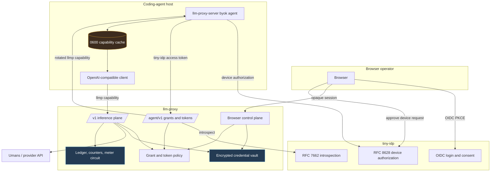
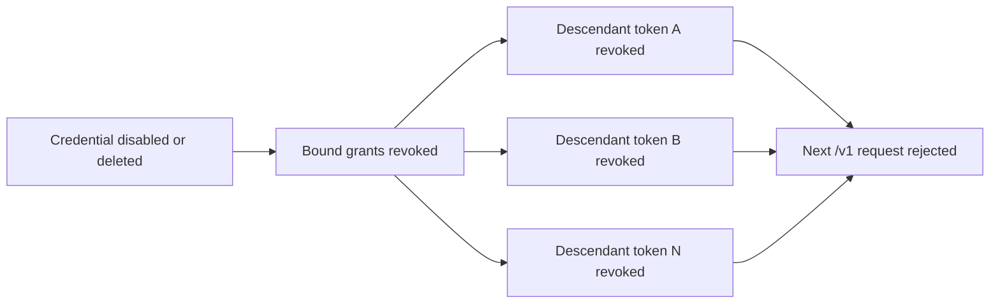
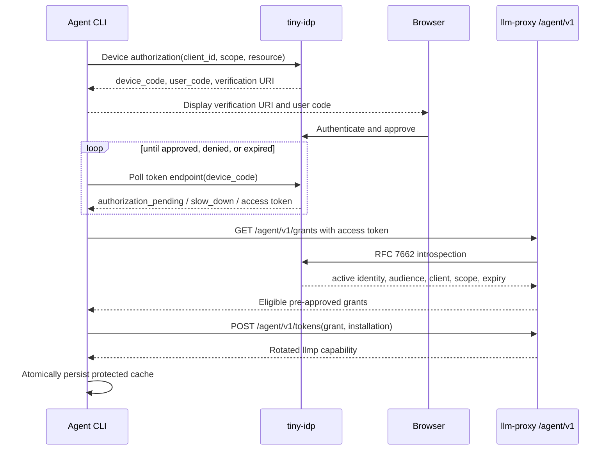

# LLM Proxy BYOK: Tiny-IDP Coding-Agent Authority Chain

The first llm-proxy BYOK implementation established a credential vault, scoped
broker tokens, and post-inference usage accounting. It proved that provider keys
could remain server-side while applications received short-lived `llmp_...`
capabilities. The next project made that system usable by browser operators and
coding agents without treating an identity-provider access token as an inference
credential.

The completed system now has a full authority chain. A user authenticates with
tiny-idp, creates a server-side grant that binds credentials, models, limits,
and expiry, approves a device login, and lets the coding agent exchange its
identity token for a rotated broker capability. The provider credential never
crosses the broker boundary. The identity token never reaches the inference
plane. Rotation cannot reset the grant's cumulative budget.

> [!summary]
> - **The identity and inference planes are deliberately separate.** Tiny-idp access tokens are accepted only on `/agent/v1/*`; broker `llmp_...` capabilities are accepted only on `/v1/*`.
> - **Authority is pre-approved, not selected by the agent.** Browser-managed grants bind concrete credentials, model profiles, per-token restrictions, cumulative grant budgets, expiry, and revocation behavior.
> - **Accounting and security mutations are transactional.** Grant issuance, rotation, revocation cascades, ledger writes, counters, and typed audit events commit atomically where their invariants require it.
> - **The production claim is narrow and measured.** The validated provider path is non-streaming `/v1/chat/completions` with `umans-glm-5.2`; general coding-agent, `/v1/responses`, and Anthropic-native compatibility remain unclaimed.

This report explains the architecture as a coherent security system. It covers
the trust boundaries, protocols, data model, request paths, failure semantics,
deployment shape, live validation, and the observability design that followed
the implementation.

## 1. Starting point: the July BYOK broker

The earlier project, [[PROJ - LLM-Proxy BYOK - Credential Vault, Token Minting, and Metered Proxy Enforcement]], introduced the core broker model:

- provider credentials encrypted with AES-256-GCM;
- hashed `llmp_...` capabilities with model and credential bindings;
- token-level request, token, rate, and expiry limits;
- per-request credential injection into resolved Geppetto profiles;
- an append-only usage ledger and denormalized token counters;
- a browser control plane and OpenAI-compatible data plane.

That work solved provider-key custody, but it left four production gaps.

First, Keycloak remained in the local deployment even though tiny-idp had become
the preferred identity service. Second, browser sessions were signed payloads
rather than opaque identifiers backed by revocable server state. Third, coding
agents had no standards-based interactive login and no way to obtain a capability
without an operator copying one manually. Fourth, metering failure was logged
but did not reliably block subsequent provider spend.

The authority-chain project addressed these gaps without changing the central
broker rule: llm-proxy, not the identity provider, owns provider credentials,
model policy, budgets, accounting, and inference capabilities.

## 2. The complete system

Two repositories participate in the implementation.

| Repository | Disk location | Responsibility |
| --- | --- | --- |
| `go-go-golems/llm-proxy` | `/home/manuel/code/wesen/go-go-golems/llm-proxy` | Credential vault, grants, broker capabilities, accounting, browser RP, agent API, device client, provider dispatch |
| `go-go-golems/tiny-idp` | `/home/manuel/workspaces/2026-07-07/prod-tiny-idp/tiny-idp` | OIDC login, consent, RFC 8628 device authorization, RFC 7662 introspection, OAuth client policy |

The main llm-proxy implementation landed in [PR #6](https://github.com/go-go-golems/llm-proxy/pull/6), merged as `a1d74d8739c56b55e897885b5238794f159d71f3`. It added 12,069 lines across 87 files. The corresponding tiny-idp resource-client support landed in [tiny-idp PR #15](https://github.com/go-go-golems/tiny-idp/pull/15), merged as `486a3e3108f3eeda3d100f3db613aecc74f4d13d` and released as `v0.0.5`.

A later documentation project designed bounded operational metrics and durable
usage summaries. That work landed in [llm-proxy PR #8](https://github.com/go-go-golems/llm-proxy/pull/8), merged as `a12fb05023c3407775d1284a405623347e685178`.

### 2.1 Component topology



The diagram contains three distinct protocol paths:

1. **Browser authentication:** OIDC Authorization Code with PKCE creates a local
   llm-proxy session.
2. **Agent acquisition:** RFC 8628 authenticates the human to tiny-idp, RFC 7662
   authenticates the resulting access token to llm-proxy, and `/agent/v1/tokens`
   exchanges that identity for a broker capability.
3. **Inference:** the coding agent presents only the broker capability to
   `/v1/*`; llm-proxy resolves the grant-derived policy and injects the stored
   provider credential.

The protocols connect, but their tokens are not interchangeable.

## 3. Security model and invariants

The design starts from explicit authority boundaries rather than endpoint
convenience.

### 3.1 tiny-idp owns identity

tiny-idp authenticates users, records OAuth consent, runs the device flow, and
issues access tokens. It answers a resource server's introspection request with
identity and authorization claims. It does not know which provider credential a
user stored, which models are approved, how many provider tokens remain, or
whether a broker capability has been revoked.

### 3.2 llm-proxy owns inference authority

llm-proxy stores encrypted provider credentials and evaluates all inference
policy. It decides:

- which credential IDs a grant may use;
- which configured profile slugs are allowed;
- how long derived capabilities live;
- how many capabilities may be active for one installation;
- per-capability request and token ceilings;
- cumulative grant request and token ceilings;
- rate limits;
- rotation and revocation cascades.

This separation prevents an OAuth client from turning a general identity token
into unrestricted provider spend.

### 3.3 Core invariants

The implementation and test suite enforce the following rules:

- Provider credentials never enter browser JavaScript, agent configuration,
  audit payloads, metrics, or logs.
- A tiny-idp access token is accepted only by `/agent/v1/*`.
- An `llmp_...` capability is accepted only by `/v1/*`.
- Identity lookup uses `(issuer, subject)`, never subject, username, or email
  alone.
- Agent clients select only among browser-preapproved grants. They cannot submit
  credential IDs or arbitrary model lists during exchange.
- Grant cumulative counters include every descendant capability and do not reset
  after rotation or reissue.
- A capability is stored only as a SHA-256 hash. Plaintext appears once in the
  issue response and then in the secure agent cache.
- Security mutations and their typed audit events commit together.
- Durable metering failure blocks new provider dispatch and readiness.
- The deployment remains single-active-broker because SQLite transactions and
  rate-limit coordination are process-local.

## 4. Two token classes and two resource planes

The most important protocol decision is the refusal to reuse the identity token
as an inference token.

| Property | tiny-idp access token | llm-proxy capability |
| --- | --- | --- |
| Issuer | tiny-idp | llm-proxy token service |
| Prefix/format | OAuth bearer, opaque to broker | `llmp_...` opaque bearer |
| Accepted path | `/agent/v1/*` only | `/v1/*` only |
| Purpose | Prove identity, client, audience, scope, expiry | Authorize concrete credentials, models, budgets, rate, expiry |
| Validation | RFC 7662 introspection | Local hash lookup and policy checks |
| Revocation authority | tiny-idp | llm-proxy |
| Stored by coding agent | Temporary during login/exchange | Yes, in a protected local cache |
| Provider access | None | Indirect, through broker policy |

The route separation has security value beyond tidy API design. If a tiny-idp
token were accepted on `/v1/*`, every client authorized for identity could
implicitly become an inference client. If an `llmp_...` token were accepted on
`/agent/v1/*`, an inference capability could enumerate grants or mint descendants.
The integration suite pins all four directions:

```text
tiny-idp token -> /agent/v1/*  = 200
tiny-idp token -> /v1/*        = 401
llmp capability -> /v1/*       = 200
llmp capability -> /agent/v1/* = 401
```

## 5. Browser authentication became server-stateful

The browser control plane uses tiny-idp as a standards-based OIDC provider. The
callback performs a strict sequence because each step establishes a prerequisite
for the next:

```text
1. Atomically consume the one-time local auth transaction.
2. Exchange the authorization code with its stored PKCE verifier.
3. Validate the ID-token signature, issuer, and audience.
4. Validate the nonce against the consumed transaction.
5. Upsert the local user by (issuer, subject).
6. Create an opaque, revocable server-side session.
7. Set a cookie containing only the opaque session identifier.
```

The browser receives neither the PKCE verifier nor session state. The auth
transaction stores hashes for browser-delivered correlation values, has a short
expiry, and can be consumed once. Replays fail even if the authorization code
has not yet expired.

The session cookie is an opaque random identifier whose hash identifies a row in
SQLite. The row carries creation, last-seen, absolute expiry, and revocation
state:

```go
type Session struct {
    ID         string
    IDHash     string
    UserID     string
    CreatedAt  time.Time
    LastSeenAt time.Time
    ExpiresAt  time.Time
    RevokedAt  *time.Time
}
```

This design supports immediate logout and server-side invalidation. It also
separates cookie integrity from session lifetime: possession of a previously
valid opaque cookie is insufficient after its row is revoked or expires.

Logout commits local revocation before optional provider end-session
navigation. A failed external redirect cannot leave the local session valid.

## 6. Agent grants are durable authority objects

A device flow authenticates a user and client, but it does not answer which
provider credential or model the device may use. That policy lives in an
`AgentGrant` created through the authenticated browser control plane.

```go
type AgentGrant struct {
    ID                   string
    UserID               string
    Name                 string
    CredentialIDs        []string
    AllowedModels        []string
    PerTokenMaxTokens    *int64
    PerTokenMaxRequests  *int64
    RateLimitRPM         *int64
    TokenTTL             time.Duration
    MaxActivePerInstance int
    GrantMaxTokens       *int64
    GrantMaxRequests     *int64
    Enabled              bool
    RevokedAt            *time.Time
}
```

A grant has two levels of budget.

### 6.1 Per-token limits

`PerTokenMaxTokens`, `PerTokenMaxRequests`, and `RateLimitRPM` are copied to each
issued capability. They constrain one active token. Rotation can legitimately
produce a new token with fresh per-token counters because the old token is
revoked and the grant's concurrent-token policy remains intact.

### 6.2 Cumulative grant limits

`GrantMaxTokens` and `GrantMaxRequests` are evaluated against
`AgentGrantCounters`. Every completed request from every descendant token
increments these counters. Rotation and reissue do not reset them.

```go
type AgentGrantCounters struct {
    GrantID       string
    TotalTokens   int64
    TotalRequests int64
}
```

This distinction prevents a client from bypassing an overall authorization
ceiling by repeatedly logging in or rotating capabilities.

### 6.3 The grant is the policy source

The exchange request contains only a grant ID and a stable client installation
identifier:

```json
{
  "grant_id": "<opaque grant id>",
  "client_instance_id": "<stable random installation id>"
}
```

It does not contain credential IDs, model names, limits, or expiry. The store
loads the selected grant, validates ownership and eligibility, derives the token
policy, rotates prior descendants as required, and commits a typed issuance
audit event in the same transaction.

### 6.4 Rotation and revocation

`MaxActivePerInstance` bounds active descendants for a specific OAuth client and
installation. The source client ID comes from the validated introspection
response; the installation ID is generated once by the client and persisted.
Together they define the rotation set without relying on a user-selected label.

Revocation has directed consequences:



A grant can also be disabled or revoked directly. Descendant capability checks
then fail even if a stale token row has not yet been inspected by the client.
The browser UI shows provenance and cumulative usage without displaying hidden
credential material.

## 7. Device authorization and capability exchange

Coding agents generally cannot receive a browser redirect on a stable HTTPS
callback. RFC 8628 addresses this by separating the device from the browser
approval session.

### 7.1 Client sequence

The `pkg/byok/deviceclient` package implements the full sequence:



The device authorization request includes RFC 8707 `resource`, targeting the
agent API audience. The requested scope is `openid llm.tokens.issue`. tiny-idp
therefore issues an access token intended for one resource rather than a generic
bearer accepted by any service.

### 7.2 Polling semantics

The client handles the RFC 8628 responses explicitly:

- `authorization_pending` continues at the current interval;
- `slow_down` increases the interval by five seconds;
- `access_denied` terminates immediately;
- `expired_token` terminates immediately;
- local context cancellation interrupts the timer;
- the client stops at the server-provided expiry even if responses remain
  pending.

The implementation never logs the device code, access token, or final broker
capability.

### 7.3 Grant selection is explicit

If one grant is eligible, the client may select it. If none are eligible, login
fails. If several are eligible, the client fails unless the user supplies
`--grant-id`.

```go
func chooseGrant(grants []Grant, requested string) (Grant, error) {
    if requested != "" {
        for _, grant := range grants {
            if grant.ID == requested {
                return grant, nil
            }
        }
        return Grant{}, errors.New("requested agent grant is unavailable")
    }
    if len(grants) == 1 {
        return grants[0], nil
    }
    if len(grants) == 0 {
        return Grant{}, errors.New("no eligible agent grants")
    }
    return Grant{}, errors.New("multiple agent grants are eligible; select one explicitly")
}
```

This behavior prevents nondeterministic privilege selection as browser grants
change over time.

## 8. RFC 7662 introspection is treated as resource authentication

llm-proxy does not decode tiny-idp access tokens locally. It discovers the
introspection endpoint and authenticates as a confidential resource client using
`client_secret_basic`.

An active response is necessary but insufficient. The authenticator validates:

- exact issuer;
- non-empty subject;
- source OAuth client in the configured allowlist;
- exact agent audience among the returned audiences;
- unexpired `exp`;
- bearer token type;
- required scope;
- discovery endpoint on the issuer's exact origin and under its path.

The core check is intentionally conjunctive:

```go
if body.Issuer != a.issuerURL ||
   body.Subject == "" ||
   !clientAllowed ||
   !ok ||
   !slices.Contains(audiences, a.audience) ||
   !strings.EqualFold(body.TokenType, "Bearer") ||
   body.Expires <= 0 ||
   !expires.After(now) {
    return Principal{}, invalidToken()
}
```

The resource client secret is encoded according to RFC 6749 section 2.3.1 before
Basic authentication. Both client ID and secret are form-escaped before the
Base64 step. This detail matters for generated secrets containing reserved
characters.

### 8.1 Cache design

Positive and negative introspection caches reduce load on tiny-idp. Raw tokens
are not retained as cache keys. A process-random HMAC key derives a fixed cache
identifier:

```go
func (a *Authenticator) tokenCacheKey(token string) string {
    mac := hmac.New(sha256.New, a.cacheKey[:])
    _, _ = mac.Write([]byte(token))
    return hex.EncodeToString(mac.Sum(nil))
}
```

The cache is bounded at 1,024 entries. Positive entries expire no later than the
token itself. Negative entries have a short configured TTL. Required scopes are
checked after cache retrieval, so one cached identity result cannot satisfy an
endpoint requiring a scope it lacks.

### 8.2 Destination validation precedes credentials

Issuer, discovery endpoints, introspection endpoints, broker URLs, and agent
audiences must use HTTPS, except explicit loopback HTTP where local development
requires it. URLs with userinfo, query strings, fragments, malformed authority,
or mismatched origins are rejected before an authenticated request is sent.

This order prevents confidential client credentials and bearer tokens from being
sent to a destination supplied through malicious discovery metadata or operator
misconfiguration.

## 9. Secure local agent persistence

After exchange, the coding agent must persist an `llmp_...` capability. A normal
JSON file with `chmod` after creation is insufficient because symlinks, races,
permissive parent directories, and concurrent writers can redirect or expose the
secret.

The POSIX cache implementation enforces:

- parent directory is a non-symlink directory with mode `0700`;
- cache and lock are regular files with mode `0600`;
- lock and cache opens use descriptor-level `O_NOFOLLOW`;
- all read/write/delete operations acquire an advisory exclusive lock;
- reads are bounded;
- writes use a mode-`0600` temporary file, `fsync`, atomic rename, and directory
  `fsync`;
- operator-selected paths with unsafe existing permissions fail rather than
  being silently modified.

Representative code:

```go
fd, err := unix.Open(
    lockPath,
    unix.O_CREAT|unix.O_RDWR|unix.O_CLOEXEC|unix.O_NOFOLLOW,
    0o600,
)
if err != nil {
    return errors.Wrap(err, "open agent cache lock")
}
if err := unix.Flock(fd, unix.LOCK_EX); err != nil {
    return errors.Wrap(err, "lock agent credential cache")
}
```

Windows persistence fails closed with a documented unsupported-platform error.
There is no weak cross-platform fallback. A native implementation would need
Windows ACL, reparse-point, replacement, and locking semantics plus tests on an
actual Windows host.

## 10. Schema migration and transactional invariants

The project replaced ad hoc schema creation with forward-only migrations based
on `PRAGMA user_version`. Startup validates required tables, columns, indexes,
and foreign keys. Unknown newer versions, missing constraints, or shape drift
stop startup rather than running against an ambiguous database.

The grant phase added:

- `agent_grants`;
- grant-to-credential bindings;
- grant model policy;
- `agent_grant_counters`;
- token provenance fields: grant, issue channel, source client, installation;
- indexes supporting active descendant lookup and policy enforcement.

### 10.1 Atomic capability issuance

`IssueAgentTokenAudited` is one transaction that:

1. loads and validates the grant under the requesting user;
2. checks enabled, revocation, expiry, credentials, and cumulative budget;
3. validates token provenance;
4. identifies active descendants for source client and installation;
5. revokes enough prior descendants to satisfy the active limit;
6. inserts the derived token with grant policy;
7. appends issuance and rotation audit events;
8. commits all changes together.

A failure leaves no issued token without audit, no rotation without replacement,
and no half-updated authority graph.

### 10.2 Atomic usage accounting

A completed provider request inserts one ledger row and updates both token and
grant counters in the same transaction:

```text
BEGIN IMMEDIATE
  INSERT usage_ledger(...)
  UPDATE token_counters
  IF token.agent_grant_id != "":
      UPDATE agent_grant_counters
COMMIT
```

Rejected rows do not increment usage counters. Provider errors do count as
requests because an upstream attempt occurred. Token totals use prompt plus
completion tokens; cached tokens remain separately recorded under the existing
budget semantics.

The cumulative grant check is repeated before provider dispatch. Therefore a
rotated capability cannot use a grant whose aggregate budget has already been
consumed.

## 11. Metering fails closed

Provider usage is known only after inference completes. Durable accounting can
therefore fail after provider spend has occurred. Continuing to dispatch after
such a failure would make every budget unreliable.

The metering health component coordinates the recorder, middleware, readiness,
a committed write probe, and typed audit transitions. It has three states:

```mermaid
stateDiagram-v2
    [*] --> Closed
    Closed --> Open: persistent write failure
    Closed --> Open: transient threshold reached
    Open --> HalfOpen: cooldown elapsed; one caller probes
    HalfOpen --> Closed: committed write probe succeeds
    HalfOpen --> Open: probe fails
    Closed --> Closed: successful accounting write
```



Persistent failures open the circuit immediately. SQLite busy/locked and context
failures are transient and open after a bounded threshold. While open, new
inference is rejected before provider dispatch and `/readyz` fails. After the
cooldown, exactly one caller enters half-open and performs a committed write
probe. No inference passes until the probe succeeds.

A late success from a request already in flight cannot close an open circuit.
Recovery requires the explicit probe. This prevents timing-dependent recovery
when concurrent requests report results out of order.

```go
if h.state != CircuitHalfOpen {
    h.mu.Unlock()
    return ErrUnavailable
}
h.state = CircuitClosed
h.consecutiveTransient = 0
h.retryAt = time.Time{}
h.recoveredTotal++
```

Circuit-open and circuit-closed transitions produce typed audit events without
including errors, database paths, user identifiers, or secrets.

## 12. Token ceilings are post-accounting stops

The implementation deliberately distinguishes a budget ceiling from a token
reservation system. The provider's final token count is unavailable before the
request completes. A successful request may therefore cross a low ceiling; the
next request is rejected before provider dispatch.

The live Umans limit matrix demonstrated the exact behavior:

- With `max_total_tokens=1`, the first request completed with 37 tokens. The next
  request returned `429 budget_exhausted` in 3 ms.
- With `rate_limit_rpm=1`, the first request completed with 35 tokens. The next
  returned `429 rate_limit_exceeded` in 3 ms.
- Capability A used one request and 39 tokens. Rotation revoked A; capability B
  then used 45 tokens. The grant aggregate became two requests and 84 tokens.
- In the cumulative request test, A was issued and rotated before use. B used the
  grant's single allowed request. Further issuance failed with
  `requested agent grant is unavailable`.

This is not strict no-overshoot accounting. Strict semantics would require a
prospective reservation based on requested maximum output plus a settlement
transaction after the response. That design is a separate policy choice and was
not required for the completed authority chain.

## 13. Deployment: immutable services and explicit secrets

The deployment replaced Keycloak with tiny-idp and Caddy. Long-running services
run as non-root users, persistent state uses named volumes, and browser/back-
channel endpoints use a shared local CA.

Key deployment properties:

- tiny-idp `v0.0.5` is pinned by immutable multi-platform manifest digest
  `sha256:d5d9b78ff2eb6adb2e6d984ee9e913bf9570eea38380f153ca87a8a639e9a629`;
- the shared `tinyidp-local-caddy-pki` volume persists the workstation CA;
- the CA is mounted read-only where possible;
- bootstrap waits for readiness before creating or reconciling clients;
- persisted OAuth clients are checked for field conflicts instead of silently
  overwritten;
- secret values arrive through mounted files rather than command-line arguments;
- llm-proxy supports file flags for the vault master key, session secret, browser
  client secret, and resource-client secret;
- specifying both inline and file versions fails as mutually exclusive.

The OAuth client inventory is explicit:

| Client | Type | Grants | Purpose |
| --- | --- | --- | --- |
| `llm-proxy-web` | public browser client | authorization code + PKCE | Browser login and logout |
| `llm-proxy-agent` | public device client | RFC 8628 device code | Human-approved coding-agent identity |
| `llm-proxy-resource` | confidential resource client | no token grant types | RFC 7662 introspection only |

The resource client has an exact audience and no authorization grants. It can
validate tokens for its resource but cannot mint tokens for itself.

### 13.1 Docker secret-file constraint

Docker Compose file-backed secrets may appear mode `0644` inside a container
because Compose does not remap ownership. For the local deployment, the source
files live in an owner-only `0700` directory and are mounted into isolated
containers. Production orchestrators should provide correct ownership and modes
directly. The design documents this exception rather than weakening generic
host-side secret-file validation.

## 14. tiny-idp changes required by the broker

The llm-proxy integration exposed a narrow set of tiny-idp gaps. PR #15 added
secure resource-client support without coupling tiny-idp to llm-proxy code.

### 14.1 Introspection-only clients

The admin client command can now create a confidential client with an audience
and zero token grant types. Validation allows this resource-server shape while
continuing to reject unsupported grants.

### 14.2 Secure secret-file reads

Client secrets can be loaded from files using descriptor-level `O_NOFOLLOW`,
regular-file and size checks, and bounded reads. This closes the check-then-open
TOCTOU window that would remain if `Lstat` and `os.ReadFile` were separate.

### 14.3 Protocol corrections found in review

Review identified and fixed three additional cases:

- bcrypt inputs must respect the 72-byte secret ceiling;
- invalid RFC 8707 resources must return `invalid_target`;
- mixed `resource` and `audience` parameters must be rejected even when one is
  present as an empty value.

These changes matter because an empty form value is still an explicit protocol
parameter. Checking only its decoded non-empty value loses the distinction
between absence and malformed/mixed input.

## 15. Compatibility claims are evidence-based

The project does not infer broad compatibility from OpenAI-shaped endpoints.
The completed live claim is:

> `umans-glm-5.2` works through non-streaming `/v1/chat/completions` using an
> OpenAI-compatible provider profile at `https://api.code.umans.ai/v1`.

The smoke test imported an existing provider credential through the encrypted
browser vault without printing it. The request returned HTTP 200 and the text
`live smoke ok`, with 19 prompt and 24 completion tokens. Revocation returned
204; the next capability request returned 401; credential deletion returned
204. Runtime log and artifact scans found no provider credential, private key,
or broker capability.

The extended limit matrix made six successful provider calls totaling 111
prompt and 146 completion tokens. Four rejected requests created typed
`inference.rejected` events: three `budget_exhausted`, one
`rate_limit_exceeded`. Rejections completed in 3–8 ms and produced no successful
provider usage rows.

The project does **not** claim:

- `/v1/responses` compatibility;
- Anthropic-native `/v1/messages` compatibility;
- general Codex compatibility;
- general coding-agent compatibility;
- streaming behavior for the validated Umans path;
- multi-broker enforcement correctness.

A concrete coding-agent client still needs to be selected and tested. General
Codex compatibility may require `/v1/responses`, which llm-proxy does not expose.

## 16. Acceptance testing as a trust argument

The clean-volume immutable-image acceptance test exercised the authority chain
through real network and browser boundaries:

1. Start tiny-idp, Caddy, bootstrap, and llm-proxy from empty state.
2. Verify CA-authenticated readiness for tiny-idp and llm-proxy.
3. Complete browser OIDC Authorization Code with PKCE.
4. Create an encrypted provider credential.
5. Create a grant binding that credential and an allowed model.
6. Start RFC 8628 device authorization from the CLI.
7. Approve the device request in the browser.
8. Introspect the access token as the confidential resource client.
9. List eligible pre-approved grants.
10. Exchange for a rotated `llmp_...` capability.
11. Verify the mode-`0600` cache inside a mode-`0700` directory.
12. Exercise both valid token routes and both invalid cross-plane routes.
13. Revoke the grant and verify the descendant capability fails.
14. Log out the CLI and verify its cache is deleted.
15. Scan rendered configuration and runtime logs for secrets.

The implementation also passed:

```text
GOWORK=off go test ./...
focused BYOK race tests
go vet ./...
go build ./...
make lint
make glazed-lint
make logcopter-check
make gosec
make govulncheck
Windows deviceclient cross-compilation
node --check pkg/byok/web/static/app.js
shellcheck deploy/tinyidp/*.sh
git diff --check
docmgr doctor
```

Cross-compiling a Windows test binary proves compilation, not execution. The
recorded `exec format error` when attempting to run it on Linux is expected and
is one reason Windows cache support remains intentionally unavailable.

## 17. What failed and what those failures established

The implementation diary records failures as design evidence rather than noise.
Several failures changed the final system.

### 17.1 Persisted OAuth client conflicts

Bootstrap first failed with:

```text
Error: bootstrap production browser clients: client "llm-proxy-web" conflicts in fields: post_logout_redirect_uris
```

The persisted tiny-idp database contained a client with a shape that no longer
matched bootstrap input. The fix was not unconditional overwrite. Bootstrap now
recognizes exact existing configurations and fails on meaningful conflicts. This
preserves operator intent and makes configuration drift visible.

### 17.2 Compose secret ownership

Bootstrap initially failed reading a mounted secret:

```text
/config/bootstrap.sh: 17: cannot open /run/secrets/tinyidp_bootstrap_password: Permission denied
```

The non-root container user could not read the source-owned file. The resolution
used an owner-only parent directory with the Compose-specific file-mode
constraint documented explicitly. It did not weaken general application secret
handling.

### 17.3 Resource-client grant validation

An introspection-only client initially failed with:

```text
Error: client declares an unsupported grant type
```

The tiny-idp domain model assumed every OAuth client must receive tokens. PR #15
added an explicit resource-client shape with zero grant types rather than adding
a fake grant.

### 17.4 Configuration naming and key decoding

Two command-line failures exposed integration assumptions:

```text
unknown flag: --byok-agent-resource-client-id
master key must be 32 bytes, got 48
decode master key: illegal base64 data at input byte 1
```

The first required using the implemented OIDC resource-client flag names. The
second and third separated raw-byte length from textual Base64 representation.
Secret-file options and exact validation now make the accepted format explicit.

### 17.5 Grant exhaustion during reissue

The cumulative request test ended with:

```text
requested agent grant is unavailable
```

This was the intended proof: after the grant-level request ceiling was consumed,
listing and issuance no longer offered the grant, even though a new capability
would otherwise have fresh per-token counters.

## 18. Operational observability is the next technical layer

The authority chain is complete, but operators still need aggregate health and
owners need cross-token usage summaries. PR #8 produced an implementation guide
without changing production behavior.

The design separates two data products:

1. **Durable owner summaries** query SQLite under the authenticated browser
   user's identity. They may include exact profile and issue-channel detail.
2. **Operational metrics** are process-local Prometheus/OpenMetrics series. They
   must use small fixed vocabularies and never carry user, token, grant,
   credential, subject, email, client-installation, or raw-error labels.

### 18.1 Incremental implementation plan

```text
Phase 0  Define summary types and metric vocabulary guardrails.
Phase 1  Add indexed owner usage-summary queries and authenticated API.
Phase 2  Add a table-based 24h/7d/30d browser summary.
Phase 3  Add a disabled-by-default loopback metering-health endpoint.
Phase 4  Add bounded completion, rejection, token, and duration metrics.
Phase 5  Add bounded introspection and device-exchange metrics.
Phase 6  Add dashboards, inventory, retention, or rollups only after measurement.
```

The first useful increment does not require Prometheus. It adds a
`(user_id, created_at)` ledger index and a fixed `GET /api/usage-summary`
contract. This gives users durable totals across rotated capabilities before the
project introduces a metrics dependency or new listener.

### 18.2 Review corrected the metric design

The first Phase 4 draft combined route, outcome, reason, streaming, issue
channel, and up to 65 profiles on one counter. Every dimension was finite, but
the product was not operationally small:

```text
2 routes × 3 outcomes × 9 reasons × 2 stream values × 4 channels × 65 profiles
= 28,080 series per process
```

The merged design splits semantic families and removes profile and channel from
MVP metrics:

```text
completed: 2 routes × 2 outcomes × 2 stream values                     = 8
rejected:  2 routes × at most 12 reasons                              = 24
tokens:    3 kinds × 2 outcomes                                        = 6
duration:  8 label sets × (9 buckets + +Inf + sum + count)             = 96
maximum custom metric series                                           = 134
```

A gather test will enforce the ceiling. Exact profile and channel detail remains
in authenticated durable summaries.

Review also found that `meter.Recorder` lacks route and duration. Completion
metrics must therefore be emitted at the four runtime
`RunInferenceWithResult` call sites. Rejection metrics need an exact classifier
for POST `/v1/chat/completions` and POST `/v1/completions`; the existing auth
middleware protects all `/v1/*`, including `/v1/models`, and its audit helper
does not run for missing or invalid API keys. Audit and metrics remain separate
observation paths.

## 19. Design decisions that should remain stable

### 19.1 Keep tiny-idp separate

llm-proxy consumes standards endpoints and does not import tiny-idp as a Go
library. The services retain independent release, storage, and security
boundaries. The cost is explicit discovery, client provisioning, TLS, and
introspection configuration. Those costs are visible and testable.

### 19.2 Keep identity and capability exchange separate

An identity token proves who and which OAuth client authenticated. A broker
capability encodes what inference authority is available. Combining them would
put provider policy into the IdP or make every identity token an inference
credential.

### 19.3 Keep grants pre-approved

The agent may select a grant ID from eligible grants, but cannot author policy.
This gives the browser operator a durable consent and review object and makes
credential/model bindings inspectable before device login.

### 19.4 Keep cumulative budgets on the grant

Per-token limits handle one capability lifecycle. Grant counters express the
operator's total authorization across rotation and reissue. Both are necessary;
one cannot substitute for the other.

### 19.5 Keep metering fail-closed

If the broker cannot durably account for provider use, it cannot enforce future
budgets. Readiness and dispatch must reflect that fact. Logging and continuing
would preserve availability by discarding the authorization contract.

### 19.6 Keep deployment single-active until coordination changes

SQLite transactions, in-memory rate windows, issuance mutexes, and local circuit
state do not provide cross-process serialization. A load balancer over multiple
active brokers would permit races in enforcement even if all processes shared a
filesystem database. Horizontal operation requires shared transactional storage
and shared coordination, not a documentation change.

## 20. Source map for future work

### llm-proxy

- Browser OIDC and sessions:
  - `pkg/byok/web/oidc.go`
  - `pkg/byok/web/session.go`
  - `pkg/byok/web/oidc_flow_test.go`
- Grant domain and persistence:
  - `pkg/byok/store/models.go`
  - `pkg/byok/store/grants.go`
  - `pkg/byok/store/sqlite/schema.go`
  - `pkg/byok/store/sqlite/store.go`
- Agent resource authentication:
  - `pkg/byok/oidcauth/oidcauth.go`
- Agent API:
  - `pkg/byok/agentapi/server.go`
- Device flow and persistence:
  - `pkg/byok/deviceclient/client.go`
  - `pkg/byok/deviceclient/cache.go`
  - `pkg/byok/deviceclient/cache_unix.go`
  - `cmd/llm-proxy-server/cmds/byok/agent.go`
- Enforcement and accounting:
  - `pkg/byok/authmw/middleware.go`
  - `pkg/byok/policy/policy.go`
  - `pkg/byok/meter/meter.go`
  - `pkg/byok/meter/health.go`
- Deployment:
  - `deploy/docker-compose.yaml`
  - `deploy/tinyidp/bootstrap.sh`
  - `deploy/tinyidp/Caddyfile`

### tiny-idp

- Client administration and resource-client creation:
  - `internal/cmds/admin_client.go`
  - `internal/admin/clients.go`
- Secret-file handling:
  - `internal/cmds/client_secret_file_unix.go`
- Device-resource behavior:
  - `internal/fositeadapter/provider.go`
  - `internal/fositeadapter/device_authorization_test.go`
- Domain validation:
  - `pkg/idpstore/validate.go`

### Ticket documentation

- Authority-chain architecture and intern guide:
  - `/home/manuel/code/wesen/go-go-golems/llm-proxy/ttmp/2026/07/22/LLM-PROXY-BYOK-TINYIDP--replace-keycloak-with-tiny-idp-as-the-byok-control-plane-oidc-issuer/design-doc/01-tinyidp-byok-coding-agent-architecture-and-intern-implementation-guide.md`
- Implementation diary:
  - `.../reference/01-implementation-diary.md`
- Phase 3–5 completion audit:
  - `.../reference/02-phase-3-5-completion-audit.md`
- Observability implementation guide:
  - `/home/manuel/code/wesen/go-go-golems/llm-proxy/ttmp/2026/07/23/LLM-PROXY-BYOK-OBSERVABILITY--phased-operational-metrics-and-usage-summaries-for-byok/design-doc/01-byok-operational-metrics-and-usage-summaries-intern-implementation-guide.md`

## 21. Current status and next work

The tiny-idp authority-chain ticket is complete and closed. PRs #6, #7, and #8
are merged. The real-provider path, route separation, revocation cascades,
device cache, cumulative budgets, and metering failure behavior have concrete
evidence.

The recommended implementation sequence is now:

1. Implement observability Phase 0 and Phase 1: summary types, cardinality
   guardrails, owner/time ledger index, memory/SQLite aggregate parity, and
   authenticated `GET /api/usage-summary`.
2. Add the simple browser summary table after the API is stable.
3. Add the loopback-only metering-health metrics endpoint.
4. Add the reviewed 134-series completion/rejection metrics contract.
5. Select one concrete OpenAI Chat Completions-compatible coding-agent client
   and validate login, model selection, rotation, revocation, and limits.
6. Consider prospective token reservation only if strict no-overshoot semantics
   become a requirement.
7. Replace process-local coordination before any multi-active deployment.

## 22. Working rules

> [!important]
> - Identity proves who authenticated; a grant defines what may be issued; a broker capability authorizes inference.
> - Provider credentials remain server-side and are never copied into browser or agent state.
> - tiny-idp access tokens and `llmp_...` capabilities remain route-separated.
> - Grant-level budgets survive rotation and reissue.
> - Durable accounting failure blocks provider dispatch.
> - Compatibility claims remain limited to paths exercised against a real provider.
> - Operational metrics use bounded, reviewed label products; identity detail remains in authenticated durable APIs.

## Related notes

- [[PROJ - LLM-Proxy BYOK - Credential Vault, Token Minting, and Metered Proxy Enforcement]]
- [[PROJECT REPORT - tiny-idp - Strict Fosite Provider and Hosted OIDF Conformance]]
- [[PROJECT REPORT - tiny-idp - Public Embedding Foundations]]
- [[PROJECT REPORT - tiny-idp - Multi-Account Browser Sessions and Logout Scopes]]
- [[PROJECT REPORT - tiny-idp - Professional Signup and Application Membership Invitations]]
- [[ARTICLE - LLM Proxy - Chat Completions Tools and Pinocchio Smoke Technical Report]]
