# PULP OS Device Authorization: Native OAuth, Protected Streaming, and E-Ink Rendering

PULP OS now supports OAuth 2.0 Device Authorization on an M5Stack PaperS3, bearer-protected REST requests, an authenticated WebSocket sensor stream, QR-assisted browser approval, and a bounded live chart designed for a 540×960 e-ink display. The implementation combines an embedded tiny-idp Go service with native ESP32-S3 protocol state and a MicroQuickJS application that never receives the bearer token.

This report explains the completed ESP-54 system as an implementation, not as a proposal. It follows the authorization request from the PaperS3 to the identity provider, through browser approval and token issuance, into protected APIs and WebSocket delivery, and finally through the bounded sample ring and retained canvas renderer. It also examines the failures that changed the design: non-loopback HTTP issuer rejection, TLS allocation failure under realistic memory pressure, an uninitialized lwIP mailbox assertion, fragmented WebSocket messages, stale malformed samples, and the difference between transport stability and a complete panel-level soak test.

> [!summary]
> - The bearer token is owned by native firmware, stored only in RAM, redacted from diagnostics, and unavailable to JavaScript.
> - The Go process embeds tiny-idp through supported public packages and protects REST and WebSocket routes through RFC 7662 introspection.
> - Network ingress runs at 2 Hz while SENSOR LINK redraws at 0.5 Hz; message storage, chart history, QR rendering, and parser behavior are all explicitly bounded.
> - Hardware acceptance covered approval, denial, expiry, sleep, server loss, Wi-Fi loss, reconnect, malformed inputs, ring wrap, and a final 30-minute SENSOR LINK soak.

## 1. The problem the project solves

A constrained device frequently cannot complete an ordinary browser-based authorization-code flow. The PaperS3 has Wi-Fi, touch input, and an e-ink display, but it does not provide the browser environment expected by interactive OAuth redirects. It still needs a secure way to associate a user account with the device and obtain authorization to call protected services.

RFC 8628 defines the required separation. The device requests a short-lived device grant and displays a user code. The user opens a verification page on another computer or phone, authenticates there, and approves the request. While approval is pending, the device polls the token endpoint at a server-defined interval. Approval produces an access token for the device without requiring the device to process passwords, browser cookies, or authorization redirects.

That protocol alone is not sufficient for PULP OS. The implementation also had to satisfy these constraints:

- MicroQuickJS must not gain access to the bearer token.
- Device authorization must survive application-tree resets that cancel ordinary JavaScript callbacks.
- HTTP and WebSocket authentication must reject arbitrary destinations before attaching credentials.
- WebSocket callbacks run outside the owner task and may split one logical message across multiple events.
- Network delivery at 2 Hz must not force the e-ink panel to refresh at 2 Hz.
- All response buffers, message queues, chart histories, and drawing command stores must remain bounded.
- Sleep, Wi-Fi loss, server loss, denial, and token expiry must produce explicit state transitions rather than undefined behavior.

The result is therefore an operating-system feature with a product application, not a JavaScript-only OAuth script.

## 2. System boundaries

The completed system has three execution domains: the Go host, native firmware, and the JavaScript product layer. Each domain has a deliberately limited responsibility.

```mermaid
flowchart LR
    subgraph Host[Go host process]
        IDP[tiny-idp provider]
        DB[(SQLite identity state)]
        INT[RFC 7662 authenticator]
        API[Protected REST API]
        HUB[2 Hz sensor hub]
        WSS[Protected WSS endpoint]

        IDP --> DB
        API --> INT
        WSS --> INT
        INT --> IDP
        HUB --> WSS
    end

    subgraph Native[PaperS3 native firmware]
        AUTH[Auth state machine]
        HTTP[Bounded HTTP client]
        SOCK[WebSocket client]
        RING[64-message PSRAM ring]
        OWNER[Owner task]

        AUTH --> HTTP
        AUTH --> SOCK
        SOCK --> RING
        HTTP --> OWNER
        RING --> OWNER
    end

    subgraph JS[MicroQuickJS product]
        SENSOR[SENSOR LINK]
        QR[Retained QR canvas]
        CHART[60-point chart]

        SENSOR --> QR
        SENSOR --> CHART
    end

    IDP <-->|HTTPS device flow| AUTH
    API <-->|HTTPS + native bearer| HTTP
    WSS <-->|WSS + native bearer| SOCK
    OWNER --> SENSOR

    style DB fill:#26384a,stroke:#5d85ad
    style AUTH fill:#3b3322,stroke:#a99048
    style RING fill:#2e402d,stroke:#68a063
    style SENSOR fill:#402d3e,stroke:#a36c9d
```



### 2.1 The Go host owns identity and resource authorization

The host process mounts tiny-idp at `/idp/`, stores identity and protocol state in SQLite, seeds the demo account and OAuth clients, and exposes protected API routes under `/api/v1/`. It also runs one synthetic sensor producer and broadcasts samples to authorized WebSocket connections.

The resource API does not decode an ID token or query tiny-idp tables directly. It sends the opaque access token to the embedded provider's introspection endpoint through an in-process HTTP transport. This preserves the boundary between token issuance and resource authorization even though both live in one Go process.

### 2.2 Native firmware owns protocol credentials

The native `net_auth` module owns the device code and access token. JavaScript can read the user code, verification URI, state name, expiration counters, and redacted errors. There is no token accessor. The HTTP and socket modules request an Authorization header directly from `net_auth` after validating the destination.

The auth state machine is advanced by owner-task ticks and typed native completion events. Its lifetime is independent of any one application page. This matters because PULP's `resetTree()` operation destroys widget state and cancels ordinary module callbacks whenever the user enters another application.

### 2.3 JavaScript owns presentation and chart policy

SENSOR LINK presents authorization state, displays the QR code, starts protected REST and WSS operations through native builders, validates bounded JSON samples, retains the newest 60 values, and redraws once every two seconds. It receives no OAuth credential and performs no network I/O directly.

This split makes the security boundary explicit: JavaScript decides what to show, while native code decides where a credential may be sent.

## 3. The authorization sequence

A successful authorization proceeds through four protocol stages.

```mermaid
sequenceDiagram
    participant P as PaperS3 net_auth
    participant I as tiny-idp
    participant B as Browser
    participant A as Protected API
    participant W as Sensor WebSocket

    P->>I: POST /idp/device_authorization
    Note over P,I: client_id, scope, resource
    I-->>P: device_code, user_code, verification_uri_complete
    P-->>P: Render user code and QR
    B->>I: GET verification URI
    B->>I: Login, CSRF token, approve
    loop At server interval
        P->>I: POST /idp/token
        I-->>P: authorization_pending or slow_down
    end
    I-->>P: access_token, token_type=Bearer, expires_in
    P-->>P: Clear device_code; retain token in native RAM
    P->>A: GET /api/v1/me + Authorization header
    A->>I: RFC 7662 introspection
    I-->>A: active, audience, scopes, subject, expiry
    A-->>P: Principal JSON
    P->>W: WSS upgrade + Authorization header
    W->>I: RFC 7662 introspection
    I-->>W: Active sensors.read principal
    loop Every 500 ms
        W-->>P: sensor.sample JSON
    end
```

### 3.1 Starting a device grant

The device sends `client_id`, requested scopes, and an RFC 8707 resource indicator. The resource value is significant: it binds the resulting token to the API audience rather than producing a bearer that is valid for an unspecified service.

The server returns both `verification_uri` and `verification_uri_complete`. SENSOR LINK uses the complete form for the QR code, while retaining the eight-character user code as a manual fallback. The QR carries a public, short-lived user code, not the access token.

### 3.2 Polling is native state

Polling rules are implemented in `AuthTick`, not in a chain of JavaScript timers. The owner task starts a token request only when the monotonic deadline is due and Wi-Fi is up:

```cpp
void AuthTick(int64_t now_us) {
    AssertOwner();
    if (s.state == AuthState::Authorized && s.token_deadline_us > 0 &&
        now_us >= s.token_deadline_us) {
        ResetSecrets();
        snprintf(s.error, sizeof(s.error), "token_expired");
        s.state = AuthState::Expired;
        return;
    }
    if (s.state != AuthState::WaitingForUser ||
        s.in_flight.load(std::memory_order_acquire)) {
        return;
    }
    if (s.grant_deadline_us > 0 && now_us >= s.grant_deadline_us) {
        ResetSecrets();
        snprintf(s.error, sizeof(s.error), "expired_token");
        s.state = AuthState::Expired;
        return;
    }
    if (now_us < s.next_poll_us || WifiStatus() != kWifiUp) return;
    // Build and start the token request.
}
```

The token response handler distinguishes the RFC 8628 states:

- `authorization_pending` schedules the next request at the current interval.
- `slow_down` adds five seconds to the interval, bounded by 60 seconds.
- transport failure enters a bounded retry path without discarding the grant.
- denial and protocol errors clear secret state and enter a terminal error.
- success validates `token_type=Bearer`, installs the token, sets its monotonic deadline, and clears the device code.

### 3.3 Approval uses the real browser security contract

The verification page is protected by tiny-idp's interaction and CSRF mechanism. Automated approval could not post only a user code and password. A valid test had to perform the browser sequence: GET the verification page, retain its cookie, extract `interaction` and `csrf_token`, then POST the decision.

This was an important validation detail. Bypassing CSRF in test code would have tested a path that users do not execute and weakened confidence in the integration.

## 4. Embedding tiny-idp without modifying it

The Go service imports tiny-idp only through supported public packages. The tiny-idp checkout remained clean throughout the project.

The construction sequence in `internal/app/app.go` is deliberate:

1. create the owner-only state directory;
2. open the SQLite identity store;
3. construct the account service and reconcile the demo user;
4. bootstrap the public device client and signing key;
5. load or create the introspection-client secret;
6. reconcile the confidential resource client;
7. load the token key and construct the embedded provider;
8. construct in-process introspection transport;
9. create the sensor hub and HTTP server.

Representative implementation:

```go
device := embeddedidp.DeviceClient(deviceClientID, []string{
    "openid", "profile", "demo.read", "sensors.read",
})
device.Client.AllowedAudiences = []string{cfg.audience()}

if _, err := embeddedidp.Bootstrap(ctx, store, embeddedidp.BootstrapConfig{
    Mode:         embeddedidp.DevMode,
    Clients:      []embeddedidp.ClientSpec{device},
    SigningKeyID: "pulp-demo-rs256-1",
}); err != nil {
    return nil, fmt.Errorf("bootstrap identity provider: %w", err)
}

provider, err := embeddedidp.New(ctx, embeddedidp.Options{
    Issuer:        cfg.issuer(),
    Mode:          embeddedidp.DevMode,
    Store:         store,
    Authenticator: accounts,
    Cookie: embeddedidp.CookieConfig{
        SessionName: "pulp_idp_session",
        CSRFName:    "pulp_idp_csrf",
        Path:        "/idp",
    },
    Token: embeddedidp.TokenConfig{SecretKey: tokenKey},
})
```

Construction order matters because the provider resolves client and signing state during initialization. Bootstrapping after provider construction would create a startup dependency on state that does not yet exist.

### 4.1 Why introspection is retained inside one process

Opaque access tokens cannot be validated by decoding them. The resource server must ask the authorization server whether a token is active and what it authorizes. The implementation uses `embeddedidp.NewInProcessIssuerTransport` so the introspection request traverses the provider's HTTP contract without opening another network connection.

This design provides several properties:

- the API validates active state, issuer, audience, token type, subject, expiry, and required scopes;
- the resource service does not depend on the provider's database schema;
- the same middleware structure can use an ordinary HTTP transport when identity and resource services are separated;
- provider unavailability can be distinguished from invalid credentials;
- raw tokens do not become cache keys or log fields.

Protected route composition is concise:

```go
mux.HandleFunc("GET /api/v1/me",
    a.protected(authenticator, "demo.read", meHandler))
mux.HandleFunc("GET /api/v1/demo/fortune",
    a.protected(authenticator, "demo.read", fortuneHandler))
mux.HandleFunc("GET /api/v1/sensors/snapshot",
    a.protected(authenticator, "sensors.read", snapshotHandler))
mux.HandleFunc("GET /api/v1/sensors/ws",
    a.protected(authenticator, "sensors.read", a.serveWebSocket))
```

The middleware returns 401 for missing or invalid bearer credentials, 403 for insufficient scope, and 503 when identity validation is unavailable. API responses use `Cache-Control: no-store`.

## 5. Token ownership and bearer confinement

The most important security decision is that authorization state and presentation state are not the same data structure.

JavaScript can call:

```text
auth.state()
auth.stateName()
auth.userCode()
auth.verificationUri()
auth.verificationUriComplete()
auth.grantSecondsLeft()
auth.tokenSecondsLeft()
auth.error()
```

It cannot call `auth.token()`. Probe 19 verifies that `typeof auth.token` is `undefined`.

The token is copied into a native Authorization header only when all of these conditions hold:

1. auth state is authorized;
2. the monotonic token deadline remains in the future;
3. the destination matches the configured HTTPS API prefix;
4. for WSS, the URL maps to the same configured resource origin and path;
5. the destination buffer is large enough for the complete header.

The core check is small:

```cpp
StatusCode AuthCopyAuthorization(const char *url, char *out, size_t cap) {
    AssertOwner();
    if (!AuthAuthorized() || !AuthTrustedApiUrl(url) || out == nullptr ||
        cap <= strlen(s.access_token) + 7) {
        return StatusCode::InvalidArgument;
    }
    snprintf(out, cap, "Bearer %s", s.access_token);
    return StatusCode::Ok;
}
```

The socket builder converts its `wss://` URL into the corresponding `https://` resource URL before asking for a header. The Authorization value is then copied into the WebSocket client's private header configuration and cleared from the temporary field after startup.

Probe 19 attempts bearer attachment to `https://example.com/steal` and `wss://example.com/steal`. Both operations are rejected locally. Diagnostics report only token length, never token bytes:

```text
auth state=5 ... token_left=3596 token_len=94 error="" result=Ok
```

### 5.1 RAM-only lifetime

The device code and access token are never written to NVS, SD, application settings, generated JavaScript, or ticket artifacts. `AuthClear`, denial, grant expiry, token expiry, and deep sleep overwrite secret buffers. After a natural token expiry, hardware status showed:

```text
auth state=6 ... token_left=0 token_len=0 error="token_expired"
socket state=0 ... error=""
```

The socket shuts down because `SocketTick` requires `AuthAuthorized()` while a client exists. Reconnect cannot silently outlive token validity.

## 6. WebSocket authentication and bounded delivery

The WebSocket uses an Authorization header during the HTTP upgrade. A query token was rejected because URL query strings are copied into logs, browser histories, reverse-proxy records, and diagnostic output. First-frame authentication was also unnecessary because the ESP client supports custom handshake headers.

Server-side authentication happens before `websocket.Accept`. After upgrade, the connection context receives the principal's expiry as its deadline:

```go
ctx, cancel := context.WithDeadline(r.Context(), p.ExpiresAt)
defer cancel()
readCtx := conn.CloseRead(ctx)

sub := a.hub.Subscribe()
defer sub.Close()
for {
    select {
    case <-ctx.Done():
        _ = conn.Close(websocket.StatusPolicyViolation,
            "access token expired")
        return
    case <-readCtx.Done():
        return
    case sample := <-sub.C:
        payload, _ := json.Marshal(sample)
        writeCtx, writeCancel := context.WithTimeout(ctx, 2*time.Second)
        err := conn.Write(writeCtx, websocket.MessageText, payload)
        writeCancel()
        if err != nil { return }
    }
}
```

The host's single producer emits one sample every 500 ms. Each subscriber has a capacity-one channel, so a slow connection cannot block the producer or another client. The latest sample is more useful than an unbounded backlog for this application.

### 6.1 Fragment reassembly

Espressif may emit several `WEBSOCKET_EVENT_DATA` callbacks for one logical message. The firmware therefore validates four values for every fragment:

- opcode must be text for a new message;
- advertised total payload must be at most 512 bytes;
- every fragment must retain the same total;
- each offset must equal the number of bytes already assembled.

```cpp
if (offset == 0) {
    s.assembly_active =
        (data->op_code == 1 && total <= kMessageCapacity);
    s.assembly_total = total;
    s.assembly_used = 0;
}
if (!s.assembly_active || total != s.assembly_total ||
    offset != s.assembly_used || offset + len > s.assembly_total ||
    offset + len > kMessageCapacity) {
    s.assembly_active = false;
    s.dropped.fetch_add(1, std::memory_order_relaxed);
    return;
}
```

Only a complete message reaches the ring. Binary frames, oversized frames, negative metadata, discontinuous offsets, and inconsistent totals increment a bounded drop counter and do not invoke JavaScript.

### 6.2 The PSRAM ring

The native ring contains 64 entries of at most 512 bytes each. Once full, a new message overwrites the oldest entry and advances the head. This is fixed-memory latest-data behavior:

```cpp
if (s.count == kRingCapacity) {
    target = s.head;
    s.head = (s.head + 1) % kRingCapacity;
    s.dropped.fetch_add(1, std::memory_order_relaxed);
} else {
    s.count++;
}
```

Every stored message receives a native monotonic sequence. JavaScript compares these ring sequence values with `lastSeq`, so it can ignore previously observed entries while still processing messages that arrived between display ticks.

The displayed `DROP` counter includes ring overwrites. It does not necessarily indicate packet loss. During a long-running latest-data stream, old retained history is overwritten after the application has already consumed it. Event-queue drops remained zero during acceptance. A future cursor-aware ring API could separate “overwritten after consumption” from “never observed by the consumer.”

## 7. Rendering SENSOR LINK on e-ink

The server emits samples at 2 Hz. SENSOR LINK executes its periodic state and rendering work every two seconds. These rates are intentionally independent.

The JavaScript application retains at most 60 parsed samples. On each tick it walks the bounded native ring, advances `lastSeq`, rejects malformed data, appends valid `sensor.sample` objects, and redraws once if at least one sample changed.

```javascript
var seq = socket.messageSeq(i);
if (seq <= SA.lastSeq) { continue; }
SA.lastSeq = seq;

var sample = null;
try { sample = JSON.parse(socket.message(i)); } catch (parseError) {}
if (sample && sample.v === 1 && sample.type === 'sensor.sample'
    && typeof sample.temp_c === 'number'
    && typeof sample.humidity_pct === 'number') {
  SA.samples.push(sample);
  if (SA.samples.length > 60) { SA.samples.shift(); }
  changed = 1;
}
```

Advancing the sequence before parsing is deliberate. If malformed JSON were left at the current sequence, every later tick would retry the same input and produce repeated exceptions or wasted work.

### 7.1 Bounded chart construction

The chart canvas is 460×280 pixels. It draws one border, three horizontal grid lines, and at most 59 sample segments. The canvas is wiped before every rebuild, so retained commands cannot accumulate across frames.

Temperature scaling uses the visible sample range. A minimum range of 0.5 °C prevents small numerical variation from producing a degenerate scale:

```javascript
if (hi - lo < 0.5) {
  lo = lo - 0.25;
  hi = hi + 0.25;
}
for (i = 1; i < values.length; i++) {
  var x0 = 8 + Math.floor((i - 1) * 444 / 59);
  var x1 = 8 + Math.floor(i * 444 / 59);
  var y0 = 272 - Math.floor(
      (values[i - 1].temp_c - lo) * 264 / (hi - lo));
  var y1 = 272 - Math.floor(
      (values[i].temp_c - lo) * 264 / (hi - lo));
  canvas.line(x0, y0, x1, y1, 0, 2);
}
```

This produces a fixed upper bound on retained drawing commands while allowing the horizontal history to reach 60 samples.

### 7.2 QR rendering as a retained canvas primitive

The authorization view uses `verificationUriComplete()` to render a 180-pixel QR code. The implementation added a general `Widget.qr(text, size)` Canvas method rather than drawing directly to the display outside the retained widget system.

M5GFX encodes the text. Native code scans each row and merges adjacent black modules into one fill command. This reduces command count compared with one command per module. The QR uses a fixed buffer, encoder versions 1–10, a 64–480 pixel target bound, and a quiet zone.

The original Canvas capacity of 96 commands was sufficient for the 60-point chart but not for a URL QR. Capacity was raised to 512 commands per PSRAM-backed canvas slot. On hardware, probe 23 rendered the test QR with 227 draw operations and rejected an undersized target.

The QR is wiped immediately after authorization. Leaving an expired verification URL visible would present stale state even though the user code is not a bearer credential.

## 8. Failures that changed the implementation

The implementation diary is valuable because the final architecture cannot explain why every guard exists. Several failures occurred only under realistic hardware sequencing.

### 8.1 Non-loopback HTTP issuer rejection

The initial design expected a plain HTTP LAN issuer. tiny-idp rejected it:

```text
dev http issuer must be loopback
```

The final system uses HTTPS and WSS with a short-lived development CA embedded in firmware. Port 8790 was selected because 8787 already belonged to an unrelated service. This change preserved strict issuer behavior instead of weakening tiny-idp.

The embedded CA is suitable only for the controlled demonstration. Deployment beyond this environment requires a reviewed certificate lifecycle and production-mode identity-provider controls.

### 8.2 TLS setup failed despite tens of kilobytes free

Protected REST succeeded, but WSS failed after the complete SENSOR LINK page was active:

```text
mbedtls_ssl_setup returned -0x7F00
ESP_ERR_MBEDTLS_SSL_SETUP_FAILED
internal_free=50227 internal_largest=12800
```

Total free memory was not the relevant metric. The largest contiguous internal block had fallen below the TLS allocation requirement after the WebSocket task stack, UI, and prior HTTPS activity were present.

The fix enabled:

```text
CONFIG_MBEDTLS_EXTERNAL_MEM_ALLOC=y
CONFIG_MBEDTLS_DYNAMIC_BUFFER=y
```

TLS allocations moved into the PaperS3's trusted octal PSRAM. The next hardware run connected WSS and received samples. The decision has a defined threat model: this development device does not claim resistance to hostile physical-memory access.

### 8.3 Starting auth before lazy Wi-Fi initialization crashed lwIP

Probe 20 deliberately invoked the native API outside the product helper. It printed a successful start and then rebooted:

```text
assert failed: tcpip_send_msg_wait_sem
/IDF/components/lwip/lwip/src/api/tcpip.c:449 (Invalid mbox)
```

The HTTP worker had reached lwIP before the lazily initialized Wi-Fi/TCP-IP stack existed. Product-level sequencing had hidden this native lifecycle defect.

`AuthStart` and token polling now require `WifiStatus() == kWifiUp`. Probe 20 joins saved Wi-Fi first, but the native guard remains the actual safety boundary. The corrected run created a grant, preserved an existing authorized session on rerun, and produced no assertion.

### 8.4 Reconfiguring the app destroyed a valid session

The first SENSOR LINK implementation called `auth.configure()` whenever the app was entered. Configuration clears protocol secrets, so opening the page invalidated a native token that had already been acquired.

The final page configures only when auth is unconfigured:

```javascript
if (auth.state() === 0) {
  auth.configure(AUTH_ISSUER, 'pulp-papers3', AUTH_SCOPES, AUTH_RESOURCE);
}
```

This correction demonstrates why device authorization belongs to OS state. Application construction must observe a session; it must not own the session's lifetime implicitly.

### 8.5 Malformed stale ring entries escaped `JSON.parse`

Probe 25 fills the ring with deterministic one-byte messages to validate wrap behavior. Entering SENSOR LINK immediately afterward caused:

```text
SyntaxError: unexpected character
```

The app processed stale probe entries before the asynchronous protected REST chain opened a new socket and reset the ring. The transport layer had correctly bounded and retained the text; the application layer had assumed all text was valid sensor JSON.

The final parse loop catches JSON errors, validates version/type/numeric fields, and advances sequence state before parsing. Replaying the exact probe-to-app sequence then produced zero exceptions.

This failure establishes a general rule: transport validity does not imply application validity. Both boundaries need independent checks.

## 9. Hardware probes as executable specifications

Probes 19–25 encode the acceptance behavior directly on the device.

| Probe | Scope | Evidence |
|---|---|---|
| 19 | Auth configuration and credential-exfiltration guards | Hostile HTTP/WSS origins denied; `auth.token` undefined |
| 20 | Live device flow | Wi-Fi bring-up, real pending code, authorized-session preservation |
| 21 | Native bearer REST | `/api/v1/me` returned 200 with expected subject and scopes |
| 22 | Authenticated WSS | Connected and received ordered samples |
| 23 | QR rendering | 227 operations; invalid small target rejected |
| 24 | OAuth parser fault battery | Overflow, malformed JSON, missing fields, `slow_down`, malformed token, wrong token type |
| 25 | WebSocket parser fault battery | Fragment assembly, oversize/offset/binary rejection, exact ring wrap accounting |

Probe 24 uses production response handlers and checks that token length stays zero for every synthetic failure. Probe 25 uses the production `HandleData` fragment assembler. These are not duplicate parsers written only for tests.

Representative probe 24 output:

```text
probe24: device-overflow=PASS state=error error=response_too_large token_len=0
probe24: device-malformed=PASS state=error error=invalid_json token_len=0
probe24: device-missing-fields=PASS state=error error=invalid_device_response token_len=0
probe24: device-valid=PASS state=waiting
probe24: slow-down=PASS state=waiting error=slow_down
probe24: token-malformed=PASS state=error error=invalid_json token_len=0
probe24: token-wrong-type=PASS state=error error=invalid_token_response token_len=0
probe24: result=PASS restored=idle
```

Representative probe 25 output:

```text
probe25: fragmented=PASS count=1 received=1
probe25: limits=PASS dropped=3 count=1
probe25: ring-wrap=PASS received=71 dropped=10 count=64
```

## 10. Lifecycle and failure acceptance

The completed system was exercised through real elapsed-time transitions rather than test-only clock overrides.

### 10.1 Denial

A real CSRF-protected browser decision produced:

```text
auth state=7 ... token_len=0 error="access_denied"
```

No token was installed, and JavaScript remained exception-free.

### 10.2 Deep sleep

With authorization and WSS active, `sleep deep 3` logged quiesce and entered timer sleep. After wake, RAM-only state was gone:

```text
auth state=0 ... token_len=0
socket state=0 received=0 dropped=0 ring=0
```

This is intentional. The project does not persist a bearer token across restart or deep sleep.

### 10.3 Server loss and restart

Stopping the Go listener moved the socket into reconnecting state. Recreating the `esp54-auth-server` tmux session with the same SQLite and token secret allowed the existing token to remain valid. The socket returned to open state and resumed receive counts.

### 10.4 Wi-Fi loss and rejoin

`net off` disconnected the socket. `net joinsaved` restored the saved network and WSS reconnected while the native token remained within its lifetime. JavaScript did not rebuild the protocol state.

### 10.5 Natural token expiry

The device was allowed to reach the actual one-hour token deadline. Auth entered `Expired`, securely cleared the token, and stopped the socket:

```text
auth state=6 ... token_len=0 error="token_expired"
socket state=0 received=7043 ...
```

No shortened test TTL or modified clock was used for this evidence.

## 11. The final 30-minute SENSOR LINK soak

A transport-only soak can show that the native socket remains connected, but it cannot show that the application continues parsing, charting, and presenting. The final acceptance therefore kept SENSOR LINK visible for exactly 30 minutes, from 23:26:28 to 23:56:28 EDT.

The end snapshot was:

```text
auth state=5 ... token_left=1748 token_len=94 error=""
socket state=2 received=3778 dropped=3653 ring=64 error=""
m5 init=1 size=540x960 frames=881 presents=881
internal_free=49387 internal_min_free=35407 internal_largest=21504
queue capacity=32 depth=0 high_water=21
source[internal] accepted=101580 dropped=0
out_of_order=0 replies sent=18 dropped=0
js ... exceptions=0 dispatches=922 last_error=""
```

These metrics prove different properties:

- **Auth state and token lifetime** show that the stream remained inside one valid authorization session.
- **3,778 received messages** show sustained 2 Hz ingress.
- **881 presents** show sustained panel-level work at approximately the designed two-second cadence, including setup updates.
- **Stable internal heap** provides evidence against a sustained allocation leak.
- **Event queue depth zero and zero drops** show that high event volume did not produce owner-queue backlog.
- **Zero JavaScript exceptions** show that the application tick continued to parse and render without an exception storm.

The large socket `dropped` number is bounded ring overwrite accounting. It is not owner event loss; the event counters reported zero drops. The UI tracks the newest sequence and does not require historical messages to remain in the ring after consumption.

## 12. Verification and commits

The Go service passed fresh validation after all firmware and UI hardening:

```text
go test ./... -count=1
go test -race ./... -count=1
go vet ./...
go build ./...
```

All packages passed unit and race tests. Firmware stdlib and application bytecode were regenerated, ESP-IDF 5.3.4 built the image, and the final build was flashed through USB Serial/JTAG. `docmgr doctor` passed with every ESP-54 task checked, and tiny-idp had no working-tree modifications.

Focused implementation commits:

| Commit | Purpose |
|---|---|
| `c6f742b` | Embedded tiny-idp host, introspection, protected APIs, sensor WebSocket |
| `4c2364c` | Native auth/socket firmware, bearer clients, SENSOR LINK, QR rendering |
| `e97c589` | Live auth, REST, WSS, and QR probes; pre-Wi-Fi hardening |
| `2dd2356` | Deterministic malformed OAuth response battery |
| `de57051` | Fragmentation, limits, and ring-wrap WebSocket battery |
| `10f4864` | Malformed WebSocket sample containment in SENSOR LINK |
| `27b53ec` | Final ticket closure with parser and UI soak evidence |

## 13. Source map

The implementation is concentrated in these files:

### Go host

- `0114-papers3-pulp-os/demo-device-auth-server/internal/app/app.go` — provider composition, routes, WebSocket handler, lifecycle.
- `.../internal/authn/introspection.go` — bearer parsing, RFC 7662 validation, principal construction, cache policy.
- `.../internal/sensors/hub.go` — deterministic producer and bounded subscriber delivery.
- `.../cmd/pulp-auth-demo/main.go` — CLI configuration, TLS startup, signal handling.

### Native firmware

- `0114-papers3-pulp-os/main/net_auth.cpp` — device flow, token polling, secrets, origin checks, parser probe.
- `.../main/net_socket.cpp` — WSS startup, fragments, PSRAM ring, reconnect, parser probe.
- `.../main/net_http.cpp` — bounded HTTPS and private bearer attachment.
- `.../main/app_owner.cpp` — owner dispatch and service ticks.
- `.../main/app_power.cpp` — quiesce ordering.
- `.../main/js_auth.cpp` and `js_socket.cpp` — deliberately restricted JavaScript surfaces.
- `.../main/js_widgets.cpp` — retained QR Canvas primitive.
- `.../main/js_probes.cpp` — probes 19–25.

### Product application

- `0114-papers3-pulp-os/tools/js/apps/pulp.js` — SENSOR LINK, QR state, REST chain, sample validation, chart scaling, two-second update cadence.

### Design and evidence

- `ttmp/2026/07/23/ESP-54-PULP-DEVICE-AUTH--.../design-doc/01-device-authorization-and-realtime-demo-analysis-design-and-intern-implementation-guide.md`
- `ttmp/2026/07/23/ESP-54-PULP-DEVICE-AUTH--.../reference/01-investigation-diary.md`

## 14. Technical conclusions

The project establishes several concrete engineering rules.

- **Authorization state that spans UI lifetimes belongs outside the UI runtime.** PULP application resets cancel callbacks and rebuild widgets; native auth state survives those operations without exposing credentials.
- **Credential attachment must be a native capability, not a string returned to a script.** The caller requests an authorized operation, and native code validates destination and lifetime before constructing the header.
- **Opaque token validation should preserve the introspection boundary.** Sharing a process does not require sharing identity-provider tables or implementation internals.
- **Network framing and application parsing require separate validation.** A valid text frame can still contain malformed JSON or an unsupported schema.
- **Bound every asynchronous boundary.** The auth response, token, form, WebSocket message, fragment assembler, message ring, chart history, canvas commands, subscriber queue, and update cadence all have explicit limits.
- **Measure the memory property required by the failing operation.** Total free RAM did not explain TLS failure; the largest contiguous internal allocation did.
- **A hardware soak needs multiple simultaneous metrics.** Receive counts alone cannot prove chart rendering, present counts cannot prove authentication, and heap stability cannot prove queue health.

## 15. Remaining deployment work

ESP-54 is complete for the controlled development system. Production deployment remains a separate body of work:

- replace the development CA and fixed LAN origin with managed HTTPS/WSS identity;
- run tiny-idp in production mode with its required audit, cookie, secret, rate-limit, and address-resolution controls;
- review the choice to allocate TLS objects in PSRAM against the physical threat model;
- decide whether ring overwrite telemetry should distinguish consumed history from unseen messages;
- qualify any future WebSocket component upgrade with the existing fragment, reconnect, and soak batteries;
- independently review QR scan reliability and e-ink typography under target lighting and viewing conditions.

These items do not invalidate the completed architecture. They define the boundary between a hardware-proven local identity demonstration and an operationally managed product deployment.

## 16. Key points

- The PaperS3 completes RFC 8628 without processing a user password or browser redirect.
- tiny-idp is embedded through public packages and remained unmodified.
- The native auth service owns all credentials, applies monotonic deadlines, and controls where bearer headers may be sent.
- The protected Go API validates opaque tokens by in-process RFC 7662 introspection.
- The WSS client authenticates in the upgrade header, reassembles bounded fragments, and stores only the newest 64 messages.
- SENSOR LINK converts a 2 Hz stream into bounded 0.5 Hz e-ink updates and retains at most 60 chart samples.
- QR approval is integrated into the retained Canvas model and is cleared after authorization.
- Failures discovered by hardware probes produced native lifecycle guards, PSRAM TLS allocation, and application-level malformed-input containment.
- Final acceptance included denial, sleep, reconnect, natural expiry, parser batteries, and a complete 30-minute panel soak with zero JavaScript or event-queue failures.
