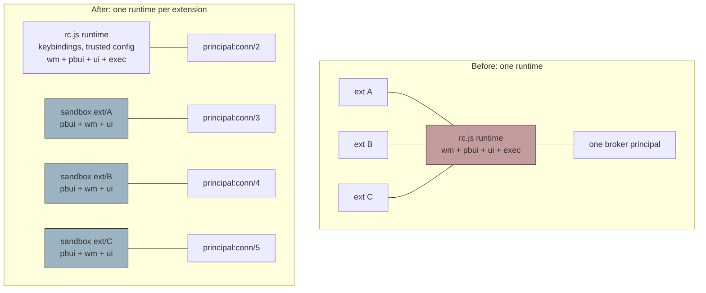
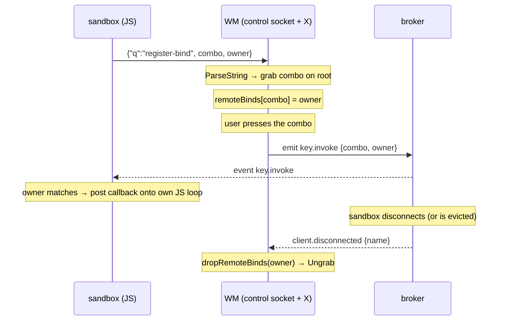

# go-go-wm: Multiple Goja Sandboxes — Isolating Extensions, Leasing Keybindings, and Detecting a Wedged Event Loop

This report covers the phase that removed a structural weakness introduced by
the user-extension system: every extension a user installed was evaluated into
the same JavaScript runtime that held the window manager's startup
configuration and its keybinding callbacks. The work replaced that with one
supervised runtime per extension, and along the way built two mechanisms the
system had been missing — a real liveness protocol in the presentation broker,
and a way for JavaScript that does not share the window manager's process to
own a keyboard shortcut.

It builds directly on the extension mechanism described in
[[PROJ - go-go-wm - User Extensions: Presenters, Actions, and Apps Loaded from Config]]
and on the presentation-and-verb model that runs through the whole system
([[PROJ - go-go-wm - PBUI Window Manager in Go]]). The scripting architecture it
extends is the subject of
[[PROJ - go-go-wm - Scripting a Window Manager with an Embedded JavaScript Runtime]].

> [!summary]
> - Extensions no longer share a runtime with `rc.js`: each gets its own goja
>   VM, its own owner goroutine, its own global object, and its own broker
>   principal, with a reduced module endowment.
> - The broker gained a genuine ping/pong heartbeat and evicts unresponsive
>   clients, which finally makes a hung-but-alive client release its leases.
> - A script that cannot own an X key grab can now ask the window manager to
>   grab on its behalf; the grab is a lease that dies with the script's broker
>   connection.
> - Two different liveness questions — is the connection alive, is the
>   JavaScript loop alive — need two different mechanisms. Conflating them
>   evicts healthy clients and misses wedged ones.

## The defect, stated precisely

The extension system loaded every file in `~/.config/go-go-wm/extensions/`
through one function:

```go
// pkg/cmds/rc.go — loadRCExtensions, before this work
func loadRCExtensions(ctx context.Context, rt *engine.Runtime, cl *client.Client, exts []*extension.Loaded) {
    rt.Owner.Call(ctx, "ext:api", func(_ context.Context, vm *goja.Runtime) (any, error) {
        return vm.RunScript("ext_api.js", extAPIJS)          // shared API, once
    })
    for _, ext := range exts {
        rt.Owner.Call(ctx, "ext:"+ext.Name, func(_ context.Context, vm *goja.Runtime) (any, error) {
            return vm.RunScript(ext.Name+".js", ext.Source)   // into the SAME vm
        })
    }
}
```

The loop is careful in exactly one dimension. An extension that throws while
loading is caught and skipped, so the remaining extensions still register. That
is the only isolation present, and it stops mattering the moment loading
finishes. After load, every extension shares four things with every other
extension and with `rc.js`:

**One goja VM and one owner goroutine.** goja is single-threaded by
construction. All JavaScript in that runtime executes on one goroutine, and
work reaches it by being posted onto a queue. An extension that runs
`while (true) {}` inside a verb handler or a timer callback occupies that
goroutine permanently. Every other extension's callbacks, and `rc.js`'s own
keybinding handlers, queue behind it and never run. This is not a scheduling
inefficiency; it is a total stall of all in-process JavaScript, including the
code that responds to the user's keyboard.

**One global object.** Extensions can read and overwrite each other's globals.
Nothing but convention separates them.

**One broker principal.** The presentation broker assigns each connection an
identity of the form `principal:conn/<n>` and keys every registration on it.
Because all extensions were evaluated into the `rc.js` runtime, they shared
that runtime's single connection. From the broker's perspective every
extension's verbs belonged to one owner, so they could not be listed,
attributed, or revoked individually.

**The trust level of `rc.js`.** The startup runtime receives the full module
set — `wm`, `pbui`, `ui`, and `exec` — on the reasoning that an rc file is as
trusted as an i3 configuration file. Every extension loaded beside it inherited
that endowment. An extension that only wants to register a verb could spawn
processes and drive the entire layout, not because it needed to, but because it
happened to share a runtime with code that did.

None of this is a defect in the code as written. It is the natural consequence
of extensions having been added as a feature on top of `rc.js`.

## What already existed

The most useful finding of the research phase was that the system already
contained two working isolation mechanisms, built for other reasons.

**Capsules** — the authored-application system — give each capsule its own goja
runtime with a capability-scoped endowment. `capsuleSpawner` constructs a fresh
`engine.NewRuntimeFactoryBuilder()`, installs exactly two desktop modules, and
evaluates the capsule's source on its own owner goroutine. The header comment
states both the intent and its limit, and it anticipated this ticket:

> Tier 1: this bounds the API surface and keeps VM crashes out of the WM loop;
> it is not a hostile-code security boundary (the sandbox tier slots in behind
> the same CapsuleSpec later).

The window manager also supervises them: a map of live capsules, an
asynchronous spawn, a reaper that tears down capsules whose tile is gone, and a
teardown path that revokes capabilities and disposes the runtime off the event
loop. That is a functioning multi-runtime supervisor. It was simply scoped to
tile-bound capsules with a narrow `ui` + `sem` module set.

**Standalone scripts** — `go-go-wm run script.js` — run as separate operating
system processes that connect to the broker as ordinary clients. Crash
isolation there is total, because the kernel provides it. What the system
lacked was any supervision of such processes: nothing tracked, restarted, or
bounded them.

So the task was not to invent isolation. It was to apply the mechanism that
already existed to the units of code that needed it, and to build the lifecycle
machinery neither path had.



## Liveness: two questions, not one

Before sandboxes could be supervised, the system needed to be able to answer
whether one was alive. The broker had no mechanism for this at all: no
heartbeat message in the wire protocol, no idle timeout, and no quotas. A
client's death was noticed only reactively, when a socket read failed.

That gap matters more than it first appears. The broker's cleanup path is
otherwise excellent. When a connection drops, `removeConn` revokes every
resource the principal owns and announces it:

```go
// pkg/pbui/broker/broker.go
delete(b.clients, c.id)
delete(b.subs, c.id)
for id, r := range b.resources {
    if r.Owner == c.principal { b.revokeResource(id, reason) }
}
b.emit("client.disconnected", jsonObj{
    "name": c.name, "principal": c.principal, "reason": reason,
}, "broker")
```

Verbs, subscriptions, and explicit registrations all disappear atomically, with
no bookkeeping required anywhere else. This is the property that makes
per-sandbox isolation inexpensive: give each sandbox its own connection and its
registrations clean themselves up.

But that entire mechanism is triggered by socket death. A client whose socket
is open and whose process is running, but whose work loop is wedged, never
triggers it. It holds its verbs indefinitely. That is precisely the failure
mode of a sandbox running `while (true) {}`, so liveness detection became a
prerequisite rather than a refinement.

The important design point is that there are **two distinct liveness questions**,
and a single mechanism cannot answer both.

| Question | What it detects | Mechanism | Failure it misses |
|---|---|---|---|
| Is the connection alive? | dead process, dead socket, unresponsive peer | broker heartbeat: `TPing` → `TPong` | a wedged JavaScript loop, because the read loop still answers |
| Is the JavaScript loop alive? | a runaway callback holding the owner goroutine | supervisor probe: post a no-op with a deadline | nothing about the connection or process |

### The broker heartbeat

The wire protocol gained `TPing` and `TPong` in both directions, plus an opaque
`Nonce` that is echoed unchanged so a prober can match a reply without owning
the sequence number — the broker's unsolicited heartbeats carry no `Seq`.

Every connection records when it last delivered a frame. Any frame counts as
proof of life, so the sweep only has to heartbeat connections that have gone
genuinely quiet:

```go
func (b *Broker) handle(c *conn, m *pbui.Msg) {
    c.lastSeen = time.Now()
    c.pinged = false
    switch m.T {
    case pbui.TPing:
        c.enqueue(&pbui.Msg{T: pbui.TPong, Seq: m.Seq, Nonce: m.Nonce})
    case pbui.TPong:
        // Reply to our heartbeat; lastSeen above is the whole effect.
    // ...
```

A ticker in the serve loop runs the sweep. A connection quiet for longer than
the heartbeat interval is pinged; one silent past `IdleTimeout` is evicted
through the ordinary `removeConn` path, so eviction revokes leases and emits
`client.disconnected` exactly as a socket death would — with the reason set to
`"unresponsive"` so a supervisor can tell the two apart. The timeout is a
multiple of the interval, so a client gets several heartbeats before being
declared dead; one dropped frame must not evict a healthy sandbox.

The client answers pings **inline from its read loop**, not from an application
goroutine:

```go
// pkg/pbui/client/client.go — inside readLoop
case pbui.TPing:
    _ = c.encode(&pbui.Msg{T: pbui.TPong, Seq: m.Seq, Nonce: m.Nonce})
```

This placement is the whole point. A client whose application goroutines are
saturated still proves the connection is alive. Answering from application code
would conflate the two questions in the table above and evict busy-but-healthy
clients.

Adding a write from the read loop introduced a second writer to the codec.
`request` had always encoded from arbitrary caller goroutines without a lock,
which was safe in practice — `Encode` performs one `Write` of a complete frame,
and `net.Conn` permits concurrent use — but that was a property of the
implementation rather than a guarantee of the design. The change routed every
send through a helper holding a write mutex.

### The supervisor probe

The second question is answered by the sandbox supervisor, which posts a no-op
onto each sandbox's own JavaScript loop with a deadline:

```go
pctx, cancel := context.WithTimeout(ctx, deadline)
_, err := rt.Owner.Call(pctx, "sandbox.probe",
    func(_ context.Context, _ *goja.Runtime) (any, error) { return nil, nil })
cancel()
```

Because goja is single-threaded, a runaway callback owns the loop and the
posted closure never executes. Failure to answer within the deadline is
therefore direct evidence that the loop is occupied. The supervisor interrupts
the VM — `engine.Runtime` exposes the underlying `*goja.Runtime`, so
`rt.VM.Interrupt(err)` breaks the loop — and applies the restart policy, with
backoff and a crash-loop breaker that stops respawning an extension that wedges
repeatedly.

## Leasing a keyboard shortcut

Moving extensions out of `rc.js` had one direct cost that had to be paid first.
Key grabs live in the X server and belong to the window manager. A runtime that
does not share the window manager's process cannot own one, and the module
enforced that with an error:

```go
var ErrNoKeybindings = errors.New(
    "keybindings require the in-process runtime; put this in rc.js (go-go-wm wm --rc)")
```

Left alone, isolating extensions would have taken their keybindings away, which
is exactly the pressure that produced the shared-runtime design in the first
place. The fix is a pattern the codebase already used for daemon-owned launcher
commands: the *request* crosses the control socket, the *grab* stays in the
window manager, and the *dispatch* travels back as a broker event addressed to
the owning principal.



`wm.bind` now treats the old error as a routing signal rather than a failure:

```go
err := m.backend.Bind(combo, fire)
if errors.Is(err, ErrNoKeybindings) {
    err = m.registerRemoteBind(combo, fire)
}
```

`ErrNoKeybindings` was demoted accordingly. Its message no longer tells the user
to move code into `rc.js`; it now only surfaces when the fallback is also
unavailable, which means there is no broker connection to dispatch through.

### The X constraint that shaped the implementation

One detail of the xgbutil library determined the structure. There is no
per-callback detach. `keybind.Detach(xu, win)` removes *every* key callback
registered on a window, which would take the window manager's own bindings with
it. Releasing one script's binding by detaching its callback is therefore not
possible.

What can be released is the *grab*. `keybind.Ungrab(xu, win, mods, key)` undoes
the X-level grab while leaving the callback attached. So the implementation
attaches a combo's dispatcher exactly once and leaves it attached for the life
of the process; what comes and goes is the grab. With no grab, no event is
delivered, the dispatcher never runs, and the key passes through to the focused
client. Re-registration re-grabs rather than re-connecting, because calling
`Connect` a second time would append a second callback and fire the binding
twice.

The lifetime is tied to the broker connection. `client.disconnected` — whether
caused by a socket death or by the new liveness eviction — triggers
`dropRemoteBinds(owner)`, which ungrabs every combo that owner held.

## The sandbox

With those two mechanisms in place, the sandbox itself is straightforward. A
sandbox is one unit of JavaScript with its own runtime, its own broker
connection, and a bounded endowment. Isolation comes from three independent
properties, and it is worth naming them separately because they fail
independently:

- Its own goja VM and owner goroutine, so a wedged or slow extension starves
  only itself.
- Its own global object, so extensions cannot overwrite each other's state.
- Its own broker principal, so every registration it makes is a lease the
  broker revokes when the sandbox goes away.

The endowment is installed rather than ambient. Extensions receive `pbui`, `wm`,
and `ui`, but not `exec`, and `MiddlewareSafe` gates `fs` and `os` away.
`rc.js` keeps `exec` because an rc file is as trusted as an i3 configuration; a
file dropped into a configuration directory is not.

### Making every registration a lease

The most useful piece of the implementation is a small decorator:

```go
// leasedBackend forces every WM-side registration a sandbox makes through
// the broker-leased path.
type leasedBackend struct{ wmmod.Backend }

func (leasedBackend) Bind(string, func()) error { return wmmod.ErrNoKeybindings }

func (leasedBackend) RegisterCommand(string, string, string, func()) error {
    return wmmod.ErrNoScriptCommands
}
```

Extension sandboxes run inside the window manager's process, so the in-process
backend would happily accept a direct key grab or a launcher command owned by a
raw Go callback. Those registrations are keyed by nothing the window manager
can clean up when a sandbox dies. Refusing the direct paths forces `wm.bind`
and `wm.command` down the mediated routes, where ownership is the sandbox's
broker client and teardown is automatic.

This incidentally repaired a pre-existing leak. In-process script commands were
stored in a map that was never pruned; nothing removed an entry when the code
that registered it went away. Routing sandbox commands through the leased path
means they are revoked with the connection.

### Bounded loading, and the bug the end-to-end test found

The end-to-end test was written to prove the isolation properties against a real
window manager under Xephyr rather than only in unit tests. Its first run failed
on a mistake in the test fixture:

```
error="sandbox ext/wedged: TypeError: Object has no member 'setTimeout' at wedged.js:5:17(23)"
```

Engine runtimes have no global `setTimeout`; `timer.sleep(ms)`, which returns a
Promise, is the only timing primitive. That was a two-line fix. But the failure
was informative beyond the typo. Two of three extensions had loaded and the
third was skipped, which raised the question of what would have happened had the
third *succeeded* in wedging at top level.

The answer was bad. Sandboxes start in sequence, so an extension whose
top-level code never returns would have blocked every *later* extension from
loading at all. That is a worse failure than the one the ticket set out to fix,
because it silently loses functionality rather than degrading it.

The fix bounds top-level evaluation with a deadline, and interrupts the VM in
the failure cleanup so that `Close` does not wait out its own timeout on a loop
that is never coming back:

```go
loadCtx, cancelLoad := context.WithTimeout(ctx, sandboxLoadDeadline)
defer cancelLoad()
// ...
if _, err := rt.Owner.Call(loadCtx, "sandbox:"+spec.ID, evalSource); err != nil {
    if loadCtx.Err() != nil && ctx.Err() == nil {
        err = fmt.Errorf("top-level code did not finish within %s "+
            "(an extension must register and return, not loop)", sandboxLoadDeadline)
    }
    cleanup()
    return fmt.Errorf("sandbox %s: %w", spec.ID, err)
}
```

Overrunning the deadline is now an ordinary failed start, with a message that
explains what the author did wrong. The general lesson is worth recording: unit
tests exercised the supervisor with sandboxes started one at a time in
isolation, and that shape cannot expose coupling that only exists in the
sequential loading loop. Only the realistic configuration — a directory full of
extensions, loaded at boot — surfaced it.

## Verification

The unit tests assert the isolation properties directly. The decisive one starts
a sandbox running `while (true) {}` and requires another sandbox to answer
within three seconds; under the old shared-runtime loader both would have run on
one owner goroutine and it would time out. Others assert distinct principals,
that globals do not leak, that verbs are revoked when a sandbox stops, that a
failed start leaves nothing registered, and that a throwing extension does not
prevent later ones from loading.

The end-to-end harness boots the window manager in Xephyr with three extensions
installed and asserts over the control socket and the broker:

```
== 1. every extension is live as its own sandbox
   ok: three sandboxes: ['ext/alpha', 'ext/beta', 'ext/wedged']
== 2. each sandbox holds a distinct broker principal
   ok: distinct principals: ['principal:conn/3', 'principal:conn/4', 'principal:conn/5']
== 3. all three actions registered (separate runtimes, no global leak)
== 4. the wedged extension does not stop the others being healthy
   ok: verb alpha.act still reachable while wedged.js spins
== 5. sandboxes are observable as broker resources
   ok: wm.sandbox resources: ['ext/alpha', 'ext/beta', 'ext/wedged']
== ALL PASS
```

The third assertion is structural rather than declarative. The fixture
`beta.js` throws if it can observe a global set by `alpha.js`, so the existence
of `beta`'s verb is itself the proof that the runtimes are separate.

Running the same binary against the three extensions actually installed in the
configuration directory confirms the migration is transparent to real code:

```
  ext/counter    principal=principal:conn/3   healthy=True
  ext/geo        principal=principal:conn/4   healthy=True
  ext/money      principal=principal:conn/5   healthy=True
```

## What Tier 1 isolation does and does not provide

Being precise about the boundary matters more than claiming a strong one.

What it provides: an API boundary and a concurrency boundary. A misbehaving
extension cannot stall another extension's callbacks, cannot overwrite another
extension's state, cannot register capabilities that outlive it, and cannot
reach modules it was not granted.

What it does not provide: a defence against hostile code. Sandboxes share the
window manager's process and heap. A runaway loop still consumes a core until
the probe interval elapses and the interrupt lands; goja offers no per-runtime
heap limit, so a memory bomb still allocates in the shared heap. The design
records this explicitly, and the intended answer for untrusted code is the Tier
2 substrate — running the sandbox as a separate process via `go-go-wm run`,
where the operating system supplies the boundary. The liveness work already
covers that case: a killed process is evicted by socket death, and a hung one by
the heartbeat.

## Current status

Implemented, tested, and verified against a running desktop:

- Broker ping/pong with idle eviction, and `client.disconnected` carrying a
  reason.
- Broker-mediated keybindings, with the grab held as a lease.
- One supervised sandbox per extension, replacing the shared-runtime loader.
- A liveness probe for the JavaScript loop, restart with backoff behind a
  crash-loop breaker, and a bounded top-level load.
- Observability: a `sandboxes` control-socket query returning identity,
  principal, health, uptime, restart count, and last error; sandboxes
  registered as `wm.sandbox` broker resources; `sandbox.started` and
  `sandbox.ended` lifecycle events.

## Open questions

- **Keybinding collisions are resolved last-bind-wins, silently.** Two
  extensions requesting the same combination means the second takes it with no
  warning. A `binds` query exists, but nothing surfaces the conflict.
- **Restart policy is a blanket default.** A restarted sandbox re-registers its
  verbs idempotently, because the broker upserts by principal and identifier,
  but any in-flight accept session or external state it held is lost. Whether
  automatic restart is correct for every extension is unresolved.
- **Memory accounting for Tier 1.** Either build per-runtime accounting, or
  accept "use Tier 2 for anything you do not trust with memory" as the answer.
- **How the substrate is selected.** A manifest field, a directory convention,
  or a consent prompt on first load reusing the existing capability-consent
  machinery.

## Near-term next steps

- Merge the tile-bound capsule supervisor into the sandbox supervisor. The two
  are now clearly the same abstraction at different scopes; the merge is a pure
  refactor with the capsule test suite as the oracle.
- Implement the Tier 2 process substrate. The specification type was written so
  a substrate field can select an out-of-process implementation wrapping
  `go-go-wm run`, satisfying the same start, stop, and liveness interface.
- Route presenter registrations over the broker, so out-of-process extensions
  can contribute REPL display types the way in-process ones do — the remaining
  gap relative to the object-presentation work in
  [[PROJ - go-go-wm - The Living REPL: Cells, Apps, and Workspaces as Objects, and a Production Editor Surface]].
- Build a sandbox dashboard as a capsule, rendering each sandbox as a typed
  object so that restart, stop, and inspect become verbs on the existing
  one-click contract. The `sandboxes` query already returns everything it needs.

## Project working rule

Registrations that cross a process or runtime boundary should be leases owned by
a connection, never entries in a map that something else is responsible for
pruning. The broker already revokes everything a principal owns when that
principal goes away; code that opts into that path gets correct teardown for
free, and code that bypasses it acquires a cleanup obligation that will
eventually be missed. When a runtime cannot perform an operation itself, the
better answer is usually to mediate the request through the component that can
and return the result as an event, rather than to declare the operation
unavailable.
