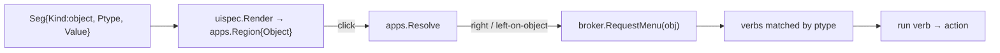
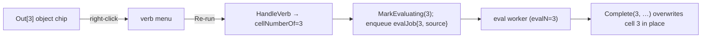

# go-go-wm: The Living REPL — Cells, Apps, and Workspaces as Objects, and a Production Editor Surface

This report covers a phase that made three surfaces of go-go-wm behave the way
the rest of the desktop already does: as collections of typed objects a user
can click, act on, and persist. It builds on the presentation-and-verb model
that runs through the whole system
([[PROJ - go-go-wm - PBUI Window Manager in Go]]) and on the user-extension
mechanism that lets a JavaScript file register capabilities from a config
directory ([[PROJ - go-go-wm - User Extensions: Presenters, Actions, and Apps Loaded from Config]]).
The work divides into three clusters: making REPL cells and REPL-defined apps
into objects that can be re-run, edited, deleted, and saved to disk; turning
the REPL's input line from an append-only string into a production editor with
a cursor, searchable history, completion, and a working clipboard; and making
each workspace in the dashboard a first-class object.

The purpose of this report is to explain a single structural fact that made
two of the three clusters small and the third large, and to be precise about
which is which. go-go-wm renders every interactive surface through one
intermediate representation — rows of typed segments — and routes every click
through one contract that turns an object segment into a verb menu. Any feature
that amounts to *presenting something as an object* is therefore a change of a
few lines at the point of rendering, because the menu, the verb dispatch, and
the action all already exist downstream. Two of the three clusters are exactly
that. The third, a real text editor with copy-paste, is where genuine new
engineering lives, because none of it existed: the window manager had no X11
selection code at all, and its input model was append-plus-backspace with no
concept of a cursor.

> [!summary]
> - **Cells and apps as objects.** `In[n]` and `Out[n]` became clickable
>   `repl.cell` objects carrying their cell number, with verbs to re-run, edit,
>   delete, copy, and save. A REPL-defined app persists to disk through a
>   scoped `wm.saveExtension` host call into the directory the system already
>   auto-loads.
> - **A production editor surface.** The input line gained a rune-aware caret
>   editor (motion, word operations, UTF-8), reverse incremental history search
>   with on-disk persistence, identifier and member completion enumerated from
>   the live runtime, mouse-wheel scrolling, and — built from the X protocol up
>   — ICCCM copy-paste.
> - **Workspaces as objects.** The dashboard renders each workspace as a
>   `workspace` object, which surfaces the switch/duplicate/delete verbs the
>   window manager already registered — a one-line change with no new
>   capability.
> - **The dividing line.** Presenting-as-object is wiring over an existing
>   contract; the text editor and the clipboard are new. The clipboard, in
>   particular, was greenfield: there was no selection handling anywhere in the
>   codebase.

## Why this phase exists

Before this work, the REPL was a notebook whose results were live
presentations, but whose *mechanics* were inert. You could look at `Out[3]`,
but you could not click it; the label was plain text with no hit region. You
could evaluate a cell, but you could not re-run it in place, edit it back into
the input, or delete it; cells were append-only. You could define an
interactive app in a cell and watch it run, but when the REPL closed the app
was gone, because nothing wrote it to disk. And the input line, on which all of
this depends, was not an editor: it accepted printable ASCII appended to the
end and a backspace that removed the last byte, and nothing else — no cursor,
no Unicode, no history search, no completion, and no way to copy a value out to
a terminal or paste a snippet in. The workspace dashboard had the same defect
in miniature: it listed workspaces as text you could read but not act on, even
though the window manager already knew how to switch, duplicate, and delete
them.

The through-line of the fixes is that the desktop's own object model was the
answer to most of them, and the input editor and clipboard were the parts the
object model could not supply.

## The one contract that does most of the work

Everything the REPL and every capsule draws is a `uispec.Spec`: rows of `Seg`
values, each with a `Kind` (`text`, `hint`, `object`, `button`, `field`,
`table`). The renderer walks that IR and, for each `Seg` that can be
interacted with, emits an `apps.Region` — a rectangle plus, for an object
segment, a pointer to a `pbui.Object`. A click resolves through one function,
`apps.Resolve`, which encodes the whole contract:

```
Resolve(accepting, region, button):
    if button == 3 (right):
        if region.Object: return Menu(region.Object)   # right-click an object → its verb menu
        return nothing
    # left click:
    if region.Object and TypeMatches(accepting, Object.Ptype):
        return Answer(region.Object)                    # satisfy an active accept
    if region.Action != "":
        return Action(region.Action)                    # a plain button
    if region.Object:
        return Menu(region.Object)                      # left-click an object → its menu
```

The caller turns `Menu(obj)` into `broker.RequestMenu(obj, x, y)`, and the
broker answers with every verb whose `Ptypes` cover the object's ptype. The
consequence is the load-bearing fact of this phase: **the moment a label is
rendered as a `KindObject` segment instead of a `KindHint`, it becomes
clickable, right-clickable, and menu-bearing, with no additional code at the
call site.** Both the workspace cluster and half of the cell cluster are
applications of that single sentence.



## Cluster C: workspaces as objects

The workspace cluster is the clearest demonstration, so it is worth stating
first even though it is the smallest. The window manager holds its workspaces
in `pkg/wmcore` as a flat list of named layout trees, and every mutation —
switch, add, remove, rename, clone, move-a-window — is a serializable `Op`
dispatched through one `Apply`. Long before this phase, the window manager
*already registered* three verbs on the `workspace` ptype and executed them
itself:

```go
// pkg/wmx11/pbui.go
{ID: "workspace.switch",    Label: "Switch to", Ptypes: []string{"workspace"}},
{ID: "workspace.duplicate", Label: "Duplicate", Ptypes: []string{"workspace"}},
{ID: "workspace.delete",    Label: "Delete",    Ptypes: []string{"workspace"}},
```

with a handler that maps the clicked object's value (the workspace id) to
`OpSwitchWorkspace` / `OpCloneWorkspace` / `OpRemoveWorkspace`. These verbs
were live and correct, but they never appeared, because nothing on screen ever
presented a `workspace` object for the broker to attach them to. The dashboard
capsule rendered each workspace as inert text:

```js
ui.text((here ? "● " : "  ") + (ws.name || ws.id), { bold: here })
```

The entire feature was to change that one call to an object:

```js
ui.object("workspace", ws.id, { label: (here ? "● " : "  ") + (ws.name || ws.id),
                                doc: "right-click to switch / duplicate / delete" })
```

Now the chip emits a region carrying a `workspace` object; right-clicking it
requests the broker menu; the broker returns the window manager's verbs; and
selecting one runs the window manager's `Op`. There is a subtle and important
point in the trust story here: the capsule needs no new capability, because it
does not *act* on the workspace — it only *presents* the object. The window
manager owns and executes the verbs. A capsule that wanted to switch
workspaces on its own would need a new write capability, a consent prompt, and
a gated closure; presenting the object needs none of that. The end-to-end test
confirms the whole chain: launch the dashboard, right-click the `ws1` chip,
select "Switch to," and the current workspace flips from `ws2` to `ws1`.

## Cluster A: cells and apps as objects

### Making In[n] and Out[n] clickable

The cell cluster applies the same contract to the notebook. `In[n]` and
`Out[n]` were `KindHint` segments; they became `KindObject` segments with ptype
`repl.cell` whose value is `{n, kind}`:

```go
// pkg/repl/session.go
func cellObjectSeg(n int, kind, label, doc string) uispec.Seg {
    return uispec.Seg{Kind: uispec.KindObject, Ptype: "repl.cell",
        Value: map[string]interface{}{"n": n, "kind": kind}, Label: label, Doc: doc}
}
```

Carrying the cell number in the value is a deliberate choice, and it fixes a
latent defect. The REPL's older verb, "copy this value as input," resolved its
target by matching the object's *value* against every cell's value and taking
the newest match — which means two cells holding the same number could not be
told apart. A `repl.cell` object addresses a specific cell by number, so
re-run, edit, and delete are unambiguous:

```go
func cellNumberOf(obj *pbui.Object) int {
    if obj == nil || obj.Ptype != "repl.cell" { return 0 }
    var v struct{ N int `json:"n"` }
    _ = json.Unmarshal(obj.Value, &v)
    return v.N
}
```

### The verbs, and the operations they required

Five verbs attach to a cell: copy source, edit (load the source back into the
input line), re-run, delete, and save as extension. Copy and edit were nearly
free. Re-run and delete required operations the session model did not have,
because the model assumed cells were append-only and densely numbered — the
number `n` is used directly as `Cells[n-1]` across submission, completion, view
selection, and rendering.

Deletion could not simply remove a cell and renumber the rest: that would
invalidate every `Out(n)` reference a user had already typed and every cell
object currently on screen. The design is therefore a tombstone. `DeleteCell`
marks the slot hidden and drops any hosted app; the renderer skips tombstoned
cells; and the dense index is preserved, so cell 3 keeps the number 3 after
cell 2 is deleted:

```go
func (s *Session) DeleteCell(n int) {
    if n < 1 || n > len(s.Cells) { return }
    s.Cells[n-1].Tombstoned = true
    s.Cells[n-1].Live = nil
}
```

Re-run was interesting because the session does not evaluate — the host does,
through a single worker goroutine that drains a queue of cells in submission
order (a single worker because evaluation performs a runtime round-trip
followed by a separate capture pass that drains a global console buffer, and
two concurrent evaluations would let one cell steal another's output). Re-run
reuses that exact machinery: the verb marks the cell evaluating under the
render lock, releases the lock, and enqueues the cell's source on the same
queue a fresh submission uses. Because the eval worker publishes the in-flight
cell number, a re-run of a cell that hosts a live app re-binds the app cleanly.



### Persisting a REPL-defined app to disk

The user-facing goal behind the cell cluster is turning an app defined
interactively into a file that reloads on the next start. Two facts made this
tractable. First, the source is already available: the session retains every
cell's exact input string, so there is no need to reconstruct it from the
runtime. Second, the extension mechanism from the previous phase already
auto-loads every `*.js` file in a config directory. What was missing was a
write path, because the runtime deliberately exposes no filesystem module — a
writable `fs` module is compiled into the binary but is gated out of the REPL
and rc.js, and the only pre-existing way to write a file was to shell out.

The addition is a scoped host call rather than a general filesystem module.
`extension.Save` sanitizes a name and writes into the first search-path
directory — exactly the directory the loader reads — and it is exposed both as
the JavaScript `wm.saveExtension(name, source)` and as the `repl.export` verb:

```go
func Save(name, source string) (string, error) {
    safe := SanitizeName(name)                 // [a-z0-9-], collapse runs, cannot traverse out
    if safe == "" { return "", errors.New("no usable characters") }
    dir := SearchPath()[0]                      // ~/.config/go-go-wm/extensions
    os.MkdirAll(dir, 0o755)
    path := filepath.Join(dir, safe+".js")
    return path, os.WriteFile(path, []byte(source), 0o644)
}
```

The choice to expose a narrow host call instead of the general `fs` module is a
security decision. A filesystem module would grant unrestricted disk write to
all REPL code and would need confinement to be safe; a host call writes exactly
one directory, with a name that cannot escape it, and it fits the existing
"drop a file in `extensions/` and it loads" pipeline without any new gating.
The end-to-end test evaluates `wm.saveExtension(...)`, observes the returned
path rendered as `Out[1]`, and confirms the file exists on disk.

## Cluster B: a production editor surface

The editor cluster is where the object model stops helping and real
implementation begins. It has five parts. Four are self-contained; the fifth,
the clipboard, is greenfield.

### A caret line editor

The input line was a plain string mutated by appending printable ASCII and
trimming the last byte. It became a rune-aware editor with a caret index and a
full set of operations — insert at the caret, delete before and at the caret,
motion by character and word, kill to the start and to the end, and
UTF-8-correct handling throughout (the old path dropped every byte at or above
`0x7f`, so accented and Unicode input was impossible). The string remains the
source of truth, because history recall, the edit and copy verbs, and the
renderer all read it; the caret is a separate rune index, and every edit
mutates the two together:

```go
func (s *Session) InsertInput(text string) {
    s.clampCaret()
    r := []rune(s.Input)
    out := append([]rune{}, r[:s.caret]...)
    out = append(out, []rune(text)...)
    out = append(out, r[s.caret:]...)
    s.Input = string(out)
    s.caret += len([]rune(text))
}
```

Rendering the caret required one change to the shared IR. The field segment
gained a `Caret` rune index, and the renderer measures the pixel width of the
text before it to position a thin two-pixel bar between glyphs. That width — a
thin bar rather than a filled block — matters more than it looks: the first
implementation drew a seven-pixel block at the caret, which painted directly
over the character under it, so a mid-line caret in `abc` hid the `c` and made
the model look broken when it was correct. The bar sits between glyphs and
obscures nothing.

### History that searches and persists

History gained two capabilities. Reverse incremental search is a session mode:
it stashes the current line, narrows a query as the user types, steps to older
matches on repeated triggers, accepts the match into the line, or restores the
original on cancel. Persistence writes each submitted line to a file under the
state directory, deduplicating consecutive duplicates, and loads it at start,
so both the up-and-down history and the search reach across sessions. The
persistence lives in the host rather than the session model, keeping the model
free of file access.

### Completion against the live runtime

Completion enumerates candidates from the running JavaScript runtime rather
than from a static table. The host splits the input at the caret into a base
object expression and a partial token, then enumerates on the runtime's own
loop: the global object's keys for a bare identifier, or the base object's own
enumerable keys for a member access, filtered by the partial and sorted.

```
onTab(input, caret):
    base, partial, prefixLen = split(input, caret)      # "wm", "tr", 2   for "wm.tr|"
    withRuntime(vm):
        obj = base == "" ? vm.GlobalObject() : resolveDotted(vm, base)
        candidates = [k for k in obj.Keys() if k startswith partial]
    openOverlay(sort(candidates), prefixLen)             # single candidate auto-accepts
```

The lock discipline is the subtle part. Enumeration calls into the runtime,
which must not run under the render mutex, but the key handler holds it. The
handler snapshots the input and caret under the lock, sets a flag, releases,
computes the candidates, and re-acquires the lock to open the overlay — the
same shape the eval worker uses. `resolveDotted` walks a dotted path with
property reads only and no calls, so it is side-effect-free for ordinary
objects. The one limitation, documented rather than hidden, is that `Keys()`
returns only own enumerable keys, so built-ins whose methods live on
non-enumerable prototypes — `Math.`, `JSON.` — complete to nothing; the module
globals and user objects that matter here complete correctly.

### The clipboard, built from the protocol up

There was no X11 selection or clipboard code anywhere in the repository — no
interned selection atoms, no `SelectionRequest` or `SelectionNotify` handlers,
no `SetSelectionOwner` or `ConvertSelection`. A window-manager-drawn surface
could neither copy text out nor paste text in, and the window manager did not
proxy selections for anything. This had to be implemented as first-class ICCCM
handling, and it lives in the client-side shell that owns the REPL's window,
because the REPL is a normal X client that the window manager frames.

The two directions are symmetric. To copy, the shell takes ownership of both
PRIMARY and CLIPBOARD and then serves requests: when another client asks what
formats are available it replies with a list of target atoms, and when it asks
for text it writes UTF-8 to the requesting window's property and sends a
`SelectionNotify`. To paste, the shell asks the current owner to convert its
selection to UTF-8 onto a property of its own window, and reads that property
when the resulting `SelectionNotify` arrives, delivering the text to the app.

```mermaid
sequenceDiagram
    participant U as User
    participant R as REPL shell (owner + requestor)
    participant X as X server
    U->>R: Ctrl-C
    R->>X: SetSelectionOwner(CLIPBOARD, our window)
    U->>R: Ctrl-V
    R->>X: ConvertSelection(CLIPBOARD, UTF8_STRING, prop)
    X->>R: SelectionRequest (we are the owner)
    R->>X: ChangeProperty(prop = text); SendEvent(SelectionNotify)
    X->>R: SelectionNotify
    R->>R: GetProperty(prop) → insert text at caret
```

Two fixes fell out of validating this. Modifier chords like Ctrl-C and Ctrl-V
did not arrive reliably as control characters, so the key handler now derives
the control character from the Control modifier directly (Ctrl-A becomes
`\x01`, and so on), which incidentally made the Emacs-style editing chords and
the reverse-search trigger reliable at the same time. And a constraint of the
window manager surfaced: it grabs the Escape key globally, for modal accept and
menu cancellation, so Escape never reaches the REPL client. The consequence is
that Escape cannot clear the line or cancel a search under the window manager;
the editor uses Ctrl-A then Ctrl-K to clear, and Ctrl-G to cancel search and
completion. The end-to-end test copies a string, clears the line, and pastes it
back, which drives the full serve-and-receive path — the X server routes the
`SelectionRequest` to the owner even when the owner and requestor are the same
window, so the self round-trip exercises exactly the code cross-application
copy-paste uses.

### Mouse-wheel scrolling

The smallest editor change added a `Scroller` extension interface to the client
shell: wheel buttons become a scroll delta, and the REPL moves its window three
rows per notch. It is a few lines, included for completeness of the "feels like
a real application" goal.

## The dividing line, stated plainly

The reason to write this report is the contrast between the clusters, because
it generalizes. When a system renders through a typed IR and routes interaction
through a single object-to-menu contract, the cost of making a thing
*actionable* is the cost of *presenting it as an object* — a change at one call
site, because the menu, the dispatch, and the action are already downstream.
The workspace cluster is one line. The clickable half of the cell cluster is
three call sites plus a value that carries identity. What that model cannot
give you is a text editor or a clipboard, because those are not about
presenting objects; they are about maintaining editing state and speaking a
wire protocol. Those parts — the caret buffer, the search mode, the runtime
enumeration, and above all the ICCCM selection handling — are where the real
lines of this phase were written. Knowing which half a feature falls into
before starting it is most of the estimate.

## Current project status

All three clusters are implemented, unit-tested, and validated in a nested X
server where they are user-visible. Workspaces are actionable objects in the
dashboard. Cells are `repl.cell` objects with working re-run, edit, delete,
copy, and save-to-disk verbs, and a REPL-defined app persists as an extension
that reloads on the next start. The input line is a caret editor with word
operations and UTF-8, reverse history search backed by an on-disk file,
completion against the live runtime, mouse-wheel scrolling, and copy-paste that
round-trips with terminals through the standard X mechanisms. The full test
suite passes.

## Open questions and near-term next steps

A few things are deliberately deferred. The window manager could register
`workspace.move-window-here` and `workspace.close-all` verbs — the first reuses
an existing accept-a-window pattern plus a move operation, the second iterates
a workspace's leaves — but neither is needed for the headline. The clipboard
implements the common case (UTF-8, editor-sized text) and omits the
incremental-transfer protocol for very large selections and in-surface
drag-selection for copy; both are additive. Completion could adopt the sibling
library's parser to complete built-in prototype members and to add fuzzy
matching. And the retention of evaluated values is unbounded within a single
long-lived session — every result is pinned in the runtime's history and stored
as marshaled JSON on its cell — which is a memory concern for a session left
open indefinitely, though it is fully reclaimed when the REPL process exits.

## Important project docs

The design and implementation are recorded in ticket **GGWM-019-LIVING-REPL**
under the repository's `ttmp/2026/07/24/` tree: an intern-oriented
analysis/design/implementation guide written before the code, a chronological
investigation diary with seven steps, and four Xephyr end-to-end harnesses with
golden screenshots (workspace switch, cell delete and save, and the editor's
mid-line edit, completion, and clipboard round-trip). The dashboard capsule is
`examples/capsules/workspace-dashboard/main.js`.

## Project working rule

Before implementing a feature, decide which half it is: presenting something as
an object, which is a change at the render site over an existing contract, or
maintaining new state and protocols, which is not. Spend the estimate and the
test effort on the second half, and let the first half be the small change it
actually is.
