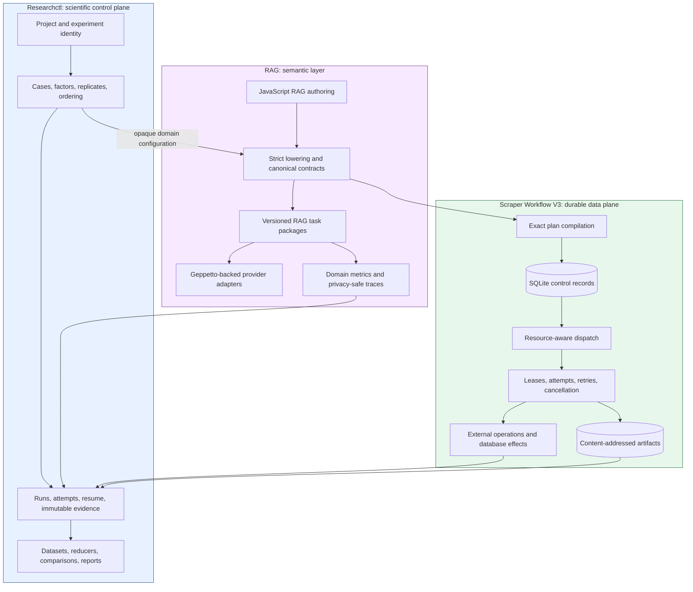
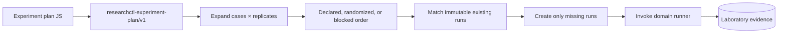
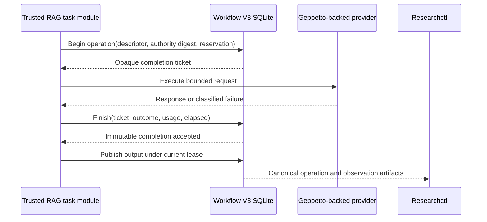
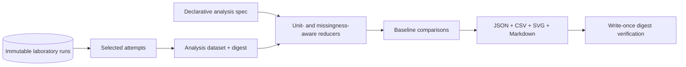
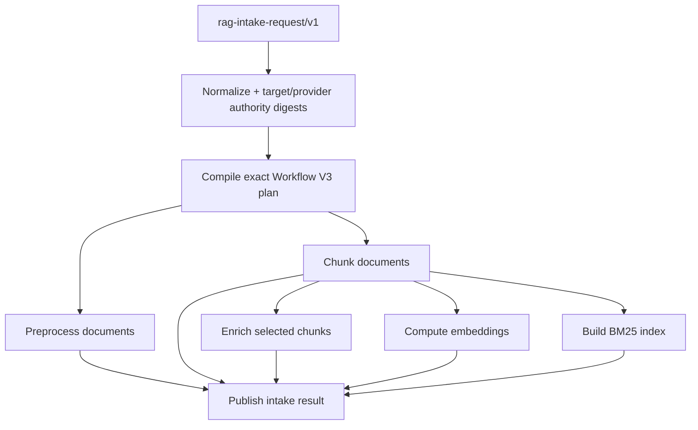

# Experiment Platform Convergence: Researchctl, Workflow V3, and RAG

This project converged four repositories into one reproducible experiment architecture. Researchctl now owns scientific identity, cases, factors, replicates, attempts, resume, and cross-run analysis. Scraper Workflow V3 owns durable task execution, leases, retries, effects, isolation, artifacts, budgets, cancellation, and telemetry. The RAG evaluation repository owns retrieval semantics, strict contracts, lowering, provider adapters, preparation and query boundaries, and measurements. Geppetto remains behind RAG-owned provider adapters rather than becoming a workflow or experiment authority.

The implementation did more than connect existing packages. It removed the alternate paths that previously competed for ownership. Direct JavaScript codesign execution and comparison were deleted from Researchctl. The old RAG study runners, intake workflow, and lifecycle adapters were deleted. Scraper's old engine, scheduler, site runtime, API, services, runtime events, metrics, protobufs, and frontend were deleted after every downstream importer had moved to Workflow V3. The final system has one control plane, one data plane, and one domain semantic layer.

> [!summary]
> - Researchctl is the scientific control plane. It decides *which immutable runs exist* and analyzes their durable evidence; it does not schedule Workflow nodes or understand RAG operators.
> - Workflow V3 is the durable data plane. It decides *how one run executes* under leases, retries, budgets, isolation, cancellation, and artifact custody; it does not define experiment matrices or retrieval semantics.
> - RAG owns semantic lowering and provider operations. JavaScript authors intent, Go produces closed canonical contracts, and trusted adapters execute provider work without placing secrets or source payloads in durable control rows.
> - The architecture was accepted with a fully scripted 2-case × 3-replicate TTC study, deterministic analysis regeneration, bounded real-provider calls, intake restart/cancellation tests, privacy scans, and deletion guards across all repositories.

## 1. The problem was duplicate authority

The initial system had individually useful components but no single answer to several basic questions. A RAG script could describe a study, execute provider work, aggregate results, and write reports. Researchctl could record runs and attempts, but it did not yet own declarative experiment matrices or reproducible cross-run analysis. Scraper had durable scheduling and retries, but both an older site-oriented engine and Workflow V3 existed. RAG intake had its own queue, workers, statuses, retry surfaces, and frontend projections.

Those overlaps created duplicate authority:

| Question | Competing answers before convergence |
| --- | --- |
| Which cases and replicates should run? | RAG scripts, codesign sweeps, ad hoc shell loops, or Researchctl |
| Which component retries failed work? | Researchctl attempts, Workflow nodes, provider wrappers, or manual API retry |
| Where is durable status recorded? | Researchctl SQLite, old Scraper SQLite, Workflow V3 SQLite, or RAG intake tables |
| Which measurements are authoritative? | Task summaries, provider timers, operation logs, generated reports, or laboratory metrics |
| Which artifact proves an external call occurred? | Provider response-derived output, task logs, or no durable record |
| How is a resumed study identified? | Script-generated IDs, timestamps, or immutable laboratory identity |
| Who owns cross-run statistics? | JavaScript helper functions, codesign comparison packages, or report scripts |

A reproducible platform cannot answer these questions by convention alone. The boundaries must be represented in code, schemas, dependency direction, persistence, and deletion guards. The design therefore started by assigning each class of fact to exactly one owner.

## 2. The ownership model

The final model separates scientific control, durable execution, and domain semantics.



### 2.1 Researchctl owns scientific identity

Researchctl owns facts that remain meaningful across domains:

- project and experiment identity;
- case identity and factor assignments;
- replicate index and declared ordering;
- run and attempt identity;
- resume behavior and terminal status;
- verified artifacts, metrics, and traces;
- selected-run datasets and cross-run analysis;
- deterministic publication of JSON, CSV, SVG, and Markdown.

Researchctl does not decode RAG operator graphs. It does not lease Workflow nodes. It does not retry provider calls. It sees an opaque domain configuration, invokes the registered domain runner, and records verified outputs.

### 2.2 Workflow V3 owns execution truth

Workflow V3 owns facts that arise while executing one domain run:

- compiled nodes and exact implementation identities;
- resource admission and work-conserving dispatch;
- leases, renewal, attempts, retries, and stale-authority fencing;
- cancellation epochs and terminal state;
- maps, reductions, budgets, and approval gates;
- database effects and external provider operations;
- process isolation and bounded worker protocols;
- content-addressed outputs and canonical observations.

This is the only component allowed to decide whether a node may begin or whether an attempt may publish. Researchctl can cancel the enclosing attempt, but it does not become a second Workflow scheduler.

### 2.3 RAG owns semantic truth

The RAG repository owns concepts that require retrieval knowledge:

- preparation and query contracts;
- chunking, enrichment, embedding, lexical indexing, vector retrieval, fusion, hydration, reranking, generation, and evaluation;
- exact provider authority and model identity;
- study lowering into Workflow V3 plans;
- query-scoped metrics and privacy-safe traces;
- intake request, result, and summary schemas;
- product qualification and publication rules.

Geppetto provides generation, embedding, and reranking implementation behind thin adapters. It does not own RAG plans, Workflow retries, Researchctl runs, or persisted evidence.

## 3. Closed contracts make ownership enforceable

The architecture uses versioned, data-only contracts at every boundary. Unknown fields, unknown operators, malformed identities, trailing JSON, stale authority, and path escapes fail explicitly. There is no permissive compatibility decoder that silently ignores an intended field.

Important contracts include:

| Contract | Owner | Purpose |
| --- | --- | --- |
| `researchctl-experiment-plan/v1` | Researchctl | Cases, factors, replicates, ordering, and execution policy |
| `researchctl-analysis-dataset/v1` | Researchctl | Immutable selected-run analysis input |
| `researchctl-analysis-spec/v1` | Researchctl | Declarative grouping, reducers, comparisons, and charts |
| `scraper-workflow-execution/v2` | Scraper integration | One exact Workflow V3 execution under Researchctl |
| `rag-workflow-study-bundle/v1` | RAG | Immutable compiled study publication |
| `rag-intake-request/v1` | RAG | Closed intake request and lifecycle input |
| provider operation descriptors | Workflow V3 + RAG | Bounded admission, completion, usage, and failure evidence |

Researchctl's plan type is intentionally small:

```go
type ExperimentPlan struct {
    SchemaVersion string
    ID            string
    ExperimentID  string
    Cases         []ExperimentCase
    Ordering      OrderingPolicy
    Execution     ExecutionPolicy
}

type ExperimentCase struct {
    ID            string
    Specification lab.SpecificationRecord
    Factors       json.RawMessage
    Replicates    int
}
```

The specification remains a generic laboratory value. Factors are canonical data. Replicates are declared rather than generated inside a script loop. Ordering and concurrency are explicit policy rather than emergent behavior from iteration order.

The resulting desired runs have stable ordinals, case IDs, specification IDs, factor assignments, and replicate indices. Resume matches those identities against existing laboratory runs. A second invocation does not create a new scientific execution merely because the process restarted.

## 4. JavaScript authors intent but does not own lifecycle

JavaScript remains central because it is effective for composing studies and domain plans. The cutover did not remove JavaScript; it narrowed JavaScript to pure authoring.

A JavaScript program may:

- compose typed descriptors;
- assign factors;
- select versioned task packages;
- build a closed operator graph;
- export a canonical specification;
- define a declarative analysis specification.

It may not:

- execute simulation or provider work directly;
- allocate run IDs or replicate indices;
- write self-asserted result artifacts;
- retry durable work;
- mutate Workflow state;
- open the Workflow database;
- access provider credentials;
- compute an alternate cross-run result outside Researchctl analysis.

This rule was enforced by deletion. Researchctl's `codesign` Goja module lost `run`, builder `.run()`, `writeArtifacts`, `writeYamlArtifact`, `compareMetric`, `reduceValues`, callback devices, callback policies, and callback metrics. The prototype `experiments-js` corpus and codesign sweep/comparison packages were removed. Workbench presets now return specifications and validation results instead of executing simulations in the browser.

The removal exposed a useful inconsistency. Callback descriptors could be authored in the old Goja runtime, but authoritative laboratory execution created a closed built-in registry and could not honor those callbacks. Keeping the callback authoring API would have allowed the system to produce specifications that its canonical execution path could not execute. The callback registry and provenance machinery were therefore deleted rather than documented as a partial feature.

## 5. Researchctl experiment plans

A plan is a declarative request for a finite set of scientific runs. It is not a Workflow plan. It does not contain Workflow nodes, retry delays, provider credentials, or resource leases.



A plan compiler performs these operations:

1. Load pure JavaScript with only declared authoring modules.
2. Decode a closed plan contract.
3. Validate case IDs, factor values, specification records, replicate counts, ordering policy, and concurrency.
4. Expand each case into desired replicate identities.
5. Apply deterministic ordering, including a required seed for randomized plans.
6. Query existing laboratory runs by immutable identity.
7. Resume terminal or retryable work according to policy.
8. Invoke the domain runner only for work that remains.

Researchctl owns ordering because ordering can affect measurements. It owns replicate allocation because statistical sampling requires a stable sample unit. It owns resume because rerunning a script must not silently redefine the experimental population.

## 6. Workflow V3 executes one run

Workflow V3 receives one exact domain execution. Its product application constructs the authoritative store, artifact service, registry, engine, and dispatcher:

```go
type Application struct {
    Config     Config
    Authoring  *AuthoringEnvironment
    Store      *workflowv3sqlite.Store
    Artifacts  *workflowv3.FileArtifactStore
    Registry   *workflowv3runtime.RegistryManager
    Engine     *workflowv3runtime.Engine
    Dispatcher *workflowv3runtime.Dispatcher
}
```

This dependency construction is important because it prevents product commands and domain adapters from assembling subtly different runtimes. The same configuration validates database and artifact paths, lease duration, poll interval, capacity by resource class, selected task packages, and maximum artifact size.

### 6.1 Immutable plan, mutable attempts

The compiled plan is immutable. Node attempts are mutable only through transactional state transitions. A node can have multiple attempts, but a successful output is published only by the attempt holding the current lease and cancellation epoch.

```text
compiled node
    -> ready
    -> leased(attempt, token, expiry, cancellation epoch)
    -> running
    -> succeeded(output refs)
       or retryable(failure code, next eligible time)
       or failed
       or canceled
```

Lease renewal was a necessary final correction. Long-running provider tasks could legitimately outlive the original lease duration. Without renewal, another worker could acquire the node while the first provider call remained active. The dispatcher now renews active Workflow V3 leases, preserving single-attempt publication authority without requiring oversized static leases.

### 6.2 Work-conserving resource admission

The dispatcher replenishes capacity when work completes. It does not lease a fixed batch and wait for the slowest member before considering new work. Capacity is tracked independently by resource class, so local embedding can continue while remote generation remains active.

The scheduling rule is:

```text
for each resource class:
    available = configured capacity - currently active leases
    while available > 0:
        lease the next eligible node for that class
        start execution
        available -= 1

on any completion, retry transition, cancellation, or lease loss:
    recompute availability immediately
```

This corrected the fixed-cycle behavior documented in [[ARTICLE - Scraper Workflow V3 - Compact Durable Dataflow and Typed JavaScript]]. The earlier diagnostic run had mixed generation and embedding in large synchronized cycles and left local resources idle while remote calls remained active.

### 6.3 Bounded materialization

Large preparation workloads cannot persist every source payload or every future child node at submission time. Workflow V3 maps therefore persist compact manifests and materialize bounded pages. Chained maps required a further correction: a downstream map must begin as deterministic upstream pages become complete rather than waiting for the entire upstream map to publish.

A downstream page is eligible only when:

- a complete configured prefix page of ordered upstream outputs exists; or
- the upstream map is terminal and the deterministic final short page is known.

This preserves identity across concurrency levels and restart. Capacity timing cannot change page membership. SQLite stores compact references, cursors, lease state, and attempts rather than source bodies.

### 6.4 Reductions and post-reduction tasks

RAG preparation reduces many immutable shard outputs into a root, validates that root, waits for approval, and publishes. The compiler and store were extended together so an ordinary node can consume a published reduction root. Merely allowing the reference in the compiler would have made the consumer lease too early. The complete change added schema resolution, a durable reduction-consumer relation, lease exclusion until publication, and input resolution from the fenced root reference.

The general rule is that compile-time validity and runtime readiness must be changed together. A value reference that validates but can be leased before its producer reaches the required state is an invalid workflow contract.

## 7. External operations are durable evidence

Provider calls require more evidence than a task-level success or failure. One task can make several calls. A call can complete after cancellation. A transport can succeed while output validation fails. A retry can consume budget without producing a task output.

Workflow V3 therefore records external operations with separate admission and completion moments. This mechanism is described in detail in [[ARTICLE - Workflow V3 - Durable External Operation Evidence Instrumentation]]. The completed project extended that design through real generation, embedding, and reranking acceptance.



Admission requires a live attempt lease and a valid budget reservation. Completion requires the opaque ticket, not the current lease. This permits a legitimate late observation to be recorded after cancellation without giving that attempt authority to publish a task output.

Descriptors contain only closed identities and bounded counters. Provider bodies, prompts, headers, credentials, endpoint secrets, vectors, source text, arbitrary metadata, and raw error messages are excluded. The operation ledger supports admitted, completed, incomplete, succeeded, and failed counts; elapsed time; concurrency; overlap; request usage; token usage; and conservative accounting.

Fake embeddings follow a stricter rule: they reserve no provider request and create no external-operation record. This rule emerged from an intake restart failure. The task originally reserved a provider request for fake embeddings but reported no provider usage, causing:

```text
BUDGET_USAGE_INVALID: task usage evidence was invalid
```

The correction was not to fabricate usage. The plan now declares provider budget only when a real provider authority exists. Real providers report sorted usage evidence and create `provider.embed/v1` operations; fake execution remains provider-free.

## 8. RAG lowering and domain projection

The RAG repository converts retrieval intent into Workflow V3 packages and plans. It owns provider bindings and measurement projection because both require domain knowledge.

A domain projector reads a closed `result` output, validates the schema, and emits query-scoped metrics and privacy-safe traces. Query IDs are bounded before they become metric scopes. Raw metadata is represented by a digest. Failure messages are replaced with `redacted`, failure details are removed, and hit filters are removed from projected traces.

```go
projection.Metrics = append(projection.Metrics, researchrunner.Metric{
    Name:    metric.Name,
    Scope:   "rag.query." + query.QueryID,
    Value:   metric.Value,
    NumericProjection: metric.Numeric,
    Unit:    metric.Unit,
    Metadata: metadataJSON,
})
```

Researchctl receives these metrics as generic scoped observations. It does not know what MRR, recall, citation coverage, or reranking means. The analysis specification selects a metric name and optional exact scope or scope prefix, then defines how multiple query measurements become one value per scientific run.

This distinction matters statistically. Query-level measurements within one run are not independent replicates. The analysis engine first applies a declared `withinRun` aggregation, then treats each run as one sample. Confidence intervals are computed over runs, not over queries.

## 9. Reproducible cross-run analysis

Researchctl analysis begins by selecting immutable runs and their selected attempts into `researchctl-analysis-dataset/v1`. Failed runs remain in the dataset. Missing metrics remain missing. Unit mismatches fail. The dataset digest binds the exact analytical population.

An analysis specification declares grouping, reducers, comparisons, and charts:

```go
type Reducer struct {
    Name         string
    Kind         string
    Metric       string
    Scope        string
    ScopePrefix  string
    WithinRun    string
    Confidence   float64
    Baseline     map[string]any
    Direction    string
    RequiredUnit string
}
```

The reduction path performs these steps:

1. Group runs by canonical factor values.
2. Count requested, succeeded, and failed runs for every group.
3. Select matching metrics from each selected attempt.
4. Apply the declared within-run reducer for scoped metrics.
5. Track missing values and coverage explicitly.
6. Verify that units match the reducer requirement.
7. Compute sums, means, medians, quantiles, standard deviations, ratios, or run-level confidence intervals.
8. Resolve one unambiguous baseline for difference, percent change, or speedup.
9. Publish immutable JSON, CSV, SVG, and Markdown with digests and sizes.

The confidence interval implementation sets `sampleUnit: "run"`. With fewer than two run values, it publishes a mean but leaves interval bounds null. It does not infer confidence from repeated queries inside one run.



The publication is deterministic. Running the same specification over the same selected dataset regenerates byte-identical tables, charts, and reports. Conflicting bytes at an existing immutable path fail rather than overwrite previous evidence.

## 10. Intake became a Workflow V3 product

RAG document intake had to move independently from study execution. Intake is a product-local durable pipeline, not a scientific experiment. It still requires one scheduler, one retry authority, one cancellation model, and one observation source.

The cutover introduced:

- `rag-intake-request/v1`, result, and summary contracts;
- `rag-intake-v1@1.0.0` as an exact Workflow V3 task package;
- deterministic plan compilation;
- preprocess, chunk, enrich, embed, BM25, and publish tasks;
- Workflow V3 submit, worker, run-once, status, operations, observations, and cancellation;
- `/api/v1/intake/runs` product endpoints in RAG-eval;
- a bounded frontend view over Workflow V3 intake runs.

The plan compiler generates explicit nodes from a normalized request. Publication depends on every enabled stage. Embedding depends on chunk publication and conditionally reserves provider budget only when a real provider authority exists.



### 10.1 `run-once` must execute the lease

A built-binary smoke found that `Dispatcher.DispatchOnce` only leased a node. It did not execute the lease. The command exited immediately, leaving an active attempt until lease expiry. Attempting to print the raw lease caused another failure:

```text
Error: json: unsupported type: func()
```

A lease contains executable runtime structure and is not a public JSON contract. The command was corrected to call `Engine.ExecuteLease` synchronously and print only stable identifiers: run ID, node key, attempt, cycle, and dispatch status.

This issue demonstrates why command acceptance must use the built binary. Unit tests over application methods did not prove that process exit semantics were correct.

### 10.2 API and frontend acceptance

The old API exposed generic workflows and manual operation retry. The new API exposes intake runs and delegates retry to immutable Workflow node policy. JSON decoding rejects unknown fields and trailing values. The frontend displays bounded run state, node attempts, observations, loading, error, and empty states.

Rendered browser inspection found that the Document IDs and Source IDs labels were visible while their controls were not. Type checking and production build had passed. CSS and form state were corrected, focused coverage was added, and the production page was inspected again with zero console errors. This established a practical acceptance rule: frontend compilation is necessary, but visible controls and states require rendered inspection.

## 11. The fully scripted TTC acceptance study

The thin TTC acceptance project proves the complete system without hiding control logic in a bespoke runner. It defines:

- one Researchctl project;
- one Workflow V3-backed pipeline;
- two factor cases;
- three replicates per case;
- one declarative analysis specification.

The six scientific runs execute through Researchctl and Workflow V3. Re-running the study resumes all six rather than allocating replacements. Analysis regenerates deterministic report, table, SVG, and JSON artifacts. Scoped MRR is reduced to one value per run before cross-run statistics.

```text
2 cases × 3 replicates
        = 6 immutable Researchctl runs
        = 6 Workflow V3 executions
        = domain metrics + canonical observations + operation evidence
        -> selected-run dataset
        -> run-level analysis
        -> deterministic publication
```

The acceptance also checks architecture boundaries:

- the study script does not schedule Workflow nodes;
- the Workflow plan does not contain Researchctl ordering or fail-fast policy;
- RAG lowering does not allocate laboratory run IDs;
- Researchctl does not import RAG packages;
- provider credentials remain host-only;
- external-operation artifacts remain bounded and privacy-safe;
- failed operations remain visible in analysis custody.

## 12. Failures that changed the architecture

The most useful failures were not incidental test errors. Each identified an ownership or contract mismatch.

### 12.1 Fixed-cycle scheduling caused idle resources

The original scheduler leased a group and waited for the entire group. Slow generation calls prevented new embedding work from being admitted. The correction was completion-driven dispatch with independent resource capacities.

### 12.2 Source-bearing plans amplified SQLite storage

The earlier preparation path duplicated large source-bearing plan fragments across operation rows. The correction was compact durable control state, content-addressed artifacts, manifests, and bounded map materialization. Workflow SQLite is not a payload database.

### 12.3 Fake providers violated budget evidence

Fake embeddings reserved provider requests but emitted no usage. The correction was conditional provider budget declaration, not fabricated accounting.

### 12.4 Leasing was mistaken for execution

`DispatchOnce` leased work but did not execute it. The CLI process exited and left a running attempt. The correction was synchronous `ExecuteLease` and bounded output.

### 12.5 Callback authoring exceeded canonical executor capability

Researchctl codesign JavaScript could author callbacks that the authoritative lab runner could not execute. The correction was deletion of callback execution and provenance rather than a compatibility runtime.

### 12.6 Lint used the wrong workspace dependency graph

Scraper lint initially ran in workspace mode and loaded an incompatible local `goja`/`goja_nodejs` pair, producing `undefined: goja.IsNumber`. Tests and builds used repository module mode. The Makefile now applies `GOWORK=off` consistently to lint, making validation use the same dependency boundary as release builds.

### 12.7 Documentation relations became stale after successful deletion

`docmgr doctor` correctly reported related files that no longer existed after legacy hard cuts. Those relations were removed from active metadata while the narrative documents retained their historical explanation. Documentation validation was part of deletion acceptance, not an administrative afterthought.

## 13. Hard cutovers completed the design

A boundary is incomplete while the superseded implementation remains callable. The final phase removed duplicate lifecycles after replacement acceptance.

### 13.1 Researchctl deletion

Deleted:

- direct codesign execution from Goja;
- script-owned result artifact writers;
- sweep and comparison packages;
- callback devices, policies, and metrics;
- browser presets that executed simulations;
- the prototype `experiments-js` corpus.

Retained:

- codesign schemas and built-in simulation semantics;
- descriptor-only JavaScript authoring;
- one-specification execution through authoritative laboratory custody;
- generic experiment plans and reproducible analysis.

### 13.2 RAG deletion

Deleted:

- direct study runners;
- bespoke TTC sweep ownership;
- the old preparation workflow;
- old intake queue and lifecycle adapters;
- old workflow routes and manual operation retry;
- deprecated UI panels and hidden aliases.

Retained:

- RAG contracts, compiler, operators, providers, task packages, product runtime, intake semantics, measurements, and Researchctl adapter.

### 13.3 Scraper deletion

Deleted in one atomic product cut:

- `pkg/engine` model, store, scheduler, and runners;
- `pkg/workflow` convenience runtime;
- site registries, manifests, scripts, migrations, and dynamic root commands;
- old JavaScript operation runtime;
- old API, services, queue views, engine views, and manual retry;
- old metrics, runtime events, session streams, and protobufs;
- the old React frontend and generated Storybook bundle;
- legacy development stack and bootstrap flags.

The root command now exposes only Workflow V3 `workflow`, `worker`, `task-packages`, and `version`. The operator API is `/api/v3/workflow`. There is no compatibility read model over old rows.

Module tidiness removed dependencies used only by the deleted product, including Watermill, Redis streams, Sessionstream, Prometheus, WebSocket, and protobuf dependencies. This provides structural evidence that the old product did not remain hidden behind a renamed entry point.

## 14. Acceptance evidence

The project used layered acceptance rather than relying on one full test command.

| Layer | Evidence |
| --- | --- |
| Contract | Strict codecs, unknown-field rejection, canonical digests, schema and identity tests |
| Focused runtime | Workflow leases, renewal, retries, budgets, gates, maps, reductions, database effects, external operations |
| Concurrency | Race tests for canonical Workflow V3, Researchctl laboratory/analysis, and RAG packages |
| Isolation | Real static worker/launcher builds, Bubblewrap namespaces, cgroup limits, cancellation, worker death, output validation |
| Product CLI | Built binaries for Scraper and RAG intake; submit, separate worker, restart, follow, status, operations, and cancel |
| API | Health, bounded run listing/show, observations, unauthorized cancellation rejection, authorized cancellation |
| Frontend | Typecheck, production build, browser interaction, rendered screenshots, zero console errors |
| Scientific | 2 cases × 3 replicates, resume, scoped metrics, run-level confidence, deterministic tables/SVG/Markdown |
| Provider | Bounded authorized generation, embedding, and reranking with exact operation custody |
| Privacy | Canary scans, redacted traces, no provider bodies/secrets/source payloads in operation/control evidence |
| Deletion | Zero local and downstream legacy importers; absent commands, flags, routes, UI paths, and package trees |
| Documentation | Ticket tasks complete, chronological diaries, changelogs, clean targeted `docmgr doctor` |

A final Scraper built-binary smoke used separate tmux sessions for worker and API processes. It submitted a run, started the worker later, observed terminal success, followed the stable snapshot, verified a 403 response for unauthenticated cancellation, and then completed authenticated cancellation. This tested process lifetime and restart behavior rather than only in-process APIs.

The RAG intake smoke executed chunk, BM25, and publish across three separate `run-once` invocations. It completed with three succeeded nodes and no provider operations under fake embeddings. A deletion guard found no legacy RAG intake lifecycle, route, flag, retry, or UI path.

## 15. How to extend the system

The ownership rules determine where new work belongs.

### Add a new scientific factor

Add the factor to the domain-generated Researchctl case specification. Keep ordering, replicate count, concurrency, and fail-fast policy in the Researchctl experiment plan.

### Add a new RAG operator

Define a closed RAG contract and versioned implementation. Register its compiler and runtime semantics. Lower it into an exact task package. Do not add a generic Researchctl special case.

### Add a new external provider action

Define a closed operation descriptor with bounded reservation, usage, and measurement counters. Bind exact host authority. Begin the operation before the effect, finish it through the opaque ticket, and publish task output only under the active Workflow lease.

### Add a new Workflow capability

Extend canonical Workflow V3 IR, compiler validation, durable state, runtime readiness, observation projection, and restart tests together. Do not implement the feature only in JavaScript authoring or only in SQLite.

### Add a new cross-run statistic

Add a declarative reducer to Researchctl analysis. Define unit rules, missingness behavior, sample unit, baseline semantics, deterministic output, and tests. Do not reintroduce script-local comparison helpers.

### Add scraping behavior

Implement it as a versioned domain task package with closed inputs and outputs. The removed site engine must not return as a second scheduler, dynamic root command registry, or duplicate API lifecycle.

## 16. Working rules

The key rules to preserve are:

- One class of fact has one authoritative owner.
- JavaScript authors data-only intent and never owns durable lifecycle.
- Researchctl owns scientific runs; Workflow V3 owns node attempts.
- Provider retries occur inside one Workflow node policy unless the scientific specification itself changes.
- Durable control storage contains identities, references, counters, and bounded evidence—not source payloads or secrets.
- Admission and completion are separate facts for external effects.
- Failed and missing evidence remains visible; analysis does not silently select only successful values.
- Confidence intervals use scientific runs as samples unless a different sample unit is explicitly justified and modeled.
- Compilation validity and runtime readiness change together.
- A cutover is complete only after obsolete commands, imports, tables, routes, UI paths, dependencies, and documentation assumptions are removed.
- Built-binary and rendered-browser acceptance are required when process lifetime or visual usability matters.

> [!important]
> Do not restore compatibility shims around the deleted Researchctl, RAG, or Scraper lifecycles. A new capability must enter through the canonical owner: Researchctl plans and analysis, Workflow V3 execution contracts, or RAG-owned semantic packages.

## 17. Repository map

The most important current locations are:

### Researchctl

- `/home/manuel/workspaces/2026-06-30/benchmark-cpu-inference/researchctl/pkg/experimentplan/`
- `/home/manuel/workspaces/2026-06-30/benchmark-cpu-inference/researchctl/pkg/experimentanalysis/`
- `/home/manuel/workspaces/2026-06-30/benchmark-cpu-inference/researchctl/pkg/lab/`
- `/home/manuel/workspaces/2026-06-30/benchmark-cpu-inference/researchctl/pkg/codesign/labrunner/`
- `/home/manuel/workspaces/2026-06-30/benchmark-cpu-inference/researchctl/cmd/researchctl/cmds/experiment_plan.go`
- `/home/manuel/workspaces/2026-06-30/benchmark-cpu-inference/researchctl/cmd/researchctl/cmds/analysis.go`

### Scraper Workflow V3

- `/home/manuel/workspaces/2026-06-30/benchmark-cpu-inference/scraper/pkg/workflowv3/`
- `/home/manuel/workspaces/2026-06-30/benchmark-cpu-inference/scraper/pkg/workflowv3sqlite/`
- `/home/manuel/workspaces/2026-06-30/benchmark-cpu-inference/scraper/pkg/workflowv3runtime/`
- `/home/manuel/workspaces/2026-06-30/benchmark-cpu-inference/scraper/pkg/workflowv3product/`
- `/home/manuel/workspaces/2026-06-30/benchmark-cpu-inference/scraper/pkg/workflowv3observations/`
- `/home/manuel/workspaces/2026-06-30/benchmark-cpu-inference/scraper/pkg/researchrunner/`
- `/home/manuel/workspaces/2026-06-30/benchmark-cpu-inference/scraper/pkg/gojamodules/workflow/`

### RAG evaluation

- `/home/manuel/workspaces/2026-07-13/rag-eval-ttc/rag-evaluation-system/pkg/ragcontract/`
- `/home/manuel/workspaces/2026-07-13/rag-eval-ttc/rag-evaluation-system/pkg/ragcompiler/`
- `/home/manuel/workspaces/2026-07-13/rag-eval-ttc/rag-evaluation-system/pkg/ragworkflow/`
- `/home/manuel/workspaces/2026-07-13/rag-eval-ttc/rag-evaluation-system/pkg/ragworkflowops/`
- `/home/manuel/workspaces/2026-07-13/rag-eval-ttc/rag-evaluation-system/pkg/ragintakeworkflow/`
- `/home/manuel/workspaces/2026-07-13/rag-eval-ttc/rag-evaluation-system/pkg/researchctladapter/`
- `/home/manuel/workspaces/2026-07-13/rag-eval-ttc/rag-evaluation-system/experiments/ttc-scripted/`

## 18. Related vault notes

This report completes and supersedes the transitional status sections in several earlier notes:

- [[ARTICLE - RAG DSL v2 and Researchctl Laboratory - Architecture Implementation and Evidence]] explains the typed RAG compiler and domain-neutral laboratory boundary established before Workflow V3 became the sole data plane.
- [[ARTICLE - Scraper Workflow V3 - Compact Durable Dataflow and Typed JavaScript]] explains the original storage and scheduling failures and the first Workflow V3 slices. Its statement that the old engine remained available is now historical; the old product has been deleted.
- [[ARTICLE - Workflow V3 - Durable External Operation Evidence Instrumentation]] explains operation admission, completion tickets, privacy, and budget reconciliation. The bounded real-provider gate described there as incomplete has now passed.
- [[ARTICLE - Immutable TTC RAG Laboratory - From Fixed Truth to Executable JavaScript Experiments]] explains the earlier laboratory foundations that the scripted acceptance study now executes through the converged platform.
- [[ARTICLE - RAG DSL v2 - Canonical API Reference]] and [[ARTICLE - RAG DSL v2 - Developer Guide]] remain the detailed RAG authoring references.

## Conclusion

The completed platform separates three kinds of correctness. Scientific correctness belongs to Researchctl's immutable case, replicate, run, and analysis records. Execution correctness belongs to Workflow V3's compiled plan, lease, attempt, effect, cancellation, isolation, and artifact state. Domain correctness belongs to RAG's contracts, operators, provider authority, measurements, and privacy rules.

The separation is enforced by strict schemas, one-way dependencies, bounded durable records, built-binary acceptance, deterministic analysis, and deletion of competing lifecycles. The final result is not a set of coordinated conventions. It is an executable architecture in which each authority can be tested independently and the complete path can be reproduced from authored intent to published experimental evidence.
