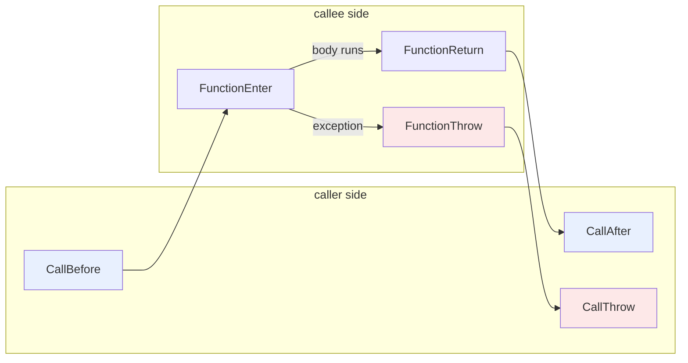
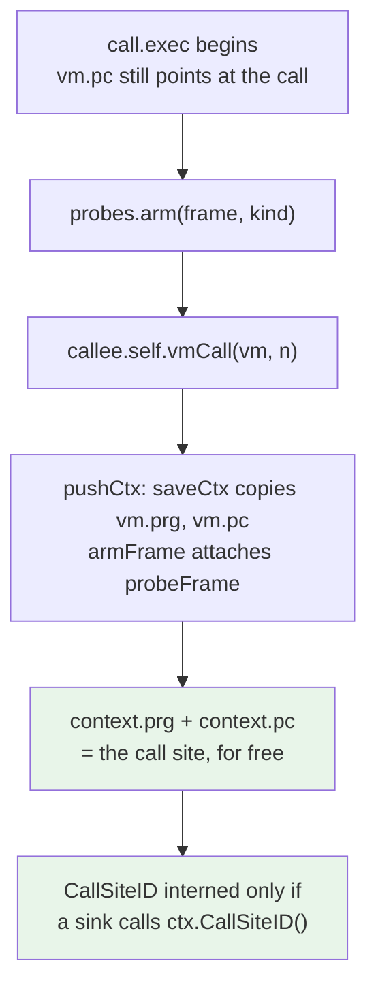
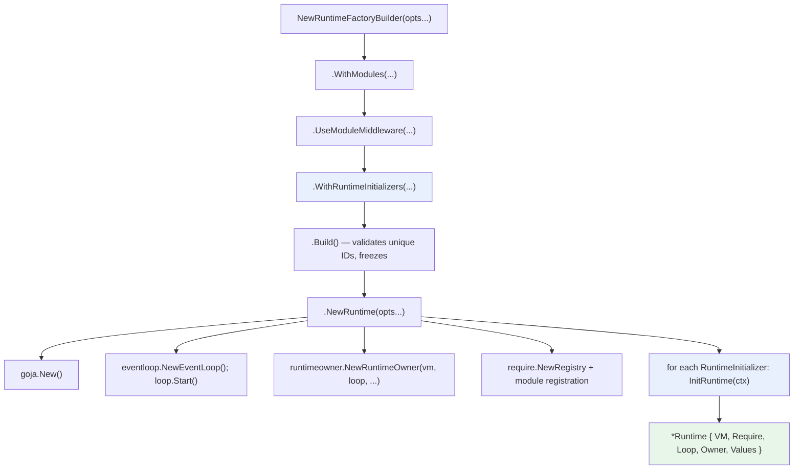
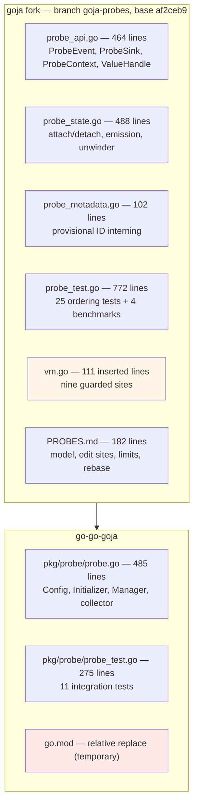

# GOJA-069: Semantic Probes for a JavaScript Interpreter

This report documents the design and implementation of a read-only instrumentation layer inside goja, the JavaScript interpreter written in Go that `go-go-goja` embeds. The layer emits events at JavaScript call-frame boundaries — a function being called, entered, returning, throwing, a constructor completing, a Go-implemented function being invoked — with the ordering guarantees that make those events usable as evidence about what a program did.

The report is organized around the technical decisions rather than the chronology. Each section states a problem the interpreter poses, shows the code that poses it, and explains the resolution. Three of those resolutions contradict the design document written immediately before implementation began, and those contradictions are the most instructive part of the work: they are cases where reading the VM carefully was not sufficient, and only running code revealed the constraint.

> [!summary]
> 1. **Source rewriting cannot instrument a JavaScript interpreter.** Six distinct paths reach or leave a callee in goja, and a `try`/`finally` wrapper around function bodies sees only one of them. The instrumentation must live in the VM.
> 2. **The hard problem is correlation, not emission.** For an interpreted callee, `vmCall` switches VM context and returns; the caller-side completion event fires an arbitrary number of instructions later, in a different function's `exec`. The correlation must survive recursion, multi-frame unwinding, and native panics.
> 3. **The disabled path is the design constraint.** A runtime with no probes attached must take the original upstream code. Achieving this required deriving call-site identity from state the VM already carries, rather than computing it eagerly.
> 4. **The fork is not yet shippable.** It is referenced by a relative `replace` directive that resolves only inside one workspace layout. Publishing it is the blocking follow-up.

## 1. What an interpreter does not tell you

A host application that embeds goja can observe a script's inputs and its final output. Between those two points the interpreter is opaque. There is no supported way to ask how many times a particular function was called, whether a value ever violated an invariant partway through a transaction, which call site produced a thrown exception, or how execution time distributes across the functions in a program.

The available workarounds are all unsatisfying. Editing the JavaScript itself means the instrumented program is not the program under study. Attaching a debugger requires a human. Wrapping every host-provided function captures only the boundary, not the interior.

The goal of GOJA-069 is a mechanism that attaches to *semantic* points in execution — points defined by what JavaScript means, not by how goja happens to implement it — and delivers structured events describing what occurred at each. The eventual system runs restricted, verified programs at those points. This milestone builds the event layer underneath, because an event layer that reports the wrong thing makes every analysis built on top of it wrong in a way no amount of verification can detect.

The sequencing constraint is stated in the originating design conversation, and it governs the entire scope decision:

> Reversing that order risks building a sound verifier for an unsound event model.

A verifier proves properties of the probe. It cannot prove that `FunctionThrow` fires at the correct point. If the events are wrong, a perfectly verified probe computes perfectly reliable facts about the wrong trace.

## 2. Why source rewriting cannot work

The cheapest imaginable implementation transforms the AST before execution: wrap every function body in `try { __enter(); ... } finally { __exit(); }`. This takes an afternoon and it is incorrect. The reason is that a JavaScript function body is not the only way to enter or leave a callee.

goja has six distinct paths, plus two construction paths:

| Path | Symbol | Behavior |
|---|---|---|
| Bytecode call | `call.exec` (`vm.go:3633`) | Resolves the callee from the value stack, dispatches `obj.self.vmCall(vm, n)` |
| Interpreted callee | `baseJsFuncObject.vmCall` (`func.go:481`) | Switches VM context and returns; the body has not run |
| Native callee | `nativeFuncObject.vmCall` (`func.go:566`) | Calls the Go function synchronously, writes the result, pops |
| Normal return | `_ret.exec` (`vm.go:3896`) | Moves the result into the caller's frame, pops the context |
| Exceptional exit | `vm.handleThrow` (`vm.go:800`) | Walks the try stack; may truncate several call frames at once |
| Go-to-JavaScript entry | `baseJsFuncObject.__call` (`func.go:397`) | Constructs a VM frame by hand and runs the interpreter itself |
| Construction | `_new.exec` (`vm.go:4804`) | Resolves a constructor closure and invokes it synchronously |
| Super call | `superCall.exec` (`vm.go:4815`) | Resolves the class, creates the instance, binds `this`, runs field initializers |

A source-level wrapper sees exactly one of these. It cannot see a host application invoking a `goja.Callable` from Go, because that never passes through a JavaScript call expression. It cannot see `require('fs').readFileSync`, because there is no JavaScript body to wrap. It cannot distinguish a frame an exception *crossed* from a frame that merely completed, because `finally` runs in both cases. It cannot see a constructor, because `new Foo()` does not go through the call instruction at all. It cannot see functions created after the transform ran, via `eval` or `new Function`.

To that list add getters, setters and Proxy traps, all of which execute JavaScript from inside what syntactically looks like a property access.

The conclusion, recorded as decision record DR-1 in the ticket, is that the production implementation must be a small fork of goja. AST rewriting remains useful only for prototyping the eventual probe language's ergonomics.

## 3. Call sites and callee lifecycles are different things

The event model rests on one distinction. A **call site** is a location in the caller: `foo(1, 2)` on line 30. A **callee lifecycle** is what happens inside `foo`. These do not correspond one-to-one:

- One call site dispatches to many callees over a program's life, through polymorphism and callbacks.
- One callee is entered from many call sites, or from none at all when Go invokes it directly.
- A call site's completion may occur long after the callee's return, or — for an asynchronous function — before the callee's body has finished.

The model therefore emits two families of events:



The two families answer different questions. A latency measurement wants `CallBefore`/`CallAfter`, because that interval is what the caller waited for, including argument marshalling. A contract check wants `FunctionEnter`/`FunctionReturn`, because it needs initialized parameters and the actual returned value regardless of who called.

Two definitional points determine where the hooks go.

**`FunctionEnter` fires after the prologue, not at the first instruction.** It is defined as occurring after parameter binding and local frame initialization, so a probe sees a stable `this`, a stable argument view, and initialized parameter bindings. In goja this means hooking the frame-establishing instructions, not the call instruction.

**`FunctionReturn` fires at the real VM return, after `finally`.** Consider:

```javascript
function f() { try { return 1 } finally { return 2 } }
```

The semantically correct return value is `2`. Hooking `_ret` — which executes after `finally` has had its opportunity to alter control flow — observes `2` without any special handling. A source-level wrapper would have to reimplement the rule.

The full event set is twelve flags, plus seven reserved for a later phase:

```go
const (
    EventCallBefore ProbeEvent = 1 << iota
    EventCallAfter
    EventCallThrow

    EventFunctionEnter
    EventFunctionReturn
    EventFunctionThrow

    EventConstructBefore
    EventConstructAfter
    EventConstructThrow

    EventHostEnter
    EventHostReturn
    EventHostThrow

    // Reserved. Nothing emits these; they exist so the model does not
    // preclude async and generator semantics later.
    EventAwaitSuspend
    EventAwaitResume
    EventAsyncResolve
    EventAsyncReject
    EventGeneratorYield
    EventGeneratorResume
    EventGeneratorComplete
)
```

A bitmask lets the VM ask one question — is anything interested in this event? — with a single AND, and the mask is recomputed only when a sink is attached or detached.

## 4. The execution substrate

goja compiles to a slice of instruction objects rather than opcode bytes:

```go
// vm.go:388
type instruction interface {
    exec(*vm)
}
```

`Program.code` is a `[]instruction` and the run loop calls `vm.prg.code[pc].exec(vm)`. Adding a hook to the call instruction means editing one small method, not decoding an opcode table.

The `Program` itself carries no identity:

```go
// compiler.go:69
type Program struct {
    code []instruction

    funcName unistring.String
    src      *file.File
    srcMap   []srcMapItem
}
```

No hash, no ID, and — critically — a `Program` is runtime-independent and shareable. The same compiled program can execute on several runtimes. This single fact rules out an entire class of implementation: instrumenting a `Program` would silently instrument every runtime using it. Attachment must be runtime-local.

The VM state relevant to instrumentation:

```go
// vm.go:359
type vm struct {
    r            *Runtime
    prg          *Program
    pc           int
    stack        valueStack
    sp, sb, args int

    stash     *stash
    callStack []context
    tryStack  []tryFrame
    // ...
    profTracker *profTracker
}
```

`prg` and `pc` describe the currently executing program and instruction. `sb` is the stack base of the current frame, pointing at the `this` slot. `callStack` holds saved caller frames. `tryStack` holds active `try` regions.

The saved-frame record and the try frame are the two structures instrumentation must understand:

```go
// vm.go:37
type context struct {
    prg       *Program
    stash     *stash
    privEnv   *privateEnv
    newTarget Value
    result    Value
    pc, sb    int
    args      int
}

// vm.go:47
type tryFrame struct {
    exception *Exception

    callStackLen, iterLen, refLen uint32   // how deep the call stack was

    sp      int32
    stash   *stash
    privEnv *privateEnv

    catchPos, finallyPos, finallyRet int32
}
```

`tryFrame.callStackLen` records how deep `vm.callStack` was when the `try` region was entered. Unwinding to that frame truncates `vm.callStack` back to that length, destroying every frame above it in one slice operation. This is why crossed frames cannot be detected by watching returns.

One further property shapes everything: **a goja `Runtime` is single-goroutine.** goja performs no internal locking. Everything touching a `*goja.Runtime` must happen on one goroutine at a time. For the probe layer this is a simplification — no locks on the hot path — with one obligation: attachment and any host-side read must be scheduled onto the owning goroutine.

## 5. The leverage point: one call instruction

The single most useful discovery in the entire investigation is that `call.exec` is the only bytecode instruction that dispatches `vmCall`:

```bash
$ grep -n "\.vmCall(" vm.go
3642:	obj.self.vmCall(vm, n)
```

Every other call form funnels through it. `_callVariadic.exec` computes the argument count and calls `call(n).exec(vm)`. `callEval` and `callEvalStrict` route through `vm.callEval`, which falls back to `call(n).exec(vm)` whenever the callee is not the genuine direct-`eval` builtin.

One edit therefore instruments every JavaScript call expression in the language.

The stack layout at the point of dispatch:

```text
   index          content
   -----          -------
   sp-n-2   --->  this
   sp-n-1   --->  callee            (an *Object)
   sp-n     --->  arg0
   ...
   sp-1     --->  arg(n-1)
   sp       --->  (next free)
```

The dispatch itself branches on callee type at runtime. goja has fourteen `vmCall` implementations — interpreted, arrow, native, three async variants, two generator variants, class, proxy, bound, templated, and two internal ones. Enumerating them in probe code would be fragile and would break whenever upstream adds another.

The alternative is to observe the *effect* of the dispatch rather than classify its target:

```go
depthBefore := len(vm.callStack)
callee.self.vmCall(vm, n)

if len(vm.callStack) > depthBefore {
    // Interpreted: pushed a frame, has not run yet.
    // Completion is deferred.
    return
}
// Completed synchronously: host function, Proxy apply,
// or an async/generator invocation that returned its promise
// or generator object.
```

An interpreted callee's `vmCall` pushes a context and returns without running the body. A native callee's `vmCall` pushes, runs the Go function, and pops. The depth comparison distinguishes them, covers all fourteen implementations, and continues to work for implementations that do not yet exist.

## 6. The correlation problem

For an interpreted callee, `vmCall` returns to the run loop immediately:

```go
// func.go:481
func (f *baseJsFuncObject) vmCall(vm *vm, n int) {
    vm.pushCtx()
    vm.args = n
    vm.prg = f.prg
    vm.stash = f.stash
    vm.privEnv = f.privEnv
    vm.pc = 0
    vm.stack[vm.sp-n-1], vm.stack[vm.sp-n-2] = vm.stack[vm.sp-n-2], vm.stack[vm.sp-n-1]
}
```

The function saves the caller's context, points the VM at the callee's program, rearranges two stack slots, and returns. The callee's body has not executed. Control goes back to the run loop, which begins executing the callee's instructions.

The caller-side completion event therefore fires an arbitrary number of instructions later, from `_ret.exec` or from `handleThrow`, in a different function's `exec` method. It must be matched to the correct `CallBefore`. Under recursion, where twenty frames of the same function are live simultaneously, "correct" is not obvious.

The design document proposed carrying the correlation inside `context`, so that it rides on the structure whose lifetime is already exactly right:

```go
type context struct {
    // ... existing fields ...

    probeFrame ProbeFrameID
    probeKind  CallKind
}
```

The alternative — a parallel `[]probeFrame` stack alongside `vm.callStack` — requires mirroring every truncation site perfectly, forever, including sites added by future upstream commits. Riding on `callStack` makes unwind correctness structural rather than vigilant: `handleThrow`'s slice truncation cleans up probe state for free.

### 6.1 Arm before dispatch, not after

The design document's version of the write was placed after the dispatch:

```go
frame := p.newFrame()
deliverCallBefore(...)

callee.self.vmCall(vm, n)

if len(vm.callStack) > depthBefore {
    ctx := &vm.callStack[len(vm.callStack)-1]
    ctx.probeFrame = frame          // <-- unreachable when vmCall panics
    ctx.callSite = site
    return
}
```

This is wrong, and the test suite found it immediately:

```text
--- FAIL: TestProbeNativeThrow
     got:  CallBefore -, HostEnter -, HostThrow -
    want:  CallBefore -, HostEnter -, HostThrow -, CallThrow -
```

A native function throws by panicking inside `f.f(...)`. Control never returns to the line that writes the correlation. The frame is on the stack when the unwinder walks it, but it carries no `probeFrame`, so no `CallThrow` is emitted for it.

The correct structure inverts the order. The pending correlation is stashed in `probeState` immediately before the dispatch, and `pushCtx` — which every dispatch path reaches — consumes it:

```go
// vm.go, in pushCtx
vm.callStack = append(vm.callStack, context{})
ctx := &vm.callStack[len(vm.callStack)-1]
vm.saveCtx(ctx)
if vm.probes != nil {
    vm.probes.armFrame(ctx)
}
```

```go
// probe_state.go
func (p *probeState) arm(frame ProbeFrameID, kind CallKind) {
    p.pendFrame, p.pendKind, p.pendArmed = frame, kind, true
}

func (p *probeState) armFrame(ctx *context) {
    if !p.pendArmed {
        return
    }
    ctx.probeFrame, ctx.probeKind = p.pendFrame, p.pendKind
    p.pendArmed = false
}
```

The correlation is on the stack before any panic can occur. Because interpreted, native, Proxy-apply, async and generator dispatch all reach `pushCtx` first, one mechanism covers all of them.

There is a symmetric hazard: a callee that panics *before* pushing a frame — a class constructor invoked without `new` panics in `classFuncObject.vmCall` — would leave the pending correlation armed, and it would attach to an unrelated later frame. `handleThrow` therefore disarms before doing anything else:

```go
func (vm *vm) handleThrow(arg interface{}) *Exception {
    if vm.probes != nil {
        vm.probes.disarm()
    }
    ex := vm.exceptionFromValue(arg)
    // ...
```

### 6.2 The context fields are not VM state

The design document warned at length that `saveCtx` and `restoreCtx` are hand-written mirror assignments, and that adding a `context` field to one and not the other produces corruption visible only under recursion. That warning is correct in general and wrong for these particular fields.

`saveCtx` copies from `vm` to the saved frame; `restoreCtx` copies back. There is no `vm.probeFrame`. The probe fields describe *the call that created the frame above this one*, which is not VM state and has nothing to mirror. They are written directly by `pushCtx` and cleared by `popCtx`. Adding them to `saveCtx`/`restoreCtx` would be meaningless at best.

### 6.3 The completion, on the way out

```go
// vm.go:3896
func (_ret) exec(vm *vm) {
    if vm.probes.enabled(EventFunctionReturn) {
        // Read the result before it moves. `finally` has already had its
        // chance to alter control flow, so this is the semantically
        // correct return value.
        vm.probes.functionReturn(vm, vm.stack[vm.sp-1])
    }

    vm.stack[vm.sb-1] = vm.stack[vm.sp-1]
    vm.sp = vm.sb

    var frame ProbeFrameID
    var kind CallKind
    var sitePrg *Program
    var sitePc int
    if vm.probes != nil && len(vm.callStack) > 0 {
        // popCtx zeroes the frame, so read the correlation first.
        top := &vm.callStack[len(vm.callStack)-1]
        frame, kind, sitePrg, sitePc = top.probeFrame, top.probeKind, top.prg, top.pc
    }

    vm.popCtx()
    vm.pc++

    // After popCtx: the caller's frame is active, so the event is
    // attributed to the call site rather than to the callee.
    if frame != 0 && vm.probes.enabled(EventCallAfter) {
        vm.probes.callAfter(vm, frame, kind, sitePrg, sitePc)
    }
}
```

Three orderings are load-bearing here, and each corresponds to a distinct correctness property:

- The result is read before it is moved into the caller's slot, so `FunctionReturn` carries the value the function actually produced.
- The correlation is read before `popCtx`, which zeroes the frame.
- `FunctionReturn` is emitted before `popCtx` and `CallAfter` after it, so each event's `Depth`, `ProgramID` and `FunctionID` describe the frame it belongs to.

## 7. Unwinding: the only observable moment

Exception handling is where the instrumentation earns its existence, and it is concentrated in a single loop:

```go
// vm.go:800
func (vm *vm) handleThrow(arg interface{}) *Exception {
    ex := vm.exceptionFromValue(arg)
    for len(vm.tryStack) > 0 {
        tf := &vm.tryStack[len(vm.tryStack)-1]
        if tf.catchPos == -1 && tf.finallyPos == -1 || ex == nil && tf.catchPos != tryPanicMarker {
            tf.exception = nil
            vm.popTryFrame()
            continue
        }
        if int(tf.callStackLen) < len(vm.callStack) {          // FRAMES CROSSED
            ctx := &vm.callStack[tf.callStackLen]
            vm.prg, vm.newTarget, vm.result, vm.pc, vm.sb, vm.args =
                ctx.prg, ctx.newTarget, ctx.result, ctx.pc, ctx.sb, ctx.args
            vm.callStack = vm.callStack[:tf.callStackLen]      // ...AND DESTROYED
        }
        // ... restore sp, stash, privEnv, iter/ref stacks ...

        if tf.catchPos >= 0 {
            vm.push(ex.val)
            vm.pc = int(tf.catchPos)
            tf.catchPos = -1
            return nil
        }
        // ... finally handling ...
    }
    // ...
}
```

The interval `vm.callStack[tf.callStackLen:len(vm.callStack)]` is exactly the set of frames the exception is about to destroy, and the two marked lines are the only moment at which they are still observable. The probe hook goes immediately before the truncation.

Two rules follow directly from the code, and both are subtle enough that they became the first tests written.

**When `tf.callStackLen == len(vm.callStack)`, emit nothing.** No frame is crossed; the exception is being caught inside the function that threw it. The guard is the strict inequality upstream already has, and the hook goes inside it. Emitting a `FunctionThrow` here is the most natural bug to write:

```javascript
function f() { try { throw "x" } catch (e) { return 1 } }
f();
```

produces `CallBefore, FunctionEnter, FunctionReturn, CallAfter` and no throw events at all, because from the caller's perspective nothing exceptional happened.

**The frame at index `target` survives.** It holds the `catch`. It receives a `CallThrow` — its call to the frame above it did throw — but not a `FunctionThrow`, because it did not itself exit. The loop encodes this as an asymmetry between two emission conditions:

```go
func (p *probeState) unwind(vm *vm, target int, ex *Exception) {
    // The live, innermost frame is described by vm.prg/vm.pc and is not
    // in callStack, so report it first.
    p.emitThrow(vm, vm.prg, vm.pc, uint32(len(vm.callStack)), vm.prg == nil, exVal)

    for i := len(vm.callStack) - 1; i >= target && i >= 0; i-- {
        ctx := &vm.callStack[i]
        if ctx.probeFrame != 0 && p.enabled(EventCallThrow|EventConstructThrow) {
            // ... emit CallThrow or ConstructThrow ...
        }
        if i > target && ctx.prg != nil {
            p.emitThrow(vm, ctx.prg, ctx.pc, uint32(i), false, exVal)
        }
    }
}
```

The resulting trace for a three-deep unwind:

```javascript
function c() { throw "x" }
function b() { return c() }
function a() { try { return b() } catch (e) { return 0 } }
a();
```

```text
CallBefore    -          <- top-level calls a
  FunctionEnter a
  CallBefore  a          <- a calls b
    FunctionEnter b
    CallBefore b         <- b calls c
      FunctionEnter c
      FunctionThrow c    <- innermost first
    CallThrow  b         <- b's call to c threw
    FunctionThrow b      <- b itself exits
  CallThrow    a         <- a's call to b threw
  FunctionReturn a       <- a survives and returns 0
CallAfter     -
```

No `FunctionThrow` for `a`. No throw events for the top-level program frame.

### 7.1 The nil-program frame

The construct-throw test found a defect that reading the source had not:

```text
--- FAIL: TestProbeConstructorThrows
     got: ConstructBefore -, FunctionEnter Foo, FunctionThrow Foo, HostThrow -, ConstructThrow -
    want: ConstructBefore -, FunctionEnter Foo, FunctionThrow Foo, ConstructThrow -
```

The phantom `HostThrow` comes from a saved `context` whose `prg` is `nil`. Such a context is not a JavaScript frame. It is one of goja's boundary markers — the `pc: -2` sentinel that `__call` pushes so the run loop halts after `ret`:

```go
// func.go:397, inside __call
if vm.prg != nil {
    vm.pushCtx()
    vm.callStack = append(vm.callStack, context{pc: -2}) // halt sentinel
    needPop = true
}
```

The interpretation of `nil` differs by location, and conflating the two is what produced the bug:

| Location | `prg == nil` means |
|---|---|
| `vm.prg` (live) | The frame currently executing is a host frame |
| `context.prg` (saved) | A boundary marker, not a JavaScript frame |

The unwinder now skips saved contexts with a nil program. A host frame that is genuinely executing when the throw occurs is still reported, because that case is detected from `vm.prg` in the live-frame check before the loop.

This trades correctness for a case that does not exist against silence for one that might: a host frame crossed *indirectly*, where native code calls JavaScript that then throws, is not reported. That trade is flagged in the ticket for review.

## 8. The disabled path as a design constraint

The overwhelming majority of goja runtimes in production will never attach a probe. The cost of the mechanism to those runtimes must be indistinguishable from zero.

goja itself demonstrates the right technique. Its sampling profiler does not test a flag per instruction; `vm.run()` selects an entirely different loop once:

```go
// vm.go:613
func (vm *vm) run() {
    if vm.profTracker != nil && !vm.runWithProfiler() {
        return
    }
    // ... the fast loop, untaxed ...
}
```

For call-level events the equivalent is one predictable branch at each semantic boundary. Call boundaries are rare relative to instructions, and the branch predicts perfectly when nothing is attached. Instruction-level events, if they are ever added, must follow the profiler's pattern rather than adding a check to the hot loop.

The first implementation nonetheless regressed. The benchmark comparing an attached-but-idle sink against no sink at all showed roughly 15% overhead on `fib(18)`, with two extra allocations per operation. The cause was in `invokeCall`:

```go
func (p *probeState) invokeCall(vm *vm, callee *Object, n int) {
    site := p.meta.callSiteID(vm.prg, vm.pc)   // map insert, every call
    frame := p.newFrame()
    // ... only now check whether anyone wants the event
```

Interning a `CallSiteID` means a map lookup on a `{*Program, int}` key. At roughly 8,000 calls per benchmark iteration, that is the entire regression, and it happened before checking whether any sink had asked for site identity.

The resolution came from an observation about when `saveCtx` runs. `pushCtx` is called from inside the callee's `vmCall`, which is called from inside `call.exec` — and `call.exec` has not incremented `vm.pc` yet. So the saved `context.pc` *is* the pc of the call instruction, and `context.prg` is the calling program. The pair is already on the frame:



Two changes followed. The stored `callSite` field was deleted from `context`, and `CallSiteID` became a method that interns on demand:

```go
// probe_api.go
func (c *ProbeContext) CallSiteID() CallSiteID {
    if c.sitePrg == nil || c.rt == nil || c.rt.vm.probes == nil {
        return CallSiteExternal
    }
    return c.rt.vm.probes.meta.callSiteID(c.sitePrg, c.sitePc)
}
```

Second, `call.exec` now tests a boolean precomputed from the mask at attach time, so a sink selecting no call-path events leaves the upstream dispatch byte-for-byte untouched:

```go
const callPathEvents = EventCallBefore | EventCallAfter | EventCallThrow |
    EventConstructThrow | EventHostEnter | EventHostReturn | EventHostThrow

// vm.go:3633
func (numargs call) exec(vm *vm) {
    n := int(numargs)
    v := vm.stack[vm.sp-n-1]
    obj := vm.toCallee(v)
    if vm.probes != nil && vm.probes.callPath {
        vm.probes.invokeCall(vm, obj, n)
        return
    }
    obj.self.vmCall(vm, n)   // untouched fast path
}
```

`CallThrow` and `ConstructThrow` are in the call-path set even though they fire from the unwinder, because the correlation they consume is established at call time.

The measured result on `fib(18)`, 50 iterations, three runs:

| Benchmark | ns/op range | allocs/op |
|---|---|---|
| No sink attached | 2.55M – 2.99M | 47 |
| Sink attached, mask 0 | 2.50M – 2.83M | 49 |
| All events, sink does nothing | 3.80M – 4.04M | 57 |
| `FunctionEnter` only, counting | 2.25M – 2.66M | 57 |

The attached-but-idle case is inside run-to-run variance of the disabled case. The two extra allocations are the state object and its first map.

The same principle governs everything reachable from a `ProbeContext`. Function names, source positions and call-site IDs are methods rather than fields, because each costs something — a string conversion, a source-map walk, a map insert — and most sinks want none of them per event.

## 9. The value boundary

A probe must never receive `*vm`, `*stash`, or an unrestricted `goja.Value`. The reason is not encapsulation but re-entrancy: reading a property through the ordinary JavaScript path can execute a getter or a Proxy trap, which runs JavaScript, which can mutate state, throw, or fire the same probe again.

The layer therefore exposes borrowed handles with a deliberately narrow accessor set:

```go
type ValueHandle struct {
    v  Value
    rt *Runtime
}

func (h ValueHandle) Available() bool
func (h ValueHandle) Kind() ValueKind
func (h ValueHandle) Int64() (int64, bool)
func (h ValueHandle) Float64() (float64, bool)
func (h ValueHandle) Bool() (bool, bool)
func (h ValueHandle) Str() (string, bool)
func (h ValueHandle) ObjectID() (ObjectID, bool)
func (h ValueHandle) SameValue(other ValueHandle) bool
```

There is no `Export()`, no `ToString()`, and no property access. `Str()` returns `false` for an object rather than invoking `toString`. Not one of these methods can execute JavaScript.

`Available()` exists for a specific language rule. Inside a derived constructor, `this` does not exist until `super()` returns:

```javascript
class A { constructor() { this.a = 1 } }
class B extends A { constructor() { super(); this.b = 2 } }
new B();
```

The observed sequence of `this` availability:

```text
ConstructBefore/new       this=unavailable
  FunctionEnter/external  this=unavailable   <- B's body, before super()
  ConstructBefore/super   this=unavailable
    FunctionEnter/external  this=object      <- A's body; super() created it
    FunctionReturn/external this=object
  ConstructAfter/super    this=unavailable
  FunctionReturn/external this=object        <- back in B, now bound
ConstructAfter/new        this=unavailable
```

A probe that dereferenced the `this` slot at `FunctionEnter` for `B` would read an uninitialized reference. `Kind()` returns `KindUnavailable` instead.

Handles are valid only for the duration of the callback that produced them. The VM reuses a single `ProbeContext` across events, so retaining the pointer is a defect. This is not merely a lifetime concern: a map that stores raw `goja.Value`s pins the JavaScript object graph for as long as the map lives.

## 10. Runtime scoping

Section 4 established that a `Program` is shareable across runtimes. The consequence is that attachment must be runtime-local, and the consequence of *that* is where the host integration plugs in.

`go-go-goja` composes runtimes through a builder that freezes into an immutable factory:



`RuntimeInitializer` is the correct extension point on four counts. It runs per runtime. It receives the `*goja.Runtime` to attach to. It receives `Values`, the runtime-scoped map where the manager is published for the host to retrieve. And an initializer that returns an error aborts runtime construction cleanly, closing the half-built runtime.

```go
func (i *initializer) InitRuntime(ctx *engine.RuntimeInitializationContext) error {
    if ctx == nil || ctx.VM == nil {
        return errors.New("probe: runtime context or VM is nil")
    }
    if i.cfg.AllowMutation {
        return errors.New("probe: intervention mode is not implemented; " +
            "results from a mutated run are not evidence about the original program")
    }

    mgr := NewManager(ctx.Owner, i.cfg)
    if err := ctx.VM.AttachProbes(mgr.Sink()); err != nil {
        return errors.Wrap(err, "probe: attach")
    }
    ctx.SetValue(ValuesKey, mgr)
    return nil
}
```

The scoping property is asserted directly rather than assumed. `TestProbesAreRuntimeScoped` compiles one `goja.Program`, runs it on runtime A, and requires runtime B's snapshot to be empty:

```go
prg := goja.MustCompile("shared.js",
    `function shared(){ return 1 }; shared(); shared();`, false)
// run prg on rtA only
assert.Equal(t, uint64(2), statsFor(t, statsA, "shared").Entries)
assert.Empty(t, statsB.Functions, "runtime B must not see runtime A's events")
```

## 11. The host control plane

The collector implements `goja.ProbeSink` and runs only on the runtime's owning goroutine, synchronously, inside the interpreter. It holds no mutex. Readers reach it through the manager, which schedules onto the same goroutine:

```go
func (m *Manager) Snapshot(ctx context.Context) (Stats, error) {
    if m.owner == nil {
        return m.col.snapshot(), nil
    }
    v, err := m.owner.Call(ctx, "probe.snapshot",
        func(context.Context, *goja.Runtime) (any, error) {
            return m.col.snapshot(), nil
        })
    // ...
}
```

`Snapshot` from an HTTP handler goroutine is therefore safe, and never observes a half-written event.

### 11.1 Timing that does not leak

Per-function timing pushes a mark at `FunctionEnter` and credits the duration at exit. The naive implementation assumes one-in-one-out. That assumption is false, and the reason is instructive.

Invoking a generator function does not run its body to completion — but goja's `generatorObject.init` (`func.go:829`) *does* run the prologue, so that parameters are bound, and then suspends:

```go
func (g *generatorObject) init(vmCall func(*vm, int), nArgs int) {
    g.baseObject.init()
    vm := g.val.runtime.vm
    g.gen.vm = vm

    g.gen.enter()
    vmCall(vm, nArgs)      // <- the prologue runs, FunctionEnter fires

    _, _, ex := g.gen.step()
    // ...
    g.state = genStateSuspendedStart
}
```

The result is a `FunctionEnter` with no matching return. A push/pop stack would grow without bound in any script using generators, and would mis-attribute durations after the first one.

The collector unwinds by depth instead:

```go
func (c *collector) closeFrame(e *goja.ProbeContext) {
    if !c.metrics {
        return
    }
    now := time.Now()
    for len(c.frames) > 0 {
        mark := c.frames[len(c.frames)-1]
        if mark.depth < e.Depth {
            return
        }
        c.frames = c.frames[:len(c.frames)-1]
        if mark.depth == e.Depth && mark.fn == e.FunctionID {
            if st, ok := c.funcs[mark.fn]; ok {
                d := now.Sub(mark.start).Nanoseconds()
                st.stats.TotalNanos += d
                if d > st.stats.MaxNanos {
                    st.stats.MaxNanos = d
                }
            }
            return
        }
    }
}
```

A suspended frame is discarded the next time its depth is reused. The stack stays bounded and durations stay attributed correctly.

The observable consequence is documented in the type: `Entries` may exceed `Returns + Throws`.

### 11.2 Truncation must be visible

The trace ring buffer is bounded. A bounded buffer that silently overwrites its oldest entries reads, to a caller, as though it captured the whole run. `Stats.Dropped` counts overwritten events, and the test asserts both the bound and a non-zero drop count:

```go
assert.Len(t, stats.Trace, 4, "trace must be bounded by TraceCapacity")
assert.Positive(t, stats.Dropped,
    "overwritten events must be reported, not silently lost")
```

A caller can distinguish a complete trace from a suffix.

## 12. What the tests found

The event-ordering matrix is twenty-five cases in the fork, plus eleven integration tests in `pkg/probe`. Each fork test asserts an exact event sequence rather than membership, because ordering is the property under test.

The failures split into two categories, and the distinction matters more than either individually.

**Two were implementation defects**, both described above: the missing `CallThrow` for native throws (§6.1) and the phantom `HostThrow` from nil-program frames (§7.1). Neither was visible from reading the source. Both required a test that asserted a complete sequence.

**Four were incorrect expectations.** These are worth recording because they reveal properties of JavaScript that the test author had not accounted for:

- `throw new Error("x")` **constructs an object**. The trace legitimately contains `ConstructBefore` and `ConstructAfter` for the `Error` before any throw event. The unwinding tests were rewritten to throw primitives (`throw "x"`) so that each assertion is about exactly one thing.
- `new Proxy(f, {...})` is itself a construction, so a proxy test's trace opens with a construct pair.
- Invoking an async function runs its body synchronously to the first `await` (`asyncRunner.start`, `func.go:734`). An async function with no `await` produces a complete `FunctionEnter → FunctionReturn` pair nested inside its `CallBefore`/`CallAfter`. The design document had claimed call-site events only.
- Invoking a generator function produces a `FunctionEnter` with no return, for the reason in §11.1. The design document had claimed the body is not entered at all.

The last two are behavioral facts about goja that no amount of design-document reasoning would have produced. They are now pinned by tests named for the behavior they assert — `TestProbeAsyncInvocationRunsBodyUntilFirstAwait`, `TestProbeGeneratorInvocationSuspendsAfterPrologue` — so that a future change to either is deliberate.

A third fact emerged from reading the compiler rather than from a failure. Exactly one of `enterFunc`, `enterFunc1` or `enterFuncStashless` is emitted per function (`compiler_expr.go:1716-1780`). `enterFuncBody` is an *additional* body-scope instruction; hooking it as well would double-emit `FunctionEnter`. The correct rule is to hook only the three that establish `vm.sb`.

## 13. The fork is not yet shippable

Adding `./goja` to `go.work` makes the fork resolve for local development. It does not make it resolve anywhere else, and the repository's own tooling made that concrete: the lint target runs `GOWORK=off go vet ./...`, and the pre-commit hook rejected the integration commit outright:

```text
GOWORK=off go vet ... ./pkg/...
pkg/probe/probe.go:62:14: undefined: goja.ProbeEvent
pkg/probe/probe.go:92:28: undefined: goja.EventFunctionEnter
```

The stopgap is a relative replace directive, committed with an explicit marker:

```text
// TODO(GOJA-069): this relative replace only resolves inside the
// go-go-goja-instrumentation workspace layout. Before this branch merges, the
// fork must be published (e.g. github.com/go-go-golems/goja) and this replace
// repointed at the published module path and version.
replace github.com/dop251/goja => ../goja
```

This is the single blocking item before the branch can merge. It is recorded in four places — the `go.mod` comment, the ticket index status block, the implementation guide, and a docmgr task — because a `TODO` in one file is easy to lose.

## 14. Fork hygiene

Maintaining a fork is DR-1's ongoing cost, and the mitigation is structural rather than procedural.

Everything the layer owns lives in new files. `vm.go` is the only upstream file modified, and the diff is 111 insertions with zero deletions across nine sites:

| Site | Change |
|---|---|
| `type vm struct` | One field: `probes *probeState` |
| `type context struct` | Two fields: `probeFrame`, `probeKind` |
| `pushCtx` | Transfers the pending correlation onto the new frame |
| `handleThrow` | Disarms a stale correlation; emits throw-side events before truncation |
| `call.exec` | Routes through `invokeCall` when call-path events are selected |
| `enterFunc.exec` | One line: `vm.finishFunctionEnter()` |
| `enterFunc1.exec` | One line: `vm.finishFunctionEnter()` |
| `enterFuncStashless.exec` | One line: `vm.finishFunctionEnter()` |
| `_ret.exec` | `FunctionReturn` before the move, `CallAfter` after `popCtx` |
| `_new.exec` | Construct events |
| `superCall.exec` | Construct events with `CallKindSuper` |

Each is a guarded insertion that falls through to the original code when `vm.probes` is nil. A rebase against upstream conflicts in exactly one file at predictable places, and each resolution is mechanical.

`finishFunctionEnter` is a method on `*vm` rather than on `*probeState` specifically so that the three prologue call sites are one identical line each. That is a rebase-cost decision, not a style one.

`vm.run()` is deliberately untouched.

## 15. What exists and what does not



Implemented: all twelve events in the orders specified; correlation surviving recursion, multi-frame unwinding, native panics and interruption; provisional program, function, call-site and object IDs, all interned lazily; the `RuntimeInitializer` and per-runtime control plane with snapshots, reset, per-function metrics and a bounded trace buffer. Both full test suites pass, and `make lint` reports zero issues including the `GOWORK=off` stage.

Deliberately not implemented, with reasons:

- **The verified probe bytecode VM and its verifier.** This is the headline feature and it depends on correct event semantics. Building it first would risk a sound verifier over an unsound event model.
- **The enforcement tier.** goja already has the right primitive — `uncatchableException` (`runtime.go:306`), which JavaScript `try`/`catch` cannot intercept and which surfaces to a Go caller as an error. A `ProbeViolationError` over that mechanism is designed but not built. `Config.AllowEnforce` is accepted and recorded so host configuration does not change when it lands.
- **Intervention.** Rewriting arguments, results or exceptions is rejected at initialization rather than silently ignored, because a run with intervention active is not evidence about the unmodified program.
- **Property, allocation, branch and instruction events.** Orders of magnitude higher volume, and semantically harder: a property read can run a getter, which re-enters JavaScript, which fires probes.
- **Real Phase 2 metadata.** The current IDs are runtime-local and stable only within a run. They must not be persisted.

Known gaps in what *is* implemented, each pinned by a test asserting current behavior:

- Class constructor bodies compile to a `Program` with an empty `funcName`, so they have no name. Ordering is correct; only the name is missing.
- Constructor bodies carry no call-site correlation. `new X()` reaches the body through Go glue that pushes its own frames, so the body's `FunctionEnter` reports `CallKindExternal` with `FrameID == 0`. The surrounding construct pair is correlated correctly.
- Proxy `apply` traps are reported as host calls and not distinguished from native Go functions.
- `FunctionEnter` may not expose arguments. A prologue that copies arguments into the lexical stash — because they are captured by a closure, used by `eval`, or referenced by a forward reference — leaves them off the value stack. `ArgCount` remains correct, and `CallBefore` always has them.

## 16. Working rules extracted from this project

> [!important]
> **Prove the event model before building anything on top of it.** A verifier proves properties of the probe, never of the event mapping. If `FunctionThrow` fires in the wrong place, a verified monitor produces reliable facts about the wrong trace.

> [!important]
> **Design the disabled path first.** The cost to runtimes that never use the feature is the constraint that shapes the API. Anything computed before the mask test is paid by everyone.

> [!important]
> **Observe the effect, not the type.** The call-stack depth comparison distinguishes synchronous from deferred dispatch across all fourteen `vmCall` implementations, including ones that do not exist yet. Enumerating types would need updating forever.

> [!important]
> **Attach state to structures whose lifetime is already correct.** Riding on `callStack` means the unwinder's slice truncation cleans up probe state for free. A parallel stack would require mirroring every truncation site, forever.

> [!important]
> **Write state before the operation that can panic, not after.** goja uses panics for control flow. Any bookkeeping placed after a call that can panic is bookkeeping that will sometimes not happen.

> [!important]
> **A bounded buffer that silently overwrites is a correctness bug.** Count what was dropped. A caller must be able to distinguish a complete trace from a suffix.

> [!important]
> **Assert exact sequences, not membership.** Every implementation defect found in this work was an *extra* or *missing* event in an otherwise plausible trace. A "contains" assertion would have passed.

## 17. Source map

| Artifact | Location |
|---|---|
| Fork | `<workspace>/goja`, branch `goja-probes`, base `af2ceb9` |
| Fork documentation | `goja/PROBES.md` |
| Probe vocabulary | `goja/probe_api.go` |
| Emission and unwinder | `goja/probe_state.go` |
| Provisional IDs | `goja/probe_metadata.go` |
| Ordering tests, benchmarks | `goja/probe_test.go` |
| Upstream edits | `goja/vm.go` |
| Host integration | `go-go-goja/pkg/probe/probe.go` |
| Integration tests | `go-go-goja/pkg/probe/probe_test.go` |
| Ticket workspace | `go-go-goja/ttmp/2026/07/24/GOJA-069--javascript-interpreter-instrumentation/` |
| Implementation guide | `.../design/02-intern-implementation-guide.md` |
| Implementation diary | `.../reference/02-implementation-diary.md` |

Commits:

- `c669150` (fork) — the read-only semantic-probe layer
- `cdea567` — the intern implementation guide and diary
- `7cbbc8c` — `pkg/probe` `RuntimeInitializer`
- `0c0de0f` — implementation record and guide corrections

Validation:

```bash
cd <workspace>/goja
go test ./...                                              # upstream suite
go test -run TestProbe -count=1 -v .                        # 25 ordering tests
go test -run '^$' -bench BenchmarkProbes -benchtime 50x -count=3 .

cd <workspace>/go-go-goja
go test ./... -count=1
make lint                                                   # includes GOWORK=off
```

## 18. Open questions

- **Should the unwinder report host frames crossed indirectly?** The current rule reports only a host frame that is executing when the throw occurs. A native function that calls JavaScript that then throws produces no `HostThrow` for the native frame. Distinguishing a genuine native frame from a boundary marker requires more than the `prg == nil` test.
- **Can constructor bodies be correlated?** The arming mechanism cannot currently distinguish the glue frames `new X()` pushes from the constructor body's own frame. Recognizing them would require either a marker on the glue frames or a different arming discipline.
- **Should `reentrant` fail loudly rather than dropping events?** If a sink violates its contract and causes JavaScript to run, nested events are silently discarded. That is the safe default for trusted Go sinks. Once probes are third-party bytecode, the verifier should make re-entrancy impossible rather than merely survivable.
- **Should `Config.AllowEnforce` be an error until the enforcement tier exists?** It is currently accepted and recorded so host configuration need not change later. The alternative — refusing it outright — is a one-line change and arguably more honest.
- **Does `TotalNanos` need a self-time counterpart?** Timing currently includes nested calls, which is the right default for latency but is not self time, and the field name does not say so.

## 19. Near-term next steps

- Publish the fork and repoint the `replace` directive. This blocks everything downstream.
- Add native-heavy, throw-heavy and deep-recursion benchmarks; the current four cover the disabled path and ordinary calls only.
- Implement the enforcement tier over `uncatchableException`, with a test asserting that script-level `try`/`catch` cannot intercept a violation.
- Produce real Phase 2 metadata: program fingerprints, function and binding IDs from the compiler, and attachment-selector resolution. This also fixes the missing class-constructor names.
- Add a `goja-repl` surface — `--probe`, `probe list`, `probe maps` — as sketched in the originating design conversation.

## Related notes

- [[PROJECT REPORT - Seeding go-go-datadrop and go-go-goja Instrumentation from ChatGPT Conversations]] — how the GOJA-069 ticket and its source material were created, one step before this work

## Project working rule

> [!important]
> The event mapping is part of the trusted base. Every analysis built on this layer inherits its correctness, and nothing downstream can detect an error in it. When adding an event, write the test that asserts its exact position in a complete sequence before writing the emitter.
