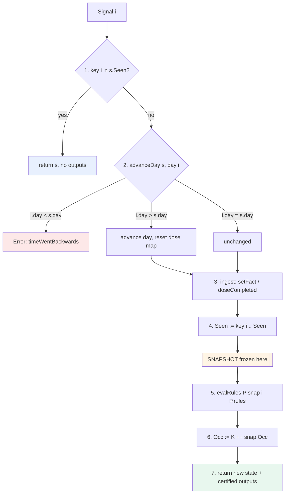
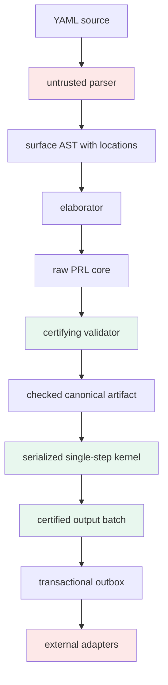
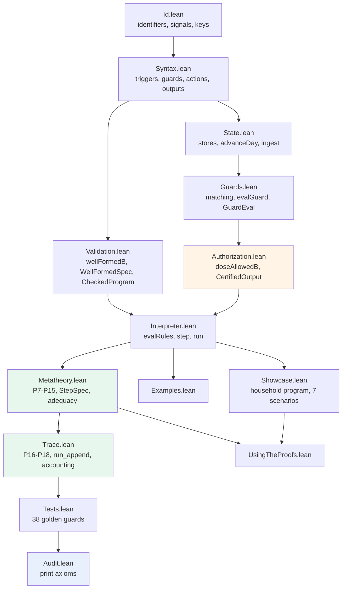

# PRL-0: A Machine-Checked Reactive Rules DSL in Lean 4

PRL-0 is a small reactive rules language with a total, deterministic interpreter written in Lean 4. A program declares pets, rules, and medication safety constraints. The interpreter consumes a stream of signals — clock ticks and external events — and for each signal returns either a defined runtime rejection or a new state plus a batch of outputs. The central property is that the interpreter cannot emit a medication task exceeding a configured daily dose limit, and that property is enforced by the type of the output value rather than by a test or a code review.

The source material is a 5,378-line book, `Designing_and_Verifying_a_Reactive_Rules_DSL_in_Lean4.md`, which derives PRL-0 from a richer pet-care YAML DSL and supplies a Lean listing in Appendix G. That listing carries an explicit disclaimer: it "was not compiled in the environment in which this edition was produced." The book states the gap between a paper proof and a kernel-checked proof term and says the gap is "explicit and testable." This project closes it. The development at `/home/manuel/code/wesen/2026-07-24--lean4-dsl/lean` builds on `leanprover/lean4:v4.32.1`, discharges all eighteen proof obligations enumerated in the book's Appendix A.18, runs 38 golden trace tests as a build step, and reports only `propext` and `Quot.sound` under axiom audit.

This report explains the system as an implementation. It follows a signal through the seven phases of the step function, examines why each ordering constraint exists and which bug it prevents, develops the proof-carrying output mechanism in detail, and then examines the failures that compiling surfaced — including a design defect in the book's own example program and a class of instance-resolution problem that makes a reflection theorem inapplicable without any error at its definition site.

> [!summary]
> - The interpreter returns `CertifiedOutput`, a record whose third field is a proof of `SafeOutput`. An over-limit dose task is not filtered out after construction; it is unconstructible, because the only constructor demands evidence the rejecting branch cannot supply.
> - Rule evaluation returns an `Evaluation` with no state field. That type, not a comment, is the claim that rules cannot write state.
> - The book's `StepRel` proves only that a function is a function. This development adds `StepSpec`, an inductive relation transcribed from the operational rules without reference to the interpreter, and proves adequacy in both directions.
> - Compiling changed the artifact. `deriving BEq` silently blocks the duplicate-detection reflection theorem; the book's example program cannot reach its own worked blocked-dose trace; and one golden test encoded a wrong expectation that the build rejected.

## 1. The problem: surface simplicity is not semantic simplicity

The source DSL has a clean product-level story. A representative rule reads:

```yaml
- id: breakfast
  for: milo
  when: { every: day, at: "07:00" }
  do:
    - task: "Feed Milo - 1 cup kibble"
```

A human reader supplies an execution model on sight: at seven in the morning, create one task. That model is not in the text. The rule does not answer which timezone determines seven o'clock, what happens on a daylight-saving transition, what identifies this particular occurrence of the task, whether a scheduler that delivers the same clock event twice produces two tasks, whether restarting the engine regenerates today's task, or whether a rule referring to a deleted pet is an error, a skip, or an invalid program.

Each of those questions has more than one defensible answer, and the answers interact. The full source language compounds the problem by adding lists of daily times, string expressions with units and rounding, reusable protocols and templates, completion-anchored recurrence, task windows and escalation ladders, profiles with activation intervals and override precedence, hard constraints, cross-rule mutation of a future occurrence, and selector specificity for tie-breaking.

Consider a medication task modified by an active post-operative profile while a boarding profile is also active, with a delayed completion changing the next recurrence and a maximum-dose constraint suppressing the result. A production implementation must fix an order:

1. elaborate the protocol
2. determine the next anchored occurrence
3. apply profiles
4. apply a pending modification
5. evaluate the guard
6. calculate the dose
7. resolve rule conflicts
8. enforce the hard constraint
9. create the task and escalation schedule

Changing that order changes behavior. A formal semantics must choose exactly one order and justify the choice. The design work is therefore not addition but subtraction: identify the smallest language that retains the semantic spine and for which every single-step behavior is deterministic, finite, replay-safe, and locally checkable.

## 2. Deriving PRL-0 by subtraction

PRL-0 retains named subjects, daily clock triggers at a typed minute of day, named event triggers, Boolean guards over facts and today's completed dose and the incoming event, four output kinds, static maximum-daily-dose constraints, replay-safe signal identity, monotone logical days with daily dose reset, an append-only occurrence audit, and a total deterministic interpreter.

It excludes the following, each for a stated reason:

| Excluded feature | Reason |
|---|---|
| General formulas with units and rounding | Requires its own typed calculus with a typing judgment and progress/preservation |
| `modify` — cross-rule mutation | Makes meaning nonlocal; multiple patches require a composition law and conflict semantics |
| Dynamic constraints | Authorization must be computable independently of rule evaluation |
| Profiles, templates, protocols | These are elaboration features; they compile into ordinary rules given an elaboration correctness theorem |
| Calendar recurrence and timezones | Requires a separately verified scheduler; the kernel consumes abstract clock signals |
| Internal event recursion | Would break structural termination of a single step |

Two of these exclusions have direct structural consequences in the Lean source. Excluding internal event recursion means every recursive definition recurses over finite syntax or a finite input list — guard evaluation over a guard tree, constraint checking over a constraint list, action authorization over an action list, rule evaluation over a rule list, trace execution over a trace. One-step termination follows structurally, with no fuel parameter and no well-founded recursion. Excluding dynamic constraints means `doseAllowedB` reads only the program and the snapshot, never the partial results of the current rule phase.

The exclusions are conclusions produced by writing the semantics down, not concessions to implementation difficulty. Each was removed because attempting to state its meaning exposed an unanswered question.

## 3. The central asymmetry: observations update state, rules propose outputs

This is the design decision from which most of the rest follows.

External signals may report that the world changed: a fact became true, a dose was completed. These update state. Rule actions may not change state; they produce proposed outputs — obligations and messages.

A task is not a claim that the real-world action occurred. `DoseTask` records that someone should give Luna 5 mg. `DoseCompleted` records that someone did. Only the second moves `doseToday`.

Four consequences fall out without further argument:

- A single step has exactly two phases: external ingestion, then pure rule evaluation.
- The rule phase sees a stable snapshot. Every rule in a step evaluates its guard against the same state.
- Source order cannot change guard truth. Reordering rules permutes outputs and nothing else.
- There is no rule-side write conflict, so PRL-0 needs no priority mechanism and `Rule` has no priority field.

The asymmetry is encoded in the type of the rule-phase result:

```lean
structure Evaluation (p : Program) where
  outputs     : List (CertifiedOutput p)
  occurrences : List OccurrenceKey
  -- note: NO state field.
```

`evalRule` cannot return a modified state because the result type provides nowhere to put one. This is a machine-checked claim rather than a documented convention. Adding a state field would require changing the type, which would break every downstream proof that depends on it.

The demonstration is visible in the running interpreter. In an ordinary day's trace, the dose task at 08:00 leaves the daily total at zero; only the later completion event moves it:

```
  clock   day 0 at 08:00
      · DOSE 5mg     [luna_morning_dose] luna prednisolone: Give Luna 5mg prednisolone with food
      day=0  luna/prednisolone=0mg  seen=3  occ=2
  event   day 0 uid 101  luna ← doseCompleted(prednisolone, 5mg)
      · (no outputs)
      day=0  luna/prednisolone=5mg  seen=4  occ=2
```

## 4. The step function and its three load-bearing orderings

The interpreter consumes one signal atomically in seven phases.



The Lean source states the phases in the same order, with the comments numbering them:

```lean
def step (cp : CheckedProgram) (s : State) (sig : Signal) :
    Except RuntimeError (StepResult cp.program) :=
  let p := cp.program
  if s.seenSignals.contains sig.key then
    .ok { snapshot := s, state := s, outputs := [] }
  else
    match advanceDay s sig.day with
    | .error err => .error err
    | .ok advanced =>
        let ingested := ingest advanced sig
        let snapshot := { ingested with seenSignals := sig.key :: ingested.seenSignals }
        let evaluated := evalRules p snapshot sig p.rules
        let finalState :=
          { snapshot with
            processedOccurrences := evaluated.occurrences ++ snapshot.processedOccurrences }
        .ok { snapshot := snapshot, state := finalState, outputs := evaluated.outputs }
```

In an imperative engine, the ordering of these phases is a property of control flow that a scheduler or a middleware layer can disturb. Here the code order is the semantics order, and no layer can intervene inside a pure function.

Three of the orderings are load-bearing. Each prevents a specific bug that a naive test suite does not catch.

**The replay check precedes the day check.** Consider a signal from yesterday that was processed successfully, after which the system advanced to today, after which the message broker redelivers it. Its key is already in `Seen`, so the step is a no-op. If the day check ran first, the interpreter would reject a harmless retry as backward time. Both cases appear in the demo:

```
scenario 6:  event day 4 uid 300 (unseen)      → ✗ REJECTED timeWentBackwards(current = 9, incoming = 4)
scenario 7:  event day 4 uid 300 (already seen) → · (no outputs), state unchanged
```

**Day advancement precedes ingestion.** If the first signal of a new day is a completed-dose event, the previous day's total must be cleared before the new dose is added. Reversed, the interpreter adds 5 mg and then erases it. A golden test covers exactly this:

```lean
#guard doseAfter [completion, .event 7 1 "luna" (.doseCompleted "prednisolone" 4)]
         "luna" "prednisolone" == .value 4
```

**The snapshot is frozen before rule evaluation.** Otherwise the output of rule *n* could change what rule *n+1* observes, and source order would become semantically significant. `evalRules_snapshot` proves that every output of a step carries the same snapshot; `evalGuard_congr` proves that guard evaluation depends on the state only through the fact and dose maps, so the ledgers and the day are invisible to guards.

## 5. Signal identity and exactly-once semantics

Replay identity differs by signal kind, and the difference is deliberate.

```lean
def key : Signal → SignalKey
  | .clock d m => .clock d m        -- identified by its SEMANTIC SLOT
  | .event uid _ _ _ => .event uid  -- identified by its STABLE UID
```

A clock signal is identified by what time it is, not by the transport message that delivered it. Redelivering day 912 minute 480 under a fresh message identifier is still a replay. An external event is identified by its uid; its payload is inspected but does not participate in deduplication.

The second policy creates an input assumption that the project records explicitly: the same event uid must never be reused for a different real event. This appears in the assumption ledger as A1. Proofs do not eliminate assumptions; they make assumptions visible and minimize the code that must be trusted under them. The full ledger is:

| ID | Assumption |
|---|---|
| A1 | Event UIDs are stable across retries and never reused for distinct events |
| A2 | Input days do not intentionally move backward; backward signals are rejected |
| A3 | A `doseCompleted` input faithfully reports a real completed dose |
| A4 | The maximum-dose constraint value is medically correct |
| A5 | The scheduler emits the intended clock signals |
| A6 | The output adapter does not alter amount, drug, or subject |
| A7 | Persisted state is restored without corruption, or corruption is detected |

The state carries two ledgers, and the reason they are separate is worth stating precisely. `Seen` prevents an entire signal from being ingested twice, which is essential for `doseCompleted`: re-ingesting would double the recorded dose. `Occ` records which rules matched a signal, including rules whose guard evaluated to false, and exists for observability.

Occurrence keys alone would not prevent double ingestion. A completion event matches no rule and therefore produces no occurrence at all, yet must still be deduplicated. The demo shows the deduplication working under a replay storm — three redeliveries of the same completion and two of the same clock tick:

```
  event   day 0 uid 101  luna ← doseCompleted(prednisolone, 5mg)   → 5mg  seen=3
  event   day 0 uid 101  luna ← doseCompleted(prednisolone, 5mg)   → 5mg  seen=3
  event   day 0 uid 101  luna ← doseCompleted(prednisolone, 5mg)   → 5mg  seen=3
```

The corresponding theorem is `step_seen`, which states that a seen signal produces exactly the unchanged state and no outputs, and `run_replay`, which lifts it to `List.replicate n sig`.

The occurrence ledger earns its place in scenario 5 of the demo. After `vet_called` is set, a second `appetite_low` event produces one output but increments `occ` by two: both rules matched and were recorded, and one was suppressed by its guard. That distinction — considered and suppressed, versus not considered — is exactly what the audit needs to answer and what a silent no-output would destroy.

## 6. Making illegal states unrepresentable, at the right granularity

Two encodings in the development remove classes of invalid value entirely, and the choice of where to apply the technique is more interesting than the technique itself.

A minute of day is `Fin 1440`: a natural number paired with a proof that it is below 1440. Literals are written `⟨480, by decide⟩`, with the proof discharged by computation. The consequence appears in the validator, which has twelve clauses and no minute-range check:

```lean
def ruleWellFormed (pets : List PetId) (r : Rule) : Bool :=
  nonEmptyString r.id &&
  pets.contains r.subject &&
  !r.actions.isEmpty &&
  r.actions.all actionWellFormed
```

There is no invalid minute to reject. The obligation moves to the decoder, which must convert an input integer into a `Fin` or fail.

A validated program is `CheckedProgram`, a program paired with a proof that it validates:

```lean
structure CheckedProgram where
  program : Program
  checked : WellFormed program
```

The interpreter's first argument is `CheckedProgram`, never `Program`. Validation cannot be bypassed inside typed Lean code without manufacturing the proof field. Serialization cannot carry a meaningful proof term, which yields a concrete deployment rule: the runtime must decode a raw program and call `validate` in the same trusted process. A "pre-validated" flag in a database does not substitute for the proof field.

The technique is applied selectively. Rule subjects remain strings validated extrinsically rather than indices into a finite pet environment. An intrinsic encoding would make an unknown subject unrepresentable but would complicate decoding from strings and every program transformation. The heuristic the project follows: use dependent types where they remove invalid states or collapse an important proof, and use extrinsic invariants where data crosses untrusted boundaries or is transformed frequently.

The validator's behavior on malformed programs is executable and visible:

```
  rejected  — rule refers to an undeclared pet
  rejected  — two rules share an id
  rejected  — two constraints on the same pet+drug
  rejected  — dose action with amount 0
  rejected  — rule with no actions
  rejected  — action with an empty message
  ACCEPTED  — the household program itself
```

Clause 12, uniqueness of constraint `(subject, drug)` pairs, is what makes the blocked-dose diagnostic unambiguous: at most one constraint can match a proposal, so "the violated limit" is well defined.

## 7. Reflection: the executable check and the declarative specification

The book defines `WellFormed p := wellFormedB p = true`. Under that definition, validator soundness is a tautology: the proposition is the Boolean, so proving the Boolean implies the proposition requires nothing. The theorem compiles and says nothing.

This development keeps the Boolean and adds an independent declarative specification, then proves the two agree.

```lean
def wellFormedB (p : Program) : Bool := ...    -- executable, ships

structure WellFormedSpec (p : Program) : Prop where
  petsNonEmpty : ∀ x ∈ p.pets, x ≠ ""
  petsNodup : p.pets.Nodup
  rulesWF : ∀ r ∈ p.rules, RuleWFSpec p.pets r
  ruleIdsNodup : (p.rules.map (fun r => r.id)).Nodup
  constraintsWF : ∀ c ∈ p.maxDailyDoses, ConstraintWFSpec p.pets c
  constraintKeysNodup :
    (p.maxDailyDoses.map (fun c => DoseConstraintKey.mk c.subject c.drug)).Nodup

theorem wellFormedB_iff (p : Program) : wellFormedB p = true ↔ WellFormedSpec p
```

`WellFormedSpec` is written from the twelve clauses of the normative specification, not from the Boolean code. Its duplicate-freeness clauses use `List.Nodup` from Lean core rather than the project's own `noDuplicates`. The equivalence therefore has content: it says the quadratic executable checker decides exactly the mathematical property.

The same pattern recurs three more times in the development, with the same shape each time:

| Executable | Declarative | Bridge theorem |
|---|---|---|
| `noDuplicates` | `List.Nodup` | `noDuplicates_iff_nodup` |
| `wellFormedB` | `WellFormedSpec` | `wellFormedB_iff` |
| `evalGuard` | `GuardEval` (inductive relation) | `evalGuard_sound`, `evalGuard_complete` |
| `doseAllowedB` | `DoseAllowedSpec` | `doseAllowedB_iff` |
| `step` | `StepSpec` (inductive relation) | `step_adequate` |

The general form is: an executable Boolean check, plus a soundness theorem, yields a certified decision procedure. The Boolean is what ships; the theorem is what makes the Boolean meaningful.

The guard case is worth showing because the relation is genuinely independent. `GuardEval` is transcribed from the inference rules, including four separate constructors for `incomingEventIs` covering clock signals, named events, fact updates, and completions:

```lean
inductive GuardEval : State → Signal → PetId → Guard → Bool → Prop where
  | lit (s sig p b) : GuardEval s sig p (.lit b) b
  | not {s sig p g b} : GuardEval s sig p g b → GuardEval s sig p (.not g) (!b)
  | and {s sig p g₁ g₂ b₁ b₂} :
      GuardEval s sig p g₁ b₁ → GuardEval s sig p g₂ b₂ →
      GuardEval s sig p (.and g₁ g₂) (b₁ && b₂)
  ...
  | incomingNamed (s p e) (u : EventUid) (day : Day) (q : PetId) (actual : EventName) :
      GuardEval s (.event u day q (.named actual)) p (.incomingEventIs e) (decide (e = actual))
  | incomingClock (s p e) (day : Day) (m : Minute) :
      GuardEval s (.clock day m) p (.incomingEventIs e) false
```

Had the relation been defined as `fun s sig p g b => evalGuard s sig p g = b`, adequacy would be `rfl` and the relation would provide no independent specification value. Written separately, drift between the evaluator and the inference rules fails to compile.

Guard determinism, Theorem 10.1 of the book, then follows in two lines, because the relation is adequate to a total function:

```lean
theorem guardEval_deterministic (h₁ : GuardEval s sig p g b₁) (h₂ : GuardEval s sig p g b₂) :
    b₁ = b₂ := by
  rw [← evalGuard_complete h₁, ← evalGuard_complete h₂]
```

## 8. Proof-carrying outputs: the intrinsic style

There are two standard styles for establishing that an interpreter emits only safe outputs. In the extrinsic style, the interpreter returns ordinary outputs and a separate theorem states afterwards that all of them are safe. In the intrinsic style, the interpreter returns values whose type contains the safety proof.

PRL-0 uses the intrinsic style, and the difference is not cosmetic.

```lean
def SafeOutput (p : Program) (s : State) : Output → Prop
  | .doseTask _ pet drug amountMg _ => doseAllowedB p s pet drug amountMg = true
  | _ => True

structure CertifiedOutput (p : Program) where
  snapshot : State
  value    : Output
  safe     : SafeOutput p snapshot value
```

For a task, notification, or alert, `SafeOutput` reduces definitionally to `True`, so the proof field is `trivial`. For a dose task it reduces to the executable constraint check equaling `true`. The authorization function branches on the decidable check and uses the branch hypothesis directly as the proof term:

```lean
def authorizeAction (p : Program) (s : State) (r : Rule) : Action → List (CertifiedOutput p)
  | .task message =>
      [{ snapshot := s, value := .task r.id r.subject message, safe := trivial }]
  ...
  | .doseTask drug amountMg message =>
      if h : doseAllowedB p s r.subject drug amountMg = true then
        [{ snapshot := s
           value := .doseTask r.id r.subject drug amountMg message
           safe := h }]
      else
        [{ snapshot := s
           value := .blockedDose r.id r.subject drug amountMg
                      (s.doseToday r.subject drug)
                      ((firstViolatedLimit p.maxDailyDoses s r.subject drug amountMg).getD 0)
                      message
           safe := trivial }]
```

The false branch does not construct a dose task and discard it. It cannot construct one: `CertifiedOutput.mk` requires a term of type `doseAllowedB p s .. = true`, and the false branch has a term of the negation.

The payoff theorem is short because construction did the work:

```lean
theorem certified_dose_task_is_allowed {p : Program} (out : CertifiedOutput p)
    (hvalue : out.value = .doseTask rule pet drug amountMg message) :
    doseAllowedB p out.snapshot pet drug amountMg = true := by
  obtain ⟨snapshot, value, safe⟩ := out
  subst hvalue
  exact safe
```

This is the theorem a consumer applies. Given any certified output whose value happens to be a dose task, the constraint follows from the type alone — no execution, no trace, and no hypothesis about how the value was produced:

```lean
example (out : CertifiedOutput household) (rule : RuleId) (msg : Message)
    (h : out.value = .doseTask rule "luna" "prednisolone" 5 msg) :
    ∀ c ∈ household.maxDailyDoses,
      c.subject = "luna" → c.drug = "prednisolone" →
      out.snapshot.doseToday "luna" "prednisolone" + 5 ≤ c.limitMg :=
  certified_dose_task_respects_spec out h
```

The negative statement is the sharper one. At a state where 9 mg has already been completed under a 10 mg limit, there exists no certified output authorizing another 5 mg:

```lean
example : ¬ ∃ (out : CertifiedOutput household) (rule : RuleId) (msg : Message),
    out.snapshot = at9mg ∧ out.value = .doseTask rule "luna" "prednisolone" 5 msg := by
  rintro ⟨out, rule, msg, hsnap, hval⟩
  have hallowed := certified_dose_task_is_allowed out hval
  rw [hsnap] at hallowed
  exact absurd hallowed (by decide)
```

The type is uninhabited at that snapshot. The interpreter's behavior is not what rules the value out; the value does not exist.

Two design details support this.

**The snapshot is stored per output, not per step.** Trace concatenation appends output lists from different steps, which have different authorization snapshots. Storing the snapshot inside each `CertifiedOutput` makes `O₁ ++ O₂` typecheck with no transport obligation.

**Erasure is sound but the boundary is a real requirement.** `CertifiedOutput.erase` projects to the plain `Output`, and the runtime adapter serializes only that. Proofs are computationally irrelevant, so erasing loses nothing — the proof already constrained which values could be constructed. What does destroy the guarantee is an alternate administrative endpoint that creates dose tasks outside the kernel. A verified core behind an unrestricted side door establishes nothing end to end.

Two further theorems carry information that the projection theorem does not. `certified_dose_task_is_allowed` says that if you hold a certified dose task then it was allowed; it says nothing about whether the function ever refuses. That is what `authorizeAction_blocks` establishes:

```lean
theorem authorizeAction_blocks (h : doseAllowedB p s r.subject drug amountMg = false) :
    (authorizeAction p s r (.doseTask drug amountMg message)).map CertifiedOutput.value
      = [.blockedDose r.id r.subject drug amountMg (s.doseToday r.subject drug)
           ((firstViolatedLimit p.maxDailyDoses s r.subject drug amountMg).getD 0) message]
```

with `authorizeAction_emits` giving the converse. Together they rule out both "authorizes everything" and "suppresses everything." `firstViolatedLimit_isSome` adds that when the check fails there is a real limit to report, so the diagnostic never fabricates a zero.

The diagnostic in the running system:

```
  · BLOCKED  [luna_morning_dose] luna prednisolone: proposed 5mg, already 9mg, limit 10mg
```

A blocked dose is an explicit output, not a silent drop. Suppressing it would be a safety regression: an operator must be able to see that a dose was withheld.

## 9. Guards are not constraints

The distinction is easy to state and easy to lose in an implementation.

A guard controls whether a rule emits any actions at all. A false guard is normal operation: it produces no output and one occurrence record. A hard constraint authorizes or rejects a specific proposed output. A violation produces a diagnostic.

The household program in the showcase separates them deliberately. `luna_evening_dose` carries the guard `and (factIs on_prednisolone true) (doseTodayAtMost prednisolone 5)`. At 9 mg completed, that guard is false, so the rule emits nothing and no diagnostic appears. To reach the authorization layer at 9 mg the demo uses `luna_morning_dose`, whose guard is only `factIs`, and that is where the `BLOCKED` output comes from.

The separation prevents a high-priority rule from bypassing safety. PRL-0 has no priority mechanism, so the point is currently latent, but it becomes necessary the moment one is added.

The guard evaluator is a pure total function that can be exercised outside any rule. The showcase evaluates ten guards directly against a state where Luna is on prednisolone, has had surgery, and has received 7 mg today, with an incoming `appetite_low` event:

```
    true   factIs on_prednisolone true
    true   factIs never_observed false
    false  not (factIs post_surgery true)
    false  doseTodayAtMost prednisolone 5
    true   doseTodayAtMost prednisolone 10
    true   incomingEventIs appetite_low
    false  incomingEventIs vomiting
    false  and(on_pred, doseAtMost 5)
    true   or(on_pred, doseAtMost 5)
```

The second line is the documented hazard. `factIs never_observed false` is true because absent facts default to false, so the guard cannot distinguish "explicitly set false" from "never observed." A safety-critical version needs a three-valued fact domain — `Unknown | Known(false) | Known(true)` — together with a defined propagation policy for the connectives. That is a language change, not a bug fix, and it is recorded as such.

## 10. Adequacy: why `StepRel` is not a theorem and `StepSpec` is

The book defines the step relation as

```lean
def StepRel (cp : CheckedProgram) (s : State) (sig : Signal)
    (result : StepResult cp.program) : Prop :=
  step cp s sig = .ok result
```

and derives determinism from equality of a function result. The derivation is correct and the theorem compiles. It also proves only that a function is a function. Nothing about the specification has been established, because the specification is the implementation.

This development adds an independent relation transcribed from the operational rules of the book's Chapter 13, defined without reference to `step`:

```lean
inductive StepSpec (p : Program) : State → Signal → StepResult p → Prop where
  | replay {s : State} {sig : Signal} :
      sig.key ∈ s.seenSignals →
      StepSpec p s sig { snapshot := s, state := s, outputs := [] }
  | fresh {s advanced snap : State} {sig : Signal} {ev : Evaluation p} :
      sig.key ∉ s.seenSignals →
      advanceDay s sig.day = .ok advanced →
      snap = { ingest advanced sig with
               seenSignals := sig.key :: (ingest advanced sig).seenSignals } →
      ev = evalRules p snap sig p.rules →
      StepSpec p s sig
        { snapshot := snap
          state := { snap with processedOccurrences :=
                       ev.occurrences ++ snap.processedOccurrences }
          outputs := ev.outputs }
```

and proves adequacy in both directions:

```lean
theorem step_adequate (cp : CheckedProgram) (s : State) (sig : Signal)
    (res : StepResult cp.program) :
    step cp s sig = .ok res ↔ StepSpec cp.program s sig res
```

Determinism is then stated for `StepSpec`, which makes it a claim about the specification rather than about Lean's function semantics.

Writing the relation had a second effect that was not anticipated. `StepSpec.fresh` names three states — the incoming `s`, the advanced state, and the snapshot — and the result mentions a fourth built from the snapshot. Making those distinctions explicit is precisely the content of the rule-phase preservation theorems, which state that the final state differs from the snapshot only in the occurrence ledger:

```lean
theorem step_preserves_facts (h : step cp s sig = .ok res) :
    res.state.facts = res.snapshot.facts
theorem step_preserves_doses (h : step cp s sig = .ok res) :
    res.state.doseToday = res.snapshot.doseToday
```

Both close by rewriting with `step_fresh` and then reflexivity. The representation choice — a record update touching one field — turns a semantic invariant into a definitional equality. A relation written as `step .. = .ok r` would never have surfaced the distinction that makes this work.

One structural decision made the reverse direction of `step_adequate` short. `StepSpec.fresh` carries the snapshot and the evaluation as equations (`snap = …`, `ev = …`) rather than inlining them into the conclusion. Substituting the equations makes the two sides syntactically identical, so the proof is `unfold step`, two rewrites, two substitutions, `rfl`.

The development also introduces `step_fresh` purely as an abstraction boundary:

```lean
theorem step_fresh (cp : CheckedProgram) (s : State) (sig : Signal)
    (hfresh : s.seenSignals.contains sig.key = false)
    (h : step cp s sig = .ok res) :
    ∃ advanced, advanceDay s sig.day = .ok advanced ∧ res.snapshot = … ∧ res.state = … ∧ res.outputs = …
```

Every later proof reasons about its four conjuncts and none unfolds `step`. A proof that closes only because a large definition happened to unfold completely is brittle: it breaks the next time the definition changes shape, and the resulting error points at the wrong place.

## 11. Trace theorems: composition, causality, and dose accounting

Single-step safety can miss state-accumulation bugs. The duplicate-completion scenario is the motivating case: every individual step is safe, and the defect would appear only as a doubled total after two steps.

`run_append` states the composition law in the shape of a monadic bind, because errors short-circuit:

```lean
theorem run_append (cp : CheckedProgram) :
    ∀ (s : State) (xs ys : List Signal),
      run cp s (xs ++ ys) =
        (match run cp s xs with
         | .error e => .error e
         | .ok rx =>
             match run cp rx.state ys with
             | .error e => .error e
             | .ok ry => .ok { state := ry.state, outputs := rx.outputs ++ ry.outputs })
```

Prefix causality follows: if the prefix succeeds, the extended trace begins with exactly the prefix's outputs and continues from the prefix's state. Future signals do not alter already produced outputs.

The accounting theorem is the one with real content. The claim to establish is that the dose total moves only through ingestion of a fresh completion event — rule evaluation contributes nothing, and day advancement resets to zero. Stating it requires a specification of "how much was legitimately completed," which must thread the deduplication ledger:

```lean
def doseOf : Signal → PetId → DrugId → Nat
  | .event _ _ p (.doseCompleted dr a), pet, drug => if pet = p ∧ drug = dr then a else 0
  | _, _, _ => 0

def freshDoses (seen : List SignalKey) : List Signal → PetId → DrugId → Nat
  | [], _, _ => 0
  | sig :: rest, pet, drug =>
      if seen.contains sig.key then
        freshDoses seen rest pet drug
      else
        doseOf sig pet drug + freshDoses (sig.key :: seen) rest pet drug
```

The `seen` list grows on the fresh branch and not on the replay branch. That single asymmetry is what makes a redelivered completion contribute zero.

```lean
theorem run_dose_accounting (cp : CheckedProgram) :
    ∀ (s : State) (sigs : List Signal) (pet : PetId) (drug : DrugId) {res : RunResult cp.program},
      (∀ sig ∈ sigs, sig.day = s.day) →
      run cp s sigs = .ok res →
      res.state.doseToday pet drug
        = s.doseToday pet drug + freshDoses s.seenSignals sigs pet drug
```

The theorem is scoped to a single logical day, and the scoping is deliberate rather than a limitation discovered late. Across a day boundary the total is reset, so a global sum would be a false claim presented as a theorem. Extending it requires a trace-segmentation function that sums only over the suffix since the last day change; that work is recorded as open.

The fresh branch of the proof has a step that is easy to omit and hard to diagnose. Because every signal carries `s.day`, `advanceDay s sig.day` is the identity, so the advanced state is `s` itself. From that one obtains three facts about the post-step state — its dose map is the ingested one, its seen list has grown by one key, and its day is unchanged. The third is the one that matters: without proving `one.state.day = s.day`, the induction hypothesis does not apply to the tail and the proof stalls with no obvious cause.

## 12. What compiling changed

The book supplied a Lean listing that had never been elaborated. Compiling it produced six categories of change, and two of them were defects in the source material rather than transcription errors.

### 12.1 `deriving BEq` silently blocks a reflection theorem

The duplicate-detection theorem is stated for a lawful `BEq`:

```lean
theorem noDuplicates_iff_nodup [BEq α] [LawfulBEq α] (xs : List α) :
    noDuplicates xs = true ↔ xs.Nodup
```

The book's datatypes derive `Repr, DecidableEq, BEq`. Applying the theorem to `DoseConstraintKey` failed — not at the theorem, and not with an instance error, but as a `simp` rewrite that quietly did not fire, surfacing later as a type mismatch:

```
error: Application type mismatch: The argument h6 has type
  noDuplicates (List.map (fun c => { subject := c.subject, drug := c.drug }) p.maxDailyDoses) = true
but is expected to have type
  (List.map ...).Nodup
```

The minimal reproduction isolates the cause:

```lean
structure A where x : String
  deriving Repr, DecidableEq, BEq
example : LawfulBEq A := by infer_instance
-- error: failed to synthesize instance of type class LawfulBEq A

structure B where x : String
  deriving Repr, DecidableEq          -- no BEq
example : LawfulBEq B := by infer_instance   -- succeeds
```

A derived `BEq` is a structural `beq` with no accompanying lawfulness proof. Deriving it shadows `instBEqOfDecidableEq`, which is lawful. The fix was to remove a deriving clause rather than add one: derive `DecidableEq`, never `BEq`, unless you also supply the `LawfulBEq` instance. `List.contains` still resolves through the derived-from-`DecidableEq` instance.

The failure mode is worth naming because it produces no error at the definition site. The instance is present, the code that uses `contains` compiles, and only a proof that needs lawfulness fails — potentially in a different module.

### 12.2 The book's example program cannot reach its own worked trace

The book's Chapter 15.8 walks through a blocked-dose scenario in which a rule named `luna_evening_dose` proposes 5 mg against a 9 mg total. Appendix G's `exampleProgram` defines three rules, and `luna_evening_dose` is not among them. The prose and the listing had drifted; the scenario is unreachable in the program the book supplies.

The development adds a second dose slot at minute 1140. This is a small correction, but it is exactly the class of gap that only compiling and running surfaces. Reading the book carefully does not find it; running the trace does immediately.

### 12.3 Tactic failures that changed proof style

Three recurring failures shaped how the proofs are written.

**`simp` normalizes the predicate you are trying to case on.** With `h : s.seenSignals.contains sig.key = true`, `simp [step, h]` rewrote the `if` condition to `sig.key ∈ s.seenSignals` through a `List.contains_iff_mem` simp lemma. At that point `h` no longer matched, and the goal became the entire fresh branch of `step`. The fix is `unfold step; rw [if_pos h]`. The general rule adopted: when a hypothesis is a Boolean equation you intend to case on, use `rw [if_pos]` or `rw [if_neg]`, never `simp`. The same failure recurred three times in `Metatheory.lean` and once in `Trace.lean`.

**`cases h : e` substitutes into the goal as well as the hypothesis.** In `step_total` this left the hypothesis referring to `step cp s sig` while the goal had already been rewritten:

```
error: Application type mismatch: The argument h has type
  step cp s sig = Except.error err
but is expected to have type
  Except.error err = Except.error err
```

Dropping the `h :` binder and closing with `rfl` is correct.

**A `match` on a constructor is not reduced after `cases`.** Repeatedly, after `cases hstep : step cp s x with | ok one => …`, the goal contained an unreduced `match Except.ok one with …` and `rw` could not locate its pattern inside it:

```
error: Tactic `rewrite` failed: Did not find an occurrence of the pattern
  run cp one.state (xs ++ ys)
in the target expression
  (match Except.ok one with | Except.error err => Except.error err | Except.ok one => …) = …
```

Inserting `dsimp only` immediately after each `cases`, and `dsimp only at h` when the unreduced match sits in a hypothesis, resolves it. Three sites required this.

**`omega` did not pick up hypotheses about an `abbrev`-typed natural.** In `advance_day_eq`, with `hback : ¬incomingDay < s.day` and `hfwd : ¬s.day < incomingDay` in context and goal `s.day = incomingDay`, `omega` reported "No usable constraints found." `Day` is `abbrev Day := Nat`. The explicit term `Nat.le_antisymm (Nat.not_lt.mp hback) (Nat.not_lt.mp hfwd)` closes it.

### 12.4 Generalize before inducting

The first attempt at `firstViolatedLimit_isSome` inducted over `p.maxDailyDoses` while the hypothesis mentioned `p`, so the motive did not generalize:

```
error: unsolved goals
⊢ ∃ c, c ∈ p.maxDailyDoses ∧ ¬(if c.subject = pet ∧ c.drug = drug then ...) = true
```

Restating the lemma over a bare `cs : List MaxDailyDose`, inducting there, and deriving the `Program` version as a one-line corollary is the standard move and should have been the first one.

### 12.5 A golden test that was wrong before the semantics was

One test encoded a wrong expectation and the build rejected it:

```lean
#guard outputsOf [completion, .clock 5 minute420, completion] == .accepted []
```

```
error: Expression outputsOf [completion, Signal.clock 5 minute420, completion]
       == RunSummary.accepted [] did not evaluate to `true`
```

Minute 420 is `milo_breakfast`'s trigger slot, so the clock legitimately emits a task. The test intended to isolate replay behavior across a day boundary and had accidentally included an unrelated firing. Adding `minuteQuiet := ⟨1000, by decide⟩` — a minute no rule triggers on — fixed the test rather than the interpreter.

### 12.6 Test comparison needed a wrapper type

`Except ε α` has no `DecidableEq` instance in Lean core; `#synth DecidableEq (Except Nat (List Bool))` fails. Rather than introducing an orphan instance, the test module defines two wrappers:

```lean
inductive RunSummary where
  | rejected (err : RuntimeError)
  | accepted (outputs : List Output)
  deriving Repr, DecidableEq

inductive Probe (α : Type) where
  | rejected (err : RuntimeError)
  | value (v : α)
  deriving Repr, DecidableEq
```

The wrappers turned out to document something. A test observes either a rejection or a projection of the state, never the state itself, because the fact and dose stores are functions and have neither `Repr` nor `DecidableEq`. The representation determines what is observable, and the test harness makes that explicit.

## 13. The counterexample formalization found

The safety theorem is true and weaker than the product requires.

Let the completed total be 5 mg and the limit 10 mg. Suppose two rules match the same signal and each proposes 5 mg. Each proposal independently satisfies `5 + 5 ≤ 10`, so both certified outputs are constructed and emitted — 10 mg of proposed tasks on top of 5 mg already completed. The per-output predicate holds for each. The batch is not cumulatively safe.

The development encodes this as an asserted test rather than a comment:

```lean
def collidingProgram : Program where
  pets := ["luna"]
  maxDailyDoses := [{ subject := "luna", drug := "prednisolone", limitMg := 10 }]
  rules :=
    [ { id := "dose_a", subject := "luna", trigger := .dailyAt minute480,
        guard := .lit true, actions := [.doseTask "prednisolone" 5 "A"] }
    , { id := "dose_b", subject := "luna", trigger := .dailyAt minute480,
        guard := .lit true, actions := [.doseTask "prednisolone" 5 "B"] } ]

#guard ((run collidingChecked (emptyState 0)
          [ .event 1 0 "luna" (.doseCompleted "prednisolone" 5), .clock 0 minute480 ]) …)
    == [ Output.doseTask "dose_a" "luna" "prednisolone" 5 "A"
       , Output.doseTask "dose_b" "luna" "prednisolone" 5 "B" ]
```

The test passes today and must fail when batch authorization lands. Its docstring says so. A test that encodes a known defect is useful only if it is labelled as one.

The stronger property is

$$D_s(p, d) + \sum_{o \in O} \text{proposedDose}(o, p, d) \le \text{limit}$$

and obtaining it requires threading a reservation map through authorization, so each authorized dose increments the reservation and the next action checks `completed + reserved + proposed ≤ limit`. The certified output would then carry a proof relative to both the snapshot and the prior batch prefix. That change makes authorization order-sensitive, which is a real semantic change requiring a documented tie-breaking policy — not a local patch.

This is the principal value of early formalization. The process does not merely prove that code follows a specification; it reveals whether the specification states the property stakeholders actually care about. PRL-0 currently avoids the issue operationally, by having at most one medication rule per subject-drug slot, but the validator does not enforce that and no theorem states it.

## 14. Executable evidence and mutation resistance

The test suite is 38 `#guard` assertions in `PetRule/Tests.lean`. Because `#guard` failures are build failures, there is no test runner to forget and no way to ship a red suite.

The suite is written against a mutation list rather than against the implementation. Six semantic mutations are enumerated, and each test's docstring names the mutation it detects:

| Mutation | Detecting test |
|---|---|
| Move the replay check after ingestion | duplicate completion leaves the total at 5 mg |
| Reset the day after ingestion | new-day completion of 4 mg yields 4, not 9 |
| Evaluate guards against an accumulating state | source-order permutation permutes outputs only |
| Emit a dose task in both authorization branches | blocked scenario contains no `doseTask` output |
| Omit occurrence recording for false guards | false-guard trace records one occurrence, zero outputs |
| Key clock signals by transport uid | duplicate `(day, minute)` produces one task |

Writing tests this way makes the safety content of each assertion legible. A contributor who weakens a test can see which property they are giving up.

The larger showcase program in `PetRule/Showcase.lean` — two pets, seven rules, one constraint — exercises every trigger kind, every guard constructor, and every action kind, and runs seven scenarios through a step-by-step trace printer built on `step` rather than `run` so intermediate states are observable. The trace runner is structurally recursive on the signal list and therefore total; no `partial` appears anywhere in the repository.

## 15. What "verified" means here, precisely

A released verification artifact should produce an axiom report for its main theorems and reject proof holes. The verification gate is a single script:

```bash
ttmp/2026/07/24/PRL-0001--*/scripts/01-verify.sh
```

which reports the toolchain, scans for proof holes, builds, audits axioms, and runs the demo. Its output:

```
leanprover/lean4:v4.32.1
clean: no sorry / admit / native_decide
Build completed successfully (35 jobs).
OK: expected axioms only (propext, Quot.sound); no Classical.choice, no sorryAx
```

`PetRule/Audit.lean` prints the axiom dependency of thirty headline theorems. Selected results:

```
'PetRule.validate_sound' does not depend on any axioms
'PetRule.step_adequate' depends on axioms: [propext]
'PetRule.run_dose_accounting' depends on axioms: [propext, Quot.sound]
```

Three things are absent and each absence is meaningful. There is no `sorryAx`, so no theorem depends on a hole. There is no `Classical.choice`, so the development is constructive. There is no `Lean.ofReduceBool`, which would have appeared had `native_decide` been used to discharge the `CheckedProgram` proof fields — that tactic would put the Lean compiler and the C runtime into the trusted base. `by decide` evaluates `wellFormedB` in the kernel instead, and the example programs are small enough that this is fast.

The eighteen obligations and the theorems discharging them:

| # | Property | Theorem(s) |
|---|---|---|
| P1 | validator soundness | `validate_sound`, `validate_preserves`, `validate_error_iff` |
| P2 | validator completeness vs. spec | `wellFormedB_iff` |
| P3 | guard evaluator sound and complete | `evalGuard_sound`, `evalGuard_complete`, `evalGuard_iff`, `guardEval_deterministic` |
| P4 | matcher reflection | `subjectMatches_iff`, `triggerMatches_iff`, `ruleMatches_clock_inv`, `ruleMatches_named_inv` |
| P5 | dose checker ≡ universal predicate | `doseAllowedB_iff` |
| P6 | authorization safety | `certified_dose_task_respects_spec`, `authorizeAction_blocks`, `authorizeAction_emits` |
| P7 | rule evaluator characterization | `evalRule_no_match`, `evalRule_guard_false`, `evalRule_guard_true`, `evalRules_outputs_source` |
| P8 | step adequacy | `StepSpec`, `step_adequate` |
| P9 | determinism | `stepSpec_deterministic`, `step_relation_deterministic` |
| P10 | totality into explicit `Except` | `step_total`, `step_error_iff` |
| P11 | replay idempotence | `step_seen`, `run_replay` |
| P12 | day monotonicity | `advance_day_monotone`, `step_day_monotone` |
| P13 | rule-phase fact preservation | `step_preserves_facts` |
| P14 | rule-phase dose preservation | `step_preserves_doses`, `step_no_invented_completion` |
| P15 | occurrence accounting | `evalRules_occurrences`, `evalRules_occurrence_mem` |
| P16 | trace concatenation | `run_append`, `run_prefix_outputs`, `run_prefix_error` |
| P17 | trace output safety | `run_output_safe`, `run_dose_outputs_respect_constraints` |
| P18 | no invented completion | `run_dose_accounting`, `run_no_completion_no_change` |

The claim the project makes is narrow and stated precisely:

> Given a checked PRL-0 program, a state satisfying the runtime representation invariants, and an input signal satisfying the input contract, the interpreter deterministically returns either a defined runtime rejection or a new state plus outputs. Every emitted medication task satisfies all applicable maximum-daily-dose constraints at its evaluation snapshot.

That sentence names assumptions, inputs, outputs, and the protected property. Every assurance claim should have that shape.

## 16. What verification does not establish

The boundary is as important as the theorems.

**Liveness is out of scope.** Nothing here proves a required task is eventually generated; that depends on clock and event delivery. "Every daily rule fires once per logical day" is a scheduler property, not an interpreter property. It requires a separate assumption of the form: for all days and minutes, if a daily slot is required then the corresponding clock signal occurs exactly once up to replay. The kernel guarantees that repeated delivery does not produce repeated outputs; it cannot guarantee delivery.

**Domain correctness is out of scope.** The theorem "5 mg does not exceed the configured limit" does not imply that 5 mg is medically appropriate. Assumption A4 covers the constraint value and it is an assumption, not a result.

**The scheduler gap is deliberate.** The kernel consumes abstract clock signals and says nothing about daylight-saving gaps, repeated local times, timezone database updates, or machine clock drift. That is a decomposition, not a solved problem.

**External completion trust is an assumption.** A faulty or malicious source can report a completion that did not occur, inflating the total and blocking future tasks, or omit one, permitting a later task that is unsafe in reality.

**The ledgers are unbounded.** `Seen` and `Occ` grow without limit in the mathematical model. Acceptable for a semantics, unacceptable for a long-running service. Every compaction strategy changes the input contract: retaining all uids in durable storage, requiring globally monotone source offsets with a high-water mark, retaining keys for a proven maximum retry horizon, a transactional inbox with archival, or cryptographic event identities with an indexed set.

## 17. Production integration

The kernel occupies one segment of a longer pipeline, and the trust boundary is explicit.



Only the normalized core and typed input signals cross the interpreter boundary. Everything to the left of the validator is untrusted but monitored: the YAML parser, the timezone database, the scheduler, the database, the message queue, the notification provider, the user interface, and the humans and sensors supplying events.

Four operational requirements follow from the mathematics.

**Transactionality.** A step must atomically read the current state, deduplicate the signal, apply ingestion, compute outputs, persist the new state, and persist output intents. Adapters deliver after commit. Without this, the atomic step of the mathematics is not atomic in production.

**Serialization.** The pure semantics is sequential. Production must serialize steps per state partition — one worker per household, optimistic concurrency with a state version, row locking, or a partitioned ordered stream. Without serialization, two concurrent completion events can each read the same dose total and overwrite one another.

**Persistence via an abstraction function.** Function-valued stores are not serialized directly. Persist sparse rows and define `abs : DBState → State`:

```text
facts(pet, fact, value)
doses(day, pet, drug, amount)
seen(signal_key)
occurrences(program_version, rule, signal_key, guard_result, outcome)
```

Each transactional database operation must be shown to refine the corresponding pure state operation. That is a separate verification problem.

**Output idempotency is distinct from input deduplication.** Adapters need a stable output identifier: `OutputId(programVersion, ruleId, signalKey, actionIndex)`. `authorizeActions_length` proves that each action yields exactly one output, which is what makes the `actionIndex` component well defined. Blocked outputs need identifiers too.

Finally, failure must be closed rather than best-effort. When decoding, validation, or state restoration fails, the system must not synthesize outputs from fallback heuristics; it should emit an operational alert through a separately controlled path. For medication rules, best-effort is unsafe precisely because it bypasses the constraint layer.

## 18. Architecture and source map

The development is fourteen library modules plus a demo executable, 2,797 lines of Lean, 98 theorems, 38 golden tests, and no external dependencies — not mathlib, and not `Std`.



Dependencies flow strictly downward. `Syntax` never imports `Interpreter`. `Metatheory` imports the executable definitions it reasons about, never the reverse. The book recommends this split in its Chapter 18; splitting the single-file listing into modules makes the acyclicity claim something the build system checks rather than something a comment asserts.

### Kernel

| File | Lines | Contents |
|---|---|---|
| `lean/PetRule/Id.lean` | 109 | identifier aliases, `Minute := Fin 1440`, `Signal`, `SignalKey`, `OccurrenceKey` |
| `lean/PetRule/Syntax.lean` | 107 | `Trigger`, `Guard`, `Action`, `Rule`, `MaxDailyDose`, `Program`, `Output` |
| `lean/PetRule/Validation.lean` | 208 | `wellFormedB`, `WellFormedSpec`, reflection chain, `CheckedProgram`, `validate` |
| `lean/PetRule/State.lean` | 236 | total functional stores, `writeFact`, `addDose`, `advanceDay`, `ingest` |
| `lean/PetRule/Guards.lean` | 220 | matching, `evalGuard`, `GuardEval`, adequacy, inversion lemmas |
| `lean/PetRule/Authorization.lean` | 268 | `doseAllowedB`, `DoseAllowedSpec`, `SafeOutput`, `CertifiedOutput`, `authorizeAction` |
| `lean/PetRule/Interpreter.lean` | 128 | `Evaluation`, `evalRule`, `evalRules`, `step`, `run` |

### Proofs

| File | Lines | Contents |
|---|---|---|
| `lean/PetRule/Metatheory.lean` | 392 | P7–P15, `step_fresh`, `StepSpec`, `step_adequate` |
| `lean/PetRule/Trace.lean` | 210 | P16–P18, `run_append`, `freshDoses`, `run_dose_accounting` |

### Examples, tests, evidence

| File | Lines | Contents |
|---|---|---|
| `lean/PetRule/Examples.lean` | 119 | the book's Chapter 3 program and Chapter 15 trace |
| `lean/PetRule/Showcase.lean` | 330 | household program, seven scenarios, trace printer, guard playground |
| `lean/PetRule/UsingTheProofs.lean` | 90 | eight compile-time examples applying theorems to concrete data |
| `lean/PetRule/Tests.lean` | 275 | 38 golden `#guard` tests |
| `lean/PetRule/Audit.lean` | 57 | `#print axioms` for thirty headline theorems |
| `lean/Main.lean` | 48 | demo driver |

### Documentation

- `/home/manuel/code/wesen/2026-07-24--lean4-dsl/lean/README.md` — module map, quick start, P1–P18 coverage table, known limits
- `ttmp/2026/07/24/PRL-0001--*/analysis/01-prl-0-system-guide-*.md` — the intern-facing system guide, with an as-built theorem index and a table of departures from the book's listing
- `ttmp/2026/07/24/PRL-0001--*/reference/01-diary.md` — six-step implementation diary recording each failure verbatim
- `ttmp/2026/07/24/PRL-0001--*/scripts/01-verify.sh` — the verification gate

### Commits

| Hash | Contents |
|---|---|
| `c863a64` | syntax, validation reflection, state, guards |
| `16ef2cd` | authorization, interpreter, worked example |
| `332be51` | metatheory, trace theorems, golden tests, axiom audit |
| `d4a0460` | ticket documentation and verification script |
| `b3985ef` | worked examples, seven scenarios, proof usage |

## 19. Working rules extracted from this project

These are the rules the project would apply again.

**Verification begins with subtraction.** The first design task is deciding what to leave out. Every excluded feature should have a documented reason and a documented route back.

**Types are semantic architecture.** `Evaluation` having no state field is the theorem "rules cannot write state." Choose representations so that important invariants become definitional equalities rather than proof obligations.

**Separate observations from commands.** The asymmetry between events that update state and actions that propose outputs is what makes a stable snapshot possible, and the stable snapshot is what makes source order semantically irrelevant.

**Write the declarative specification independently of the executable code.** `WellFormed p := wellFormedB p = true` compiles and proves nothing. An independent `WellFormedSpec` and an `iff` theorem prove that the checker decides the intended property.

**A relation defined as `f x = y` is not a specification.** `StepRel` proves that a function is a function. `StepSpec`, transcribed from the inference rules, is what determinism should be stated about.

**Prove the shape, not only the projection.** "If you hold a certified dose task then it was allowed" is free and says nothing about whether the function ever refuses. `authorizeAction_blocks` and `authorizeAction_emits` are the theorems with content.

**Introduce a lemma at every abstraction boundary.** A proof that closes only because a large definition unfolded completely breaks when the definition changes shape, and the error points at the wrong place. `step_fresh` exists solely so that nothing below it unfolds `step`.

**Scope theorems honestly.** `run_dose_accounting` holds within one logical day. Stating it globally would be a false claim presented as a theorem. Say what is proved and what is not.

**Write tests against a mutation list.** Naming, in each test, the semantic mutation it detects makes the safety content of the assertion legible to whoever later wants to weaken it.

**Encode known defects as labelled passing tests.** The simultaneous-dose counterexample passes today and must fail when batch authorization lands. A test that encodes a known bug is useful only if it says so.

**Audit axioms, and prefer `decide` over `native_decide`.** `native_decide` adds `Lean.ofReduceBool` and places the compiler in the trusted base. Kernel evaluation is slower and keeps the trusted base small.

**Compiling is a design review.** It found a `LawfulBEq` shadowing problem with no error at its definition site, a worked example the source program could not reach, and a test whose expectation was wrong. None of those are visible by reading.

## 20. Open work

- **Batch dose authorization.** The highest-value gap. Requires a reservation map threaded through `authorizeActions`, a documented tie-breaking policy because authorization becomes order-sensitive, and a certified output carrying a proof relative to both the snapshot and the prior batch prefix.
- **P18 across day boundaries.** Requires a trace-segmentation function summing over the suffix since the last day change.
- **A three-valued fact domain.** `Unknown | Known(false) | Known(true)`, with a defined propagation policy for the connectives.
- **Wrapper types for identifiers.** `abbrev PetId := String` makes `PetId` and `DrugId` the same type. Structures would fix it at the cost of coercions throughout.
- **A verified YAML decoder and elaborator.** Nothing above the core is mechanized, and elaboration soundness plus meaning preservation are the two obligations it would carry.
- **Ledger compaction with a preserved replay guarantee.**
- **Property-based tests.** Lean ships no QuickCheck; this needs a hand-rolled generator or an external dependency, which the zero-dependency build currently avoids.
- **A CI workflow invoking the verification gate.**

## Related notes

- [[PROJ - ZK Tool]]
