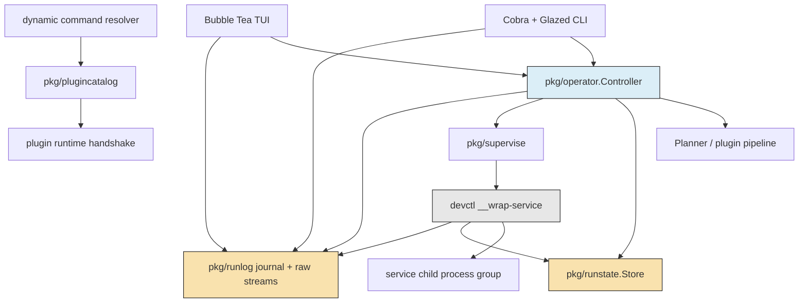
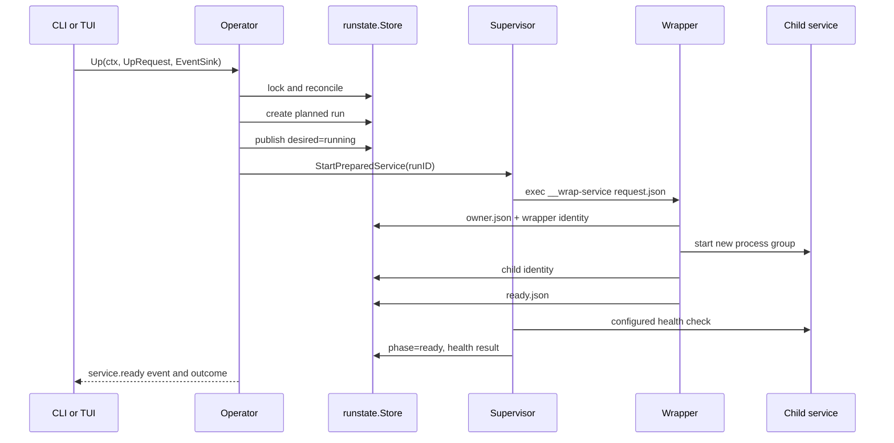
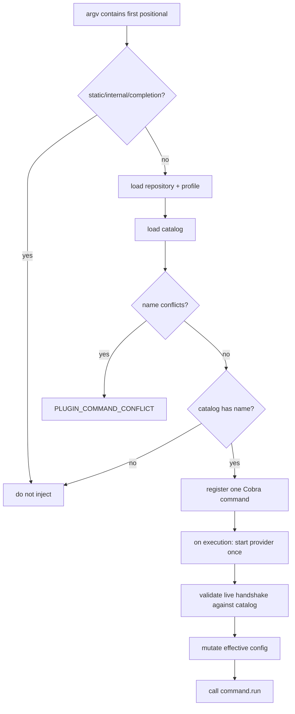

# devctl: Durable Operator State, Structured Logs, and Robust Dynamic Commands

This report examines the completed redesign of `devctl` as a local development-environment operator. The implementation replaces command-local process control, fragmented status inference, unstructured log consumption, and a duplicated terminal control plane with one durable state model and one typed controller shared by the command-line interface and terminal user interface. It also preserves plugin-defined top-level commands while making their discovery, conflict handling, caching, and execution deterministic.

The work was performed in `/home/manuel/workspaces/2026-07-07/prod-tiny-idp/devctl` under ticket `DEVCTL-OPERATOR-UX-001`. The final implementation is recorded by commit `f799919`, with the last runtime correction in `0657506`. The ticket contains the original code audit, comparative research, target design, implementation guide, chronological investigation diary, validation evidence, and terminal test fixture.

> [!summary]
> - Durable repository state now separates the desired environment from immutable per-run records. Writes are atomic, mutations are serialized by a repository lock, and process ownership requires both a PID and an operating-system start token.
> - A wrapper process owns each service lifecycle and writes request, ownership, readiness, exit, raw-output, and structured-journal artifacts. The caller does not infer successful detachment from a disappearing parent process.
> - `pkg/operator.Controller` is the sole lifecycle API for `up`, `down`, `restart`, `status`, `doctor`, CLI streaming, and TUI actions. Typed requests, events, outcomes, and errors replace text-derived state.
> - `pkg/runlog` provides sequenced JSONL records, bounded framing, filtering, tail queries, and resumable follow cursors while retaining exact raw stdout and stderr files.
> - The TUI was replaced with three focused views: Overview, Logs, and Runs. It calls the operator controller directly and consumes structured snapshots and log records.
> - Plugin-defined top-level commands remain supported. Static commands take precedence; conflicts are deterministic; cached catalogs carry provider fingerprints; execution validates the live handshake before calling `command.run`.
> - The final cleanup removed approximately 8,400 lines of duplicated TUI and control-plane code while adding about 3,300 lines across the operator path, tests, guides, and ticket evidence.

## 1. Project scope and completion state

`devctl` coordinates repository-local build, preparation, validation, service startup, health checking, inspection, log access, restart, and shutdown. Its plugins speak an NDJSON protocol and may contribute pipeline operations, services, configuration patches, and commands. The program therefore has two distinct responsibilities:

1. It evaluates repository and plugin configuration to obtain an intended environment.
2. It safely changes and reports the actual local process state over time.

The redesign concentrated on the second responsibility without removing the first. The plugin protocol, pipeline planner, and wrapper-based supervision remain important parts of the system. What changed is the ownership of runtime truth. Lifecycle state is no longer an incidental result of whichever CLI or TUI code path happened to run. It is represented in versioned files and interpreted by a reusable operator package.

The completed work includes:

- versioned environment and run schemas in `pkg/runstate`;
- atomic persistence, optimistic revision checks, and repository mutation locking;
- PID/start-token process identity checks;
- wrapper request and handshake artifacts;
- run-scoped raw and structured logs;
- the typed controller in `pkg/operator`;
- consolidated lifecycle, status, logs, doctor, profile, plan, phase, and streaming output;
- hardened plugin command discovery and execution;
- a replacement Bubble Tea TUI;
- command-tree, output-contract, state, reconciliation, journal, golden-view, race, lint, and security tests;
- updated README, scripting, TUI, plugin-authoring, user, and v2-upgrade documentation.

All ticket tasks are closed. `go test ./...`, focused race tests, lint, build, generated-logger checks, and `gosec` passed. `govulncheck` was not completed because querying `vuln.go.dev` would disclose dependency metadata and network authorization was not granted. This limitation is recorded rather than treated as a successful security result.

## 2. Why the previous control model required replacement

The original program contained useful components, but its operator behavior was distributed across layers that did not share one authoritative model. Service state existed in process metadata, state files, supervisor behavior, health probes, CLI formatting code, TUI event transport, and TUI-local models. Logs existed as raw files, protocol events, diagnostic output, parsed JavaScript events, and ephemeral TUI messages. The same service could consequently receive different descriptions from different surfaces.

The principal failure classes were:

- **identity ambiguity**: a PID could be reused after a process exited, making a PID-only check unsafe;
- **publication races**: related state files could become observable at different stages of startup;
- **concurrent mutation**: two lifecycle commands could update one repository without a shared exclusion boundary;
- **false readiness**: caller exit or wrapper creation could be confused with child readiness;
- **stale status**: an exited child could remain represented as running until an explicit mutating command reconciled it;
- **log ambiguity**: tailing a file did not provide stable sequence identity, source metadata, bounded framing, or resumable cursors;
- **control-plane duplication**: the TUI reimplemented supervision, polling, event routing, selection, and display semantics;
- **output instability**: command-specific rendering made automation depend on prose;
- **dynamic command fragility**: plugin startup during discovery could slow or break help, completion, and unrelated commands; duplicate names could depend on discovery order.

These are correctness problems. Improving colors, adding panels, or changing command names would not address them. The new design begins with explicit state, ownership, and transition contracts.

## 3. Architectural result

The final system is organized around four runtime packages and two presentation surfaces.



The dependency direction is deliberate. User interfaces depend on the operator contract. The operator depends on planning, durable state, supervision, and logs. The TUI does not own a second supervisor, and the CLI does not encode state by parsing presentation text.

| Package or area | Primary responsibility |
| --- | --- |
| `pkg/runstate` | Versioned environment index, run records, process identity, atomic files, repository lock |
| `pkg/supervise` | Wrapper launch, readiness completion, shutdown, health coordination |
| `pkg/runlog` | Structured records, writers, readers, filters, tails, cursors, follow |
| `pkg/operator` | Lifecycle transactions, reconciliation, snapshots, doctor, typed events and errors |
| `pkg/plugincatalog` | Static and live command catalogs, fingerprints, conflicts, cache |
| `cmd/devctl/cmds` | Cobra/Glazed boundaries, rendering, exit mapping, dynamic dispatch |
| `pkg/tui` | Overview, Logs, Runs, command palette, terminal-safe rendering |

## 4. Durable state is the runtime authority

### 4.1 Environment state and run records

`pkg/runstate/schema.go` defines two related documents. `EnvironmentState` is the current repository index. It contains the selected profile, monotonically increasing revision, timestamps, and one `ServiceSlot` per service. A slot records the desired state and points to a current and previous run. `RunRecord` describes one concrete service attempt and is retained after that attempt terminates.

The distinction is essential:

- the environment document answers what the repository currently wants and which run is current;
- the run document answers what happened to one service execution;
- logs and handshake artifacts belong to the run, not to a mutable service name;
- restarting a service creates a new run identity rather than overwriting the prior execution.

The current schemas are:

```go
type EnvironmentState struct {
    Version   int
    RepoRoot  string
    Profile   string
    Revision  uint64
    CreatedAt time.Time
    UpdatedAt time.Time
    Services  map[string]ServiceSlot
}

type ServiceSlot struct {
    Name         string
    CurrentRunID string
    LastRunID    string
    Desired      DesiredState // running or stopped
}

type RunRecord struct {
    Version     int
    RunID       string
    Service     string
    Phase       RunPhase
    Spec        ServiceSpecRecord
    Wrapper     *ProcessIdentity
    Child       *ProcessIdentity
    ChildPGID   int
    Health      *HealthResult
    Exit        *ExitSummary
    ArtifactDir string
    LastError   *ErrorRecord
}
```

Run phases are `planned`, `starting`, `ready`, `stopping`, `exited`, `failed`, and `unknown`. These values describe observed execution progress. Desired state is separate because a service may be desired `running` while its observed run is `failed`, or desired `stopped` while shutdown is still in progress.

Run IDs use UUIDv7. This provides global uniqueness and time ordering without making timestamps the identity. Every artifact path can be selected by run ID even when a service has been started many times.

### 4.2 Filesystem layout

The v2 state directory is repository-local and run-scoped. Conceptually:

```text
.devctl/
  state.json
  lock
  runs/
    <run-id>/
      run.json
      request.json
      owner.json
      ready.json
      exit.json
      stdout.log
      stderr.log
      logs.jsonl
```

The exact path construction is owned by `pkg/runstate.Store`; callers should use store methods instead of assembling paths. Repository locality makes the state inspectable and prevents one project from accidentally controlling another project’s processes.

### 4.3 Atomic writes and revisions

A state document must never be visible half-written. The atomic write algorithm creates a temporary file in the destination directory, writes the complete encoded document, applies the intended permissions, synchronizes it, closes it, and renames it over the destination. Rename supplies the publication boundary.

```text
function atomicWrite(path, bytes, mode):
    temp = createTemp(parent(path))
    writeAll(temp, bytes)
    chmod(temp, mode)
    fsync(temp)
    close(temp)
    rename(temp, path)
    fsync(parent(path)) when supported
```

`EnvironmentState.Revision` protects callers from silently applying a mutation to a state version they did not read. An update supplies its expected revision. A mismatch fails instead of merging assumptions from two concurrent views.

Revision checks do not replace locking. The repository lock covers multi-document lifecycle transactions such as creating runs, publishing their selection in the environment, launching wrappers, and recording outcomes. `pkg/runstate.Locker.WithExclusive` records operation metadata and respects context cancellation. Competing mutations receive `OPERATION_BUSY`.

### 4.4 Process identity

A PID alone is not durable ownership evidence because operating systems reuse process identifiers. `ProcessIdentity` therefore stores:

```go
type ProcessIdentity struct {
    PID        int
    StartToken string
}
```

On Linux, the start token is read from `/proc/<pid>/stat`. A process is considered the owned process only if both values match. Stop and reconciliation logic must not signal a process when the PID exists but its start token differs. Such a record becomes unknown or stale and requires diagnostic handling.

This rule is a safety boundary:

```text
function ownedProcess(identity):
    if process(identity.pid) does not exist:
        return exited
    actual = readStartToken(identity.pid)
    if actual != identity.startToken:
        return identityMismatch
    return ownedAndAlive
```

## 5. Wrapper-owned startup and termination

Detached service execution still uses a wrapper. The wrapper is retained because it provides a stable owner after the initiating CLI process exits, isolates the service process group, captures both output streams, and records terminal state. The redesign formalizes that behavior with durable handshake artifacts.

### 5.1 Startup transaction

An `up` request is handled as a transaction under the repository lock:

1. Reconcile existing state.
2. Ask the planner for the selected profile and service specifications.
3. Resolve the service selection and reject already-running selections.
4. Create one `planned` run record per service.
5. Publish the corresponding environment slots with desired state `running`.
6. Start the wrapper for each prepared service.
7. Wait for wrapper ownership and readiness evidence.
8. Perform the configured health check.
9. Persist the final phase and emit typed outcomes.



The request artifact gives the wrapper complete immutable input: run identity, command, working directory, sanitized environment, and artifact locations. `owner.json` proves that the wrapper accepted ownership. `ready.json` records the child identity and startup boundary. `exit.json` records termination even when the initiating process is gone.

### 5.2 Health semantics

Process existence and service health are different observations. A child may be alive before it accepts connections, or remain alive while returning failing health responses. `HealthResult` records whether the probe succeeded, when it ran, its duration, and diagnostic detail.

The service reaches `ready` only after the configured readiness contract succeeds. An unhealthy service receives a typed unhealthy or failed outcome; the result does not conceal health failure behind a successful process spawn.

### 5.3 Stop and restart

`down` selects current runs, verifies process identity, sets the desired state to `stopped`, marks the run `stopping`, and signals the owned process group through the supervisor. The wrapper records the child’s exit. Stop completion reconciles the record and emits a typed service outcome.

`restart` is composed from controller semantics, not a TUI-specific shortcut. It stops the selected current run and creates a new run under the requested profile and policy. Prior run artifacts remain available for comparison.

## 6. Reconciliation makes status truthful

Durable state is not automatically correct merely because it is persisted. Processes can exit between writes, the operator can crash, or the wrapper can publish terminal evidence after a caller stops observing it. Reconciliation compares stored claims with process identity and wrapper-owned artifacts.

The reconciliation rules include:

- a recorded live identity with matching start token remains eligible for running state;
- a missing process with an exit artifact becomes exited or failed according to the artifact;
- a missing process without complete evidence is not presented as healthy;
- an identity mismatch is not signaled and becomes a diagnostic state;
- environment slots are updated consistently with their run records;
- repeated reconciliation is idempotent.

The final defect discovered during tmux testing demonstrates why read paths must reconcile. A short-lived service started successfully and then exited. The wrapper wrote its exit state, but `status` continued to show the previous phase because `Snapshot` loaded the environment without first reconciling. The fix in commit `0657506` changed snapshots to acquire the repository mutation lock, reconcile exits, and then construct the returned view.

```text
function Snapshot(request):
    store = openStore(request.repoRoot)
    lock repository
    reconcile(store)
    environment = loadEnvironment(store)
    runs = loadSelectedRuns(environment)
    health = probe only when requested
    return typed Snapshot
```

This is not an incidental patch. It establishes that status is a read operation from the user’s perspective but may require a serialized repair of derived durable state. The snapshot remains observational in intent while ensuring its returned facts reflect terminal artifacts already present on disk.

## 7. Structured log architecture

### 7.1 Raw streams and journals

The wrapper preserves exact child stdout and stderr in `stdout.log` and `stderr.log`. Exact raw capture is useful for byte-level diagnosis and tools that expect conventional files. In parallel, it frames output into `journal.jsonl` records with source, stream, time, sequence, and run identity.

```go
type LogRecord struct {
    Version  int
    RunID    string
    Sequence uint64
    Time     time.Time
    Source   SourceKind
    Service  string
    Stream   StreamKind
    Level    string
    Text     string
    Partial  bool
    Fields   map[string]any
}
```

The sequence is monotonically increasing within a run. Consumers can therefore distinguish ordering from wall-clock timestamps, which may have coarse resolution or clock adjustments. A `Cursor` is the pair `(run_id, sequence)`.

### 7.2 Framing and bounded memory

Service output does not guarantee newline termination. It may contain a very long line, invalid control bytes, or a partial final record. The framer uses a maximum record size. A line that exceeds the limit is emitted in bounded fragments with `Partial=true`; it is not accumulated without limit.

Terminal rendering additionally sanitizes control sequences and constrains in-memory history. This prevents service output from injecting terminal commands or growing the TUI indefinitely.

### 7.3 Query and follow

`runlog.Reader` exposes two operations:

```go
type Reader interface {
    Query(context.Context, Query) ([]LogRecord, error)
    Follow(context.Context, FollowRequest, LogSink) error
}
```

`Query` can select run IDs, services, source kinds, stream kinds, levels, time bounds, a tail count, and text containment. `Follow` resumes after per-run cursors and writes new records to a `LogSink`.

```text
query:
    runs       = selected run IDs or current runs
    records    = decode journal records
    records    = filter by service/source/stream/level/time/text
    records    = stable sort by time, run ID, sequence
    if tail > 0: keep final tail records
    return records

follow:
    initial cursors = request.after
    repeatedly read records after each run cursor
    deliver each record to sink
    advance cursor only after successful delivery
    stop on context cancellation or reader error
```

The cursor contract supports a CLI follower, a TUI refresh loop, and future clients without parsing decorated terminal lines. The reader returns domain records; each presentation layer decides whether to render text, a table, JSON, or JSONL.

## 8. One operator controller for every surface

`pkg/operator/controller.go` defines the central interface:

```go
type Controller interface {
    Up(context.Context, UpRequest, EventSink) (OperationResult, error)
    Down(context.Context, DownRequest, EventSink) (OperationResult, error)
    Restart(context.Context, RestartRequest, EventSink) (OperationResult, error)
    Snapshot(context.Context, SnapshotRequest) (Snapshot, error)
    Logs() runlog.Reader
    Doctor(context.Context, DoctorRequest) (DoctorReport, error)
}
```

Requests carry repository root, profile, service selection, and pipeline policy. The policy explicitly represents dry-run, timeouts, build and preparation selection, and validation skips. User interfaces do not communicate these decisions through global mutable fields or formatted command strings.

Lifecycle methods return `OperationResult` containing an operation ID, status, timestamps, and per-service outcomes. They also publish `OperatorEvent` values to an optional `EventSink`. Event kinds include operation and phase boundaries, planned, starting, ready, unhealthy, stopping, exited, failed, unknown, and diagnostic events.

Typed errors carry stable codes such as configuration invalid, operation busy, state corrupt, partial failure, and usage failure. The CLI maps them centrally to exit status. The TUI maps the same errors to visible operation results. Neither consumer must infer a category from English prose.

This separation yields three useful properties:

- tests can inject a planner, supervisor factory, clock, operation-ID generator, and log reader;
- CLI and TUI actions execute identical lifecycle semantics;
- a future API or editor integration can use the same controller without invoking Cobra or emulating key presses.

## 9. CLI contracts and Glazed output

The CLI remains a Cobra application, with Glazed used for structured command fields and row rendering. Human-readable output is one rendering of typed data rather than the only contract.

Important commands include:

```text
devctl up [service...]
devctl down [service...]
devctl restart [service...]
devctl status
devctl logs [service...] [--follow]
devctl doctor
devctl plan
devctl build
devctl prepare
devctl validate
devctl profiles
devctl plugins inspect
devctl plugins refresh
devctl plugins run <provider> <command> [args...]
devctl tui
```

Status, plan, profiles, phase outcomes, and operation streams have structured row or JSONL forms. Streaming JSON emits one complete JSON object per line rather than an array that cannot close until the operation ends. Tests lock the help tree, usage-error boundaries, completion behavior, JSONL framing, and renderer contracts.

The scripting contract is consequently based on:

- stable fields;
- stable event and error codes;
- one JSON object per streamed record;
- nonzero exit status for failed plugin commands and lifecycle failures;
- stderr for diagnostics and stdout for selected data output.

## 10. Robust dynamic top-level plugin commands

### 10.1 Feature purpose

Plugins may advertise commands during their protocol handshake. `devctl` exposes such a command at the top level, allowing a repository-specific operation to be invoked as:

```text
devctl <plugin-command> [arguments...]
```

This capability is intentionally retained. Repository plugins can add focused workflows without requiring every domain-specific verb to enter the core binary. The redesign addresses discovery cost and ambiguity while preserving direct invocation.

### 10.2 Resolution sequence

`AddDynamicPluginCommands` first parses repository flags and positional arguments without executing Cobra. It returns immediately when:

- there is no positional command;
- the command is the internal `__wrap-service`;
- the command is `completion`;
- the name already belongs to a static root command.

Static commands and aliases therefore always take precedence. Help and completion do not start plugins merely to enumerate possible top-level commands.

For an unknown positional name, the resolver loads the selected repository and asks `pkg/plugincatalog` for a catalog. The catalog records command names, provider IDs, plugin identities, help and argument specifications, conflicts, and provider fingerprints. If live catalog loading fails, a valid static cache may still identify the requested command. Error messages direct the operator to `devctl plugins refresh` when the catalog is unavailable or stale.



### 10.3 Deterministic conflicts

Two selected providers may advertise the same name. The implementation does not let discovery order choose a winner. The catalog stores all conflicting entries; invoking the ambiguous name returns `PLUGIN_COMMAND_CONFLICT` with the sorted provider IDs and active profile.

An operator can inspect the providers and invoke explicitly:

```text
devctl plugins inspect
devctl plugins run <provider-id> <command-name> -- <args>
```

This gives the concise top-level path for unambiguous commands and an explicit provider path for diagnosis or conflict resolution.

### 10.4 Stale-catalog defense

Caching cannot be treated as authority because the executable or plugin handshake may change. At execution time, devctl starts only the selected provider, then verifies:

- the provider still supports `command.run`;
- the plugin identity still matches;
- the complete sorted command specification matches the cached catalog;
- the selected provider remains part of the active repository profile.

A mismatch returns `PLUGIN_CATALOG_STALE` and asks the user to refresh. Only after validation does devctl apply the provider’s configuration mutation and call `command.run`.

Provider command exit codes are preserved as `PluginCommandExitError`. A plugin-reported nonzero result cannot be rendered as a successful devctl invocation.

### 10.5 Operational consequences

The feature now has explicit rules:

| Situation | Result |
| --- | --- |
| Plugin name equals a static command or alias | Static command wins |
| Two providers define one dynamic name | Deterministic conflict error |
| Help or completion is requested | No eager plugin startup |
| Cached provider fingerprint or handshake differs | Stale-catalog error |
| One dynamic command is invoked | Only its provider starts |
| Provider reports nonzero exit code | devctl exits unsuccessfully |

These rules make top-level injection suitable for complex repositories with multiple plugins and profiles while keeping ordinary CLI startup independent from optional provider availability.

## 11. TUI replacement

The previous TUI contained its own service models, action runner, stream runner, state watcher, event bus, transformation layer, widgets, and several domain-specific screens. Much of that code duplicated behavior now owned by the operator and runlog packages. The replacement intentionally reduces the information architecture to three views.

### 11.1 Overview

Overview displays service, desired state, observed phase, run identity, health, and selection. Start, stop, and restart operations are controller requests. Destructive or broad actions use exact confirmation prompts. The view does not parse status text.

### 11.2 Logs

Logs displays bounded, sanitized `runlog.LogRecord` values. It supports service and stream selection, following, and scrolling while preserving record identity. The model caps retained records to prevent an active service from exhausting terminal memory.

### 11.3 Runs

Runs presents historical attempts and their terminal outcomes. Because records are run-scoped, an operator can distinguish the current failure from a previous successful execution without locating renamed log files.

### 11.4 Typed update loop

Bubble Tea commands perform controller calls or log reads and return typed messages. The `Update` function changes model state in response. It does not execute a shell command and scrape its output.

```text
key press
  -> construct typed request
  -> tea.Cmd invokes Controller
  -> Controller emits result/event/error
  -> typed tea.Msg returns to Update
  -> model stores domain values
  -> View renders current model
```

The command palette contains real actions rather than decorative labels. Golden tests cover narrow, normal, and wide terminal sizes (`44x16`, `80x24`, and `120x30`). Race tests exercise the TUI and operator packages. The implementation also handles tiny terminal dimensions, modal focus, empty state, control-character sanitization, and bounded log history.

## 12. Failure semantics

A reliable operator must describe failure without overstating certainty.

| Failure | Representation and response |
| --- | --- |
| Invalid repository or configuration | Typed usage/configuration error before mutation |
| Concurrent lifecycle operation | `OPERATION_BUSY`; no second mutation begins |
| Wrapper never accepts ownership | Startup fails; run preserves error evidence |
| Child starts but health check fails | Unhealthy/failed outcome, not ready |
| PID exists with different start token | Identity mismatch; do not signal |
| Child exits after successful start | Wrapper writes exit; snapshot reconciliation updates state |
| Journal contains oversized line | Bounded partial records |
| Follow consumer is canceled | Context cancellation stops follow |
| Dynamic name is duplicated | `PLUGIN_COMMAND_CONFLICT` |
| Cached plugin contract changes | `PLUGIN_CATALOG_STALE` |
| Plugin command returns nonzero | Nonzero devctl result |
| State document is malformed | State-corrupt diagnostic rather than guessed status |

Partial failure is represented at operation and service level. If one service fails after others start, the result reports each outcome. This supports remediation without erasing successful work or claiming atomic rollback that the process environment cannot guarantee.

## 13. Security and privacy boundaries

This is a local development operator, but local process control still has meaningful security requirements.

- Persisted service environments are sanitized through the existing state sanitization path. Secrets should not be copied into state or structured logs.
- State and run artifacts use restrictive file permissions.
- Process termination requires PID and start-token equality.
- Repository locks and validated paths constrain mutation to the selected repository.
- TUI log text is sanitized before terminal rendering.
- Log framing prevents a single unbounded record from exhausting memory.
- Plugin catalog entries are not trusted indefinitely; live execution validates the provider handshake.
- Dynamic command argument forwarding is structured protocol data, not shell concatenation.

The repository’s trusted smoke tests start subprocesses intentionally. Security annotations document that trust boundary so static analysis exceptions remain reviewable.

This work does not make arbitrary plugins safe. A configured plugin is executable code selected by the repository. The catalog hardening prevents ambiguity and drift; it does not sandbox provider behavior.

## 14. Validation strategy

The project used layered validation.

### 14.1 Unit and contract tests

Key test areas include:

- atomic writes, schema validation, revisions, locking, and Linux identity in `pkg/runstate/*_test.go`;
- journal framing, querying, filtering, ordering, and follow behavior in `pkg/runlog/*_test.go`;
- controller lifecycle, typed outcomes, and exit reconciliation in `pkg/operator/*_test.go`;
- CLI usage, JSONL, help tree, completion, logs, phases, profiles, and dynamic commands in `cmd/devctl/cmds/*_test.go`;
- TUI update behavior, confirmation, bounds, and golden renderings in `pkg/tui/model_test.go`.

### 14.2 Static and race validation

The final gates included:

```text
make build
go test ./...
go test -race ./pkg/runstate ./pkg/runlog ./pkg/operator ./pkg/tui
make lint
make logcopter-check
make gosec
```

`gosec` analyzed 81 files and reported no issues. Generated loggers were refreshed and checked.

### 14.3 Live terminal matrix

The ticket script `scripts/07-tui-operator-matrix-fixture.sh` creates a controlled multi-service fixture for CLI and TUI inspection. Long-running programs were exercised through tmux so output could be captured and processes could be terminated deterministically.

The live matrix checked:

- startup and health transitions;
- service selection;
- restart and shutdown;
- logs and follow output;
- Overview, Logs, and Runs navigation;
- command palette and confirmations;
- narrow and standard terminal behavior;
- child exit after readiness.

The final item exposed the stale snapshot defect and led directly to commit `0657506`. The test process therefore validated not only rendering but the relationship between wrapper exit artifacts, reconciliation, and status.

## 15. Implementation history

The implementation proceeded in dependency order:

1. Establish versioned run state, atomic persistence, identity, and locking.
2. Make the wrapper consume run requests and publish durable handshake artifacts.
3. Introduce the operator controller and move lifecycle callers onto it.
4. Add sequenced run journals and structured readers.
5. Consolidate CLI contracts and Glazed output.
6. Harden plugin command catalog behavior and tests.
7. Replace the TUI with the three-view controller client.
8. Remove obsolete TUI dependencies and duplicated code.
9. Publish v2 user, scripting, TUI, plugin, and migration guidance.
10. Run terminal validation and correct snapshot reconciliation.

The final commit sequence preserves each proof gate. Particularly relevant commits are:

| Commit | Result |
| --- | --- |
| `c25c31b` | Replaced the legacy TUI with typed operator views |
| `f8c81dc` | Hardened TUI workflows and terminal handling |
| `e182b45` | Published operator v2 guidance |
| `1de9e26` | Locked help-tree and plugin catalog-drift behavior |
| `907279b` | Streamed canonical event rows incrementally |
| `c0d00e3` | Added terminal golden renderings |
| `0657506` | Reconciled child exits during snapshots |
| `f799919` | Closed the completed ticket |

The detailed chronological account is in the ticket’s `reference/01-investigation-diary.md`. It records commands, failures, decisions, and corrections rather than reconstructing them after completion.

## 16. Upgrade and operating model

The v2 state model is intentionally a breaking replacement. No hidden compatibility adapter translates legacy runtime state. Before upgrading, users should stop environments with the old version, install the new version, initialize or start the repository, and verify status and plugin catalogs under v2.

An operator should use the following sequence:

```bash
devctl doctor
devctl plan
devctl up
devctl status
devctl logs --follow
devctl tui
devctl down
```

For plugin-defined commands:

```bash
devctl plugins inspect
devctl plugins refresh
devctl <unambiguous-command> --help
devctl plugins run <provider-id> <command> -- <arguments>
```

For machine consumption, select Glazed JSON or JSONL output rather than parsing tables. For a stale or inconsistent display, run `devctl doctor` and inspect the current run records and artifacts. Manual deletion of state should be a last resort because those files contain the evidence needed to distinguish exit, failure, and identity mismatch.

The repository documentation provides task-oriented details:

- `README.md` for installation, configuration, command overview, state, logs, and dynamic commands;
- `pkg/doc/topics/devctl-user-guide.md` for daily operation;
- `pkg/doc/topics/devctl-scripting-guide.md` for structured automation;
- `pkg/doc/topics/devctl-tui-guide.md` for terminal workflows;
- `pkg/doc/topics/devctl-plugin-authoring.md` for the NDJSON protocol and commands;
- `pkg/doc/topics/devctl-v2-upgrade.md` for migration.

## 17. Source map for new contributors

A new contributor should read files in the following order:

1. `pkg/runstate/schema.go` — vocabulary and persisted facts.
2. `pkg/runstate/store.go`, `atomic.go`, `lock.go`, and `identity*.go` — persistence and ownership guarantees.
3. `pkg/runlog/contracts.go`, `writer.go`, `reader.go`, `follow.go`, and `framer.go` — observable output.
4. `pkg/operator/requests.go`, `events.go`, `results.go`, `errors.go`, and `controller.go` — public lifecycle contract.
5. `pkg/operator/reconcile.go` and `doctor.go` — repair and diagnosis.
6. `pkg/supervise` and `cmd/devctl/cmds/wrap_service.go` — wrapper/child execution.
7. `cmd/devctl/cmds/lifecycle.go`, `status.go`, `logs.go`, and `stream.go` — CLI boundary.
8. `pkg/plugincatalog` and `cmd/devctl/cmds/dynamic_commands.go` — command discovery and dispatch.
9. `pkg/tui/model.go`, `overview.go`, `logs.go`, `runs.go`, and `messages.go` — terminal client.
10. The corresponding tests before changing a contract.

The intern-level reasoning sequence is state first, transitions second, presentation last. A change to a status label should begin by locating the domain value that label renders. A new lifecycle action should begin as a typed controller request. A new log feature should begin as a `runlog.Query` or record-field decision. It should not begin with CLI text parsing or a TUI-only event.

## 18. Design conclusions

Several conclusions are now enforced by code rather than retained only as recommendations.

### 18.1 Desired and observed state must remain separate

The operator can report that a service is desired running but has exited. Combining these values would erase the information necessary for diagnosis and automated recovery.

### 18.2 A run is the unit of history

Service names are stable configuration identities. Runs are concrete executions. Logs, process identity, health, errors, and exit status belong to runs.

### 18.3 Read paths may perform reconciliation

A snapshot that merely repeats stale files is not an authoritative snapshot. Reconciliation under the same lock as lifecycle mutation is required when wrapper-owned terminal artifacts can arrive asynchronously.

### 18.4 Structured output is a domain contract

JSONL framing, event versions, cursor identity, and error codes are part of the operator API. Human prose can change without forcing scripts to change.

### 18.5 The TUI is a client

The terminal UI renders controller snapshots and sends controller requests. Its removal or replacement must not change lifecycle behavior.

### 18.6 Dynamic commands require deterministic authority

Top-level plugin commands are useful, but only when static precedence, provider identity, conflicts, cache invalidation, and exit propagation are explicit. Discovery metadata selects a candidate; the live validated handshake authorizes execution.

## 19. Remaining work and explicit limits

The ticket’s objectives are complete, but the architecture leaves defined future work:

- implement and document retention policy for old runs and journals if disk use becomes significant;
- run `govulncheck` when dependency-metadata network disclosure is approved;
- collect longer-term performance measurements for repositories with many services and large journals;
- consider event-driven filesystem notification only if polling becomes measurable overhead;
- preserve controller and journal versioning if a remote or editor client is introduced;
- review whether older low-level state and supervision APIs can be removed after all internal and external consumers are confirmed migrated.

The last item must not be handled through an unrequested compatibility layer. Removal requires a concrete consumer audit. The current operator may use lower-level supervisor types internally; the architectural requirement is that presentation surfaces call the operator, not that every historical package name disappear immediately.

## 20. Final assessment

The project changes `devctl` from a collection of operational entry points into a coherent local operator. The core achievement is a chain of explicit evidence:

```text
repository configuration
  -> planned service specification
  -> immutable run identity
  -> wrapper ownership
  -> child process identity
  -> health result
  -> sequenced output records
  -> exit artifact
  -> reconciled snapshot
  -> CLI or TUI rendering
```

Every displayed state can be traced through this chain. Every lifecycle mutation passes through one controller and one repository lock. Every service attempt retains its own process, health, log, and exit evidence. Plugin-defined commands remain concise to invoke, but their namespace and provider contracts are validated deterministically.

The implementation also reduced maintenance surface. Removing the duplicate TUI control plane was not a loss of operator capability; Overview, Logs, and Runs now expose the information that the durable runtime actually records. The resulting system is smaller at the presentation layer, more explicit at the domain layer, and better suited to complex multi-service development repositories.

## References

### Primary project sources

- `/home/manuel/workspaces/2026-07-07/prod-tiny-idp/devctl/ttmp/2026/07/24/DEVCTL-OPERATOR-UX-001--heavy-user-reliability-logging-cli-and-tui-analysis-and-design/design-doc/01-devctl-heavy-user-operator-experience-analysis-redesign-and-implementation-guide.md`
- `/home/manuel/workspaces/2026-07-07/prod-tiny-idp/devctl/ttmp/2026/07/24/DEVCTL-OPERATOR-UX-001--heavy-user-reliability-logging-cli-and-tui-analysis-and-design/reference/01-investigation-diary.md`
- `/home/manuel/workspaces/2026-07-07/prod-tiny-idp/devctl/ttmp/2026/07/24/DEVCTL-OPERATOR-UX-001--heavy-user-reliability-logging-cli-and-tui-analysis-and-design/scripts/07-tui-operator-matrix-fixture.sh`
- `/home/manuel/workspaces/2026-07-07/prod-tiny-idp/devctl/pkg/doc/topics/devctl-v2-upgrade.md`
- `/home/manuel/workspaces/2026-07-07/prod-tiny-idp/devctl/pkg/doc/topics/devctl-tui-guide.md`

### Core implementation

- `pkg/runstate/`
- `pkg/runlog/`
- `pkg/operator/`
- `pkg/plugincatalog/`
- `pkg/supervise/`
- `cmd/devctl/cmds/`
- `pkg/tui/`
