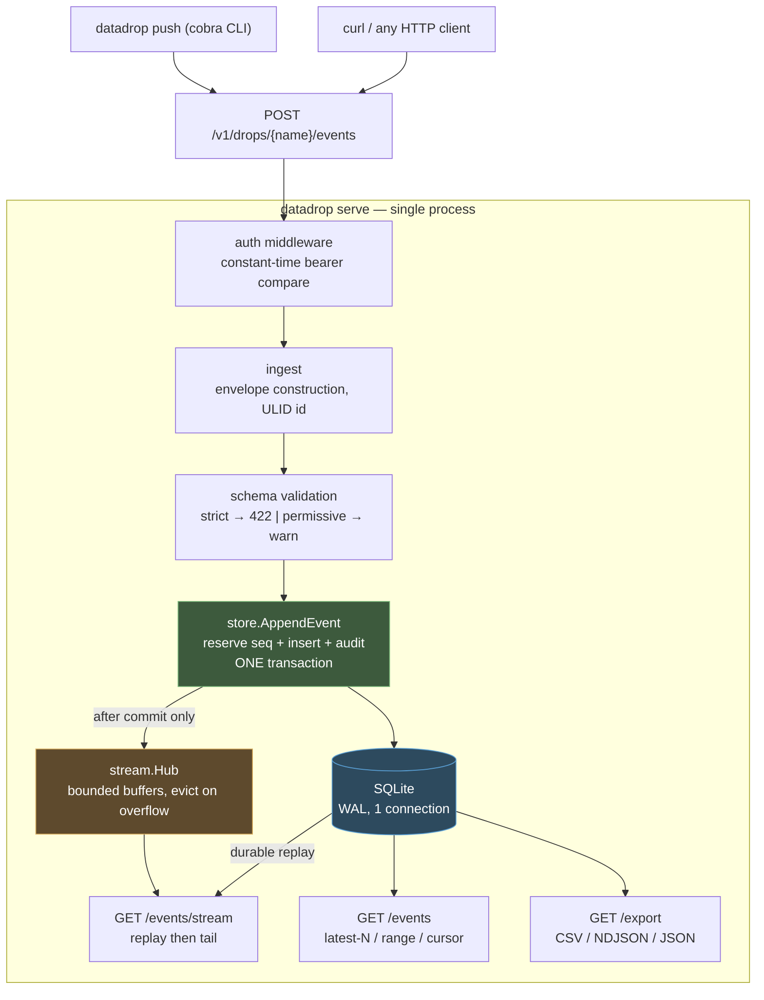
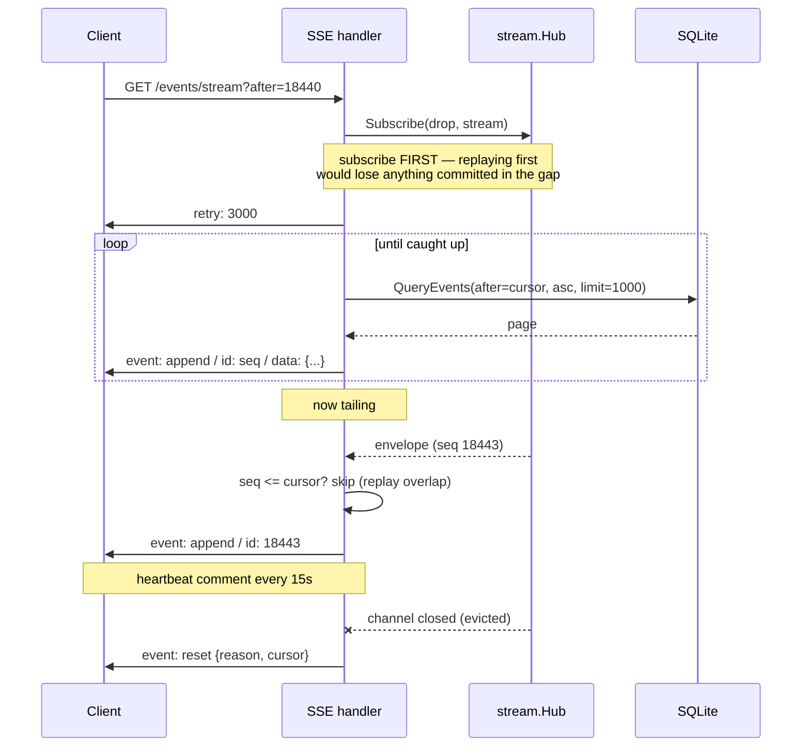

# PROJECT REPORT - go-go-datadrop v0.1 - Building an Append-Only Event Store from Two Reference Implementations

This report explains how `go-go-datadrop` v0.1 was built and, more importantly, why it is shaped the way it is. The system is small — eight packages carrying code, one SQLite file, nine `/v1` endpoints plus a health check — but nearly every structural decision in it exists to preserve a property that would be expensive or impossible to add later. The purpose of this report is to make those properties and their justifications explicit, so that a reader can extend the system without silently breaking one of them.

The starting material was a docmgr ticket, DATADROP-1, seeded the same day from a ChatGPT conversation (documented in [[PROJECT REPORT - Seeding go-go-datadrop and go-go-goja Instrumentation from ChatGPT Conversations]]). That ticket contained a scope document, an investigation diary, an 11,000-word upstream design, and — this turned out to matter more than anything else — two working Go reference implementations of an adjacent system. The build was therefore not a design exercise. It was an extraction exercise: read what already worked, understand why it worked, and port the parts that v0.1 needs.

> [!summary]
> Four decisions carry the weight of the whole system:
> 1. **Sequence reservation happens inside the same transaction as the event insert.** An acknowledged event is durably ordered, or it does not exist.
> 2. **The realtime hub is deliberately lossy, and the durable log is the only source of truth.** A subscriber that falls behind is disconnected rather than buffered, because resumption is a solved problem and unbounded memory growth is not.
> 3. **Publication to subscribers happens strictly after commit.** The resulting failure asymmetry — a crash can lose a notification but never data — is what makes decision 2 safe.
> 4. **Observation time and ingest time are separate columns.** Conflating them destroys the ability to reason about delayed or buffered producers, and that ability cannot be reconstructed after the fact.

## Why this project exists

Capturing a modest amount of live data requires assembling roughly ten components: an HTTP endpoint, authentication, a database, schema validation, time-series queries, file storage, a dashboard, alerting, a deployment story, and a sandbox for custom logic. Each is individually available. The integration cost is the problem, and it is paid most often by people whose actual work is not software engineering — researchers with a sensor, scrapers producing rows, experiments emitting measurements.

The opposite failure mode is a hosted platform that is frictionless until the point at which the user wants to leave. Wolfram Data Drop supplies the reference interaction pattern — a named destination that accepts incremental entries carrying metadata, retrievable by time — and the thing worth avoiding is its coupling to one proprietary language and one hosting model.

`go-go-datadrop` targets the space between: integrated enough to be useful in sixty seconds, ordinary enough to work with `curl` and pipes, open enough to self-host and export. v0.1 implements the first half of the product sentence that governs the design — *a drop begins as a place to send data and becomes a portable, programmable, live data object* — while making structural choices that permit the second half to be added without migrating any data.

## What v0.1 actually does

A single binary, pointed at a SQLite file and a TCP port, provides:

- a named destination (a **drop**) created in one command;
- an HTTP endpoint accepting either a bare JSON payload or a full CloudEvents envelope, appending it to an immutable ordered log;
- a CLI that performs the same append without requiring the user to compose `curl` invocations;
- optional JSON Schema validation in either a rejecting or a warning mode;
- queries by count, by sequence cursor, or by time window;
- a live Server-Sent Events feed with resumable cursors;
- CSV, NDJSON, and JSON export;
- bearer-token authentication with a per-drop public-read exemption, and an audit log of every write.

The acceptance criterion was that the following sequence works end to end against one binary and one file. It now runs as an automated test.

```bash
datadrop serve --addr :8080 --db ./datadrop.db --token secret

export DATADROP_TOKEN=secret
datadrop create greenhouse
datadrop push greenhouse temperature=21.7 humidity=0.48
datadrop query greenhouse --limit 10
datadrop tail greenhouse --follow
datadrop export greenhouse --format csv > readings.csv
```

## The central abstraction

The core storage abstraction is an append-only, totally ordered log per `(drop, stream)` pair, not a mutable table. Three properties follow from that choice, and all three are things users want.

**Ordering is server-assigned and total.** Every event receives a monotonically increasing integer sequence within its stream. Producer clocks are unreliable — a device that has been offline may have drifted by minutes — so ordering is defined by the sequence the server assigns at commit, not by any timestamp the producer supplies.

**Resumption requires exactly one piece of state.** A client that disconnects remembers the highest sequence it processed and asks for everything greater than that. There is no cursor object, no server-side subscription registry, no session to expire. This single fact is what permits the realtime layer to be lossy, which is discussed at length below.

**History is auditable by construction.** Nothing is overwritten. The question "what did this value look like on Tuesday" is answerable without a separate audit mechanism, because the log *is* the audit mechanism.

The store package therefore exposes `AppendEvent`, `QueryEvents`, and `EachEvent`. It does not expose `UpdateEvent`. A correction is a new event that supersedes an earlier one; hard deletion exists for legal and privacy obligations but is a privileged out-of-band operation, not part of the ordinary API.

## Architecture

The upstream design targets five deployable units, PostgreSQL, S3-compatible object storage, and a transactional outbox. v0.1 collapses all of that into one process and one file.



The mapping to the long-term architecture is worth stating explicitly, because it identifies exactly one liberty that v0.1 takes.

| Long-term unit | v0.1 equivalent |
|---|---|
| `dropd` — API, auth, ingest, query, subscriptions | the entire binary |
| `drop-worker` — imports, exports, compaction | absent; export is synchronous |
| `drop-runner` — WASI/OCI sandboxes | absent |
| PostgreSQL | SQLite |
| S3 object storage | absent; no attachments in v0.1 |
| Transactional outbox | **replaced by the events table itself** |

The outbox substitution is the liberty, and it is defensible on a narrow ground: with a single process there is no consumer requiring at-least-once delivery *across process boundaries*. The events table is already a durable, ordered, replayable log, which is what an outbox provides. When a second process appears, the outbox returns.

## Decision 1: sequence reservation inside the transaction

This is the invariant everything else rests on. Both reference implementations use the same pattern, and reading them was what made it obvious that the pattern is not incidental.

```
AppendEvent(ctx, event):
    normalize stream (default "events"), assign ULID if absent
    receivedAt = now();  if event.time is zero: event.time = receivedAt
    compact the JSON payload (whitespace only)

    BEGIN                                   -- IMMEDIATE, via the DSN
        INSERT INTO stream_heads(drop, stream, sequence)
            VALUES (?, ?, 0) ON CONFLICT DO NOTHING
        SELECT sequence FROM stream_heads WHERE drop = ? AND stream = ?
        seq = sequence + 1
        UPDATE stream_heads SET sequence = seq WHERE drop = ? AND stream = ?

        INSERT INTO events (id, drop, stream, seq, ..., time, received_at, data, meta)
        -- on UNIQUE violation of events.id: see decision 1b below

        INSERT INTO audit_log (ts, actor, action, drop, detail)
    COMMIT

    return event with seq
```

Three alternatives were rejected, and the reasons are instructive.

`MAX(seq) + 1` is a race unless the caller is both inside a transaction and serialized. Under `SetMaxOpenConns(1)` it would in fact be correct, but it performs an index seek on a monotonically growing table for every single write. The head row is O(1) and stays O(1).

`AUTOINCREMENT` is global to the table rather than scoped to a stream. The requirement is per-`(drop, stream)` monotonicity, so that adding a second stream to an existing drop does not renumber anything.

Reserving the sequence outside the transaction and inserting inside it opens a window in which a crash consumes a sequence number without producing an event, leaving a permanent gap. Gaps are not merely untidy: a client paging with `after = last.seq` cannot distinguish a gap from a page boundary, so gaps turn into indefinite polling.

The `UNIQUE(drop_name, stream, seq)` index is the safety net beneath all of this. If the reservation logic is ever wrong, the insert fails loudly instead of silently producing two events that claim the same position.

### Decision 1b: the duplicate-identifier path

Idempotent retry is implemented through the primary key rather than through a separate ledger. When a client resends an envelope carrying an identifier that already exists, the insert fails on `events.id`, and the correct response is the original event with HTTP 200 rather than a second event with 201.

The ordering inside that error branch is subtle and was the source of the most instructive bug in the build:

```
on UNIQUE violation of events.id:
    tx.Rollback()                       -- FIRST. the failed statement
                                        -- aborted the transaction; any query
                                        -- on it now fails with a message
                                        -- about the abort, not the duplicate
    existing = GetEvent(ctx, event.id)  -- fresh connection
    return existing, ErrAlreadyExists
```

Reading the original event *before* rolling back produces an error describing the aborted transaction, which sends the reader looking in entirely the wrong place. There is a second subtlety: the deferred rollback must then be suppressed, or it runs a second time against an already-unwound transaction. The implementation uses an explicit `committed` flag rather than a bare `defer tx.Rollback()`, so that both the success path and the duplicate path are explicit about which one owns the unwind.

The regression test states the property directly: append a fixed identifier, replay it, then append a fresh event and assert it receives sequence 2 rather than 3. Without the rollback the reservation would have committed and the sequence would have been consumed by an event that does not exist.

## Decision 2: the hub is deliberately lossy

The realtime fan-out is roughly forty lines. The eleven that matter are these:

```go
func (h *Hub) Publish(e datadrop.Envelope) {
    h.mu.Lock()
    defer h.mu.Unlock()

    subscribers := h.topics[topicKey(e.Drop, e.Stream)]
    for id, ch := range subscribers {
        select {
        case ch <- e:
        default:                    // buffer full: the subscriber is behind
            delete(subscribers, id) // evict it
            close(ch)               // and tell it, by closing
        }
    }
}
```

When a subscriber's bounded buffer is full, the hub does not block, does not grow the buffer, and does not wait with a timeout. It evicts the subscriber and closes the channel. The HTTP handler observes the closed channel, emits an SSE `reset` frame carrying the subscriber's current cursor, and terminates the response. The client reconnects with `?after=<cursor>` and replays from the durable table.

This is correct rather than merely expedient, and the justification is worth stating precisely. Persistence and resumption come from the events table. The hub exists only to reduce latency between commit and delivery — it is an optimization over polling, not a delivery guarantee. Once that is true, the cost of dropping a subscriber is bounded by one reconnect and one replay, while the cost of *not* dropping it is unbounded server memory controlled by the slowest client on the network.

The three failure modes that this design avoids are each individually plausible:

- An **unbuffered channel** makes every publish block until the slowest reader consumes, which serializes the ingest path behind SSE subscribers. Ingest latency then depends on client behaviour.
- An **unbounded buffer** — a slice guarded by a condition variable — grows without limit. A single browser tab left open on a throttled connection is sufficient to exhaust memory.
- A **blocking send with a timeout** reintroduces the ingest-latency coupling in a less obvious form, and adds a tunable that has no correct value.

## Decision 3: publish strictly after commit

The ingest path has thirteen steps, and the ordering of the last three is the entire point.

```
 1. authenticate the bearer token
 2. resolve the drop; 404 if unknown
 3. enforce the body size cap via http.MaxBytesReader
 4. decode into an envelope (bare payload or CloudEvents)
 5. assign a ULID if the client supplied none
 6. look up the active schema; validate
        strict     → invalid ⇒ 422, nothing is stored
        permissive → invalid ⇒ store, attach warnings to meta
 7. BEGIN
 8.   reserve the next sequence from stream_heads
 9.   INSERT the event
10.   INSERT the audit record
11. COMMIT
12. publish to the hub          ← after step 11, never before
13. respond 201 with {id, seq, received_at}
```

Publishing before the commit permits a subscriber to observe an event that subsequently fails to persist. There is no recovery from that: the subscriber has already acted on data that does not exist, and no later message can retract it reliably, because the subscriber may have disconnected in the interim.

Publishing after the commit produces a different and strictly better failure mode. A crash between steps 11 and 12 loses the *notification* but not the *data*. The client's next reconnect replays the event from the durable table. The failure is invisible to correctness and visible only as latency.

That asymmetry — notifications are best-effort, data is durable — is precisely what licenses decision 2. The hub is allowed to be lossy because losing a hub message is already a recoverable condition that the system must handle anyway.

## Decision 4: two timestamps, never conflated

Every event carries both `time` (when the producer observed the data) and `received_at` (when the server durably stored it). They are separate columns and separate JSON fields.

The motivating scenario is an edge device that buffers while offline and uploads on reconnection. Such an event legitimately carries an observation time hours in the past and an ingest time of seconds ago. Analysis by observation time and operational reasoning by ingest time are different questions, and a system that stores only one of them can answer only one of them — permanently, because the other value was never recorded.

The query API exposes this directly through a `time_field` parameter selecting which column a range filter applies to. That parameter is the only fragment of the query that is interpolated into SQL rather than bound, which brings us to the safety boundary.

## The storage layer

### Schema

The ticket's design document supplied a draft schema with two gaps. The `events` table had no `stream` column, while the `schemas` table was keyed by `(drop, stream, version)` — so a schema could be registered for a stream that no event could ever be attributed to, and the schema-registration endpoint had no corresponding read path at ingest time. Both reference implementations key events by `(space, stream, sequence)`, and the upstream design's own suggested model uses `PRIMARY KEY (stream_id, sequence)`.

The implemented schema adds the column and the head table:

```sql
CREATE TABLE events (
    id          TEXT PRIMARY KEY,        -- ULID, client-supplyable
    drop_name   TEXT NOT NULL REFERENCES drops (name) ON DELETE CASCADE,
    stream      TEXT NOT NULL DEFAULT 'events',
    seq         INTEGER NOT NULL,        -- per (drop, stream), server-assigned
    source      TEXT, type TEXT, subject TEXT,
    time        TEXT NOT NULL,           -- producer observation time
    received_at TEXT NOT NULL,           -- server ingest time
    data        TEXT NOT NULL,           -- compacted JSON, as submitted
    meta        TEXT,                    -- schema version, warnings
    UNIQUE (drop_name, stream, seq)
);

CREATE TABLE stream_heads (              -- the O(1) sequence allocator
    drop_name TEXT NOT NULL REFERENCES drops (name) ON DELETE CASCADE,
    stream    TEXT NOT NULL,
    sequence  INTEGER NOT NULL DEFAULT 0,
    PRIMARY KEY (drop_name, stream)
);
```

`audit_log.drop_name` is deliberately **not** a foreign key. If a drop is deleted, its audit trail must survive; that is the entire purpose of an audit trail.

### Timestamps are fixed-width text

Timestamps are stored as RFC3339 UTC text with exactly three fractional digits:

```go
const TimeFormat = "2006-01-02T15:04:05.000Z07:00"
```

Text rather than integer epochs, because lexicographic ordering of RFC3339-UTC strings equals chronological ordering. Range predicates and `ORDER BY` therefore work directly on the stored text, and the values are readable in a `sqlite3` shell and in a CSV export without conversion.

The fixed width is not cosmetic. `time.RFC3339Nano` strips trailing zeros, so the same instant can serialize as `...:05.100Z` or `...:05.1Z` depending on its value. Those two strings compare incorrectly against each other, which produces a range query that silently omits rows. The failure is data-dependent and extremely difficult to observe.

A related defect surfaced only during manual testing. `Store.Now()` originally returned full nanosecond precision, so a value returned from `CreateDrop` carried nanoseconds while the same value re-read from the database carried milliseconds — the create response and a subsequent inspect reported different timestamps for the same drop. The fix makes the clock's resolution equal to the storage resolution:

```go
func (s *Store) Now() time.Time {
    return s.now().UTC().Truncate(time.Millisecond)
}
```

This is preferable to truncating at each call site, because it removes the possibility of forgetting.

### The driver trap

The scope document mandates the pure-Go `modernc.org/sqlite` driver for a CGO-free build. The reference implementation uses the CGO `github.com/mattn/go-sqlite3`. The two accept **different DSN syntax for pragmas**, and the mismatch is silent:

```go
// mattn/go-sqlite3 — what the reference uses, DO NOT COPY:
//   file:/path/db?_journal_mode=WAL&_busy_timeout=5000&_foreign_keys=on
//
// modernc.org/sqlite — what this project uses:
dsn := "file:" + path +
    "?_pragma=journal_mode(WAL)" +
    "&_pragma=busy_timeout(5000)" +
    "&_pragma=foreign_keys(on)" +
    "&_pragma=synchronous(FULL)" +
    "&_txlock=immediate"
```

Copying the reference DSN verbatim produces a database with no write-ahead logging and no foreign key enforcement, and reports no error. The defence is a test that asserts on the live pragmas rather than on the DSN string:

```go
var journalMode string
st.DB().QueryRowContext(ctx, `PRAGMA journal_mode`).Scan(&journalMode)
if journalMode != "wal" { t.Fatalf(...) }
```

### The transaction lock mode

The `_txlock=immediate` parameter above deserves separate treatment, because the first implementation of it was wrong in a way that is easy to repeat.

SQLite's default `BEGIN` is deferred: the write lock is acquired lazily on the first write. Sequence reservation reads `stream_heads` before updating it, so a deferred transaction must upgrade a read lock to a write lock mid-transaction, which can fail with `SQLITE_BUSY`. `BEGIN IMMEDIATE` takes the write lock at the start.

The first implementation was a helper that called `db.BeginTx` and then executed `SELECT 1`, under a comment asserting that this acquired the write lock. It does neither. `database/sql` issues a plain `BEGIN`, and reading a row acquires no write lock. The helper was a no-op with a confident comment, which is the worst combination.

**`database/sql` has no API for SQLite's `BEGIN` variants.** Lock mode is necessarily a connection-level DSN concern. Any Go code claiming to use `BEGIN IMMEDIATE` from a `BeginTx` call is incorrect; the DSN is the only place to check.

With `SetMaxOpenConns(1)` this is currently redundant — all access is serialized at the pool — but it is what keeps the reservation correct if the connection cap is ever raised, which is the obvious first move if throughput becomes a concern.

### SQL construction and the injection boundary

`QueryEvents` builds its statement dynamically. Every value is a bound parameter. Exactly two fragments are interpolated — the time field and the sort direction — and both originate from closed allowlists in the domain package:

```go
func ParseTimeField(s string) (TimeField, error) {
    switch TimeField(s) {
    case TimeFieldTime, "":      return TimeFieldTime, nil
    case TimeFieldReceivedAt:    return TimeFieldReceivedAt, nil
    default:
        return "", errors.Errorf("invalid time field %q: expected %q or %q",
            s, TimeFieldTime, TimeFieldReceivedAt)
    }
}
```

`EventQuery.Normalize` runs this parser before the query reaches the store, and the store calls `Normalize` again defensively. The test for this function uses actual injection payloads (`"time; DROP TABLE events"`, `"time)) OR 1=1 --"`) rather than a single arbitrary bad value, so that it reads as the security boundary it is.

## Schema validation: invalidity is data

The validation package makes one design decision that shapes its whole API: an invalid payload is **not an error**.

```go
// Validate checks a payload. It never returns an error for "invalid payload" —
// invalidity is data, carried in Result. Errors are for internal failures only.
func (c *Compiled) Validate(payload json.RawMessage) (Result, error)

type Result struct {
    Valid      bool
    Violations []datadrop.Violation
}
```

The reason is that the *meaning* of an invalid payload depends on the stream's configured mode, and the validator does not and should not know the mode. In strict mode invalidity is a client error producing HTTP 422 with nothing stored. In permissive mode it is an annotation: the event is stored and the violations are persisted into `meta.warnings` as well as returned. Returning a Go error would force the caller to distinguish "this payload is bad" from "the validator broke" by inspecting error values, which is exactly the kind of distinction that gets lost.

Mode handling therefore lives in the handler:

```
active, err := store.ActiveSchema(drop, stream)
if err is ErrNotFound:
    return accept          // no schema registered — the design's "open" mode

result := compiled.Validate(payload)
if !result.Valid:
    if active.Mode == strict:
        return 422 with result.Violations, store nothing
    if active.Mode == permissive:
        meta.Warnings = result.Violations
        continue to storage
```

Three further points about this package:

**Library choice diverges from the scope document.** The document names `xeipuuv/jsonschema`, which supports draft-07 only and is effectively unmaintained. The upstream design's own schema example declares `"$schema": "https://json-schema.org/draft/2020-12/schema"`, which that library cannot compile. The implementation uses `github.com/santhosh-tekuri/jsonschema/v6`. A dependency choice recorded in a scope document had already been invalidated by an example three sections later in the source it was derived from.

**Compiled schemas are cached, keyed by version.** Compilation is expensive relative to validation, and the ingest path validates on every request. Because schema versions are immutable — registration always writes `MAX(version)+1` and never rewrites a row — a cache entry can never become stale. Registering a new schema produces a new key rather than invalidating an old one, so the cache needs no invalidation logic at all.

**Extension keywords are ignored, not rejected.** The design's semantic layer annotates schemas with `x-drop-semantic`, `x-drop-unit`, and `x-drop-canonical-unit`. The compiler ignores unknown keywords by default, and schemas are stored byte-for-byte as submitted, so those annotations survive a full round trip even though nothing currently reads them.

## The streaming layer

The SSE handler is "replay durable history, then tail live", with both halves sharing one cursor variable. Four details are easy to get wrong and painful to diagnose.



**Subscribe before replaying.** Replaying first and subscribing second loses every event committed between the two operations, permanently, with no error anywhere. Subscribing first can only produce duplicates.

**Deduplicate the resulting overlap by sequence.** Because the subscription precedes the replay, live events may arrive that the replay also delivers. The handler skips any live event whose sequence is not greater than the cursor. The overlap is resolved by comparison, not by attempting to make the window exact — which cannot be done without a lock spanning both operations.

**Flush after every frame.** Without `http.Flusher.Flush()`, Go's response buffering holds frames until the buffer fills, and the stream appears dead. The `X-Accel-Buffering: no` header performs the same job for an intermediate nginx.

**Emit heartbeats.** An idle connection with no traffic is reaped by proxies and NAT tables. A `:` comment line every fifteen seconds is valid SSE and is ignored by clients.

The SSE `id:` field carries the event sequence, which means a browser `EventSource` resumes automatically: the browser resends the last id as `Last-Event-ID` on reconnect, and the handler treats that header as equivalent to `?after=`.

### A middleware interaction worth remembering

The access-log middleware wraps `http.ResponseWriter` to capture the status code. A wrapper that does not forward `Flush` **silently breaks SSE**: the `w.(http.Flusher)` type assertion in the stream handler fails, and the endpoint returns 500 `StreamingUnavailable`. The middleware and the handler are in different files and have no visible relationship, so the failure looks like a bug in the streaming code.

```go
func (r *statusRecorder) Flush() {
    if flusher, ok := r.ResponseWriter.(http.Flusher); ok {
        flusher.Flush()
    }
}
```

The general rule: any `ResponseWriter` wrapper in a codebase that streams must forward the optional interfaces it does not itself implement.

## Export, and where interoperability actually breaks

Export exists in v0.1 rather than in a later milestone because of a design principle — open formats are the exit strategy — and because an export path that is not built early tends not to get built at all.

NDJSON and JSON stream properly through `store.EachEvent`, which pages by sequence and is therefore not bounded by the query row cap. CSV cannot, and the reason is structural rather than incidental.

A CSV file needs a header before any row. The header is the union of every payload key across the entire result set, which is unknowable until every row has been read. There are three options: buffer everything (unbounded memory), scan twice (double the query cost), or bound the export. v0.1 bounds it at the row cap and says so in the handler's documentation, because silently truncating is the one genuinely bad outcome.

The flattening rules matter more than they appear to, because this is precisely where two independent implementations diverge without anyone noticing:

- fixed envelope columns first, in a documented order, then `data.<key>` columns sorted lexicographically;
- nested objects use dotted paths (`data.location.lat`);
- arrays and any other unflattenable value are emitted as compact JSON within the cell;
- a missing value is an empty cell, and so is an explicit JSON `null` — neither renders as the text `null`.

A test asserts every one of those rules against a deliberately heterogeneous result set containing different key sets, a nested object, an array, and an explicit null. Real output:

```
id,drop,stream,seq,time,received_at,source,type,subject,data.humidity,data.location.lat,data.location.lon,data.tags,data.temperature
01KYAGQBVB...,greenhouse,events,1,2026-07-24T16:53:18.827Z,...,,io.datadrop.event,,0.48,,,,21.7
01KYAGR45Y...,greenhouse,events,5,2026-07-24T16:53:43.742Z,...,,io.datadrop.event,,,52.5,13.4,"[""a"",""b""]",19.5
```

The number decoder uses `json.Number` rather than the default `float64`, so that large integers and exponent notation survive the round trip exactly rather than being reformatted through a float.

## The two accepted request shapes

The design specifies both a "simple input" mode, in which the entire body is the payload, and a canonical CloudEvents envelope. Supporting both from one endpoint requires discriminating between them, and the discrimination cannot be perfect.

```
DecodeRequest(body, contentType, mode):
    if mode == "simple":                    return simple
    if mode == "envelope":                  return envelope
    if contentType is application/cloudevents+json:  return envelope
    if body is an object with a top-level "specversion":  return envelope
    otherwise:                              return simple
```

The heuristic on the final line has a genuine failure case: a payload that legitimately contains a top-level field named `specversion` is misread as an envelope. That is why the explicit `?mode=` parameter exists, and why the CLI always sets it rather than relying on the heuristic. The test suite includes the pathological case.

The wire envelope is decoded into a dedicated struct rather than directly into the domain type, so that server-assigned fields — sequence, receive time, drop — cannot be set by a client even if they appear in the submitted body.

## What went wrong

The defects encountered during the build are more instructive than the code, and several share a structure.

**A helper that lied about what it did.** `beginImmediate` called `BeginTx` and ran `SELECT 1` under a comment claiming it acquired the write lock up front. It acquired nothing. The comment made the code look reviewed. This is the most dangerous category of defect in a codebase, because the documentation actively prevents the reader from noticing.

**Silent logging.** The first logging setup called `zerolog.SetGlobalLevel` and had no effect whatsoever. The repository uses `logcopter`, whose default manager stores a `zerolog.Nop()` logger at `Disabled` level, so every generated per-package `log` variable discards everything until `logcopter.Configure` is called. The symptom was a server that started, served requests correctly, and printed nothing at any `--log-level`. There is no warning and no fallback.

**Precision mismatch across a storage round trip.** Described above under timestamps. It was found by reading the output of a manual smoke test, not by any unit test, because no test was comparing a returned value against a re-read value.

**A test that could not fail for the intended reason.** A negative case for name validation used `string(make([]byte, 64))` to represent a name that is too long. That value is 64 NUL bytes, which the validating regular expression rejects for containing invalid characters rather than for exceeding the length limit. The test passed for the wrong reason and would have continued passing if the length check were deleted. The fix pins the boundary from both sides — 63 characters valid, 64 invalid.

**A test that could not fail at all.** The cancellation test for the SSE parser sends a frame on a channel and cancels the context. With a *buffered* channel the send succeeds immediately, the function returns before consulting the context, and the assertion proves nothing. The channel must be unbuffered so the send blocks and the function is forced into its `select` on `ctx.Done()`.

**A `t.Fatalf` on a goroutine.** A test asserting that *nothing* arrives on a stream spawned a helper that calls `t.Fatalf` on failure. Calling `Fatalf` outside the test goroutine is undefined behaviour. Rewritten so the goroutine only reports through a channel and all assertions run on the test goroutine.

**An unverified count in a document.** The ticket index asserted "83 tests". Counting produced 95, and revealed that three packages had no direct tests at all. The claim was cheap to check and the check found both a wrong number and a real coverage gap.

The two test defects above share a shape worth naming: **a green test that is not testing the thing.** In both cases the assertion passed because of a property other than the one intended, and nothing in the tooling indicates this. The general defence is to verify that a test fails when the behaviour it targets is removed.

## Testing strategy

The test split mirrors the reference implementation: storage-level tests exercise SQL invariants against a temporary-file database, and service-level tests exercise behaviour against a real store rather than a mock. There is no mock layer anywhere. For a system whose interesting defects are all in the SQL and the concurrency, mocks would test the mocks.

| Package | Tests | What is actually asserted |
|---|---:|---|
| `pkg/datadrop` | 11 | Validation boundaries pinned from both sides; allowlist parsers rejecting injection strings; query normalization and clamping |
| `pkg/store` | 36 | Live pragmas; sequence density and monotonicity under eight concurrent writers; per-stream isolation; idempotent replay not consuming a sequence; cursor paging visiting each event once; inclusive-from/exclusive-to boundaries |
| `pkg/schema` | 12 | Strict vs permissive results; extension keywords surviving; malformed schemas rejected at registration; cache keyed by version |
| `pkg/stream` | 8 | Fan-out; topic scoping; eviction of a slow subscriber; non-blocking publish; idempotent cancel |
| `pkg/server` | 36 | Auth including that a 401 body never echoes the presented token; both ingest shapes; validation modes; public-read; all three export formats; CSV flattening; SSE replay, tail, resume, and scoping |
| `pkg/client` | 10 | Authorization header present with a token and **absent** without one; problem-document decoding; non-JSON error bodies; SSE parsing |
| `pkg/cli` | 9 | The `key=value` typing heuristic; envelope construction; HTTP-status to exit-code mapping |
| `cmd/datadrop` | 3 | The quick start end to end against a real binary; documented exit codes; stdout/stderr separation |
| **Total** | **125** | 148 including subtests |

Two properties are worth singling out.

**Sequence density under concurrency.** Eight goroutines each append twenty-five events; the test asserts the assigned sequences are exactly 1 through 200 with no repeats and no gaps. This is the evidence that single-connection serialization plus in-transaction reservation is genuinely sufficient rather than merely plausible.

**Streaming tests run against a real listener.** `httptest.ResponseRecorder` buffers to completion and is therefore unusable for SSE. The streaming tests start an actual socket through `srv.Serve` with a `ready func(net.Addr)` callback — the same wiring the `serve` command uses — so they exercise the real server lifecycle rather than a handler in isolation.

**The end-to-end test shells out to a compiled binary.** Calling `cli.Execute` in-process would not cover argument parsing, exit codes, or the stdout/stderr split, all of which are part of the CLI contract that scripts depend on.

## Repository layout

Repository: `/home/manuel/code/wesen/go-go-golems/go-go-datadrop`

```text
cmd/datadrop/       entry point + end-to-end acceptance test
pkg/datadrop/       shared domain vocabulary; no dependencies on anything else
pkg/store/          SQLite persistence, embedded forward-only migrations
pkg/schema/         JSON Schema compilation, validation, version-keyed cache
pkg/stream/         in-process fan-out hub
pkg/server/         net/http ServeMux surface, middleware, problem documents
pkg/client/         typed HTTP client including a hand-written SSE parser
pkg/cli/            cobra command tree
ttmp/2026/07/24/DATADROP-1--.../   docmgr ticket workspace
```

Two structural choices earned their keep. `pkg/datadrop` is a dependency-free leaf holding the domain types, so `pkg/client` speaks the server's exact types without importing the persistence layer — which removes any possibility of the wire format and the storage format drifting apart. `pkg/cli` is split by lifecycle (serve / write / read / render) rather than one file per command, which keeps the shared flag structs adjacent to their users.

The most useful files for a reader starting cold:

- `pkg/store/events.go` — `AppendEvent` and `reserveSequence`, the core invariant
- `pkg/stream/hub.go` — the eleven-line backpressure policy
- `pkg/server/handlers_stream.go` — subscribe, replay, tail
- `pkg/server/handlers_export.go` — `flattenValue`, the CSV interoperability contract
- `pkg/store/store.go` — `dsnForPath`, where the driver trap lives

## Important project docs

The docmgr ticket workspace carries the full design lineage:

- `design/01-mvp-design.md` — v0.1 scope, four decision records, phased plan
- `design/02-intern-implementation-guide.md` — a 1,200-line onboarding document and specification: conceptual model, the four patterns extracted from the reference implementations, corrected data model, HTTP and CLI API references, package-by-package pseudocode, a review checklist, and six documented inconsistencies between the ticket's own source documents
- `reference/01-investigation-diary.md` — how the source material was retrieved
- `reference/02-implementation-diary.md` — six chronological steps recording what was built, what failed, and what a reviewer should check
- `sources/` — the imported upstream design, the browser-PDS profile, the full conversation transcript, and the two Go reference implementations

## Key points

- The append-only log per `(drop, stream)` is the only storage abstraction, and everything else in the system is a presentation layer over it.
- Sequence reservation and event insertion occur in one transaction, so an acknowledged event is always durably ordered and a failed insert never consumes a sequence number.
- Idempotent retry is implemented through the event identifier's primary key rather than a separate ledger, which covers the case that actually occurs — a producer retrying after a timeout.
- The realtime hub is an optimization, not a delivery guarantee. Subscribers that fall behind are disconnected and resume from the durable log using a single integer of state.
- Publication happens after commit, which converts a potential correctness failure into a latency failure.
- Observation time and ingest time are recorded separately because the distinction cannot be reconstructed later.
- Schema validation returns a result rather than an error, because the meaning of an invalid payload belongs to the stream's mode and not to the validator.
- The two SQLite drivers accept different DSN pragma syntax, and the wrong syntax fails silently; assert on live pragmas, never on the DSN string.
- `database/sql` provides no way to issue `BEGIN IMMEDIATE`; lock mode must come from the DSN.
- A `ResponseWriter` wrapper that does not forward `Flush` silently breaks streaming from a different file.

## Open questions

- Whether `SetMaxOpenConns(1)` should be raised. Doing so requires re-verifying the sequence invariant under genuine write concurrency rather than pool-serialized concurrency, and the `_txlock=immediate` setting exists specifically to make that change safe.
- Whether CSV export should scan twice rather than bounding at the row cap. The current bound is documented, but it becomes a silent data-omission risk the moment someone raises `MaxLimit` without reading the handler.
- Whether a positional `key=value` colliding with a `--string` of the same key should be an error rather than the current silent precedence rule. The precedence is now asserted by a test, which makes an incidental behaviour into a contract.
- What the identity story is for v0.2. The reference implementations both implement OAuth with DPoP, and the current `authorizeRead` treats the single bearer token as a superuser credential — which is the function that must change when per-capability tokens arrive.

## Near-term next steps

- Retention enforcement. The field is validated and stored but nothing deletes anything; this is documented in the README rather than left implicit.
- The full idempotency ledger from the upstream design — keyed by writer, endpoint, and content hash — so that reusing a key with *different* content is a conflict rather than a silent no-op. v0.1 covers same-identifier replay only.
- An audit read endpoint. `store.ListAudit` exists and is tested; nothing serves it.
- Bulk dataset upload with manifests and schemas, which is the subject of the next ticket.

## Project working rule

Every structural decision in this system exists to preserve a property that is expensive to add later. Before simplifying anything, identify which of the four decisions above it touches. If it touches none of them, simplify freely; if it touches one, the diary and the implementation guide record why the current shape was chosen, and that reasoning should be addressed rather than rediscovered.
