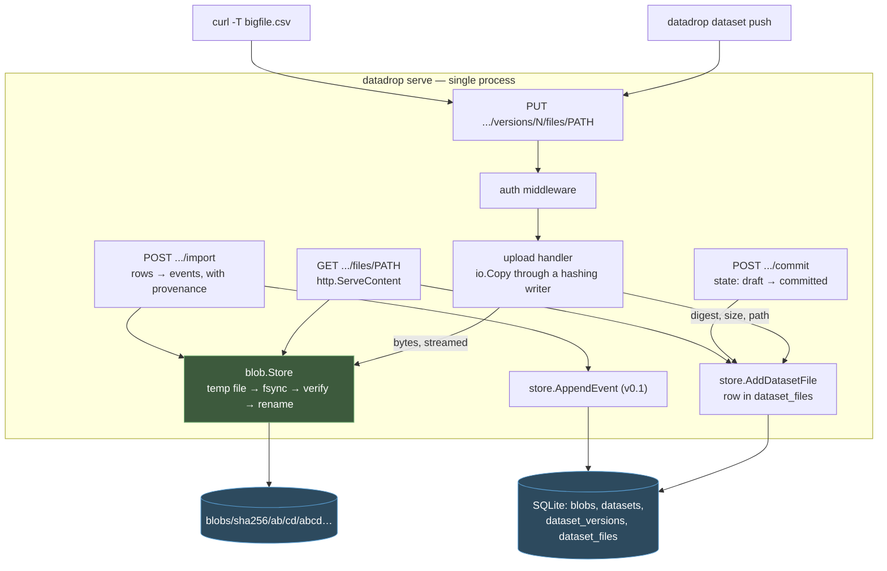
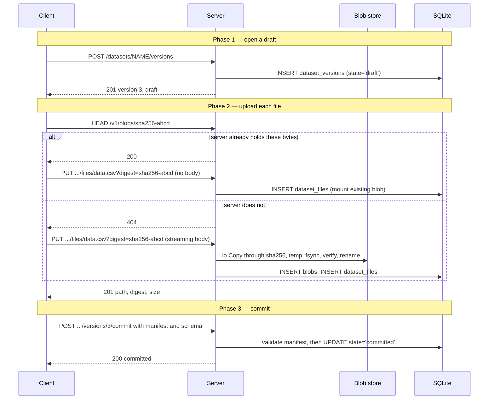

# PROJECT REPORT - go-go-datadrop v0.2 - Content-Addressed Datasets and the Staged Upload Protocol

This report explains the second layer of `go-go-datadrop`: bulk datasets. Where [[PROJECT REPORT - go-go-datadrop v0.1 - Building an Append-Only Event Store from Two Reference Implementations|v0.1]] stores small JSON events appended one at a time behind a 1 MiB body cap, v0.2 stores large, finite, immutable bodies of data with a manifest and schema attached, and retrieves them with byte-range support and integrity verification.

The design work that mattered was not selecting a storage layout. It was establishing that a dataset is not a stream, and then deriving the data model from that difference rather than from what happened to be convenient. Four properties separate the two, and each one determines a schema column or a protocol decision. This report works through that derivation, then through the implementation, then through the defects — several of which are instances of general patterns worth naming.

> [!summary]
> Five commitments carry the dataset layer:
> 1. **Blobs are addressed by their SHA-256 digest**, never by a generated identifier. The digest is simultaneously the storage key, the integrity check, the deduplication key, and the HTTP `ETag`.
> 2. **A version is invisible until committed.** Serving a half-uploaded dataset produces silently wrong analyses rather than errors, so every read path filters on the commit state.
> 3. **Committed versions are immutable.** A correction is a new version, which is what makes a version reference a stable citation.
> 4. **Uploads and downloads stream.** Neither side ever holds a whole file in memory, which rules out `io.ReadAll` and forces the digest to be computed during the write rather than after it.
> 5. **Nothing is visible at its final path until complete and verified.** Write to a temporary file on the same filesystem, fsync, verify, then rename.

## Why v0.1 could not absorb this

v0.1 models a sensor emitting a reading every thirty seconds. Pushing a 400 MB CSV of completed experiment output through the same path fails for four independent reasons, and it is worth separating them because they lead to different parts of the design.

**Size.** The ingest path caps request bodies at 1 MiB and decodes the body into memory to validate it. Neither is negotiable for a large file.

**Granularity.** Splitting a CSV into 18,000 individual events discards the fact that they arrived as one artifact. There is then no object to cite, no checksum to verify, and no way to express "give me exactly the file that produced this analysis".

**Description.** An event carries `source`, `type`, and `subject`. A dataset needs a title, a description, a license, provenance, a row count, and column documentation. The event envelope has nowhere to put any of it.

**Immutability with revision.** A stream is append-only and unbounded. A dataset is finite and complete, but gets corrected — version 2 supersedes version 1 as a whole, with possibly a different row count and different columns. The stream model has no notion of a version of the entire body.

## The derivation: four ways a dataset differs from a stream

Each difference below determines something concrete in the schema or the protocol. Working from the differences rather than from storage convenience produced answers that are straightforward to defend later.

**A stream's identity is its sequence; a dataset's identity is its content.** Two events with identical payloads are two distinct events at two distinct positions. Two uploads of identical bytes are the *same object* and should occupy storage once. That single sentence determines that the blob primary key is a digest rather than a position, and it makes deduplication a modelling consequence rather than an optimization added later.

**A stream is never complete; a dataset is either complete or a draft.** Querying a stream at any moment returns whatever has arrived so far, and that is correct. Returning a half-uploaded dataset is never correct: an analysis run against 300 MB of a 400 MB file produces wrong results with no error anywhere. This determines that the model needs an explicit commit boundary and that readers must never observe a version before it.

**A stream's unit of correction is one event; a dataset's is the whole body.** Correcting a stream appends a superseding event. Correcting a dataset replaces the file. Version numbers on the whole artifact express that; per-row supersession does not.

**A stream is read incrementally; a dataset is read whole or by byte range.** The v0.1 read API pages by sequence. A dataset consumer wants the entire file streamed to disk, or bytes 100 MB through 150 MB because a download was interrupted. Those are HTTP `Range` requests, not cursor pagination.

The two models coexist rather than compete. A dataset can be *materialized* into a stream, with each row becoming an event carrying provenance back to the version and row it came from — which is the subject of a later section, and the thing that makes the product one system rather than two features sharing a binary.

## Architecture

Datasets add one storage medium — the filesystem — alongside the existing SQLite metadata database. The split follows the upstream OpenDrop design's §20.5: the database holds descriptions and references, the object store holds bytes.



Two boundaries do real work. The blob store knows nothing about datasets, drops, or manifests — it maps a digest to bytes on the filesystem and exposes seven operations, which is what makes an eventual S3 backend a contained change. The dataset store knows nothing about how bytes are persisted; it records digests and sizes.

## Content addressing, and its four separate benefits

Addressing a blob by `sha256:abcd…` rather than by a generated identifier is often described as one idea. It is four, and they are worth separating because dropping any one of them would be a different loss.

**Deduplication is automatic.** A 2 GB file unchanged between version 1 and version 2 is stored once and referenced twice. For datasets that get corrected by re-uploading the whole body with one column fixed, this is the difference between linear and constant storage growth.

**Integrity verification is free.** There is no separate checksum column to store, keep in sync, or forget to check. Re-reading the file and re-hashing it either produces the address it is stored at, or the file is corrupt.

**Upload can be skipped entirely.** A client that knows the digest of what it is about to send can ask whether the server already holds it and skip the transfer. This is the largest practical win in the whole layer, and it is what justifies the staged upload protocol.

**The digest is the citation.** `sha256:abcd…` identifies those exact bytes independently of this server, this drop, and this dataset name. That is the property that makes a dataset reference reproducible.

### On-disk layout

```text
<data-dir>/
├── datadrop.db
└── blobs/
    ├── tmp/                        ← in-progress uploads, swept at startup
    │   └── upload-01KYAG…
    └── sha256/
        └── ab/
            └── cd/
                └── abcd1234…       ← the full digest is the filename
```

The two-level fanout on the first four hex characters bounds any single directory at roughly 65,536 entries. A flat directory holding a million files makes directory reads pathological on most filesystems and makes routine operational inspection unusable.

Temporary files live in a sibling directory on the **same filesystem** as the final location. This is a requirement rather than a preference: `os.Rename` is atomic only within a filesystem. With `tmp/` on `/tmp` and the blobs on a mounted volume, the rename degrades to a copy and the atomicity guarantee — the thing that prevents a partial blob from becoming visible — disappears without any error.

## The blob write path

```
Put(ctx, reader, expected) → (digest, size, deduplicated):

    tmp = create a temp file in <root>/tmp/
    defer: if not renamed, remove tmp

    hasher = sha256.New()
    size   = io.Copy(io.MultiWriter(tmp, hasher), reader)   -- streams; no buffering
    digest = "sha256:" + hex(hasher.Sum(nil))

    if expected != "" and digest != expected:
        return ErrDigestMismatch                            -- tmp is discarded

    tmp.Sync()                       -- the bytes are on disk before we claim they are
    tmp.Close()

    final = <root>/sha256/ab/cd/abcd…
    if final already exists:
        remove tmp; return deduplicated
    MkdirAll(dirname(final))
    os.Rename(tmp, final)            -- atomic within the filesystem
```

Four details in that sequence are load-bearing, and each has a test that fails if it is removed.

**`io.MultiWriter` hashes during the write.** Hashing afterwards would require either reading the file back — doubling the I/O — or holding it in memory, which the streaming commitment excludes.

**`Sync` precedes `Rename`.** Without the fsync, a crash after the rename can leave a file that exists at its final path with unwritten contents. The rename is atomic with respect to the directory entry, not with respect to the data.

**The existence check happens after the write, not before.** Checking first and skipping the write looks like an optimization and is a race: two concurrent writers of the same new blob both observe it missing and both proceed. Writing unconditionally and discarding on collision is correct under concurrency and costs one temporary file in the rare case where the collision actually occurs.

**A caller-supplied digest is verified, never trusted.** Trusting it would let a caller upload arbitrary bytes under the digest of a different file, so that every subsequent reader of that digest receives the attacker's content while believing the hash guarantees otherwise. The entire integrity argument for content addressing rests on the server being the party that computes the hash.

## Data model

Migration `0002_datasets.sql` adds four tables. The v0.1 conventions carry over unchanged: RFC3339 fixed-width text timestamps, JSON stored verbatim with selected fields extracted into columns for indexing, and audit rows that outlive their subject.

```sql
CREATE TABLE blobs (
    digest     TEXT PRIMARY KEY,        -- "sha256:<64 lowercase hex>"
    size_bytes INTEGER NOT NULL,
    created_at TEXT NOT NULL
);

CREATE TABLE datasets (
    drop_name    TEXT NOT NULL REFERENCES drops (name) ON DELETE CASCADE,
    name         TEXT NOT NULL,
    next_version INTEGER NOT NULL DEFAULT 0,   -- see "the allocator defect"
    created_at   TEXT NOT NULL,
    PRIMARY KEY (drop_name, name)
);

CREATE TABLE dataset_versions (
    drop_name    TEXT NOT NULL,
    dataset_name TEXT NOT NULL,
    version      INTEGER NOT NULL,
    state        TEXT NOT NULL,               -- 'draft' | 'committed'
    manifest     TEXT NOT NULL DEFAULT '{}',  -- verbatim JSON
    schema_spec  TEXT,                        -- optional JSON Schema, verbatim
    title        TEXT,                        -- extracted from the manifest
    license      TEXT,                        -- extracted
    row_count    INTEGER,                     -- extracted
    file_count   INTEGER NOT NULL DEFAULT 0,
    total_bytes  INTEGER NOT NULL DEFAULT 0,
    created_at   TEXT NOT NULL,
    committed_at TEXT,                        -- NULL while draft
    PRIMARY KEY (drop_name, dataset_name, version),
    FOREIGN KEY (drop_name, dataset_name)
        REFERENCES datasets (drop_name, name) ON DELETE CASCADE
);

CREATE TABLE dataset_files (
    drop_name    TEXT NOT NULL,
    dataset_name TEXT NOT NULL,
    version      INTEGER NOT NULL,
    path         TEXT NOT NULL,               -- "data/readings.csv"
    digest       TEXT NOT NULL REFERENCES blobs (digest),
    size_bytes   INTEGER NOT NULL,
    media_type   TEXT,
    PRIMARY KEY (drop_name, dataset_name, version, path)
);
```

Three modelling decisions are worth their justification.

**`title`, `license`, and `row_count` are extracted from the manifest into columns.** The manifest is stored verbatim so nothing a producer writes is lost, but listing datasets should not require parsing every manifest. This mirrors what v0.1 does with events: `data` verbatim, envelope fields in columns. The set is deliberately small, because anything indexed is effectively frozen — removing it later requires a migration.

**The commit boundary is a `state` column rather than a separate drafts table.** A draft becomes a committed version in place, so a state column is one `UPDATE` where two tables would require a delete, an insert, and the version number surviving the transition. The cost is that every read path must remember the filter, which is why the invariant is stated in the specification, in the schema comment, and as the first line of the review checklist.

**`idx_dataset_files_digest` exists for garbage collection**, which asks "is this digest referenced anywhere". Without the index that question is a full scan of every file row on every sweep.

## The allocator defect, and its general form

The first implementation of `OpenDatasetVersion` allocated the next version as `MAX(version) + 1` over `dataset_versions`. This is correct until deletion exists. Deleting version 3 makes `MAX` return 2, so the next open hands out 3 again — and a citation to "version 3 of readings-2026" silently begins resolving to different content, which defeats the entire point of immutable versions.

The fix is a `next_version` counter on the `datasets` row, advanced inside the allocating transaction. This is the same mechanism v0.1 uses for event sequences via `stream_heads`, and the same reason applies.

```sql
-- WRONG: deleting version 3 lets the next open reuse the number
SELECT COALESCE(MAX(version), 0) FROM dataset_versions
 WHERE drop_name = ? AND dataset_name = ?

-- RIGHT: a counter that only moves forward, advanced in the same transaction
SELECT next_version FROM datasets WHERE drop_name = ? AND name = ?
UPDATE datasets SET next_version = ? WHERE drop_name = ? AND name = ?
```

The general form is worth stating, because this project has now encountered it twice in two milestones:

> **An allocator that reads its next value from the rows it allocates for is correct only if those rows are never deleted.**

The mistake is not obviously wrong when written. It is wrong only in combination with deletion, and deletion is routinely implemented after allocation. The test that caught it asserts monotonicity *across a deletion* specifically because the specification claims version references are stable citations; a test that opened three versions in sequence would have passed.

## The staged upload protocol

The obvious design is one request carrying the manifest and the file as multipart. It was rejected for three reasons, and stating them is more useful than presenting the staged protocol as self-evidently correct.

A multipart body is parsed sequentially, so a manifest appearing after the file part cannot be validated until the whole file has been consumed. If the manifest then turns out to be invalid, 400 MB has already been transferred and written. Ordering the parts fixes this but relies on client cooperation that nothing enforces.

Multi-file datasets in one multipart body make partial failure ambiguous. If the third of five files fails, the version's state is undefined. With staged uploads each file is its own request with its own outcome, and the version simply remains a draft until the client commits.

Most importantly, a staged protocol is what makes the digest precheck possible.



The mount form — a digest with no body — is distinguished from an ordinary empty upload by `?digest=` combined with `ContentLength == 0`. Getting this discrimination backwards would either make zero-byte files impossible to store or turn a failed upload into a silent mount of whatever digest the client named. The mount path still performs real work: it verifies the blob exists, stats it for the size, and inserts the metadata row.

A single-shot convenience form, `PUT .../datasets/{name}/data`, exists so that `curl -T readings.csv` works. It is implemented in terms of the staged operations rather than as a parallel path, so there is exactly one commit implementation and one place where the state transition can be wrong.

### The measurement

The protocol was justified by an argument about re-uploading unchanged files. Publishing a 645 KB CSV plus a README, then editing only the README and republishing, produces:

```
uploaded 1 file(s) (71 B), reused 1 already-stored file(s) (644.6 KiB)
```

Three blobs on disk backing two versions of two files; 692 KB rather than 1.3 MB. The end-to-end test asserts both the message and the blob count, so the central design claim is a regression test rather than prose.

## Retrieval

Downloading a file is `http.ServeContent` over the blob's `*os.File`. Using the standard library here rather than hand-rolling is deliberate: `ServeContent` supplies `Range` requests including multi-range, `If-None-Match`, `If-Modified-Since`, `Accept-Ranges`, and a correct `Content-Length`, all without a line of parsing. Hand-rolled `Range` handling is a well-known source of off-by-one errors and of incorrect responses to unsatisfiable ranges.

```go
w.Header().Set("ETag", strconv.Quote(record.Digest))
w.Header().Set("Content-Disposition", `attachment; filename="`+path.Base(record.Path)+`"`)
http.ServeContent(w, r, record.Path, committedAt, file)
```

The `ETag` is the digest, which makes it a genuinely strong validator: two responses carrying the same `ETag` are byte-identical by construction rather than by convention. Verified against a live server:

```
Range: bytes=0-11         → 206, Content-Range: bytes 0-11/41
If-None-Match: "<digest>" → 304
```

`latest` resolves to the highest **committed** version. The state filter is the entire point: a draft version 4 must not shadow committed version 3 for a reader asking for the latest, or a consumer would observe the dataset appear to change and then fail to download.

The archive endpoint streams a whole version as `tar` — the manifest as `manifest.json`, the schema as `schema.json`, and every file at its logical path. `tar` rather than `zip` because it can be written as a pure stream, where `zip` requires seeking back to patch a central directory, which is impossible on a response body and would force buffering the whole archive.

## Materializing datasets into streams

This is the bridge that makes the two halves one product. `POST .../versions/{v}/import` parses a CSV or NDJSON file from a committed version and appends one event per row, each carrying provenance back to the exact bytes it came from.

```json
"meta": {
  "dataset": "readings-2026",
  "dataset_version": 3,
  "dataset_path": "data/readings.csv",
  "digest": "sha256:3accaa4c…",
  "row": 42
}
```

Three decisions in this path are worth recording.

**Event identifiers are deterministic.** They derive from `sha256(digest + "#" + row)`, so a repeated import replays the same identifiers and the v0.1 append path returns the originals rather than duplicating. An interrupted import is re-run, not repaired; the second run reports `appended=0, skipped=2`. This reuses v0.1's idempotency rather than adding new machinery, which is the reason that behaviour was built into v0.1 in the first place. Deriving from the digest rather than the dataset name means the same content imported under two names produces the same identifiers, so importing a renamed copy does not duplicate events.

**CSV cells are typed.** CSV has no types, so a naive import makes every field a string, and a dataset schema declaring `"type": "number"` could never be satisfied — the schema feature would be useless in precisely the case it is most wanted. A cell that parses as a number becomes one, `"true"` and `"false"` become booleans, and everything else stays a string.

The sharp edge is that `strconv.ParseFloat` is more permissive than JSON. It accepts hexadecimal float syntax such as `0x1p-2`, which JSON cannot represent and which in practice is far more likely to be an identifier than a number. That form is excluded explicitly, and a test pins it.

**Schema violations are advisory by default.** This differs from v0.1 ingest, where a single event either belongs in the stream or does not. The difference is that a bulk operation has a partial-failure state a single append does not: aborting a 100,000-row import on row 40,000 leaves the stream holding 40,000 events nobody asked for and cannot easily undo. Permissive is therefore the default and `?strict=true` opts into rejection.

## Deletion and garbage collection

Deleting a version removes its file records and leaves the bytes in place, because other versions may share them. Unreferenced bytes are reclaimed by an explicit sweep rather than by reference counting.

Reference counting on the `blobs` row is the obvious design and is wrong for this codebase: it adds a write to every upload path, it must be decremented correctly on every deletion path including cascades, and a counter that drifts either leaks storage forever or deletes live data. A sweep is O(files) per run, runs rarely, and is auditable by inspection.

```
GC(minAge):
    referenced = SELECT DISTINCT digest FROM dataset_files
    for each blob file on disk:
        if its digest is not in referenced and its mtime is older than minAge:
            delete it
```

The **grace period is a correctness requirement, not a tuning knob.** A blob written moments ago for a draft whose `dataset_files` row has not yet been inserted is legitimately unreferenced, and a sweep without an age floor would delete it out from under an in-flight upload. Over HTTP, `min_age_seconds=0` selects the default rather than disabling the check, so there is no request that turns the protection off. Only the Go API accepts a negative age, and that is documented as test-only — an operator debugging a full disk is exactly the person who would otherwise reach for a "just delete everything unreferenced" flag.

A related subtlety: **draft files count as referenced.** The intuitive answer is that a draft is not visible so its bytes are not in use, and that answer deletes data. `ReferencedDigests` deliberately does not filter on state, and a test asserts that a draft's digests appear in the referenced set. The blob store's grace period covers the narrower window before the metadata row exists at all; the referenced set covers everything after it.

## Defects, and the patterns behind them

Several defects in this milestone are instances of general patterns rather than isolated mistakes.

**A client's default header treated as a factual claim.** Uploading `README.md` with `curl --data-binary` and no explicit `-H` recorded `media_type: application/x-www-form-urlencoded`, which is what curl sends when it has no opinion. Because versions are immutable, that wrong value would have been permanent.

The fix distinguishes a *deliberate* `Content-Type` from a *default* one. A deliberate type wins, because it is the only thing that can describe a file with no extension; the two known client defaults lose to the filename extension, because they carry no information.

| Declared `Content-Type` | Extension | Recorded |
|---|---|---|
| `text/csv` | `.bin` | `text/csv` — a deliberate type wins |
| `application/x-www-form-urlencoded` | `.md` | `text/markdown` — a client default loses |
| `application/octet-stream` | `.csv` | `text/csv` — likewise |
| *(none)* | `.csv` | `text/csv` |
| `text/csv` | *(none)* | `text/csv` |

**A security control tested against the wrong vector.** `http.ServeMux` cleans the request path before routing, so a `PUT` to `.../files/../../escape.md` never reaches the handler: the path collapses to something matching no route and the mux returns `405`. The URL-path traversal vector is therefore closed by the standard library.

This means path validation is not redundant, but its real target is different: the `?path=` query parameter on the single-shot endpoint, which nothing normalizes. Testing only the URL-path form would have produced a passing test suite while leaving the vector that actually needs the validation unverified.

**A test that could not fail.** Asserting determinism as `importEventID(d, 1) != importEventID(d, 1)` compares a pure function to itself. `staticcheck` flagged the identical expressions under `SA4000`.

The property actually worth pinning is stability *across releases*: changing the derivation silently breaks idempotency for every already-imported dataset, because a re-run would produce new identifiers and duplicate every row. That requires a golden value. The golden value was then derived independently in Python rather than copied from the implementation's output — copying the output of the code under test would make the assertion say only that the code does what it does.

```python
"ds-" + hashlib.sha256((digest + "#1").encode()).hexdigest()[:32]
```

**Over-specified tests failing on unrelated change.** Two v0.1 tests hardcoded `schema version = 1` and `migration applied 1 time`. Adding migration `0002` broke both. They now derive the expectation from `loadMigrations()`, so the next migration will not edit them either. The meaningful assertion was always "matches the embedded set", never a literal.

## Testing

The test split mirrors v0.1: storage-level tests exercise SQL invariants against a temporary-file database, and service-level tests exercise behaviour against a real store rather than a mock. There is no mock layer.

| Package | Tests | What is asserted |
|---|---:|---|
| `pkg/blob` | 20 | Dedup down to one file on disk; digest-mismatch rejection leaving no trace; an interrupted body publishing nothing; temp sweep on re-open; GC honouring the grace period; eight hostile digest strings including path traversal |
| `pkg/datadrop` | 11 | Path and name validation boundaries; manifest parsing and rejection |
| `pkg/store` | 56 | Version monotonicity **across a deletion**; draft invisibility on all five read paths; immutability; duplicate paths; cascade on drop deletion; audit coverage |
| `pkg/schema` | 12 | Strict and permissive results; extension keywords surviving; cache keyed by version |
| `pkg/stream` | 8 | Fan-out, eviction, non-blocking publish |
| `pkg/server` | 81 | Full dataset lifecycle; the mount fast path; both size caps; media-type inference; `Range`/`ETag`/`304`; `latest` skipping drafts; drafts unreadable in metadata *and* bytes; self-describing archive; import provenance and idempotency; GC grace period |
| `pkg/client` | 10 | Auth header present with a token and absent without one; problem-document decoding; SSE parsing |
| `pkg/cli` | 9 | The `key=value` typing heuristic; exit-code mapping |
| `cmd/datadrop` | 6 | End-to-end against a real binary and socket |
| **Total** | **213** | 88 added by this milestone |

Two properties are worth singling out.

**Draft invisibility is tested as five subtests, one per read path.** The commitment is that *every* read path filters on the committed state, and the only honest way to test "every" is to enumerate them. A future read path that forgets the filter will not be covered, which is why the review checklist also asks the question in prose.

**The end-to-end test proves the integrity check fires.** It is easy to write a verification step and never learn whether it works. The test corrupts a blob on disk and re-downloads:

```
datadrop: integrity check failed for .../readings.csv:
  content hashes to sha256:ab2b49b0…, manifest says sha256:3accaa4c…
exit code 1
```

## Repository layout

Repository: `/home/manuel/code/wesen/go-go-golems/go-go-datadrop`

```text
cmd/datadrop/       entry point + end-to-end smoke tests
pkg/datadrop/       shared domain types (envelope, drop, schema, query, dataset)
pkg/store/          SQLite persistence, embedded forward-only migrations
pkg/blob/           content-addressed blob store          ← new in v0.2
pkg/schema/         JSON Schema compilation and validation
pkg/stream/         in-process fan-out hub
pkg/server/         net/http ServeMux HTTP surface
pkg/client/         typed HTTP client
pkg/cli/            cobra command tree
ttmp/2026/07/24/DATADROP-2--.../    docmgr ticket workspace
```

The milestone added roughly 6,000 lines across 25 files, in thirteen commits covering eleven planned tasks, and thirteen HTTP endpoints: eleven dataset routes plus `HEAD /v1/blobs/{digest}` and `POST /v1/blobs/gc`.

The most useful files for a reader starting cold:

- `pkg/blob/store.go` — the write path, with its four load-bearing details
- `pkg/store/datasets.go` — the draft/committed state machine and the version allocator
- `pkg/server/handlers_blobs.go` — upload with the mount fast path, download, archive
- `pkg/server/handlers_import.go` — materialization, `csvValue`, `importEventID`
- `pkg/server/handlers_gc.go` — why `min_age_seconds=0` means "default", not "disabled"

## Important project docs

The docmgr ticket workspace carries the full design lineage:

- `design/01-intern-implementation-guide.md` — a sixteen-section specification: why a dataset is not a stream, five design commitments, the blob store write path, the SQL model, the three-phase upload protocol including why multipart was rejected, retrieval, materialization, HTTP and CLI references, an eleven-step package plan, a review checklist, and a deferral table
- `reference/01-implementation-diary.md` — five chronological steps recording what was built, what failed, and what a reviewer should check

Both are reconciled with the shipped implementation and carry inline markers where the built system diverged from the specification.

## Key points

- A dataset differs from a stream in four ways, and each difference determines something concrete in the schema or protocol. Deriving the model from those differences produced decisions that are straightforward to defend rather than to rationalize.
- The digest is the storage key, the integrity check, the deduplication key, and the `ETag`. Those are four separate benefits of one decision.
- A version is invisible until committed, and committed versions are immutable. Together these make a version reference a stable citation.
- Nothing is visible at its final path until complete and verified: temp file on the same filesystem, fsync, verify, rename, with cleanup on every failure path and a sweep at startup.
- A caller-supplied digest is verified, never trusted; the integrity argument depends on the server computing the hash.
- The staged protocol exists so the digest precheck can exist. Measured: a republish with one changed file transferred 71 B rather than 645 KB.
- `http.ServeContent` supplies `Range`, `If-None-Match`, and `Accept-Ranges` correctly and for free.
- Materialized events carry provenance to the exact bytes and row, and deterministic identifiers make a re-run resume rather than duplicate.
- Garbage collection uses an explicit sweep with a mandatory grace period rather than reference counting, and draft files count as referenced.
- An allocator that reads its next value from the rows it allocates for is correct only if those rows are never deleted.

## Open questions

- **Abandoned drafts are never expired**, so they pin their blobs against the sweep indefinitely. A client that fails repeatedly accumulates them, and nothing currently reclaims either the draft rows or the bytes.
- Whether `pkg/blob.Store` should become an interface now or when an S3 backend actually arrives. The specification assumes the latter, and the seven-operation surface is small enough that either is defensible.
- CSV export in v0.1 and the CSV import path in v0.2 now both encode assumptions about flattening and typing. They are not currently shared, and they should probably agree.
- `handleHeadBlob` gates existence on the instance token with no per-drop check, because a blob has no owning drop. That is correct for a single-token deployment and becomes a question when per-capability tokens arrive: the existence of a digest is a small information leak.
- The dataset schema cache key reuses the `Stream` field to hold `"<dataset>#v<version>"`. It works and is correctly version-keyed, but it is a field being used for something other than its name.

## Near-term next steps

- Expire abandoned drafts, which would also release their blobs to the sweep.
- Background import jobs with progress reporting, replacing the current row-capped synchronous import.
- A `Content-Digest` response header on download, so a client can verify without having first fetched the manifest.
- Confirm the archive layout against the upstream `.dropbundle` format before anything depends on it, so dataset export and drop export do not diverge.

## Project working rule

Every structural decision in the dataset layer exists to preserve one of the five commitments listed at the top. Before simplifying anything, identify which commitment it touches. If it touches none, simplify freely; if it touches one, the specification and the diary record why the current shape was chosen, and that reasoning should be addressed rather than rediscovered.
