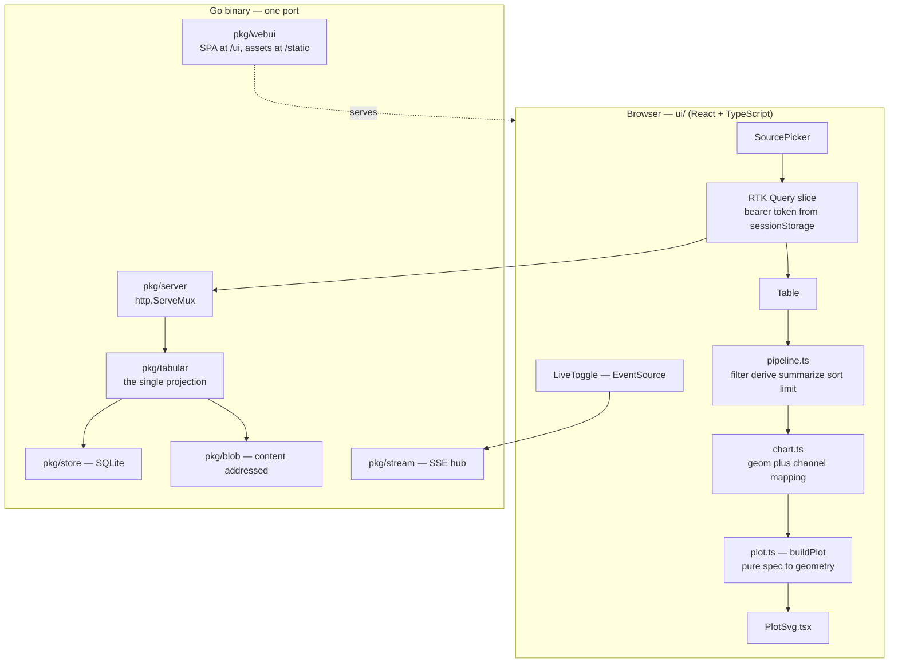

# PROJECT REPORT - go-go-datadrop v0.3 - One Typed Table, and Four Defects Only a Browser Could Find

This report explains the third layer of `go-go-datadrop`: a browser visualization workbench over the two storage shapes the earlier layers built. [[PROJECT REPORT - go-go-datadrop v0.1 - Building an Append-Only Event Store from Two Reference Implementations|v0.1]] stores small JSON events in an append-only log; [[PROJECT REPORT - go-go-datadrop v0.2 - Content-Addressed Datasets and the Staged Upload Protocol|v0.2]] stores large immutable dataset versions behind content-addressed blobs. Neither offers any way to look at what it holds. Every question of the form "is this sensor drifting" required leaving the system.

The design started from an existing artifact — a 2772-line single-file React grammar-of-graphics workbench built for an unrelated experiment — and the interesting work was not porting it. It was determining what changes when the same interaction model sits on top of a server that already knows things the artifact had to guess. The answer turned out to be one decision with a long list of consequences, and the second half of this report is about four defects that survived design review, code review, and a passing test suite, and were caught only by opening the result in a browser.

> [!summary]
> - Every source becomes one type: a `Table` of named, typed columns. The projection happens on the server and nowhere else, so the CSV export and the chart cannot disagree about what the columns are.
> - The browser never infers column types. A dataset version carries a JSON Schema and event payloads are already typed JSON; re-deriving types client-side discards that and produces two components answering one question by different methods. Every field reports its type *and its provenance*.
> - Truncation is answered exactly rather than estimated, by requesting one row beyond the budget. A full page is not evidence of a remainder.
> - Four defects reached a running server. Three of them produced a working-looking screen with no error anywhere. The general lesson is that a browser-facing feature must be *driven*, not reviewed.
> - Shipped in six commits: 69 files, 10 337 insertions. 259 Go tests, 58 TypeScript tests, zero lint findings.

## What the earlier layers left undone

The v0.2 server exposed 23 routes and a typed Go client. To see a column's distribution you downloaded a dataset file and opened it elsewhere; to see whether a stream was drifting you piped `datadrop read` into `jq` and read numbers. This is not a gap in capability — the data was all reachable — but it made the system a place data passed through rather than a place work happened.

Two facts from the survey of the existing code shaped everything that followed.

The first is that **there was no way to list the streams in a drop**. Streams are created implicitly by appending to them; there is no registration step and no stream table. The only record that a stream ever existed is `stream_heads`, the per-`(drop, stream)` sequence allocator. A source picker cannot be built without a catalogue, so one had to be derived from the allocator.

The second is that **the rules a chart must obey already existed, inside the CSV export handler**. `pkg/server/handlers_export.go` flattens an event payload into dotted-path columns with a contract pinned in a comment: envelope columns first in a fixed order, then `data.<key>` sorted; nested objects become `data.location.lat`; arrays become compact JSON in the cell; a missing value is an empty cell and not the string `null`. Any chart that showed different columns than the export would make "download this chart's data" produce a file that did not match the picture above it.

## The derivation: a chart consumes a table

A chart does not consume a stream, and it does not consume a dataset. `geom_point` needs to know that the `x` column is quantitative so it can construct a linear scale. It does not need to know that the numbers arrived as CSV cells inside a blob addressed by SHA-256, or as `data.temp_c` inside a CloudEvents envelope with sequence 41 991.

The whole feature therefore factors into two halves meeting at one type:

- The left half is a **projection**: source to table. It belongs on the server, because only the server holds the bytes, only the server knows the dataset's JSON Schema, and only the server can apply a row cap before megabytes cross the network.
- The right half is a **grammar of graphics**: table plus specification to geometry. It belongs in the browser, because it must respond in milliseconds to a dropdown change and it needs no privileges.

Two consequences are worth stating explicitly, because each one saves a day.

**There is exactly one place where a source becomes a table.** If a second CSV parser appears — in the browser, say, because the dataset download endpoint already returns CSV bytes — the result is a system where the chart and the export disagree and nothing detects it.

**The grammar of graphics never learns where a table came from.** `evaluate(table, steps)` and `buildPlot(table, spec, w, h)` take their arguments and nothing else: no store, no React context, no module-level registry. This is what allows the entire plotting layer to be unit-tested with no DOM and no server, and it is why the pure model could be built and tested before the endpoints that feed it existed.

## Why the browser must not infer types

The reference artifact determines each column's type by examining its values:

```js
function inferType(values) {
  const nonEmpty = values.filter((v) => v !== "" && v != null);
  if (!nonEmpty.length) return "n";
  if (nonEmpty.every(isNum)) return "q";
  if (nonEmpty.length >= 3 && nonEmpty.filter(isISODate).length / nonEmpty.length > 0.8) return "t";
  return "n";
}
```

That is correct for an artifact with no server, receiving a CSV file dropped onto a browser window. It is wrong here, for three independent reasons.

**The answer is already known.** A dataset version can carry a JSON Schema (`pkg/datadrop/dataset.go`). If it declares `{"station_id": {"type": "string"}}`, then `station_id` is nominal. A value-sniffer looking at `["001", "002", "003"]` concludes quantitative, plots station identifiers on a linear axis, and draws a regression through them. The producer wrote the answer down and the system discarded it.

**The disagreement is invisible.** Event payloads are JSON, so a number is already a number on the wire. If the browser re-derives types from rendered strings, a payload `{"n": 3}` and a CSV cell `3` become indistinguishable — which they are not, because the CSV cell may be a zero-padded code and the JSON number cannot be. Two components deciding the same question by different methods will eventually diverge, and nothing will report it.

**Sniffing requires the data.** The row budget means the browser sees a bounded sample. Inference over a sample can be wrong where inference over the whole file would not: the first 5000 rows of a column may all parse as numbers while row 90 000 holds `"N/A"`.

So the server produces the typed table, and **every field records how its type was decided**:

```json
{"name": "data.temp_c",  "type": "q", "inferred_from": "values"}
{"name": "station_id",   "type": "n", "inferred_from": "schema"}
{"name": "time",         "type": "t", "inferred_from": "envelope"}
```

`inferred_from` costs one string per field and changes what the product can say. The interface can report "typed from the dataset schema" rather than "guessed from 500 sampled values", which turns a wrong guess into something a user can see and correct rather than a mystery. A client may *override* a type — that is a presentation decision, local to one chart — but it may not *derive* one.

## Architecture



Read the diagram for what is absent. There is no arrow from `pipe` back to `routes`: the transformation pipeline never asks the server to do anything. There is no arrow from the browser to `store`. And `tabular` sits between the routes and both storage layers, which is the structural expression of the single-projection rule.

## The seam

`pkg/tabular` imports `pkg/datadrop` and nothing else from the repository — in particular not `pkg/store`, so its tests link no SQLite driver and run against literals.

```go
type FieldType string   // "q" quantitative | "n" nominal | "t" temporal
type TypeSource string  // "schema" | "envelope" | "values" | "default"

type Field struct {
    Name           string     `json:"name"`
    Type           FieldType  `json:"type"`
    InferredFrom   TypeSource `json:"inferred_from"`
    Distinct       int        `json:"distinct,omitempty"`
    DistinctCapped bool       `json:"distinct_capped,omitempty"`
    NullCount      int        `json:"null_count,omitempty"`
}

type Table struct {
    Source    SourceRef        `json:"source"`
    Fields    []Field          `json:"fields"`
    Rows      []map[string]any `json:"rows"`
    RowCount  int              `json:"row_count"`
    Truncated bool             `json:"truncated"`
    Strategy  string           `json:"strategy"`   // "head" | "latest"
    NextAfter int64            `json:"next_after,omitempty"`
}
```

The three-letter type vocabulary is doing more work than it appears to. It is not a data type. It is the minimum a scale constructor needs: whether to build a continuous domain, a discrete band, or a time axis. That is precisely why an override is a chart-local presentation choice and never a change to the source.

Rows are maps rather than positional slices. A columnar encoding is smaller on the wire and is the right call at a hundred thousand rows; at the budget actually shipped the difference is a few hundred kilobytes, and the map form means an absent key is simply absent rather than requiring a null sentinel. The columnar form is recorded as deferred with an explicit trigger — a median response above roughly two megabytes — rather than left as an unexamined choice.

### Two sets of rules that moved rather than being reimplemented

The dotted-path flattener moved out of `handlers_export.go` into `pkg/tabular/flatten.go`, parameterized by a leaf handler so that one walker produces both `FlattenStrings` (CSV cells) and `FlattenValues` (typed table cells). The CSV/NDJSON row readers moved out of `handlers_import.go` unchanged. That the existing export and import tests passed without modification is the evidence the relocation was faithful, and it is worth more than any test written specifically for the new package.

This is not refactoring for tidiness. It is the mechanism that makes the export and the chart agree, replacing an intention with a structural guarantee. A test in `pkg/server` compares the export's CSV header against the table's field list element by element, in order, and says so out loud.

The canonical timestamp format moved too — from `pkg/store` into `pkg/datadrop`, with `store.TimeFormat` left as an alias so no call site changed. Three layers need that format: the database, the CSV export, and the table projection. A format that two of them agree on is a defect waiting for the third.

## The inference ladder, and how far it must reach

```
1. a fixed envelope column   -> (its type,      envelope)
2. the version's JSON Schema -> (mapped type,   schema)
3. the observed values       -> (inferred type, values)
4. nothing observed          -> (nominal,       default)
```

Step 3 keeps the reference artifact's 80 % threshold and three-value minimum. Those are tolerances for dirty data, not confidence measures: a column of dates with a few `"unknown"` entries should still get a time axis. Both boundaries are pinned by tests — the 80 %-exactly case resolves to nominal, the 83 % case to temporal.

Instant recognition is deliberately strict. A regex accepting `2026-13-45` would type a column of malformed dates as temporal and produce an unreadable axis. A heuristic accepting bare integers as Unix epochs would convert a scatter plot of counts into a date axis. A column of epoch seconds stays quantitative until a human says otherwise.

The subtler point is **how far the schema has to reach**. Getting the type right is not the whole job. Consider a CSV column of zero-padded identifiers with a schema declaring it a string:

```
station_id,population
001,1200
002,4300
```

The field came back correctly as nominal-from-schema — and the value came back as the number `1`, because `CSVValue` had already coerced it. CSV has no types, so the reader guesses, and its guess is destructive: by the time a row is a JSON object the original text no longer exists. Typing the column while having already destroyed its contents solves half a problem. The schema had to be passed down to the reader as `ReadOptions.TextColumns`, so declared string columns are never coerced in the first place.

The general form is worth keeping: **a coercion cannot be reversed by a later layer, so information that constrains a coercion must reach it before it happens.** Types flow forward.

## The row budget, and answering truncation exactly

A dataset file may be five gigabytes. A browser SVG stops being interactive somewhere around twenty thousand marks. These numbers do not meet, and pretending they do is how visualization tools acquire a reputation for hanging.

```go
const DefaultTableRows = 2_000
const MaxTableRows     = 50_000
```

Three selection strategies were considered. `head` — the first *N* in file order — costs one streaming pass and stops early, but is biased toward the beginning of the file. `latest` — the last *N* by sequence — is free for streams because the query already supports descending order, and is the right default for a timeseries, which should open on the recent past rather than on the first readings ever taken. `stride` — every *k*-th row — is unbiased for an ordered file but needs a total row count, so it requires either a full pre-pass or a manifest that reliably carries `row_count`. v0.3 ships `head` for files and `latest` for streams; `stride` is deferred with that condition recorded rather than forgotten.

An over-large `?limit` is clamped rather than rejected. "Give me everything" is a reasonable request, and a 400 teaches the caller nothing that the response's own `row_count` and `truncated` do not already say.

### Truncation is determined, not estimated

The first implementation reported truncation when a page came back full — the obvious rule, and the one the design document originally specified. A test asking for exactly 1005 rows from a stream holding exactly 1005 events failed: it reported truncation for a stream that had been read completely.

The fix is to request one row beyond the budget. Receiving it proves a remainder exists; not receiving it proves one does not. The cost is a single row, and the result is an exact answer rather than a conservative guess. It also matches the file path, where the reader reaches EOF and genuinely knows.

Why this matters more than the one-row saving suggests: a banner that sometimes fires when nothing was truncated is a banner users learn to ignore, and then it fails to warn them on the occasion that counts. Reporting truncation when there is none is a false statement in the direction that destroys the mechanism's value.

Truncation is then carried all the way to the screen. The response sets `"truncated": true` and names the `"strategy"`; the interface renders a banner that cannot be dismissed, because a user who dismisses it and then screenshots the chart has produced a misleading artifact. The wording is "the first 2 000 of **at least** 2 000 rows" — a streaming reader that stops at the cap does not know the total, and claiming a number you did not count is worse than admitting you did not count it.

And the banner tells the user to raise the row limit, which meant a control had to exist for it. Advice that cannot be acted on is worse than no advice.

## Two limits with the same name

`?limit` on `/events` means "up to a thousand envelopes". `?limit` on `/table` means "up to fifty thousand rows". They share a parser, a struct field, and a normalizer — and the normalizer belongs to the smaller of the two.

The complication is that `EventQuery.Normalize` is called twice: once by the handler's parser, and again inside `Store.QueryEvents`. Setting `query.Limit = 5000` after parsing is therefore insufficient; the store clamps it straight back to 1000.

Three options were available. Threading a second limit through would have meant a parallel query path. Special-casing inside `Normalize` would have made the query type know about the visualization layer. The shipped answer is a new field:

```go
// LimitCap bounds Limit after the default is applied. Zero selects MaxLimit.
//
// The cap is set by the handler, never parsed from the URL, so a client
// cannot raise its own ceiling.
LimitCap int
```

One query path, one clamp, two budgets. The residual risk is that the interaction is invisible: a future edit to `Normalize` could silently cap every chart at a thousand points and nothing would fail. A test that requests 1005 rows and asserts it receives 1005 is the only guard, and its failure message states what went wrong rather than merely what differed.

## Serving the interface

The usual arrangement mounts a single-page application at `/` with a fallback returning `index.html` for anything unmatched. That fallback catches a mistyped `/v1/drop` and returns an HTML page where the client author expected a 404 — a failure that is genuinely difficult to diagnose from the calling side.

So the mounts are:

| Path | Handler |
|---|---|
| `GET /` | 302 to `/ui/` |
| `GET /ui/{path...}` | the shell, falling back to `index.html` |
| `GET /static/{path...}` | the hashed bundles, **no** fallback |

Assets live under `/static` per the project's own frontend conventions, and Vite is configured with `base: "/static/"` so every URL it emits already points there. A test asserts that `/v1/drop` still returns 404 and does not contain HTML.

The asset path deliberately has no `index.html` fallback. A stale cached shell requesting a chunk from a previous build should receive a 404 and fail loudly, rather than receiving HTML and reporting an unrelated JavaScript syntax error.

The bundle is embedded with `//go:embed all:dist`. The `all:` prefix matters: without it, `embed` skips files whose names begin with `_` or `.`, and Vite emits such names often enough that a chunk goes missing and the failure appears only as a browser console 404.

The design document originally specified the build-tag pattern from the house frontend skill — paired `//go:build embed` and `//go:build !embed` files, so a developer gets disk-backed assets without a rebuild. That was dropped. The Vite dev server on port 5173, proxying `/v1` to the Go server, provides the same capability with hot reload and no build tags at all; two build configurations that must both compile is a real ongoing cost, and a runtime `--ui-dir` flag is not. `pkg/webui/dist` is committed, which is what makes embedding work: a `go install` of this module must not require a JavaScript toolchain.

## The grammar of graphics

Everything under `ui/src/model` is pure. No React import, no network, no globals. This is a rule rather than a convention, and it is what lets `bun test` exercise the whole plotting layer headlessly.

The pipeline is five verbs — filter, derive, summarize, sort, limit — over plain row objects, applied in order, each independently toggleable. Its semantics are pinned so that the tests and the implementation cannot drift apart:

- An unconfigured filter passes everything rather than dropping every row. A workbench where a half-typed filter blanks the screen is not usable.
- A filter naming a field the pipeline no longer produces sets an error and is skipped; it does not throw. `evaluate` is total.
- `derive` appends a quantitative field and **drops rows whose result is not finite**. This is the reference artifact's behaviour and it is defensible — a chart cannot plot NaN — but it is surprising, so the editor displays the count of removed rows next to the step.
- `summarize` collapses to exactly two columns: the group key and the aggregate. This is a deliberate simplification of a real group-by, and the editor says so, because silently losing the other columns costs an afternoon.

`schemaAfter(table, steps, upto)` computes the field list after the first *k* steps without touching rows. Step editors use it so that step 3's dropdown offers exactly what steps 1 and 2 produce — including `mean_population`, which does not exist in the source table. Offering the source columns everywhere would let a user construct a pipeline that cannot run and discover it only from the chart's problem list.

### The plot engine returns geometry, not SVG

```ts
type Mark =
  | { kind: "circle"; x: number; y: number; r: number; fill: string; row: Row }
  | { kind: "rect"; x: number; y: number; w: number; h: number; fill: string; row: Row }
  | { kind: "path"; d: string; stroke?: string; fill?: string; fillOpacity?: number };
```

Separating geometry from rendering is what makes the engine testable: a test asserts that the mark for a given row lands at a particular coordinate, without a DOM, a browser, or a snapshot file nobody reads. `PlotSvg.tsx` contains no scale arithmetic at all — if a mark is in the wrong place, the defect is in `plot.ts` and a unit test can locate it.

`buildPlot` refuses to draw rather than drawing something wrong, and every refusal names what to change:

```
x ↦ population is not in the pipeline output
map y to a field
bar wants a nominal or temporal x — add a summarize step, or map x to a category
the pipeline output is empty — a filter step is too strict
```

An empty chart with a sentence explaining why is a usable product. An empty chart with a silent NaN in the transform is not.

Two scale decisions are worth recording. A bar or area extends its y domain to include zero, because a bar whose baseline is not zero misrepresents magnitude. And the size channel is square-rooted, so that *area* rather than radius tracks the value; a linear radius exaggerates large values by the square, which is the most common quantitative-encoding error in charts and which the code comments say explicitly.

## Four defects a browser found and reading did not

The design was reviewed. The code was reviewed. 259 Go tests and 58 TypeScript tests passed. Then the server was started with a hundred and twenty real sensor readings and the interface was opened, and four defects appeared in a single session. Each is a category of mistake rather than a typo, and three of them produced no error anywhere.

### 1. The default chart plotted the row number

`defaultChart` selected the first quantitative field and the first nominal field. On a stream table, those are the envelope columns `seq` and `id`. The result was sequence against time — a straight line conveying nothing — accompanied by a legend with one entry per row.

The fix has two parts, and both are only available because the server reports more than it strictly must. Payload columns now outrank envelope metadata: `data.temp_c` is what the producer measured, while `seq` is a row number the server assigned. And a colour candidate must have between 2 and 8 distinct values — a count the server already provides in `Field.Distinct`, which exists precisely so a client can decline to draw a legend longer than its chart.

### 2. A temporal x-axis was a discrete band scale

Carried over from the reference artifact, where it is correct: that artifact's temporal data was twenty-four monthly buckets. For a stream of sensor readings it produced one evenly spaced slot per reading — drawing uneven intervals evenly, which misrepresents the data — labelled with full ISO timestamps.

The fix is a real time scale in `ui/src/model/time.ts`. Values parse to epoch milliseconds and scale linearly, and ticks land on round **units of time** selected from a ladder (1s, 5s, 15s, 30s, 1m, 5m, 15m, 30m, 1h, 3h, 6h, 12h, 1d, 7d, 1mo, 1y) rather than on round numbers of milliseconds. Fifteen minutes is a spacing a reader parses at a glance; 16.384 seconds is not, however tidy it appears in base ten. The label granularity follows the step: a one-minute step does not print the year, a one-year step does not print the seconds.

The axis went from full ISO strings to `14:00 14:30 15:00 15:30 16:00`.

Bars keep the band, because a bar needs a discrete slot to have a width — and a bar chart of a raw timestamp column is nearly always a missing `summarize` step rather than a deliberate choice.

Everything is UTC. The table view shows stored timestamps verbatim, and an axis that silently shifted them into the reader's zone would disagree with the rows beneath it.

### 3. Live tail connected, stayed open, reported no error, and delivered nothing

The SSE handler writes named frames:

```
event: append
id: 122
data: {"specversion":"1.0","id":"01KYAV…","seq":122,…}
```

`EventSource.onmessage` fires only for **unnamed** frames. The subscription opened successfully, the connection stayed alive, `onerror` never fired, and no event ever arrived.

Diagnosis required opening an `EventSource` from the browser console and observing zero messages while `curl -N` on the identical URL showed the frames plainly. The fix is `addEventListener("append", …)`.

This is the most instructive of the four. Every observable signal indicated success. A failure would have been noticed immediately.

### 4. The schema said string and the value was already a number

Covered above under the inference ladder. Worth repeating here because it is the ticket's own motivating example: `station_id` holding `"001"` came back correctly typed as nominal-from-schema, with the value `1`. The type was right and the data was wrong.

### What the four have in common

Three of the four produced a screen that looked like it was working. A chart drew. An axis had labels. A connection opened. Only the schema defect was visible in a payload, and only because it was being examined directly.

The stated lesson: **a browser-facing feature must be driven, not reviewed, and "it rendered" is not evidence.** The corollary for future work on this project is that the acceptance criterion for a UI task is a session with real data, not a passing test.

Two smaller items surfaced in the same session. The source picker's file list was permanently empty, because the dataset-detail endpoint deliberately omits per-version file lists — a v0.2 cost decision that was correct and that the picker simply had to accommodate by requesting the one version it was about to read. And an early seeding script produced `data.data.temp_c` columns, which was the seeding curl being wrong about the ingest modes rather than a defect in the code.

## The contained violation

The single-projection rule has exactly one exception, and it is deliberate. A live tail must project each arriving envelope in the browser, because the alternative is a network round trip per event, which for a stream producing a hundred events per second is not a design.

The containment has three parts. `ui/src/model/live.ts` implements exactly the flattening rules and nothing else. `pkg/tabular/fixture_test.go` writes both the input envelopes and the projection Go produced from them into a shared fixture. And `ui/test/live.test.ts` asserts the TypeScript implementation produces identical rows. Regeneration is a single command, and a stale fixture fails with a message saying so.

Building that fixture immediately exposed a divergence that would otherwise have shipped. The SSE endpoint marshals an envelope with Go's default time encoding, which is RFC3339Nano and strips trailing zeros. The instant the table endpoint reports as `2026-07-24T15:04:05.100Z` arrives over SSE as `2026-07-24T15:04:05.1Z`. Two spellings of one instant in a single column, which a nominal axis would render as two separate categories. `canonicalTime` normalizes via `Date#toISOString`, which happens to produce exactly the canonical form.

The live path is honest about two further limits. `EventSource` cannot set an `Authorization` header — a hard browser constraint, not an oversight — so the control is disabled on a token-protected drop with that explanation, rather than smuggling the credential into a query parameter where it would land in server logs and browser history. And the event hub is deliberately lossy: it evicts a slow subscriber rather than growing an unbounded queue. A sequence gap is therefore *expected*, and is reported with a visible marker rather than interpolated across.

## Authentication without cookies

The API authenticates with a static bearer token. Browsers do not attach those automatically, so three options existed: a login endpoint setting a session cookie, a token entered in the interface and attached by the fetch layer, or restricting the interface to token-less servers.

A session cookie would make every existing mutating endpoint reachable with ambient authority from any origin the browser can be induced to load, and the server has no CSRF defence because it has never needed one. Declining to introduce the first cookie preserves that property structurally rather than by vigilance.

The token is held in `sessionStorage`, not `localStorage`: a credential that outlives the tab outlives the user's attention. `fetchBaseQuery` is never configured with `credentials`. And the interface issues only `GET` requests — it reads and never writes — so a fully compromised bundle can read exactly what the token could already read and can write nothing.

The permalink follows the same reasoning. A chart specification is encoded into the URL **fragment** rather than a query parameter, because fragments are never transmitted to the server: a shared link cannot deposit a filter value — which may be an identifier or an internal hostname — into an access log. A test asserts the encoded payload contains no credential-shaped key.

## Testing

| Layer | Location | What it covers |
|---|---|---|
| Projection | `pkg/tabular/tabular_test.go` | inference precedence, RFC3339 strictness, flatten-form agreement, truncation boundaries, column ordering, schema text columns |
| Shared fixture | `pkg/tabular/fixture_test.go` | writes the projection the browser is tested against |
| Store | `pkg/store/events_test.go` | `ListStreams` head-versus-count after a simulated retention sweep |
| Handlers | `pkg/server/handlers_table_test.go` | limit above the event-page cap, traversal via the **query parameter**, draft invisibility, `latest` resolution, public-read, export/table column parity |
| Assets | `pkg/webui/webui_test.go` | shell fallback, missing-asset 404, and that the API keeps its own 404s |
| Pure model | `ui/test/*.test.ts` | 58 cases across pipeline, plot, time, live, export |
| End to end | `cmd/datadrop/table_smoke_test.go` | real binary, real socket: UI mount, both table endpoints, schema precedence, column parity, 401 |

Two testing decisions are worth recording.

**Golden values were derived independently.** `niceTicks(0, 97, 5)` must produce `[0, 20, 40, 60, 80]`, worked out from the 1/2/5/10 rule by hand rather than by printing what the implementation currently emits. A golden copied from the code under test asserts only that the code has not changed, which is not the same as asserting it is correct. This project has been bitten before by a test that could not fail.

**The traversal test exercises the live vector.** `http.ServeMux` cleans request paths before routing, so a `../` in a path segment never reaches a handler and the URL form of the attack is unreachable. On the dataset table endpoint the logical path is a **query parameter**, which nothing normalizes. Testing only the URL form would have produced a green suite with the real vector unverified.

## Repository layout

```text
cmd/datadrop/     entry point plus end-to-end smoke tests
pkg/datadrop/     shared domain types, and the canonical timestamp format
pkg/store/        SQLite persistence; ListStreams derives the catalogue
pkg/blob/         content-addressed blob store
pkg/tabular/      the one projection from any source to a typed table   (new)
pkg/schema/       JSON Schema compilation and validation
pkg/stream/       in-process fan-out hub for live subscribers
pkg/server/       net/http ServeMux HTTP surface
pkg/webui/        embedded interface; dist/ is built by `make ui`       (new)
pkg/client/       typed HTTP client
pkg/cli/          cobra command tree
ui/               React and TypeScript frontend                          (new)
ttmp/             docmgr documentation workspace
```

Roughly 2 100 lines of new Go across the two new packages including their tests, 3 078 lines of TypeScript in `ui/src`, and 832 lines of TypeScript tests. The built bundle is 304 KB of JavaScript and 230 KB of CSS, or about 128 KB gzipped.

## Important project docs

- `ttmp/2026/07/24/DATADROP-3--*/design/01-web-ui-visualization-workbench-intern-implementation-guide.md` — the full guide, reconciled against the shipped code, with the six places where the design changed under contact marked in the text.
- `ttmp/2026/07/24/DATADROP-3--*/reference/01-implementation-diary.md` — the four steps, including every defect with its diagnosis.
- The v0.1 and v0.2 guides in their own ticket directories, which this layer assumes throughout.

## Key points

- **A chart consumes a table, not a stream and not a dataset.** Everything else in the design is a consequence of taking that seriously and putting the projection in exactly one place.
- **Provenance turns a guess into a reportable fact.** One extra string per field is the difference between an interface that can say how confident it is and one that cannot.
- **A coercion cannot be undone by a later layer.** Constraints must reach the point of coercion. Typing a column correctly after destroying its contents solves half the problem.
- **A conservative warning that fires wrongly is worse than an exact one.** Reporting truncation when nothing was truncated trains users to ignore the banner, and it then fails on the occasion that matters.
- **Refuse to draw, and say why.** `buildPlot` names the channel to map or the step to add. An empty chart with an explanation is a working product.
- **Pure functions at the core.** No React import in `ui/src/model` means the entire grammar of graphics is testable with no DOM and no server, and it can be built before the endpoints that feed it exist.
- **Drive browser-facing features.** Three of four defects presented as a working screen. Review and a green suite did not find them; one session with real data did.

## Open questions

- **Stream schemas are unused for typing.** A registered stream schema describes `data`, while table columns are flattened and prefixed, so the mapping from schema property to column name is genuine work rather than the identity. Deferred rather than done badly.
- **JavaScript cannot represent integers beyond 2^53.** The server preserves a 17-digit identifier exactly; `JSON.parse` cannot. This affects the table view rather than the chart, and it is a platform property rather than a defect — but it is currently undocumented in the interface.
- **`ListStreams` runs two correlated subqueries per stream**, each linear in the stream's event count. It is a catalogue endpoint called once when a picker opens. The correct response if it becomes a problem is an explicit no-counts mode, not a cached counter column that can drift from the rows it counts.
- **`buildPlot` uses `indexOf` inside per-mark loops.** Colour categories are bounded at eight; the x category list is not.

## Near-term next steps

- A `fetch`-based SSE reader, so live tail works against a token-protected drop.
- `stride` sampling, once manifests reliably carry `row_count`.
- Server-side aggregation, if someone wants a chart over a whole five-gigabyte file rather than a bounded sample of it.

## Project working rule

When something in the browser and something in Go both need to know the same fact, the Go side owns it and the browser is told. When the browser is told something it could not have known, the payload says how the server knew. And when either side gives less than the whole answer, it says so on the screen.
