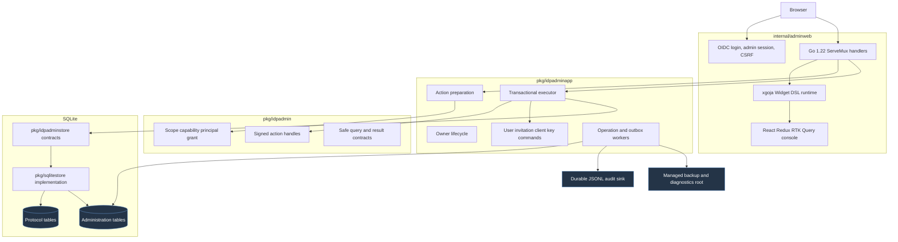

# tiny-idp: Administration Control Plane and Widget DSL Console

This report explains the production administration control plane implemented
for `tiny-idp`. The work adds a dedicated owner-authenticated browser console,
server-side administration grants and sessions, signed action handles,
optimistic resource versions, idempotent transactional mutations, query
projections, durable administrative activity, retryable audit delivery,
managed operations, and a constrained Widget DSL presentation layer.

The implementation is tracked by `TINYIDP-ADMIN-CONSOLE-001` in:

```text
/home/manuel/workspaces/2026-07-07/prod-tiny-idp/tiny-idp/
  ttmp/2026/07/23/
    TINYIDP-ADMIN-CONSOLE-001--design-the-tinyidp-administration-backend-and-widget-dsl-console-mvp/
```

The ticket contains the original UX source, the architecture and intern
implementation guide, a fifteen-step investigation diary, a task list, a
changelog, and a requirement-by-requirement release audit. This note presents
the finished system as a technical chapter. It focuses on why each boundary
exists, how requests move through the implementation, how durable evidence is
recorded, and what the final tests prove.

> [!summary]
> - The browser never supplies authoritative capability, scope, resource
>   version, or mutation target data. Go prepares a short-lived signed action
>   handle and revalidates its claims against the current server-side grant at
>   execution time.
> - Protocol state, resource versions, nonce consumption, action evidence,
>   idempotency results, and audit-outbox records commit in one SQLite
>   transaction. A browser retry therefore cannot create an ambiguous second
>   mutation.
> - `widget.dsl` composes reviewed presentation through xgoja, but it is not an
>   authorization or command-execution boundary. The generated Widget IR passes
>   a deterministic schema, component, size, authority, secret, code, and URL
>   validator before React renders it.
> - The release gate exercises all seven screens under eight required states,
>   tests keyboard and Axe accessibility, enforces CSP in Chromium, commits a
>   tablet snapshot, benchmarks a 10,000-user query, and passes the complete Go,
>   frontend, generation, build, and lint suites.

## 1. The system that needed to exist

TinyIDP already had protocol storage, operator CLI commands, OIDC flows,
password operations, signing keys, SQLite backup support, and a durable JSONL
audit sink. Those pieces were sufficient for direct operator work. They did not
constitute a safe web administration system.

A browser control plane adds concerns that do not exist in a one-shot CLI
command:

- The actor must be identified through an administrative session that is
  distinct from the ordinary IdP browser session.
- Authorization must be evaluated against a current grant on every request.
- A stale browser tab must not overwrite a resource changed by another tab,
  process, or CLI command.
- A repeated request must not repeat a mutation or reveal a secret twice.
- CSRF, Origin, session binding, and fresh-authentication requirements must be
  checked at the transport and application layers.
- Every accepted mutation must leave durable, queryable evidence.
- Audit delivery failures must be visible and retryable without making a
  committed mutation appear to have failed.
- Long-running work must survive process interruption and participate in
  readiness.
- The presentation layer must not become a route around Go authorization.

The implementation therefore introduces a control plane rather than exposing
the existing low-level admin service directly.

### 1.1 Protocol state and administration state are related but distinct

Protocol state includes users, password credentials, browser sessions, grants,
authorization codes, OAuth tokens, clients, and signing keys. The OIDC and
OAuth endpoints consume those records.

Administration state answers different questions:

- Who is currently authorized to administer the installation?
- Which capability does the actor hold?
- Which resource version did the actor inspect?
- Which exact action did the server prepare?
- Was its nonce already consumed?
- Was an equivalent request already processed?
- What evidence describes the result?
- Is the external audit sink current?
- Which managed operation is pending, running, complete, or failed?

The two state sets must remain conceptually distinct, but a mutation and its
administrative evidence must commit atomically. This requirement determines
the package and transaction layout.

### 1.2 The product scope is one system owner

The MVP supports one owner administrator with system scope. It does not add
delegated administrators, helpdesk roles, browser owner bootstrap, identity
domains, or role editing.

The data model nevertheless uses explicit scope and capability values from the
first implementation. This prevents the owner-only phase from hard-coding
authorization as a boolean that would later require replacement.

```go
type AdminScope struct {
    Kind ScopeKind
    ID   string
}

func SystemScope() AdminScope {
    return AdminScope{Kind: ScopeSystem, ID: "system"}
}
```

`AdminScope.ValidateMVP` accepts only system scope. The type also reserves a
domain shape for a later phase, but domain scope is rejected by current
authorization. Future domain support extends grants, data filters, and
capability-visible navigation; it does not replace the MVP contracts.

## 2. Architecture and package ownership

The final implementation has four primary layers.



### 2.1 `pkg/idpadmin`: stable domain contracts

`pkg/idpadmin` contains values that are independent of HTTP, SQLite, React, and
Widget DSL:

- administration scope;
- closed capabilities;
- authenticated principal and assurance;
- owner grant;
- server-side authorizer;
- signed action claims and handle service;
- safe user, invitation, client, signing-key, activity, and operation DTOs;
- query and command interfaces.

This package is the stable language used by CLI, HTTP, application services,
and persistence.

### 2.2 `pkg/idpadminstore`: persistence contracts

`pkg/idpadminstore` defines records and interfaces for:

- owner grants;
- admin sessions;
- OIDC authentication attempts;
- action nonces;
- resource versions;
- idempotency receipts;
- administrative actions;
- audit outbox rows;
- managed operations;
- one-use downloads;
- invitation display metadata;
- user projections and read models.

The package depends on domain values and protocol-store interfaces. It does not
depend on HTTP or Widget IR.

### 2.3 `pkg/idpadminapp`: application orchestration

`pkg/idpadminapp` owns use-case policy:

- fixed owner-client bootstrap and recovery;
- action-definition registry;
- preparation of server-bound action handles;
- guarded execution;
- user lifecycle commands;
- invitation lifecycle;
- client lifecycle and secret rotation;
- key rotation and retirement;
- managed doctor, backup, verification, and diagnostics work;
- audit and operation workers;
- one-use download issuance and consumption.

The command services receive transaction-scoped protocol and administration
stores. They do not parse HTTP or invoke Cobra commands.

### 2.4 `internal/adminweb`: public web boundary

`internal/adminweb` owns:

- the fixed public PKCE OIDC relying-party flow;
- admin session cookies and CSRF tokens;
- `/admin`, `/api/admin`, `/api/widget`, and `/static/admin` routes;
- security headers and JSON bounds;
- the safe xgoja module;
- Widget DSL execution and IR validation;
- the embedded React application and production assets.

The public administration handler is mounted on the product's public listener.
The existing `--admin-addr` remains the internal metrics and readiness
listener. The implementation does not silently redefine that flag.

## 3. Authentication: the console is its own OIDC client

The administration console authenticates through TinyIDP's OIDC provider using
a fixed public client:

```text
client_id: tinyidp-admin-console
grant: authorization_code
client authentication: none
PKCE: S256 required
redirect: <issuer-origin>/admin/auth/callback
```

The owner is not authenticated by reusing an existing protocol browser cookie.
The admin console performs an OIDC authorization flow and then creates a
separate server-side administration session.

### 3.1 Why a separate session is required

The protocol browser session establishes that a user is authenticated to the
identity provider. It does not establish that the user has an active
administration grant, that the current grant version matches, or that a recent
authentication satisfies a sensitive action.

The admin session stores:

```go
type Session struct {
    IDHash          []byte
    Subject         string
    GrantID         string
    GrantVersion    int64
    CSRFHash        []byte
    AuthenticatedAt time.Time
    CreatedAt       time.Time
    LastSeenAt      time.Time
    ExpiresAt       time.Time
    RevokedAt       *time.Time
}
```

Only a keyed hash of the session identifier is persisted. The cookie is:

```text
name: tinyidp_admin_session
path: /admin
HttpOnly: true
Secure: true in production
SameSite: Lax
```

The session records both the grant ID and grant version. Revoking or changing
the grant invalidates a session even if its expiry time has not elapsed.

### 3.2 Authentication-attempt state

OIDC login state is server-side:

```go
type AuthAttempt struct {
    StateHash          []byte
    NonceHash          []byte
    PKCEVerifierBox    []byte
    ReturnPath         string
    BrowserBindingHash []byte
    CreatedAt          time.Time
    ExpiresAt          time.Time
    ConsumedAt         *time.Time
}
```

The raw `state`, `nonce`, and verifier are not stored directly. The verifier is
sealed, and the attempt is bound to the initiating browser. Callback
consumption is one-time.

The callback verifies:

1. the state and browser binding;
2. one-time attempt consumption and expiry;
3. token exchange with the fixed client and redirect URI;
4. issuer, signature, audience, and nonce;
5. the authenticated subject;
6. the current active system-owner grant;
7. the grant version stored into the new session.

The browser cannot select an arbitrary callback destination. Only validated
same-origin administration return paths are accepted.

### 3.3 Owner bootstrap remains CLI-only

No web route creates an owner. Operator commands under
`internal/cmds/admin_console.go` provide:

- owner bootstrap;
- owner status;
- grant revocation;
- session revocation.

Bootstrap validates or creates the fixed public OIDC client, creates the single
system-owner grant, initializes control-plane resource versions, and emits
audit evidence. Replacement is not implicit: an existing owner must be
explicitly revoked before another bootstrap.

This is a recovery and trust-establishment operation. Keeping it outside the
browser prevents an unowned installation from exposing a "make this subject
owner" flow.

## 4. Authorization: scope, capability, grant, and assurance

Authentication resolves a subject. Authorization evaluates a current grant.

An `AdminPrincipal` carries:

- the subject;
- a session binding;
- system scope;
- assurance level;
- authentication time;
- grant identity and observed grant version.

The grant carries:

- the owner subject;
- system scope;
- a closed capability set;
- issue and expiry times;
- revocation state;
- a monotonically changing version.

### 4.1 Capabilities are server-defined

Capabilities are typed constants such as:

```text
users.read
users.create
users.update
users.disable
users.unlock
users.password.set
users.access.revoke
invitations.read
invitations.create
invitations.revoke
clients.read
clients.create
clients.update
clients.disable
clients.secret.rotate
keys.read
keys.rotate
keys.retire
activity.read
operations.read
operations.doctor
operations.backup.create
operations.backup.verify
operations.diagnostics
```

The browser does not claim a capability. `ActionService` looks up a closed
server-side definition for the requested command and binds the corresponding
capability into an action handle.

### 4.2 Authorization reloads the grant

The authorizer does not trust the grant version copied into the session. It
reloads the durable grant and checks:

```text
principal subject == grant subject
principal scope == requested scope == grant scope
principal grant ID == requested grant ID
session grant version == requested grant version == current grant version
grant is active at current time
grant includes required capability
fresh authentication is present when required
```

This is performed during preflight and again before the executor opens its
mutation transaction. The second check narrows the interval between
authorization and commit.

### 4.3 Fresh authentication is action policy

The console distinguishes an active session from recently authenticated
assurance. Sensitive commands require fresh authentication:

- setting a password;
- rotating a client secret;
- rotating or retiring a signing key;
- creating or verifying a managed backup;
- generating diagnostics.

When freshness is insufficient, the server returns `fresh_auth_required`. The
React application navigates to `/admin/auth/reauth` with a validated return
path, completes OIDC authentication again, rotates session CSRF state, and
retries only after the operator submits again.

## 5. Server-prepared action handles

The most important browser mutation rule is that presentation data is not
authority.

A row may display a user ID and a Disable button, but the browser may not submit
an authoritative object such as:

```json
{
  "command": "users.disable",
  "scope": {"kind": "system", "id": "system"},
  "capability": "users.disable",
  "target_id": "user-123",
  "expected_version": 7
}
```

Those values are resolved and signed by the server.

### 5.1 Preparation

The browser asks to prepare an action using a command and target reference. The
server:

1. looks up a closed action definition;
2. authorizes the current principal for its capability;
3. resolves or allocates the target;
4. reads the current resource version when the command mutates an existing
   resource;
5. generates a random one-use nonce;
6. binds the nonce to the administration session;
7. creates signed claims with a short expiry;
8. returns an opaque action handle and non-authoritative UI metadata.

The signed claims include:

```go
type ActionClaims struct {
    Nonce           string
    SessionID       string
    Subject         string
    GrantID         string
    GrantVersion    int64
    Scope           AdminScope
    Capability      Capability
    Command         string
    TargetType      string
    TargetID        string
    ExpectedVersion int64
    RequireFresh    bool
    ExpiresAt       time.Time
}
```

The handle uses an owner-managed action key loaded through
`--admin-action-key-file`. It is integrity-protected and short-lived. It is not
a durable permission and cannot be transferred between admin sessions.

### 5.2 Execution

The browser submits:

```json
{
  "payload": {
    "actionHandle": "<opaque signed value>",
    "input": {
      "reason": "Suspend account during incident review",
      "confirmation": "DISABLE"
    }
  }
}
```

HTTP headers provide:

```text
X-CSRF-Token: <session token>
Idempotency-Key: <random UUID>
X-Request-ID: <random UUID>
Origin: <public issuer origin>
```

The body does not carry authoritative scope, capability, version, or target.
The executor recovers those values from the verified handle.

### 5.3 Action handles close several attack paths

The handle service and executor reject:

- a modified signature;
- an expired handle;
- a handle from another session;
- a handle minted for another subject;
- a revoked or version-changed grant;
- a consumed nonce;
- a stale expected resource version;
- an idempotency key reused for different input.

The command dispatcher is closed. Fabricated strings such as
`operations.backup.restore`, `operations.migrate`, and `keys.purge` return
`ErrUnknownCommand`.

## 6. One transaction owns mutation and evidence

The control plane must update protocol data and administration evidence in one
commit. This requirement is implemented by adding administration interfaces to
the existing concrete SQLite store rather than opening a second database
connection or a separate persistence package.

`idpadminstore.AtomicStore` exposes:

```go
type AtomicStore interface {
    AdminUpdate(
        ctx context.Context,
        fn func(idpstore.TxStore, idpadminstore.TxStore) error,
    ) error
}
```

The callback receives protocol and administration views over the same
`sql.Tx`.

### 6.1 Executor algorithm

The core execution path is:

```text
verify idempotency key and request hash are present
verify signed action handle
reload and authorize current grant

begin SQLite transaction
    look up (subject, idempotency key)

    if prior record exists:
        reject if request hash differs
        reject replay of secret-bearing result
        otherwise return stored safe response

    consume nonce bound to action session

    if action has expected version:
        compare and increment resource version

    execute command-specific mutation
        update protocol records
        update safe projection

    insert completed admin action
    enqueue audit-outbox record

    store idempotency result
        store redacted marker for secret-bearing commands
commit

return response
```

If any step fails, none of the protocol mutation, version increment, action,
outbox, or idempotency record commits.

### 6.2 Why resource versions are separate

Some protocol records do not have a directly usable version column. Others
represent aggregates that span several tables. The administration control
plane therefore keeps explicit resource versions by resource type and immutable
resource ID.

Examples include:

```text
user/<user-id>
client/<client-id>
invitation/<public-invitation-id>
signing_key/<kid>
keyring/system
operation/<operation-id>
```

A browser tab receives a version through safe read data. Action preparation
binds that version into the signed handle. Execution compares and increments it
inside the transaction. A concurrent edit produces `version_conflict`, not
last-write-wins behavior.

### 6.3 Idempotency and one-time secrets

Idempotency records use:

```text
(subject, idempotency key)
request hash
safe response
status code
creation and expiry
```

For ordinary commands, an identical replay returns the stored safe response.
For a different request hash, the server returns `idempotency_conflict`.

For secret-bearing commands, the stored response is replaced with:

```json
{"executed": true, "secret_replay": false}
```

The raw invitation code or generated client secret is returned only from the
first successful transaction and never persisted in the idempotency table.
Replaying the request returns `ErrSecretAlreadyIssued`.

## 7. Durable schema and read models

The feature added six migrations:

| Migration | Purpose |
| --- | --- |
| `016_admin_control_plane.sql` | Grants, sessions, auth attempts, action nonces, resource versions, idempotency, actions, and audit outbox. |
| `017_admin_user_projection.sql` | Indexed safe user directory projection. |
| `018_admin_action_evidence.sql` | Expanded request, session, reason, assurance, and version evidence. |
| `019_admin_invitation_lookup.sql` | Public invitation-ID lookup and metadata backfill. |
| `020_admin_operations_and_outbox.sql` | Durable managed operations and worker state. |
| `021_admin_downloads.sql` | Hashed, expiring, one-use artifact download grants. |

### 7.1 The user projection

The protocol user store is optimized for identity operations and point lookup.
An administration directory needs bounded list and search queries over safe
fields.

The projection contains:

- immutable user ID and subject;
- normalized login and email;
- display name;
- disabled and locked state;
- last successful login time;
- active session and grant counts;
- created and updated times;
- resource version.

It excludes:

- password credentials and hashes;
- recovery values;
- browser cookies;
- OAuth token values;
- internal secret material.

Protocol mutations refresh the affected projection row inside the same
transaction. A rebuild and drift checker can derive every projection row from
authoritative protocol state and compare it with the live view.

### 7.2 Query bounds

The first implementation deliberately uses ordinary indexed SQLite queries
rather than requiring FTS5 build tags. Filters and page sizes are bounded, sort
keys are closed, and list DTOs expose only stable safe fields.

The release benchmark inserts 10,000 projection rows and searches for a bounded
result:

```text
BenchmarkListAdminUsers10000-8
20 iterations
112868 ns/op
17505 B/op
458 allocs/op
```

This is a query microbenchmark. It verifies the specified directory scale and
provides a baseline for later index or filter changes. It is not a concurrent
load test.

### 7.3 Administrative activity

An action row records:

- action and request IDs;
- session binding;
- nonce;
- actor subject;
- grant ID and version;
- scope and capability;
- command;
- target type and ID;
- expected and resulting resource versions;
- operator reason;
- assurance;
- status and stable error code;
- creation and completion times.

The Activity page reads these records through a safe projection. It does not
parse the external JSONL file.

## 8. User, invitation, client, and key command services

Each resource area uses the same action protocol but applies its own validation
and transaction logic.

### 8.1 User lifecycle

The console supports:

- list and search;
- inspect;
- create;
- edit;
- disable;
- enable;
- unlock;
- set a new password;
- revoke all access.

Disabling and access revocation operate on immutable user IDs, not display
login names. They invoke existing protocol-store invariants that revoke browser
sessions, domain-token state, and Fosite artifacts.

Password establishment hashes input before the short SQLite transaction and
clears sensitive request bytes after use. The transaction replaces credential
state, resets lockout/security state, revokes existing access, refreshes the
user projection, and records the action and audit outbox.

The password never enters:

- an action row;
- the audit payload;
- Widget IR;
- Redux persistent state;
- local or session storage;
- a URL;
- a toast.

### 8.2 Invitations

Invitation issuance generates bearer material once. The administration read
model stores display metadata keyed by a public invitation ID so an operator
can list and revoke an invitation without recovering or displaying the raw
code.

The command service supports:

```text
invitations.issue
invitations.revoke
```

Issuance validates the label, audience, expiry, and policy inputs. Revocation
targets the immutable public ID. One-time secret tests prove that a replay does
not reveal the issued code again.

### 8.3 OIDC clients

The client command service supports:

```text
clients.create
clients.update
clients.enable
clients.disable
clients.rotate_secret
```

It validates:

- immutable client ID;
- public versus confidential mode;
- exact redirect and post-logout redirect URIs;
- allowed scopes, audiences, and grant types;
- PKCE requirements;
- introspection permission;
- duplicate and wildcard URI rejection.

Safe DTOs expose `secret_configured`, not `SecretHash`. A confidential client
secret is generated and returned once. Rotation replaces the stored hash and
does not preserve the previous raw value.

### 8.4 Signing keys

The browser registry exposes:

```text
keys.rotate
keys.retire
```

It does not expose key purge.

Rotation generates RSA private material before opening the transaction. The
transaction creates and activates the new key, retires the previous active key
without deleting its public verification material, initializes the new
resource version, and records evidence. The response contains public key
metadata only.

Retirement requires a non-active eligible key and targets its immutable `kid`.
Emergency deletion remains the CLI command
`admin keys purge-retired`.

## 9. Audit delivery and durable workers

The pre-existing audit sink appends JSONL synchronously and calls `fsync`.
`idp.ErrAuditDelivery` means the state mutation may already have committed.
That behavior is manageable in a CLI that reports a reconciliation warning. It
is unsafe as the sole browser contract because a retry could repeat work.

The control plane therefore commits an audit-outbox row with every accepted
action. External delivery happens after commit.

### 9.1 Outbox worker

The worker:

1. reads a bounded batch of due rows;
2. converts each payload into a stable audit event;
3. appends it to the durable sink;
4. marks the row delivered;
5. records a stable error and bounded retry time on failure.

Delivery is idempotent at the outbox state boundary. A delivered row is not
selected again. Failure state remains queryable.

Readiness reports:

- healthy when no pending audit exists;
- degraded when delivery is pending;
- failed when the oldest pending record exceeds five minutes.

The browser can therefore display "mutation committed, audit delivery pending"
without misrepresenting the protocol state.

### 9.2 Operation worker

Long-running work is represented by durable `admin_operations` rows. The
browser can enqueue:

- doctor;
- managed backup creation;
- managed backup verification;
- sanitized diagnostics.

The worker conditionally claims one pending row, executes bounded work, and
stores either a safe result or a stable error code. At startup it requeues rows
left in `running` state by process interruption.

The worker and outbox worker run in the production host's `errgroup` with HTTP
servers and maintenance work. Context cancellation stops them, and the host
joins them before closing the shared store and audit sink.

## 10. Managed artifacts and filesystem confinement

Production requires:

```text
--admin-backup-root /var/lib/tinyidp/admin-artifacts
```

The root is explicit. The server does not derive it from a browser value or an
environment variable.

### 10.1 Backup creation

Browser input contains an optional label, reason, and typed confirmation. It
does not contain a filesystem path.

The server:

```text
sanitize label to [A-Za-z0-9._-]
combine label with random operation ID
select fixed backups/ child
create child directory with mode 0700
resolve canonical parent
verify filepath.Rel remains below canonical root
create backup file with mode 0600
store only slash-normalized relative path
```

Tests supply a `../../` label and a `backups` symlink that points outside the
root. The first is sanitized; the second is rejected before any outside file is
created.

### 10.2 Verification

Verification does not accept a browser path. It loads the relative path from a
completed backup operation, rejects absolute paths and `..`, resolves
symlinks, repeats the root-confinement check, and runs SQLite integrity, schema,
and checksum verification.

A forged stored path such as `../escape.db` is rejected.

### 10.3 Diagnostics

Diagnostics serialize safe DTOs and health summaries. They do not serialize:

- raw `idpstore.Client` records;
- password or client-secret hashes;
- private PEM bytes;
- action keys;
- session cookies;
- database secret values;
- arbitrary Go error objects.

The artifact is created exclusively, written with mode `0600`, fsynced, and
stored by relative path.

### 10.4 One-use downloads

Download authorization has two steps:

```text
authenticated CSRF-protected POST
  /api/admin/operations/{operation}/downloads
    -> generate 288-bit random handle
    -> persist SHA-256(handle), never raw handle
    -> return raw handle once with Cache-Control: no-store

authenticated GET
  /api/admin/downloads/{handle}
    -> hash handle
    -> atomic consume where unconsumed and unexpired
    -> repeat canonical confinement check
    -> serve attachment with Cache-Control: no-store
```

The handle expires after ten minutes. A second consume returns not found.

## 11. Widget DSL as a constrained presentation layer

The console uses the RAG evaluation system's `widget.dsl` v3 authoring module
and the React renderer from
`@go-go-golems/rag-evaluation-site`.

The integration deliberately does not copy the lower-risk Upwork example's
host capabilities. TinyIDP registers only:

```javascript
const admin = require("tinyidp.admin");
const widget = require("widget.dsl");

const data = admin.pageData();
```

The xgoja runtime does not register filesystem, database, HTTP, shell, or
arbitrary host modules.

### 11.1 Data enters JavaScript as a safe DTO

`tinyidp.admin.pageData()` returns already-authorized, redacted page data from
Go. JavaScript can decide how to compose reviewed widgets. It cannot query the
database directly or execute an administration command.

`pages.js` copies row proxy objects into plain objects with a fixed field set:

```javascript
const rows = Array.isArray(data.rows)
  ? data.rows.map((row) => ({
      id: String(row.id || ""),
      primary: String(row.primary || ""),
      secondary: String(row.secondary || ""),
      status: String(row.status || ""),
    }))
  : [];
```

The copy serves two purposes:

1. xgoja proxy objects become normal serializable JavaScript objects.
2. Only approved display fields cross into the table builder.

Without this copy, the row objects appeared correct to JavaScript but serialized
as `{}` through the Widget builder.

### 11.2 Execution is bounded

The Go runtime enforces:

```text
maximum render time: 250 ms
maximum encoded IR: 1 MiB
maximum nodes: 2,000
maximum depth: 64
maximum key or string: 32 KiB
```

Context cancellation interrupts goja execution.

### 11.3 Deterministic IR validation

After JavaScript returns, Go exports the value, JSON-encodes it, decodes it into
ordinary Go values, and validates the result.

The validator requires:

- schema version `0.1.0`;
- non-empty bounded page ID and title;
- a component root;
- supported value types;
- a closed component set:
  - `Stack`;
  - `SectionBlock`;
  - `KeyValueStrip`;
  - `Panel`;
  - `DataTable`;
- valid component and text node kinds;
- all size and depth limits.

It rejects property names associated with:

- commands;
- capabilities;
- scopes;
- SQL;
- script or raw HTML;
- passwords and password hashes;
- secret or stored hashes;
- private key material;
- cookies and CSRF tokens.

It rejects values containing:

- `http://` or `https://` external URLs;
- `javascript:` URLs;
- inline `<script`;
- PEM private-key headers.

This validator is not a generic sanitization library. It is a release policy
for the reviewed TinyIDP widget vocabulary. New components or properties
require an explicit code and test change.

### 11.4 React remains a rendering and interaction client

The production frontend uses:

- React and TypeScript;
- Redux Toolkit;
- RTK Query;
- Bootstrap;
- the default Widget IR registry.

RTK Query performs same-origin requests and supplies CSRF, request ID, and
idempotency headers for mutations. Command forms first call the prepare
endpoint, then execute the returned handle.

One-time secret results remain in local component state and are reset after
display. Mutation state is explicitly reset so raw secret values do not remain
in the RTK Query cache.

## 12. HTTP route and browser security model

The public surface is:

```text
GET  /admin
GET  /admin/{path...}
GET  /static/admin/{asset...}

GET  /admin/auth/login
GET  /admin/auth/reauth
GET  /admin/auth/callback

GET  /api/admin/session
POST /api/admin/logout
GET  /api/admin/overview
GET  /api/admin/pages/{page}
GET  /api/admin/clients/{client}
POST /api/admin/operations/{operation}/downloads
GET  /api/admin/downloads/{handle}

GET  /api/widget/pages/{page}
POST /api/widget/actions/prepare
POST /api/widget/actions/execute
```

The implementation uses Go 1.22 `http.ServeMux`. API routes are registered
specifically; the SPA is mounted only under `/admin` and `/admin/`. Static files
are served only under `/static/admin/`.

### 12.1 CSRF and Origin

Every mutation requires:

- a valid admin session;
- an exact same-origin `Origin`;
- an `X-CSRF-Token` matching the keyed hash stored in the session.

The server does not treat SameSite cookies as sufficient CSRF protection.

### 12.2 JSON bounds and shape

Preparation bodies are limited to 8 KiB. Execution bodies are limited to 64
KiB. The JSON decoder rejects unknown fields and trailing values.

Sensitive request buffers are cleared after decoding where appropriate.

### 12.3 Content Security Policy

The administration console receives:

```text
default-src 'none';
script-src 'self';
style-src 'self';
connect-src 'self';
img-src 'self' data:;
font-src 'self';
frame-ancestors 'none';
form-action 'self';
base-uri 'none';
object-src 'none'
```

The policy excludes:

- inline scripts;
- `eval`;
- third-party JavaScript;
- remote fonts;
- analytics injection;
- CDN assets;
- arbitrary external API requests;
- framed rendering.

Additional headers include:

```text
Referrer-Policy: no-referrer
X-Content-Type-Options: nosniff
X-Frame-Options: DENY
Permissions-Policy: camera=(), microphone=(), geolocation=()
```

HTTP tests verify the exact directives and the absence of `unsafe-inline`,
`unsafe-eval`, and remote script origins. A Chromium test attempts both inline
and external script injection and verifies that the browser reports a CSP
rejection.

### 12.4 Cache control

Mutation responses and secret/download responses use:

```text
Cache-Control: no-store
```

Fingerprintable production assets use immutable caching. The HTML shell does
not.

## 13. Console information architecture and responsive behavior

The MVP exposes seven screens:

```text
/admin/overview
/admin/users
/admin/invitations
/admin/clients
/admin/keys
/admin/activity
/admin/operations
```

The navigation label for clients is **Applications**, matching operator
language while retaining client terminology in APIs and commands.

### 13.1 Desktop and tablet

Desktop uses a persistent left navigation and scrollable main region. At tablet
width, navigation becomes a wrapping horizontal region and the main content
remains fully interactive.

The browser suite commits a stable 820-by-1180 operations-page snapshot.

### 13.2 Emergency small-screen mode

Below 480 pixels, the console displays:

```text
This viewport is too narrow for safe administration.
Read-only information remains available; use a tablet
or larger screen for mutations.
```

Elements marked `admin-mutation-surface` are hidden. Read-only Widget IR and
status information remain visible. The system does not attempt to compress
high-risk forms into an unsafe narrow layout.

### 13.3 Accessibility

The page includes:

- a skip-to-content link as the first keyboard focus target;
- named administration navigation;
- one page-level `h1`;
- labeled sections and forms;
- status and alert regions;
- a main landmark;
- reduced-motion rules.

The final Axe scan is clean. Bootstrap's default primary color missed WCAG AA
contrast by a narrow margin on tertiary and widget backgrounds, so the console
uses a scoped darker primary for navigation and outline buttons.

## 14. Required screen states

Every screen must have safe behavior for:

1. loading;
2. empty data;
3. no filtered results;
4. forbidden access;
5. stale data;
6. expired session;
7. degraded audit delivery;
8. failed operation.

The Playwright suite executes the Cartesian product:

```text
7 screens × 8 states = 56 rendered combinations
```

This is stronger than a fixture registry that merely declares state names. The
test installs isolated API routes, opens each screen, and asserts the visible
state before moving to the next case.

Separate scenarios exercise:

- loading followed by ready state;
- Widget page denial;
- session expiry and sign-in recovery;
- execution conflict;
- audit delivery warning;
- operation failure.

## 15. Release verification

The final release gate ran:

```bash
GOCACHE=/tmp/tiny-idp-go-cache go generate ./...
GOCACHE=/tmp/tiny-idp-go-cache go fmt ./...
GOCACHE=/tmp/tiny-idp-go-cache go test ./... -count=1
GOCACHE=/tmp/tiny-idp-go-cache go build ./...
make lint

pnpm --dir internal/adminweb/frontend run check
pnpm --dir internal/adminweb/frontend exec playwright test

GOCACHE=/tmp/tiny-idp-go-cache go test ./pkg/sqlitestore \
  -run '^$' \
  -bench '^BenchmarkListAdminUsers10000$' \
  -benchmem \
  -benchtime=20x
```

Results:

```text
all Go packages passed
full Go build passed with VCS stamping
golangci-lint: 0 issues
Glazed custom analyzer passed
idpui custom analyzer passed
frontend typecheck passed
production Vite build passed
Playwright: 6 passed
docmgr doctor: all checks passed
```

### 15.1 What the browser suite proves

The six tests cover:

- all 56 screen/state combinations;
- keyboard focus and landmarks;
- Axe accessibility;
- actual Chromium CSP rejection;
- tablet visual snapshot;
- reduced motion;
- emergency small-screen read-only behavior;
- representative authentication, authorization, stale-version, audit, and
  operation failures.

### 15.2 What the Widget tests prove

The Go tests:

- execute the same xgoja provider used in production;
- render every page and state;
- render identical input twice and compare byte-equivalent JSON;
- assert normalized row IDs and values survive;
- reject unavailable host modules;
- reject unsupported schemas and components;
- reject excessive depth;
- reject authority, secret, code, private-key, and external-URL payloads.

### 15.3 What transaction tests prove

Tests cover:

- one active owner;
- grant revocation and version mismatch;
- handle signature, expiry, subject, and session binding;
- one-use nonces;
- identical and conflicting idempotency replay;
- secret replay denial;
- optimistic version conflict;
- complete rollback on injected failure;
- user security-artifact revocation;
- invitation and client one-time secret semantics;
- signing-key overlap and retirement;
- backup confinement and symlink rejection;
- diagnostics redaction;
- one-use download consumption;
- outbox retry and delivery lifecycle;
- worker readiness state.

## 16. Implementation history

The implementation was committed in reviewable boundaries:

| Commit | Purpose |
| --- | --- |
| `ca9146f` | Create the architecture, intern guide, source import, and ticket baseline. |
| `7ad9daf` | Add scope, capability, grants, handles, persistence contracts, migrations, and atomic store foundation. |
| `fad114d` | Complete Phase A application services, owner commands, projections, and executor. |
| `1b769fa` | Add the OIDC PKCE and admin-session foundation. |
| `eba9143` | Complete the authenticated read-only Widget DSL and React console. |
| `cd95c09` | Add guarded user lifecycle operations. |
| `03831d2` | Add invitation and client lifecycle operations. |
| `98f19c5` | Add durable audit and operation workers. |
| `a8dad43` | Add guarded signing-key rotation and retirement. |
| `682cb23` | Add managed operations, confined artifacts, and one-use diagnostics downloads. |
| `972a0a3` | Complete accessibility, browser security, fixtures, Widget validation, snapshots, benchmark, and release gates. |
| `fe5fe5a` | Record the detailed release evidence and 17-item definition-of-done audit. |
| `cf9a88d` | Record the final local render and reMarkable delivery. |

The ticket diary records the commands, failures, corrective decisions, and
review instructions for each phase.

## 17. Defects and incorrect assumptions found during hardening

The hardening phase found issues that narrow unit tests did not reveal.

### 17.1 xgoja proxy rows serialized as empty objects

The page source passed Go-backed proxy row objects directly to Widget DSL. The
objects were readable through property access, but the builder's serialization
path emitted `{}`. The visible table therefore lost row identity and display
values.

The fix explicitly copies `id`, `primary`, `secondary`, and `status` into plain
JavaScript objects. The deterministic test asserts those values in encoded IR.

This is a concrete rule for xgoja boundaries: values that will cross a second
serialization boundary should be normalized to fixed ordinary structures
before composition.

### 17.2 The Vite development optimizer was not equivalent to production

The first Playwright harness served the Vite development environment. The HTML,
TypeScript modules, and CSS all loaded with successful responses, but React did
not mount.

The browser trace reported:

```text
Calling `require` for "react" in an environment that doesn't expose
the `require` function.
See https://rolldown.rs/in-depth/bundling-cjs#require-external-modules
```

The published Widget renderer package includes a CommonJS React external that
Vite's development dependency optimizer did not expose correctly. The
production build already bundled it correctly.

Playwright now runs:

```text
pnpm run build
pnpm exec vite preview --host 127.0.0.1 --port 4174
```

This tests the artifact embedded into the Go binary. It does not add a
compatibility adapter.

### 17.3 Accessibility required production CSS changes

The first Axe run found:

- no page-level `h1`;
- insufficient contrast for outline-primary buttons;
- insufficient contrast for inactive navigation;
- insufficient contrast for the focused skip link.

The console added one semantic page heading and a scoped darker primary color.
The final Axe run has no violations, and the visual snapshot was regenerated
only after those changes stabilized.

### 17.4 A browser request event is not proof that CSP allowed a request

Chromium emits a DevTools request event for an attempted external script even
when CSP blocks execution. The reliable evidence is:

- the response carries the reviewed CSP;
- `page.addScriptTag` rejects with a Content Security Policy error;
- the script does not execute.

The test was changed to assert the policy rejection rather than the absence of
the request event.

### 17.5 Linked-worktree and sandbox constraints affected verification

The checkout is a linked Git worktree. Its Git metadata is outside the
workspace filesystem boundary. A sandboxed full build could compile packages
but could not obtain VCS stamping:

```text
error obtaining VCS status: exit status 128
```

The exact `go build ./...` command was rerun with approved access to linked
metadata and passed. VCS stamping was not disabled.

The default Go cache was also read-only in the managed environment. Release
commands use:

```text
GOCACHE=/tmp/tiny-idp-go-cache
```

## 18. Security invariants

The implementation can be reviewed through a concise set of invariants.

### 18.1 Authority invariants

- Browser state never creates scope, capability, target, or resource-version
  authority.
- Every mutation uses a server-prepared signed handle.
- Every handle is bound to subject, session, grant, grant version, scope,
  capability, command, target, nonce, expiry, and expected version.
- The current grant is reloaded before execution.
- The command registry is closed.
- Owner bootstrap, grant recovery, restore, migration, and key purge remain
  CLI-only.

### 18.2 Transaction invariants

- Protocol mutation and administration evidence share one SQLite transaction.
- A failed mutation commits no version, action, outbox, or idempotency record.
- A successful mutation commits all of them.
- A nonce is consumed once.
- A stale expected version cannot commit.
- Identical non-secret replay returns a safe stored response.
- Conflicting replay is rejected.
- Secret-bearing replay never returns the secret.

### 18.3 Secret invariants

- Raw session and CSRF values are not stored directly.
- Passwords and generated secrets do not enter Widget IR, action rows, audit
  payloads, URLs, or persistent browser state.
- Safe DTOs do not expose stored hashes or private keys.
- One-use download handles are stored only as hashes.
- Diagnostics use redacted DTOs rather than serializing storage records.
- Administration action keys and managed artifact roots are explicit
  production configuration.

### 18.4 Browser invariants

- Mutation requests require admin session, exact Origin, and CSRF.
- JSON bodies are bounded and reject unknown fields.
- Mutation and secret responses are not cacheable.
- CSP permits only bundled same-origin code and data images.
- Small phone layouts are read-only.
- Required failure states are visible and safe.
- The console is keyboard-usable at desktop and tablet widths.

### 18.5 Operational invariants

- Audit delivery is durable, retryable, and observable.
- Workers start and stop within the production `errgroup`.
- Interrupted running operations are recovered on startup.
- Backup paths cannot escape the configured root.
- Browser routes cannot restore, migrate, or purge.
- Readiness reflects stale audit and operation work.

## 19. Current limits and future extension

The MVP intentionally does not implement:

- delegated administrators;
- helpdesk or auditor roles;
- browser grant editing;
- browser owner bootstrap;
- identity-domain administration;
- backup restore;
- schema migration;
- issuer or token-secret changes;
- audit-path changes;
- emergency key purge;
- arbitrary Widget components or remote data sources;
- mobile mutation forms.

These are not missing hidden routes. They are outside the closed command and
capability registry.

### 19.1 Identity domains

Future domain administration needs:

- domain records;
- domain-scoped grants;
- domain-filtered query implementations;
- capability-visible domain navigation;
- rules that prevent cross-domain and self-elevation behavior.

The current scope type, grant model, principal, action claims, query contracts,
and action evidence already carry scope explicitly. System scope remains valid.
Domain support adds new data and authorization rules without replacing the
transaction or handle protocols.

### 19.2 Delegated roles

Adding roles requires a product capability matrix and grant-management
commands. The browser must still not infer capabilities from visible
navigation. Navigation may hide unavailable actions, but Go remains the
enforcement point.

### 19.3 Retention

The design proposes initial retention periods for actions, idempotency rows,
expired sessions, and delivered outbox history. Production policy should make
those periods explicit and add bounded cleanup work before administrative data
volume becomes significant.

## 20. Review guide

### Domain and authorization

Start with:

```text
pkg/idpadmin/model.go
pkg/idpadmin/model_test.go
pkg/idpadmin/action_handle.go
pkg/idpadmin/contracts.go
```

Verify that system scope is explicit, capabilities are closed, the grant is
reloaded, and handles bind all authority-bearing values.

### Transactions and commands

Read:

```text
pkg/idpadminapp/actions.go
pkg/idpadminapp/executor.go
pkg/idpadminapp/executor_test.go
pkg/idpadminapp/user_commands.go
pkg/idpadminapp/invitation_commands.go
pkg/idpadminapp/client_commands.go
pkg/idpadminapp/key_commands.go
pkg/idpadminapp/operation_commands.go
```

Trace one mutation from preparation through handle verification, nonce
consumption, version increment, domain mutation, action evidence, outbox, and
idempotency commit.

### Persistence

Read:

```text
pkg/idpadminstore/store.go
pkg/sqlitestore/admin_store.go
pkg/sqlitestore/admin_projection.go
pkg/sqlitestore/admin_queries.go
pkg/sqlitestore/admin_workers.go
pkg/sqlitestore/migrations/016_admin_control_plane.sql
pkg/sqlitestore/migrations/017_admin_user_projection.sql
pkg/sqlitestore/migrations/018_admin_action_evidence.sql
pkg/sqlitestore/migrations/019_admin_invitation_lookup.sql
pkg/sqlitestore/migrations/020_admin_operations_and_outbox.sql
pkg/sqlitestore/migrations/021_admin_downloads.sql
```

Confirm that protocol and administration records use the same transaction and
that read projections exclude secret-bearing storage types.

### Web and Widget boundaries

Read:

```text
internal/adminweb/auth.go
internal/adminweb/handler.go
internal/adminweb/widget_runtime.go
internal/adminweb/verbs/pages.js
internal/adminweb/frontend/src/api.ts
internal/adminweb/frontend/src/App.tsx
internal/adminweb/frontend/tests/admin-console.spec.ts
```

Confirm the OIDC client is fixed, mutations require CSRF and Origin, Widget
modules are closed, IR is validated, and the browser never submits
authoritative mutation metadata.

### Workers and production lifecycle

Read:

```text
pkg/idpadminapp/outbox_worker.go
pkg/idpadminapp/operation_worker.go
pkg/idpadminapp/downloads.go
internal/cmds/serve_production.go
internal/sections/production/section.go
```

Verify cancellation, startup recovery, root confinement, readiness aggregation,
and close ordering.

## 21. Project status

The MVP definition of done has seventeen requirements. The ticket's final audit
maps all seventeen to source and executable evidence. All implementation and
release tasks are complete.

One ticket checkbox remains intentionally human-owned:

```text
Review and accept the proposed decisions and open owner questions.
```

The design records five non-blocking owner decisions concerning default
enablement, key separation, owner replacement, retention, and readiness
thresholds. The implemented system follows the documented recommendations.
Human product review can change those policies without invalidating the
control-plane architecture.

The worktree was clean at final audit. The implementation guide was opened with
`md-view`, and the completed ticket bundle was uploaded to reMarkable as:

```text
/ai/2026/07/24/TINYIDP-ADMIN-CONSOLE-001/
  TINYIDP ADMIN CONSOLE MVP IMPLEMENTED.pdf
```

## Related notes

- [[tiny-idp]]
- [[PROJECT REPORT - tiny-idp - Strict Fosite Provider and Hosted OIDF Conformance|tiny-idp: Strict Fosite Provider and Hosted OIDF Conformance]]
- [[PROJECT REPORT - tiny-idp - Production Embedding API and Release Hardening|tiny-idp: Production Embedding API and Release Hardening]]
- [[PROJECT REPORT - tiny-idp - Model Checking and Executable State Assurance|tiny-idp: Model Checking and Executable State Assurance]]
- [[PROJECT REPORT - tiny-idp - Stylable Login and Consent UI|tiny-idp: Stylable Login and Consent UI]]
- [[PROJECT REPORT - tiny-idp - Multi-Account Browser Sessions and Logout Scopes|tiny-idp: Multi-Account Browser Sessions and Logout Scopes]]
- [[PROJECT REPORT - tiny-idp - Public Embedding Foundations|tiny-idp: Public Embedding Foundations]]
- [[PROJECT REPORT - tiny-idp - Professional Signup and Application Membership Invitations|tiny-idp: Professional Signup and Application Membership Invitations]]

## Project working rule

> [!important]
> Treat every administration mutation as a server-authorized transaction with
> durable evidence. Presentation may describe and request an action; it must
> never define the action's authority.
