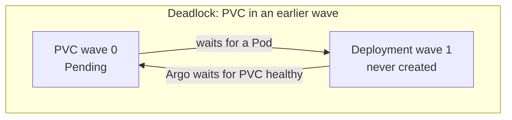
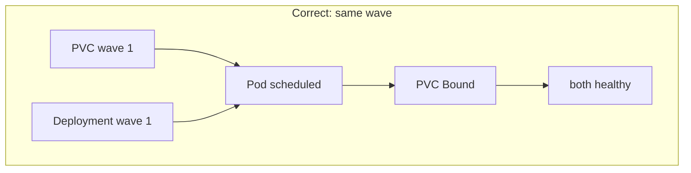

# tiny-idp: From Transcript Audit to an Enforced GitOps Invariant

This report explains how a recurring production deadlock in the TinyIDP and Jitsi k3s rollout was traced to a documentation gap, and how that gap was closed with a substrate agent-instructions file and a render-time validator. The work began as a retrospective analysis of a single Codex session using `go-minitrace`, and ended with a merged change to the cluster repository that prevents the same class of failure from recurring. The report is written for an engineer who understands Kubernetes, GitOps, and basic SQL, but has not operated this specific system.

The central finding is precise. A `local-path` persistent volume claim that sits in an earlier Argo CD sync wave than its consuming Deployment cannot bind, because `local-path` uses the `WaitForFirstConsumer` binding mode and Argo will not advance to the next wave until the current wave is healthy. This deadlock occurred twice in one session. The invariant that prevents it — the PVC and its consuming workload must share the same sync wave — was already encoded in seven of eight existing `pvc.yaml` files in the cluster repository and already documented in `docs/app-deployment-pipeline.md`. What was missing was an entry point that agents read on first contact, and a check that enforced the rule before a pull request could merge.

> [!summary]
> - A `go-minitrace` audit of Codex session `019f765e` showed the agent read the existing cluster manifests (including a `pvc.yaml` that already carried the correct wave) but did not extract the invariant, then hit the deadlock by failure twice.
> - The cluster repository had no `AGENTS.md` at all. The agent searched for one repeatedly across the session and found none, so there was no substrate file to state the rule at first contact.
> - The fix adds `AGENTS.md` as the agent entry point and `scripts/validate_gitops.sh` as a render-time enforcer. The validator renders every Kustomize package with `kubectl kustomize` and checks the PVC/workload wave invariant plus inline-secret absence.
> - The validator immediately uncovered two real latent violations — `static-sites-host` and `bluesky-pds` — both now fixed. The repository now passes its own check: 40 packages, 0 violations.

## 1. The question and the method

The starting point was a concrete question. A Codex session had deployed TinyIDP twice on the Hetzner k3s cluster — first with a messaging application, then with Jitsi Meet — and both deployments had stalled on the same persistent-volume problem. The user asked which documentation and files the session had read to set up the Argo CD and k3s deployment, and where a notice about the sync-wave and PVC relationship could have been placed to prevent the failure.

Answering this required evidence, not recollection. The session was a 5.9-day Codex rollout with 1913 turns and 7647 tool calls. Reading it by hand was not tractable. The method was `go-minitrace`, a tool that converts native coding-agent session logs into a normalized SQLite database. Once converted, the session could be queried with SQL: which tool calls mentioned `argocd`, `k3s`, `pvc`, or `sync-wave`; which files were read versus merely searched for; which turns carried the user's instructions; and where the invariant was first written down.

The conversion is a one-step operation. The native Codex JSONL is read into an archive file, and the query engine builds a SQLite database from that archive on demand.

```bash
go-minitrace convert codex \
  --source-session ~/.codex/sessions/2026/07/18/rollout-...-019f765e-...jsonl \
  --output-dir analysis/archives \
  --run-record analysis/scripts/conversion-run.json
```

The archive materializes real tables: `sessions`, `turns`, `tool_calls`, and several others. The `tool_calls` table is where most of the evidence lives, because every shell command, file patch, and read operation is a row there.

## 2. The deadlock, stated precisely

The failure mode is a scheduling deadlock between two independent mechanisms. Understanding it requires holding both in mind at once.

The first mechanism is the `local-path` storage class. K3s ships with a dynamic provisioner called `local-path`. A `PersistentVolumeClaim` that uses `local-path` does not bind to a real disk immediately. It binds with the volume binding mode `WaitForFirstConsumer`, which means Kubernetes delays binding until a Pod that consumes the claim is actually scheduled onto a node. The claim therefore sits in `Pending` state until its consumer exists. This is a deliberate design: it prevents Kubernetes from binding a volume on a node that the Pod will never be scheduled onto.

The second mechanism is Argo CD sync waves. Argo CD groups the objects in an Application into ordered waves using the annotation `argocd.argoproj.io/sync-wave: "<int>"`. Lower waves are applied first, and Argo will not begin wave *N+1* until every object in wave *N* is healthy. A `PersistentVolumeClaim` is considered healthy when it reaches the `Bound` phase.

The deadlock appears when these two mechanisms disagree about ordering. If the PVC is in an earlier wave than its consuming Deployment, Argo waits for the PVC to become `Bound` before it will create the Deployment. But the PVC cannot bind until the Deployment's Pod is scheduled. Neither progresses.



The fix is to place the PVC and its consuming Deployment in the same sync wave. Argo then creates both in the same wave. Kubernetes schedules the Pod, the Pod's existence satisfies `WaitForFirstConsumer`, the PVC binds, and both objects become healthy together.



This is not a subtle bug. Once stated, the rule is short: a `local-path` PVC and its consuming workload must share the same `argocd.argoproj.io/sync-wave`. The difficulty was not the rule itself but noticing it before deployment.

## 3. What the transcript actually read

The audit's first task was to establish what the agent had read while setting up the deployment. This required care, because a keyword match on command text is not the same as a successful read. The skill that governs this analysis warns that a mention is not a touch: a command that *searches for* a file (`find -name AGENTS.md`) is not evidence that the file was *read*.

The query that answered this reconstructed a portable command text for every tool call. Codex stores most of its actions as `exec` calls with `operation_type = OTHER`, and the real command lives in `arguments_json` rather than the `command` column. A `COALESCE` chain over several `json_extract` fallbacks recovered the usable text.

```sql
WITH calls AS (
  SELECT
    emitting_turn_index AS turn_index,
    tool_name,
    coalesce(
      nullif(command, ''),
      json_extract(arguments_json, '$.command'),
      json_extract(arguments_json, '$.input'),
      arguments_json
    ) AS command_text
  FROM tool_calls
)
SELECT turn_index, substr(command_text, 1, 400)
FROM calls
WHERE lower(coalesce(command_text, '')) GLOB '*sync-wave*'
ORDER BY turn_index;
```

The results showed two deployment phases. The first, around turns 950 to 1165, deployed TinyIDP with a messaging application. The second, around turns 1709 to 1891, deployed TinyIDP with Jitsi. Both phases touched the same surface area: `kubectl`, `kustomize`, `argocd`, `pvc`, and `sync-wave`.

The documentation the agent read fell into three groups. It read the existing cluster repository, including the `goja-kanban` Kustomize package — a brace-glob at turn 21 that opened `namespace`, `pvc`, `deployment`, `service`, `ingress`, and `kustomization` YAML files together. It read its own ticket design documents and the `docmgr` and `diary` skills. And it read the platform topology document `docs/cluster-architecture-overview.md`.

One absence was decisive. The agent never read external Argo CD documentation about sync waves. The two embedded help invocations in the entire session were `go-minitrace query-commands` and `glaze writing-help-entries`, both unrelated to deployment. The sync-wave invariant was derived from the repository's own examples and from the live failure, not from authoritative documentation.

## 4. The correction: no AGENTS.md existed

An early draft of the audit claimed the agent had read the cluster repository's `AGENTS.md` at turn 19. A reviewer questioned this, and deeper verification proved the claim wrong. The turn-19 tool call was a shell `for`-loop over four candidate `AGENTS.md` paths, each guarded by `if test -f "$f"`. The result contained no `FILE` markers, which means every `test -f` check failed.

```bash
for f in /home/manuel/code/wesen/AGENTS.md
         /home/manuel/code/wesen/2026-03-27--hetzner-k3s/AGENTS.md
         /home/manuel/code/wesen/2026-03-27--hetzner-k3s/docs/AGENTS.md
         /home/manuel/code/wesen/go-go-golems/go-go-parc/AGENTS.md
do if test -f "$f"; then echo "FILE $f"; sed -n '1,260p' "$f"; fi; done
```

A dedicated verification query classified every tool call whose arguments mentioned `agents.md` by inspecting its result. Across 32 matching calls, all 32 were searches or listings — `find -name AGENTS.md`, `rg --files -g AGENTS.md` — and zero returned a `FILE` marker. Live checks confirmed that none of those four paths existed then or now, and that there is no `AGENTS.md` anywhere under the working repository.

This correction strengthened the core finding rather than weakening it. There was no substrate agent-instructions file at all. The agent expected one — it searched for one at eight separate turns — and did not find one. The recommendation therefore shifted from editing an existing `AGENTS.md` to creating one.

## 5. The invariant was encoded but not stated

The cluster repository already contained the correct pattern. A plain `grep` over the existing Kustomize packages returned eight `pvc.yaml` files. Seven of them carried `argocd.argoproj.io/sync-wave: "1"`, matching the wave on their sibling `deployment.yaml`. The rule was modelled by the examples.

```bash
$ grep -rn 'argocd.argoproj.io/sync-wave' \
    /home/manuel/code/wesen/2026-03-27--hetzner-k3s/gitops/kustomize/*/pvc.yaml
.../atproto-glossary-appview/pvc.yaml:8:    argocd.argoproj.io/sync-wave: "1"
.../atproto-glossary-go/pvc.yaml:8:    argocd.argoproj.io/sync-wave: "1"
.../bluesky-pds/pvc.yaml:6:    argocd.argoproj.io/sync-wave: "1"
.../docs-yolo/pvc.yaml:6:    argocd.argoproj.io/sync-wave: "1"
.../foocamp-browse/pvc.yaml:6:    argocd.argoproj.io/sync-wave: "1"
.../goja-kanban/pvc.yaml:6:    argocd.argoproj.io/sync-wave: "1"
.../static-sites-host/pvc.yaml:6:    argocd.argoproj.io/sync-wave: "0"
```

The agent read the `goja-kanban` package at turn 21, and that package's `pvc.yaml` carried `sync-wave: "1"` identical to its `deployment.yaml`. The raw bytes of the invariant were in the agent's context. But because nothing flagged the match as load-bearing, the agent wrote the message-desk PVC at wave `"0"` and learned the invariant by watching the rollout stall at turn 1006.

The rule was also already documented in prose. `docs/app-deployment-pipeline.md` contained a "Critical sync-wave rule" paragraph at line 327, and `docs/operator-troubleshooting-faq.md` described the deadlock recovery. The gap was not the absence of documentation. The gap was the absence of an entry point that surfaced the rule at first contact, and the absence of a check that enforced it.

## 6. The fix: an entry point and an enforcer

The change landed as pull request #209 on the cluster repository. It has three parts: a new `AGENTS.md`, a new `scripts/validate_gitops.sh`, and two manifest corrections the validator immediately uncovered.

### 6.1 AGENTS.md as the substrate entry point

`AGENTS.md` is the file that coding-agent frameworks — Codex, Pi, Claude Code — look for on first contact with a repository. The new file states what the repository is, points at the canonical docs, and surfaces the load-bearing GitOps conventions as hard rules rather than suggestions. The convention table makes the wave ordering explicit.

| Wave | Objects |
| --- | --- |
| `-3` | Namespace |
| `-2` | ServiceAccount |
| `-1` | Vault connection and auth, VSO secrets, image-pull secrets |
| `0` | reserved for platform |
| `1` | PVC and its consuming Deployment or StatefulSet, in the same wave |
| `2` | Services, Ingress, NetworkPolicy |

The file also tells the agent to run the validator before opening a pull request. This is the cheapest effective fix: a single sentence pointing at the validator produces adoption, because the agent reads the file at session start.

### 6.2 The validator as a render-time enforcer

The validator renders every Kustomize package with `kubectl kustomize` and checks the invariant. It performs no cluster access. The core logic splits the rendered multi-document YAML into fragments and inspects each PVC and workload.

```bash
kubectl kustomize "$pkg_dir" > "$rendered"
csplit -s -f "$tmpd/doc-" -z "$rendered" '/^---$/' '{*}'

for f in "$tmpd"/doc-*; do
  kind="$(yq '.kind // ""' "$f")"
  [ "$kind" = "PersistentVolumeClaim" ] || continue
  sc="$(yq '.spec.storageClassName // "default"' "$f")"
  pvc_wave="$(yq '.metadata.annotations["argocd.argoproj.io/sync-wave"] // "none"' "$f")"
  # ... require a workload in the same package with the same wave
done
```

The validator enforces two invariants. First, every `local-path` PVC — including one with no explicit `storageClassName`, which defaults to `local-path` on this cluster — must share its sync wave with a Deployment or StatefulSet in the same package. Second, no rendered manifest may contain inline private-key material. The exit code is `0` for pass, `1` for violations, and `2` for an environment error such as a missing `kubectl` or `yq`.

A detail in the implementation is worth recording. The first draft used `yq eval-all` with `@tsv` to extract one row per document. That approach concatenated multiple YAML documents onto a single tab-separated line, which produced false positives. The robust approach splits the rendered output with `csplit` on the `---` document separator and runs single-document `yq` on each fragment. This is slower but correct, and correctness matters for a check that gates merges.

### 6.3 Two latent violations the validator uncovered

Running the validator against the existing repository reported two failures before any fix was applied. Both were real.

`static-sites-host` had its PVC at wave `"0"` and its Deployment at wave `"1"`. The PVC had no explicit `storageClassName`, so it defaulted to `local-path`. This was the exact deadlock pattern, latent in the repository. The fix moved the PVC to wave `"1"` and added an explanatory comment.

`bluesky-pds` had its PVC at wave `"1"` but its Deployment carried no sync-wave annotation at all. There was therefore no workload in the same wave as the PVC. The fix added `sync-wave: "1"` to the Deployment.

After both corrections, the validator reports 40 packages checked and 0 violations.

```text
$ bash scripts/validate_gitops.sh
...
Packages checked: 40
Violations:       0
RESULT: PASS — all rendered packages satisfy the GitOps invariants.
```

## 7. The evidence chain

Every claim in this report is anchored to a verifiable artifact. The table maps the findings to their evidence.

| Finding | Evidence |
| --- | --- |
| The agent read the `goja-kanban` package at turn 21 | `analysis/results/09-existing-cluster-repo-pvc-reference-reads.json` |
| The deadlock was discovered by failure at turn 1006 | transcript turn 1006, query `06-sync-wave-and-pvc-context.sql` |
| The notice was placed reactively at turn 1007 | commit `6f85f80` in `hetzner-k3s-phase5` |
| No `AGENTS.md` was ever read | `analysis/results/11-agents-md-reads-verification.json`, 32 searches, 0 reads |
| The invariant was encoded in 7 of 8 existing `pvc.yaml` files | live `grep` over `gitops/kustomize/*/pvc.yaml` |
| The validator catches real violations | pre-fix run reported `bluesky-pds` and `static-sites-host` |
| The repository now passes | post-fix run reports 40 packages, 0 violations |

The audit artifacts are stored in the ticket workspace under `analysis/`, including ten saved SQL queries, the docmetrics profile, and an idempotent `run-analysis.sh` reproducer. The full intern-facing audit is `design-doc/04-codex-session-019f765e-...audit.md` in the same ticket.

## 8. The generalizable rule

The specific fix is narrow: one `AGENTS.md`, one validator, two manifest corrections. The generalizable rule is broader, and it is the reason this work is worth recording as a project report rather than a changelog entry.

When the same class of failure recurs twice in one session, the first occurrence should produce a substrate rule, not an inline comment. The session analyzed here had 74 compaction events over 5.9 days. Intra-session memory is unreliable across that span; an invariant learned in the message-desk phase at turn 1006 was not reliably available in the Jitsi phase at turn 1811. Substrate documentation is the durable memory. An inline YAML comment at the point of change is a useful reminder, but it is downstream of the source of truth.

The source of truth for a GitOps convention belongs in the repository's agent-instructions file and in a check that runs before merge. The agent-instructions file is read at first contact. The check is run on every change. Together they make a convention into an invariant: a rule that holds whether or not the next contributor remembers it.

## 9. Current status and next steps

The change is open as pull request #209 on `wesen/2026-03-27--hetzner-k3s`, in a clean mergeable state. The repository passes its own validator. The two latent violations are fixed in the same pull request.

The work that remains is operational, not analytical. The validator should be wired into a pre-commit hook or a GitHub Actions check once the repository has continuous integration configured; today the repository has no `.github/workflows` directory, so the validator is run manually. After the pull request merges, the next deployment session should be re-measured with the same `docmetrics doc-consumption` profile. Success is observable: the agent reads the `AGENTS.md` convention at session start, writes the PVC at wave `"1"` on the first attempt, and no live deadlock occurs.

The audit itself is complete and reproducible. The session archive, the saved queries, the docmetrics results, and the reproducer script are committed to the `TINYIDP-PLUGIN-001` ticket workspace. A future engineer who questions any claim in this report can rerun `bash analysis/scripts/run-analysis.sh` from the ticket directory and inspect the same evidence.

## Related notes

- [[PROJECT REPORT - tiny-idp - Jitsi Production Rollout and Least-Privilege Startup]]
- [[PROJECT REPORT - tiny-idp - Standalone Docker OIDC Message Desk]]
- [[infrastructure-and-release]]
