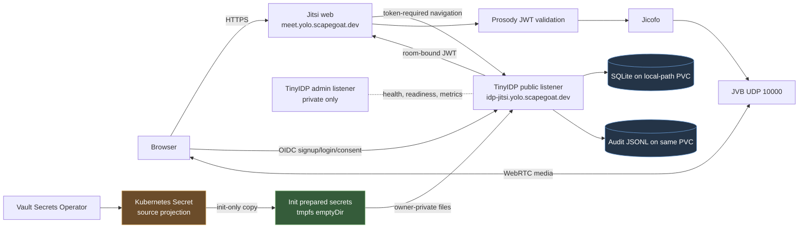
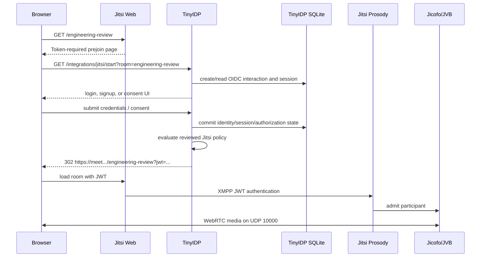

# tiny-idp: Jitsi Production Rollout and Least-Privilege Startup

This report explains the production-shaped TinyIDP and Jitsi Meet deployment on the Hetzner k3s cluster. The system makes TinyIDP the identity and token-issuing authority for a Jitsi installation without replacing Jitsi's XMPP control plane. It also records the practical work needed to turn that architectural design into a safe Kubernetes workload: persistent SQLite state, Argo CD synchronization, Vault-managed secrets, a non-root provider process, a public HTTPS topology, and a browser-mediated meeting admission path.

The deployment has reached an important but incomplete point. The persistent-volume initializer and the private runtime-secret handoff have been implemented, reviewed, merged, and deployed as immutable source revisions. The live TinyIDP process now reaches production UI catalog loading. It currently stops because the Jitsi theme catalog declares a theme without the required local CSS basename and no CSS asset is present in the reviewed config directory. Therefore this report distinguishes completed evidence from the final browser, media, audit, and metrics checks that remain to be run after that catalog correction.

> [!summary]
> - TinyIDP is the OIDC provider and Jitsi JWT issuer. Jitsi continues to use Prosody, Jicofo, and JVB for conferencing; TinyIDP does not replace those components.
> - The deployment deliberately runs the TinyIDP server as UID/GID 65532 with no Linux capabilities and a read-only root filesystem. A short-lived root init container performs only the narrowly necessary state and secret preparation.
> - The difficult production failures were contracts between subsystems: Argo waves and `WaitForFirstConsumer`; Linux directory traversal and capability semantics; Kubernetes Secret projection ownership; and TinyIDP's explicit production configuration validation.
> - The final reported startup blocker is precise: `theme "default" stylesheet must be a CSS basename`. Public end-to-end login and conferencing validation must wait for a reviewed `jitsi.css` asset and catalog reference.

## 1. The system being deployed

TinyIDP is a durable OpenID Connect provider written in Go. It owns local identities, password credentials, browser sessions, authorization interactions, signing keys, authorization-code and token issuance, and a synchronous audit trail. It exposes an embedded application-facing surface, but its production host is deliberately strict: callers must supply an issuer, database path, reviewed client catalog, reviewed theme catalog, scripted signup program, listener mode, and secret files that meet exact ownership and mode requirements.

Jitsi is not a single process. Its public web application renders the meeting UI. Prosody provides XMPP services and validates meeting JWTs. Jicofo coordinates conferences. JVB carries media over UDP. The TinyIDP Jitsi integration bridges a browser from the Jitsi web application's token-required admission point into a regular TinyIDP OIDC authorization interaction, applies the reviewed Goja Jitsi policy, and returns a short-lived HS256 token that Prosody accepts for one room.

The architecture therefore preserves responsibility boundaries. TinyIDP answers who authenticated and whether the reviewed policy may issue a token. Prosody answers whether the supplied JWT is acceptable to the conference service. Jicofo and JVB manage conference control and media. Kubernetes and Vault prepare trustworthy runtime inputs; they do not participate in OIDC decisions.



## 2. The public authorization path

The browser does not send a password to Jitsi. It starts at a Jitsi room URL. With guest access disabled and JWT validation enabled, the web UI cannot complete admission without a token. Its configured `TOKEN_AUTH_URL` directs the browser to TinyIDP's Jitsi integration endpoint with the desired room. TinyIDP turns that into a normal authorization interaction for the reviewed browser client `tinyidp-jitsi-prod`.

After a user signs in or completes signup, TinyIDP runs the Jitsi Goja policy. The policy receives trusted identity and request context, not arbitrary browser claims. If it allows issuance, TinyIDP signs a short-lived JWT using the shared secret also delivered to Jitsi through Vault. The token contains the issuer/audience/application identifiers expected by Prosody and a room binding. The browser returns to the Jitsi room URL with the token; Prosody validates it before conference admission.



The important property is that TinyIDP does not directly admit a media connection. It issues an authorization artifact under a narrow policy. Jitsi components make the conferencing decision using their normal JWT/XMPP flow.

## 3. Kubernetes deployment contracts

The TinyIDP manifests live at:

```text
/home/manuel/workspaces/2026-07-07/prod-tiny-idp/tiny-idp/
  deploy/kubernetes/tinyidp-jitsi/
```

The separate infrastructure repository holds the Argo CD Application:

```text
/home/manuel/code/wesen/2026-03-27--hetzner-k3s/
  gitops/applications/tinyidp-jitsi.yaml
```

The Argo Application is multi-source. Source one is the TinyIDP repository pinned to a full Git commit; source two is the upstream `jitsi-contrib/jitsi-helm` chart pinned to `2.22.0`. The source pin matters because a YAML path is not a deployment version. The commit hash identifies the exact manifest and application behavior Argo renders.

| Concern | Owner | Production artifact |
| --- | --- | --- |
| OIDC/Jitsi bridge and policy | TinyIDP | immutable TinyIDP Git revision and GHCR image tag |
| TinyIDP state and audit retention | Kubernetes local-path storage | `tinyidp-state` 2 Gi RWO PVC |
| Runtime secret bytes | Vault and VSO | `tinyidp-jitsi-runtime` Kubernetes Secret |
| Public TLS routing | Traefik and cert-manager | TinyIDP/Jitsi Ingresses and certificates |
| Conference control and media | Jitsi Helm chart | Prosody, Jicofo, JVB, web deployments |
| Reconciliation | Argo CD | `tinyidp-jitsi` Application |

TinyIDP's public listener uses `trusted-proxy-http`, rather than pretending that Traefik-terminated public HTTPS is a local direct-TLS server. The server receives forwarded request metadata only from the configured cluster CIDR. Its administrative listener remains private: the deployment contains no administrative Ingress and NetworkPolicy limits access to monitoring paths.

## 4. Persistent state is a lifecycle problem

The TinyIDP state volume contains SQLite data and audit output. A first startup and a later restart are different states. On a first start, `/state` can be empty. After a successful run, the application intentionally owns `/state` and `/state/audit` as UID 65532 with mode `0700`. The initializer must succeed in both states without giving the long-running application root or broad filesystem capability.

The final recovery algorithm is intentionally ordered:

```sh
# Init container: UID 0; caps CHOWN and FOWNER only.
chown 0:0 /state
chmod 0700 /state
if [ -e /state/audit ]; then
  chown 0:0 /state/audit
fi
mkdir -p /state/audit
chmod 0700 /state/audit
chown -R 65532:65532 /state
```

This sequence exists because Linux checks ownership, mode changes, and directory traversal separately. `CAP_CHOWN` permits ownership mutation; it does not by itself permit a process to search a `0700` directory owned by another UID. `CAP_FOWNER` permits mode repair, but it does not bypass DAC traversal. Reclaiming the parent path itself does not require traversing it. Once the initializer owns `/state`, it can name and reclaim the known `/state/audit` child before the final recursive handoff would otherwise need to descend into that private child.

The deployment validator now asserts the critical ordering. A two-pass BusyBox test with exactly `CHOWN` and `FOWNER` proved the relevant restart-state transition before live deployment:

```text
first pass: prepare /state and /state/audit -> 65532:65532 0700
second pass: reclaim parent and child -> prepare -> hand back
observed before handoff:
  0:0 700 /state
  0:0 700 /state/audit
```

## 5. Secret projection is not owner-private delivery

TinyIDP validates that its token and Jitsi shared-secret files are regular and owner-private. This is a deliberate runtime boundary: a server configured with a secret file should not silently accept a group-readable or unexpected file.

Kubernetes Secret projection has an important limitation for this case. `defaultMode: 0400` controls mode bits but does not set the file owner to the application UID. A pod-level `fsGroup` can also make a projected source group-readable. Directly mounting that source into a non-root TinyIDP process therefore caused the expected startup refusal:

```text
Error: token secret file must be regular and owner-only (0600 or 0400)
```

The correct design is a one-way handoff. The root init container receives the VSO-managed projection only at `/run/tinyidp-source-secrets`. It copies exactly `token-secret` and `jitsi-shared-secret` into a memory-backed `emptyDir`, changes both to `65532:65532`, and sets mode `0400`. The server receives only `/run/tinyidp-runtime-secrets`, mounted read-only. It cannot see or fall back to the projected source.

```text
Vault -> VSO -> Kubernetes Secret
                  | init container only
                  v
        /run/tinyidp-source-secrets
                  | cp, chown 65532:65532, chmod 0400
                  v
        memory-backed emptyDir
        /run/tinyidp-runtime-secrets
                  | server only, read-only mount
                  v
             TinyIDP UID 65532
```

This design is not a compatibility workaround. It is the mechanism that makes three required conditions true at once: Vault remains the secret authority, the server stays unprivileged, and TinyIDP's file validation remains strict.

## 6. Argo CD: desired revision versus active operation

Argo's Application specification and its active synchronization operation are different pieces of state. Changing `spec.sources[0].targetRevision` establishes a new desired revision. It does not necessarily cancel a currently retrying sync operation created for the old revision.

This mattered during the rollout. The Application spec correctly named a newer TinyIDP commit, yet `status.operationState` was still retrying an earlier commit and retained the old Deployment manifest. The observable symptom was a source-pin change without a new ReplicaSet. Clearing the stale operation and requesting a hard refresh created the expected new ReplicaSet.

The deployment evidence to collect after every immutable pin advance is therefore:

1. Application spec source revision.
2. Active `status.operationState.operation.sync.revisions` value.
3. Deployment generation and new ReplicaSet hash.
4. Pod image and rendered arguments.
5. Application sync and health status after the rollout completes.

Checking only the source pin is weak evidence. It proves desired state, not the manifest currently applied to the cluster.

## 7. The failure sequence and what it taught

The production effort uncovered independent contracts one after another. This did not indicate that the preceding fix was wrong. Each correction allowed execution to reach the next boundary.

| Order | Symptom | Underlying contract | Corrective direction |
| --- | --- | --- | --- |
| 1 | PVC remained unbound | `WaitForFirstConsumer` cannot bind before a consumer exists | Place PVC and Deployment in the same Argo sync wave |
| 2 | `chmod: /state: Operation not permitted` | `CHOWN` does not authorize mode changes | Add narrowly scoped `FOWNER` |
| 3 | `mkdir`/recursive handoff cannot use private existing paths | capabilities do not bypass traversal checks | reclaim `/state`, then existing audit child, before traversal |
| 4 | missing `production.theme-dir` | current production command requires an explicit reviewed theme root | pass `--theme-dir=/config` |
| 5 | token file not owner-private | projected Secret UID/group cannot satisfy TinyIDP's strict contract | copy into prepared tmpfs files owned by UID 65532 |
| 6 | source pin changed but old ReplicaSet persisted | Argo active operation was retrying old revision | clear stale operation and hard-refresh |
| 7 | `stylesheet must be a CSS basename` | theme catalog must name a local reviewed CSS asset | add reviewed CSS and basename to catalog |

The current system has completed the first six corrective directions. The seventh is the active blocker. The Jitsi `themes.json` defines a default theme and product name, but has no `stylesheet` property; the same ConfigMap source directory has no CSS asset. TinyIDP's production UI loader rejects that incomplete catalog before serving traffic. The correct next change is small but must be reviewed as an application-owned presentation asset: add a local `jitsi.css`, reference it by basename in the default theme, extend the manifest validator, then repeat startup and restart validation.

## 8. Validation plan after the catalog correction

The architecture is not complete until it is exercised from public HTTPS through media. The required validation sequence is intentionally ordered so that later tests rely on earlier evidence.

1. Confirm the new TinyIDP Pod is Ready after initial start.
2. Restart the Deployment deliberately and confirm the same persistent PVC recovers.
3. Confirm Argo reports `Synced` and `Healthy`, and inspect both public TLS endpoints.
4. Use a new browser identity to complete signup, login, and the Jitsi token bridge.
5. Verify unauthenticated admission redirects into TinyIDP, while a malformed JWT is rejected by Jitsi/Prosody and does not join a conference.
6. Use two independent browser contexts with fake media devices to join one room; verify both participant counts and conference connection state.
7. End the TinyIDP session, return to a fresh room, and verify that login is again required.
8. Inspect TinyIDP audit output, `/metrics`, and redacted service logs. Do not print secret values or bearer JWTs.

The maintained local Playwright scenarios under `examples/tinyidp-jitsi/browser-tests/tests/jitsi-plugin.spec.ts` already express these behavior classes: token-required redirect, cancellation, policy denial, malformed JWT rejection, explicit signup, account chooser, logout, and two-browser media connection. The production run must use public origins and unique test identities rather than local bootstrap credentials.

## 9. Current status and near-term next steps

The following has concrete evidence behind it:

- Jitsi web, Prosody, Jicofo, and JVB are running; JVB is configured for host UDP port 10000.
- The `tinyidp-state` local-path PVC is Bound.
- The Jitsi public certificate is Ready.
- TinyIDP state recovery and private runtime-secret materialization have passed manifest validation, capability-matched local tests, CI, focused PR review, immutable GitOps pinning, and live progression through their respective startup boundaries.

The following is not yet complete and must not be claimed as deployed behavior:

- TinyIDP readiness after the theme catalog correction.
- TinyIDP public TLS endpoint health.
- Production signup/login and Jitsi admission.
- Malformed-token and unauthenticated denial tests.
- Two-browser media validation through JVB.
- Logout/re-login behavior.
- Live audit, Prometheus, and redacted-log inspection.

The detailed source record is the `TINYIDP-PLUGIN-001` ticket under:

```text
/home/manuel/workspaces/2026-07-07/prod-tiny-idp/tiny-idp/
  ttmp/2026/07/23/
    TINYIDP-PLUGIN-001--plugin-api-for-downstream-integrations-and-jitsi-token-bridging/
```

Its implementation diary, especially Steps 17–21, contains exact commands, live errors, commits, and review guidance. The durable engineering rule from this rollout is straightforward: production manifests must be tested as lifecycle programs. Rendering verifies structure; a live first start, a live restart, and an end-to-end browser path verify the interactions that structure alone cannot prove.

## Related notes

- [[PROJECT REPORT - tiny-idp - Professional Signup and Application Membership Invitations]]
- [[PROJECT REPORT - tiny-idp - Strict Fosite Provider and Hosted OIDF Conformance]]
