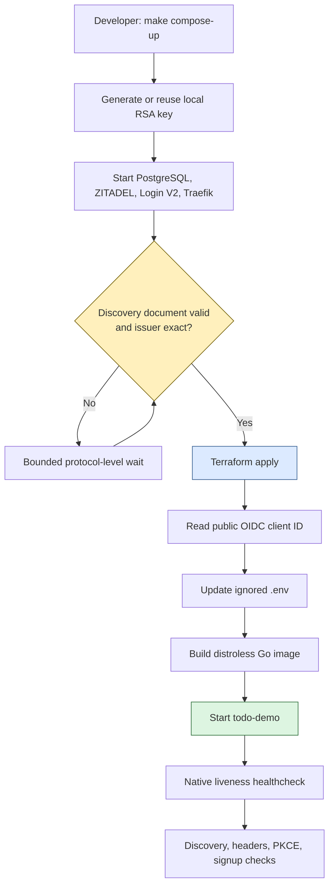
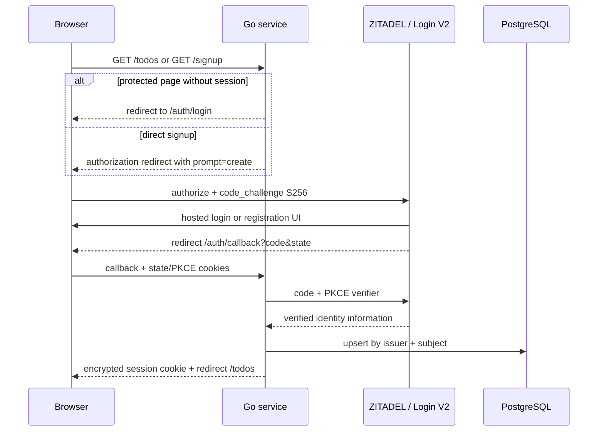
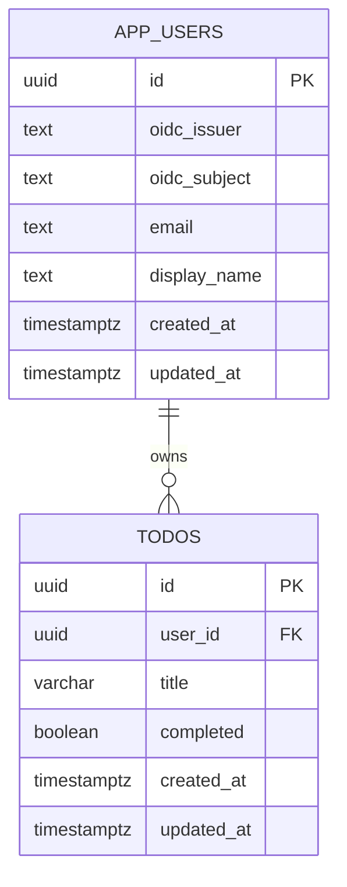
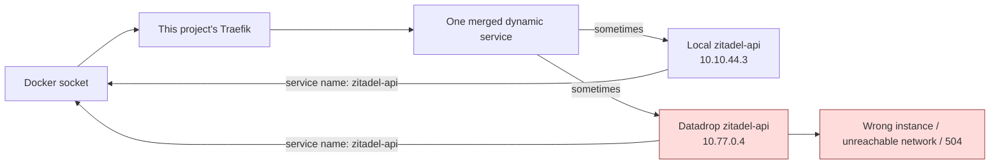

# PROJECT REPORT - ZITADEL Go Webapp MVP - From Identity Design to Deterministic Local Deployment

This project began with a small product requirement: a public landing page, hosted signup and login, and a private todo list. The implementation became a focused study of identity boundaries because the visible feature depends on several systems agreeing about one browser session. ZITADEL owns credentials and hosted interaction. Terraform owns the identity resources. PostgreSQL stores local users and todos. A Go service owns sessions, CSRF validation, request authorization, and HTML. Docker Compose runs the local constellation. Traefik gives browsers and containers one issuer address.

The application now runs locally as a complete five-service stack. Normal login through ZITADEL reaches the protected todo page. One authenticated user has created, toggled, and deleted a todo and logged out. Authorization requests use Code flow with PKCE S256, direct signup uses `prompt=create`, Terraform converges with no drift, and the non-secret smoke suite passes. A fresh registration callback and a second-user browser isolation proof remain open. That distinction is part of the result: the project has strong implementation evidence, but it does not convert partial browser coverage into a full acceptance claim.

> [!summary] Current result
> - A Glazed-configured, server-rendered Go service implements hosted ZITADEL login/signup, encrypted cookie sessions, independent CSRF protection, PostgreSQL-backed todos, SQL-enforced ownership, embedded migrations, browser security headers, liveness, and readiness.
> - Docker Compose runs PostgreSQL 17.2, ZITADEL 4.15.3, Login V2, Traefik 3.6.8, and a distroless non-root application container. `make compose-up` executes the required bootstrap sequence rather than starting all services at once.
> - Terraform provider 3.3.0 creates the local organization, project, public PKCE application, redirect URIs, and login policy through an ignored RSA System API identity. The current plan is zero-drift.
> - The most difficult deployment failure was not a ZITADEL defect. This project's Traefik read the global Docker socket, merged another project's same-named `zitadel-api` service, and routed Terraform RPCs to the foreign backend. Provider constraints fixed the defect without stopping the colleague's stack.
> - The remaining acceptance work is explicit: complete hosted registration as a fresh user, prove two-user isolation in a browser, and record invalid-CSRF behavior. The source repository also needs a reviewed commit series; most implementation files still exist outside Git history.

## 1. The project contract

The useful way to define this application is by what each participant may and may not do.

A visitor can read the landing page without a session. Selecting login or signup redirects the browser to ZITADEL Login V2. The application never receives a password and never renders a credential form. After ZITADEL returns an authorization code, the Go service exchanges it with a PKCE verifier, validates the resulting identity, stores an encrypted session cookie, and projects the external identity into a local row. An authenticated user can list, create, toggle, and delete only that user's todos.

This product contract excludes many plausible features:

- There is no application-owned password table, password-reset flow, email-verification flow, or MFA interface.
- There is no JavaScript application framework or JSON API for the todo UI.
- There is no role hierarchy. The only authorization relation is ownership.
- There is no shared todo list, invitation system, administrator console, or background worker.
- There is no application client secret. The OIDC client is public and uses Authorization Code with PKCE.
- There is no email-based ownership key. External identity is `(issuer, subject)`.

The narrow surface is deliberate. It makes the identity and authorization path small enough to inspect from redirect construction through SQL mutation.

### Acceptance conditions

The project design treats the following as separate evidence gates:

| Gate | Current status | Evidence |
| --- | --- | --- |
| Public landing and health endpoints | Passed | Live Compose service and HTTP tests |
| OIDC discovery and exact issuer | Passed | Smoke test against `http://zitadel.localhost:18080` |
| Authorization Code + PKCE S256 | Passed | Redirect inspection and preserved signup experiment |
| Direct signup request with `prompt=create` | Passed | Smoke test and hosted registration route reached |
| Normal login callback | Passed | Real administrator login reached `/todos` |
| One-user todo lifecycle | Passed | Create, toggle, delete, reload, and logout exercised |
| Fresh hosted registration callback | Open | Registration route reached; completion hit a transient gateway timeout |
| Two-user ownership in PostgreSQL | Passed | Integration test against real PostgreSQL |
| Two-user ownership in browser | Open | Ticket task `cjw5` |
| Missing/invalid CSRF rejected | Unit behavior passed; browser proof open | CSRF tests and protected wrapper |
| Terraform convergence | Passed | Apply followed by detailed plan exit `0` |
| Deterministic stopped-to-healthy startup | Passed | Ordered `make compose-up` after proxy isolation fix |

A passing row does not imply the rows below it. Request construction proves that a redirect is correct; it does not prove callback interoperability. A database integration test proves ownership predicates; it does not prove that browser identity is mapped to the intended local user. This report keeps those layers separate.

## 2. System ownership

The implementation uses several control planes, and correctness depends on not assigning the same resource to two of them.

| Resource | Owner | Persistence boundary |
| --- | --- | --- |
| Local processes, ports, network, volumes | Docker Compose | Compose configuration and Docker state |
| ZITADEL organization, project, OIDC app, login policy | Terraform | Terraform state and ZITADEL API |
| First local Terraform identity | Bootstrap script plus ZITADEL startup config | Ignored RSA private key and ZITADEL public key |
| Credentials, registration, recovery, hosted login | ZITADEL | ZITADEL PostgreSQL event store and master key |
| Local users and todos | Go service | Application PostgreSQL database |
| Application schema | Go binary | Embedded SQL and migration ledger |
| Browser session and CSRF state | Go service | Encrypted/signed cookies |
| Production runtime declaration | Future GitOps repository | Argo CD and Kubernetes resources |
| Production secret delivery | Future Vault/VSO integration | Vault and Kubernetes Secrets |

The local constellation follows this sequence:



This order is not an optimization. Terraform cannot create the OIDC client until ZITADEL exists, and the Go service cannot initialize its relying party until the OIDC client ID exists. A single undifferentiated `docker compose up` cannot represent that dependency on a fresh checkout.

## 3. Repository shape and command surface

The application repository is `/home/manuel/code/wesen/2026-07-25--zitadel-go-test`. The main implementation surfaces are:

```text
cmd/todo-demo/
  main.go                 Cobra/Glazed command root
  serve.go                configuration, OIDC, routes, server lifecycle
  healthcheck.go          shell-free in-container liveness probe
internal/app/
  app.go                  public routes, readiness, headers, logging
  csrf.go                 signed CSRF cookie and form-token validation
  todos.go                protected todo handlers
internal/store/
  models.go               local user and todo types
  store.go                storage contracts
  postgres/
    migrations.go         embedded migration engine
    todos.go              user projection and owned todo queries
    migrations/001_initial.sql
internal/web/
  templates.go            embedded templates and static assets
  templates/              landing, layout, private todo page
  static/app.css          monochrome structure and pastel text accents
infra/zitadel/local/      provider-pinned identity resources
scripts/                  bootstrap, readiness, Terraform handoff, smoke
compose.yaml              complete local runtime
Dockerfile                static build and distroless runtime
Makefile                  ordered operator workflow
```

The executable has two important commands:

```text
todo-demo serve
  --listen
  --database-url
  --public-url
  --zitadel-issuer
  --zitadel-client-id
  --session-key
  --csrf-key

todo-demo healthcheck
```

Glazed field definitions map the `serve` settings to `TODO_DEMO_*` environment variables. Database, session, and CSRF values use secret field types, which prevents help and diagnostic tooling from treating them as ordinary display values. The process refuses to start unless the database URL, public URL, issuer, client ID, and two independent 32-byte keys are present.

The choice to expose a native `healthcheck` command follows from the runtime image. `gcr.io/distroless/static-debian12:nonroot` has no shell, curl, or wget. The health command performs a bounded request to `http://127.0.0.1:8080/healthz`; Compose invokes the same binary already present in the image.

## 4. The HTTP boundary

The server uses Go 1.22-style `http.ServeMux` route patterns. Public application routes and identity routes are composed at the top level:

```text
GET  /                         public landing page
GET  /healthz                  process liveness
GET  /readyz                   PostgreSQL-aware readiness
GET  /static/*                 embedded assets
GET  /auth/login               SDK authorization start
GET  /auth/callback            SDK callback
GET  /auth/logout              SDK logout
GET  /signup                   PKCE authorization start with prompt=create
GET  /todos                    authenticated private page
POST /todos                    authenticated + CSRF
POST /todos/{id}/toggle        authenticated + CSRF + owner predicate
POST /todos/{id}/delete        authenticated + CSRF + owner predicate
```

The third-party authentication handlers are mounted on the outer router. This placement caused a subtle security-header defect during implementation: middleware originally wrapped only the inner application mux, so `/auth/login` redirects did not receive the same browser policy as HTML pages. `App.WithSecurity` now wraps the outer router, covering ZITADEL SDK routes, direct signup, protected pages, and public application routes.

The response policy is:

```text
Content-Security-Policy:
  default-src 'self';
  base-uri 'none';
  frame-ancestors 'none';
  form-action 'self'
Referrer-Policy: no-referrer
X-Content-Type-Options: nosniff
X-Frame-Options: DENY
```

`form-action 'self'` is compatible with the application because credentials are entered on ZITADEL's hosted page after a top-level redirect. Application forms submit only to the Go service.

The HTTP server sets explicit header, read, write, idle, and shutdown timeouts. On `SIGINT` or `SIGTERM`, it starts a bounded graceful shutdown rather than terminating active requests immediately.

## 5. Authentication: one code flow, two entry points

Normal login and direct signup are not separate authentication systems. They create the same OIDC Authorization Code + PKCE transaction, with one difference: signup adds `prompt=create`.



The configured scopes are `openid profile email`. The OIDC application has no client secret:

```hcl
auth_method_type = "OIDC_AUTH_METHOD_TYPE_NONE"
grant_types      = ["OIDC_GRANT_TYPE_AUTHORIZATION_CODE"]
response_types   = ["OIDC_RESPONSE_TYPE_CODE"]
app_type         = "OIDC_APP_TYPE_WEB"
```

PKCE protects the authorization-code exchange by binding the code to a verifier held by the browser transaction. State binds the callback to the authorization request. The relying party stores state and PKCE material in encrypted cookies. Local HTTP requires those cookies to omit `Secure`; production HTTPS must set it. The decision is derived from the canonical public URL rather than from a separate boolean that could drift.

### The signup adapter

The high-level `zitadel-go` authentication initializer creates normal login routes but does not expose custom authorization URL parameters for one route. The implementation therefore constructs a matching low-level relying party for `/signup` and invokes:

```go
rp.AuthURLHandler(
    func() string { return encryptedState },
    relyingParty,
    rp.WithPromptURLParam("create"),
)
```

The signup relying party uses the same issuer, client ID, redirect URI, scopes, cookie key, and PKCE behavior as normal login. A ticket-local experiment proved the generated request includes:

- `response_type=code`;
- `code_challenge_method=S256`;
- `prompt=create`;
- encrypted state;
- state and PKCE cookies.

The browser reached hosted registration. Completion of a fresh registration callback remains open because the registration UI later returned a transient gateway timeout. The request-construction evidence remains valid, but callback acceptance for a newly created user is a distinct gate.

### Authorization codes are single-use

During browser automation, the first callback exchange succeeded and established a valid application session. A later Playwright retry followed the callback again, causing ZITADEL to reject the already-redeemed code with `Errors.AuthRequest.NoCode`. Navigating to `/todos` showed that the first exchange had completed correctly.

This is expected protocol behavior. Browser automation should wait for the final application URL and must not replay callback navigation as a generic retry mechanism.

## 6. Identity projection and ownership

The application stores a local user row because todos need a stable foreign key and because request handlers should not call ZITADEL to authorize ordinary operations. The external identity key is:

```sql
UNIQUE (oidc_issuer, oidc_subject)
```

The callback and protected middleware upsert profile fields while retaining that key:

```sql
INSERT INTO app_users (
    id, oidc_issuer, oidc_subject, email, display_name
)
VALUES (...)
ON CONFLICT (oidc_issuer, oidc_subject) DO UPDATE SET
    email = EXCLUDED.email,
    display_name = EXCLUDED.display_name,
    updated_at = now()
RETURNING ...;
```

Email is cached profile data. It is not identity. The same address may appear under different issuers, an address may change, and an identity token may omit or vary presentation fields. Subject alone is also insufficient because subjects are scoped by issuer.

The local relationship is:



Every mutation includes `user_id` in the SQL predicate:

```sql
UPDATE todos
SET completed = NOT completed, updated_at = now()
WHERE id = $1 AND user_id = $2;

DELETE FROM todos
WHERE id = $1 AND user_id = $2;
```

A foreign todo and a nonexistent todo both affect zero rows and become `pgx.ErrNoRows`, which the HTTP layer maps to `404`. The service never fetches by todo ID and checks ownership afterward. This removes the interval in which unscoped data exists in application memory and makes the database operation itself enforce the authorization condition.

A PostgreSQL integration test creates two distinct users, creates a todo for the first, and verifies that the second cannot toggle or delete it. That test uses a real Compose PostgreSQL instance rather than a SQL mock.

## 7. Migrations as part of the binary contract

The application embeds numbered SQL files with `go:embed`. Startup loads them in lexical order, computes SHA-256 checksums, opens a transaction, obtains PostgreSQL advisory lock `7251001`, and creates the migration ledger if needed:

```sql
CREATE TABLE IF NOT EXISTS schema_migrations (
    name text PRIMARY KEY,
    checksum bytea NOT NULL,
    applied_at timestamptz NOT NULL DEFAULT now()
);
```

For each migration:

```text
if migration name absent:
    execute SQL
    insert name and checksum
else if stored checksum differs:
    fail startup
else:
    continue
```

The transaction-scoped advisory lock serializes concurrent startup. The checksum rule prevents an applied migration from being silently rewritten in source. A schema change requires a new migration.

The current initial schema contains `app_users`, `todos`, the issuer/subject uniqueness constraint, owner cascade deletion, title non-emptiness and length checks, and an index on `(user_id, created_at DESC, id DESC)`.

Running migrations in the service is reasonable for this one-replica MVP. A future multi-replica or tightly controlled production rollout may move migration execution into an explicit Job while retaining the embedded migration source and ledger rules.

## 8. CSRF and session security

The application uses cookie sessions, so every state-changing route requires CSRF protection. The CSRF implementation has an independent 32-byte key. Independence matters because session-key rotation invalidates login sessions, while CSRF-key rotation invalidates form tokens; combining them couples two operational decisions.

Token issuance creates 32 random bytes and encodes them as URL-safe base64. The cookie stores:

```text
token + "." + base64url(HMAC-SHA-256(csrf_key, token))
```

The HTML form receives the unsigned token. Validation performs three checks:

1. the cookie exists and has exactly two components;
2. the HMAC signature matches in constant time;
3. the signed cookie token equals the submitted `csrf_token` in constant time.

The cookie is `HttpOnly`, `SameSite=Lax`, path `/`, and `Secure` when the public URL is HTTPS. All three POST route families pass through the authenticated wrapper and then the CSRF wrapper before the handler receives a `store.User`.

The protected handler never accepts a user ID from form data. It obtains verified `UserInfo` from the SDK middleware, upserts `(issuer, subject)`, and passes the returned local UUID directly to the storage method.

Successful mutations use `303 See Other` to `/todos`. This Post/Redirect/Get path prevents a browser refresh from resubmitting the previous mutation.

## 9. The local identity runtime

The Compose stack contains five required services:

| Service | Image or build | Responsibility |
| --- | --- | --- |
| `postgres` | `postgres:17.2-alpine` | ZITADEL and application databases |
| `zitadel-api` | `ghcr.io/zitadel/zitadel:v4.15.3` | Identity API, OIDC endpoints, event store |
| `zitadel-login` | `ghcr.io/zitadel/zitadel-login:v4.15.3` | Hosted Login V2 UI |
| `proxy` | `traefik:v3.6.8` | One browser/container-visible issuer and route split |
| `todo-demo` | local multi-stage build | Go web service |

PostgreSQL publishes port `5433` for host-run integration tests. A first-volume initialization script creates `zitadel_todo_demo`; ZITADEL uses the default `zitadel` database. Both use one local administrator for convenience. Production design uses separate roles and a Vault-backed database bootstrap operation.

ZITADEL and Login V2 share a bootstrap volume containing the Login service credential produced during first-instance initialization. Traefik routes `/ui/v2/login` to Login V2 and ZITADEL protocol/API paths to the API service. The ZITADEL backend uses h2c where required.

### One issuer string in two network contexts

The canonical local issuer is:

```text
http://zitadel.localhost:18080
```

The browser resolves `zitadel.localhost` to host loopback. Inside the Compose network, Traefik has `zitadel.localhost` as an alias and listens on internal port `18080`. The Go container therefore discovers and exchanges codes through the same issuer string returned to the browser.

The Go SDK constructor expects a hostname rather than a full URL. The helper parses scheme, hostname, and port first. An earlier attempt passed the full issuer directly and produced a malformed path resembling:

```text
https://http//localhost:18080/.well-known/openid-configuration
```

For HTTP, the helper uses `zitadel.WithInsecure(port)`. For HTTPS, it uses the default secure constructor with an explicit port only when needed.

### Persisted external configuration

ZITADEL persists its external hostname and port in PostgreSQL. Changing the Compose issuer variables and restarting containers does not necessarily change the initialized instance. During development, moving from the original `localhost:8080` to `zitadel.localhost:18080` required a destructive local reset:

```bash
docker compose --env-file .env down -v
```

This reset is appropriate only because the local instance is disposable. The runbook distinguishes normal shutdown from volume deletion.

## 10. Declarative local identity configuration

Terraform provider `zitadel/zitadel` version `3.3.0` owns four resources:

```text
zitadel_organization.todo_demo
zitadel_project_v2.todo_demo
zitadel_application_v2.todo_demo_web
zitadel_login_policy.todo_demo
```

The application resource declares the exact callback and logout boundaries:

```text
http://localhost:8081/auth/callback
http://localhost:8081/
```

It is configured as a public Web application with Authorization Code, no client secret, bearer access tokens, and development mode for local HTTP. The login policy enables user login and registration and sets the default redirect URI.

### The first API credential

Terraform cannot create the first credential it needs to call ZITADEL. The initial design accepted a short-lived human PAT through `TF_VAR_zitadel_access_token`, and the helper deliberately refused to run without it. An experiment considered exporting the token from an authenticated Console browser session to a loopback receiver. Browser origin protections blocked that transfer, no token was saved, and no workaround was attempted.

The final local design uses ZITADEL `SystemAPIUsers`. `scripts/bootstrap-local-system-api.sh`:

1. creates `.local/zitadel-system-api/` with restrictive permissions;
2. generates or reuses a 2048-bit RSA private key;
3. derives the public key;
4. base64-encodes only the public key;
5. updates `ZITADEL_SYSTEMAPIUSERS` in ignored `.env`;
6. assigns the disposable local identity system-level `IAM_OWNER` membership.

The Terraform provider reads the private key from:

```text
.local/zitadel-system-api/terraform-local-private.pem
```

The private key is ignored by Git and the Docker build context. `.env` contains public-key configuration and the public OIDC client ID, not the private key.

This IAM owner is a local-development shortcut. The production design calls for a Vault-delivered, rotated machine credential with reviewed scope. The local bootstrap proves ordering and API compatibility; it is not a production privilege template.

### Convergence over redundant declarations

The provider's optional `login_version` block did not round-trip under provider `3.3.0`. Every plan proposed the same addition after a successful apply. Login V2 was already enabled globally in the ZITADEL runtime configuration, so the redundant application block was removed. The subsequent plan returned no changes.

A declarative system is not improved by accepting known perpetual drift. Either the field must round-trip and remain declared, or another authoritative configuration must own it and the redundant declaration must be removed with a documented reason.

## 11. Deterministic startup

The Make targets encode a strict dependency chain:

```make
compose-up: configure-local-zitadel
	docker compose --env-file .env up --build --wait todo-demo

identity-up: bootstrap-local-system-api
	docker compose --env-file .env up -d --wait \
		postgres zitadel-api zitadel-login proxy

wait-local-zitadel: identity-up
	./scripts/wait-local-zitadel.sh

configure-local-zitadel: wait-local-zitadel
	./scripts/configure-local-zitadel.sh
```

The discovery wait polls the exact public issuer URL for at most 120 seconds and parses the JSON response. Success requires `document.issuer == configured issuer`. This is stronger than checking a TCP socket or a proxy process.

Traefik also has a native healthcheck using its built-in command and enabled `/ping` endpoint. That check is useful for Compose dependency state, but it is intentionally not treated as protocol readiness. The OIDC discovery wait establishes the latter.

The application does not contain a long generic retry loop for OIDC initialization. Such a loop would delay deterministic failures—wrong issuer, DNS, client ID, redirect configuration—and move orchestration policy into the service. The process fails clearly when its already-declared runtime dependencies are invalid.

## 12. The deployment failure: global Docker discovery

The most difficult failure appeared after the first successful browser flow. Recreating the stack produced several symptoms:

- the proxy, API, and Login V2 containers reported healthy;
- OIDC discovery sometimes returned `200`;
- the Go app sometimes timed out during discovery and became unhealthy;
- Terraform intermittently received `504 Gateway Timeout`;
- increasing health grace periods changed timing but did not eliminate the failure.

The decisive line came from Traefik's access log:

```text
POST /zitadel.org.v2.OrganizationService/ListOrganizations HTTP/2.0
504
backend h2c://10.77.0.4:8080
```

Docker inspection showed:

```text
this project: zitadel-zitadel-api-1       10.10.44.3
other project: datadrop-zitadel-api-1     10.77.0.4
```

The local proxy had mounted `/var/run/docker.sock` and enabled the Docker provider. That provider reads daemon-wide container metadata. Another active project also exposed Traefik services named `zitadel-api` and `zitadel-login`. Although the projects used different host rules and networks, the dynamic service names collided. Traefik combined backend definitions and selected the foreign server for some requests.



A project-specific Docker network did not solve the entire problem. It prevented accidental shared attachment but did not scope provider discovery. The correct fix is a provider constraint.

Local routed services now carry:

```yaml
labels:
  - todo-demo.stack=zitadel-go-test
  - traefik.enable=true
  - traefik.docker.network=zitadel-go-test
```

The proxy includes:

```yaml
command:
  - --providers.docker=true
  - --providers.docker.exposedbydefault=false
  - --providers.docker.constraints=Label(`todo-demo.stack`,`zitadel-go-test`)
  - --providers.docker.network=zitadel-go-test
```

After recreation, Terraform applied without changes, the detailed plan returned zero drift, all five services became healthy, the smoke test passed, and proxy logs contained no foreign `10.77.0.x` backend.

### Why the diagnosis took several iterations

Each preliminary observation was valid but incomplete.

- A healthy ZITADEL process did not prove proxy routing.
- A healthy Traefik `/ping` endpoint did not prove Docker dynamic configuration.
- One successful discovery request did not prove every route would select the same backend.
- A unique network did not constrain what the provider ingested from the Docker socket.
- Application retries reduced visible crash frequency but did not correct backend selection.

The selected backend IP connected the request failure to a specific foreign container. Once that evidence existed, the repair was small and did not require changes to ZITADEL, Terraform, the Go SDK, or the colleague's stack.

## 13. Validation as layered evidence

The project uses several validation classes because no single test crosses every boundary.

| Layer | Command | Property established |
| --- | --- | --- |
| Go unit/integration safety | `go test -race ./...` | Handler, CSRF, migration, and ownership behavior without detected data races |
| Static Go analysis | `go vet ./...` | Standard compiler-adjacent correctness checks |
| Shell quality | `shellcheck scripts/*.sh` | Bootstrap and validation script hazards |
| Terraform schema | `terraform -chdir=infra/zitadel/local validate` | Provider configuration and resource schema validity |
| Terraform convergence | `terraform ... plan -detailed-exitcode` | Live ZITADEL resources equal declarations |
| Compose rendering | `docker compose --env-file .env config` | Environment interpolation and Compose schema |
| Runtime orchestration | `make compose-up` and `docker compose ps` | Ordered startup reaches healthy state |
| Protocol smoke | `make smoke-local` | Health, readiness, exact issuer, headers, PKCE, state cookies, direct-signup prompt |
| PostgreSQL ownership | targeted integration test | A second user cannot toggle or delete the first user's todo |
| Real browser | Playwright/manual flow | Login callback, local session, private UI, CRUD, logout |
| Ticket quality | `docmgr doctor` | Documentation metadata and relations remain valid |
| Source whitespace | `git diff --check` | No whitespace errors in current changes |

The smoke script deliberately does not follow the full identity redirect. It checks public protocol construction without owning a browser user credential. Browser acceptance remains a separate test.

The report audit reran the major checks after the proxy fix. The observed state was:

```text
five required containers: healthy
make smoke-local: passed
go test -race ./...: passed
go vet ./...: passed
shellcheck scripts/*.sh: passed
terraform validate: passed
terraform detailed plan: no changes, exit 0
docker compose config: passed
git diff --check: passed
```

## 14. The implementation chronology

The project developed in four broad phases.

### Phase 1: evidence and design

The repository initially contained only docmgr scaffolding. Research mapped the sibling Terraform and k3s repositories, the shared PostgreSQL and Vault patterns, Argo CD ownership, current ZITADEL chart and provider schemas, and the Go SDK. Upstream revisions and web sources were preserved in the ticket. A Helm render proved chart `10.0.4` against Kubernetes requirements, and a focused Go experiment proved direct-signup request construction.

The resulting design document defines product behavior, SQL, routes, configuration, visual tokens, local development, production k3s deployment, Vault/VSO, GitOps ordering, testing gates, and owner decisions. It was uploaded with the diary to reMarkable.

### Phase 2: executable application

The first implementation slice created the Glazed command, embedded HTML/CSS, PostgreSQL connectivity, health/readiness, Dockerfile, Compose stack, and runbook. Subsequent steps added embedded migrations, ownership-scoped storage, real PostgreSQL integration coverage, SDK authentication, the direct-signup relying party, private todo handlers, CSRF protection, and security headers.

The implementation order kept unsafe routes unavailable. Todo handler methods and templates were prepared before POST routes were registered; route registration waited until CSRF validation and authenticated local-user derivation existed.

### Phase 3: declarative identity and browser validation

Terraform first used an explicit operator-provided PAT boundary, then moved to the local System API RSA mechanism. A successful apply created the organization, project, login policy, and PKCE application. The generated public client ID was handed to ignored `.env`. Browser validation then reached the private todo page and exercised one user's lifecycle.

### Phase 4: deployment stabilization and knowledge capture

Repeated recreation exposed the cross-project Traefik collision. The final fix added provider constraints, protocol-level startup gating, and a correct Make dependency chain. The reusable procedure was written to [[Research/playbooks/infra/PLAYBOOK - Local ZITADEL Docker Compose Go Web Service]]. This report and the backfilled diary preserve both the architecture and the failed approaches.

## 15. What remains incomplete

The open work is narrow but important.

### Fresh-user browser completion

The direct `/signup` route reaches hosted registration with the correct prompt and PKCE transaction. A fresh user must still complete registration, callback, local projection, and first `/todos` render. This will also verify that the low-level signup relying party's cookies are accepted through the high-level SDK callback path in the complete browser interaction.

### Two-user browser isolation

The PostgreSQL integration test proves the storage invariant. Browser acceptance must create or use a second ZITADEL user, verify that the first user's todos are absent, and attempt a foreign mutation URL. The expected result is `404`, not `403`, because missing and foreign objects are intentionally indistinguishable.

### Explicit browser CSRF rejection

Unit tests validate token behavior and all mutations pass through the CSRF wrapper. Browser/API evidence should submit a POST with no token and one with an invalid token and record `403` responses.

### Source history

The source repository has only the initial commit `0fb14dc`. The implementation, ticket, scripts, and vocabulary changes are modified or untracked. This is the largest collaboration risk in the current state. Before publishing or handing off the source repository:

1. inspect `.gitignore` and `.dockerignore` against `.env`, `.local/`, `.terraform/`, and Terraform state;
2. verify no private key or secret is staged;
3. split the implementation into reviewable commits by concern;
4. preserve the ticket and diary in the same history or an explicitly linked documentation commit;
5. rerun the full validation matrix from the staged tree.

Runtime success does not replace source-control hygiene.

## 16. Production design and unresolved owner decisions

The ticket contains a production path, but no production deployment was applied. The proposed architecture uses:

- one self-hosted ZITADEL and Login V2 deployment from official chart `10.0.4` / app `v4.15.3`;
- the existing single-node k3s cluster;
- Traefik ingress and cert-manager TLS;
- shared PostgreSQL 16 with an idempotent bootstrap Job;
- Vault and VSO for master key, database credentials, application keys, and Terraform machine credentials;
- Terraform for ZITADEL API resources;
- GHCR for immutable application images;
- Argo CD/GitOps for runtime resources;
- Prometheus/Grafana and Loki for observability.

The local and production systems preserve the same ownership sequence:

```text
secret and database prerequisites
  → deploy ZITADEL runtime
  → prove issuer readiness
  → apply ZITADEL Terraform resources
  → deploy application with client ID and runtime secrets
```

Four owner decisions remain before production work:

1. self-hosted ZITADEL or ZITADEL Cloud;
2. final public hostnames;
3. approval to use the existing SES identity;
4. machine-key lifetime and rotation procedure for Terraform.

The proposed production hosts in the design are:

```text
https://todo-zitadel.yolo.scapegoat.dev
https://zitadel.yolo.scapegoat.dev
```

These are design inputs, not deployed facts.

## 17. Review guide

A reviewer can understand the implementation efficiently in this order.

### 1. Start with startup and routing

Read:

- `Makefile`;
- `scripts/bootstrap-local-system-api.sh`;
- `scripts/wait-local-zitadel.sh`;
- `scripts/configure-local-zitadel.sh`;
- `compose.yaml`.

Confirm the dependency chain, provider constraint, unique network, public issuer alias, and secret boundary.

### 2. Follow one authentication request

Read `cmd/todo-demo/serve.go` from settings decode through:

- `zitadelFromIssuer`;
- `oidcAuthentication`;
- `signupHandler`;
- authenticated and CSRF wrappers;
- route registration.

Check that both relying parties use the same issuer, client ID, callback, scopes, cookie key, and secure-cookie decision.

### 3. Follow one mutation

Read:

- `internal/app/csrf.go`;
- `internal/app/todos.go`;
- `internal/store/postgres/todos.go`.

Verify the sequence is authenticated identity → local user projection → CSRF validation → parsed todo UUID → SQL predicate containing both todo and owner IDs → `303` or `404`.

### 4. Inspect durable state

Read:

- `internal/store/postgres/migrations.go`;
- `internal/store/postgres/migrations/001_initial.sql`;
- `infra/zitadel/local/main.tf`.

Separate application schema ownership from identity-resource ownership.

### 5. Reproduce evidence

```bash
cd /home/manuel/code/wesen/2026-07-25--zitadel-go-test

test -f .env || cp .env.example .env
make compose-up
make smoke-local
go test -race ./...
go vet ./...
shellcheck scripts/*.sh
terraform -chdir=infra/zitadel/local validate
terraform -chdir=infra/zitadel/local plan -detailed-exitcode
docker compose --env-file .env ps
git diff --check
```

Then complete the browser flow at:

```text
application: http://localhost:8081
issuer:      http://zitadel.localhost:18080
```

## 18. Technical conclusions

Several conclusions from this project apply beyond the todo application.

**OIDC identity is a tuple.** `issuer` establishes the authority that assigned `subject`. Neither email nor subject alone has the required uniqueness and stability.

**Authentication and ownership have separate enforcement points.** ZITADEL verifies the browser identity. PostgreSQL predicates enforce todo ownership. Request handlers do not ask the identity provider whether a user owns an application row.

**Public clients still need a server-side security design.** PKCE removes the client-secret requirement; it does not provide CSRF protection for cookie-authenticated application forms, choose cookie attributes, or enforce SQL ownership.

**Declarative configuration begins after an explicit bootstrap credential exists.** Terraform cannot create its own first API authority. The bootstrap step must be named, protected, and different in local and production environments.

**Protocol readiness is stronger than process readiness.** A healthy proxy and healthy identity process can still expose no correct route. A readiness gate should execute the protocol operation required by the next stage and validate its semantic response.

**Docker provider scope is daemon-wide unless constrained.** Compose project names and networks do not automatically filter Traefik discovery. A proxy with Docker socket access needs an explicit label constraint when unrelated stacks share the daemon.

**Selected backend addresses are primary routing evidence.** When a reverse proxy returns intermittent errors, inspect the backend IP or container identity for each request. Repeated client retries cannot distinguish a slow intended backend from a fast selection of the wrong backend.

**Distroless changes operations, not only image size.** Health checks, debugging, and startup probes must be designed without shell utilities. A native health command provides a stable contract for Compose and Kubernetes.

**A project report must preserve incompleteness.** Normal login and one-user CRUD are real evidence. They do not prove fresh signup or two-user browser isolation. Recording the boundary makes the remaining work executable rather than ambiguous.

## 19. Key project documents

- Ticket index: `/home/manuel/code/wesen/2026-07-25--zitadel-go-test/ttmp/2026/07/25/ZITADEL-001-WEBAPP-MVP--plan-a-go-webapp-mvp-with-zitadel-authentication-on-k3s/index.md`
- Architecture and implementation guide: `/home/manuel/code/wesen/2026-07-25--zitadel-go-test/ttmp/2026/07/25/ZITADEL-001-WEBAPP-MVP--plan-a-go-webapp-mvp-with-zitadel-authentication-on-k3s/design-doc/01-go-zitadel-webapp-mvp-architecture-design-and-implementation-guide.md`
- Investigation diary: `/home/manuel/code/wesen/2026-07-25--zitadel-go-test/ttmp/2026/07/25/ZITADEL-001-WEBAPP-MVP--plan-a-go-webapp-mvp-with-zitadel-authentication-on-k3s/reference/01-investigation-diary.md`
- Reusable infrastructure procedure: [[Research/playbooks/infra/PLAYBOOK - Local ZITADEL Docker Compose Go Web Service]]
- Shared platform map: [[Research/KB/Projects/infrastructure-and-release]]

## 20. Final assessment

The project achieved its principal local engineering objective. It turned a planning-only repository into a running Go web application whose identity, persistence, browser security, local infrastructure, and declarative ZITADEL resources can be inspected independently and exercised together. The current stack starts deterministically, survives coexistence with another ZITADEL Compose project, passes its automated checks, and supports real hosted login and authenticated todo operations.

The strongest part of the work is the preservation of boundaries. ZITADEL owns credentials. Terraform owns identity resources. The Go service owns its session and local authorization decisions. PostgreSQL enforces ownership in the mutation itself. Compose owns local process order. Traefik is constrained to the containers it is allowed to discover. Each boundary has a concrete failure mode and a corresponding test or operational check.

The project is not yet finished as a collaborative source deliverable or as a production deployment. Fresh-user and second-user browser evidence remains open, and the source implementation has not been organized into commits. Those are visible, bounded tasks. They do not invalidate the local architecture, and they should not be omitted from its status.
