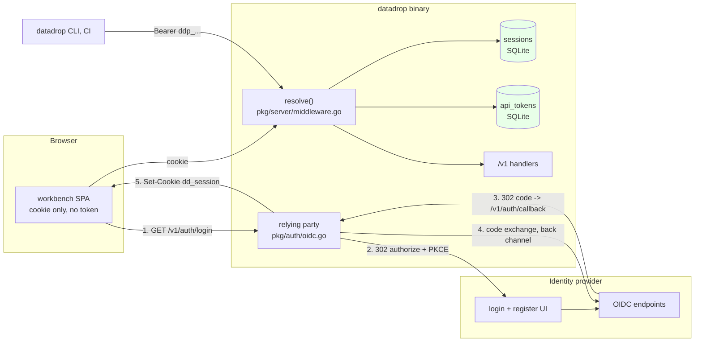
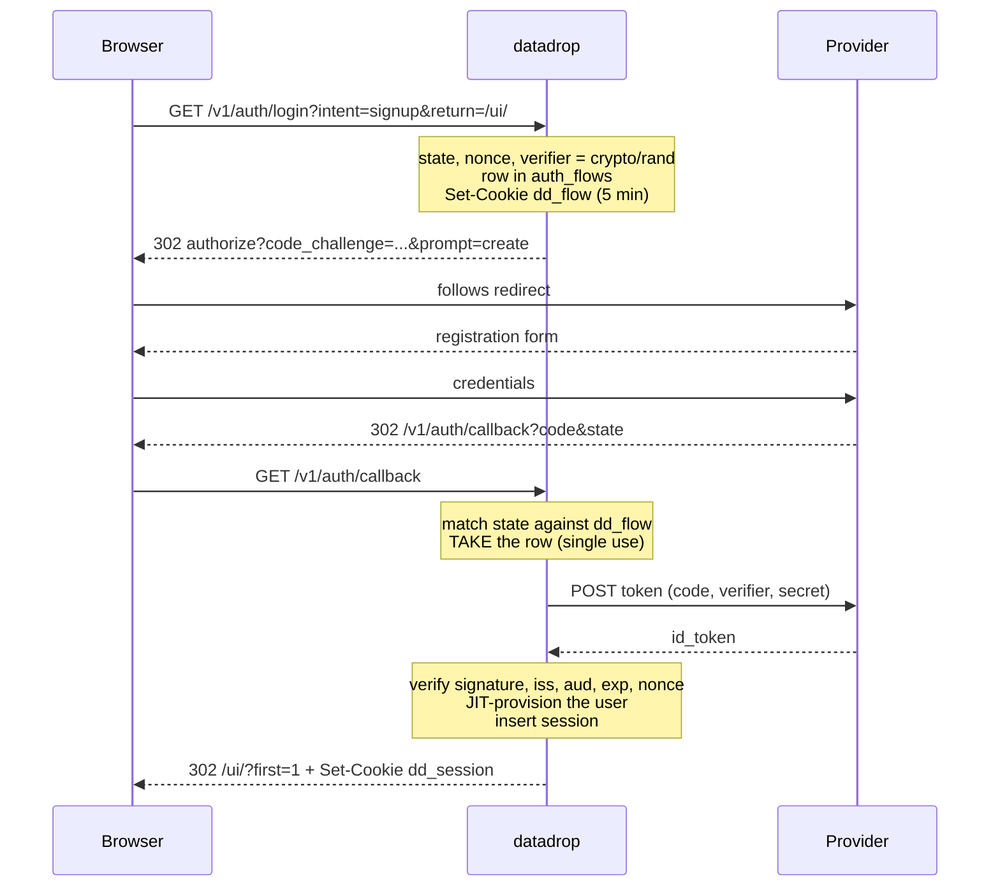

# PROJECT REPORT - go-go-datadrop v0.4 - Two Credentials, One Principal, and an Issuer That Is Not an Address

This report explains the fourth layer of `go-go-datadrop`: user accounts. [[PROJECT REPORT - go-go-datadrop v0.1 - Building an Append-Only Event Store from Two Reference Implementations|v0.1]] stores append-only events, [[PROJECT REPORT - go-go-datadrop v0.2 - Content-Addressed Datasets and the Staged Upload Protocol|v0.2]] stores immutable dataset versions, and [[PROJECT REPORT - go-go-datadrop v0.3 - One Typed Table, and Four Defects Only a Browser Could Find|v0.3]] draws charts of both. All three share one credential: a static string passed to `datadrop serve --token`. Everyone who can write holds the same string.

The work divides into three parts with different characters. The first is a design problem with a small number of load-bearing decisions, most of which are about what *not* to build. The second is an implementation problem that was largely mechanical once those decisions were made, and where the interesting events were two occasions on which a boundary established in an earlier ticket rejected a placement I had chosen. The third is a deployment problem, and it produced the single most surprising technical finding in the ticket: a hostname scheme that is correct in a browser, correct on a host, and unreachable from inside a container, for a reason specified in an RFC.

> [!summary]
> - Authentication and authorization are separate questions with separate homes. The identity provider answers "who is this person"; datadrop answers "what may they do here". Nothing in a request handler ever calls the provider, which is what makes an outage there affect only new sign-ins.
> - Two credential kinds — a browser session cookie and an opaque `ddp_` API token — resolve through one function to one `Principal` type. Every handler asks one question of it.
> - Rights are the intersection of drop membership and credential scope, computed per request. A token narrows its owner's rights and never carries rights of its own, so removing a member instantly narrows every token they hold with nothing to hunt down.
> - An OIDC issuer is an identity, not an address: the URL the server uses and the URL the browser is redirected to must be the same string. RFC 6761 makes `*.localhost` unusable for this inside a container, and no network alias or `/etc/hosts` entry can override it.
> - Shipped in 11 commits: 100 files, 14 278 insertions. 324 Go tests, 166 TypeScript tests, zero lint findings.

## What one static token cannot express

The starting point is a single field, `Config.Token`, compared in constant time against an `Authorization: Bearer` header. It is not a placeholder — it works, and for a single-operator deployment it is adequate. The question is what it makes impossible, and the answer is more specific than "multi-user support".

**Revocation has no unit smaller than everyone.** Rotating the token disconnects every client simultaneously, including ingest scripts on machines the operator does not administer. The cost is high enough that in practice nobody rotates, which is the actual failure rather than the theoretical one.

**Writes cannot be attributed.** `audit_log.actor` is the constant string `"token"`, and `pkg/server/middleware.go` documented why with an honest comment: tokens must never reach an audit row, and when every caller presents the same credential there is nothing else to record. An audit trail that cannot attribute is a log.

**There is no gradation between read and write, or between one drop and another.** A CI job that appends events to one stream holds a credential that can delete every dataset version in the database.

**Sharing means sharing the credential.** There is no signup because there is nothing to sign up to; no per-user state exists. The only sharing primitive is `public_read`, a boolean per drop, so the two reachable states are "everyone who has the token" and "the entire internet".

**A leaked credential is unbounded and undetectable.** No expiry, no last-used timestamp, no distinctive prefix a secret scanner could match, no per-credential audit trail.

These five failures determined the whole design. Every mechanism added in this layer addresses one of them, and a mechanism that addresses none of them is scope creep.

## The derivation: two questions, two homes

The instinct on reaching for an identity provider is to move as much as possible into it. Zitadel has organisations, projects, roles, grants and metadata; drop membership could be modelled on any of them. Three arguments settle against it.

The first is that it answers the wrong question. A provider's roles describe what a user is within an identity system. A drop's member list describes what a user may do to a body of data. Modelling the second in the first makes adding a collaborator a management API call — a network round trip, an availability dependency, and an inconsistency window on every permission check.

The second is availability. The design goal is that a provider outage affects only new sign-ins: existing sessions and every API token keep working. That is keepable only if no request handler ever calls the provider. Putting authorization data there makes an outage take down every request.

The third is substitutability. Nothing in the server is Zitadel-specific. It speaks OIDC discovery, authorization code with PKCE, ID token verification against JWKS, and RP-initiated logout. Every endpoint is read from the discovery document rather than hard-coded. Swapping in Keycloak or Authentik is a configuration change, and that is only true if nothing but authentication depends on the provider.

The boundary that follows:

| | Identity provider | datadrop |
|---|---|---|
| Passwords, MFA, email verification | ✔ | |
| The registration form | ✔ | |
| The user's name and email | authoritative | cached, refreshed at sign-in |
| Users, ownership, membership | | ✔ |
| API tokens, sessions, audit | | ✔ |

The `users` table duplicates `email` and `name`. That duplication is a cache, it is refreshed on every sign-in, and it is never authoritative. The profile tile says so in one sentence, because a user who does not know that reads the read-only fields as a defect.

## Two credentials, one Principal

The requirement that shapes the implementation more than any other is that machine clients must work without a browser. `go-go-datadrop` is CLI-first; the README's quick start is built out of `curl`, and `cmd/datadrop/smoke_test.go` exercises the binary end to end. Any scheme where the only way to obtain a credential involves a redirect makes `curl` a second-class citizen.

So there are two credential kinds, and exactly one type that represents their result:

```go
type Principal struct {
    Kind    Kind      // Anonymous | Root | Session | Token
    UserID  string    // "" for Anonymous and Root
    Scopes  ScopeSet  // what the CREDENTIAL permits — never a grant
    TokenID string    // the public half of an API token; safe to log
    SessionID string  // sha256 of the cookie, never the cookie
}
```

`resolve(r)` produces one of these per request and puts it in the context. Four properties of that function are deliberate, and each is a place where a plausible alternative is wrong.

**A bearer token beats a cookie.** A request carrying both is treated as the bearer's. An explicit credential should win over an ambient one, so a token-authenticated `curl` issued from a browser-logged-in developer's machine behaves as the token rather than as the human.

**An invalid credential resolves to anonymous rather than to an error.** A request with a stale token to a `public_read` drop must still succeed, because the drop is public. Conflating "presented something invalid" with "denied" breaks that, and it also leaks whether a token id exists.

**The static token is compared first, and in constant time.** It is operator-chosen and may be anything, including a string that begins `ddp_`, so a prefix switch before the comparison would be wrong.

**The resolver never writes a response.** Rejection is a per-handler decision, because the required role and scope are per-handler facts. A resolver that wrote its own 401 would make `/healthz` and the SPA shell unreachable without special-casing.

## Rights are an intersection, computed per request

The authorization decision has two halves that are kept in separate functions:

```go
// Half one: what is this person to this drop?
func EffectiveRole(p Principal, acl DropACL) Role

// Half two: what did they permit this particular credential to do?
func (p Principal) Allowed(scope Scope) bool

// Both, and only both.
func Authorize(p Principal, acl DropACL, required Role, scope Scope) bool {
    if !EffectiveRole(p, acl).AtLeast(required) { return false }
    return p.Allowed(scope)
}
```

A token is not a capability that carries rights of its own. It is a narrowed view of its owner's rights, and the narrowing is applied at request time rather than baked in at mint time. Three consequences follow, and the third is the reason the design is worth the two indexed lookups it costs.

- A token can never be minted with more power than its owner has, and cannot grow into more power later. Escalation by minting is impossible by construction rather than by a check.
- An `admin`-scoped token held by someone who is merely a `reader` on a drop is a reader on that drop. This is why the token-minting form can offer every scope without the operator having to reason about escalation.
- Removing someone from a drop instantly narrows every token they hold. There is nothing to hunt down and nothing to revoke.

That last property is stated as a test, because it is exactly what an optimisation would destroy:

```
a stranger cannot read                         403
the owner adds them as a reader                204
now they can read                              200
but not write                                  403
the owner promotes them                        204
and the same token writes                      201
the owner removes them                         204
and the same token is refused immediately      403
```

The subject's credential is minted once at the start and never touched. An implementation that cached rights on the token would pass every row but the last.

## The scope that is not a grant

The clearest bug in the ticket was found by writing that authorization matrix out in full, before any handler existed.

`Allowed` in its first form returned `false` for `KindAnonymous`. `EffectiveRole` correctly gives an anonymous caller `RoleReader` on a `public_read` drop, so the role half passed and the scope half failed, and `Authorize` returned false. Every anonymous read of a public drop would have returned 401 — a straight regression against v0.1 behaviour, in the one code path that has no credential and therefore no obvious place to notice.

The fix is a reframing rather than a special case. A scope is a limit on the *credential*; it is never a grant. An anonymous caller's credential permits reading. Whether there is anything to read is entirely `EffectiveRole`'s business. So `Anonymous()` carries `ScopeDropsRead`, and `Allowed` has no anonymous branch at all:

```go
func Anonymous() Principal {
    return Principal{Kind: KindAnonymous, Scopes: NewScopeSet(ScopeDropsRead)}
}

func (p Principal) Allowed(scope Scope) bool {
    if p.Kind == KindRoot { return true }
    return p.Scopes.Has(scope)
}
```

Two rows of the matrix pin it: "anonymous reads a public drop" and "anonymous cannot write a public drop".

## Why the backend holds the tokens

The v0.3 report contains a section titled *Authentication without cookies*, which recorded a real property: the workbench issued only `GET` requests, the token lived in `sessionStorage`, no cookie was ever set, and therefore no request was ever ambiently authenticated. That property is spent in this layer, and it is worth being explicit about what was bought with it.

Three arrangements were available:

| | Tokens in JavaScript | Provider token as our bearer | Backend for frontend |
|---|---|---|---|
| SPA is an OIDC client | yes (public) | yes (public) | no |
| Where the refresh token lives | browser | browser | nowhere |
| XSS blast radius | credentials valid at the provider are exfiltrated | same | one HttpOnly cookie, unreadable by script |
| Validation cost per request | — | JWKS verify or introspection | one indexed lookup |
| Revocation | wait for expiry | wait for expiry, or introspect every request | `DELETE FROM sessions` |
| CSRF surface | none | none | **real** |
| Works with the provider down | until expiry | until expiry, or not at all | indefinitely |

The deciding row is the third. A cross-site scripting defect in an application that renders user-supplied column names is not hypothetical, and the difference between "the attacker steals a credential valid at the identity provider" and "the attacker can issue requests while the page is open" is large.

The second column deserves its own sentence because it looks elegant: accept the provider's access token as datadrop's credential and validate it. It fails on revocation, since a JWT is valid until it expires and introspection is a network call on every request; on the CLI, which would need a browser to obtain one; and on substitutability, since accepting a foreign token format is a coupling that is hard to undo.

The cost of the chosen arrangement is CSRF, and it is paid in one function:

> A request whose method is not GET or HEAD, authenticated **by cookie**, is rejected unless its `Origin` header exactly equals the configured external origin.

`Origin` rather than a double-submit token because it is sent by every browser on every unsafe cross-origin request, cannot be set or forged by page JavaScript, requires no state or token minting, and is one function with one test. `SameSite=Lax` sits behind it as defence in depth, not as the primary control. Bearer-authenticated requests skip the check entirely, because a bearer token is not ambient — it has to be deliberately attached.

The check lives *inside* `authorizeDrop` rather than beside it, so there is no way to authorize a mutating request without passing through it. It is the control most likely to be forgotten on a future endpoint, and the test that guards it enumerates all sixteen mutating routes, fires each with a foreign origin, and asserts the `CrossOrigin` problem code specifically rather than merely a 403 — which any permissions failure would also produce.

## What is not stored

The reflex when implementing an OIDC relying party is to store the refresh token so the session can be renewed silently. The useful question is what it would be used for.

datadrop calls no API on the user's behalf. Authorization is entirely local, and the profile is a cache refreshed at sign-in. A refresh token would exist purely to extend a session whose lifetime the server already controls directly. So it is not stored, and three things follow:

- The most sensitive artefact in the flow never touches the database, the backups, or a support bundle.
- Session lifetime is one configuration value rather than an emergent property of two systems' expiry settings.
- Re-authentication is a redirect, and because the user is usually still signed in at the provider, that redirect is invisible.

What is given up: after the absolute deadline, a user whose provider session has also expired sees a login form. That is correct behaviour.

The lifetimes are 12 hours absolute and 2 hours idle. `expires_at` is set once and never extended. Extending an absolute deadline on activity is how a session becomes immortal, and an immortal session is a credential with no expiry.

Both checks are enforced in `GetSession`, not only in the background sweeper. A sweeper that is also the enforcement mechanism means a paused process is an authorization bypass.

## The token format

```
ddp_7f3k9m2qx4vb3_8h2n6p4r9tzw3xk5mcqf7bdy1sav0jne
└┬─┘└─────┬──────┘ └───────────────┬───────────────┘
 │        │                        └─ secret: 20 bytes, 160 bits
 │        └─ id: 8 bytes, public, stored in plaintext
 └─ fixed prefix
```

Each part answers a question that arose during design.

**The prefix makes a leaked credential findable.** Secret scanners, `gitleaks`, and a two-line pre-commit hook can all match a distinctive prefix; a bare base64 blob is indistinguishable from every other base64 blob in a repository. This is the highest-value byte-for-byte decision in the format.

**The separate public id turns verification into one indexed lookup** rather than a scan-and-compare over every stored hash, and it is what makes the id safe to write into an audit row and a log line. When someone reports a leaked credential, the question "what did it do" is answerable.

**Base32 without padding** rather than base64: case-insensitive on the wire, no `+` or `/` for a shell to mangle, URL-safe, and unambiguous when transcribed.

**Storage is SHA-256 of the secret half, not bcrypt or argon2.** This is the opposite of the rule for passwords and the reason is entropy, not fashion. A slow key-derivation function exists to make brute-forcing a low-entropy human-chosen secret expensive. This secret is 160 bits from `crypto/rand`; it is not brute-forceable at any cost, so a KDF would add tens of milliseconds to every API request and buy nothing.

The verification order is deliberate and is the kind of thing that reads as arbitrary until it is stated:

```
resolveAPIToken(raw):
    id, secret = parse(raw)                  # shape only
    row = api_tokens[id]
    if row is null:                     return NotFound
    if not constant_time_eq(sha256(secret), row.secret_hash): return NotFound
    if row.revoked_at is not null:      return NotFound
    if row.expires_at <= now:           return NotFound
    if users[row.user_id].disabled:     return NotFound
```

The secret comparison happens **before** the revoked and expired checks. The natural order is cheap checks first, and it is wrong: it turns the endpoint into an oracle for "does this token id exist and is it live", answerable without knowing the secret. Every failure path returns the same error for the same reason.

One further detail matters at ingest volume. `last_used_at` would otherwise be a database write per request, and with a single SQLite writer the credential check would become the bottleneck of the path it is supposed to guard. Writes are throttled to one per minute per token through a `sync.Map` on the store, and a failed write is logged at debug rather than failing the request.

## Architecture



Two arrows are absent by design: one from the browser to the provider carrying a token, and one from the request handlers to the provider. Step 4 is the only back-channel call, and it happens once per sign-in.

The Go layout follows the same separation:

```
pkg/auth/            pure: no HTTP, no SQL, no network
  principal.go       Principal, Kind, the audit label
  scope.go           four scopes, ScopeSet arithmetic
  role.go            three roles, DropACL, EffectiveRole, Authorize
  token.go           mint, parse, hash, verify
  oidc.go            the ONE file that touches the network, behind an interface
pkg/store/
  migrations/0003_accounts.sql
  users.go sessions.go tokens.go members.go
pkg/server/
  middleware.go      resolve, authorize, authorizeDrop, checkOrigin
  handlers_auth.go   login, callback, logout
  handlers_me.go     /v1/me, tokens, sessions, user lookup
  handlers_members.go
```

The purity of `pkg/auth` is the reason the authorization matrix could be written out exhaustively rather than sampled. An authorization test that needs an HTTP server and a database is a test nobody writes exhaustively, and exhaustively is the only way worth writing them.

## The sign-in flow



Signup is one query parameter. `prompt=create` comes from the OIDC "Initiating User Registration" extension, and everything after the redirect is identical to sign-in: the callback arrives, the claims verify, no user row exists for that subject, and just-in-time provisioning creates one. **A signup and a first sign-in are the same code path.** That is the payoff for putting registration at the provider, and it is why there is no signup handler.

Two details in that diagram were arrived at by getting them wrong first.

**The flow needs a cookie as well as a database row.** The first design stored `state` in `auth_flows` and checked the callback against it. That is not sufficient: anyone who observes a callback URL — a proxy log, a referrer header — could redeem it, because the row does not know which browser it belongs to. The short-lived `dd_flow` cookie carrying the same value means the callback must arrive in the browser that started the flow, which is what makes the login endpoint itself un-CSRF-able.

**`return` must be validated as a same-origin path.** An unvalidated return parameter is an open redirect, and an open redirect on a login endpoint is a phishing primitive: an attacker sends a victim to the real sign-in page and receives them, authenticated, on their own site. The non-obvious case is `//evil.example`, which begins with `/` and is protocol-relative — a browser reads it as a host. The check is: must start with `/`, must not start with `//`, must parse with no scheme and no host.

The `Provider` interface is three methods, and it is the reason the failure paths are tested at all:

```go
type Provider interface {
    AuthCodeURL(state, nonce, verifier string, signup bool) string
    Exchange(ctx context.Context, code, verifier, nonce string) (Claims, string, error)
    EndSessionURL(idToken, postLogoutRedirect string) string
}
```

Every failure in the callback handler is a security property — a replayed state, a callback with no flow cookie, a refused exchange, an unverified email, a disabled account — and not one is reachable in a test that needs a live identity provider. Behind a thirty-line fake they are each one field assignment away, and all sixteen tests run with no network.

## An issuer is an identity, not an address

This is the most surprising finding in the ticket, and it cost three attempts.

An OIDC issuer is a URL that must satisfy two constraints simultaneously. The discovery document's `issuer` field must equal the URL the relying party used to fetch it, or `go-oidc` refuses the document. And the same URL is where the browser is redirected. So the server and the browser must be able to reach the identity provider *by the same string*.

Inside Docker Compose this is not automatic. The container can reach `http://zitadel-api:8080`; the browser cannot. The browser can reach `http://localhost:17070`; inside a container that is the container itself.

The apparent solution — and the one the design document originally specified — is a hostname that resolves to loopback in the browser and to the proxy inside the network. `*.localhost` looks ideal: browsers resolve any `*.localhost` name to loopback with no configuration, and a Docker network alias can point it at the proxy inside.

It does not work, and it cannot be made to work.

```
$ getent hosts zitadel.localhost      # inside the container
10.77.0.2   zitadel.localhost         # DNS says: the proxy

$ curl -v http://zitadel.localhost:17070/debug/healthz
* Host zitadel.localhost:17070 was resolved.
*   Trying [::1]:17070...             # ...but curl goes to loopback
* Immediate connect fail for ::1
*   Trying 127.0.0.1:17070...
```

RFC 6761 reserves `localhost` **and every subdomain of it** for loopback, and resolvers implement that rule *before* consulting `/etc/hosts`. Inside a container `zitadel.localhost` therefore means that container. Neither a Docker network alias nor an `extra_hosts` entry can override it; both were tried, and `curl` ignored an `/etc/hosts` line that was demonstrably present in the file.

The discrepancy between the two commands above is what makes the failure hard to read. `getent` consults NSS and reports the proxy. `curl` uses libc's resolver, which applies the RFC 6761 shortcut first. A diagnosis that stops at `getent` concludes that DNS is fine.

`.test` is reserved by the same RFC but carries no resolution rule, so it can be pointed anywhere: at 127.0.0.1 in `/etc/hosts` for the browser, and at the proxy's fixed address via `extra_hosts` inside the network. The cost is one line of manual setup.

There is a second half to this, and it was found by reading a warning the server itself emitted:

```
WRN session cookies will be sent without the Secure attribute over plaintext
    HTTP, and the browser will not expose crypto.subtle to the upload tile
    external_url=http://datadrop.test:7070
```

Browsers treat only `localhost`, `127.0.0.1`, `::1` and `*.localhost` as *potentially trustworthy* over plain HTTP. `datadrop.test` is none of those, so `crypto.subtle` is undefined — and hashing files in the browser is the entire mechanism by which the uploader avoids re-sending bytes the server already holds. A `.test` address would have been a perfectly good URL attached to a silently degraded uploader.

The resolution comes from noticing that **only the issuer has to satisfy both constraints**. Nothing inside the network ever calls datadrop by its public name; the browser is its only caller. So datadrop takes plain `localhost:7070` — a secure context, no `/etc/hosts` entry needed — and only the provider keeps a `.test` name. The `/etc/hosts` requirement drops to one line, for the provider alone, and the plaintext warning stops firing.

That warning existed because the Secure cookie attribute and `crypto.subtle` availability are governed by the same browser rule, and putting them in one predicate meant a single hostname change surfaced both consequences at once.

## Five failures in one stack

The compose stack failed five times before it came up, and the sequence is instructive because each failure hid the next.

**1. The hostname, above.**

**2. Traefik read another project's labels.** The Docker provider reads the whole socket, and the development machine already ran an unrelated Zitadel stack — which is also why port 8080 was unavailable. The symptom was a stream of `EntryPoint doesn't exist` errors for routers that appear nowhere in the compose file, and, more seriously, foreign routers competing for the same hostnames. Fixed with `--providers.docker.constraints=Label(datadrop.stack,true)` and a label on each routed service.

**3. `up --wait` reported the stack healthy while datadrop crash-looped.**

```
datadrop: store: ping SQLite: unable to open database file (14)
```

Two defects at once. Docker initialises a named volume from the image's directory including its ownership, and `/data` did not exist in the image, so the volume arrived owned by root and the distroless `nonroot` user could not write to it. And the reason nobody noticed: there was no healthcheck, because a distroless image has no shell for one to run in. The fix is a `datadrop healthcheck` subcommand — twenty lines that probe `/healthz` — and it earned itself immediately by catching the next failure.

**4. Secret hardening locked out the process that reads the secret.**

```
datadrop: read /bootstrap/datadrop-client-secret: permission denied
```

The provisioning script runs as root and writes the OIDC client secret with mode 600; datadrop runs as uid 65532. The symptom is confusing because it comes from a container that has just successfully migrated its database, which plainly has working storage. The fix is a `chown` beside the `chmod`.

**5. The identity provider rejects an update that changes nothing.** The second `docker compose up` failed with a 400 from `UpdateLoginPolicy`. On an event-sourced store that is reasonable, and it means a blind write is not idempotent: the first run succeeds and the second fails. The step now reads the policy and skips the write when `allowRegister` is already true.

Two general lessons. The first is that adding an honest health probe *before* debugging would have been faster than adding it in the middle — without it, "the stack seems up but nothing works" is a single undifferentiated symptom. The second is that `UpdateLoginPolicy` is a full replacement rather than a patch, so a `PUT` carrying only `allowRegister: true` sets `allowUsernamePassword` to false and locks every human out of an instance whose only remaining credential is a machine token. The provisioning script reads, merges, and writes.

## Provisioning, and why by search

The stack provisions itself. Zitadel's `ZITADEL_FIRSTINSTANCE_PATPATH` writes a personal access token for an `IAM_OWNER` machine user to a shared volume on first boot, which is what makes provisioning scriptable at all — without it the only credential that exists is a password behind an interactive login. A one-shot container then uses that token to create the project and the OIDC application, and writes the client id and secret to the same volume. datadrop's `depends_on` uses `service_completed_successfully`, so it cannot start before the credentials exist.

Idempotency is by search rather than by a marker file. A marker records what the script did, not what the server has, and the two diverge the first time someone deletes the application in the console. Searching asks the actual system.

The OIDC application configuration has three fields whose values are not obvious:

| Field | Value | Why |
|---|---|---|
| `authMethodType` | `OIDC_AUTH_METHOD_TYPE_BASIC` | datadrop is a confidential client. PKCE is used *as well*, per RFC 9700, not instead — the two are complementary, and this is the most common point of confusion in the configuration. |
| `idTokenUserinfoAssertion` | `true` | Without it the ID token may omit `email` and `name`. The symptom is a signed-in user with a blank name, three layers away from the cause. |
| `devMode` | `true` | Permits a plain-`http` redirect URI. A local-stack affordance that must be removed for anything real. |

One operational hazard deserves capitals in the `.env` file: `ZITADEL_FIRSTINSTANCE_*` applies **only on first init**. Changing the domain or the ports and restarting does nothing, because the instance already exists. The reset destroys the database.

## Retiring an invariant, provably

The v0.3 report recorded that every endpoint in the data layer was a `GET`. That was load-bearing: a compromised bundle could read exactly what the caller could already read and write nothing. This layer spends that property on five mutations, none of them in the chart workbench.

The mechanism for spending it deliberately is a test that asserts the exact set:

```ts
expect(mutationNames()).toEqual([
  "claimDrop", "createToken", "removeMember", "revokeToken", "setMember", "signOut",
]);
```

A change-detector test is normally a smell. On a security boundary it is the point: the desired behaviour when someone adds a sixth mutation is that a test fails and a human reads the new endpoint. It fired exactly once during the work, when the membership endpoints landed, and the correct response was to read the three additions and decide rather than to update the literal reflexively.

The design document predicted six mutations and there are five. The difference is the dataset upload triad, which uses `fetch` rather than the query cache, because its payload is a `File`, its response is discarded, and caching a 400 MB upload would be actively harmful.

The two comments in `ui/src/api/client.ts` that asserted the old invariant were rewritten rather than deleted. The reasoning they contained is still the reasoning; it is the premises that changed, and a comment that quietly rots into a lie is worse than no comment.

## The uploader

The browser half of the staged upload protocol is a plain module with no React in it, which is what makes the interesting parts testable without a DOM, a server, or a file picker:

```
uploadBatch(drop, dataset, files):
    version = POST …/datasets/{dataset}/versions        # a draft

    for file in files:                                  # concurrency 3
        digest = await digestOf(file)                   # null above 64 MiB
        if digest and HEAD /v1/blobs/{digest} == 200:
            PUT …/files/{path}?digest={digest}          # NO body: mount
            continue
        PUT …/files/{path}?digest={digest}  body=file

    POST …/versions/{version}/commit                    # now visible to readers
```

Three decisions in that sketch are worth stating.

**The hashing threshold is a real limit, not a tuning knob.** Web Crypto has no streaming digest — `SubtleCrypto.digest` takes one `ArrayBuffer` — so hashing means holding the whole file in memory. Above 64 MiB the digest is skipped and the server hashes while writing. Skipping is honest rather than degraded: the only thing lost is the mount fast path.

**Concurrency is three.** One is slow on many small files; ten is worse rather than better, because the bottleneck is a single SQLite writer and the blob store's atomic-rename publish, and the extra sockets queue with more memory held.

**`partial` is a state, not an error banner.** A five-file upload whose fourth file fails is the normal case on a flaky connection, and the useful response is "retry the fourth". Because uploads are keyed by content digest, retrying costs nothing for what already arrived. The phase is derived from the items rather than tracked separately, and a failure while other files are still in flight reports `uploading` rather than `partial` — reporting `partial` early would offer a retry button that races the uploads still running.

The fast path, verified against a running server:

```
PUT (body)     -> 201     # version 1, 66 bytes transferred
HEAD blob      -> 200     # the server already holds them
PUT (no body)  -> 201     # version 2
draft v2: 1 file, 37 bytes — transferred 0
```

## A gap found by reading, and confirmed by building

Section 4.5 of the design document identified a defect in the existing API before any code was written, by reading `pkg/store/datasets.go`: `ListDatasetVersions` returns committed versions only, and `handleGetDatasetVersion` passes `includeDrafts=false` with the comment *"a reader must never observe a version that is still being assembled."*

Both are correct. Together they mean a client that opens a draft, uploads three of five files, and reloads the page has lost the version number, and nothing in the API will admit the version exists. The consequences compound: the upload cannot be resumed, it cannot be discarded, and the stranded draft's blob references prevent garbage collection from reclaiming the bytes. That is a slow disk leak with no user-visible cause.

Building the uploader confirmed the prediction exactly. The fix is `GET …/datasets/{d}/drafts`, gated on `writer` rather than `reader` — the rule that a reader never observes a half-assembled version stays true, because a writer observing one is a different thing: it is the person assembling it.

```
GET  …/versions/1  -> 404          # a reader must not see a draft
GET  …/drafts      -> [1]          # the writer assembling it must
```

## Two boundaries that rejected a placement

The most useful events during implementation were two occasions on which a rule established in the previous ticket refused something.

`ui/test/layers.test.ts` enforces a one-way import graph. When `MemberList` — a component that fetches and mutates — was placed in `components/molecules/`, it failed:

```
components/molecules/MemberList/MemberList.tsx (molecules) imports
  ../../../api/client (api) — molecules may import: foundation, layout,
  atoms, pbui, model, store
```

The rule is correct: a molecule is presentational and must not reach the network. The tempting fix is to widen the rule, and it would have been wrong, because it would have permitted every future molecule to fetch. `organisms` may import `api`, but `apps` may not import `organisms` — that asymmetry is what keeps the pair acyclic — and the component has exactly one consumer. So it moved beside the application that uses it, and the graph needed no change at all.

The same test had earlier rejected a dependency direction the design document asserted, in the previous ticket. Two for two.

## Testing

| Layer | Tool | What it establishes |
|---|---|---|
| `pkg/auth` | `go test`, table-driven, no I/O | token format, scope arithmetic, role ordering, the full authorization matrix |
| `pkg/store` | `go test` against a temp SQLite file | migration, cascades, uniqueness, expiry enforcement, sweeping |
| `pkg/server` | `httptest` + a fake `Provider` | the sign-in flow including every failure path, and the HTTP authorization matrix |
| `ui` | `bun test` | descriptors, verbs, the upload state machine, the API surface |
| end to end | `cmd/datadrop/*_smoke_test.go` | the CLI still works, unchanged, with a `ddp_` token |

Several tests exist to make a specific decision expensive to undo:

- The mutating-endpoint set, above.
- **Deleting a user stops their tokens authenticating.** This is only true while `PRAGMA foreign_keys` is on; the DSN sets it, and a comment in `store.go` warns that copying the reference implementation's DSN verbatim would silently disable it. The test turns a silent regression into a failure.
- **An expired session is rejected with the sweeper stopped**, which is the property that makes a paused sweeper harmless.
- **A `ddp_` token is inert in token mode**, which records a non-obvious consequence: switching a deployment from `oidc` back to `token` silently invalidates every user's credential, with a 401 that cannot explain why.

Two tests failed on first run for the same reason and neither was a code defect: both passed a *negative* duration to mean "already expired", and both APIs treat a non-positive limit as "this check is disabled", so the assertion tested nothing. The underlying observation is worth keeping: **"zero means no limit" is a fail-open default on a security deadline.** It is the right ergonomics for an optional idle timeout, and it means a caller who forgets to configure one silently gets none. The doc comment now says so, the responsibility for supplying a value is pinned on the server config, and the absolute deadline deliberately has no such escape.

## Three defects only a browser found

Consistent with the v0.3 report's conclusion that a browser-facing feature must be driven rather than reviewed, three defects survived typechecking and a passing test suite and were found by rendering the account workspace against a running server.

**The identity-provider prose appeared in token mode.** "Your name, email, password and two-factor settings live in the identity provider" — describing a system that is not present in that deployment.

**A "Signed in on" heading appeared with nothing under it** for the root principal, which has no sessions.

**"you are a admin"** in a tooltip, which a screen reader pronounces.

None would have failed a test. All three are the kind of defect that makes an interface feel unfinished.

A fourth, of a different kind, was visible only in the browser console: `GET /v1/me/tokens` returned 403 on every page load for the root principal. The endpoint was behaving correctly — root has no user record and therefore no tokens — but a recurring 403 in the console is noise, and noise is where real errors hide. The query now skips when there is no user. The neighbouring 404 from `HEAD /v1/blobs/{digest}` was left alone with a comment, because there the 404 *is* the answer: it means "send the bytes".

## Repository layout

```
pkg/auth/                  the identity model, pure except for oidc.go
pkg/store/migrations/0003_accounts.sql
pkg/store/{users,sessions,tokens,members}.go
pkg/server/{middleware,handlers_auth,handlers_me,handlers_members,cookies}.go
pkg/cli/{serve,whoami,healthcheck}.go
deploy/compose/            the local stack
  docker-compose.yml       postgres, zitadel-api, zitadel-login, traefik,
                           provision, datadrop
  provision.sh             one-shot: login policy, project, OIDC app, credentials
  Dockerfile.datadrop      multi-stage, distroless, CGO_ENABLED=0
  .env.example             hostnames, ports, images, and the first-init warning
ui/src/pbui/descriptors/   user, token, member, upload
ui/src/apps/{SignInApp,ProfileApp,TokensApp,UploadApp}/
ui/src/store/spaces.ts     the two hardwired workspaces
```

## Important project docs

- Design guide: `ttmp/2026/07/25/DATADROP-5--user-accounts-zitadel-signup-sessions-api-tokens-and-the-account-workspace/design/01-user-accounts-with-zitadel-analysis-design-and-implementation-guide.md` — 3 200 lines, 21 sections, 14 design records (DR-18…DR-31)
- Implementation diary: `.../reference/01-implementation-diary.md` — ten steps, one per phase, including every failure above with its exact error text
- Stack README: `deploy/compose/README.md`

## Key points

- Authentication and authorization are different questions and belong in different systems. The test of whether the boundary holds is whether a request handler ever calls the identity provider; here, none does.
- A scope limits a credential and never grants. Restating it that way removed a special case and fixed a bug that would have broken every anonymous read of a public drop.
- Rights computed per request rather than baked into a credential are what make revoking membership actually revoke access. The property costs two indexed lookups and is guarded by the last row of one test.
- An OIDC issuer must be reachable by the same string from the browser and from the server. RFC 6761 makes `*.localhost` unusable for this inside a container, and the failure presents as a DNS lookup that succeeds followed by a connection that does not.
- Only the issuer needs to satisfy that constraint. Recognising which components genuinely need a shared name reduced the manual setup to one `/etc/hosts` line and restored the browser's secure context.
- A change-detector test is the right instrument for a security boundary, because the desired outcome when the boundary moves is that a human is forced to look at it.
- A distroless image has no shell, so a container healthcheck needs a subcommand in the binary. Without one, `docker compose up --wait` reports a crash-looping service as healthy.

## Open questions

- The email-to-user-id lookup that makes sharing usable is an existence oracle over addresses. It is restricted to callers who already administer a drop, audited, and returns only an id and a display name — and an invite flow keyed on the address, resolved when the invitee first signs in, would remove it entirely.
- `HEAD /v1/blobs/{digest}` is an existence oracle over content: a caller who can guess a file's exact bytes can confirm the server holds them. It is load-bearing for the upload fast path and is currently bounded only by authentication.
- Ownership transfer does not exist. A drop changes hands only by claiming an unowned one or by editing the database.
- Above 64 MiB the browser cannot hash, so the mount fast path is unavailable for exactly the files where it would save the most. A streaming digest would need a WASM implementation.

## Near-term next steps

- Add a mail catcher to the compose stack so `--oidc-require-verified-email` can stay true locally. It is switched off there because the stack has no SMTP service and a self-registered user could otherwise never verify.
- Rate-limit the two oracles above.
- Report upload progress within a file. The tile reports per-file state, so a single large file appears stalled while it uploads.
- Offer "import into a stream" after a commit, which the server already supports.
- Detect an expired session in the SPA and re-run the sign-in redirect, which is usually invisible because the provider session is still live.

## Project working rule

Land authorization changes as one commit across every handler. A half-converted handler table is a system in which some endpoints check ownership and some do not — worse than either end state, and invisible to any test that exercises only the happy path.
