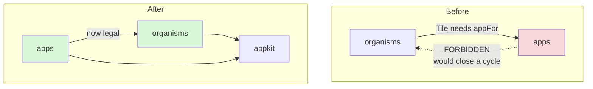

# PROJECT REPORT - go-go-datadrop v0.5 - The Missing Middle, and Six Copies of One Style Object

This report explains the fifth layer of `go-go-datadrop`, which is not a feature. [[PROJECT REPORT - go-go-datadrop v0.1 - Building an Append-Only Event Store from Two Reference Implementations|v0.1]] stores append-only events, [[PROJECT REPORT - go-go-datadrop v0.2 - Content-Addressed Datasets and the Staged Upload Protocol|v0.2]] stores immutable dataset versions, [[PROJECT REPORT - go-go-datadrop v0.3 - One Typed Table, and Four Defects Only a Browser Could Find|v0.3]] draws charts of both, and [[PROJECT REPORT - go-go-datadrop v0.4 - Two Credentials, One Principal, and an Issuer That Is Not an Address|v0.4]] added people. This layer adds nothing a user can see. It finishes a design system that had been built halfway, and it does so under a constraint that turned out to matter more than the component inventory: every rule the system depends on had to become a test, because the previous four layers had demonstrated that a written-down convention is a convention that has already been broken somewhere nobody has looked.

The work has an unusual property for a refactor. Its justification is not a judgement about code quality but a measurement, and the measurement found a defect that had already shipped and that nobody had noticed — including me, having written the code three days earlier.

> [!summary]
> - Six files declared the same button style object. They were identical except for one property: three used a 9.5px font and three used 10.5px. Nobody chose that. It is visible on screen, and it is what converts "components would be nicer" into an empirical claim about code that has already gone wrong.
> - Coverage is downstream of decomposition. You cannot write a story for nine lines of JSX inside a 491-line file, so most of the effort is extraction and the stories are what make the extraction worth having.
> - Every rule became a test, and every test was verified by breaking it first. One of those tests found a hole that had existed since v0.3: a layer absent from the dependency table was silently unconstrained, and the suite went green on a structural change that had not been applied.
> - The component the ticket most clearly justified already existed twice — once in an application and once in a Storybook story that needed it, had nothing to import, and wrote its own. It briefly existed three times, because the molecule was built and neither call site rewired; that is corrected, and the mechanism that allowed it is the subject of its own section.
> - Shipped in 16 commits: 5 stories became 181; 65 hand-written form controls became zero; 177 TypeScript tests and 324 Go tests pass with zero lint findings. Five of seventeen applications were extracted into presentational panels; the remaining twelve are the known gap, and nothing in the enforcement can see it.

## The starting position

The frontend at v0.4 had a real design system. It had a token sheet of 137 lines with no CSS framework behind it, a contrast test holding text colours to 4.5:1 on two surfaces, a presentation protocol in which rendered things carry references to the objects they depict, and — the part that matters most for what follows — a dependency graph between component layers that was enforced by a test rather than by review.

It also had 24 component directories, of which two appeared in a Storybook story.

The distribution of those 24 is the finding, not the count. Nine of the eleven atoms are *presentation chips*: a field, a source, a document, a user, a token, a role. They are the vocabulary of the presentation protocol, they are well made, and they are all one kind of thing. What the system had no vocabulary for at all was **controls**. There was no button, no text input, no select, no checkbox.

A design system does not stop being useful when it lacks a button. The applications simply supply one, each in its own file, and the cost is deferred rather than avoided. Measuring that deferred cost is where the ticket began.

## The measurement

Five commands, run before any code was written, each reproducible:

```bash
cd ui/src
grep -roE '<button\b' --include='*.tsx' apps components pbui | grep -v '.stories.' | wc -l   # 42
grep -roE '<select\b' --include='*.tsx' apps components pbui | grep -v '.stories.' | wc -l   #  9
grep -roE '<input\b'  --include='*.tsx' apps components pbui | grep -v '.stories.' | wc -l   # 14
grep -ro 'style={{' --include='*.tsx' . | wc -l                                              # 80
grep -rn "const btn: React.CSSProperties" --include='*.tsx' apps                              #  6 files
```

Forty-two buttons in a codebase whose design system has none. That is a large number and it is not, by itself, an argument: duplication is a cost only when it produces divergence, and divergence has to be shown rather than assumed.

The last command shows it. Six files declare `const btn: React.CSSProperties`, all six with the same four properties, differing in exactly one:

```ts
// GalleryApp, CompareApp, ChartsApp
fontSize: "var(--pbui-fs-tiny)",     //  9.5px
// EncodingApp, PipelineApp, SourceApp
fontSize: "var(--pbui-fs-small)",    // 10.5px
```

Buttons in the gallery, the compare view and the chart list render at one size; buttons in the encoding editor, the pipeline editor and the source browser render at another. In monospace at these sizes the difference is about a pixel of cap height and a visibly different weight of grey. **No design decision produced this.** It is the ordinary end state of copy-and-paste, it was already on screen, and nobody had reported it.

A second measurement made the same point about time rather than about size. Four files contained a character-identical inline style literal:

```ts
style={{ font: "inherit", padding: "2px 4px", border: "var(--pbui-border-hair)" }}
```

in `UploadApp`, `TokensApp`, `MemberList` and `SignInApp` — the four text inputs added by v0.4, written within a few hours of each other by one author. Duplication does not require a large team or a long time. It requires only that there be nothing to import.

## Why coverage is downstream of decomposition

The obvious framing of this work is "add more Storybook stories". That framing is wrong in a way that would have produced the wrong work, and stating why is the clearest single idea in the ticket.

A story is a rendering of *a component* in *a state*. If the thing worth looking at has no component — if it is nine lines of JSX in the middle of a 491-line application file — there is nothing to write a story for. The upload application at v0.4 contained, inline and unnamed: a drop selector, a dataset-name field, a resumable-draft panel with two buttons per row, a file-choose button, a drag-and-drop surface, a secure-context warning, a per-file queue listing, and a success panel with an action. Each is a component. None of them existed.

So the ticket is two things in a fixed order. **Decomposition** extracts what is written inline into named components. **Coverage** gives each of those a story with a required set of states. Most of the effort is the first; the second is what makes the first worth doing.

The return is specific rather than aesthetic, and v0.4 supplied the evidence for it. That layer shipped three UI defects found only by opening a browser and clicking:

- identity-provider prose rendered in *token* authentication mode, where there is no identity provider;
- a "Signed in on" heading rendered with an empty body for the root principal, which has no session;
- a tooltip reading "you are a admin".

Each is a *state* of a component. Each requires a particular server configuration to reach by clicking — a server started with `--auth=token`, a root credential, an administrator membership on a drop. Each is two lines of props in a story. **The defects Storybook catches are exactly the ones manual testing does not, because they live in states that are expensive to reach and cheap to render.**

## The reference, and what was left in it

Another package in the same organisation had solved this problem at roughly five times the scale: `@go-go-golems/rag-evaluation-site`, 116 components across foundation, atoms, layout, molecules and organisms, with 127 story files — more story files than components.

Its `GUIDELINES.md` is the most useful artifact in it, and the reason is that it states the layer test as a question about the component rather than as a size heuristic:

> If a component answers "where do regions go?" it belongs in layout. If it answers "what domain data is shown?" it does not.

Four things were adopted: the folder-per-component layout, the layer barrel, the Storybook title prefixes that make the sidebar read as the dependency order, and the required-state list. Four things were deliberately not adopted, and the reasoning for each is the same shape:

**The Widget IR layer.** The reference has a JSON-serialisable UI description language, a renderer, per-component adapters and manifests, and a Goja DSL so that server-side JavaScript can author pages. That is coherent engineering for a product whose pages are defined server-side. This UI is authored in TypeScript and compiled into a Go binary; there is no server-side page author to serve. Adopting it would add a second way to describe every component with no consumer for the second way.

**The palette provider.** The reference offers four palettes through a Storybook toolbar. This system has one palette, generated from `model/plot.ts` and contrast-tested at two thresholds. Offering alternatives would imply the alternatives had been tested too.

**`export *` barrels.** Named re-exports keep the barrel readable as an inventory and stop a component leaking an internal helper by accident.

**The publishing apparatus.** The reference is an npm package with external consumers. This UI has exactly one consumer, `pkg/webui`, which embeds the built assets.

## The structural obstacle

Adopting the reference's *organism* pattern — presentational panels with DTO-shaped props, with the applications as thin containers above them — turned out to be illegal under the existing dependency graph. Tracing why produced the one architectural change in the ticket.

The graph is a literal table in `ui/test/layers.test.ts`, walked against every import in `src/`. Two of its entries were:

```ts
organisms: [..., "api", "apps"],
apps:      [..., "api"],          // note the absence of "organisms"
```

`apps` may not import `organisms`. The reason that edge is forbidden is that the *reverse* edge exists, and a separate test guarded the pair against forming a cycle. So the question is why `organisms -> apps` exists at all, and the answer is a single import:

```ts
// components/organisms/Tile/Tile.tsx:2
import { appFor, allApps } from "../../../apps/registry";
```

A tile renders a framed application and must resolve an application id to a component. `apps/registry.ts` is 49 lines: an `AppDescriptor` interface, a `Map`, and three functions over it. It imports two types and nothing else. **It is not an application.** It is the contract that applications register against, and it lived under `apps/` for historical reasons.

Moving it to its own layer removes the edge:

```text
appkit    -> model, pbui, store
organisms -> …, api, appkit          (was: …, api, apps)
apps      -> …, organisms, appkit    (organisms was previously forbidden)
```

No cycle can form, because `organisms` no longer names `apps` at all. Forty-nine lines moved, twenty-two import paths rewritten, and the pattern that the whole second half of the ticket depends on became available.



## The three treatments nobody had named

Building the `Button` atom produced the first correction to the design, and it came from reading a file the analysis had not read: `src/styles/reset.css`.

```css
button {
  background: none;
  border: none;
  padding: 0;
  cursor: pointer;
}
```

The reset strips every button to text. So `<button type="button"><Text size="small">Commit</Text></button>` — the form every v0.4 application uses — renders as plain text with a pointer cursor. Those twenty-nine buttons were not unstyled by oversight. They were *deliberately* bare, and a single-treatment `Button` would have silently restyled all twenty-nine in the substitution pass, which is precisely the visual regression the phase forbade.

A third treatment appeared later, in the launcher, the watchlist, the workspace strip and the tutorials: a firm border, a hard offset shadow, and a tone fill. The token sheet had already named it:

```css
--pbui-shadow-hard: 2px 2px 0 var(--pbui-ink); /* buttons */
```

The token system had anticipated a raised button, nothing had implemented one, and four sites had therefore implemented it four times. The atom takes `variant: "bare" | "framed" | "raised"`, with `bare` as the default so that the majority substitution is a literal no-op.

One further finding came from reading the call sites rather than the components. The plan had been to carry the dimming of unavailable buttons as a prop and fix it later. But every site that dimmed also set `disabled`, with the condition written out twice:

```tsx
disabled={index === 0}  style={{ ...btn, opacity: index === 0 ? 0.4 : 1 }}
disabled={!mapped}      style={{ ...btn, opacity: mapped ? 1 : 0.4 }}
```

The opacity *was* the disabled treatment all along. It moves to `.root:disabled`, the prop is unnecessary, and a disabled button can no longer look enabled — which is the failure that shape invites.

## Substitution, and the discipline of not improving things

The substitution pass replaced 42 buttons, 9 selects and 12 of the 14 inputs across seventeen files. Its acceptance criterion was that nothing changed on screen, which meant three improvements had to be reverted before the commit.

Two were straightforward. A toggle button acquired a `selected` prop, which would have added a selection fill it never had — and its label already alternates between "access" and "hide access", so the state was carried. An email field acquired `invalid`, which would have added a dashed border it never had.

Both were genuine improvements. Both were out of scope, and **a substitution commit that also contains improvements is a commit nobody can verify by reading.** The `aria-invalid` association that the second one also brought is a real accessibility fix, and it landed two phases later alongside a story to review it against.

The third case was kept, and it is the only pixel that changed. One document-name field had a border and a background but no padding, where four other fields had `2px 4px`. The atom has the padding. Adding a `padding` prop to satisfy one outlier is exactly the unbounded styling API the guidelines forbid, so the outlier converges — but it *is* a visual change, it is the only one, and it is recorded rather than left to be discovered.

A fourth event in this pass was not a trade-off but a fix that arrived unbidden. `SelectInput` requires a `label`, which becomes `aria-label`. The pipeline step editor had **six unlabelled selects**, which a screen reader announces as "combo box" and nothing else. A required prop on an atom found six missing accessible names that no review had. That mechanism — a type-level requirement discovering an absence — recurs: `IconButton` requires `label` for the same reason, and it is the entire justification for `IconButton` existing separately from `Button`.

## Four elements that stay raw, and why the reasons matter

Not every `<button>` is a `Button`. Four elements survived the substitution, and enumerating them is what let the guard written in the final phase be correct rather than merely strict.

| Element | Why it stays |
|---|---|
| `pbui/ObjectMenu.tsx` | `role="menuitem"` with its own module — **and** `pbui` may not import `atoms` at all under the layer graph, so the atom is unavailable here |
| `organisms/SplitView` | `<button role="separator">` carrying `aria-orientation` and `aria-valuenow`: a resize handle that is a button only for focusability |
| `UploadApp`'s file input | `<input type="file" hidden>`, later moved into the `FileDropZone` molecule that owns it |
| `WorkspaceStrip`'s rename field | **uncontrolled by design** — the value is read once on Enter and never tracked, so Escape means "there was never an edit" rather than "restore the previous value" |

The last is the interesting one. A controlled field would add a `useState` per rename whose only purpose is to be discarded, and would change the meaning of Escape. The risk after the substitution pass was that the next reader would "fix" the inconsistency. Extracting it as an `InlineRename` molecule gives that reason a permanent home beside the code, which a commit message does not.

## Making the rules executable

The design system's rules already existed. They were in a ticket's design document, in a comment at the top of a test file, in a comment in a CSS file. Each was well written. None was findable by someone who did not already know it existed, and none except the layer graph was enforced.

Three tests were written, and each was verified by breaking it before being trusted.

**Coverage.** `stories.test.ts` fails when a component directory has no `Component.stories.tsx`. It also checks the title prefix, which earns its place separately: a story filed under the wrong Storybook group fails nothing, the component is still covered, and the map of the architecture is quietly wrong. The title is parsed with a regular expression rather than by importing the module, because importing a story pulls in React, the CSS modules and the entire component tree beneath it, which turns a 30 ms test into a bundling exercise. That is a real constraint on how stories may be written, so it is documented rather than assumed.

The same file also gained a check for empty component directories, because writing it found one: `components/organisms/StatusBar/` contained nothing at all, left behind by a rename. Git does not track empty directories, so it was invisible to `git status`, and the coverage check reported it as "missing a story" — true and unhelpful.

**No hand-written controls.** `no-raw-controls.test.ts` bans raw `<button>`, `<select>`, `<input>` and `const …: React.CSSProperties` outside the atoms that own them, with a five-entry allowlist in which each entry states its reason in a sentence. It is a change detector, and change detectors are usually a smell. This one is defensible because what it detects is a *decision*: a raw button outside `atoms/` after this ticket means either the author did not know `Button` exists — which the failure fixes by naming it — or `Button` is missing a variant, which is a design conversation the test forces to happen rather than letting a seventh private copy settle it.

Two details make it sustainable. Each allowlist entry carries a sentence, which is the cheap way to make an escape hatch cost something. And a third test asserts that every allowlist prefix still matches a real file, because an exemption that outlives its reason silently widens the rule for whatever moves into that path next.

**Contrast for disabled controls.** Discussed below.

### The hole that had been there since v0.3

The most instructive failure of the ticket came from the layer test, which had been trustworthy for two releases.

Creating `src/appkit/` and running the suite produced six passes. The graph table had not yet been edited. Both halves of the walk skip what they do not recognise:

```ts
if (!from || !(from in ALLOWED)) continue;   // the file's own layer
if (!(to in ALLOWED)) continue;              // the layer it imports
```

A directory absent from the table therefore has no rules applied to it, and no rules applied to edges into it. The new layer was entirely unconstrained and the suite was green. Compounding it, a Python heredoc used to apply the table edit had a syntax error in its final `print`, so the write never executed — for about a minute the state was "the structural change is applied and the tests pass" when neither half was true.

The generalisation is worth stating precisely. **Any check of the form "for each known X, verify Y" needs a sibling check that the set of known X equals the set of actual X**, or the first check silently shrinks as the codebase grows. The equivalent guard already existed one level down, for component directories; it had never been generalised. It exists now, and `mkdir src/widgets` fails it.

## Two components that justify the whole exercise

**`ChannelRow` existed twice before it existed once.** The encoding editor has a row per encoding channel: the channel name, the field mapped into it, a button that starts the accept protocol, and a button that clears it. `pbui/Pbui.stories.tsx` needed exactly that row to demonstrate the accept protocol, had nothing to import, and wrote its own. The two had been drifting independently ever since.

This is the same failure as the six button styles, in a different costume, and it is the cleanest available demonstration that *a component with no story* and *a story with no component* are one problem rather than two.

**A correction, and it belongs here rather than in a footnote.** The first version of this report stated that the component now exists once instead of twice. That was false when written. The molecule was built and neither call site was rewired, so for one commit there were *three* implementations — and the design document says, in bold, that this outcome is worse than not building the component at all, because it converts one duplication into two. The claim is true now; it was not true when the report was pushed, and the mechanism that let it through is the subject of the next section.

**`DraftResumeList` carries a server-side consequence in its prose.** The design analysis for v0.4 predicted, by reading `pkg/store/datasets.go`, that committed-only version listings would make an interrupted upload both unrecoverable and a disk leak; building the uploader confirmed it exactly. The version number is lost on reload, the API will not admit the draft exists, and its blob references keep garbage collection from reclaiming the bytes. So "discard" in this component is not a tidiness affordance — **it is the only way to release the bytes**, and a user who reads it as "clean up my list" leaves 400 MB allocated indefinitely. The component says so, in the component.

## What the coverage test cannot see

The enforcement built in this layer guarantees that every *component* has a story. It guarantees nothing about how much of the interface is in components, and that distinction is where this ticket's largest remaining gap sits.

Five presentational panels were extracted, covering four of the seventeen applications. The other thirteen — roughly two thousand lines, including the four largest, the pipeline editor at 330 lines and the chart at 260 — have no panel and therefore no story. Nothing failed, because there is no component for the coverage test to find missing. A test that only inspects what is registered cannot report what was never registered, which is precisely the failure mode described earlier in the layer graph, in a different register.

Three molecules built for those applications went unadopted for the same reason: the phase task list named the account applications, the design document's extraction table named all of them, and executing the checklist rather than the design left `ChannelRow`, `Legend` and a never-written `StepRow` with no consumers. A fourth, `KeyValueList`, turned out to have no call site anywhere and was deleted — the same error as the four components dropped before being built, caught later because this one got written first.

The general form is worth stating, because it is not specific to Storybook. **An enforcement mechanism defines a boundary, and everything outside the boundary is invisible to it rather than merely unchecked.** "Every component has a story" and "the interface is covered" are different claims, and the first does not approach the second on its own.

## The seam that keeps molecules renderable

A rule inherited from the reference package says that an extracted component never wraps itself in the presentation protocol. The reason is mechanical: a component that wraps itself requires a provider in every story and can no longer be rendered against literal data, which is the property the entire extraction is buying.

But several of these components genuinely *are* live presentations in the application. A legend entry is a category you can right-click to filter by; a member row is a member you can act on. The resolution is a render prop:

```tsx
// The molecule's default: a plain chip, no provider needed.
{renderEntry ? renderEntry(entry, body) : body}
```

```tsx
// The application: the same body, made live.
renderChip={(member, body) => (
  <Presentation ptype="member" value={member} doc={`<member> ${member.user.name}`}>
    {body}
  </Presentation>
)}
```

Five components need it — `Legend`, `MemberRow`, `ChannelRow`, `UploadQueueList` and `ProfilePanel` — which is few enough to be a pattern rather than an architecture. `ProfilePanel`'s case is the one that shows the seam is load-bearing rather than stylistic: the member list *fetches*, so it cannot be a molecule, and without the render prop the panel would have to import from `apps/`, which is the edge the structural change had just deleted.

## Stories for things with no appearance

Four components in the tree have no meaningful visual state, and writing stories for them produced a rule worth generalising: **demonstrate the invariant, not the appearance.**

- `VisuallyHidden` renders two adjacent lines of text with an entire announced sentence between them. The point of the story is that the lines are *adjacent* — which is what distinguishes `clip-path` from `display: none`, the latter removing the element from the accessibility tree entirely.
- `Toolbar` renders a 90px frame containing 300px of content. The point is that the toolbar does not shrink; `flex-shrink: 0` is the whole component.
- `KeyValueList` renders a 220px box containing a 64-character sha256 digest. The point is that the box stays 220px, because the value column is `minmax(0, 1fr)` and not `1fr` — a grid track's floor is `min-content` and would otherwise refuse to shrink.
- `Legend` renders *nothing* in its empty case, and the prose says so, because reserving space for an absent legend would shift every unmapped chart.

A second rule emerged from `ProfilePanel`: **three states, not two, for anything loaded.** `sessions === undefined` means "still loading"; `sessions.length === 0` means "there are none". Collapsing the two is precisely how a heading comes to render above nothing, which is the shape the second v0.4 defect had. Both are props states and both are stories.

## Computing a colour rather than choosing one

The disabled opacity inherited from the hand-written call sites was `0.4`. Deferred out of the substitution pass because changing it is a visual change, it was fixed in the final phase — and the fix is worth reporting because the method matters more than the number.

Opacity is not a colour and cannot be read out of the token sheet, so the composite the browser actually paints has to be computed:

```text
--pbui-ink over --pbui-pane-alt at α=0.40   2.32:1
--pbui-ink over --pbui-pane-alt at α=0.55   3.45:1
--pbui-ink over --pbui-pane     at α=0.55   3.56:1
```

At 0.4 a disabled label measures 2.32:1, under the 3:1 that non-text content is held to. WCAG exempts disabled controls from the contrast minimum, and the position taken here is that the exemption is a licence rather than a design goal: "you may not press this" is information, and it is useless if the label naming the thing you may not press cannot be read. Held to 3:1 rather than 4.5:1, because a disabled control genuinely should recede.

0.55 is also not a new number. `Chip.module.css` had used exactly 0.55 for `.disabled` since v0.3, for the same reason. The fix therefore converges two values that had diverged rather than introducing a third — and a test now pins it, with a comment explaining that without the test, the next person tidying 0.4 and 0.55 back together has even odds of choosing the wrong one.

## What was measured, and what was deliberately missed

```text
                                          start      end
component directories                        24       53
story files                                   2       55
Storybook stories                             5      180
hand-written form controls                   65        0
copies of `const btn: React.CSSProperties`    6        0
inline style objects                         80       61
TypeScript tests                            166      177
apps/*.tsx total lines                    3 528    2 867
```

The five account applications carry most of the reduction: sign-in 146 to 57 lines, profile 186 to 91, member list 177 to 88, tokens 262 to 106, upload 491 to 316.

Two planned targets were missed, and both are honest rather than incidental.

**53 components, not the 57 the design listed.** Four proposed components were dropped because no call site asked for them: `Inline` (a row stack already exists with the same gap scale), `ScrollRegion` (zero inline overflow sites — the app body already owns scrolling), `CountBadge` (no call site at all, invented from the reference package), and `FormRow` (no three-site pattern with a distinct shape). The design document had explicitly stated that the component count is a consequence of the extraction list and not a quota; this is what honouring that looks like, and each of the four would have shipped with one contrived story and no consumer.

**2 867 lines in the applications, not the 2 400 suggested.** The upload application retains its 130-line protocol driver — open a draft, hash, probe the blob store, mount or send, commit — which is genuinely application logic, plus the props feeding the panel. Lines moving from applications into components was the objective; lines disappearing would have meant behaviour was lost.

## Verification, without a screenshot-diffing tool

The largest risk in this work is that substituting a component into 42 call sites changes how something looks. The obvious mitigation is visual regression tooling, which is its own project and was out of scope. Three cheaper checks were used instead, in increasing order of confidence, with the requirement that the diary record which were run.

1. **The CSS module is a transcription.** For each atom, the original inline style object and the new module are placed side by side. `Button` has four properties; the diff is checkable by reading.
2. **A build and a manual sweep.** After the substitution, each application is opened in a browser against a real server. This is ten minutes and it is what catches a toolbar that lost a modifier.
3. **The generated-palette test.** The token test already fails if a colour drifts from `model/plot.ts`. It does not cover layout, but it covers the one class of change a manual sweep is worst at seeing.

The sweep found nothing, which was the intended result. The account workspace was re-checked after the organism extraction, including the root-principal state where the second v0.4 defect had lived.

## The apparatus, and what it does not guarantee

The ticket ends with `ui/GUIDELINES.md`: the layer table with the five ordered questions that decide a layer, the Storybook conventions, the token rules, the CSS module rules, the presentation rules, and a copyable review checklist. Writing it was mostly transcription, and that was the finding — almost every rule already existed somewhere well written and unfindable.

Three things in it are genuinely new: the invariant-not-appearance rule for structural components, the constraint that a story title must be a literal (a real limitation of how the coverage test parses), and a table of what each test actually guarantees. That table ends with a sentence that a reader should not have to discover by being surprised:

> Nothing tests that a component *looks* right. That is what Storybook and a reviewer are for.

| Test | Guarantees |
|---|---|
| `layers.test.ts` | the import graph is one-way; the engine is pure; every source directory is in the graph |
| `stories.test.ts` | every component has a story, a barrel and the right title prefix |
| `no-raw-controls.test.ts` | no hand-written controls outside the atoms, and the allowlist is not stale |
| `tokens.test.ts` | the generated palette matches the engine; both contrast thresholds hold |
| `api-surface.test.ts` | the set of mutating endpoints is exactly the reviewed set |

## What generalises

Five observations from this work that are not specific to this codebase.

**Measure the divergence, not the duplication.** Forty-two duplicated buttons is a number. Six copies of one style object that have already split into two font sizes is an argument, because it demonstrates that the mechanism being proposed prevents something that has already happened.

**Read the reset before designing the wrapper.** The three button treatments in this codebase were legible only after reading what the CSS reset already does to a `<button>`. Any atom that wraps a native element should start there.

**A skipping test needs an enumerating sibling.** "For each known X, verify Y" silently shrinks unless something asserts that the set of known X is the set of actual X. This one had been true for two releases before it mattered.

**Required props find absences that review does not.** A `label` prop that the type system insists on found six unlabelled form controls that had survived multiple reviews. The mechanism is worth reaching for deliberately: make the thing that is easy to forget impossible to omit.

**Improvements do not belong in a substitution.** Three of them were reverted from the mechanical pass and two returned later with stories attached. A commit whose claim is "nothing changed" must be verifiable by reading, and an improvement mixed into it makes that impossible.

## Open questions

Four decisions were left open rather than settled, and each is recorded in the design document rather than resolved in code:

- whether the tutorial applications should be extracted at all, or whether prose-with-controls is exactly the case where inline JSX is correct;
- whether `Legend` belongs in molecules or organisms, given that it has one consumer and a render prop, which is a smell in both directions;
- whether a busy state on a button is better as a string or as a boolean plus a separate label;
- whether the raw-control guard should also police inline style objects. Sixty-one remain, three categories of them are legitimate, and a test that cannot state its rule crisply is a test that gets disabled.

## Repository

- Repository: `/home/manuel/code/wesen/go-go-golems/go-go-datadrop`
- Ticket: `ttmp/2026/07/25/DATADROP-6--design-system-coverage-story-every-primitive-and-split-pbui-and-apps-into-reusable-atoms-molecules-and-organisms/`
- Design document: 1 745 lines in four parts, with decision records DR-32 through DR-39
- Diary: ten steps, including the two failures worth reading — the silently-unconstrained layer, and the heredoc whose write never executed
- Guidelines: `ui/GUIDELINES.md`
- Storybook: `make storybook`, 180 stories, sidebar ordered by the dependency graph

The workbench was also renamed in this cycle. It is `DATALAB` now, with the tagline *data · explore · inspect · understand*, and a mark drawn as SVG whose four squares are the categorical palette from `model/plot.ts` — the icon is made of the thing the application draws rather than of a separate brand palette that could drift away from it.
