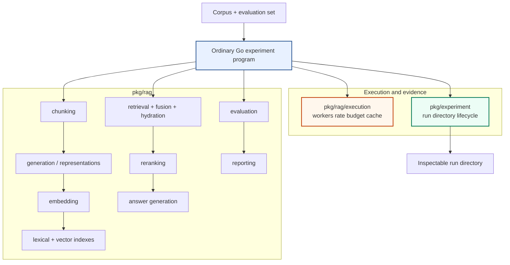

# rag-ttc: Clean-Slate RAG Experiments in Plain Go

`rag-ttc` is a clean-slate implementation of a retrieval-augmented generation experiment system for The Tree Center. Its main architectural decision is restrictive: an experiment is an ordinary Go program. The program calls small packages for chunking, representation generation, embedding, indexing, retrieval, fusion, reranking, answer generation, evaluation, reporting, execution control, and artifact custody. There is no experiment DSL, graph compiler, general workflow runtime, scheduler service, plugin registry, or mandatory database.

This report explains why the project abandoned the previous platform-oriented direction, how the replacement is structured, and which correctness properties are encoded in its types and tests. It is written for a developer who needs to understand the system well enough to add a real TTC experiment without reconstructing the design from commit history.

The implementation lives at `/home/manuel/workspaces/2026-06-30/benchmark-cpu-inference/rag-ttc`. The principal ticket is `RAG-TTC-CLEAN-SLATE-001`, under `ttmp/2026/07/25/`. The implementation commit is `800ad75`; the design, diary, and ticket documentation are committed as `77747a8`.

This report is indexed by the [[rag-ttc]] project map. The historical systems
that motivated the reset remain indexed by [[rag-evaluation-system]],
[[researchctl]], and [[scraper]].

> [!summary]
> - The project replaces workflow-oriented RAG execution with visible Go control flow. Shared packages implement capabilities; experiment programs decide how to compose them.
> - `pkg/experiment` gives every run a self-describing filesystem directory with configuration, input digests, intermediate artifacts, observations, results, and a terminal status.
> - `pkg/rag/execution` controls expensive work with bounded workers, resource rates, finite budgets, and atomic per-item caching. A late failure preserves every completed cache entry.
> - Six progressive examples compile and run offline against a deterministic synthetic corpus. They have **not** been run against the authoritative TTC evaluation dataset, which remains an explicit production-integration task.

## 1. Why the project restarted

The previous TTC RAG work accumulated several systems that each addressed a valid concern. A JavaScript RAG DSL made experiments concise. Canonical intermediate representations made the DSL analyzable. A lowering layer translated RAG semantics into workflow operations. Scraper Workflow V3 supplied durable tasks, effects, leases, retries, budgets, and cancellation. Researchctl supplied cases, factors, replicates, attempts, analysis, and publication.

The combined path was much larger than the retrieval question under study:

```text
JavaScript experiment
  -> RAG DSL
  -> canonical representation
  -> compiler and semantic lowering
  -> Workflow V3 plan
  -> durable workflow runtime
  -> Researchctl run and attempt records
  -> observation projection
  -> analysis specification
  -> published result
```

The earlier architecture is documented in [[PROJECT REPORT - Experiment Platform Convergence - Researchctl Workflow V3 and RAG]]. That report assigns scientific identity to Researchctl, durable execution to Workflow V3, and retrieval semantics to the RAG repository. It is internally coherent. The problem is proportionality. Testing a different chunk boundary or fusion weight should not require changes across a language API, compiler, workflow schema, execution runtime, persistence model, and analysis layer.

The clean-slate project changes the optimization target. It optimizes for the time between forming a retrieval hypothesis and producing inspectable evidence. It accepts local repetition in an experiment program when that repetition keeps the hypothesis, factor, and measurement visible.

The governing rule is:

```text
share RAG operations and safety primitives;
do not share experiment control flow until repeated evidence proves a stable need.
```

This rule rejects two common sources of premature abstraction. First, a generic pipeline builder does not belong in the repository merely because several programs call chunking before indexing. Second, a compatibility adapter does not belong in the repository merely because the old system already has a representation of the same operation. The new code uses the old repositories as evidence about algorithms and failure modes, not as runtime dependencies.

## 2. Architectural boundary

The system has three kinds of code:

1. **Domain records and components** define the data carried through a RAG experiment.
2. **Execution and custody primitives** control expensive work and persist evidence.
3. **Experiment programs** state the hypothesis by composing the first two directly.



The arrows from the program are significant. No library package owns the complete sequence. An experiment may embed raw chunks, generated questions, summaries, or some subset. It may run BM25 alone, vector search alone, hybrid retrieval, or a reranker-only comparison. The program expresses that choice with Go statements that can be read, debugged, and changed without compiling another representation first.

### 2.1 What the repository intentionally excludes

The exclusion list is part of the design:

- no JavaScript experiment authoring layer;
- no RAG DSL;
- no generic graph or pipeline intermediate representation;
- no compiler or lowering pass;
- no Scraper workflow dependency;
- no Researchctl lifecycle or analysis dependency;
- no daemon or database required to execute a local experiment;
- no backwards-compatibility adapter for historical contracts;
- no hidden retry policy around provider calls;
- no silent cache whose identity cannot be inspected.

These exclusions do not claim that durable workflow systems or experiment registries are generally unnecessary. They state that the current research loop does not justify their cost. A future requirement must be demonstrated by concrete experiments before it expands the architecture.

## 3. The RAG data model

`pkg/rag/types.go` defines the canonical values that cross component boundaries. The records are serializable because experiment evidence must be inspectable outside a running process.

### 3.1 Documents and chunks

A `Document` is one immutable source revision:

```go
type Document struct {
    ID            string
    SourceURI     string
    Title         string
    Text          string
    ContentDigest string
    Metadata      map[string]string
}
```

The `ContentDigest` binds identity to bytes. A document ID alone is insufficient because a stable WordPress identifier may refer to text that changes over time. Experiments must be able to distinguish those revisions.

A `Chunk` preserves its relation to source text:

```go
type Chunk struct {
    ID            string
    DocumentID    string
    Ordinal       int
    Range         rag.Range // half-open byte range
    Text          string
    ContentDigest string
    Chunker       string
}
```

The range uses byte offsets, not rune indices, because Go slices strings by byte offset. The fixed chunker may define its window in runes so Unicode characters are not split, but it maps rune boundaries back to byte positions before creating the final chunk. Validation checks that:

```go
document.Text[chunk.Range.ByteStart:chunk.Range.ByteEnd] == chunk.Text
```

That equality is the source-lineage invariant. A later retrieval hit can be hydrated into exact source evidence without trusting a reconstructed or normalized copy.

### 3.2 Representations are retrieval material, not evidence

A source chunk can produce several searchable texts:

```text
document
  -> chunk
      -> raw representation
      -> summary representation
      -> hypothetical-question representation
```

`Representation` records the chunk it came from, its kind, its text digest, and optional model and prompt identities. Retrieval operates on representations. Citation and answer generation operate on hydrated chunks.

This distinction prevents a generated summary from becoming the authoritative evidence shown to a user. A summary may retrieve the correct source, but it may omit conditions or contain a generation error. The system therefore carries representation identity through search and returns to the original chunk before reranking and generation.

### 3.3 Search output retains channel identity

A `Hit` contains representation, chunk, document, channel, rank, and score. The score is meaningful only within its retrieval channel. BM25 and cosine similarity have different scales, so the hybrid path does not add their raw scores.

Weighted reciprocal-rank fusion uses rank:

```text
for each channel:
    for each hit:
        fused[collapse_key] += channel_weight / (rank_constant + hit.rank)
```

The implementation sorts channel names before accumulating contributions. Go map iteration is not deterministic; sorting produces stable contribution ordering and stable serialized evidence. Each fused hit retains its channel contributions, making the final rank explainable.

The system collapses duplicate representation hits before fusion. Without collapse, three representations of one document could cast three votes in one channel and dominate a document with a single representation. The correct order is:

```text
search each channel
  -> collapse duplicates within the channel
  -> fuse channel rankings
  -> hydrate source chunks
```

## 4. Concrete local components

The initial repository includes deterministic implementations for every stage needed by an offline vertical slice. They establish contracts and correctness oracles; they do not claim provider-level retrieval quality.

| Package | Component | Intended role |
| --- | --- | --- |
| `pkg/rag/chunking` | Fixed rune-window and Markdown-aware chunkers | Preserve source ranges and stable identity. |
| `pkg/rag/generation` | Raw representations and extractive answer generator | Produce offline retrieval material and cited sample answers. |
| `pkg/rag/embedding` | Signed hashing embedder and batch helper | Exercise vector paths without credentials or network access. |
| `pkg/rag/lexical` | In-memory BM25 | Provide a transparent lexical baseline. |
| `pkg/rag/vector` | Exact cosine index | Provide a deterministic vector-search correctness oracle. |
| `pkg/rag/retrieval` | Collapse, weighted RRF, hydration | Compose retrieval channels without hidden orchestration. |
| `pkg/rag/reranking` | Term-overlap reranker | Exercise the reranking contract deterministically. |
| `pkg/rag/evaluation` | Precision, recall, hit rate, MRR, nDCG | Score labeled queries with explicit cutoffs. |
| `pkg/rag/report` | Markdown and CSV renderers | Produce human- and machine-readable summaries. |

### 4.1 BM25 as the first baseline

The in-memory BM25 implementation exists because lexical retrieval is the first useful end-to-end baseline. It tokenizes representations, records term frequencies, document frequencies, and representation lengths, then applies the standard BM25 form:

```text
IDF(term) = log(1 + (N - DF(term) + 0.5) / (DF(term) + 0.5))

score(term, document) =
  IDF(term) *
  TF(term, document) * (k1 + 1) /
  (TF(term, document) + k1 * (1 - b + b * length / average_length))
```

The index is intentionally memory-resident. It is suitable for unit tests, small experiments, and comparison against a future production lexical backend. It does not attempt incremental updates or persistent storage.

### 4.2 Exact vector search as an oracle

`pkg/rag/vector` stores vectors in memory and evaluates cosine similarity against every item. This is computationally linear in the number of representations. That property is acceptable for the deterministic sample and for checking a future approximate index on a bounded corpus.

Exact search answers a specific testing question: given these embeddings, what is the true top-k ordering under cosine similarity? An approximate nearest-neighbor integration can compare its recall against this result without mixing index approximation with embedding behavior.

### 4.3 Metrics reject missing truth

The evaluation package calculates retrieval metrics from ranked target IDs and graded judgments. It rejects an unlabeled query instead of returning a zero. A zero would look like a legitimate retrieval failure; rejecting the input exposes a dataset-integrity failure.

The implemented metrics answer different questions:

- Precision@k measures what fraction of the first `k` results are relevant.
- Recall@k measures what fraction of known relevant targets appear in the first `k`.
- HitRate@k records whether at least one relevant target appears.
- MRR measures the reciprocal rank of the first relevant target.
- nDCG@k preserves graded relevance and discounts lower ranks.

Per-query values remain available in CSV and JSONL. An aggregate mean cannot explain which query classes fail or whether an improvement is concentrated in a few cases.

## 5. Experiment directories as the evidence contract

`pkg/experiment` is independent from RAG semantics. It creates and controls one directory per run. The directory is the unit a reviewer can copy, inspect, archive, or compare.

A completed run has the following shape:

```text
<root>/<timestamp>-<name>-<random>/
├── config.json
├── manifest.json
├── status.json
├── inputs/
│   ├── corpus.json
│   └── evaluation.json
├── preparation/
│   ├── chunks.json
│   └── vectors.json
├── observations/
│   ├── providers.jsonl
│   └── queries.jsonl
├── results/
│   └── per-query.csv
└── summary.md
```

The package provides a small lifecycle:

```text
Create
  -> running
      -> Complete -> complete
      -> Fail     -> failed
```

`Create` writes configuration, manifest metadata, and the initial status. `WriteJSON` and `WriteBytes` accept relative paths that remain inside the run. `CopyInput` records the source digest. `Observe` appends synchronized JSON lines. `Complete` and `Fail` close observation files and publish one terminal status.

The terminal status acts as a commit marker. A directory without a successful terminal state is not silently treated as complete. Failed runs remain valuable because they contain the inputs, successful intermediate artifacts, and observations created before failure.

### 5.1 Why JSONL observations

Per-query and per-provider observations are appended as work completes. JSONL supports incremental writes and preserves valid prior records if a later operation fails. It also permits streaming analysis without loading one large JSON array.

The current implementation synchronizes each observation append. This favors local durability over maximum throughput. Buffering can be considered after measurement shows that filesystem synchronization materially affects an experiment.

### 5.2 Custody does not imply scheduling

The experiment package does not know about chunkers, embedders, workers, retries, or stage graphs. It records what the program gives it. This is a deliberate dependency boundary:

```text
pkg/experiment imports no RAG packages
pkg/rag/execution imports no experiment package
experiment main programs may import both
```

Keeping custody separate from execution policy makes each package reusable and prevents the run directory from becoming a workflow engine.

## 6. Controlling expensive work

Provider-backed RAG stages require more than goroutine limits. A safe experiment needs independent control over simultaneous calls, resource velocity, and total admitted cost.

### 6.1 Bounded ordered work

`execution.Map` applies a function to a slice with a worker ceiling. It uses `errgroup.WithContext`, cancels pending work on the first error, and returns results in input order.

```go
results, err := execution.Map(
    ctx,
    inputs,
    execution.MapOptions[Input]{
        Workers: 4,
        Limiter: limiter,
        Cost: func(input Input) int {
            return estimatedUnits(input)
        },
    },
    work,
)
```

Input order and completion order are different when work is parallel. Preserving input order makes artifact comparison deterministic and avoids requiring every caller to sort results after execution.

### 6.2 Resource rate

`TokenBucket` controls units over time:

```go
rate, err := execution.NewTokenBucket(execution.Rate{
    Units: 100,
    Per:   time.Minute,
    Burst: 10,
})
```

The unit is chosen by the experiment and documented in its configuration. It may represent requests, embedding tokens, candidate pairs, or conservative micro-dollars. An item whose cost exceeds the bucket's burst is rejected immediately because the request can never acquire enough simultaneous tokens.

The rate limiter is process-local. It does not coordinate multiple processes. That limitation is explicit and appropriate for the current single-program execution model.

### 6.3 Finite budgets

`Budget` is non-replenishing. Admission consumes units permanently, including when the admitted operation later fails. This models attempted provider cost: a request may incur charges even if its response cannot be used.

```go
budget, err := execution.NewBudget(50_000)

limiter := execution.Chain(
    budget,
    rate,
)
```

Limiter ordering matters. The budget is placed before the rate limiter so an unaffordable item fails immediately rather than waiting for rate capacity. Cache hits bypass both controls because they do not invoke expensive work.

The budget reports a snapshot:

```go
type BudgetSnapshot struct {
    Limit     int
    Spent     int
    Remaining int
}
```

Snapshots belong in experiment observations and summaries. A configured ceiling without evidence of actual admission is insufficient for cost analysis.

## 7. Per-item caching and late-failure recovery

Embedding two thousand documents creates a failure mode that batch-level caching does not solve. If item 1,999 fails after 1,998 successful provider responses, restarting the entire stage wastes time and money. The cache must commit successful items independently as soon as they finish.

### 7.1 Cache identity

An execution cache key includes:

- the operation name;
- an explicit operation version;
- the canonicalized input value.

The digest is derived deterministically. Model identity, prompt identity, chunk content, dimensions, and any behavior-changing parameter must be included either in the version or the canonical input. Omitting one creates a stale-cache correctness bug.

The rule is:

```text
same key means the caller asserts semantic interchangeability.
```

This is stronger than “the request text looked similar.” A model change must miss. A chunk-content change must miss. A prompt change for generated representations must miss.

### 7.2 Atomic entry storage

`FileCache` stores one JSON envelope per key. A store operation writes a temporary file, synchronizes it, closes it, and renames it to the final path. Readers never observe a partially written final entry.

The envelope records schema and integrity data. Loading validates the expected key and payload checksum. Corruption fails closed. The cache does not interpret an invalid entry as a miss and silently spend provider budget to replace it.

That behavior distinguishes three states:

```text
valid entry    -> hit
absent entry   -> miss; expensive work may run
invalid entry  -> error; operator decision required
```

Failing closed is essential for cost governance. Automatic recomputation after corruption would make filesystem damage capable of triggering external charges.

### 7.3 Recovery-aware map

`MapCached` first derives keys and coalesces duplicate inputs. It loads valid hits before constructing the work set. Only misses pass through worker, rate, and budget admission.

```text
inputs
  -> derive deterministic keys
  -> coalesce duplicate keys
  -> load and validate cache entries
      -> hits populate ordered results
      -> misses enter controlled Map
          -> expensive work
          -> atomic per-item store
          -> ordered result
```

The store uses a context without cancellation after expensive work succeeds. If a sibling item fails at that moment, the successful provider result still completes its local atomic commit. This is a narrow use of cancellation independence: it protects a completed expensive result, not the provider call itself.

The recovery example demonstrates the target behavior:

```text
first run:
  work calls = 10
  cache writes = 9
  final item = simulated failure

second run:
  cache hits = 9
  work calls = 1
  cache writes = 1
  ordered results = complete
```

This result is also covered by tests for duplicate-key coalescing, miss-only budget charging, corruption handling, and late failure.

## 8. The progressive examples

The repository contains six executable examples. Each directory contains a README that explains the concept, expected output, and source files to read.

### Example 01: source-preserving chunking

`examples/01_chunking` creates deterministic documents, applies Markdown-aware chunking, and prints chunk IDs and byte ranges. It establishes source identity before introducing retrieval.

The example is the place to verify:

- headings create natural boundaries;
- oversized sections fall back to bounded windows;
- overlap does not break byte-range validity;
- stable inputs and configuration produce stable chunk IDs.

### Example 02: lexical search

`examples/02_lexical_search` constructs raw representations, builds BM25, executes a query, and prints ranked hits. This is the smallest useful retrieval program:

```text
documents -> chunks -> raw representations -> BM25 -> hits
```

### Example 03: hybrid retrieval and evaluation

`examples/03_hybrid_evaluation` adds deterministic embeddings, exact cosine search, per-channel collapse, weighted RRF, and document-level retrieval metrics. It demonstrates why scores are not directly combined and why duplicate representations must be collapsed before fusion.

### Example 04: controlled execution

`examples/04_controlled_execution` isolates worker, rate, and budget behavior from RAG semantics. The smoke test initially exposed a real configuration rule: an item costing three units cannot enter a token bucket with burst capacity two. The example was corrected by increasing burst capacity to three; the limiter itself was unchanged.

### Example 05: cached recovery

`examples/05_cached_recovery` simulates the late embedding failure. It is deliberately small so the recovery semantics can be understood without vector indexing or evaluation code.

### Example 06: complete experiment

`examples/06_end_to_end_experiment` is the governing vertical slice:

```mermaid
flowchart LR
    DATA["Synthetic documents\nand judgments"]
    RUN["Create run directory"]
    CHUNKS["Fixed chunks"]
    REPS["Raw representations"]
    VECS["Hash embeddings"]
    IDX["BM25 + exact vector"]
    HITS["Channel hits"]
    FUSED["Collapse + RRF"]
    EVIDENCE["Hydrated evidence"]
    RERANK["Term-overlap rerank"]
    ANSWER["Extractive answer"]
    METRICS["Per-query metrics"]
    FILES["JSONL + CSV + Markdown\ncomplete status"]

    DATA --> RUN --> CHUNKS --> REPS --> VECS --> IDX
    IDX --> HITS --> FUSED --> EVIDENCE --> RERANK --> ANSWER
    FUSED --> METRICS
    ANSWER --> FILES
    METRICS --> FILES

    style RUN fill:#ecfdf5,stroke:#047857
    style METRICS fill:#e8f1ff,stroke:#315b96
    style FILES fill:#fff7ed,stroke:#c2410c
```



The program prints the run directory so the reader can inspect every artifact. Its sequence is direct Go, not a pipeline declaration.

## 9. What validation proves

The implementation was formatted, built, linted, tested normally, tested with the race detector, and exercised through every example:

```text
go test ./... -count=1       PASS
go test -race ./... -count=1 PASS
go build ./...               PASS
make lint                    PASS, 0 issues
examples 01 through 06       PASS
docmgr doctor                PASS
```

The tests establish:

- exact UTF-8 source ranges after chunking;
- stable identity validation;
- expected BM25 and vector retrieval on synthetic records;
- deterministic RRF contribution ordering;
- correct retrieval metric goldens;
- worker bounds and ordered results;
- rate cancellation and budget admission;
- cache integrity and atomic entry behavior;
- recovery after late failure;
- concurrent JSONL observation integrity;
- experiment lifecycle and terminal-state enforcement.

These are software and local algorithm checks. They do not establish TTC retrieval quality.

> [!warning]
> The examples use the deterministic synthetic tree-care corpus from `pkg/sampledata`. They have not been run against the authoritative TTC corpus export or protected evaluation split. Their MRR, recall, and nDCG values are not TTC results.

The repository keeps the authoritative input selection open because historical TTC work contains several snapshots, candidate datasets, and development results. Selecting one without owner confirmation could mix a development set with a protected set or report metrics against the wrong corpus revision.

The existing vault documents the earlier data work in [[ARTICLE - RAG Evaluation - Building and Validating an Initial Fixed-Truth Dataset]] and [[ARTICLE - Full TTC RAG Laboratory and go-go-parc Corpus Research Report]]. Those reports are evidence for the eventual input adapter, but they do not by themselves authorize a particular export and split for the new repository.

## 10. Adding the real TTC path

The next production step is input integration, not a new orchestration architecture. Once the authoritative export and approved split are named, the implementation should proceed in a controlled sequence.

### 10.1 Load and bind the corpus

Add a focused TTC loader that maps source rows into `rag.Document`. The loader must:

- preserve stable TTC source identity;
- normalize text deterministically;
- calculate content digests after normalization;
- sort documents deterministically before calculating the corpus digest;
- record export path, source version, and digest in the run manifest;
- reject malformed or duplicate identities.

Pseudocode:

```text
rows = queryApprovedExport()
documents = []

for row in rows:
    text = normalizeApprovedFields(row)
    document = Document(
        ID = stableTTCID(row),
        SourceURI = canonicalSourceURI(row),
        Title = row.title,
        Text = text,
        ContentDigest = sha256(text),
        Metadata = approvedMetadata(row),
    )
    validate(document)
    documents.append(document)

sort documents by ID
corpusDigest = sha256(canonicalJSON(documents))
```

### 10.2 Load the evaluation set

The evaluation adapter must bind the labels to the exact corpus digest. It must reject:

- queries without judgments;
- judgments whose targets are absent from the corpus;
- duplicate query IDs;
- unknown target levels such as an unrecognized document/chunk convention;
- a corpus digest mismatch.

The first real experiment should use BM25 only. This supplies a transparent baseline and verifies the input mapping before provider embeddings introduce model identity, rate, cost, and caching.

### 10.3 Inspect failures before expanding the system

The first result review should include:

- per-query ranks, not only means;
- missing expected documents;
- queries whose target identity did not survive import;
- queries sensitive to chunk boundaries;
- top lexical near misses;
- performance by query category;
- run artifact digests and terminal state.

Only after the BM25 evidence is trustworthy should the project add provider embeddings. The provider adapter must record exact model identity, usage, budget units, resource rate, and cache version. It should embed per item or in recoverable bounded batches so a late failure cannot invalidate completed work.

## 11. Design constraints for future changes

The project is small because several attractive abstractions are intentionally deferred. Future changes should preserve that condition.

### 11.1 Extract only repeated stable operations

Code belongs in `pkg/rag` when multiple experiments need the same semantic operation and the API can be understood without reading either experiment. Code belongs in an experiment program when it expresses a hypothesis, factor, comparison, or experiment-specific sequence.

Examples:

- A correct reciprocal-rank fusion implementation belongs in `pkg/rag/retrieval`.
- “Run BM25 at 10 and 40 candidates, then rerank only the 40-candidate arm” belongs in the experiment program.
- An atomic cache entry format belongs in `pkg/rag/execution`.
- A particular cache-version string belongs in the experiment configuration.

### 11.2 Keep policies visible

Retries, caching, concurrency, and budgets change experiment behavior. They must appear in code and evidence. A provider adapter must not add an internal retry loop that makes attempt count and cost invisible. A cache must not omit hit/miss/write observations. A worker default must not expand concurrency without being recorded.

### 11.3 Preserve missingness

Provider usage fields use pointers so “not reported” differs from zero. A missing cost is not a zero-cost operation. A query without judgments is not a query with zero relevance. A run without terminal completion is not a completed run with no summary.

These distinctions prevent convenient serialization defaults from becoming false scientific facts.

### 11.4 Avoid compatibility layers

The repository does not need to accept old DSL plans or Workflow V3 execution records. If historical data must be compared, write a one-purpose offline importer that produces the new typed values and records its provenance. Do not make the runtime carry both old and new semantics.

## 12. Review map

A new developer can read the implementation in the following order:

1. Start with `/home/manuel/workspaces/2026-06-30/benchmark-cpu-inference/rag-ttc/README.md`.
2. Read `pkg/rag/types.go` and `pkg/rag/components.go`.
3. Run and read `examples/01_chunking` through `examples/03_hybrid_evaluation`.
4. Read `pkg/rag/execution/map.go`, `budget.go`, `rate.go`, `cache.go`, and `cached_map.go`.
5. Run `examples/04_controlled_execution` and `examples/05_cached_recovery`.
6. Read `pkg/experiment/run.go`, `observe.go`, and `terminal.go`.
7. Run `examples/06_end_to_end_experiment` and inspect the printed directory.
8. Read the ticket design and diary under `ttmp/2026/07/25/RAG-TTC-CLEAN-SLATE-001--clean-slate-ttc-rag-experiment-toolbox-and-measurement-architecture/`.

The key commands are:

```bash
go test ./...
go test -race ./...
make lint
go run ./examples/01_chunking
go run ./examples/02_lexical_search
go run ./examples/03_hybrid_evaluation
go run ./examples/04_controlled_execution
go run ./examples/05_cached_recovery
go run ./examples/06_end_to_end_experiment
```

## 13. Current status

The clean-slate local vertical slice is implemented and committed. The worktree was clean after the two project commits:

| Commit | Purpose |
| --- | --- |
| `800ad75fec583acf77cb9376382a1f49322a5579` | RAG toolbox, experiment custody, sample data, and six examples. |
| `77747a8f8e53b878d2b6769cd4b9b2b4d6171ef5` | Design, detailed diary, ticket tasks, changelog, and vocabulary. |

The repository has achieved its architectural objective: a developer can write a self-contained Go experiment, bound its external work, recover completed items after failure, and produce an inspectable evidence directory without using Researchctl, the RAG DSL, or Scraper.

The project has not yet achieved a TTC evaluation result. That requires the authoritative corpus export and approved evaluation split, a focused loader, and a real baseline execution.

## 14. Working rules

The following rules summarize the durable design:

- Experiments are Go programs, not data interpreted by a workflow engine.
- Shared packages expose capabilities, not complete experiment sequences.
- Source chunks retain exact byte ranges and original-document identity.
- Search representations are never treated as citation evidence.
- Channel-local duplicates are collapsed before rank fusion.
- Every expensive operation has an explicit worker bound, resource rate, budget, and cache identity where applicable.
- Cache hits are resolved before budget and rate admission.
- Successful expensive items are committed individually and atomically.
- Corrupt cache entries fail closed.
- Experiment directories retain inputs, artifacts, observations, results, and terminal state.
- Aggregate metrics never replace per-query evidence.
- Synthetic validation is labeled as synthetic.
- No TTC quality claim is made until the approved corpus and split have been run.
- New workflow abstractions require demonstrated repeated need, not anticipated flexibility.

## Related notes

- [[rag-ttc]] is the project MOC for the clean-slate implementation, its design
  evidence, and future TTC runs.
- [[rag-evaluation-system]] indexes the earlier corpus, retrieval, workflow, and
  evaluation work that informed the new toolbox.
- [[researchctl]] indexes the scientific control-plane system intentionally
  excluded from the new runtime.
- [[scraper]] indexes Workflow V3 and the durable execution system intentionally
  excluded from the new runtime.
- [[PROJECT REPORT - Experiment Platform Convergence - Researchctl Workflow V3 and RAG]] documents the platform architecture that preceded this clean-slate direction.
- [[ARTICLE - RAG Evaluation - Building and Validating an Initial Fixed-Truth Dataset]] documents the evaluation-data requirements and early TTC fixed-truth work.
- [[ARTICLE - Full TTC RAG Laboratory and go-go-parc Corpus Research Report]] records the earlier corpus inventory, snapshots, development measurements, and open evaluation questions.
- [[ARTICLE - RAG DSL v2 - Developer Guide]] documents the DSL-based authoring approach intentionally excluded from `rag-ttc`.
- [[ARTICLE - Immutable TTC RAG Laboratory - From Fixed Truth to Executable JavaScript Experiments]] provides historical context for immutable experiment identity.

> [!important]
> The immediate next action is to obtain an explicit owner decision for the authoritative TTC export and the approved development and protected evaluation splits. Implement the loader and BM25 run after that decision. Do not rebuild the workflow platform while waiting for input selection.
